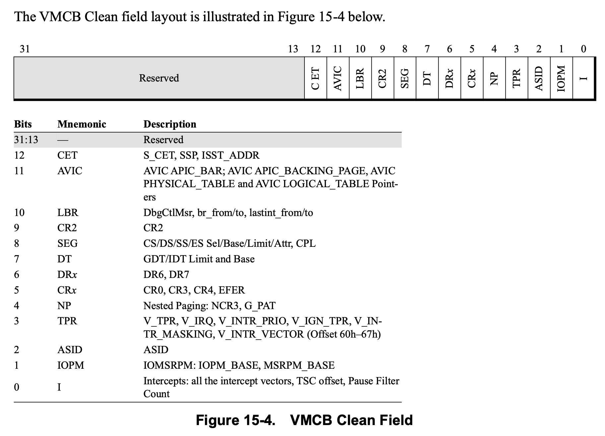

> 文章主要来自AMD sdm `15 Secure Virtual Machine

## overflow

SVM 提供了由硬件扩展，旨在实现高效, 经济的虚拟机系统。其功能主要分为
virtualization support 和 security support, 概述如下:

* virtualization support
  + memory
    + guest/host tagged TLB
    + External (DMA) access protection for memory
    + Nested paging support
  + interrupt virtualization
    + Intercepting physical interrupt delivery
    + virtual interrupts
    + Sharing a physical APIC
    + Direct interrupt delivery
  + CPU virtualization: guest mode && host mode
    + switch
    + intercept: ability to intercept selected instructions or events·
      in the guest
* securitry support
  + Attestation: SKINIT
  + Encrypted memory: SEV, SEV-ES
  + Secure Nested Paging: SEV-SNP
## CPU
### Enabling SVM

虚拟化扩展指令

* VMRUN
* VMLOAD
* VMSAVE
* CLGI
* VMMCALL
* INVLPGA

执行需要`EFER.SVME` 被设置为1, 否则执行这些指令将会产生`#UD`.

另外
* SKINIT
* STGI

指令执行需要
+ EFER.SVME 设置为1
+ CPUID Fn8000_0001_ECX[SKINIT] 设置为1

否则执行也会产生`#UD`

在使能SVM之前，如那件需要如下判断SVM是否能被enable.

```
if (CPUID Fn8000_0001_ECX[SVM] == 0)
    return SVM_NOT_AVAIL;

if (VM_CR.SVMDIS == 0)
    return SVM_ALLOWED;

if (CPUID Fn8000_000A_EDX[SVML]==0)
    return SVM_DISABLED_AT_BIOS_NOT_UNLOCKABLE
// the user must change a platform firmware setting to enable SVM
else 
    return SVM_DISABLED_WITH_KEY;
// SVMLock may be unlockable; consult platform firmware or TPM to obtain the key.
```

### VMCB

VMCB中即包括了guest上下文，也包括了用于vmm控制guest的配置信息。主要包括:

* 在guest 中要拦截的一些列的instruction or event
* 各种控制位用于指定guest 的execution envirionment，或指示在运行来宾代码之前需要采
  取的特殊操作，以及
* guest processor state (例如, 控制寄存器)

VMCB位于内存中, 某些指令和事件会根据vmcb构建guest上下文，或者将guest上下文writeback回vmcb，完成host和
guest之间的切换, 我们下面详细介绍

#### VMRUN and #VMEXIT

使用VMRUN指令操作数需指定一个VMCB地址, 即`rAX`, 在`VMRUN`时, 会从`rAX`指向的VMCB
内存中，先将当前cpu状态保存下来，然后再将部分字段load到当前CPU的上下文，
将全部cpu 状态load后，就相当于进入guest了。

具体操作是:
* remember VMCB address(rAX) for next #VMEXIT
* save host state -> `VM_HSAVE_PA` MSR
* load control information
  + intercept vector
  + TSC offset
  + interrupt control
  + EVENTINJ field
  + ASID
* load guest state
  + ES, CS...
  + GDTR IDTR
  + CRxxx

**此时，cpu context 已经是guest**

* execute command store in TLB_CONTROL
* 
  ```
  IF (EVENTINJ.V)
   cause exception/interrupt in guest
  else
    jump to first guest instruction
  ```
上面的某些信息，在这个过程中会替换掉当前host的上下文, 如GDTR. 但是某些字段是
不属于cpu context的, 例如`control information`, 这部分就相当于专门的cpu cache。
目的是:

vmcb中的这些字段在guest中可能会频繁访问，例如, intercept INTR control field,
在每次外部中断到来时, 都会使用该字段。为了加速, 虚拟机运行时的性能，在VMRUN指令
执行时，会将`VMCB`中的大部分字段，加载到cpu内部的cache中.

如下图:


从上图可知:
* VMCB的cache以该VMCB在内存中的base physical address为tag, 在VMRUN时，会将
  VMCB load到memory
* 当intecept 某些events时，可能会从触发 `#VMEXIT`. 这时，会将VMCB cache 
  writeback 到memory
* VMCB cache，并不是cache了 VMCB 全部, 包括:
  + interrupt shadow
  + Event injection: 事件注入相关信息，在 `VMRUN` 时, 获取一次，并在进入guest之前，注入该event, 
    在之后guest运行过程中，不再需要这个字段, 所以这个信息没有必要cache
  + TLB Control: 和上同理
  + RFLAGS, RIP, RSP, RAX: CPU: CPU 上下文信息, 这些信息在#VMEXIT后，很可能会改变，并且
    这些字段是load 到cpu context的。所以没有必要cache.(猜测)


另外, 在`VMRUN`和`#VMEXIT`时，需要save，load host state。这些CPU也做了相应的
类似于VMCB的cache。手册中的描述如下:

> Processor implementations may store only part or none of host state in the
> memory area pointed to by VM_HSAVE_PA MSR and may store some or all host
> state in hidden on-chip memory. Different implementations may choose to save
> the hidden parts of the host’s segment registers as well as the selectors.
> For these reasons, software must not rely on the format or contents of the
> host state save area, nor attempt to change host state by modifying the
> contents of the host save area.


大致的意思是, 处理器可能会store 部分或者不会store 由 VM_HSAVE_PA MSR 指向的 
host state,  并可能将部分或全部主机状态store 在 on-chip memory中。不同的实现
可能会选择保存主机段寄存器的隐藏部分以及选择器。因此，软件不能依赖于主机状态
保存区域的格式或内容，也不能通过修改主机保存区域的内容来尝试更改主机状态。

所以，guest host上下文切换，主要涉及 `VMCB -- VM_HSAVE_PA` 中包含的上下文
内容的切换, 但是某些event只需要简单处理后，又继续返回guest执行。这样就没有
必要切换一些寄存器。（使用guest的即可)

另外在大部分的场景下，在多次`VMRUN`, `#VMEXIT`期间, `VMCB`中的很多字段并没有改变。
为了加速guest, host的切换. `SVM`支持控制某些字段在`VMRUN`时才会load.


上面提到的两种情况，amd通过如下方式解决:
* VMCB clean Bits
* VMLOAD, VMSAVE

##### VMCB Clean Bits

> 该功能在amd spec `15.15 VMCB State Caching`章节中有详细讲述

首先该功能在VMCB 新增了 `VMCB Clean field`(VMCB offset 0C0h, bit 31:0),
这些bit决定了在`VMRUN`时，需要load哪些register. 每个bit可能代表某个或
某组寄存器。该bit设置为0时，需要处理器去load VMCB到cache。
但是这些bit是hint, 因此processor可能会忽略掉厚谢被设置为1的bits，无条件
的从VMCB 中load。另外，当clear bits 设置为0时，总是需要load。

所以这样就需要vmm判断，在上次 `#VMEXIT`到本次`VMRUN`之间，有哪些字段改变了.
从而使用`VMCB clean field`完成高效的guest/host切换。

有一些场景需要VMCB clear field都被设置为0, 如下:

* 该guest第一次 run
* guest 被切到另一个cpu上运行
* hypervisor将 guest VMCB 切到另一个物理地址

上面提到过，VMCB cache时根据VMCB的physical address 作为tag去match. 当CPU
发现`VMRUN`指定的 VMCB physical address 和 cache中所有的 条目都不匹配时，
会将VMCB clean field 都当作zero.

VMCB Clean field 具体字段如下:



##### VMLOAD, VMCLEAN

在`VMRUN`包括`#VMEXIT`过程中，即使`VMCB Clean Bits`都设置为0, cpu也不会
将所有的字段全部load/save, 需要通过额外的指令

* VMLOAD
* VMSAVE

这些字段包括:
* FS, GS, TR, LDTR (including all hidden state)
* KernelGsBase
* STAR, LSTAR, CSTAR, SFMASK
* SYSENTER_CS, SYSENTER_ESP, SYSENTER_EIP

这样做的目的是，为了快速的完成guest和host的切换, 来处理一些简单的event,
虽然在实际的KVM代码中，并没有这样做。

> NOTE
>
> 可以参照SVM的代码, `svm_vcpu_enter_exit`中关于vmload和vmsave
> 指令的使用.
>
> kvm选择在`VMRUN`之前，无条件的执行`VMLOAD guest vmcb`，在
> `#VMEXIT`时，`VMSAVE guest vmcb`, `VMLOAD host save area`<sup>2</sup>
>
> 但是手册中并未找到关于`MSR_VM_HSAVE_PA`指向的`host state`
> 的格式。所以, 这里猜测`host state`格式和`vmcb`相同.
{: .prompt-info}

### intercept
关于cpu虚拟化中，比重最大的部分，就是intercept。host通过 intercept guest中
的敏感行为，trap到host，然后由vmm进行emulate后，再次进入guest。

intercept operation主要分为两类:
* Exception intercept:
* instruction intercept:

当发生了intercept时，需要将VMEXIT的reasion，还有一些其他的信息
传递到host, 这些信息被写在:

* EXITCODE: intercept的原因
* EXITINTINFO: 当guest想要使用 IDT deliver interrupt or exception
              时发生了intercept，这时需要有一个地方保存着该信息，
              以便处理完该event之后，再次向guest注入 interrupt/exception
* EXITINFO1, EXITINFO2: 提供了某些intercept的额外信息

intercept就意味着需要保存guest state，并切换到host state，那该从哪个点保存
guest state呢?

这个和host上触发exception or interrupt的需求是一样的，都需要保存一个上下文
切换到另一个上下文, 而host上触发excp/intr 是发生在指令边界处. (在
[interrupt and exception context switch](#interrupt-and-exception-context-switch)
章节中介绍了host触发excp/intr的逻辑)

而 intercept 的逻辑也是这样，也是在指令边际处来切换. 但是其和host 上切换逻辑
不同的是:

|不同点|host| guest intercept|
|---|---|---|
|是否切换|根据当前cpu的状态|结合cpu状态以及vmcb control field|
|切换信息量|fewer register and non-visible state| more register and non-visible state|
|切换信息方式|stack->cpu|cache -- vmcb -- host state|

所以综合来看，intercept的整体要复杂, 其代价更大, 所以现在虚拟化主要的优化方式，
就是在硬件中emulate，减少vmm intercept.

关于intercept的细节有很多。不同的intercept event的触发条件，相关control field，
以及EXITCODE/EXITINFO 均不同，我们不再这里描述。

## memory

内存虚拟化我们这里主要关注两部分
* nested page Table
* TLB

## 参考链接
1. amd spec
2. [KVM: SVM: use vmsave/vmload for saving/restoring additional host state](https://patchwork.kernel.org/project/kvm/patch/20201210174814.1122585-1-michael.roth@amd.com/#23839851)

## 附录

### interrupt and exception context switch

interrupt, fault exception 和trap exception 其上下文切换都是发生在指令边界处，
这样做的好处，是明确规定了上下文切换的点，让指令执行原子化，方便软件进行处理.

但是三者的机制不太相同。分别来看:

#### interrupt


当APIC发出一个interrupt后(我们这里以maskable interrupt为例), cpu会在指令边际处检查
是否有pending的中断, 会根据当前的cpu状态评估(interrupt window)，要不要接收该interrupt, 
如果接收, 就向apic 要详细的中断信息，然后通过IDT进行上下文切换（当然不仅仅是IDT，还有
其他desc中的信息，这里不赘述)

#### fault


fault一般是指令执行过程中，发现该指令执行的有问题，例如，`#PF`是在寻址过程中，发现
page table walk 出现了问题，但是此时该指令还未执行完成，所以需要将cpu恢复到该指令
执行之前的上下文，然后，deliver一个exception

#### trap


trap的处理十分简单，如上图所示，trap的触发是通过trap指令，该指令的作用就是在该指令
之后的位置，挖一个坑，该坑通往处理该trap的异常处理程序。当异常处理程序返回时，执行
trap指令的下一条指令。
