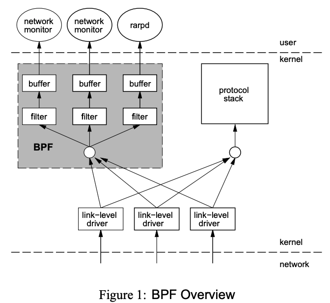

## BPF 起源

BPF 起源于1992, Steven McCanne 和 Van Jacobso 发布了论文: `<<The BSD Packet
Filter: A New Architecture for User-level Packet Capture>>`1, 该论文
主要提供了一种包过滤的技术，比其当时的包过滤技术快20倍.1 abstract.

该包过滤技术和原有的包过滤技术最大的不同是:

**原有的包过滤技术, 过滤步骤发生在用户态, 也就是说，如果要对包进行过滤，需要
将** 所有  **包传给用户态，然后，在用户态使
用规则进行过滤。**

而 bpf 则将过滤这个步骤放到了内核态, 在内核态过滤后，将过滤之后的数据，传递给用
户态。避免了不必要的数据copy.

由上图所示, 假如我们在用户态需要获取`port=3000`的所有tcp报文, 在传统模式下，
即便是`port != 3000`的报文也需要copy到用户态。但是在bpf模式下，bpf会在kernel侧
进行过滤动作，让`port = 3000`的报文筛选出来，然后copy到用户态, 这样就避免了
一些不必要的copy。

bpf模式下，包过滤的整体过程如下:

 

> From 1

网卡收到包后，先将数据包额外copy一份, copy的副本主要用于包过滤+传递到用户态.
而原来的包则走协议栈。该数据包会先交给BPF的程序进行处理, 而该BPF程序的作用就是
根据用户的规则过滤报文，然后如果匹配成功，再将该报文copy到用户空间。

那这里就暴露了一个问题, BPF 是如何根据用户的规则来过滤呢 ? 我们可以想到的是，
通过ioctl()等系统调用，传递过滤规则，但是这样太不灵活了。而BPF则是通过插庄
代码的方式来实现。这样就相当于在内核态中编程过滤。大大提升了灵活性。但是
问题又来了, 让用户态可以在内核态编程，这不就赋予了用户态无限的权力？可以
access 系统中的任意资源 ?

## BPF 虚拟机

## 相关链接
1. [The BSD Packet Filter: A New Architecture for User-level Packet Capture](https://www.tcpdump.org/papers/bpf-usenix93.pdf)
2. [eBPF (作者分析了bpf的起源)](https://zhuanlan.zhihu.com/p/621154363)
3. [ebpf.io](https://ebpf.io/what-is-ebpf/)
4. [eBPF 的发展历程及工作原理](https://blog.csdn.net/weixin_42136255/article/details/133497773)
5. [eBPF 运行原理和流程 -- 极客时间 eBPF 核心技术与实战 的学习笔记](https://www.cnblogs.com/chnmig/p/18587322)

## 其他
4. [包含论文](https://blog.csdn.net/weixin_42136255/article/details/133497773)
