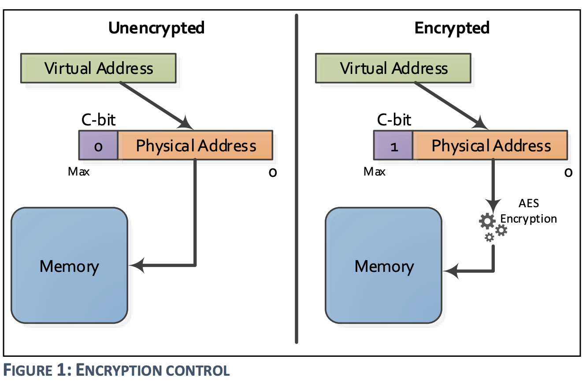
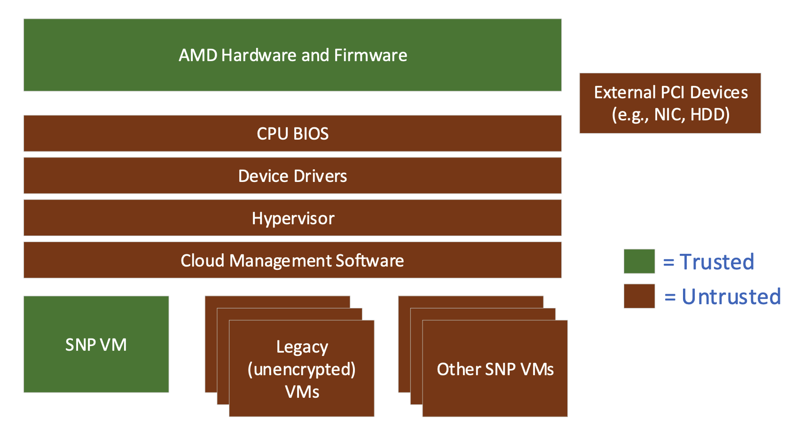
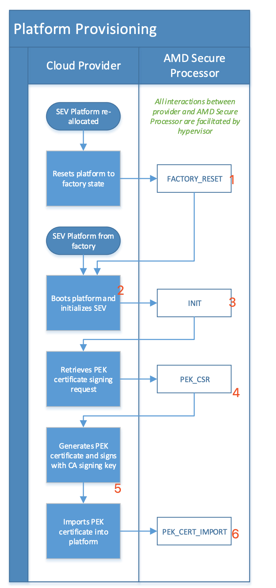
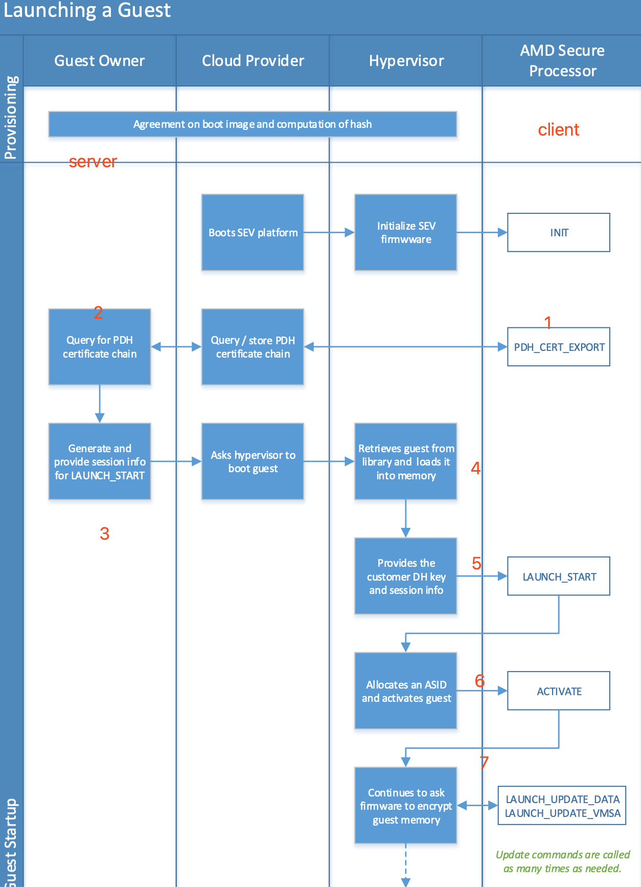
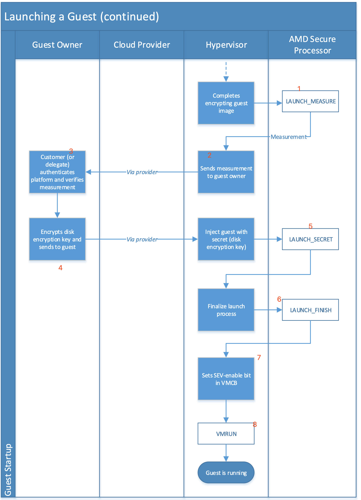
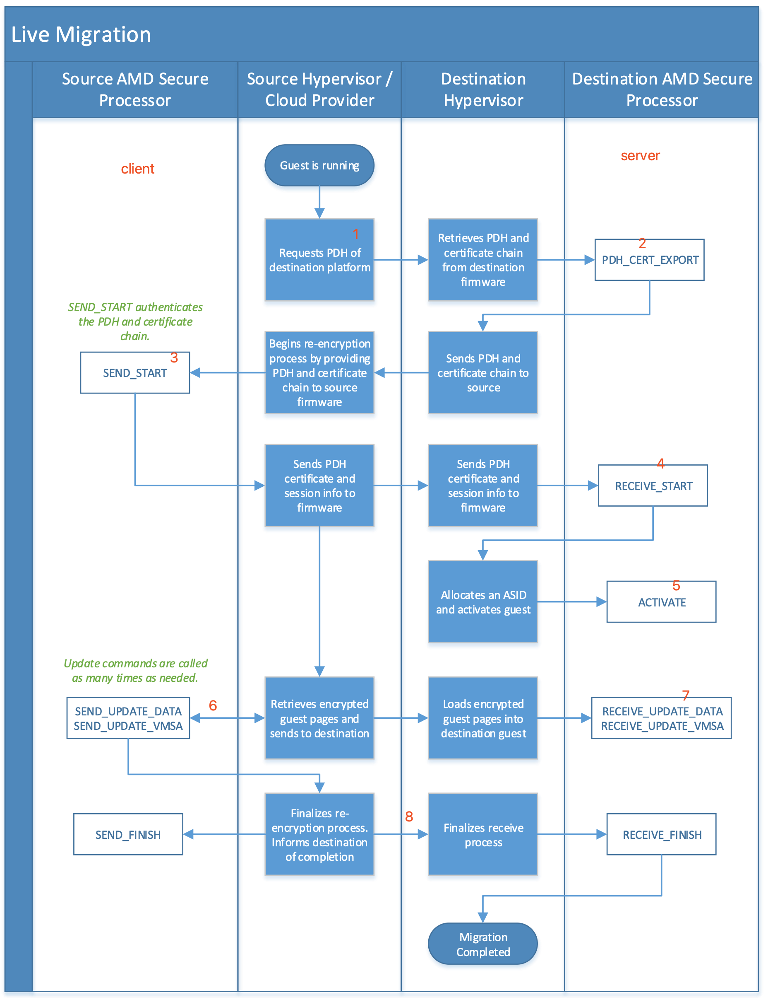
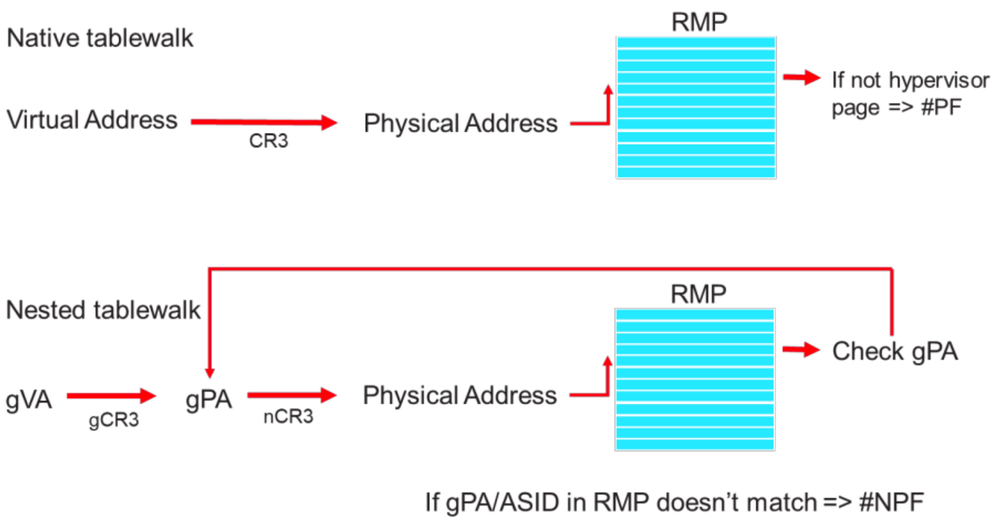
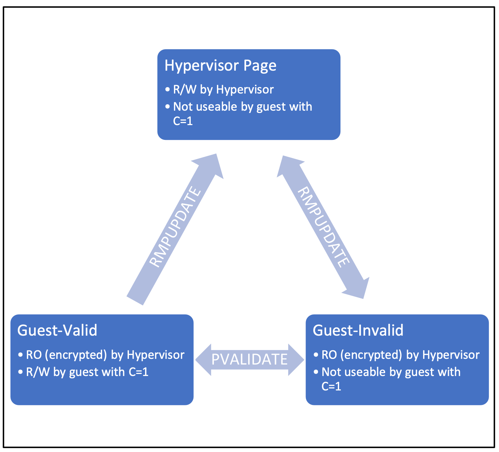
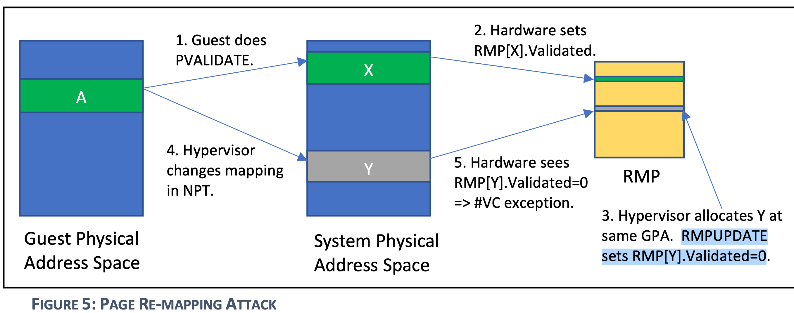

> 本文是对<sup>1</sup>的高仿，但是劣质版本，非常建议去阅读下huangyong的文章

## 背景

在云环境中有两类角色:

* platform owner : 云厂商
* guest owner : 租用云厂商的用户

云厂商负责提供云基础设施, 为用户构建出一套"属于自己的" 计算存储网络，
同时需要保证云基础设施足够优质来吸引用户。

而租户则是使用云厂商提供的云基础设施，来跑自己的业务，在云场景下，
租户只需要关心云环境中的业务，而无需关心云基础设施的层面的问题，
例如: 云主机的网络波动，硬件老化等等。

而云环境下的安全也是platform owner的一个重要服务，而guest owner，只能选择信任
云厂商提供的安全防护功能。但是, 总有防不住的时候，一旦platform owner的
的防线被击穿，其上面运行的guest都会有风险，而由于host有足够的权限，并且
其操作对于guest而言都是透明的，所以对于一些数据敏感的guest owner而言，
这种安全风险不能接受。

前面也提到, platform owner 也想提供更优质的服务来吸引用户。而安全防护也是
一个很重要的服务。但是软件防护总是限制的, 而能不能通过在硬件层面来保证，
在host 安全组件被击破后，还有一道硬件防线，可以防止guest不被攻击。AMD SEV 
提供了该解决方案。

简单来说，AMD SEV 主要提供了一个隔离方案，让host无法观测到guest的行为，
同时提供给 guest 一些接口，可以让 guest 来验证，自己是跑在一个安全的
AMD SEV 环境。

另外, 对于提供sev功能的云厂商来说，既希望提供给用户这个功能，也希望
能像传统虚拟机一样管理sev虚拟机的生命周期. 例如:

* 启动
* 关闭
* 迁移
* 快照

## overflow

在介绍`SEV`之前, 我们先来看下传统虚拟机。

在传统架构中，有两个角色, Hypervisor和guest, Hypervisor, 几乎可以
访问虚拟机所有的位置的数据，还可以修改虚拟机运行上下文:

* MEMORY
* REGISTER
* DISK

所以，在SEV中, 就是要限制Hypervisor的权限, 不能让host随意获取到guest
中运行的数据，甚至不能恶意模块修改. 最直接的方法就是数据加密.而在SEV 
引入之前，AMD CPU支持通过SME功能来加密内存, SEV 则是在原有SME功能基础
上进行了进一步扩展, 通过虚拟机的VSID 作为keyid，来查找相关key，进行加密,
内存加密部分我们放在 [SME]() 章节中介绍.

另外, guest需要一种方法可以确认，自己所处的环境是一个安全的, 可以
被信任的环境。AMD是通过证书链认证实现的, 这部分内容我们在[证书链]()
章节中介绍。

而对于hypervisor来说，其负责管理guest的生命周期，资源分配. 而由于sev 在
guest 生命周期中附加了一些额外的操作，这些需要hypervisor 于sev fw交互, 
所以需要一组API，这些API执行的时候需要一个通道. 这些内容我们放到API章节中
介绍, 并且在该章节中，我们会介绍部分API.

前面提到的主要是guest内存的加密，然而有这些是不够的, 仅能防住GUEST内存不被
host看到，但是不能防止host篡改，为了达到这种防护，AMD引入了SEV-SNP, 来实现
guest, host 内存隔离。而最后，我们也结合AMD SEV-SNP的原理，以及hygon CSV
代码，来猜测hygon CSV3 内存隔离的实现.

## SME

Secure Encrypted Virtualization (SEV) 功能允许在VM运行期间，透明的
加解密内存，并且每个VM加解密时，可以使用他们独有的key(密钥)。实现方式
是在memory control 中实现一个高性能的加密模块，该加密模块可以编程多个密钥，
用来给不同的虚拟机使用。



<details markdown=1>
<summary>cache in SME, SEV</summary>
在SME使能过程中，我们假设带C bit来访问内存，首先会从内存中获取秘文，然后由加密
模块解密，最终递交给CPU。但是，cache中是如何存储的呢?

实际上，cache中存储的是明文。所以，假设我们多次访问一个内存，后续的访问则会从
cache中直接获取，而并非从内存中获取秘文再解密。

但是，这实际上引入了一个问题，C-bit是存储在Page Table中。而我们完全可以建立两个
映射，一个带有C bit, 一个不带有C bit，如下图所示:


这样的话，cache缓存的究竟是明文还是秘文呢? 假设我们都要存储的话，是不是会遇到重名
的问题。

AMD工程师采用了一个非常聪明的做法, 将虚拟地址的最高位作用来标记C-bit，这样缓存
一个地址的明文秘文就不会遇到重名问题.


但是我们设想下，在SEV中，该技巧还能不能奏效...

A: 不能！为什么? 因为使用这种方法有代价，就是需要牺牲物理地址空间。C bit作为单bit
牺牲掉物理地址的一个bit，造成物理地址空间范围减少一半，可以接受。但是VSID是多位
(16-bit), 会大大减少虚拟机物理地址空间。我们设想下，假设物理地址空间为48bit.
`48-16 = 32`, 相当于虚拟机变回了32位.

</details>

在AMD后续的实现中，除了对内存加密外，还实现了其他额外的功能:

* SEV-ES : 寄存器加密
* SEV-SNP : 将host和guest内存隔离

<!--
> TODO
{: .prompt-info}
-->

## KEYs

### 证书链

上面提到，虽然guest可以感知到自己的内存是加密的，但是如何保证hypervisor 不能解
密呢? 换句话说，guest在一个对外完全封闭，对内四处漏风的环境内如何验证自己的
环境符合一定的安全需求.

举个例子, 我们去买一个手机, 手机厂家说, 这手机遥遥领先, 满载跑起来温度不超过50度。
作为聪明的消费者, 我们当然不信，于是我们打开B站权威（没有收钱）的up主的评测, 去
验证手机厂家说的话是否属实。

而guest就像是消费者，云厂商中的基础设施就像是手机厂家, 其几乎不信任基础设置中
的任何组件。所以，需要有一个权威机构保证某个东西完全没有问题，这样guest可以
完全信任该组件。并无忧无虑的和其通信。



上图是SEV架构下，guest 信任者的示例图，在上图中, guest 除了`AMD hardware and Firmware`
谁都不信。而`AMD hardware and Firmware`作为最底层的硬件, 而且用户对其足够信任(如果不信任,
就不会买了), guest将其做为唯一的信任者, 这很合理，但是这又是很理想的情况。为什么呢? 
需要大家思考几个问题:

* <font color=red>guest如何知道自己运行的环境就是`AMD`牌子的`haredware and Firmware`, 而不是`DMA`牌.</font>
* <font color=blue>guest owner 有时会和platform的安全处理器建立安全信道进行通信(例如导入磁盘密钥),
    如何保证在 hyp参与的情况下，该信道仍然是安全的</font>

SEV通过证书链机制，实现上面的需求，我们来看下具体的细节

#### keys and certificate

在整个的证书链中，包含很多的keys，这些key之间存在一个认证链，我们先把
整个关系展示出来，在分别介绍:


* **ASK, ARK**:

  ask 是amd的信任根，其签名表示AMD的真实性. 使用ARK私钥对ASM公钥进行签名.
  ark 是一个中级密钥，使用ask私钥对cek进行签名.

* <font color=red size=5><strong>CEK:</strong></font>

  cek 用来对pek进行签名，从而将pek锚定到amd的信任根, 每个芯片都有一个唯一的
  cek，关于该密钥km spec中的描述如下:
  ```
  Each chip has a unique CEK which is derived from secrets stored in 
  chip-unique OTP fuses. The lifetime of this key is the lifetime of 
  the individual chip.
  ```
  OTP 熔丝是一种硬件技术，用于在芯片制造过程中或之后存储永久性数据。这种数据一
  旦写入，就无法修改或删除，因此可以用于生成独特的、不可复制的密钥。这种机制确
  保了每个芯片的 CEK 是唯一的，并为芯片的安全功能提供了一个信任基础。

  <font color=red><strong>所以, 将CEK公私钥封装到芯片内部，同时，又使用ASK私钥对CEK公钥签名生成证书，保存在
  AMD厂商，这样就相当于把该机器锚定了amd的信任链. 所以, CEK 是固件可信的起点(回答了第一个疑问)</strong></font>

  那怎么验证cek是否有效呢??

  可以让硬件对使用cek私钥另一个公钥进行签名，生成证书，然后，使用厂商的cek证书中的公
  钥对其签署的证书，进行验签，如果验签成功，说明CEK没有问题，同时也能说明CEK签署的证书
  也没有问题。

  那签署的是什么证书？有何作用?
* **OCA**:

  OCA证书是自签署的, OCA私钥用来签名PEK, 用来表明PEK是经过platform owner签署的. 
  该OCA密钥对以及证书生成的方式，我们放到下面的章节中介绍

* **PEK**, <font color=blue size=5><strong>PDH</strong></font>:

  PEK 是由固件创建，由CEK和OCA(下面介绍) 双签名，其作用是对PDH进行签名。

  PDH 使用椭圆曲线Diffie-Hellman(ECDH)算法密钥。PDH主要用于SEV fw和其他外部实体（guest owner)
  协商一个住密钥，然后使用这个主密钥通过 key derivation function(KDF) 来建立起一个可信通道。

  <font color=blue><strong>所以，使用该可信通道，就可以让Guest owner和set fw在穿过hypervisor的
  情况下, 安全的通信</strong></font>

### other keys

SEV 可以在不信任的环境中，建立一个可信的通信通道. 需要下面key来保证。

* **_TIK, TEK_**: 用于在不安全信道中传输数据
  + **TEK**: AES-128 encryption key
    + SEV fw 使用该key 加密所有的 confidential
      information 在fw和外部实体(例如guest owner/anthor SEV fw)中传输
  + **TIK**: HMAC SHA-256 integrity key. 
    + SEV firmware 使用TIK来验证在 sev fw和外部entity之前传输的受保护的信息。

  + SEV firmware 在发送方操作流程中生成，由firmware 生成一个TEK/TIK, 固件会
    <font color=red size=4><strong>从安全的熵源生成 TEK, TIK</strong></font>。
  + SEV fw 在 launching and receiving 相关工作流中会导入该 WRAPPED TEK, TIK
    > 下面会介绍 WRAPPER TEK

* **_KEK, KIK_**: 用于在不安全信道中传输 `TIK, TEK`
  + **KEK**: AES-128 encryption key
    + used to wrap TEK and TIK during session establishment
  + **KIK**: HMAC-SHA-256 key
    + used to wrap the TEK and TIK during session establishment(integrity)
  + SEV fw <font color=red size=4><strong>通过密钥协商协议中协商得到的主密钥
    （master secret）推导出 KEK, KIK（密钥加密密钥)</strong></font>
* **_VEK_**: AES-128 encryption key.

  VEK的作用是: 在guest运行时，加密guest 内存. SEV fw 从一个安全嫡中生成 VEK. 并且
  在热迁时，源端目的端应使用不同的VEK. 所以remote platform 应该自己重新生成一个
  VEK.

> NOTE
>
> 我们来思考下，`VEK`作为虚拟机内存加密使用的key，不用做对外传输（热迁时也不迁
> 移该key). 而`TEK, TIK` 用作传输过程中传输"秘密数据"的加密通道的重要工具。其是
> 在建立加密通道时创建的。然而我们在receive 端确认，`TEK, TIK` 是由 "真的" SEV fw
> 生成的呢?
>
> 从信任链我们知道, 信任链的底端是PDH。用于加密 TEK, TIK的KEK 是通过master
> secret 派生的。而master secret 又是通过两方的 PDH 派生而来. 所以整个的链条延伸
> 如下:
> ```
> SEV-fw -- gen --> TIK, TEK
> SEV-fw -- PDH keys -- calc--> share secret -- KDF --> master secret --KDF--> KEK,KIK --wrapper--> TIK, TEK
> ```
> 我们来看下细节

### SEV fw establish TRUSTED channel

SEV firmware 需要在他自己和remote party之间建立起安全信道. 其中有两个角色:
* server: SEV firemware issuing lanch and receive command
* client: guest owner 和其 SEV firmware issuing send command


大致流程如下:
* client server 交换 ECDH  public key, 同时client 生成一个随机数N，并发送给server
* client server 通过 对方的 ECHD public key和自己的 ECHD private key 生成 share
    secret, 然后在通过 KDF(share secret, N) 生成master secret.
* client 通过master secret 派生出 KEK, KIK, 并生成用户传输加密验证的密钥:TIK,
    TEK
* client 通过KEK 将 TIK, TEK wrap 加密，并发送给server
* server 端也通过 master secret 派生出相同的 KEK, KIK. 并使用该密钥解析WRAP_TK,得到
  TEK, TIK
* 之后，server client，就可以使用 TEK, TIK 进行安全通信.

其实整个过程就是达到的目的是，即验证了对方的身份(PDH pubkey)，同时又将client端
生成的用于安全传输的密钥(TEK,TIK)传递到server端.

这里面牵扯到一个事情，就是双方都有一个密钥对的基础上，如何安全的传输数据.
(例如 WRAP_TK数据), AMD SEV 采用一个通用的方法来实施，我们下面介绍:

### Data Protection
执行data protection 需要下面输入参数:
* **_IV_**: 128-bit initialization vector
* **_K_**: A 128-bit encryption key(e.g., KEK)
* **_I_**: A 128-bit integrity protection key(e.g., KIK)
* **_M_**: A message to protect(e.g., WRAP_TK)

SEV key api  spec 规定，不同的message 不应该使用相同的 IV 和 K 保护。
但是使用不同的K可以使用相同的IV(这条在SEND_START command中有用到)

加密规则:
```
C = AES-128-CTR(M; K, IV)
MAC = HMAC-SHA-256(IV || C; I)
```

client 需要发送 C, MAC, IV 到server端，以便server端用来恢复明文。


## API overflow

### channel of [software, fw]

对这些密钥的管理，以及vmm和guest VM memory 之间的安全数据的传输，是通
过处理器中的SEV firmware处理。host hyperivor 和 sev fw之间通信是通过
一些API<sup>3</sup>.

同时guest有时需要外部能访问到非加密数据, 例如DMA，所以在guest中，某些
memory operation 是不需要使用key加密的。如下图所示:


在上图中，guest可以控制页表的c-bit来控制哪些页在访问时, 需要被加解密.
在sev-snp中，这个行为会更复杂，我们先不关注。总之，driver 可以使用API
来管理key，但是获取不到guest key。而运行在guest时，则会使用guest key
在访存操作时，进行数据加解密。

所以, 软件如果要配置 sev 功能，需要通过 sev 提供的一组API。

API包括:

* Platform Management API: 用于platform owner配置平台和查询平台范围内的数据

* Guest Management API: 在整个客户机生命周期中管理 `Guest Context`

而SEV driver 通过SEV fw给定的方式, 向fw发送命令请求。目前支持两种通信方式:

* Mailbox mode: 最初的固件
* Ring Buffer Mode: 0.24+ 固件

其中, Mailbox Mode是通过MMIO Register实现，而Ring Buffer Mode而是在内存中
划定了一块ringbuffer，需要先通过 Mailbox方式下发 `RING_BUFFER` 命令进入。

### PLATFORM API USAGE FLOWS -- Platform Provisioning



1. 执行 `FACTORY_RESET` 恢复出厂设置.
2. 厂商请求 初始化 SEV
3. platform执行INIT
4. 厂商请求 PEK 签署, platform 执行 PEK_CSR 生成 CSR
5. 厂商生成 PEK cert, 并用 CA signing key 签署(OCA)
6. platform 执行`PEK_CERT_IMPORT`进行 PEK_CERT，以及OCA CERT导入

### GUEST API USAGE FLOWS --  LAUNCH GUEST



该过程有guest owner参与, 而首先要做的, 是在guest owner(server)和 AMD
secure processor(client)之间建立加密通道. 以便后续guest owner 和 client侧
传输数据(measure 等信息)

1,2. guest owner 向 client请求 导出PDH 和其他相关证书, client通过
PDH_CERT_EXPORT 导出.

3. 生成LAUNCH_START session 相关信息

   > NOTE
   >
   > 见" SEV fw establish TRUSTED channel" 以及见 SEV KS API "LAUNCH_START" cmd
   > 主要包括:
   >
   > ```
   > NONCE
   > server PDH
   > WRAPPER TK, IV, MAC
   > ```
4. 将guest(固件)加载到内存中
5. 根据DH key 和获取到的session info, 执行LAUNCH_START命令
6. 调用ACTIVATE 命令，将ASID 和虚拟机（KEY）绑定
7. 调用LAUNCH_UPDATE_DATA 加密 guest memory



1. 将所有load内存都加密后，调用LAUNCH_MEASURE 对该内存进行测量
2. 将测量结构发送给guest owner
3. 认证platform 并验证测量结果
4. 将磁盘密钥发送给guest
5. host 通过LAUNCH_SECERT 将磁盘密钥注入到guest
6. 调用LAUNCH_FINISH结束launch流程
7. 在VMCB中使能 SEV-enable bit 来为该虚拟机开启SEV功能
8. 调用VMRUN启动虚拟机，进入guest


### GUEST API USAGE FLOWS -- LIVE migration



该过程相当于source端为client，dest端为server。在source和dest之间建立起
一个加密通道。

1. 向server端请求PDH
2. server端执行 PDH_CERT_EXPORT 命令导出PDH和其他相关证书
3. 调用SEND_START, 

   该命令要求输入目的端 platform的证书链:
   ```
   ARK->ASK->CEK-- +--> PEK
                   |
             OCA---
   ```
   以及PDH

   SEV fw会使用证书链验证 PDH, 验证成功后，生成session 相关信息
4. 将session相关信息发送给目的端，目的端通过 RECEIVE_START 命令
   加载

   receive 民营没有这么复杂，只需要输入source端 PDH 以及source端
   生成的session info即可.
5. dest端调用ACTIVATE
6. source端调用SEND_UPDATE_DATA, 将source guest memory导入到一个内存中，
   注意该内存，被SEV FW 使用 VEK 解密，并使用TEK 加密, 并使用 TIK 摘要
7. **dest 端 调用 RECEIVE_UPDATE_DATA, 将传过来的guest memory 导入到dest guest
   memory 中, 注意该内存以被 SEV fw 通过 TEK 解密，并通过dest guest VEK 
   加密**
8. dest，source端调用相应 FINISH 命令结束热迁移过程

## 其他流程

### "远程"(近程)证明

根据LAUNCH process 的流程中可知，在guest launch 过程中，guest owner 可以通过
guest发送过来的相关证书，以及摘要来验证guest 是否在可信环境中。如果处于安全环境，
guest owner 将指示 vmm 来执行后续操作。

但是这个环境比较繁琐。于是, hygon 修改了SEV 的 ATTESTATOIN 命令，并且搞了一个
单机版的工具，来验证guest是否处于安全环境验证。


该工具在guest 用户态执行，通过调用VMMCALL指令，将`userdata, mnonce, hash`等数据传输
到kvm侧。注意，此时kvm看到的是密文，通过 ATTESTATION 命令，将该内存传递到CSV FW
中。

CSV FW 填充report信息到该内存, 其中userdata 是 guest 传递过来的userdata，并通过
PEK进行签名。此时，CEV fw 返回到kvm，kvm看到的仍是密文。

而guest 调用VMMCALL 返回，看到的是明文。可以通过证书链验证PEK证书的合法性。
并且通过PEK 证书对证书信息进行验签，和SIG1 进行比对，如果验签成功，说明
<font color=red><strong>该数据被 合法的csv fw 处理过</strong></font>. 证明了
当前guest处于安全环境中。


## page isolate

### SEV-SNP

#### RMP

SEV SNP 使用RMP机制，来划分这部分内存的归属. 每个page对应一个 RMP entry
`RMP.Assigned`字段会比表明这个配置是owned by guest, 还是 owned by host.


关于page own:

* host cpu memory access 和iommu memory access 都将当前的执行者认为hypervisor.
* RMP.Assigned = 0 包括 guest owned page 和 AMD-SP owned page(e.g. RMP page)两种
  类型

关于memory access check:

* 当 CPU (guest or host) 使用访存指令访问内存时, 通过MMU pagetable walk后, 获取到
  HPA, 将该HPA传递给SEV fw, 然后fw 会去查找RMP table, 查看该page owner
  和 本次访存的角色(guest host) 是否一致. 如果不一致:
  + GUEST: trap #NPF
  + HOST: trap #PF
* 当 设备通过 DMA 访存时，该 TLP 到达 root complex后，被IOMMU拦截, IOMMU 使用
  IOMMU pagetable 将 IOVA转换为 PA, 让后将该PA传递给 SEV fw, 同样的fw会查找RMP
  table。
* 对于memory access 限制，只限于write access, 因为read access 有AES DEC保护。

为了防止host更改guest映射(e.g., guest的本意是 GPA1->HPA1, 结果被hyp更改为GPA1->
HPA2), guest memory access check会额外检查RMP.GPA是否和本次pagetable walk获取的
GPA相同, 如果不相同，则认为guest受到攻击，触发NPF:



#### PAGE VALIDATE

而page own不是一成不变的. host 通过`RMPUPDATE`指令, guest 通过`PVALIDATE`指令可以
修改page own.



首先说明不同的page state:
* Hypervisor Page: owned by hyp。可被hyp读写, 不能被guest 使用c=1访问
    （public page 下面会讲)
* Guest-Invalid: owned by guest, 但是未验证。**不可被hyp写** . 不能被guest 使用c=1访问
* Guest-Valid: owned by guest, 已经验证。**不可被hyp写** . 可以被guest 使用c=1访问

owner 变更:

* `hyp page -> Guest-Invalid` : HOST 调用 `RMPUPDATE`. 常用于启动虚拟机，after launch guest mem.
* `Guest-xxx -> hyp page` : HOST 调用 `RMPUPDATE`. 常用于关闭虚拟机.
* `Guest-Invalid -> Guest-validate` : GUEST 调用`PVLAIDATE`, 用于将GPA固定为private page.
* `Guest-validate -> Guest-Invalid`: GUEST 调用`PVLAIDATE`, 取消private page固定，为public 
  page映射作准备

> NOTE
>
> 这里牵扯到private page, public page的概念，我们下面会讲到。

我们来看如果hyp 更改 guest GPA->HPA映射会发生什么?



1. guest首先执行pvalidate 指令，将其GPA和HPA固定. 
2. hw 设置RMP[X].validate flag.
3. Hypervisor 分配了一个新的page 准备 re-mapping攻击, 调用 RMPUPDATE
   将该page所在的RMP GPA ASID 都更新为和RMP[x]一样的。
4. hyp 更改了NPT,将 GPA(A) 映射到了物理地址[Y]
5. 硬件检查RMP[Y].Validate = 0 说明物理地址Y没有被guest验证过.

> NOTE
>
> guest应该确保，其对每个GPA所在的page应该只执行一次PVALIDATE指令.

由此可见, HOST 调用`RMPUPDATE`的作用是管理guest page的生命周期，为GUEST 分配具体
的物理内存(另外，guest 销毁时, 也需要将其内存资源进行回收).


在RMP中:
* HOST执行的`RMPUPDATE`负责更改大部分字段, 如果`RMPUPDATE` 更改了上面紫色部分，
  则会clear `RMP.validate` 字段
  > 部分伪代码:
  > ```
  > IF ((OLD_RMP.ASID ^ NEW_RMP.ASID) ||
  >     (OLD_RMP.GUEST_PA ^ NEW_RMP.GUEST_PA) ||
  >     (OLD_RMP.PAGE_SIZE ^ NEW_RMP.PAGE_SIZE) ||
  >     (OLD_RMP.ASSIGNED ^ NEW_RMP.ASSIGNED))
  >   N = CPUID Fn8000001F_EBX[15:12]
  >   temp_RMP.VALIDATED = 0
  >   temp_RMP.VMSA = 0
  >   temp_RMP.PERMISSIONS[0] = FULL_PERMISSIONS
  >   temp_RMP.PERMISSIONS[1:(N-1)] = 0
  > ```
* GUEST执行`PVALIDATE`负责更改`validate`字段

而GUEST 调用`PVALIDATE`的作用是声明HOST 分配的这个page 是属于当前的GPA。HOST不能
擅自再通过调用 `RMPUPDATE` 更改映射关系.


这个机制很关键，相当于把最终的控制权交给了guest，让guest有能力管理其GPA是否要固
定。

### CSV3

回忆 `SEV-SNP` 的机制, SEV-SNP 机制主要靠 `RMP` , 而其作用主要分为两
部分:
* 确定 PAGE 的归属
* 将PAGE 和具体的GPA绑定，并且保证host无法更改

好，基于上面两点，我们来看下hygon CSV3.


#### CSV3 "RMP" -- SMCR


在`SEV-SNP`中 所有物理页是通过RMP table来决定page归属的。而在CSV3中，该方式有了一些
更改（个人认为是优化）。

* 首先通过 kernel cmdline 可以配置`csv_mem_percentage` 来决定，可以 用于csv3
    虚拟机的内存比例
* 在kernel引导早期，csv driver会在各个numa上, 根据`csv_mem_percentage` 预留内存，
  并使用`cma` 管理.
* 而随后，会调用两个csv cmd : `SET_SMR`, `SET_SMCR`, 个人理解，SMR 相当于告诉
  csv固件，这些内存将被 csv fw 管理. 而SMCR则是在 SMR中 isolate 一块内存, 
  用于管理使用。(个人认为相当于RMP)

但是256M内存非常小，并不能以page的的粒度去管理， 下面我们看下其管理机制.

#### CSV3 change to "GUEST-Invaild" -- SET_GUEST_PRIVATE_MEMORY


* 所有cma所在的地址空间范围（包括各个cma之间的空洞），被划分为8192个空间。个人猜
    测在 SMCR中，也划分为8192个object，每个 object 管理一个physical address
    space。所以，其管理的粒度 (假设1T内存的话，每个空间为128M)

* 而csv3 虚拟机分配内存时，每次分配的内存也是以相同的颗粒大小分配`[1T, 128M]`
* 通过上面的设计，可以猜测，SMCR的是多个page, 而非单个

当执行完 `SET_GUEST_PRIVATE_MEMORY` , 命令后，该page就归属成当前的虚拟机，host无
法再访问。所以该步骤相当于 `SEV-SNP`的`hyp page-> guest invalid page`的page state
的转变过程.

而`sev-snp`的功能除了决定page归属，还应该确保，guest内存在使用过程中不被host更改，
csv3如何做到呢?

#### CSV3 "PVALIDATE"  -- CSV3_SECURE_CMD_ENC/DEC


这里其实产生了一个矛盾，SMCR的管理粒度是一组page，而`PVALIDATE`的需求往往是一个page,
那SMCR目前的设计就无法满足`PVALIDATE`的需求。

确实是这样，然而csv3不用`SMCR`控制这些，那怎么做呢?

CSV3 `GPA->HPA`的映射是靠NPT page table, 那么直接把 NPT page table isolate，不让
Hyp 管理，由SEV fw 自己管理。所以NPT host就无法更改了。

这样做是非常省事! Hygon  csv3 不用在设计复杂的机制来验证guest 映射是否更改。而在
guest中也不用处理 `#VE` 这种异常类型.


所以，对于csv3虚拟机中，是有两套页表，一套是有CSV fw管理作为private 内存映射访问。
而另一套是由 KVM 管理，用于public 内存映射访问。

由于存在两套页表，guest在运行时，怎么决定使用哪套页表呢? 

我的猜测是先在 `isolate by CSV fw`管理的NPT中找，如果找不到，再从`NO isolate`的
NPT页表中找. 再找不到就报 `#NPF` 给KVM.

那么由于有public/private page 转换需求，就需要从guest 中支持执行某些命令来控制
csv fw 建立/取消 `isolate by CSV fw NPT mapping`.

在看这些之前，我们先看下，guest如何和csv fw 进行通信。

### CSV3 guest exec CSV FW command

> NOTE
>
> 可以想下AMD-SNP PVALIDATE 是不是需要和 SEV fw进行通信。个人认为不需要，因为
> RMP 是明文，CPU完全有能力修改这部分内存。所以其在guest中扩展了指令集。
>
> 但是CSV3不同。CSV3 隔离了这部分内存，CPU如果要支持必须和CSV fw进行通信.

CSV3 并没有扩展 指令集，而是设置了一个规则，让guest 可以和SEV fw 进行加密通信。


但是csv fw 作为一个 "PCI 设备", 在host中可以看到，在guest中并没有该设备，guest
又如何合其通信呢?


如上图所示，通过一个secure call pages 和 csv fw通信。这两个page一个有NPT映射，
一个没有NPT映射，有NPT映射的作为input page， 而没有NPT 映射的作为output page。

guest首先将需要执行的命令写入output page, 然后读取 input page，由于INPUT page没有
NPT映射，trap到KVM中，kvm调用 `UPDATE_NPT`命令通知 csv fw建立映射，而csv 观测到
该page是 secure call page后，执行 该page中的cmd，将resp数据放到output page中，
并将原来的input page接触映射，将output page 建立映射。
(此时output page, 和input page的角色已经互换）

而guest 从kvm中返回，可以从原来的output page（现在的input page）中读取到csv fw
返回的数据。

### private public page

无论是 SEV-SNP, 还是CSV3，都面临一个问题，guest memory 不能被host访问，但是作为
DMA的page又往往需要host 访问。所以其设计出一套机制，将guest memory 划分为两部分
* private memory
* share memory: 


其中public memory 作为memfd 的file pagecache管理，而 private memory 则用CMA进行预
分配.（这个不展开)

切换流程:


切换主要包含三个流程:
1. clear guest pgtable中的C bit.
2. 向sev fw 发送 CSV3_SECURE_CMD_ENC 解除NPT映射。这时该gpa可以被host自定义映射
3. guest调用VMMCALL trap 到kvm，kvm最终建立该gpa到memfd pagecache的映射。

做完上面三步, guest 访问该地址会将明文存放到share page中。

但是原来的private page 并没有释放，所以对于这个gpa会有双倍的内存损耗

> NOTE
>
> 可以思考下，为什么不能使用大页

那么我们再来看下 public to private 流程:


过程和private to public 相似，不过不同的是，其会调用invalidate pagecache相关接口，
将public page 释放掉.

## 参考链接

1. [huangyong - AMD SEV基本原理](https://blog.csdn.net/huang987246510/article/details/135487665?spm=1001.2014.3001.5501)
2. [AMD MEMORY ENCRYPTION](https://www.amd.com/content/dam/amd/en/documents/epyc-business-docs/white-papers/memory-encryption-white-paper.pdf)
3. [AMD SEV SNP](https://www.amd.com/content/dam/amd/en/documents/epyc-business-docs/white-papers/SEV-SNP-strengthening-vm-isolation-with-integrity-protection-and-more.pdf)
4. [Secure Encrypted Virtualization API Version 0.24](https://www.amd.com/content/dam/amd/en/documents/epyc-technical-docs/programmer-references/55766_SEV-KM_API_Specification.pdf)
5. [Secure VM Service Module for SEV-SNP Guests](https://www.amd.com/content/dam/amd/en/documents/epyc-technical-docs/specifications/58019.pdf)
6. [YouTube -- SNP Live Migration with guest-memfd and mirror VM ](https://www.youtube.com/watch?v=RYIjUweFysA)
7. [Git -- linux-svsm](https://github.com/AMDESE/linux-svsm)
8. [探究AMD SEV/SEV-ES远程证明过程——在EPYC 7302洋垃圾服务器上](https://blog.imlk.top/posts/amd-sev-on-epyc-and-pve/)
