> 本文是对<sup>1</sup>的高仿，但是劣质版本，非常建议去阅读下huangyong的文章

## 背景

在云环境中有两类角色:

* platform owner : 云厂商
* guest owner : 租用云厂商的用户

云厂商负责提供云基础设施, 为用户构建出一套"属于自己的" 计算存储网络，
同时需要保证云基础设施足够优质来吸引用户。

而租户则是使用云厂商提供的云基础设施，来跑自己的业务，在云场景下，
租户只需要关心云环境中的业务，而无需关心云基础设施的层面的问题，
例如: 云主机的网络波动，硬件老化等等。

而云环境下的安全也是platform owner的一个重要服务，而，只能选择信任
云厂商提供的安全防护功能。但是, 总有防不住的时候，一旦platform owner的
的防线被击穿，其上面运行的guest都会有风险，而由于host有足够的权限，并且
其操作对于guest而言都是透明的，所以对于一些数据敏感的guest owner而言，
这种安全风险不能接受。

前面也提到, platform owner 也想提供更优质的服务来吸引用户。而安全防护也是
一个很重要的服务。但是软件防护总是限制的, 而能不能通过在硬件层面来保证，
在host 安全组件被击破后，还有一道硬件防线，可以防止guest不被攻击。AMD SEV 
提供了该解决方案。

简单来说，AMD SEV 主要提供了一个隔离方案，让host无法观测到guest的行为，
同时提供给 guest 一些接口，可以让 guest 来验证，自己是跑在一个安全的
AMD SEV 环境。

另外, 对于提供sev功能的云厂商来说，既希望提供给用户这个功能，也希望
能像传统虚拟机一样管理sev虚拟机的生命周期. 例如:

* 启动
* 关闭
* 迁移
* 快照

## overflow

在介绍`SEV`之前, 我们先来看下传统虚拟机。

在传统架构中，有两个角色, Hypervisor和guest, Hypervisor, 几乎可以
访问虚拟机所有的位置的数据，还可以修改虚拟机运行上下文:

* MEMORY
* REGISTER
* DISK

所以，在SEV中, 就是要限制Hypervisor的权限，不能让host随意获取到guest
中运行的数据，甚至不能恶意模块修改. 而最直接的方法就是数据加密，
关于这部分我们在[SME]() 章节中介绍

另外, guest需要一种方法可以确认，自己所处的环境是一个安全的，可以
被信任的环境。AMD是通过证书链认证实现的，这部分内容我们在[证书链]()
章节中介绍。

hypervisor 负责管理guest的生命周期，资源分配. 而由于sev引入了证书链，
所以需要host管理各种证书. 并且sev又引入了一些其他对guest管理的额外
要求，这都需要hypervisor 与 sev 安全组件交互，所以需要一组API，以及
需要定义使用这些API的通道. 这些内容我们放到API章节中介绍, 并且在该章节
中，我们会介绍部分API，以及其在SEV 框架中的作用。

## SME

Secure Encrypted Virtualization (SEV) 功能允许在VM运行期间，透明的
加解密内存，并且每个VM加解密时，可以使用他们独有的key(密钥)。实现方式
是在memory control 中实现一个高性能的加密模块，该加密模块可以编程多个密钥，
用来给不同的虚拟机使用。

> TIPS
>
> 我们来思考下，memory control 如何识别本次访问是属于哪个虚拟机呢?
>
> AMD的做法是，在对TLB虚拟化时，通过引入ASID, 可以标记该虚拟机拥有哪些
> TLB, 从而让TLB中可以拥有虚拟机维度的TLB隔离。SEV功能也是复用了ASID，
> 让其作为密钥ID。

在AMD后续的实现中，除了对内存加密外，还实现了其他额外的功能:

* SEV-ES : 寄存器加密
* SEV-SNP : 将host和guest内存隔离

> TODO
{: .prompt-warnnings}

## 证书链

上面提到，虽然guest可以感知到自己的内存是加密的，但是如何保证hypervisor 不能解
密呢? 换句话说，guest在一个对外完全封闭，对内四处漏风的环境内如何验证自己的
环境符合一定的安全需求。

举个例子, 我们去买一个手机, 手机厂家说, 这手机遥遥领先, 满载跑起来温度不超过50度。
作为聪明的消费者, 我们当然不信，于是我们打开B站权威（没有收钱）的up主的评测, 去
验证手机厂家说的话是否属实。

而guest就像是消费者，云厂商中的基础设施就像是手机厂家, 其几乎不信任基础设置中
的任何组件。所以，需要有一个权威机构保证某个东西完全没有问题，这样guest可以
完全信任该组件。并无忧无虑的和其通信。


上图是SEV架构下，guest 信任者的示例图，在上图中, guest 除了`AMD hardware and Firmware`
谁都不信。而`AMD hardware and Firmware`作为最底层的硬件, 而且用户对其足够信任(如果不信任,
就不会买了), guest将其做为唯一的信任者, 这很合理，但是这又是很理想的情况。为什么呢? 
需要大家思考几个问题:

* <font color=red>guest如何知道自己运行的环境就是`AMD`牌子的`haredware and Firmware`, 而不是`DMA`牌.</font>
* <font color=blue>在guest中，会有一些行为需要和sev fw 进行通信。但是理论上，从guest出发的所有行为，
  hypervisor都能捕获，guest如何在穿过hypervisor的情况下，和 sev fw建立起安全的通信通道</font>

SEV通过证书链机制，实现上面的需求，我们来看下具体的细节

#### keys and certificate

在整个的证书链中，包含很多的keys，这些key之间存在一个认证链，我们先把
整个关系展示出来，在分别介绍:


* **ASK, ARK**:

  ask 是amd的信任根，其签名表示AMD的真实性. 使用ARK私钥对ASM公钥进行签名.
  ark 是一个中级密钥，使用ask私钥对cek进行签名.

* <font color=red size=5><strong>CEK</strong></font>:

  cek 用来对pek进行签名，从而将pek锚定到amd的信任根, 每个芯片都有一个唯一的
  cek，关于该密钥km spec中的描述如下:
  ```
  Each chip has a unique CEK which is derived from secrets stored in 
  chip-unique OTP fuses. The lifetime of this key is the lifetime of 
  the individual chip.
  ```
  OTP 熔丝是一种硬件技术，用于在芯片制造过程中或之后存储永久性数据。这种数据一
  旦写入，就无法修改或删除，因此可以用于生成独特的、不可复制的密钥。这种机制确
  保了每个芯片的 CEK 是唯一的，并为芯片的安全功能提供了一个信任基础。

  <font color=red><strong>所以, 将CEK公私钥封装到芯片内部，同时，又使用ASK私钥对CEK公钥签名生成证书，保存在
  AMD厂商，这样就相当于把该机器锚定了amd的信任链. 所以, CEK 是固件可信的起点(回答了第一个疑问)</strong></font>

  那怎么验证cek是否有效呢??

  可以让硬件对使用cek私钥另一个公钥进行签名，生成证书，然后，使用厂商的cek证书中的公
  钥对其签署的证书，进行验签，如果验签成功，说明CEK没有问题，同时也能说明CEK签署的证书
  也没有问题。

  那签署的是什么证书？有何作用?
* **PEK**, <font color=blue size=5><strong>PDH</strong></font>:

  PEK 是由固件创建，由CEK和OCA(下面介绍) 双签名，其作用是对PDH进行签名。

  PDH 使用椭圆曲线Diffie-Hellman(ECDH)算法密钥。PDH主要用于SEV fw和其他外部实体（guest owner)
  协商一个住密钥，然后使用这个主密钥通过 key derivation function(KDF) 来建立起一个可信通道。

  <font color=blue><strong>所以，使用该可信通道，就可以让Guest和set fw在穿过hypervisor的情况下，
  安全的通信</strong></font>

* **OCA**:

  OCA证书是自签署的, OCA私钥用来签名PEK, 用来表明PEK是经过platform owner签署的. 
  该OCA密钥对以及证书生成的方式，我们放到下面的章节中介绍

## 

## API overflow

### channel of [software, fw]

对这些密钥的管理，以及vmm和guest VM memory 之间的安全数据的传输，是通
过处理器中的SEV firmware处理。host hyperivor 和 sev fw之间通信是通过
一些API<sup>3</sup>.

同时guest有时需要外部能访问到非加密数据, 例如DMA，所以在guest中，某些
memory operation 是不需要使用key加密的。如下图所示:


在上图中，guest可以控制页表的c-bit来控制哪些页在访问时, 需要被加解密.
在sev-snp中，这个行为会更复杂，我们先不关注。总之，driver 可以使用API
来管理key，但是获取不到guest key。而运行在guest时，则会使用guest key
在访存操作时，进行数据加解密。

所以, 软件如果要配置 sev 功能，需要通过 sev 提供的一组API。

API包括:

* Platform Management API: 用于platform owner配置平台和查询平台范围内的数据

* Guest Management API: 在整个客户机生命周期中管理 `Guest Context`

而SEV driver 通过SEV fw给定的方式, 向fw发送命令请求。目前支持两种通信方式:

* Mailbox mode: 最初的固件
* Ring Buffer Mode: 0.24+ 固件

其中, Mailbox Mode是通过MMIO Register实现，而Ring Buffer Mode而是在内存中
划定了一块ringbuffer，需要先通过 Mailbox方式下发 `RING_BUFFER` 命令进入。

## Platform Management API

Platform Management API 由 platform owner 使用，用于配置/查询 platform-wide
data。

下面的章节主要包括:
* Platform Context: Which data are categorized as platform-wide data
* Ownership: who is the platform owner
* Non-volatile Storage: Persistently store platform-wide data
* Platform APIs

### Platform Context

SEV fw 在 platform 的整个生命周期中维护了一个platform context. 该context包含了
SEV API 所需的data 和 metadata.

PlatForm Context (PCTX) Field:

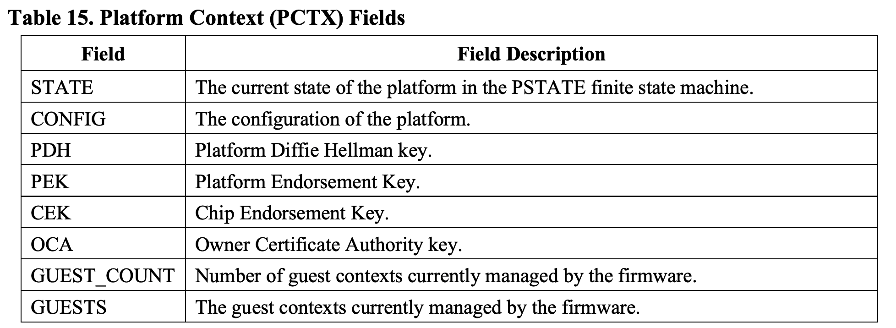

PCTX中主要包括:
* platform state

  某些API会改变platform state. 并且某些API只能在特定的state下才能执行。并且
  Guest Management API 只能在INIT/WORKING platform states 下，才能执行:

  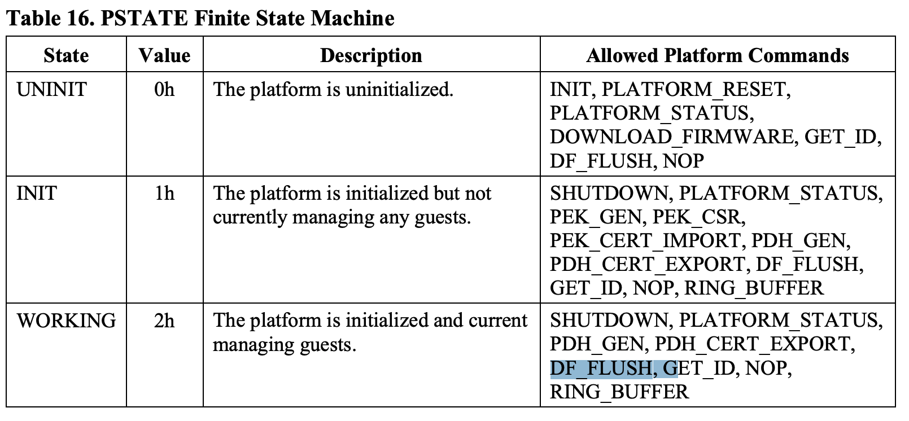

* platform config
* keys: PDH, PEK, CEK, OCA。这些key有些是导入的，有些是生成的，
        有些是固化在固件中的。platform API 负责去管理这些证书的生命周期.
* Guest Information:
  + GUEST_COUNT: number of guest contexts currently managed by the fw.
  + GUEST: guest contexts currently managed by the fw.

### Ownership

一个platform 可能由外部实体拥有，也可能是self-owned。platform owner的所有权由一个以 
OCA（所有者信任根）为根的证书链定义。OCA 签署 PEK。当platform不由外部实体拥有时，
platform会生成自己的 OCA 密钥对.

这有什么用呢?

> 下面是自己的理解。很可能不对。

目前在整个AMD的信任链中，PSP(Platform Secure Processor) 是根据CET有一套完整的信任链。
但是, Processor 之上的软硬件组件，还是需要platform 来保证. 虽然platform owner已经无法
窥探到guest的真面目了, 但是作为guest owner来说，还是想要platform owner的一些其他的服务
和特性。

举个不恰当的例子。某用户最近想买 aliyun deepseek 一体机. 但是买不起一手的，只能买二手的。
去闲鱼上一看, 我的天，这些同样牌子的aliyun deepseek 一体机，怎么长得都不一样。用户也
不确定自己买回来的是真的 aliyun牌子的还是awaiyun的。

那用户就可以通过OCA验证。设备再aliyun出厂时，导入了OCA的公钥。以及使用了OCA私钥，签署了
PEK。这样用户就可以去做验证了。

当然，如果客户不想买一体机，想买个裸机回来自己搭建，那platform owner就是他自己。这时，
OCA就可以使用sev fw API 在这台机器生成。

所以，总结来说，OCA就是用来验证platform owner的身份的真伪。

#### Non-volatile Storage

上面提到的PCTX某些信息的生命周期可能比物理机运行周期还长（关机不清除) 。所以，这些信息
是存储在non-volatile storage中。包括:

* PDH key pair
* PDH certificate
* PEK key pair
* PEK certificate
* OCA public key
* OCA private key (only if self-owned)
* OCA certificate

这些cert/key 在生成/导入后，立即加密存储.

#### PlatForm APIs

|name|State restrictions for executing|state change|
|----|----|----|
|INIT|UNINIT|INIT|
|INIT_EX|UNINIT|INIT|
|SHUTDOWN|ANY|UNINIT|
|PLATFORM_RESET|UNINIT|NOT CHANGE(UNINIT)|
|PLATFORM_STATUS|ANY|NOT CHANGE|
|PEK_GEN|INIT|NOT CHANGE(INIT)|
|PEK_CSR|INIT, WOKRING|NOT CHANGE|
|PEK_CERT_IMPORT|INIT|NOT CHANGE(INIT)|

##### INIT

* overflow
  + INIT cmd用于 platform owner 初始化platform。该命令会从 non-volation storage 中加
    载并初始化 platform context. 这一般是首先要执行的命令(除了 PLATFORM_STATUS 确定API
    version)
* action 
  + CEK 是是根据芯片的唯一值 派生(derived)出来的
  + 如果没有OCA 证书，则self-signed(自签名）一个OCA cert. 这个新生成的证书也会写到
    non-volatile storage中.
  + 没有PEK, 或者 OCA 刚刚生成, 生成PEK signing key 并且通过OCA && CEK 签名。
    同样的，也写到 non-volatile storage 中
  + 没有PDH 或者 PEK 刚刚被生成, 生成 PDH key. 通过PEK 签署 PDH 证书.
  + 所有核上的SEV-related ASID 都被标记为invalid. 在active 任何vm之前，每个核心都需
    要执行WBINVD 指令.

#### INIT_EX

和上面命令相似, 只不过支持 NV_PADDR传入额外信息，暂略

#### SHUTDOWN

* overflow 
  + All platform and guest state maintained by the firmware is securely deleted
    from volatile storage.
#### PLATFORM_RESET 

* overflow
  + reset the non-volatile SEV related data
  + invoking this command is useful when the owner wishes to transfer the
    platform to a new owner or securely dispose（销毁) of the system.
* action
  + delete persistent state from non-volatile storge

#### PLATFORM_STATUS
* overflow
  + used by the platform owner to collect the current status of the platform.
* action
  + IF PSTATE.UNINIT
    * OWNER, CONFIG.ES, CUEST_COUNT = 0
  + IF owned by an **_EXTERNAL OWNER_**
    + OWNER = 1

      else

      OWNER = 0
  + CONFIG flags == INIT command params

#### PEK_GEN
* overflow

  该命令用户生成一个新的`PEK`. 用来重新生成 identity of the platform 但其实在平
  台reset后，首次调用INIT命令时, PEK 会被重新生成，所以该命令不是必须的。

* action
  + deleted from volatile and non-volatile storage:
    + PEK key pair
    + PEK certificate
    + PDH key pair
    + PDH certificate
    + OCA key pair (if the platform is self-owned)
    + OCA certificate 
  + **_re-generate_** and **_store_** in non-volatile storage
    + OCA signing key  && self-signed OCA cert
    + PEK && PEK cert
    + PDH && and signed by PEK
  + 该命令相当于依次调用
    + SHUTDOWN
    + PLATFORM_RESET
    + INIT

##### PEK_CSR

* overflow
  + 可以结合 PEK_CERT_IMPORT 命令使用. 该命令会生成一个CSR(cert sign
    request?). 该CSR中包含
    + platform information
    + PEK public key
  + 之后CA则会根据CSR中的infomration, key 签署一个证书
* action
  + 该命令主要是生成CSR
  + CSR的格式和 SEV CERT 的格式相同，只不过 signatures 字段都是0

    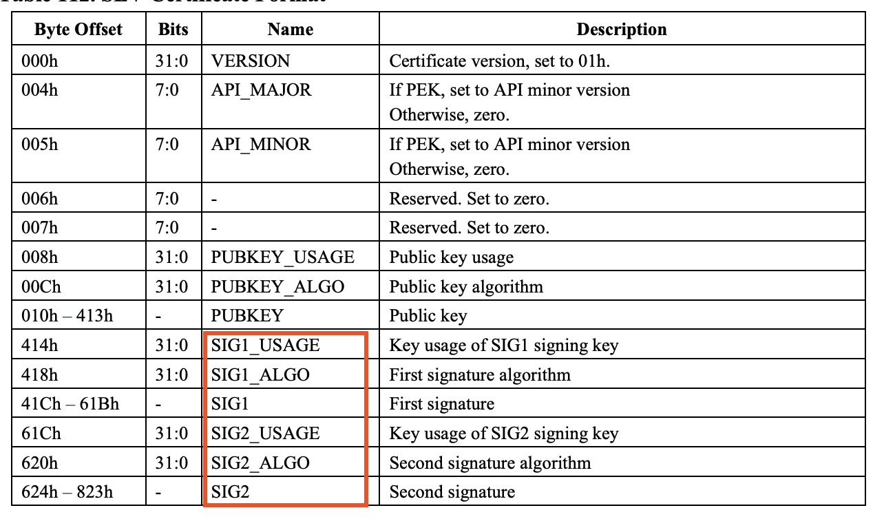 

    > NOTE
    >
    > 但是这里有个疑问，SEV CERT 需要签署两次(OCA, CEK 双签署），那导出
    > 的CSR中有没有CEK 签名

#### PEK_CERT_IMPORT
* overflow
  + 该命令结合PEK_CSR命令一起使用。CSR由 platform owner ca签署后会用其
    OCA签署 CSR。然后，再在platform侧，执行该命领将签署好的PEK和OCA倒入导入
    platform

    但是需要注意的是, 这个过程需要在trusted envirment中执行。
* action
  + 该platform 必须是self-owned. 需要确保caller 已经通过PEK_GEN命令重新
    生成了PEK，所以该PEK没有被 任何owner签署
  + OCA 和 PEK 证书会被验证。验证过程包括以下几个步骤：
    + The algorithms of the PEK and OCA must be supported
    + The version of the PEK and OCA certificates must be supported
    + The PEK certificate must match the current PEK
    + The OCA signature on the PEK certificate must be valid
  + OCA cert and PEK signature written into platform context(不用在执行INIT了）
    and non-volatile stroage
  + PDH is **_regenerated_** and signed with the new PEK

#### PDH_GEN
* overflow
  + 该命令可以根据需要多次重新生成 PDH。请注意，如果其他实体正在使用当前的
    PDH 来建立用于加密数据或进行完整性校验的密钥，那么重新生成 PDH 
    会使任何正在进行的密钥协商操作失效。在这种情况下，其他实体必须获取新的 
    PDH，才能继续进行密钥协商。

#### PDH_CERT_EXPORT

* overflow
  这个命令用于获取当前平台的PDH。常用于导出到remote entities 
  来建立安全的传输通道（例如热迁移)
* actions

  导出如下数据:
  + PDH cert
  + CEK cert
  + PEK cert
  + OCA cert

### PLATFORM API USAGE FLOWS -- Platform Provisioning


1. 执行 `FACTORY_RESET` 恢复出厂设置.
2. 厂商请求 初始化 SEV
3. platform执行INIT
4. 厂商请求 PEK 签署, platform 执行 PEK_CSR 生成 CSR
5. 厂商生成 PEK cert, 并用 CA signing key 签署(OCA)
6. platform 执行`PEK_CERT_IMPORT`进行 PEK_CERT，以及OCA CERT导入

### SUMMARY
platform API 主要是管理平台的生命周期，例如设备生产后的各类证书
生成，设备reset等等。

但是`PDH_CERT_EXPORT`命令则可能用在虚拟机的生命周期的管理中，我们
下面会看到

## GUEST Management API
和platform Management 类似，guest Management API 用于管理 guest
context, 从而作用于guest 生命周期管理.

### Guest Context

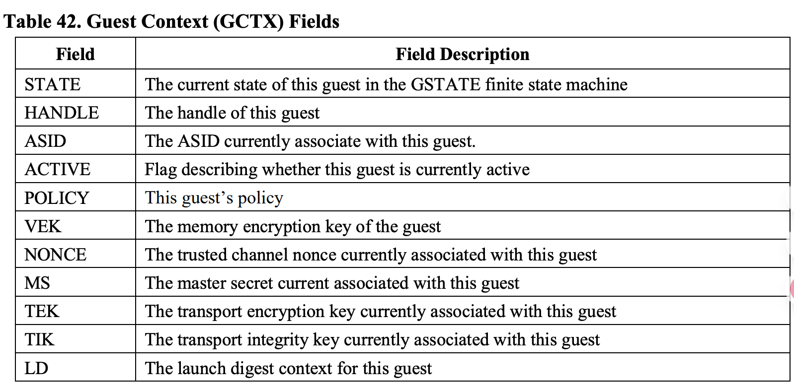

如果说Platform Context 是platform 粒度，是全局的，则`Guest Context`
则是VM粒度，是每个vm独有的，我们关注下面的字段
* STATE:
  * UNINIT
  * LUPDATE: guest current being launched and plaintext data and VMCS save area
             are being imported
             > 正在导入明文
  * LSECRET: The guest is currently being launched and ciphertext data are being
             imported.
             > 正在导入密文
  * RUNNING: guest is fully launched or migrated in, and not being migrated out 
             to another machine.
             > 已经launched 或者迁入，并且没有在迁出
  * SUPDATE: The guest is currently being migrated out to another machine.
  * RUPDATE: The guest is currently being migrated from another machine.
  * SENT: The guest has been sent to another machine.

  每个sev vm 在运行过程中都会经历一个 finite state machine(有限状态机). 固件只会
  在每个虚拟机的特定state下，才能执行某些命令

* HANDLE: 用于唯一标识 guest
* ASID: 上面说过, memory controller中有个加密模块，其是识别TLB中的
        ASID 作为密钥ID, 来索引相关密钥
* ACTIVE:
* POLICY: 用于描述当前虚拟机的sev策略，例如SEV, SEV-SP
* <font color=blue><strong>VEK: The memory encryption key of the guest</strong></font>
* NONCE: 当前与该虚拟机关联的可信通道随机数
* MS: The master secret current associated with this guest. ??
* TEK: transport encryption key
* TIK: transport integrity key

  (热迁移时候会用到)
* LD: 该虚拟机的启动摘要上下文

### GUEST Management APIs

|name|State restrictions for executing|state change|
|LAUNCH_START|新创建|GSTATE(UNINIT-> LUPDATE) PSTATE(->WORKING)|
|LAUNCH_UPDATE_DATA|PSTATE.WORKING && GSTATE.LUPDATE|NOT CHANGE|
|LAUNCH_UPDATE_MEASURE|PSTATE.WORKING && GSTATE.LUPDATE|GSTATE(LUPDATE->LSECRET)|
|LAUNCH_SECERT|PSTATE.WORKING && GSTATE.LSECRET|NOT CHANGE|
|LAUNCH_FINISH|PSTATE.WORKING && GSTATE.LSECRET|GSTATE.RUNNING|NOT CHANGE|

#### LAUNCH_START

* overflow
  + 该命令用于通过使用新的 VEK 对虚拟机内存进行加密，从而引导（初始化）一个虚拟机。
   此命令会创建一个由 SEV 固件管理的虚拟机上下文，之后可以通过返回给调用者的HANDLE来
   引用该上下文.

* action
  + 如果HANDLE字段是0， 会生成一个新的VEK. 如果不是0，会检查下面字段:
    + HANDLE is a valid guest
    + GUEST[HANDLE].POLICY 和 传入的POLICY field 相同
    + POLICY.NOKS == 0 (需要共享)

    + 如果上述检查过了，则会将HANDLE 指向的 VEK copy到the new  guest context
      (相当于dup())
  + new guest handle written to HANDLE field
  + init GCTX.LD
  + version check
    + 检查参数POLICY 字段中的API_MAJOR和API_MINOR是否满足要求:
      + PLATFORM.API_MAJOR > POLICY.API_MAJOR or
      + PLATFORM.API_MAJOR == POLICY.API_MAJOR and PLATFORM.API_MINOR >= POLICY.API_MAJOR

        (向下兼容)
  + DH_CERT_PADDR: 如果其为0， 则 忽略如下字段:
    * DH_CERT_LEN
    * SECTION_PADDR
    * SECTION_LEN
    > NOTE
    >
    > 为什么要这样做呢? 因为PDH cert, 就是为了建立其安全的加密通道,
    > 而其建立安全加密通道的信息，就保存在SECTION 中, 下面会看到
* params:

  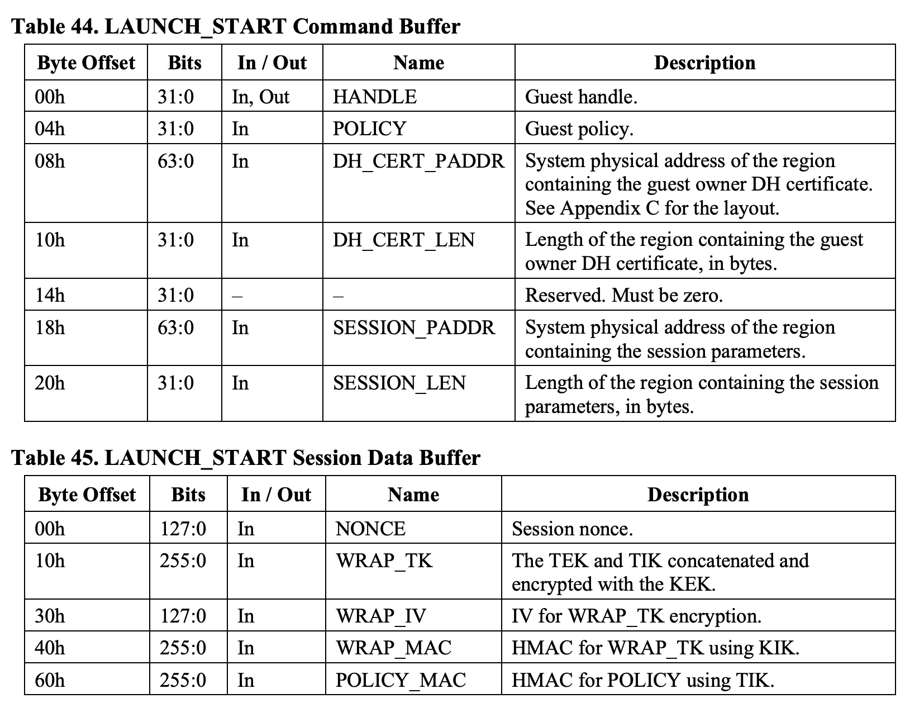

#### LAUNCH_UPDATE_DATA
* overflow
  + 使用VEK加密guest data
* action
  + GCTX.LD: 被更新为 PADDR指向的明文。而明文被guest的VEK 加密为存放在PADDR处
#### LAUNCH_UPDATE_VMSA
(和 SEV-ES相关，略)

#### LAUNCH_MEASURE
* overflow
  + 该命令返回launched guest's memory pages 和 VMCB areas(SEV-ES). 测量的结果使用
    TIK 作为密钥，guest owner可以使用该测量结果验证launch 过程没有被干预
* action
  + GCTX.LD最终被封存为导入guest的所有明文的hash digest.
  + launch measurement 最终被计算为:
    ```
    HMAC(0x04 || API_MAJOR || API_MINOR || BUILD || GCTX.POLICY || GCTX.LD ||
    MNONCE; GCTX.TIK)
    ```
    > NOTE
    >
    > * `||`表示拼接. 
    > * MNONCE 在这个过程中 fw 随机生成的
    > * 用GCTX.TIK加密
  + 将计算结果写入 `MEASURE` 字段
* params

  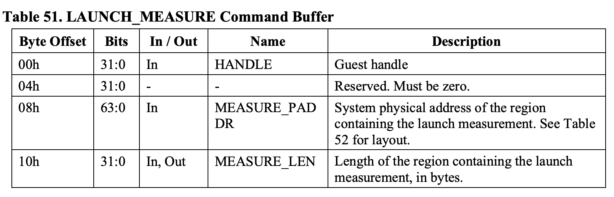

  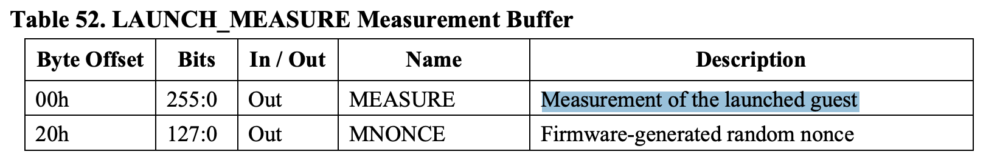

  > NOTE
  >
  > `MNONCE` 在这个过程中的作用, 就是用来验证完整性的, `MEASURE_PADDR.MEASURE`(HMAC)
  > 中存放密文, 而`MEASURE_PADDR.MNONCE` 中存放明文. 而HMAC中被加密的`MNONCE` 只有FW知道,
  > <font color=red><strong>
  > 所以该字段用于验证`MEASURE_PADDR.MEASURE`完整性.
  > </strong></font>
#### LAUNCH_SECRET
* overflow
  + inject a secret into guest, 在launch measurement 已经被guest owner收到并验证
      通过后执行该cmd
* action
  + verfiy MAC field
    ```
    HMAC(0x01 || FLAGS || IV || GUEST_LENGTH || TRANS_LENGTH || DATA || MEASURE; GCTX.TIK)
    ```
    目的是验证该secret的注入方是否是GUEST owner. 通过什么验证呢?
    + MEASURE: (只有GUEST OWNER 和 FW知道)
  + DATA 是TRANS_PADDR 指向的密文
  + 而 TRANS_PADDR 指向的密文，通过GCTX.TEK 加密
  + 如果 FLAGS.COMPRESSED == 1, 生成的明文则会被解压缩，解压后的 结果会被写入
    GUEST_PADDR, 并通过 VM 的VEK 进行加密.
* parameters

  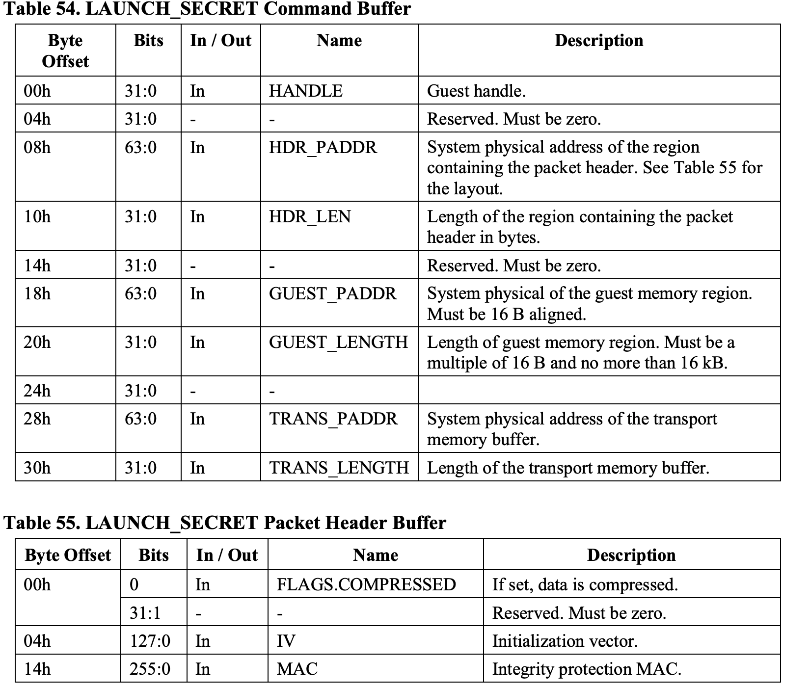

> NOTE
>
> 该过程比较复杂，我们在这里做下小结:
>
> 该流程的目的是，guest owner将一个secret 通过 LAUNCH_SECRET 注入到guest中。
> 
> 首先遇到的一个问题是，怎么确定该"secret" 是guest owner 传过来的，另外，怎么
> 确定, 该"secret"有没有被篡改。
>
> 首先，确定一个数据有没有被篡改。SEV FW常用的方式是，在明文参数中放一个字段存储
> 该数据, 另外在使用HMAC()将所有需要保证完整性的数据进行打包。
>
> 例如，通过对比Packet Header Buffer中的 IV和 MAC中解密后的IV可以判断，HMAC中的
> 数据有没有被篡改
>
> 另外，怎么验证该secret 是guest owner传递过来的呢? （**_下面纯属猜测_**)
>
> 通过MEASURE字段，MEASURE字段只有guest owner和 SEV fw 知道。SEV fw会在执行该命
> 令之前首先对该字段做验证. (如果真是这样, IV 字段有些多余) (GCTX.LD) field
>
> 保证数据的完整性已经做到，那还需要保证数据加密，不会外界获取。方法是通过TEK
> 加密 TRANS_PADDR 中指向的数据。
>
> 传递到platform侧后, sev fw会将该密文通过TEK解密，然后通过VEK加密，最终数据在内存
> 中被host 观测到的是通过VEK 加密过的。而在guest中，则可以通过SME机制获取到解密
> 后的数据

#### LAUNCH_FINISH

* overflow
  + 该命令用于将guest state 置为 可以RUN 的状态.
* action
  + zero following GCTX field: TEK, TIK, MS, NONCE, LD

#### ATTESTATON
* overflow
  + 该命令生成一个报告，其中包括通过`LAUNCH_UPDATE_*`命令传递的guest memory，以及
    VMSA的SHA-256 digset。该摘要于guest memory 在 LAUNCH_MEASURE中使用的 digset一致。
* parameters

  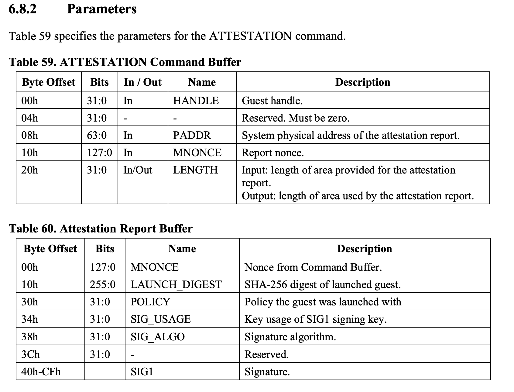

#### SEND_START
* overflow
  + 该命令用于热迁移前的准备工作（源端)
* action
    + valiate
      + IF GCTX.POLICY.NOSEND != 0, return error
      + IF GCTX.POLICY.SEV == 0. PDH, PEK, CEK, ASK, ARK cert 才被认为有效
      + check API Version.
      + GCTX.POLICY: PDH - PEK - OCA 将被会验证(验证过程没说, 是否验证到ARK?, 感
          觉可能会，因为其已经传过来了)
      + 如果guest policy required?? 验证PDH, PEK, OCA, CEK , ARK, ASK证书链.
  + 重新生成 NONCE
  + 通过NONCE, PDH_CERT(dst) 以及 <font color=red><strong>PCTX.PDH(src) private key</strong></font>
    计算master secret，然后生成新的TEK, TIK传输密钥，然后根据下图对传输密钥重新封装，
    将封装后的结果写入WRAP_TK, WRAP_IV, WRAP_MAC

    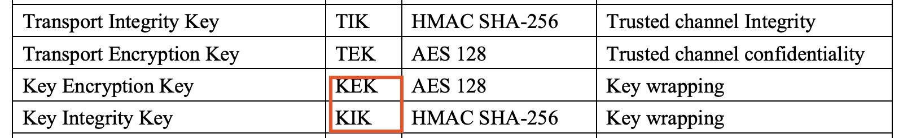
  + GCTX.POLICY 被写在 POLICY field, 并且被TIK 摘要，并写到 POLICY_MAC 字段.
* parameters

  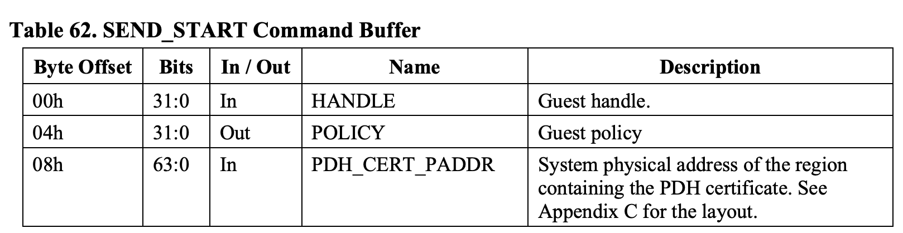 

  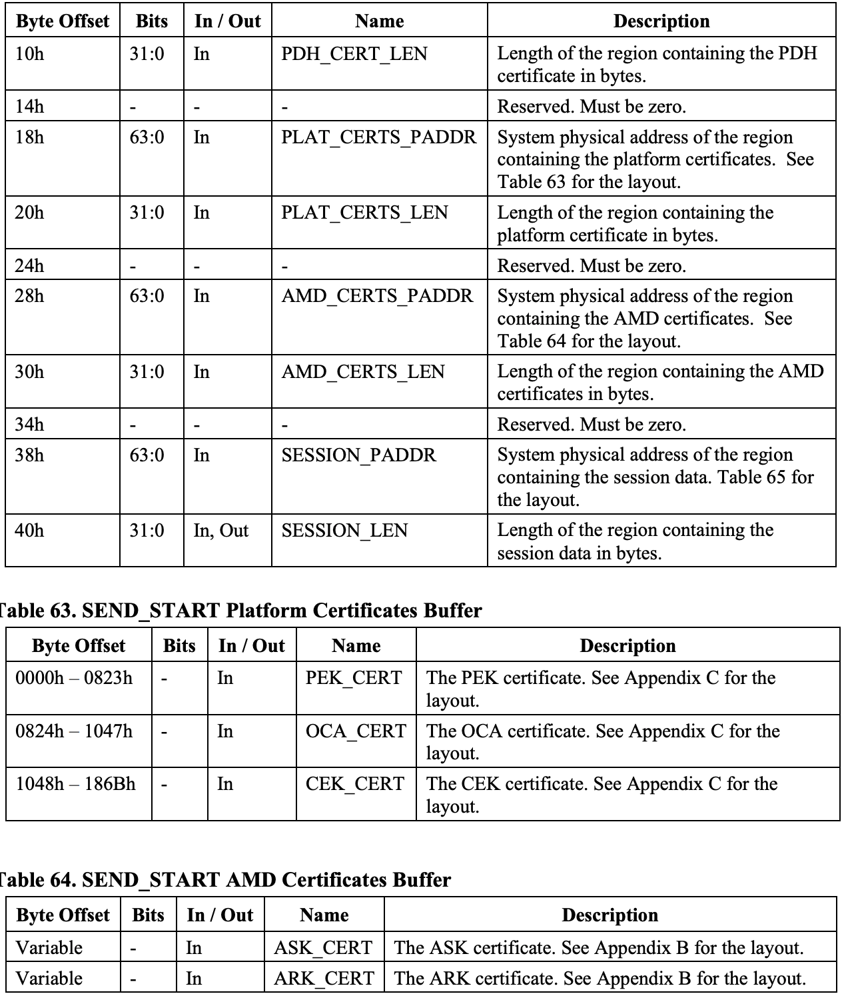

  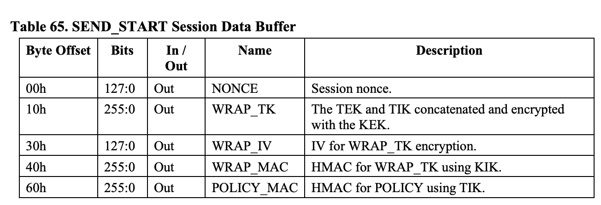

* summary

  该命令在热迁移过程中十分关键, 其工作主要分为四部分
  + 验证dst 端 证书链
  + 通过两边的PDH (dst public key, source private key) 以及NONCE 生成master secret.
  + 通过master secret 派生KIK, KEK
  + 生成TEK, TIK，IV, 并通过KEK 加密生成WRAP_TK, WRAP_IV, 然后对WRAP_TK 使用KIK 进行认
    证标签.

  主要是为了达成 安全传输 TEK, TIK 的目的，为之后加密数据的传输做准备.

#### SEND_UPDATE_DATA
* overflow
  + 导出guest memory 到另一个platform
* action
  + 新生成IV
  + 通过GCTX.VEK解密（手册中没有写, 但是个人认为这个流程必须先用VEK解密)
  + 将GUEST_PADDR 指向的数据，通过 GCTX.TEK 加密, 写入TRANS_PADDR中;
  + 计算MAC
    ```
    HMAC(0x02 || FLAGS || IV || GUEST_LENGTH || TRANS_LENGTH || DATA;
    GCTX.TIK)
    ```

    其中DATA 是`TRANS_PADDR`指向的密文

#### SEND_UPDATE_VMSA
略
#### SEND_FINISH
* overflow
  + finalizes the send operational flow
* action
  + The following fields of the guest context are zeroed:
    + GCTX.TEK
    + GCTX.TIK
    + GCTX.MS
    + GCTX.NONCE

#### SEND_CANCEL
* overflow
  + This command cancels the send operational flow
* action
  + The following fields of the guest context are zeroed:
    + GCTX.TEK
    + GCTX.TIK
    + GCTX.MS
    + GCTX.NONCE
 
#### RECEIVE_START
* overflow
  + import a guest from one platform to anther
  + 常见的使用方式:
    + 在热迁仪目的端使用
    + 在磁盘上恢复guest
* action
  + create a new guest context
  + 如果HANDLE字段为0，则生成一个新的VEK, 如果不是0, 则检查如下字段
    + HANDLE is a valid guest
    + GUESTS[HANDLE].POLICY is equal to the POLICY field
    + The MAC of the POLICY is valid
    + POLICY.NOKS is zero

    如果上述检查通过，HANDLE指向的guest的VEK 将copy到新的GCTX
  + write new guest handle to HANDLE
  + <font color=red><strong>通过NONCE 和 PDH_CERT(src) 以及PCTX.PDH private key(dst) </strong></font>
    计算`master secret`
  + 通过master secret 派生 KEK, KIK 以及参数中的WRAP_IV, WRAP_MAC来解密并 验证 
    WRAP_TK，从而得到TEK, TIK
  + 使用 TIK 和 GCTX.POLICY 得到MAC，然后在和POLICY_MAC 字段进行对
    比验证
  + 验证 `GCTX.POLICY.API` 和 `POLICY.API_MAJOR`.
  + POLICY.ES 相关
* parameters:

  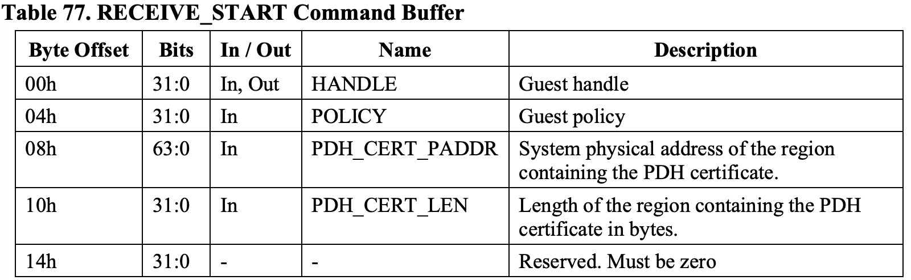

  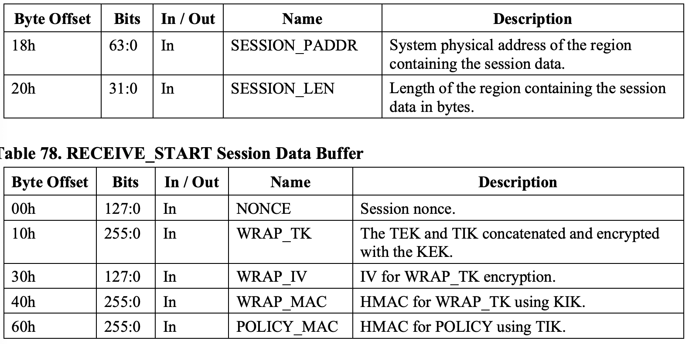
* summary

  该命令主要工作:
  * 创建新的GCTX
  * 验证src端传过来的各类数据
  * 导入从src端获取来的数据，从而建立起加密信道（主要是TEK)

#### RECEIVE_UPDATE_DATA
* overflow
  + import guest memory
* action
  + verify data area though computing MAC
    ```
    HMAC(0x02 || FLAGS || IV || GUEST_LENGTH || TRANS_LENGTH || 
    DATA;GCTX.TIK)
    ```
  + 通过GCTX.TEK 和IV field 解密 data
  + 将解密后的数据通过GCTX.VEK再次加密，并写入GUEST_PADDR指向的内存.
* parameters

  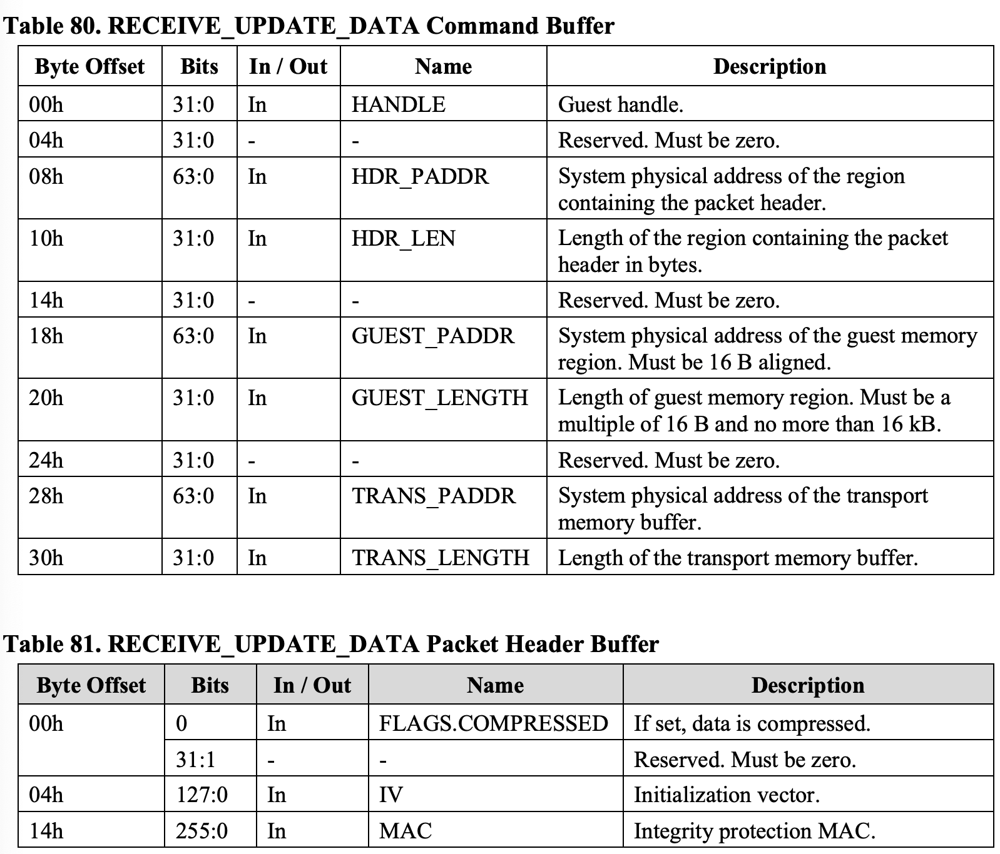

#### RECEIVE_UPDATE_VMSA
(略)
#### RECEIVE_FINISH
* overflow
  + 结束 RECEIVE work flow
* actions
  + 清空如下guest context 字段:
    + GCTX.TEK
    + GCTX.TIK
    + GCTX.MS
    + GCTX.NONCE
#### GUEST_STATUS
#### ACTIVATE
* overflow
  + 该命令用于通知固件, VM 已经绑定到特定的ASID。随后固件将会将该虚拟机的VEK 加
      载到 ASID 对应的 memory controller 的key slot 中。当guest 是RUNNING状态，
      所有Cache Core Complexes 都可以执行该guest.
#### DEACTIVATE
* overflow
  + This command is used to dissociate the guest from its current ASID. The
    firmware will uninstall the guest’s key from the memory controller and 
    disallow use of the ASID by all CCXs.
#### DF_FLUSH
* overflow
  + 在该命令用于deactivate 一个或多个guest后执行
  + 在执行该命令之前需要先执行WBINVD
  + 该命令用于 flush 每个core上的 data fabric write buffers
#### OTHERS
> TODO

## 参考链接

1. [huangyong - AMD SEV基本原理](https://blog.csdn.net/huang987246510/article/details/135487665?spm=1001.2014.3001.5501)
2. [AMD MEMORY ENCRYPTION](https://www.amd.com/content/dam/amd/en/documents/epyc-business-docs/white-papers/memory-encryption-white-paper.pdf)
3. [AMD SEV SNP](https://www.amd.com/content/dam/amd/en/documents/epyc-business-docs/white-papers/SEV-SNP-strengthening-vm-isolation-with-integrity-protection-and-more.pdf)
4. [Secure Encrypted Virtualization API Version 0.24](https://www.amd.com/content/dam/amd/en/documents/epyc-technical-docs/programmer-references/55766_SEV-KM_API_Specification.pdf)
5. [Secure VM Service Module for SEV-SNP Guests](https://www.amd.com/content/dam/amd/en/documents/epyc-technical-docs/specifications/58019.pdf)
6. [YouTube -- SNP Live Migration with guest-memfd and mirror VM ](https://www.youtube.com/watch?v=RYIjUweFysA)
7. [Git -- linux-svsm](https://github.com/AMDESE/linux-svsm)
