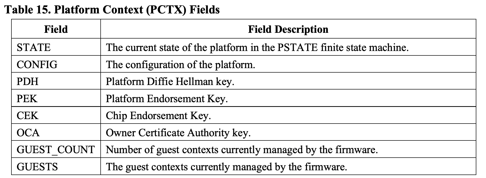
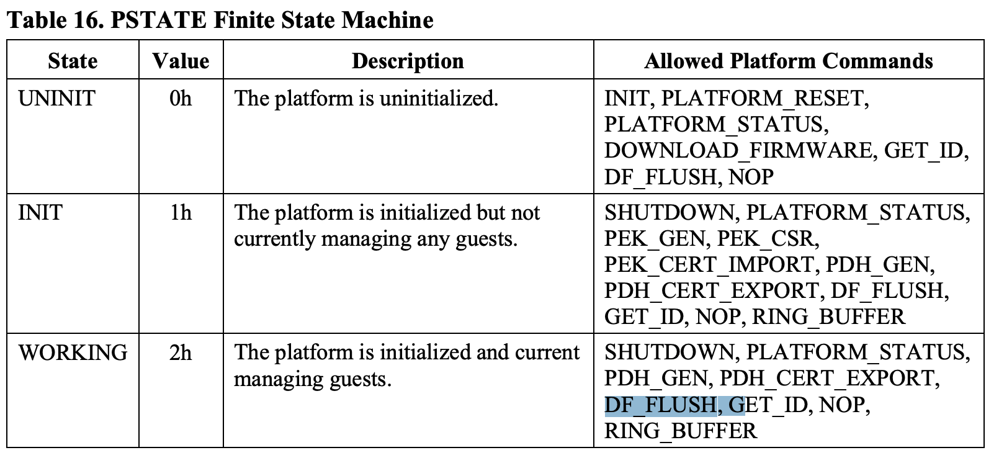
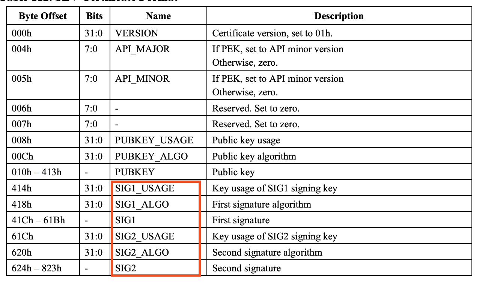
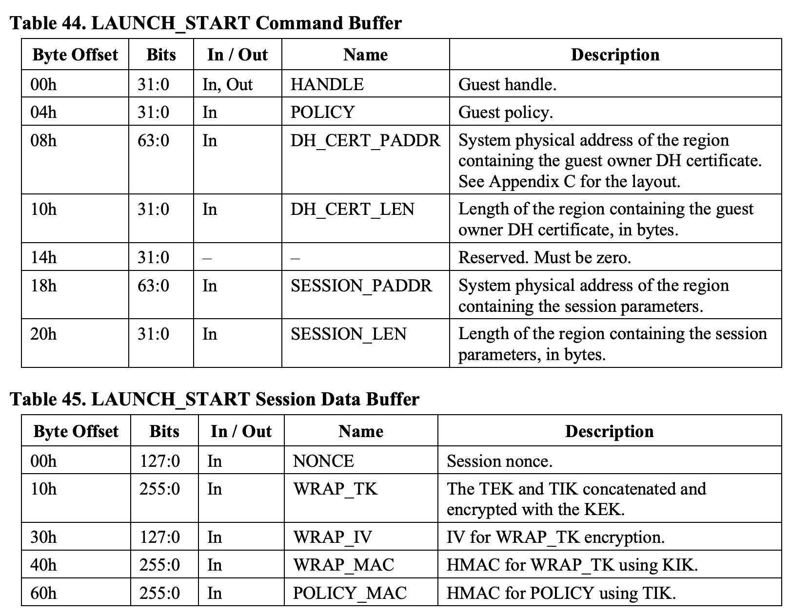
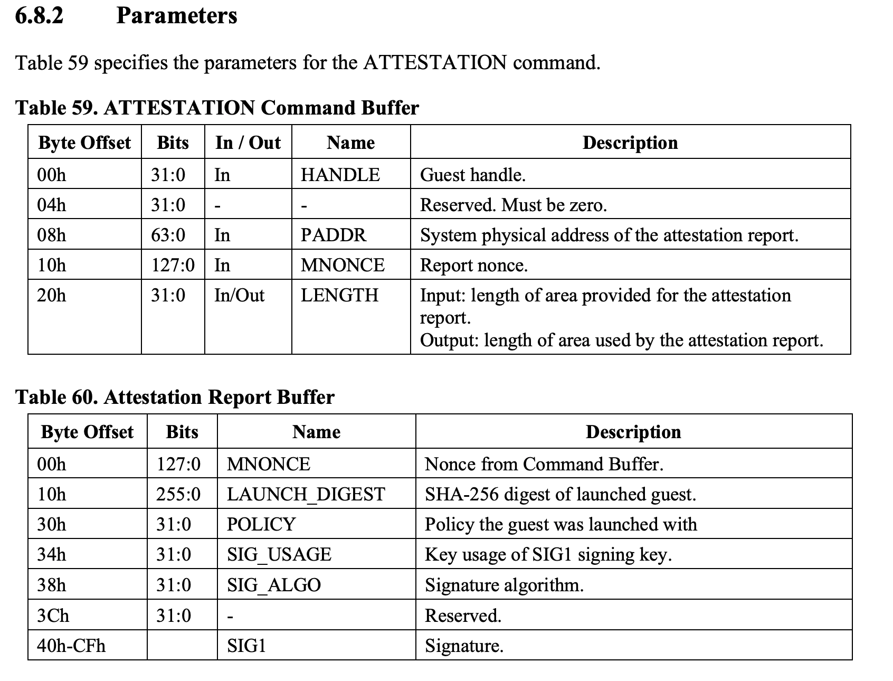
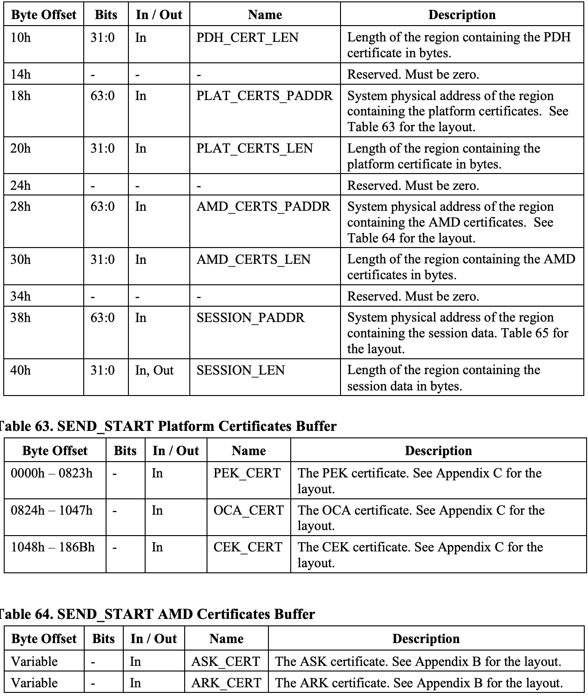
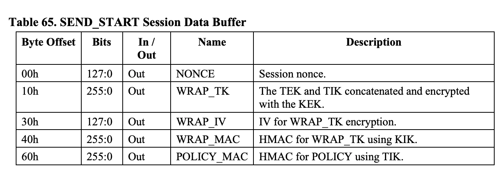
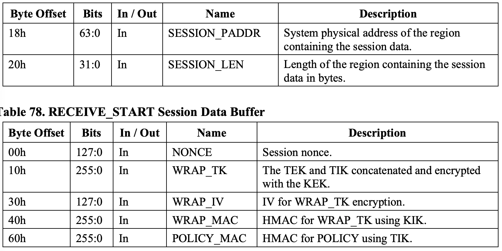

## Platform Management API

Platform Management API 由 platform owner 使用，用于配置/查询 platform-wide
data。

下面的章节主要包括:
* Platform Context: Which data are categorized as platform-wide data
* Ownership: who is the platform owner
* Non-volatile Storage: Persistently store platform-wide data
* Platform APIs

### Platform Context

SEV fw 在 platform 的整个生命周期中维护了一个platform context. 该context包含了
SEV API 所需的data 和 metadata.

PlatForm Context (PCTX) Field:



PCTX中主要包括:
* platform state

  某些API会改变platform state. 并且某些API只能在特定的state下才能执行。并且
  Guest Management API 只能在INIT/WORKING platform states 下，才能执行:

  

* platform config
* keys: PDH, PEK, CEK, OCA。这些key有些是导入的，有些是生成的，
        有些是固化在固件中的。platform API 负责去管理这些证书的生命周期.
* Guest Information:
  + GUEST_COUNT: number of guest contexts currently managed by the fw.
  + GUEST: guest contexts currently managed by the fw.

### Ownership

一个platform 可能由外部实体拥有，也可能是self-owned。platform owner的所有权由一个以 
OCA（所有者信任根）为根的证书链定义。OCA 签署 PEK。当platform不由外部实体拥有时，
platform会生成自己的 OCA 密钥对.

这有什么用呢?

> 下面是自己的理解。很可能不对。

目前在整个AMD的信任链中，PSP(Platform Secure Processor) 是根据CET有一套完整的信任链。
但是, Processor 之上的软硬件组件，还是需要platform 来保证. 虽然platform owner已经无法
窥探到guest的真面目了, 但是作为guest owner来说，还是想要platform owner的一些其他的服务
和特性。

举个不恰当的例子。某用户最近想买 aliyun deepseek 一体机. 但是买不起一手的，只能买二手的。
去闲鱼上一看, 我的天，这些同样牌子的aliyun deepseek 一体机，怎么长得都不一样。用户也
不确定自己买回来的是真的 aliyun牌子的还是awaiyun的。

那用户就可以通过OCA验证。设备再aliyun出厂时，导入了OCA的公钥。以及使用了OCA私钥，签署了
PEK。这样用户就可以去做验证了。

当然，如果客户不想买一体机，想买个裸机回来自己搭建，那platform owner就是他自己。这时，
OCA就可以使用sev fw API 在这台机器生成。

所以，总结来说，OCA就是用来验证platform owner的身份的真伪。

#### Non-volatile Storage

上面提到的PCTX某些信息的生命周期可能比物理机运行周期还长（关机不清除) 。所以，这些信息
是存储在non-volatile storage中。包括:

* PDH key pair
* PDH certificate
* PEK key pair
* PEK certificate
* OCA public key
* OCA private key (only if self-owned)
* OCA certificate

这些cert/key 在生成/导入后，立即加密存储.

#### PlatForm APIs

|name|State restrictions for executing|state change|
|----|----|----|
|INIT|UNINIT|INIT|
|INIT_EX|UNINIT|INIT|
|SHUTDOWN|ANY|UNINIT|
|PLATFORM_RESET|UNINIT|NOT CHANGE(UNINIT)|
|PLATFORM_STATUS|ANY|NOT CHANGE|
|PEK_GEN|INIT|NOT CHANGE(INIT)|
|PEK_CSR|INIT, WOKRING|NOT CHANGE|
|PEK_CERT_IMPORT|INIT|NOT CHANGE(INIT)|

##### INIT

* overflow
  + INIT cmd用于 platform owner 初始化platform。该命令会从 non-volation storage 中加
    载并初始化 platform context. 这一般是首先要执行的命令(除了 PLATFORM_STATUS 确定API
    version)
* action 
  + CEK 是是根据芯片的唯一值 派生(derived)出来的
  + 如果没有OCA 证书，则self-signed(自签名）一个OCA cert. 这个新生成的证书也会写到
    non-volatile storage中.
  + 没有PEK, 或者 OCA 刚刚生成, 生成PEK signing key 并且通过OCA && CEK 签名。
    同样的，也写到 non-volatile storage 中
  + 没有PDH 或者 PEK 刚刚被生成, 生成 PDH key. 通过PEK 签署 PDH 证书.
  + 所有核上的SEV-related ASID 都被标记为invalid. 在active 任何vm之前，每个核心都需
    要执行WBINVD 指令.

#### INIT_EX

和上面命令相似, 只不过支持 NV_PADDR传入额外信息，暂略

#### SHUTDOWN

* overflow 
  + All platform and guest state maintained by the firmware is securely deleted
    from volatile storage.
#### PLATFORM_RESET 

* overflow
  + reset the non-volatile SEV related data
  + invoking this command is useful when the owner wishes to transfer the
    platform to a new owner or securely dispose（销毁) of the system.
* action
  + delete persistent state from non-volatile storge

#### PLATFORM_STATUS
* overflow
  + used by the platform owner to collect the current status of the platform.
* action
  + IF PSTATE.UNINIT
    * OWNER, CONFIG.ES, CUEST_COUNT = 0
  + IF owned by an **_EXTERNAL OWNER_**
    + OWNER = 1

      else

      OWNER = 0
  + CONFIG flags == INIT command params

#### PEK_GEN
* overflow

  该命令用户生成一个新的`PEK`. 用来重新生成 identity of the platform 但其实在平
  台reset后，首次调用INIT命令时, PEK 会被重新生成，所以该命令不是必须的。

* action
  + deleted from volatile and non-volatile storage:
    + PEK key pair
    + PEK certificate
    + PDH key pair
    + PDH certificate
    + OCA key pair (if the platform is self-owned)
    + OCA certificate 
  + **_re-generate_** and **_store_** in non-volatile storage
    + OCA signing key  && self-signed OCA cert
    + PEK && PEK cert
    + PDH && and signed by PEK
  + 该命令相当于依次调用
    + SHUTDOWN
    + PLATFORM_RESET
    + INIT

##### PEK_CSR

* overflow
  + 可以结合 PEK_CERT_IMPORT 命令使用. 该命令会生成一个CSR(cert sign
    request?). 该CSR中包含
    + platform information
    + PEK public key
  + 之后CA则会根据CSR中的infomration, key 签署一个证书
* action
  + 该命令主要是生成CSR
  + CSR的格式和 SEV CERT 的格式相同，只不过 signatures 字段都是0

     

    > NOTE
    >
    > 但是这里有个疑问，SEV CERT 需要签署两次(OCA, CEK 双签署），那导出
    > 的CSR中有没有CEK 签名

#### PEK_CERT_IMPORT
* overflow
  + 该命令结合PEK_CSR命令一起使用。CSR由 platform owner ca签署后会用其
    OCA签署 CSR。然后，再在platform侧，执行该命领将签署好的PEK和OCA倒入导入
    platform

    但是需要注意的是, 这个过程需要在trusted envirment中执行。
* action
  + 该platform 必须是self-owned. 需要确保caller 已经通过PEK_GEN命令重新
    生成了PEK，所以该PEK没有被 任何owner签署
  + OCA 和 PEK 证书会被验证。验证过程包括以下几个步骤：
    + The algorithms of the PEK and OCA must be supported
    + The version of the PEK and OCA certificates must be supported
    + The PEK certificate must match the current PEK
    + The OCA signature on the PEK certificate must be valid
  + OCA cert and PEK signature written into platform context(不用在执行INIT了）
    and non-volatile stroage
  + PDH is **_regenerated_** and signed with the new PEK

#### PDH_GEN
* overflow
  + 该命令可以根据需要多次重新生成 PDH。请注意，如果其他实体正在使用当前的
    PDH 来建立用于加密数据或进行完整性校验的密钥，那么重新生成 PDH 
    会使任何正在进行的密钥协商操作失效。在这种情况下，其他实体必须获取新的 
    PDH，才能继续进行密钥协商。

#### PDH_CERT_EXPORT

* overflow
  这个命令用于获取当前平台的PDH。常用于导出到remote entities 
  来建立安全的传输通道（例如热迁移)
* actions

  导出如下数据:
  + PDH cert
  + CEK cert
  + PEK cert
  + OCA cert


### SUMMARY
platform API 主要是管理平台的生命周期，例如设备生产后的各类证书
生成，设备reset等等。

但是`PDH_CERT_EXPORT`命令则可能用在虚拟机的生命周期的管理中，我们
下面会看到

## GUEST Management API
和platform Management 类似，guest Management API 用于管理 guest
context, 从而作用于guest 生命周期管理.

### Guest Context


如果说Platform Context 是platform 粒度，是全局的，则`Guest Context`
则是VM粒度，是每个vm独有的，我们关注下面的字段
* STATE:
  * UNINIT
  * LUPDATE: guest current being launched and plaintext data and VMCS save area
             are being imported
             > 正在导入明文
  * LSECRET: The guest is currently being launched and ciphertext data are being
             imported.
             > 正在导入密文
  * RUNNING: guest is fully launched or migrated in, and not being migrated out 
             to another machine.
             > 已经launched 或者迁入，并且没有在迁出
  * SUPDATE: The guest is currently being migrated out to another machine.
  * RUPDATE: The guest is currently being migrated from another machine.
  * SENT: The guest has been sent to another machine.

  每个sev vm 在运行过程中都会经历一个 finite state machine(有限状态机). 固件只会
  在每个虚拟机的特定state下，才能执行某些命令

* HANDLE: 用于唯一标识 guest
* ASID: 上面说过, memory controller中有个加密模块，其是识别TLB中的
        ASID 作为密钥ID, 来索引相关密钥
* ACTIVE:
* POLICY: 用于描述当前虚拟机的sev策略，例如SEV, SEV-SP
* <font color=blue><strong>VEK: The memory encryption key of the guest</strong></font>
* NONCE: 当前与该虚拟机关联的可信通道随机数
* MS: The master secret current associated with this guest. ??
* TEK: transport encryption key
* TIK: transport integrity key

  (热迁移时候会用到)
* LD: 该虚拟机的启动摘要上下文

### GUEST Management APIs

|name|State restrictions for executing|state change|
|LAUNCH_START|新创建|GSTATE(UNINIT-> LUPDATE) PSTATE(->WORKING)|
|LAUNCH_UPDATE_DATA|PSTATE.WORKING && GSTATE.LUPDATE|NOT CHANGE|
|LAUNCH_UPDATE_MEASURE|PSTATE.WORKING && GSTATE.LUPDATE|GSTATE(LUPDATE->LSECRET)|
|LAUNCH_SECERT|PSTATE.WORKING && GSTATE.LSECRET|NOT CHANGE|
|LAUNCH_FINISH|PSTATE.WORKING && GSTATE.LSECRET|GSTATE.RUNNING|NOT CHANGE|

#### LAUNCH_START

* overflow
  + 该命令用于通过使用新的 VEK 对虚拟机内存进行加密，从而引导（初始化）一个虚拟机。
   此命令会创建一个由 SEV 固件管理的虚拟机上下文，之后可以通过返回给调用者的HANDLE来
   引用该上下文.

* action
  + 如果HANDLE字段是0， 会生成一个新的VEK. 如果不是0，会检查下面字段:
    + HANDLE is a valid guest
    + GUEST[HANDLE].POLICY 和 传入的POLICY field 相同
    + POLICY.NOKS == 0 (需要共享)

    + 如果上述检查过了，则会将HANDLE 指向的 VEK copy到the new  guest context
      (相当于dup())
  + new guest handle written to HANDLE field
  + init GCTX.LD
  + version check
    + 检查参数POLICY 字段中的API_MAJOR和API_MINOR是否满足要求:
      + PLATFORM.API_MAJOR > POLICY.API_MAJOR or
      + PLATFORM.API_MAJOR == POLICY.API_MAJOR and PLATFORM.API_MINOR >= POLICY.API_MAJOR

        (向下兼容)
  + DH_CERT_PADDR: 如果其为0， 则 忽略如下字段:
    * DH_CERT_LEN
    * SECTION_PADDR
    * SECTION_LEN
    > NOTE
    >
    > 为什么要这样做呢? 因为PDH cert, 就是为了建立其安全的加密通道,
    > 而其建立安全加密通道的信息，就保存在SECTION 中, 下面会看到
* params:

  

#### LAUNCH_UPDATE_DATA
* overflow
  + 使用VEK加密guest data
* action
  + GCTX.LD: 被更新为 PADDR指向的明文。而明文被guest的VEK 加密为存放在PADDR处
#### LAUNCH_UPDATE_VMSA
(和 SEV-ES相关，略)

#### LAUNCH_MEASURE
* overflow
  + 该命令返回launched guest's memory pages 和 VMCB areas(SEV-ES). 测量的结果使用
    TIK 作为密钥，guest owner可以使用该测量结果验证launch 过程没有被干预
* action
  + GCTX.LD最终被封存为导入guest的所有明文的hash digest.
  + launch measurement 最终被计算为:
    ```
    HMAC(0x04 || API_MAJOR || API_MINOR || BUILD || GCTX.POLICY || GCTX.LD ||
    MNONCE; GCTX.TIK)
    ```
    > NOTE
    >
    > * `||`表示拼接. 
    > * MNONCE 在这个过程中 fw 随机生成的
    > * 用GCTX.TIK加密
  + 将计算结果写入 `MEASURE` 字段
* params

  

  

  > NOTE
  >
  > `MNONCE` 在这个过程中的作用, 就是用来验证完整性的, `MEASURE_PADDR.MEASURE`(HMAC)
  > 中存放密文, 而`MEASURE_PADDR.MNONCE` 中存放明文. 而HMAC中被加密的`MNONCE` 只有FW知道,
  > <font color=red><strong>
  > 所以该字段用于验证`MEASURE_PADDR.MEASURE`完整性.
  > </strong></font>
#### LAUNCH_SECRET
* overflow
  + inject a secret into guest, 在launch measurement 已经被guest owner收到并验证
      通过后执行该cmd
* action
  + verfiy MAC field
    ```
    HMAC(0x01 || FLAGS || IV || GUEST_LENGTH || TRANS_LENGTH || DATA || MEASURE; GCTX.TIK)
    ```
    目的是验证该secret的注入方是否是GUEST owner. 通过什么验证呢?
    + MEASURE: (只有GUEST OWNER 和 FW知道)
  + DATA 是TRANS_PADDR 指向的密文
  + 而 TRANS_PADDR 指向的密文，通过GCTX.TEK 加密
  + 如果 FLAGS.COMPRESSED == 1, 生成的明文则会被解压缩，解压后的 结果会被写入
    GUEST_PADDR, 并通过 VM 的VEK 进行加密.
* parameters

  

> NOTE
>
> 该过程比较复杂，我们在这里做下小结:
>
> 该流程的目的是，guest owner将一个secret 通过 LAUNCH_SECRET 注入到guest中。
> 
> 首先遇到的一个问题是，怎么确定该"secret" 是guest owner 传过来的，另外，怎么
> 确定, 该"secret"有没有被篡改。
>
> 首先，确定一个数据有没有被篡改。SEV FW常用的方式是，在明文参数中放一个字段存储
> 该数据, 另外在使用HMAC()将所有需要保证完整性的数据进行打包。
>
> 例如，通过对比Packet Header Buffer中的 IV和 MAC中解密后的IV可以判断，HMAC中的
> 数据有没有被篡改
>
> 另外，怎么验证该secret 是guest owner传递过来的呢? （**_下面纯属猜测_**)
>
> 通过MEASURE字段，MEASURE字段只有guest owner和 SEV fw 知道。SEV fw会在执行该命
> 令之前首先对该字段做验证. (如果真是这样, IV 字段有些多余) (GCTX.LD) field
>
> 保证数据的完整性已经做到，那还需要保证数据加密，不会外界获取。方法是通过TEK
> 加密 TRANS_PADDR 中指向的数据。
>
> 传递到platform侧后, sev fw会将该密文通过TEK解密，然后通过VEK加密，最终数据在内存
> 中被host 观测到的是通过VEK 加密过的。而在guest中，则可以通过SME机制获取到解密
> 后的数据

#### LAUNCH_FINISH

* overflow
  + 该命令用于将guest state 置为 可以RUN 的状态.
* action
  + zero following GCTX field: TEK, TIK, MS, NONCE, LD

#### ATTESTATON
* overflow
  + 该命令生成一个报告，其中包括通过`LAUNCH_UPDATE_*`命令传递的guest memory，以及
    VMSA的SHA-256 digset。该摘要于guest memory 在 LAUNCH_MEASURE中使用的 digset一致。
* parameters

  

#### SEND_START
* overflow
  + 该命令用于热迁移前的准备工作（源端)
* action
    + valiate
      + IF GCTX.POLICY.NOSEND != 0, return error
      + IF GCTX.POLICY.SEV == 0. PDH, PEK, CEK, ASK, ARK cert 才被认为有效
      + check API Version.
      + GCTX.POLICY: PDH - PEK - OCA 将被会验证(验证过程没说, 是否验证到ARK?, 感
          觉可能会，因为其已经传过来了)
      + 如果guest policy required?? 验证PDH, PEK, OCA, CEK , ARK, ASK证书链.
  + 重新生成 NONCE
  + 通过NONCE, PDH_CERT(dst) 以及 <font color=red><strong>PCTX.PDH(src) private key</strong></font>
    计算master secret，然后生成新的TEK, TIK传输密钥，然后根据下图对传输密钥重新封装，
    将封装后的结果写入WRAP_TK, WRAP_IV, WRAP_MAC

    
  + GCTX.POLICY 被写在 POLICY field, 并且被TIK 摘要，并写到 POLICY_MAC 字段.
* parameters

   

  

  

* summary

  该命令在热迁移过程中十分关键, 其工作主要分为四部分
  + 验证dst 端 证书链
  + 通过两边的PDH (dst public key, source private key) 以及NONCE 生成master secret.
  + 通过master secret 派生KIK, KEK
  + 生成TEK, TIK，IV, 并通过KEK 加密生成WRAP_TK, WRAP_IV, 然后对WRAP_TK 使用KIK 进行认
    证标签.

  主要是为了达成 安全传输 TEK, TIK 的目的，为之后加密数据的传输做准备.

#### SEND_UPDATE_DATA
* overflow
  + 导出guest memory 到另一个platform
* action
  + 新生成IV
  + 通过GCTX.VEK解密（手册中没有写, 但是个人认为这个流程必须先用VEK解密)
  + 将GUEST_PADDR 指向的数据，通过 GCTX.TEK 加密, 写入TRANS_PADDR中;
  + 计算MAC
    ```
    HMAC(0x02 || FLAGS || IV || GUEST_LENGTH || TRANS_LENGTH || DATA;
    GCTX.TIK)
    ```

    其中DATA 是`TRANS_PADDR`指向的密文

#### SEND_UPDATE_VMSA
略
#### SEND_FINISH
* overflow
  + finalizes the send operational flow
* action
  + The following fields of the guest context are zeroed:
    + GCTX.TEK
    + GCTX.TIK
    + GCTX.MS
    + GCTX.NONCE

#### SEND_CANCEL
* overflow
  + This command cancels the send operational flow
* action
  + The following fields of the guest context are zeroed:
    + GCTX.TEK
    + GCTX.TIK
    + GCTX.MS
    + GCTX.NONCE
 
#### RECEIVE_START
* overflow
  + import a guest from one platform to anther
  + 常见的使用方式:
    + 在热迁仪目的端使用
    + 在磁盘上恢复guest
* action
  + create a new guest context
  + 如果HANDLE字段为0，则生成一个新的VEK, 如果不是0, 则检查如下字段
    + HANDLE is a valid guest
    + GUESTS[HANDLE].POLICY is equal to the POLICY field
    + The MAC of the POLICY is valid
    + POLICY.NOKS is zero

    如果上述检查通过，HANDLE指向的guest的VEK 将copy到新的GCTX
  + write new guest handle to HANDLE
  + <font color=red><strong>通过NONCE 和 PDH_CERT(src) 以及PCTX.PDH private key(dst) </strong></font>
    计算`master secret`
  + 通过master secret 派生 KEK, KIK 以及参数中的WRAP_IV, WRAP_MAC来解密并 验证 
    WRAP_TK，从而得到TEK, TIK
  + 使用 TIK 和 GCTX.POLICY 得到MAC，然后在和POLICY_MAC 字段进行对
    比验证
  + 验证 `GCTX.POLICY.API` 和 `POLICY.API_MAJOR`.
  + POLICY.ES 相关
* parameters:

  

  
* summary

  该命令主要工作:
  * 创建新的GCTX
  * 验证src端传过来的各类数据
  * 导入从src端获取来的数据，从而建立起加密信道（主要是TEK)

#### RECEIVE_UPDATE_DATA
* overflow
  + import guest memory
* action
  + verify data area though computing MAC
    ```
    HMAC(0x02 || FLAGS || IV || GUEST_LENGTH || TRANS_LENGTH || 
    DATA;GCTX.TIK)
    ```
  + 通过GCTX.TEK 和IV field 解密 data
  + 将解密后的数据通过GCTX.VEK再次加密，并写入GUEST_PADDR指向的内存.
* parameters

  

#### RECEIVE_UPDATE_VMSA
(略)
#### RECEIVE_FINISH
* overflow
  + 结束 RECEIVE work flow
* actions
  + 清空如下guest context 字段:
    + GCTX.TEK
    + GCTX.TIK
    + GCTX.MS
    + GCTX.NONCE
#### GUEST_STATUS
#### ACTIVATE
* overflow
  + 该命令用于通知固件, VM 已经绑定到特定的ASID。随后固件将会将该虚拟机的VEK 加
      载到 ASID 对应的 memory controller 的key slot 中。当guest 是RUNNING状态，
      所有Cache Core Complexes 都可以执行该guest.
#### DEACTIVATE
* overflow
  + This command is used to dissociate the guest from its current ASID. The
    firmware will uninstall the guest’s key from the memory controller and 
    disallow use of the ASID by all CCXs.
#### DF_FLUSH
* overflow
  + 在该命令用于deactivate 一个或多个guest后执行
  + 在执行该命令之前需要先执行WBINVD
  + 该命令用于 flush 每个core上的 data fabric write buffers
#### OTHERS
> TODO
