## 1. Overview

This guide introduces the Realm Management Extension (RME), an extension to the
architecture. RME is the hardware component of the Arm Confidential Compute
Architecture (Arm CCA) which also includes software elements. RME
**dynamically** transfers resources and memory to a **new protected address
space that higher privileged software or TrustZone firmware cannot access**.
Because of this address space, Arm CCA constructs protected execution
environments called realms.

Realms allow a lower-privileged software, like an application or a Virtual
Machine (VM), to protect its content. Realms also prevent execution from attacks
using software that runs at higher privilege levels, like an OS or a hypervisor.
Higher-privileged software is still responsible for allocating and managing the
resources that a realm uses. However, this higher-privileged software cannot
access the contents of the realm or affect its execution flow.

RME can also dynamically transfer memory to a protected address space for
realms. With RME, the memory available to TrustZone Software entities can be
varied dynamically.

> 本指南介绍了 Realm Management Extension（RME），这是 ARM 架构的一项扩展。RME
> 是 Arm Confidential Compute Architecture（Arm CCA）的硬件组成部分，Arm CCA 还
> 包括软件部分。RME 可以将资源和内存动态转移到一个新的受保护地址空间，而更高权限
> 的软件或 TrustZone 固件无法访问这个地址空间。基于这一地址空间，Arm CCA 构建了
> 称为 realm 的受保护执行环境。
>
> realm 允许低权限软件（如应用程序或虚拟机 VM）保护自己的内容。realm 还能防止高
> 权限软件（如操作系统或虚拟机管理器 hypervisor）发起的攻击影响其执行。高权限软
> 件依然负责分配和管理 realm 所用的资源，但它无法访问 realm 的内容，也无法影响
> realm 的执行流程。
>
> RME 还可以将内存动态转移到 realm 的受保护地址空间。借助 RME，TrustZone 软件实
> 体可用的内存可以动态变化。
>
> > Realm 是RME 基于trustzone引入的一个新的 state, 用来运行一些低权限的软件,
> > 并保护自己的内容, 那为什么要新扩展一个state， 而不使用 secure state(虚拟化
> > 可以使用secure-EL2 introduce in ARMv8.4), 我们来思考下, trustzone 的 
> > secure state, 有哪些问题?
> >
> > * **impact other SOFTWARE**: 
> >   + secure state 可以访问所有 non-secure state 的软件， 所以低权限软件
> >     放到secure state 是危险的
> >   + 另外 secure world 本身就是为了缩小该world的software, 来保证安全性,
> >     如果在该世界运行很多的软件, 会降低该world的安全性.
> > * **other SOFTWARE impact this SOFTWARE**
> >   + 反过来说，secure world software 也会访问到虚拟机的内容.
> >
> > 总之, 重新从底层设计CCA的需求是，当前的secure state对于低权限的软件来说，
> > 隔离性还是不够的, 需要将这些软件，单独隔离起来.
> > > 需要再从CCA的需求侧再分析下
> > {: .prompt-info}
> > 
> > 至于 dynamically move, 这个并不关键，因为该功能(GPC) 也为secure state实现
> > 了
> {: .prompt-tip}
{: .prompt-trans}

This guide describes the key hardware features that RME introduces or changes
and introduces you to the software architecture.

You will learn about the following concepts:
* Understand the new Security states and Physical Address (PA) spaces in systems with RME
* Describe how a region of memory can be dynamically assigned between PA spaces
* Understand the system requirements for an RME-enabled system

> 本指南介绍了 RME 引入或变更的主要硬件特性，并带你了解相关的软件架构。
>
> 你将学习以下内容：
>
> * 了解在采用 RME 的系统中新增的安全状态和物理地址（PA）空间；
> * 说明如何将某个内存区域在不同物理地址空间之间动态分配；
> * 了解支持 RME 的系统所需的系统要求。
{: .prompt-trans}

This guide explains the following changes that RME introduces to the processor
architecture:

* Additional Security states
* Additional Physical addresses
* Support for Granule Protection Checks, which allow granules of memory to be
  dynamically assigned to a physical address space

> 本指南解释了 RME 对处理器架构所引入的以下变化：
>
> * 新增的安全状态；
> * 新增的物理地址空间；
> * 支持颗粒保护检查（Granule Protection Checks），该机制允许内存颗粒（granule）
>   在不同物理地址空间之间动态分配。
{: .prompt-trans}

> Diversity and inclusion are important values to Arm. Because of this, we are
> reevaluating the terminology we use in our documentation. Older Arm
> documentation uses the terms master and slave.
>
> > 多样性和包容性是 Arm 非常重视的价值观。因此，我们正在重新审视在文档中使用的
> > 术语。Arm 早期的文档曾使用“主设备（master）”和“从设备（slave）”这些术语。
> > > 这是在叠甲么
> > {: .prompt-tip}
> {: .prompt-trans}

This guide uses replacement terminology, as follows:

* The new term Requester is synonymous with master in older documentation
* The new term Subordinate is synonymous with slave in older documentation

## 2. Security states

RME builds on the Arm TrustZone technology. TrustZone was introduced in Armv6
and provides the following two Security states:

* Secure state
* Non-secure state

The following diagram shows the two Security states in AArch64 with the software
components that are typically found in each Security state:

> RME 是在 Arm TrustZone 技术基础上构建的。TrustZone 在 Armv6 架构中首次引入，并
> 提供了以下两种安全状态：
> * 安全状态（Secure state）
> * 非安全状态（Non-secure state）下图展示了在 AArch64 架构中这两种安全状态，以
>   及每种安全状态下通常包含的软件组件：
{: .prompt-trans}

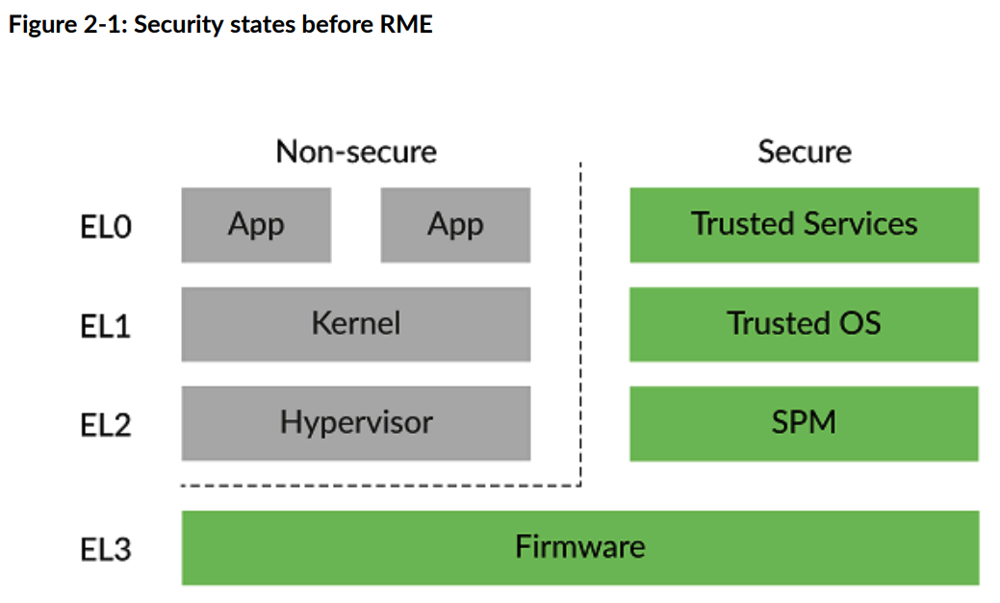

The architecture isolates software running in Secure state from software running
in Non-secure state. This isolation enables a software architecture in which
trusted code runs in Secure state and is protected from code in Non-secure
state.

RME extends this model, and provides the following four Security states:

* Secure state
* Non-secure state
* Realm state
* Root state

The following diagram shows the Security states in an RME-enabled PE, and how
these Security states map to Exception levels:

> 该架构将运行在安全状态（Secure state）下的软件与运行在非安全状态（Non-secure
> state）下的软件进行了隔离。这种隔离使得可信代码能够在安全状态下运行，并免受非
> 安全状态下代码的影响和攻击。RME 对这一模型进行了扩展，提供了以下四种安全状态：
> 
> * 安全状态（Secure state）
> * 非安全状态（Non-secure state）
> * Realm 状态（Realm state）
> * Root 状态（Root state）
>
> 下图展示了在支持 RME 的处理元（PE）中这些安全状态，以及这些安全状态与异常级别
> （Exception levels）之间的对应关系：
{: .prompt-trans}

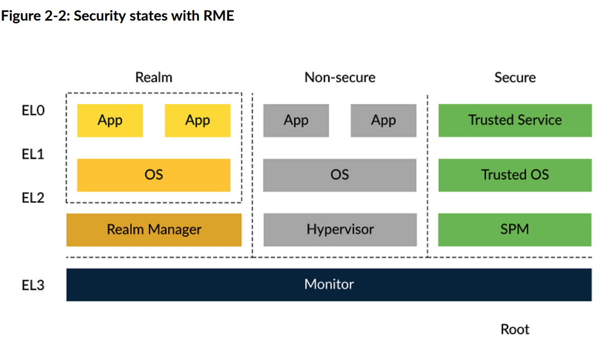

Maintaining Secure state provides backwards compatibility with existing
TrustZone use cases. These use cases can also be upgraded to take advantage of
new features added by RME, like dynamic memory assignment.

Realm state constructs protected execution environments called realms.
Importantly, RME extends the isolation model introduced in TrustZone.

The architecture provides isolation for the following states:

* Secure state from both Non-secure and realm states
* Realm state from both Non-secure and Secure states

This isolation model provides a software architecture in which the software in
Secure and realm states are mutually distrusting.

With RME, Exception level 3 moves out of Secure state and into its own Security
state called root. RME isolates Exception level 3 from all other Security
states. Exception level 3 hosts the platform and initial boot code and therefore
must be trusted by the software in Non-secure, Secure, and realm states. Because
these Security states do not trust each other, Exception level 3 must be in a
Security state of its own.

> 保持安全状态（Secure state）能够向后兼容现有的 TrustZone 用例。这些用例也可以
> 通过升级，利用 RME 新增的特性，例如动态内存分配。
> 
> Realm 状态（Realm state）用于构建称为 realm 的受保护执行环境。重要的是，RME 扩
> 展了 TrustZone 引入的隔离模型。
> 
> 该架构对以下状态提供了隔离：
> 
> * Secure 状态与 Non-secure 和 realm 状态之间的隔离
> * Realm 状态与 Non-secure 和 Secure 状态之间的隔离
>
> 这种隔离模型实现了一种软件架构，使得 Secure 和 realm 状态下的软件彼此互不信任。
> 
> 在 RME 中，异常级别 3（Exception level 3）从 Secure 状态中分离出来，进入了一个
> 称为 root 的独立安全状态。RME 将异常级别 3 与所有其他安全状态隔离开。异常级别
> 3 负责托管平台和初始启动代码，因此必须被 Non-secure、Secure 和 realm 状态下的
> 软件所信任。由于这些安全状态彼此不信任，异常级别 3 必须拥有自己的安全状态。
{: .prompt-trans}

### Controlling the current Security state

A combination of the Exception level and SCR_EL3 registers controls the current
Security state.

Exception level 3 is now its own root Security state. While in Exception level 3,
the Security state is always root, and no other Exception level can be in root
state.

When in lower Exception levels such as Exception level 0, Exception level and
Exception level 2, the NS and NSE fields in SCR_EL3 controls the Security state.
The exception levels are shown in the following table:

> 异常级别（Exception level）与 SCR_EL3 寄存器的组合共同控制当前的安全状态
> （Security state）。
>
> 异常级别 3（Exception level 3）现在拥有自己的 root 安全状态。在异常级别 3 下，
> 安全状态始终为 root，且没有其他异常级别可以处于 root 状态。
>
> 当处于较低的异常级别（如异常级别 0、异常级别 1 和异常级别 2）时，SCR_EL3 寄存
> 器中的 NS 和 NSE 字段用于控制安全状态。各异常级别如下表所示：
{: .prompt-trans}

|SCR_EL3.{NSE,NS}|Security state|
|----|----|
|0b00|Secure|
|0b01|Non-Secure|
|0b10|-|
|0b11|Realm|

There is no encoding for root state. While in Exception level 3, the current
Security state is always root, regardless of the SCR_EL3.{NSE,NS} value.

In Exception level 3, the current value of SCR_EL3.{NSE,NS} is used to control
some operations. For example, when issuing a Translation Lookaside Buffer (TLB)
invalidation instruction at Exception level 3 for a lower Exception level,
SCR_EL3.{NSE,NS} controls which Security state the operation applies to.

> 没有针对 root 状态的编码。当处于异常级别 3 时，无论 SCR_EL3 的 NSE 和 NS 字段
> 值如何，当前的安全状态始终是 root。
>
> 在异常级别 3 下，SCR_EL3 的 NSE 和 NS 字段的当前值用于控制某些操作。例如，当在
> 异常级别 3 下为较低的异常级别发出 TLB（地址转换后备缓冲区）失效指令时，SCR_EL3
> 的 NSE 和 NS 字段会决定该操作适用于哪个安全状态。
{: .prompt-trans}

### Moving between Security states

The principles of moving between Security states is inherited from TrustZone. To
change Security state, execution must pass through Exception level 3, as shown
in the following diagram:

> 在不同安全状态之间切换的原则继承自 TrustZone。要改变安全状态，必须经过异常级别
> 3（Exception level 3），如下图所示：
{: .prompt-trans}

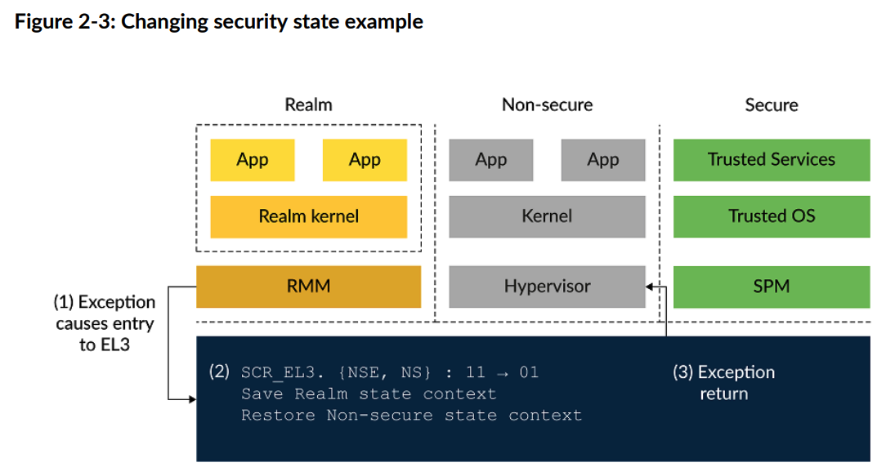

The changing Security state process in the diagram follows these steps:

1. Execution starts in realm state and SCR_EL3.{NSE,NS} is set to 0b11. The
   software executes a Secure Monitor Call (SMC) instruction, which causes an
   exception to be taken to Exception level 3.
2. The processor enters Exception level 3 and is now in root state because
   Exception level 3 is always in root state. However, SCR_EL3.{NSE,NS} still
   has the same Security state that the exception was taken from. Software in
   Exception level 3 changes SCR_EL3.{NSE,NS} to the corresponding value for
   the required Security state and executes an Exception Return (ERET).
3. The ERET causes exit from Exception level 3. When leaving Exception level 3,
   SCR_EL3. {NSE,NS} controls which Security state is entered. In this diagram,
   the Security state is Nonsecure. 

There is only one copy of the vector registers, the general-purpose registers,
and most System registers. When moving between Security states it is the
responsibility of the software, not hardware, to save and restore register
context. The software that saves and restores this register context is called
the Monitor.

> 图中展示的安全状态切换过程遵循以下步骤：
>
> 1. 执行从 realm 状态开始，SCR_EL3 的 NSE 和 NS 字段设置为 0b11。软件执行
>    Secure Monitor Call（SMC）指令，这会导致异常被捕获并进入异常级别 3
>    （Exception level 3）。
> 2. 处理器进入异常级别3，此时安全状态为 root，因为异常级别 3 始终处于 root 状态。
>    然而，SCR_EL3 的 NSE 和 NS 字段仍然保持着触发异常时的安全状态。异常级别 3
>    中的软件将 SCR_EL3 的 NSE 和 NS 字段更改为所需安全状态对应的值，并执行异常
>    返回（ERET）。
> 3. ERET 指令导致从异常级别 3 退出。当离开异常级别 3 时，SCR_EL3 的 NSE 和 NS
>    字段决定进入哪种安全状态。在该图中，进入的是非安全状态（Nonsecure）。
>
> 向量寄存器、通用寄存器以及大多数系统寄存器都只有一份。在不同安全状态之间切换时，
> 保存和恢复寄存器上下文的责任在于软件而不是硬件。负责保存和恢复这些寄存器上下文
> 的软件被称为 Monitor（监控器）。
>
> > 和 secure state && non-secure state 切换一样.
> {: .prompt-info}
{: .prompt-trans}

## 3. Physical Addresses

In addition to two Security states, TrustZone provides the following two
Physical Address (PA) spaces:

* Secure physical address space
* Non-secure physical address space

These separate PA spaces form part of the TrustZone isolation guarantee.
Non-secure state cannot access an address in a Secure PA space. This isolation
means that there are confidentiality and integrity guarantees for data belonging
to Secure state.

> 这些独立的物理地址空间（PA 空间）构成了 TrustZone 隔离机制的一部分。非安全状态
> （Non-secure state）无法访问安全物理地址空间（Secure PA space）中的地址。这种
> 隔离确保了属于安全状态的数据在保密性和完整性方面的保障。
{: .prompt-trans}

RME extends this guarantee to support the following PA spaces:
* Secure physical address space
* Non-secure physical address space
* Realm physical address space
* Root physical address space

The architecture limits which PA spaces are visible in each Security state. The
following table shows the PA spaces that you can access in each Security state:

> 该架构限制了每种安全状态（Security state）下可见的物理地址空间（PA space）。下
> 表展示了在每种安全状态下可以访问的物理地址空间：
{: .prompt-trans}

|Physical address space|Secure state|Non-secure state|Realm state|Root state|
|----|----|----|----|---|
|Secure PAS |Y|N|N|Y|
|Non-Secure PAS |Y|Y|Y|Y|
|Realm PAS|N|N|Y|Y|
|Root PAS|N|N|N|Y|

> 从这里可以看到, Realm PAS只能由 Realm state以及 Root PAS访问，并且 Realm state
> 也不能访问 Secure PAS, 两者是相互隔离的
{: .prompt-tip}

In this table, Y means accessible and N means not accessible.

When documentation refers to a physical address, prefixes are used to identify
which address space is being referred to, for example:

* SP:0x8000 means address 0x8000 in the Secure PA space
* NSP:0x8000 means address 0x8000 in the Non-secure PA space
* RLP:0x8000 means address 0x8000 in the realm PA space
* RTP:0x8000 means address 0x8000 in the root PA space

Architecturally, each example is an independent memory location. This means that
SP:0x8000 and RTP:0x8000 are treated as different physical locations. All four
locations can exist in an RMEenabled system although in practice, this is
unlikely.

> 在此表中，Y 表示可访问，N 表示不可访问。
>
> 当文档提及物理地址时，会使用前缀来标识所指的地址空间，例如：
>
> SP:0x8000 表示安全物理地址空间中的地址 0x8000 NSP:0x8000 表示非安全物理地址空
> 间中的地址 0x8000 RLP:0x8000 表示领域物理地址空间中的地址 0x8000 RTP:0x8000 表
> 示根物理地址空间中的地址 0x8000
>
> 从体系结构上讲，每个示例都是独立的内存位置。这意味着 SP:0x8000 和 RTP:0x8000
> 被视为不同的物理位置。在启用了 RME 的系统中，这四个位置都可以存在，尽管在实际
> 应用中，这种情况并不常见。
{: .prompt-trans}

### Virtual address spaces

To support the new Security states, RME introduces the following translation
regimes for Realm state:

* Realm EL1& 0 translation regime:

  This regime includes two virtual address (VA) regions, similar to the
  Non-secure EL1&0 translation regime. This translation regime is subject to
  stage 2 translation.

* Realm Exception level 2 and 0 translation regime:

  This regime includes two VA regions, similar to the Secure Exception level 2
  and 0 translation regime.
* Realm Exception level 2 and 2 translation regime:

  This regime includes a single VA region, similar to the Secure Exception
  level 2 translation regime.

The following diagram shows the realm state translation regimes:

> 为了支持新的安全状态，RME（Realm Management Extension）为 Realm 状态引入了以下
> 地址转换机制：
>
> * Realm EL1&0 转换机制:
>
>   该机制包含两个虚拟地址（VA）区域，类似于非安全 EL1&0 的转换机制。此转换机制
>   会经过二阶段（stage 2）转换。
>
> * Realm 异常级别 2 和 0 转换机制：
>
>   该机制包含两个 VA 区域，类似于安全异常级别 2 和 0 的转换机制。
>
> * Realm 异常级别 2 和 2 转换机制：
>
>   该机制只包含一个 VA 区域，类似于安全异常级别 2 的转换机制。
>
> 下图展示了 Realm 状态下的地址转换机制：
{: .prompt-trans}

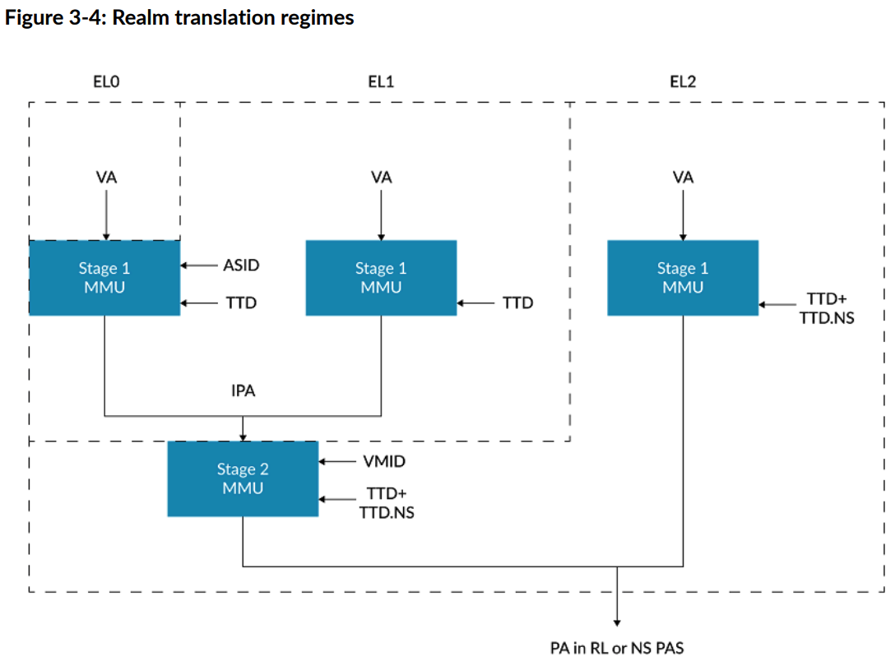

For all realm translation regimes, any address that translates to a Non-secure
physical address is treated as execute-never.

> 对于所有 Realm 的地址转换机制，任何转换得到的非安全物理地址都会被视为“不可执行”
> （execute-never）。
{: .prompt-trans}

### Root state translation regime

Only Exception level 3 exists in root state. This means that there is a single
translation regime for root state, which is the Exception level 3 translation
regime. This translation regime existed before RME but was previously considered
part of Secure state.

RME contains the following changes to the Exception level 3 translation regime:

* Virtual addresses can translate to physical addresses in any of the four
  physical address spaces
* Any address that translates to a Non-secure, Secure, or realm physical
  address is treated as execute-never
* MMU table walks can only access the root PA space
* When the MMU is disabled at Exception level 3, all output addresses are in
  the root PA space

> 只有异常级别 3（Exception level 3）处于根状态（root state）。这意味着根状态只
> 有一种地址转换机制，即异常级别 3 的转换机制。该转换机制在 RME 之前就已存在，但
> 之前被认为是安全状态（Secure state）的一部分。
>
> RME 对异常级别 3 的转换机制进行了如下修改：
>
> * 虚拟地址可以被转换到四种物理地址空间中的任意一种
> * 任何被转换到非安全、安全或 realm 物理地址的地址都会被视为“不可执行”
>   （execute-never）
> * MMU 的页表遍历只能访问根物理地址空间（root PA space）
> * 当异常级别 3 下 MMU 被禁用时，所有输出地址都属于根物理地址空间
>
> > * root state 只能运行 root PA space 中的代码
> > * root state MMU只能访问 root PA space 中的 页表
> {: .prompt-info}
{: .prompt-trans}

> Exception level 3 continues to use the Exception level 3 translation regime,
> which has a single VA range
>
> > 异常级别 3 仍然使用异常级别 3 的地址转换机制，该机制只包含一个虚拟地址
> > （VA）范围。
> {: .prompt-trans}

### Controlling output PAS

When a virtual address is translated by the MMU, the output PA space is
controlled by a combination of the following:

* Current Security state
* Current Exception level
* Translation tables
* System registers

The controls that are available to software vary depending on the translation
regime. Now we will look at the controls in each Security state and translation
regime.

> 当 MMU 对虚拟地址进行转换时，输出的物理地址空间由以下因素共同决定：
>
> * 当前的安全状态（Security state）
> * 当前的异常级别（Exception level）
> * 转换表（Translation tables）
> * 系统寄存器（System registers）
>
> 可供软件使用的控制方式会根据不同的地址转换机制而有所不同。接下来我们将分别介绍
> 各安全状态和转换机制下的控制方式。
{: .prompt-trans}

#### Non-secure state translation regimes

The following diagram shows an overview of the Non-secure translation regimes:

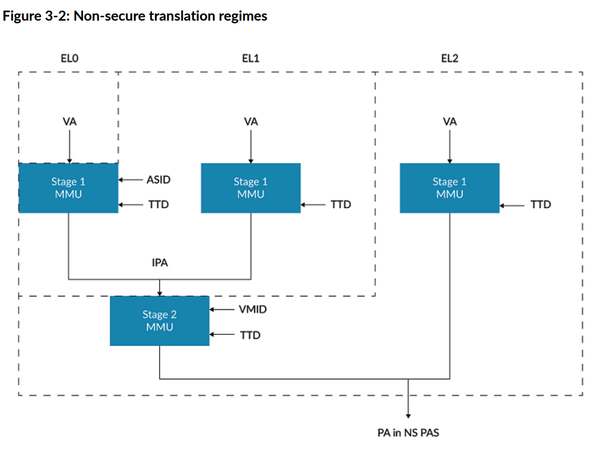

Non-secure state can only access the Non-secure PA space. Therefore, in
Non-secure state there are no controls at stage 1 or stage 2 for controlling the
output IPA space or PA space.

In this diagram, TTD means Translation Table Descriptor.

> 非安全状态只能访问非安全物理地址空间（Non-secure PA space）。因此，在非安全状
> 态下，无论是一级转换阶段（stage 1）还是二级转换阶段（stage 2），都没有用于控制
> 输出 IPA 空间或 PA 空间的相关控制项。
>
> 在本图中，TTD 表示转换表描述符（Translation Table Descriptor）。
{: .prompt-trans}

#### Secure state translation regimes

Secure state can access the Secure and Non-secure PA spaces, as shown in the
following diagram:

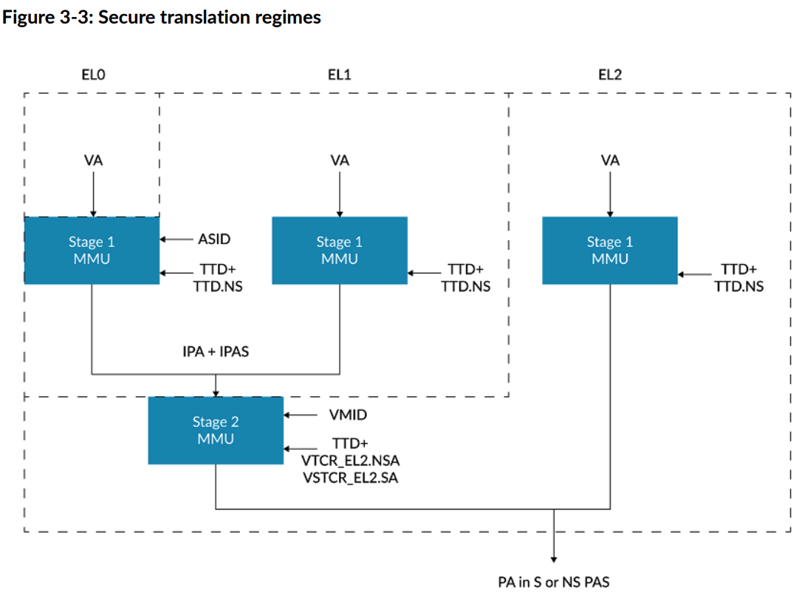

For the Secure translation regime, the NS bit in the stage 1 translation tables
entries selects between two Intermedial Physical Address (IPA) spaces.

There are controls at Exception level 2, VTCR_EL2, and VSTCR_EL2, to map each of
those IPA spaces to a PA space.

> 对于安全地址转换机制，在一级转换表（stage 1 translation tables）项中的 NS 位用
> 于在两个中间物理地址空间（IPA）之间进行选择。
>
> 在异常级别 2（Exception level 2），通过 VTCR_EL2 和 VSTCR_EL2 控制，可以将每个
> IPA 空间映射到一个物理地址空间（PA space）。
>
> > 这个是很关键的, 因为EL2往往是用于虚拟化, 这样就让hyp 可以控制 是否虚拟化
> > secure mode 的cap。并且也可以让 整个虚拟机PA都运行在 secure PA 中. 例如
> > HuaWei VirtCCA.
> {: .prompt-tip}
{: .prompt-trans}

> In Secure state, the controls are unchanged by RME and are described in this
> guide for completeness.
>
> > 在安全状态下，相关控制项未因 RME 而发生变化，为了完整起见，本指南仍对其进
> > 行了描述。
> {: .prompt-trans}

#### Realm state translation regimes

Realm state can access the realm and Non-secure PA spaces, as shown in the
following diagram:

The realm EL0/1 translation regime has a single realm IPA space. Therefore,
there is no NS bit in the EL0/1 stage one translation table entries.

The realm stage two TTDs include an NS bit, to map to either the realm or
Non-secure PAS. This means that, unlike Secure state, realm state has per-page
controls at stage two.

The realm EL2 translation regime and realm EL0/2 translation regime have stage
one NS bits to control the output PA space.

The NS bit in the translation table entries was introduced by TrustZone to allow
Secure state to select the output PA space. In Secure state, the NS bit is
encoded as follows:

* NS=0: Secure
* NS=1: Non-secure

With RME, the NS field is also used in realm EL0/1 stage two and realm EL2/0
stage one translation tables, but is encoded as:

* NS=0: realm
* NS=1: Non-secure

> realm EL0/1 的地址转换机制只有一个 realm IPA 空间，因此在 EL0/1 的一级转换表项
> 中没有 NS 位。
>
> realm 的二级转换表描述符（stage two TTDs）包含一个 NS 位，用于映射到 realm 或
> Non-secure 物理地址空间（PAS）。这意味着，与 Secure state 不同，realm state 在
> 二级转换阶段可以实现每页的控制。
>
> > 这个是比较好用的, 可以独立控制 IPA page frame 的secure state.
> >
> > 这里还需要思考下:
> >
> > 为什么realm 可以由 stage 2 page table 配置 NS, 而 secure-EL2 不能(只能决定
> > 整个的stage 2是 secure 还是 Non-Secure)
> {: .prompt-tip}
>
> realm EL2 的转换机制和 realm EL0/2 的转换机制在一级转换表中有 NS 位，用于控制
> 输出的物理地址空间。
>
> NS 位最初由 TrustZone 引入，用于让 Secure state 选择输出的物理地址空间。在
> Secure state 下，NS 位的编码如下：
>
> * NS=0：Secure
> * NS=1：Non-secure
>
> 在 RME 中，NS 字段也用于 realm EL0/1 的二级转换和 realm EL2/0 的一级转换表中，
> 其编码方式如下：
>
> * NS=0：realm
> * NS=1：Non-secure
{: .prompt-trans}

#### Root state translation regimes

Root state can access all PA spaces, as shown in the following diagram:

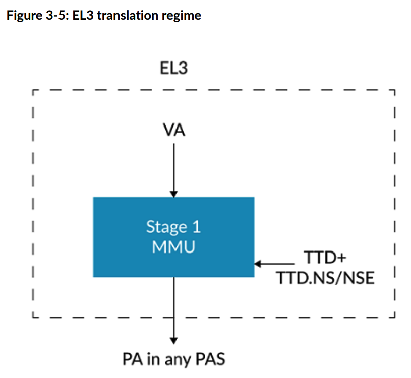

The Exception level 3 stage one translation regime has two bits, NS and NSE, in
the translation table entries to control the output PA space. These encodings
are similar to the encodings that are used for SCR_EL3.{NSE,NS}, except that
there is an encoding for root, as shown in the following table:

> 异常级别 3 的一级地址转换机制在转换表项中包含两个位：NS 和 NSE，用于控制输出的
> 物理地址空间（PA space）。这些编码方式与 SCR_EL3 的 {NSE, NS} 字段所使用的编码
> 方式类似，不过在这里还增加了一个用于 root 的编码，如下表所示：
{: .prompt-trans}

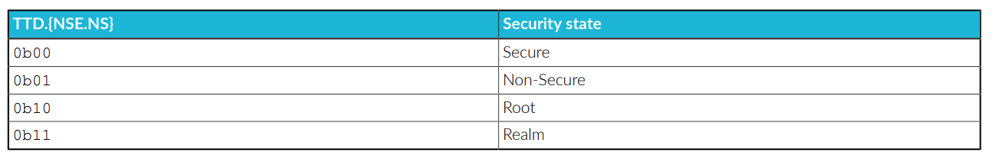

Only Exception level 1 exists in root state. Exception level 3 is only subject
to stage one translation.

### Impact on Translation Lookaside Buffers and caches

TLBs cache recently used translations. Translation Lookaside Buffer (TLB)
entries need to record which translation regime an entry belongs to. During a
TLB look-up, an entry can only be returned if the translation regime in the
entry matches the requested translation regime. This prevents one Security state
from using the TLB entries of another Security state.

> TLB（Translation Lookaside Buffer，翻译后备缓冲区）用于缓存最近使用过的地址转
> 换。TLB 项需要记录每个条目所属的地址转换机制。在进行 TLB 查找时，只有当条目中
> 的转换机制与当前请求的转换机制一致时，该条目才会被返回。这样可以防止一个安全状
> 态（Security state）使用另一个安全状态的 TLB 条目。
{: .prompt-trans}

The following table shows an example simplified TLB, recording the translation
regime:

Similarly, caches lines need to record the associated PA space, as shown in the
following diagram:

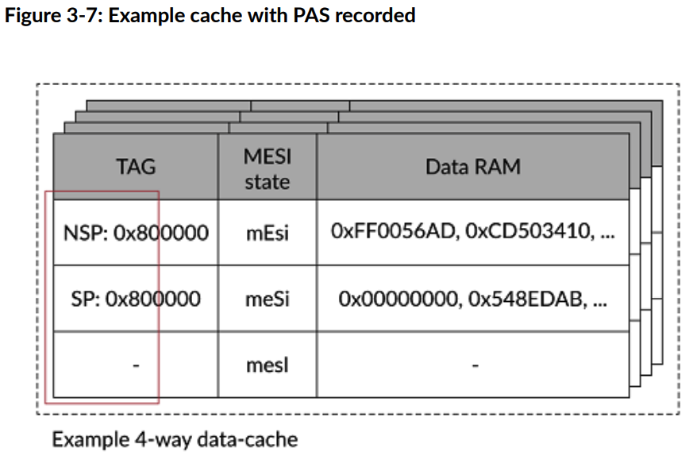

## 4. Granule Protection Checks

This section describes Granule Protection Checks introduced by RME. Granule
Protection Checks enable the dynamic assigning of memory regions between
different physical addresses spaces.

This section teaches you about the following features:

* The structure of Granule Protection tables
* Fault reporting for Granule Protection Checks
* How regions transition between PA spaces

As described in Physical addresses, RME provides four physical address spaces.
The following diagram shows these physical address spaces:

> 本节介绍由 RME 引入的粒度保护检查（Granule Protection Checks）。粒度保护检查支
> 持在不同物理地址空间之间动态分配内存区域。
>
> 本节将讲解以下内容：
>
> * GPT 的结构
> * GPC 的错误报告
> * 区域如何在物理地址空间之间转换
>
> 如“物理地址”一节所述，RME 提供了四种物理地址空间。下图展示了这些物理地址空间：
{: .prompt-trans}

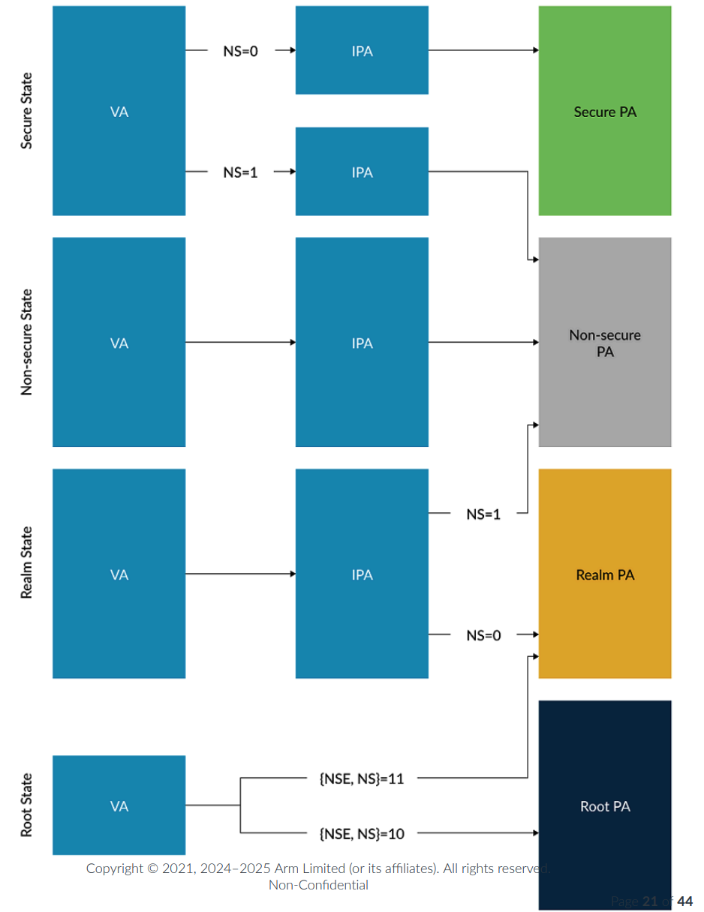

In theory, each PA space is separate and independent and could be fully
populated. In practice, most designs have a single effective PA space for DRAM
regions, using the PA spaces to partition the space into regions, as shown in
the following diagram:

> 理论上，每个物理地址空间（PA space）都是独立分离的，并且可以被完全填充。实际上，
> 大多数设计只为 DRAM 区域使用一个有效的物理地址空间，并利用这些物理地址空间将整
> 个空间划分为多个区域，如下图所示：
{: .prompt-trans}

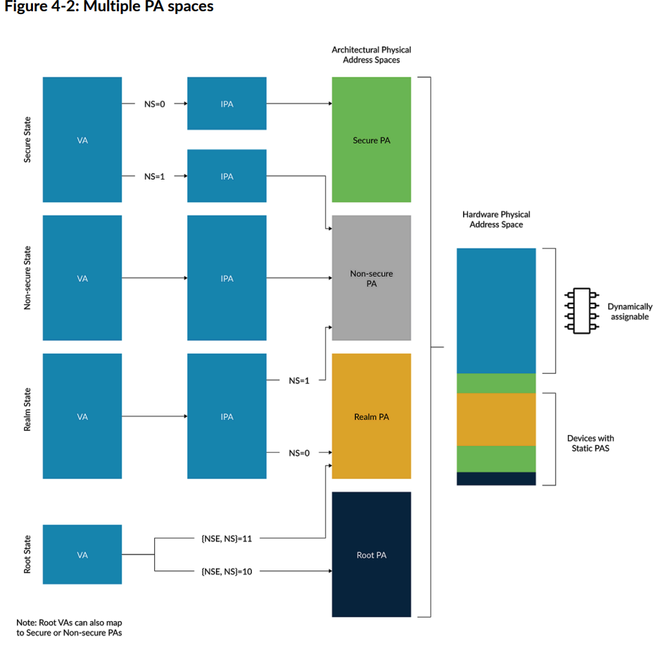

For on-chip devices and memories, the memory system typically enforces
isolation. This isolation is provided either in the end peripheral or in the
interconnect. This configuration is referred to as **completer side filtering**,
for example:

* On-chip ROM and SRAM, which is root-only and the interconnect enforces it.
  Example use cases include system boot.

* Generic Interrupt Controller (GIC). Transactions are routed to the GIC
  regardless of PA space. GIC internally uses the security of the access to
  control which state and configuration is accessible.

* For bulk memory, RME provides a mechanism to **dynamically** allocate pages to
  different PA spaces at runtime. **For example, when starting a realm, ownership
  of some memory is transferred from Non-secure state to realm state. When that
  realm is terminated the memory is reclaimed, and ownership returns to a
  Non-secure state.**

> 对于片上设备和存储器，内存系统通常会强制实现隔离。这种隔离可以由终端外设或互连
> 总线来提供。这种配置被称为“完成端过滤”（completer side filtering），例如：
>
> * 片上 ROM 和 SRAM，这些仅属于 root 权限，且互连总线会强制实现隔离。典型用例包
>   括系统启动。
>   > 这些应该是指, 不能配置的, 固定写死的
>   {: .prompt-tip}
> * 通用中断控制器（GIC）。无论物理地址空间如何，事务都会被路由到 GIC。GIC 会根
>   据访问的安全性来控制可访问的状态和配置。
> * 对于大容量内存，RME 提供了一种机制，可在运行时将页面动态分配到不同的物理地址
>   空间。例如，在启动一个 realm 时，部分内存的所有权会从非安全状态转移到 realm
>   状态。当该 realm 被终止时，内存会被回收，所有权重新归属到非安全状态。
{: .prompt-trans}

In the system architecture, the physical address space region that is
assigned is called the Resource PA space.

The Granule Protection Checks in the MMU enables dynamic allocation of pages
to PA spaces. A set of Granule Protection Tables (GPTs) records for every
location that is either of the following:

* **Completer side filtered**. In this allocation, the MMU permits all accesses
  and relies on memory system checks. These checks can be carried out in
  either the interconnect or the peripheral.
* Allocated to a PAS:
  + In this allocation, the MMU only permits access where the output physical
    address space from VA to PA translation matches the PA space in the GPTs
  + Where the physical address space does not match, the MMU blocks the access
    and returns a Granule Protection Fault (GPF)

Conceptually, the MMU after stage one and stage two translations performs
Granule Protections Checks, as shown the following diagram:

> 在系统架构中，被分配的物理地址空间区域被称为资源物理地址空间（Resource PA
> space）。
>
> MMU 中的粒度保护检查（Granule Protection Checks）支持将页面动态分配到物理地址
> 空间（PA spaces）。一组粒度保护表（Granule Protection Tables，GPTs）会为每个位
> 置记录以下两种情况之一：
>
> * 完成端过滤（Completer side filtered）：在这种分配方式下，MMU 允许所有访问，
>   并依赖于内存系统的检查。这些检查可以在互连总线或外设中执行。
> * 分配到某个物理地址空间（PAS）：
>   + 在这种分配方式下，MMU 只允许那些从 VA 到 PA 转换后输出的物理地址空间与
>     GPTs 中记录的物理地址空间相匹配的访问。
>   + 如果物理地址空间不匹配，MMU 会阻止访问，并返回粒度保护错误（Granule
>     Protection Fault，GPF）。
>
> 从概念上讲，MMU 在完成一级和二级地址转换后，会执行粒度保护检查，如下图所示：
{: .prompt-trans}

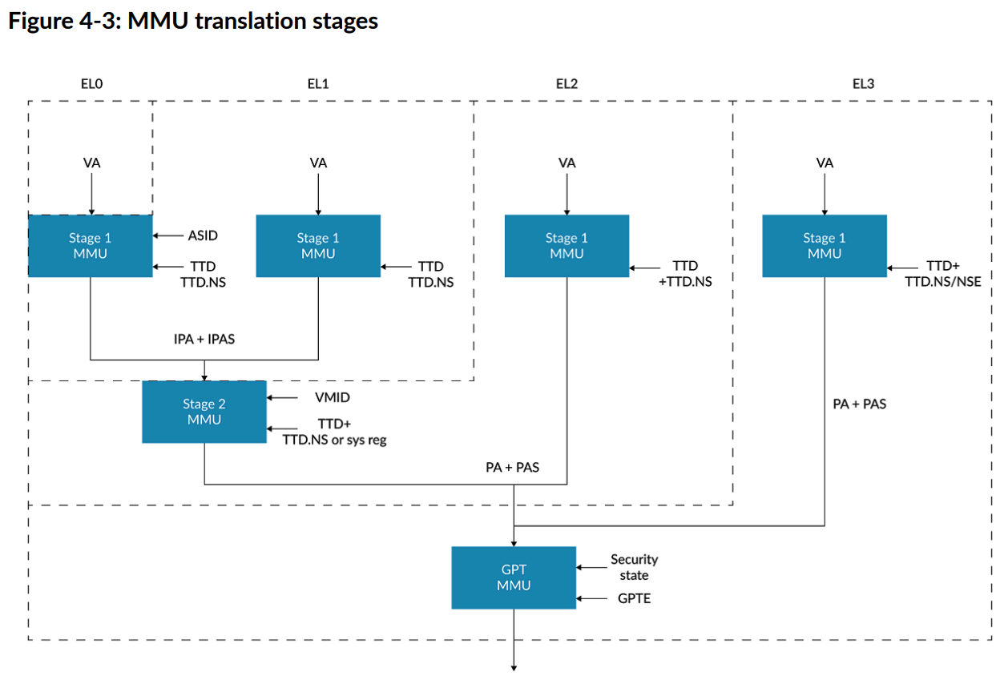

In the diagram, stages are shown as serial however, the process is more
complicated. In the following table, we show an example of an LDR instruction
that is executed in NS_EL1. For simplicity, we assume a single table level at
stages 1 and 2:

> 在图示中，各个阶段被描绘为串行，但实际过程要更为复杂。下表展示了在 NS_EL1 下执
> 行一条 LDR 指令的示例。为简化说明，我们假设第 1 阶段和第 2 阶段各只有一级表。
{: .prompt-trans}

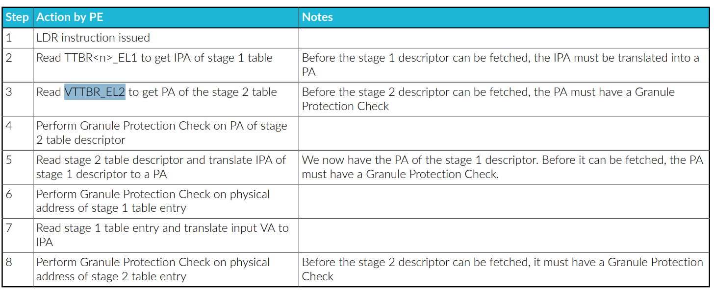

> 我们来总结下哪些地址需要做GPC:
>
> * The PA used in stage 2 that is involved in the stage 1 translation from IPA
>   to PA.
> * The PA of stage 1 pgtable.
> * The PA used in stage 2 that is involved in NS_EL1 IPA.
> * The PA of NS_EL1.
{: .prompt-tip}

> For a running system, most accesses reuse cached translations in the TLBs.
> However, the example highlights the interaction between the different stages
> of translation and Granule Protection Checks.
>
> In Elision, we show that some parts of the process can be optimized.
>
> > 对于正在运行的系统，大多数访问会复用 TLB（转换后备缓冲区）中的缓存转换。然而，
> > 该示例强调了不同转换阶段与粒度保护检查之间的相互作用。
> > 
> > 在简化过程中，我们展示了其中一些环节可以进行优化。
> {: .prompt-trans}

### Granule Protection Tables

A set of tables, called Granule Protection Tables (GPT), configures which PA
space each granule is associated with. When the processor performs an access,
the MMU walks the GPTs to determine whether the access is permitted.

Granule Protection Checks (GPCs) are configured using the following System
registers:

> 一组称为颗粒保护表（Granule Protection Tables，GPT）的表用于配置每个颗粒
> （granule）关联的物理地址空间（PA space）。当处理器进行访问时，MMU 会遍历这些
> GPT 表，以确定该访问是否被允许。
>
> 颗粒保护检查（Granule Protection Checks，GPC）通过以下系统寄存器进行配置：
{: .prompt-trans}

* GPCCR_EL3 to configure:
* Granule Protection Checks Enable
* Granule size: 4K, 16K, or 64K
* Size of protected region
* Elision enable
* GPTBR_EL3 to configure the PA of the GPT, which is in the root PA space

GPTs have a two-level table structure, as shown in the following diagram:

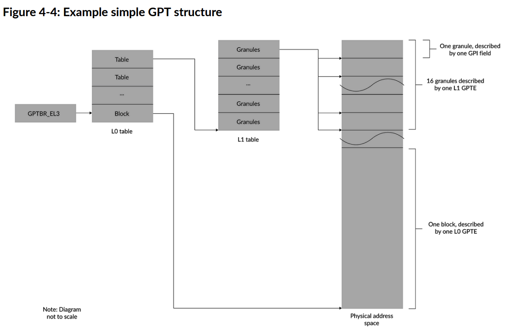

GPTBR_EL3 points to the base of the level 0 table. Each level 0 table entry
covers a 1GB region, and can be one of the following formats:

* Block Descriptor. The block is assigned to a specific PAS or be configured
  to allow all PA spaces.
* Table Descriptor:
  + The level 0 table entry is subdivided into granules representing the
    region, with a level 1 GPT describing the mapping of those granules
  + The descriptor gives the PA of the level 1 table. The table must be in the
    root PA space.

> GPTBR_EL3 指向第 0 级表（level 0 table）的基地址。每个第 0 级表项覆盖一个 1GB
> 区域，并且可以采用以下格式之一：
>
> * 块描述符（Block Descriptor）：该块被分配给特定的物理地址空间（PAS），或者被
>   配置为允许所有物理地址空间访问。
> * 表描述符（Table Descriptor）：
>   + 第 0 级表项会进一步细分为代表该区域的颗粒（granule），并由第 1 级 GPT
>     （level 1 GPT）描述这些颗粒的映射关系。
>   + 描述符中包含第 1 级表的物理地址（PA）。该表必须位于 root 物理地址空间
>     （root PA space）内。
{: .prompt-trans}

Each entry in a level 1 GPT is one of the following:

* Granules Descriptor
  + Contains 16 GPI fields, with each GPI field describing one granule of PA
    space
  + Each granule can be independently assigned to a single PA space or
    configured to allow all PA spaces. This configuration delegates
    responsibility to check the legality of the access to a completer-side
    filter.
* Contiguous Descriptor is like a Granule Descriptor, but describes larger
  regions. Using larger regions can enable more efficient caching in the TLBs.

Each entry in a L1 table describes 16 granules, with separate fields per
granule. The granule size is configurable through GPCCR_EL3 and matches the
granules sizes that are available for the translation tables.

Because a level 1 table is fixed at 1GB but the granule size is variable and
covers the address range, the number of entries in a level 1 table also varies.
Selecting a smaller granule size results in larger level 1 tables. The following
example shows the level 1 tables sizes using a 4KiB and 64KiB granule size:

> 每个一级 GPT（level 1 GPT）表项可以是以下类型之一：
> 
> * 颗粒描述符（Granules Descriptor）
>   + 包含 16 个 GPI 字段，每个 GPI 字段描述一个物理地址空间的颗粒（granule）。
>   + 每个颗粒都可以独立分配到某一个物理地址空间，或者配置为允许所有物理地址空间
>     访问。若配置为允许所有物理地址空间，则访问合法性的检查会委托给完成端
>     （completer）侧的过滤器。
> 
> * 连续描述符（Contiguous Descriptor）类似于颗粒描述符，但用于描述更大的区域。
>   使用更大的区域可以使 TLB（地址转换后备缓冲区）缓存更高效。
>
> 每个一级表项描述 16 个颗粒，每个颗粒有独立的字段。颗粒大小可通过 GPCCR_EL3 配
> 置，并且与转换表支持的颗粒大小一致。
> 
> 由于一级表固定覆盖 1GB 区域，而颗粒大小可变并决定覆盖的地址范围，所以一级表中
> 的表项数量也会变化。选择较小的颗粒大小会导致一级表变得更大。以下示例展示了采用
> 4KiB 和 64KiB 颗粒大小时的一级表大小：
{: .prompt-trans}

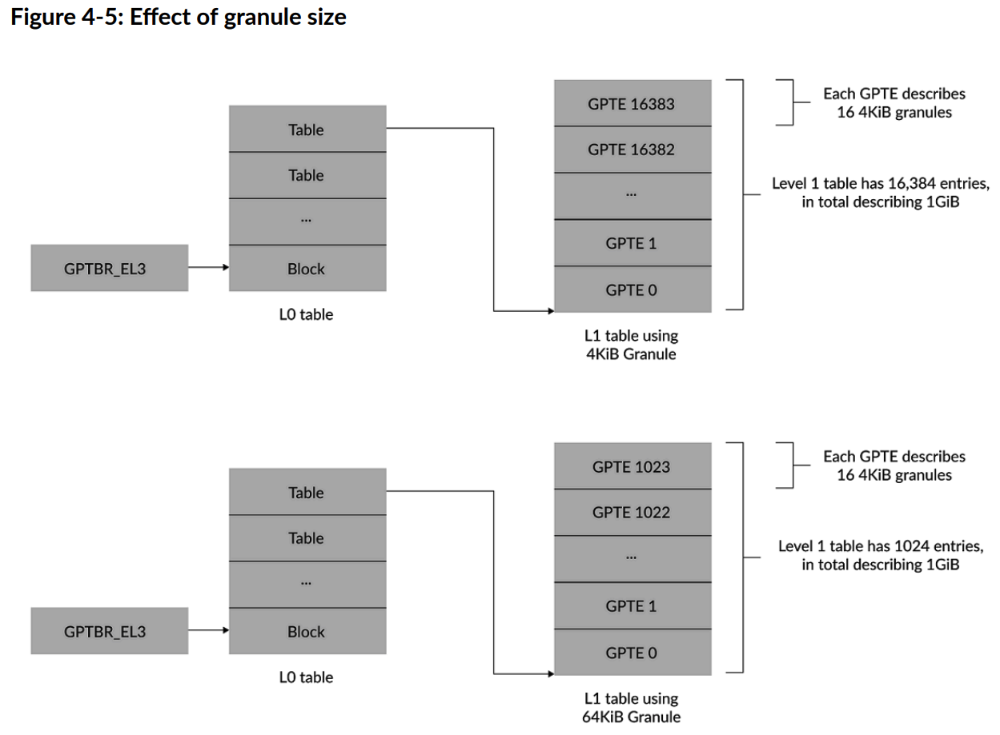

A GPTE refers to an entry in either a level 0 or level 1 GPT. GPI refers to the
fields in a GPTE that describe the assigned PA space for a region of memory.

> GPI entries for level 0 entries are only used in block descriptors.

The GPTBR_EL3.PPS defines the region that the GPT covers starting at address 0
and extends to an upper bound. Any address beyond the range that GPTBR_EL3.PPS
defines, is treated as belonging to the Non-secure PA space.

> GPTE 指的是一级或零级 GPT 表中的一个表项。GPI 指的是 GPTE 中用于描述某个内存区
> 域分配到的物理地址空间（PA space）的字段。
>
>> 对于零级表项，GPI 字段仅用于块描述符（block descriptor）。
>
> GPTBR_EL3.PPS 定义了 GPT 所覆盖的区域，从地址 0 开始，直到上限。任何超出
> GPTBR_EL3.PPS 所定义范围的地址，都被视为属于非安全物理地址空间（Non-secure PA
> space）。
{: .prompt-trans}

### Granule Protection Check faults

If an access fails its Granule Protection Checks, a fault is reported.
Collectively, these faults are referred to as Granule Protection Check (GPC)
faults.

The types of GPC fault are as follows:

* Granule Protection Fault (GPF): The GPT walk completed successfully, but the
  access was not permitted.
* GPT Walk Fault: The GPT walk failed to complete because of an invalid GPT
  entry.
* GPT address size fault: The GPT walk failed because of attempted access to
  an address beyond the configured range.
* Synchronous External abort on GPT fetch: The GPT walk failed because a read
  of a GPT entry returned an External abort.

GPC faults are reported as one of the following exception types:
* Data Abort exception
* Instruction Abort exception
* GPC exception
* GPC exception is a new synchronous exception type introduced by RME.

> GPFs on accesses to the trace and Statistical Profiling Extension (SPE)
> buffers are handled differently. For more information, see Self-hosted trace
> and SPE.

> 如果一次访问未通过颗粒保护检查（Granule Protection Checks），则会报告一个异常。
> 这些异常统称为颗粒保护检查（GPC）异常。
> 
> GPC 异常的类型如下：
> 
> * 颗粒保护异常（Granule Protection Fault, GPF）：GPT 遍历成功完成，但该访问不
>   被允许。
> * GPT 遍历异常（GPT Walk Fault）：由于 GPT 表项无效，GPT 遍历未能完成。
> * GPT 地址大小异常（GPT address size fault）：由于试图访问超出配置范围的地址，
>   GPT 遍历失败。
> * GPT 读取同步外部中止（Synchronous External abort on GPT fetch）：GPT 遍历时
>   读取 GPT 表项返回了外部中止异常。
>
> GPC 异常会以以下异常类型之一报告：
> 
> * 数据中止异常（Data Abort exception）
> * 指令中止异常（Instruction Abort exception）
> * GPC 异常（GPC exception）
> * GPC 异常是一种由 RME 新增的同步异常类型。
> 
> 对 trace 和统计分析扩展（Statistical Profiling Extension，SPE）缓冲区的访问发
> 生 GPF 时，会有不同的处理方式。详情请参见“自托管 trace 和 SPE”相关内容。
{: .prompt-trans}

### Granule Protection Faults

A Granule Protection Fault (GPF) is generated when the PA space returned by the
VMSA VA to PA translation does not match the PA space that the granule is
assigned to in the GPTs.

For example, software attempts to access RLP:0x8000, but PA 0x8000 is allocated
to the Nonsecure PA space.

GPFs can be reported as GPC exceptions, Instruction Abort exceptions, or Data
Abort exceptions as summarized in the following table:

> 当 VMSA 的虚拟地址（VA）到物理地址（PA）转换所返回的物理地址空间（PA space）与
> GPT 表中该颗粒分配的物理地址空间不匹配时，会产生颗粒保护异常（Granule
> Protection Fault, GPF）。
>
> 例如，软件试图访问 RLP:0x8000，但物理地址 0x8000 实际分配给了非安全物理地址空
> 间（Nonsecure PA space）。
> 
> GPF 可以被报告为 GPC 异常、指令中止异常（Instruction Abort exception）或数据中
> 止异常（Data Abort exception），具体总结如下表所示：
{: .prompt-trans}

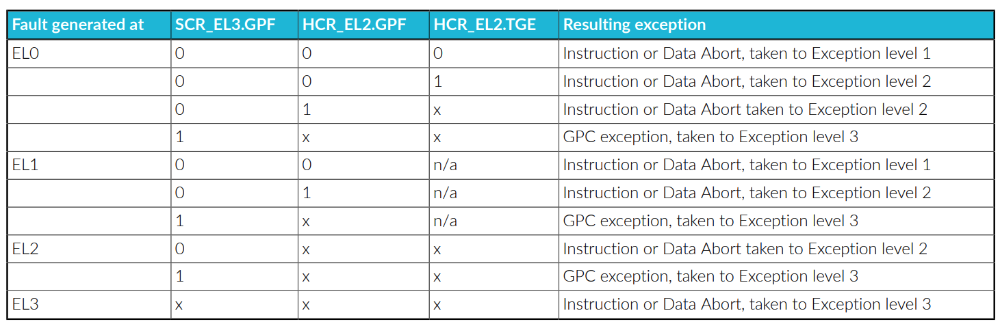

The exception syndrome that is provided for Instruction Aborts and Data Aborts has been
extended to give information on GPFs.

A GPT walk can fail to complete, and one of the following GPC faults is reported:

* GPT address size fault
* GPT walk fault
* Synchronous External abort on GPTE fetch

Arm expects these faults to be rare in system set up correctly. These faults
would typically represent an Exception level 3 software error or a loss of
consistency, which is likely to be fatal.

These fault types are always reported as GPC exceptions, and taken to Exception
level 3.

> 指令中止异常（Instruction Abort）和数据中止异常（Data Abort）所提供的异常信息
> （syndrome）已扩展，以便能够提供有关颗粒保护异常（GPF）的信息。
> 
> GPT 遍历可能无法完成，此时会报告以下 GPC 异常之一：
> 
> * GPT 地址大小异常（GPT address size fault）
> * GPT 遍历异常（GPT walk fault）
> * GPT 表项读取同步外部中止（Synchronous External abort on GPTE fetch）
>
> Arm 预计这些异常在系统正确配置时非常罕见。出现这些异常通常意味着异常级别 3
> （Exception level 3）软件出错或一致性丢失，这通常是致命的。
> 
> 这些异常类型始终作为 GPC 异常报告，并会被传递到异常级别 3。
{: .prompt-trans}

### Transitioning a granule between physical address spaces

A granule is moved between PA spaces by updating the GPTs. The architecture
specification includes the required sequences that software must follow.

> 通过更新 GPT 表，可以将一个颗粒（granule）在不同物理地址空间（PA space）之间迁
> 移。架构规范中包含了软件必须遵循的相关操作流程。
{: .prompt-trans}

### Impact on caches

As part of transitioning a block or granule, Exception level 3 software ensures
that copies of the location held in caches with the PA space are removed.

To remove the location copies, RME introduces Point of Physical Aliasing (PoPA),
a new conceptual point in the cache hierarchy. The PoPA is the point beyond
which an access using any PA space uses the same copy in a cache or memory. The
following diagram shows an example of PoPA:

> 在迁移一个块或颗粒的过程中，异常级别 3（Exception level 3）的软件需要确保与物
> 理地址空间（PA space）相关的缓存中的该位置副本被移除。
>
> 为了移除这些副本，RME 引入了物理别名点（Point of Physical Aliasing，PoPA），这
> 是缓存层次结构中的一个新概念点。PoPA 是指在该点之后，使用任何物理地址空间进行
> 访问时，都会使用缓存或内存中的同一个副本。下图展示了 PoPA 的一个示例：
{: .prompt-trans}

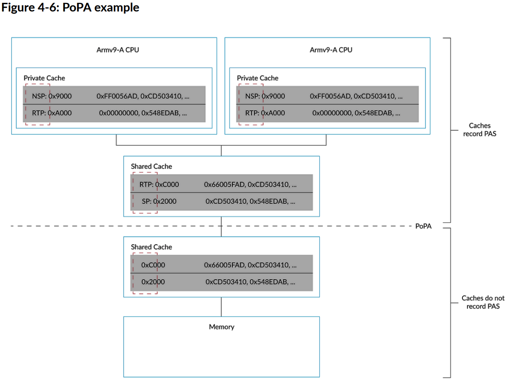

As part of the transition flow, software cleans and invalidates the caches to
PoPA. This ensures that no copies of the granule are held in caches with the old
PA space.

> Not all systems include caches beyond the PoPA.

> 在迁移流程中，软件会对缓存进行清理和失效操作，直到 PoPA（物理别名点）。这样可以
> 确保缓存中不再保留属于旧物理地址空间（PA space）的颗粒副本。
>
>> 并不是所有系统在 PoPA 之后都包含缓存。
>
> > 这里的 `PoPA` 表示, 在该点后的cache层级中, 这些cache不再保存PA space 相关的
> > 信息. (例如 PoPA卡在L2, L3 中间，L3 不再保存 PA space相关字段), 这样有什么好
> > 处呢? 如果因为 move PA space 而 flush cache, flush 到 PoPA就行。
> {: .prompt-tip}
{: .prompt-trans}

### Impact on TLBs

TLBs hold copies of recently used translations and can include the result of
Granule Protection Checks. When a granule is moved between PA spaces, software
must issue invalidate operations to **remove any cached copies** of the GPTE
information. **RME introduces new TLBI instructions for this purpose**.

The Arm architecture does not specify how TLBs are structured, and the structure
can vary between implementations. Possible approaches include one of or a
combination the following:

* Caching the result of different stages separately
* Caching the result of multiple stages as a single entry

Software does not need to be aware of which approach is implemented.

> TLB（地址转换后备缓冲区）会保存最近使用过的地址转换结果，并且可能包含颗粒保护
> 检查（Granule Protection Checks）的结果。当一个颗粒在不同物理地址空间（PA
> space）之间迁移时，软件必须发出失效操作，以清除缓存中的 GPTE 信息副本。为此，
> RME 引入了新的 TLBI 指令。
>
> Arm 架构并未规定 TLB 的具体结构，不同的实现可能会有所不同。可能的实现方式包括
> 以下一种或多种组合：
>
> * 分阶段分别缓存转换结果
> * 将多个阶段的结果作为单个表项进行缓存
>
> 软件无需关心具体采用了哪种实现方式。
{: .prompt-trans}

### Elision

In Granule Protection Checks, we saw an example sequence showing the Granule
Protection Checks during a table walk. To minimize the performance penalty of
the additional checks, RME supports a mode in which some checks are elided.

When elision is enabled (GPCCR_EL3.GPCP == 1), the MMU might not carry out
Granule Protection Checks for reads of stage 2 Table Descriptors. All other
accesses, including stage 1 descriptor fetches and fetches of stage 2 Block and
Page Descriptors, occur as normal.

The analysis of whether the elision is acceptable to a security model includes a
combination of:

* The use and style of memory encryption
* The low probability of ciphertext being a valid translation table descriptor
* The correct implementation of physical address space checks for read-sensitive
  locations

> 在颗粒保护检查（Granule Protection Checks）中，我们已经看到在表遍历过程中进
> 行颗粒保护检查的示例流程。为了减少额外检查带来的性能损耗，RME 支持一种模式，
> 可以省略部分检查。
> 
> 当启用省略功能（即 GPCCR_EL3.GPCP == 1）时，MMU 可能不会对读取阶段 2 表描述符
> （stage 2 Table Descriptors）执行颗粒保护检查。其他访问，包括阶段 1 描述符的读
> 取以及阶段 2 块描述符和页描述符的读取，仍会正常进行检查。
> 
> 对于省略机制是否可以被安全模型接受，分析通常包括以下几个方面的综合考虑：
> 
> * 内存加密的使用方式和类型
> * 密文碰巧成为有效转换表描述符的概率极低
> * 对于读取敏感位置，物理地址空间检查的正确实现
{: .prompt-trans}
