## 1. Overview

This guide describes:

* The role of confidential computing in modern compute platforms
* The principles of confidential computing.
* How the Arm Confidential Compute Architecture (Arm CCA) enables confidential
  computing in an Arm compute platform.

> 本指南介绍了：
> * 机密计算在现代计算平台中的作用
> * 机密计算的基本原理
> * Arm 机密计算架构（Arm CCA）如何在 Arm 计算平台上实现机密计算
{: .prompt-trans}

After reading this guide, you will be able to:

* Define confidential computing
* Describe a complex system Chain of Trust
* Understand that a Realm is a protected execution environment introduced by
  the Arm CCA
* Describe the difference between execution in a Realm and execution of a
  TrustZone Trusted Application
* Explain how Realms are created, managed, and executed on an implementation
  of the Arm CCA
* Explain how a Realm owner establishes trust in a Realm
* Understand use cases and usage scenarios for implementing Arm CCA

> 阅读本指南后，您将能够：
> 
> * 定义什么是机密计算
> * 描述复杂系统中的信任链（Chain of Trust）
> * 理解 Realm 是 Arm CCA 引入的一种受保护的执行环境
> * 描述在 Realm 中的执行与 TrustZone 可信应用执行的区别
> * 解释在 Arm CCA 实现中，Realm 是如何创建、管理和执行的
> * 解释 Realm 拥有者如何在 Realm 中建立信任
> * 理解实现 Arm CCA 的应用场景和用例
{: .prompt-trans}

### Before you begin

This guide assumes that you are familiar with the Arm Exception model and memory
management.

If you are not familiar with these subjects, read our AArch64 Exception model
and AArch64 Memory management guides.

Some of the operation of the Arm CCA refers to virtual machines and
virtualization. If you are not familiar with these concepts, refer to AArch64
virtualization. If you are not familiar with Arm security concepts, see
Introduction to security.

> 本指南假定您已经熟悉 Arm 异常模型和内存管理。
>
> 如果您不熟悉这些内容，请阅读我们的 AArch64 异常模型和 AArch64 内存管理指南。
> 
> Arm CCA 的部分操作涉及虚拟机和虚拟化。如果您不熟悉这些概念，请参考 AArch64 虚
> 拟化相关资料。如果您不熟悉 Arm 的安全相关概念，请参阅安全性简介。
{: .prompt-trans}

## 2. What is Confidential Computing?

Confidential Computing is the protection of data in use, by performing
computation within a trustworthy hardware-backed secure environment. This
protection shields code and data from observation or modification by privileged
software and hardware agents.

Any application or Operating System executing in a Confidential Computing
environment executes in isolation from any non-trusted agent in the rest of the
system. Any data generated or consumed by the isolated execution cannot be
observed by other actors executing on that platform, without explicit permission
from the owner of the data.

> 机密计算是指通过在可信赖、由硬件支持的安全环境中进行计算，从而保护数据在使用过
> 程中的安全。这种保护能够防止特权软件和硬件代理对代码和数据的观察或修改。
>
> 任何在机密计算环境中运行的应用或操作系统，都会与系统中所有非可信代理实现隔离。
> 由隔离执行生成或使用的任何数据，除非数据所有者明确授权，否则其他在该平台上运行
> 的实体无法观察到这些数据。由
{: .prompt-trans}

### Arm CCA requirements

An application developer wants to deploy workloads securely without having to
trust the underlying software infrastructure, for example the hypervisor or code
running in the Secure world.

To support application developer workloads, a platform must provide the
following:

* An execution environment which provides isolation from all untrusted agents
* A mechanism to establish that the execution environment has been initialized
  into a trustworthy state. Initialization requires the execution environment
  to have its own Chain of Trust, independent from the Chain of Trust that the
  parallel untrusted environments in the platform use.

In this guide, we explain how the Arm CCA fulfills these requirements through
hardware implementation and use of software.

> 应用开发者希望能够安全地部署工作负载，而无需信任底层的软件基础设施，例如虚拟机
> 管理程序（hypervisor）或运行在安全世界中的代码。
>
> 为了支持应用开发者的工作负载，平台必须提供以下能力：
>
> * 一个能够与所有不受信任代理实现隔离的执行环境
> * 一种机制，用于确认该执行环境已经初始化为可信状态。初始化要求该执行环境拥有自
>   己的信任链（Chain of Trust），并且该信任链要独立于平台中并行的不受信任环境所
>   使用的信任链。
>
> 在本指南中，我们将解释 Arm CCA 如何通过硬件实现和软件的配合来满足这些要求。
{: .prompt-trans}

### The relationship between Arm CCA and Arm RME

Arm Realm Management Extension (RME) is an extension to the Arm A-profile
architecture, introduced in version 9.2.The following sections describe the
features of the RME. The RME provides the hardware primitives necessary to
support Confidential Compute on Arm.

Arm CCA is a complete system architecture, including firmware components which
use RME in order to deliver Confidential Compute functionality.

> Arm Realm Management Extension（RME）是 Arm A-profile 架构的扩展，首次引入在版
> 本 9.2 中。以下部分将描述 RME 的功能。RME 提供了支持 Arm 上机密计算所需的硬件
> 基础。
>
> Arm CCA 是一个完整的系统架构，包括使用 RME 来提供机密计算功能的固件组件。
{: .prompt-trans}

### Attestation

Workloads running inside Realms manage confidential data or run confidential
algorithms.

For a Realm Owner to be considered confidential, any workload needs to:

* Be sure it is running on a real Arm CCA platform rather than a simulation
* Know that it has been loaded properly and not been tampered with.
* Know that the overall platform, or the realm is not in a debug state that
  could leak its secrets.

The process of establishing the trust in a platform is called Attestation.

> 在 Realm 中运行的工作负载会管理机密数据或执行机密算法。
> 
> 对于 Realm 所有者来说，要确保其工作负载具备机密性，需要满足以下条件：
> 
> * 确认其确实运行在真实的 Arm CCA 平台上，而不是在仿真环境中
> * 确认其已经被正确加载，且未被篡改
> * 确认整个平台或该 Realm 没有处于可能泄露机密信息的调试状态
>
> 建立对平台信任的过程称为认证（Attestation）。
{: .prompt-trans}

Attestation is broken into key parts:

* Attestation of the platform
* Attestation of the initial state of the Realm

These parts combine to create attestation reports. A Realm can request
attestation reports at any time. You can then use reports to authenticate the
validity of the platform and the code in the Realm.

Platform Attestation involves establishing and evaluating the identity and
configuration of the platform which hosts the Realm. This platform includes all
hardware and firmware components which can impact Realm security. This creates
requirements on the hardware.

> ```
> 这里host不是名词，而是动词，表示承载, 持有
> ```
>
> 认证（Attestation）分为几个关键部分：
> * 平台的认证
> * Realm 初始状态的认证
>
> 这些部分共同生成认证报告。Realm 可以在任何时候请求认证报告。您可以利用这些报告
> 来验证平台的有效性以及 Realm 中代码的可信性。
{: .prompt-trans}

The hardware must be provisioned with an identity. The hardware must support
measurements of key firmware images such as the Monitor, the RMM, and firmware
for any other controller in the platform that can materially impact security
such as a power controller.

The Realm attestation token describes the initial configuration and contents of
the Realm, including its memory contents and register state.

Attestation of a Realm involves actors outside the CCA platform. Readers are
encouraged to refer to the Remote Attestation Specification (RATS), which
provides a model for reasoning about the roles and responsibilities of these
actors.

The local platform, running the CCA workload, uses the RME as this guide and the
RME guide (DEN0126) describe.

> 硬件必须具备身份标识，并且必须支持对关键固件镜像（如 Monitor、RMM，以及平台中
> 任何可能对安全性产生实质影响的控制器固件，例如电源控制器）进行测量。
>
> Realm 认证令牌描述了 Realm 的初始配置和内容，包括其内存内容和寄存器状态。
>
> Realm 的认证过程涉及 CCA 平台之外的参与方。建议读者参考远程认证规范（Remote
> Attestation Specification，RATS），该规范为这些参与方的角色和职责提供了推理模
> 型。
>
> 本地平台在运行 CCA 工作负载时，会按照本指南和 RME 指南（DEN0126）的描述，使用
> RME
{: .prompt-trans}

## 3. Arm CCA Extensions

As What is Confidential Computing? describes, Arm CCA aenables you to deploy
applications or Virtual Machines (VMs) while preventing access by more
privileged software entities such as a hypervisor. However, it is these
privileged software entities that typically manage resources like memory. In a
non-CCA platform, a privileged software entity, for example a hypervisor, does
have access to the memory of an application or VM.

The Arm CCA enables the hypervisor to control the VM, but removes the right for
access to the code, register state, or data that is used by that VM. The
separation is enabled by creating protected VM execution spaces called Realms.

A Realm has complete isolation from the normal world in terms of code execution
and data access. Arm CCA achieves this separation through a combination of
architectural hardware extensions and firmware.

Within the Arm CCA, the hardware extensions on an Arm Application PE are called
the Realm Management Extension (RME). The firmware which manages Realms (the RMM)
and the EL3 Monitor both make use of RME. We describe these elements in Arm CCA
Hardware Architecture and Arm CCA Software Architecture.

> 如《什么是机密计算？》中所描述的，Arm CCA 允许你部署应用程序或虚拟机（VM），同
> 时防止更高特权的软件实体（如 hypervisor）访问这些应用程序或 VM。然而，在传统的
> 非 CCA 平台上，例如 hypervisor 这样的特权软件实体通常会有权访问应用程序或 VM
> 的内存。
> 
> Arm CCA 使得 hypervisor 可以控制 VM，但同时剥夺了它访问 VM 使用的代码、寄存器
> 状态或数据的权限。这种隔离是通过创建受保护的 VM 执行空间，称为 Realms，来实现
> 的。
> 
> 每个 Realm 在代码执行和数据访问方面与正常世界完全隔离。Arm CCA 通过结合架构级
> 硬件扩展和固件来实现这种隔离。
> 
> 在 Arm CCA 中，Arm 应用处理器（Application PE）上的硬件扩展被称为 Realm
> Management Extension（RME）。管理 Realms 的固件（RMM）和 EL3 Monitor 都会使用
> RME。我们在《Arm CCA 硬件架构》和《Arm CCA 软件架构》中详细介绍了这些组件。
{: .prompt-trans}

### Realms

A Realm is an Arm CCA environment that can be dynamically allocated by the
Normal world Host. The Host is the supervisory software that manages an
application or Virtual Machine (VM). As described in Attestation, the initial
state of a Realm, and of the platform on which it executes, can be attested.
Attestation enables the Realm owner to establish trust in the Realm before
provisioning any secrets to it. The Realm does not have to trust the Non-secure
hypervisor which controls it.

The Host can allocate and manage resource allocation. The Host manages the
scheduling of the Realm VM operation. However, the Host cannot observe or modify
the instructions executed by the Realm.

Realms can be created and destroyed under Host control. Pages can be added or
removed through Host requests in a way that is similar to a hypervisor managing
any other non-confidential VM.

To run a CCA system, a Host needs to be modified. The Host continues to control
the nonconfidential VMs but needs to communicate with the Arm CCA firmware, in
particular the Realm Management Monitor (RMM). The operation of the RMM is
described in Arm CCA Software Architecture.

> Realm 是由普通世界主机（Host）动态分配的 Arm CCA 环境。Host 是管理应用程序或虚
> 拟机（VM）的管理软件。
>
> 如认证（Attestation）部分所述，Realm 的初始状态以及其运行的平台都可以进行认证。
> 认证使 Realm 的所有者能够在向 Realm 配置任何机密信息之前，建立对 Realm 的信任。
> Realm 无需信任控制它的非安全 hypervisor。
>
> > 参考SEV KS spec, 流程也是先进行attestation，然后将结果返回给guest owner时,
> > guest owner在进行verify，从而决定要不要注入secert到VM.
> {: .prompt-tip}
>
> Host 可以分配和管理资源。Host 负责调度 Realm 虚拟机的运行。然而，Host 无法观察
> 或修改 Realm 执行的指令。
>
> Realm 可以在 Host 的控制下被创建和销毁。通过 Host 的请求，可以像 hypervisor 管
> 理其他非机密虚拟机一样，向 Realm 添加或移除页面。
>
> 要运行 CCA 系统，Host 需要进行修改。Host 继续控制非机密虚拟机，但需要与 Arm
> CCA 固件（尤其是 Realm Management Monitor，RMM）进行通信。RMM 的运行方式在
> 《Arm CCA 软件架构》中有详细介绍。
{: .prompt-trans}

### Realm world and Root world

The Armv8-A TrustZone extensions enable secure execution of code and isolation
of data by having two separated worlds:

* The Secure world
* The Normal world.

**A world is combination of a security state of a PE and physical address
space**. The security state a PE is executing in determines which physical
address spaces (PAS) a PE can access. In the Secure state a PE can access Secure
and non-Secure physical address spaces. In the Non-secure state it can only
access the Non-secure physical address space. Normal world refers to combination
of Non-secure state and Non-secure physical address space.

> Armv8-A TrustZone 扩展通过将系统划分为两个独立的世界，实现了代码的安全执行和数
> 据的隔离：
>
> * 安全世界（Secure world）
> * 普通世界（Normal world）
>
> "world" 是指处理器元素（PE）的安全状态与物理地址空间的组合。PE 当前的安全状态
> 决定了它可以访问哪些物理地址空间（PAS）。在安全状态下，PE 可以访问安全和非安全
> 的物理地址空间；在非安全状态下，PE 只能访问非安全物理地址空间。Normal world指
> 的是非安全状态与非安全物理地址空间的组合。
{: .prompt-trans}

RME introduces two additional worlds:

* Root world refers to the combination of the Root security state and Root
  physical address space. A PE is in the Root security state when it is
  running in Exception level 3. The Root PAS is separate from the Secure PAS.
  This is a key difference to Armv8-A TrustZone, where Exception level 3 code
  did not have a private address space and instead used the Secure PAS. The
  latter is still used by S_EL2/1/0. The Monitor runs in the Root world.
* Realm world comprises of Realm security state and Realm PAS. Realm state
  code can execute at R_EL2, R_EL1 and R_EL0. The controlling firmware running
  in the Realm world can access memory in the Normal world to enable shared
  buffers.

The SCR_EL3.NS bit controls World switching in a non-RME PE. Exception level 3
software sets NS = 0 when switching to the Secure world and sets NS = 1 when
switching to the Normal world. World switching in an RME-implemented PE is
extended through a new SCR_EL3.NSE bit.

The following table shows how the bits control execution and access between the
four worlds:

> RME（Realm Management Extension）引入了两个新的世界：
> 
> * 根世界（Root world）：指的是根安全状态与根物理地址空间的组合。当 PE 运行在异
>   常级别 3（Exception level 3）时，就处于根安全状态。根物理地址空间与安全物理
>   地址空间是分开的。这与 Armv8-A TrustZone 的一个关键区别在于，TrustZone 下异
>   常级别 3 的代码没有单独的地址空间，而是使用安全物理地址空间，而这个空间仍由
>   S_EL2/1/0 使用。Monitor 运行在根世界中。
> * Realm 世界（Realm world）：包括 Realm 安全状态和 Realm 物理地址空间。Realm
>   状态下的代码可以在 R_EL2、R_EL1 和 R_EL0 级别执行。运行在 Realm 世界中的控制
>   固件可以访问普通世界的内存，以实现共享缓冲区。
>
> 在非 RME 的 PE 上，SCR_EL3.NS 位用于控制世界切换。异常级别 3 的软件在切换到安
> 全世界时设置 NS = 0，切换到普通世界时设置 NS = 1。而在实现了 RME 的 PE 上，世
> 界切换通过新增的 SCR_EL3.NSE 位进行扩展
{: .prompt-trans}

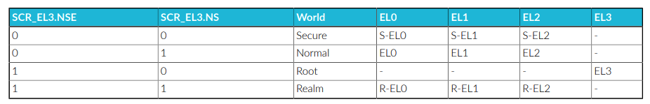

The following diagram shows the four worlds, and their relationship to the
SCR_EL3 NS and NSE bits:

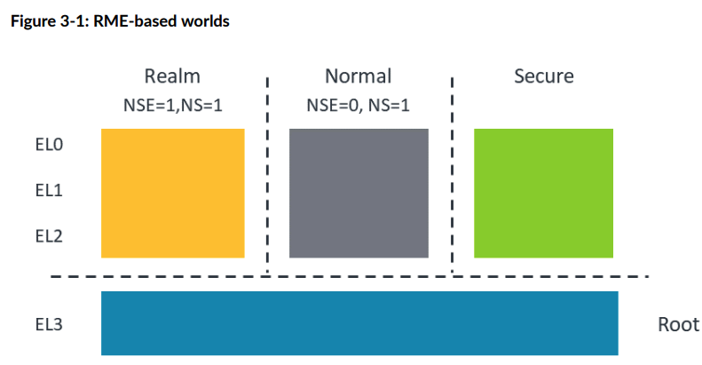

The Root world enables trusted boot execution and switching between the
different worlds. The PE resets into the Root world.

The Realm world provides an execution environment for VMs that is isolated from
the Normal and Secure worlds. VMs require control from the Host in the Normal
world. To enable full control of Realm creation and execution, the Arm CCA
system requires the RMM, which is part of the firmware that is required to
manage Realm creation and execution under requests from a Normal world Host.

For more details, see Arm CCA Hardware Architecture and Arm CCA Software
Architecture.

> 根世界（Root world）支持可信启动的执行，并负责在不同世界之间进行切换。处理器元
> 素（PE）复位时会进入根世界。
>
> Realm 世界为虚拟机（VM）提供了一个与普通世界和安全世界隔离的执行环境。虚拟机需
> 要由普通世界的 Host 进行控制。为了实现对 Realm 创建和执行的全面管理，Arm CCA
> 系统需要 RMM（Realm Management Monitor），它是固件的一部分，负责根据普通世界
> Host 的请求来管理 Realm 的创建和执行。
>
> 更多详细信息，请参见《Arm CCA 硬件架构》和《Arm CCA 软件架构》。
{: .prompt-trans}

### Realm Planes

Realm Planes enable Realms to be subdivided into a set of execution environments
which share the same IPA to PA translations, but which can have different memory
access permissions. Each Plane has its own register context within the Realm
Execution Context (REC). You could consider A REC as a Virtual Processing
Element (vPE). Each Plane is an isolated execution context. Realm Management
Monitor specification v1.1 describes the use of Planes, the specification can be
found here RMM Specification v1.1.

Realm Planes remove the need to have multiple Realms with connected
functionality and all the overhead this entails. All the functionality can
reside in a single Realm with the Execution Context isolated in each Plane as
required and this only requires one Realm being created and controlled by the
RMM.

Planes allow security services required by a Realm to be implemented inside the
Realm itself, but isolated from the main guest OS.

Realm Planes are partitioned at Realm creation. A Realm can have several Planes
within the REC numbered from P0 to Pn.

> Realm 平面（Realm Planes）允许将一个 Realm 细分为一组执行环境，这些环境共享相
> 同的 IPA 到 PA（中间物理地址到物理地址）转换，但可以拥有不同的内存访问权限。每
> 个平面在 Realm 执行上下文（REC）中都有自己独立的寄存器上下文。你可以将 REC 看
> 作是一个虚拟处理单元（vPE）。每个平面都是一个隔离的执行上下文。Realm
> Management Monitor v1.1 规范详细描述了平面的使用，规范可在 RMM Specification
> v1.1 中查阅。
>
> Realm 平面的设计消除了需要多个具有相关功能的 Realm 及其带来的所有管理开销。所
> 有功能都可以存在于单一的 Realm 内部，根据需要在每个平面中实现隔离的执行上下文，
> 这样只需创建并由 RMM 控制一个 Realm 即可。
>
> 平面允许 Realm 所需的安全服务在 Realm 内部实现，并与主客户操作系统隔离。
>
> Realm 平面在 Realm 创建时进行分区。一个 Realm 可以在 REC 中拥有多个平面，编号
> 从 P0 到 Pn。
{: .prompt-trans}

The number of Planes is specified at Realm creation and fixed thereafter. The
first Plane (referred to as P0) has additional capabilities which allow it to:

* Control entry into other Planes (“Pn” is used as a shorthand to mean “any
  Plane other than P0”)
* Handle exceptions taken from Pn
* Context switch register state of Pn
* Manage memory access permissions for Pn
* Configure traps taken from Pn
* Either emulate an interrupt controller for Pn, or pass through to Pn
  interrupts injected by the Host
* Issue RSI commands to interface with the RMM

The following diagram shows a simple use case for Realm Planes. In this example,
the Realm contains two Planes:

* P1 contains the main guest OS, in this example based on Linux
* P0 includes a Virtual Trusted Platform Module (vTPM) emulation, which can be
  used to record the state of P1, including measurements of each of P1’s boot
  stages

> 平面的数量在 Realm 创建时指定，之后保持不变。第一个平面（称为 P0）具有额外的能
> 力，可以：
> 
> * 控制进入其他平面（“Pn”用作“除 P0 以外的任意平面”的简写）
> * 处理来自 Pn 的异常
> * 切换 Pn 的寄存器状态
> * 管理 Pn 的内存访问权限
> * 配置来自 Pn 的陷阱（trap）
> * 可以为 Pn 模拟一个中断控制器，或者将 Host 注入的中断直接传递给 Pn
> * 向 RMM 发起 RSI 命令以进行接口通信
>
> 下图展示了 Realm 平面的一个简单用例。在这个例子中，Realm 包含两个平面：
> 
> * P1 包含主客户操作系统，本例中为基于 Linux 的系统 
> * P0 包含虚拟可信平台模块（vTPM）仿真，可用于记录 P1 的状态，包括对 P1 各个启
>   动阶段的测量
{: .prompt-trans}

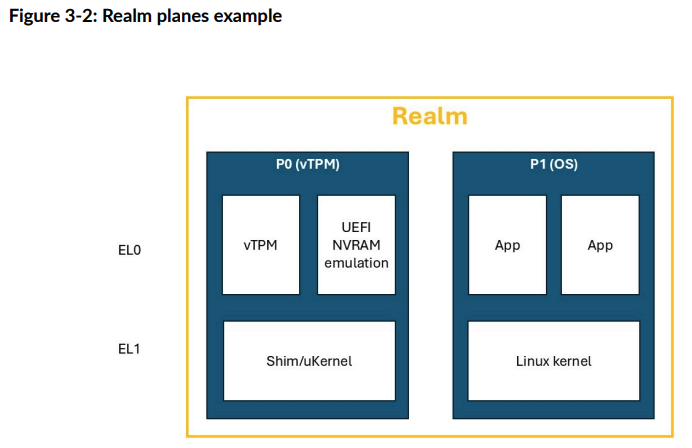

A REC executes in a single Plane at a time. Exception handlers control starting
and yielding of Plane execution.

There are two options for management of per-Plane memory access permissions:

1. On platforms which implement FEAT_S2POE and FEAT_S2PIE, a single stage 2
   translation table can be used by all Planes within a Realm, with per-Plane
   access permissions being specified indirectly.

2. Alternatively, each Plane can have its own stage 2 translation table, with
   the RMM ensuring that IPA to PA translations are identical while per-Plane
   access permissions can be different.

> 一个 Realm 执行上下文（REC）在任意时刻只能在单一平面上执行。异常处理程序控制平
> 面执行的开始和结束。
>
> 对于每个平面内存访问权限的管理，有两种选项：
>
> 1. 在支持 FEAT_S2POE 和 FEAT_S2PIE 的平台上，可以使用一个单一的二级地址翻译表
>    （stage 2 translation table）供 Realm 中所有平面使用，通过间接方式指定每个
>    平面的访问权限。
> 2. 或者，每个平面都可以拥有自己的二级地址翻译表，RMM 负责确保所有平面中的 IPA
>    到 PA 具有相同的translation ，而每个平面的访问权限可以不同。
{: .prompt-trans}

### What is the difference between Arm TrustZone Extensions and Arm RME?

All Arm A-Profile processors have can the Arm TrustZone architecture extensions.
These extensions enable development of an isolated execution and data
environment. Elements like a Trusted Operating System (TOS) can service Trusted
applications, which execute in isolation, to service Secure requests from the
Rich OS that is running in the Normal world.

The addition of virtualization to the Secure world in Armv8.4-A enable you to
manage multiple Secure Partitions in the Secure world. This feature can enable
you to apply multiple TOSs to a system. The Secure Partition Manager (SPM),
executing at S_EL2, is the manager for the Secure Partitions. The SPM has a
similar functionality to the hypervisor in the Normal world.

In operation, the Trusted OS is often part of a chain of trust. It is verified
by higher privilege firmware. In some systems this is the SPM. This means that
the TOS relies on the relationship with the higher privilege firmware developer.

> 所有 Arm A-Profile 处理器都支持 Arm TrustZone 架构扩展。这些扩展能够开发一个隔
> 离的执行与数据环境。诸如可信操作系统（TOS）等组件可以为可信应用提供服务，这些
> 应用在隔离环境中运行，以响应来自运行在普通世界中的丰富操作系统（Rich OS）的安
> 全请求。
>
> 在 Armv8.4-A 中，安全世界（Secure world）加入了虚拟化功能，从而可以在安全世界
> 中管理多个安全分区（Secure Partition）。这一特性使得系统能够部署多个可信操作系
> 统（TOS）。安全分区管理器（SPM）在 S_EL2 级别执行，负责管理安全分区。SPM 的功
> 能类似于普通世界中的虚拟机管理程序（hypervisor）。
>
> 在实际运行中，可信操作系统通常是信任链的一部分，它会被更高权限的固件进行验证。
> 在某些系统中，这个更高权限的固件就是 SPM。这意味着 TOS 的安全性依赖于与更高权
> 限固件开发者之间的信任关系。
{: .prompt-trans}

The following methods initiate the execution of the TOS:

* Rich OS yielding, where the Rich OS enters an idle loop and executes an SMC
  instruction to call the TOS through the Monitor
* Interrupt targeted at the TOS. Secure type 1 interrupts execute the TOS. A
  secure type 1 interrupt asserted during Normal world execution calls the TOS
  through the Monitor.

> 以下方法可以启动可信操作系统（TOS）的执行：
>
> * 丰富操作系统（Rich OS）让出执行权：Rich OS 进入idle loop，并通过执行 SMC 指
>   令，通过 Monitor 调用 TOS。
> * 触发面向 TOS 的中断：Secure type 1 interrupt 会执行 TOS。在普通世界执行期间，
>   如果触发了安全类型 1 的中断，会通过 Monitor 调用 TOS。
{: .prompt-trans}

A Realm VM is different to a TOS or Trusted application because the Realm VM is
**controlled from the Normal world Host**. In areas such as creation and memory
allocation, the Realm VM acts like any other VM being controlled from the Host.

A difference between the Realm VM execution and the TOS execution is that the
Realm does not have any physical interrupts enabled. All interrupts for the
Realm are virtualized by the hypervisor and then signaled to the Realm through
commands passed to the RMM. This means that a compromised hypervisor might
prevent execution of the Realm VM, so there is no guarantee of Realm execution.

> Realm 虚拟机（Realm VM）与可信操作系统（TOS）或可信应用不同，因为 Realm VM 是
> 由普通世界的 Host 控制的。在创建和内存分配等方面，Realm VM 的行为与由 Host 控
> 制的, 和其他虚拟机(running in Normal world)类似。
>
> Realm VM 的执行与 TOS 的执行之间的一个区别是，Realm 不启用任何物理中断。所有针
> 对 Realm 的中断都由虚拟机管理程序（hypervisor）进行虚拟化，然后通过传递给 RMM
> 的命令通知 Realm。这意味着，如果 hypervisor 被攻破，可能会阻止 Realm VM 的执行，
> 因此无法保证 Realm 一定可以正常运行。
{: .prompt-trans}

It is expected that the software entities which make use of each of Realms and
TrustZone will differ in terms of the relationships between the software vendor
and the platform owner.

A TOS controls execution of Trusted applications that are used for
**platform-specific services**. The Trusted applications are developed during
the platform development,by developers such as Silicone Providers (SiPs) and
Original Equipment Manufacturers (OEMs). The Trusted applications are very
closely tied to the chain of trust for the platform from the platform boot.

Realm execution is **intended to allow general developers to execute code on a
system without being involved in complex business relationships with the
developers in the compute system**. Arm CCA enables Realms to be created and
destroyed on demand under the control of the Normal world host. Resources can be
added or retrieved from Realms dynamically.

> 预计使用 Realm 和 TrustZone 的软件实体，在软件供应商与平台所有者之间的关系方面
> 会有所不同。
>
> 可信操作系统（TOS）负责控制用于平台专用服务的可信应用的执行。这些可信应用通常
> 由平台开发过程中相关的开发者（如芯片供应商（SiPs）和原始设备制造商（OEMs））开
> 发。可信应用与平台从启动开始的信任链紧密关联。
>
> Realm 的执行旨在让普通开发者能够在系统上运行代码，而无需与计算系统中的开发者建
> 立复杂的业务关系。Arm CCA 允许在普通世界主机的控制下按需创建和销毁 Realm，可以
> 动态地向 Realm 添加或回收资源。
{: .prompt-trans}

Information security is often described in terms of the following three
principles:

* Confidentiality: data can only be observed by authorized users or processes.
* Integrity: data can only be modified by authorized users or processes.
* Availability: data or a service can be accessed in a timely manner by
  authorized users or processes.

A TOS can provide a guarantee of Confidentiality, Integrity and Availability.
Arm CCA provides Realms with a guarantee of Confidentiality and Integrity, but
not Availability.

The four-world environment provided by the Arm CCA system enables the complete
separation between the Secure world and Realm world. This allows the entities
within each of Secure world and Realm world to be independently deployed and
mutually distrusting.

> 信息安全通常用以下三个原则来描述：
>
> * 机密性：数据只能被授权的用户或进程访问。
> * 完整性：数据只能被授权的用户或进程修改。
> * 可用性：数据或服务能够被授权的用户或进程及时访问。
>
> 可信操作系统（TOS）能够为机密性、完整性和可用性提供保障。而 Arm CCA 为 Realm
> 提供了机密性和完整性的保障，但不保证可用性。
>
> Arm CCA 系统提供的四世界环境实现了安全世界（Secure world）和 Realm 世界之间的
> 完全隔离。这使得安全世界和 Realm 世界中的实体能够独立部署，并且可以相互不信任。 
{: .prompt-trans}

## 4. Arm CCA Hardware Architecture

This section describes the RME, which are the changes to PE architecture that
enable PEs to run Realms.

> 本节介绍 RME，即对处理器元素（PE）架构的改进，使 PE 能够运行 Realm。
{: .prompt-trans}

### Realm world requirements

The following diagram shows a complete view of how Realms fit within an Arm CCA
system:

> 下图展示了 Realms 在 Arm CCA 系统中的整体结构与位置：
{: .prompt-trans}

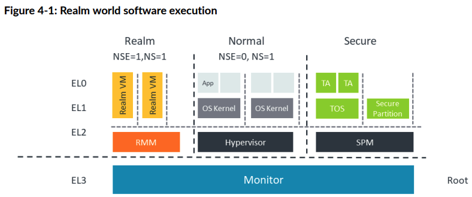

The Realm world must be able to execute code, and access memory and trusted
devices, in complete isolation from all other non-Root worlds and devices.

Similar to the other worlds, or security states, the Realm world has three
Exception levels, R-EL0, R-EL1, and R-EL2. Realm VMs run in R-EL1 and R-EL0. The
Realm Management Monitor (RMM) runs in R-EL2. The [Arm CCA Software Stack]
describes the RMM.

Isolation between worlds is enforced by hardware through faulting exceptions and
by physical memory encryption.

The following diagram illustrates that a Realm VM executes in the Realm world,
but its resources are managed by the hypervisor executing in Normal world. This
management is performed via requests sent by the hypervisor to the RMM.

> Realm 世界必须能够在与所有其他非 Root 世界和设备完全隔离的情况下执行代码、访问
> 内存和可信设备。
>
> 与其他世界或安全状态类似，Realm 世界也有三个异常级别：R-EL0、R-EL1 和 R-EL2。
> Realm 虚拟机在 R-EL1 和 R-EL0 级别运行，Realm 管理监控器（RMM）在 R-EL2 级别运
> 行。[Arm CCA 软件栈] 介绍了 RMM 的相关内容。
>
> 世界之间的隔离由硬件通过异常故障（faulting exceptions）和物理内存加密来强制实
> 现。
{: .prompt-trans}

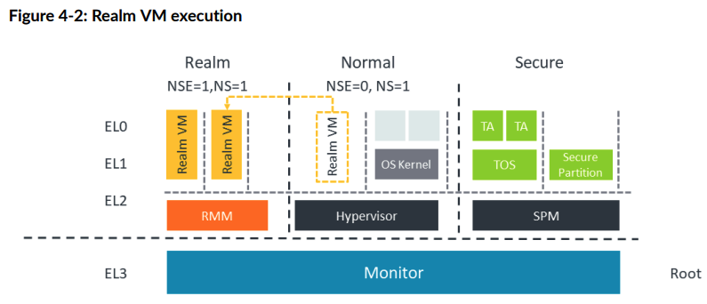

The Monitor is the gatekeeper between the separate worlds. It controls any
passage between Normal world, Secure world, and Realm world to ensure that the
isolation between the worlds is maintained. The Monitor allows communication and
control where needed.

> Monitor 是各个世界之间的守门人。它负责控制普通世界、安全世界和 Realm 世界之间
> 的所有通道，以确保各世界之间的隔离性得以保持。Monitor 在需要时允许通信和控制。
{: .prompt-trans}

### Memory management for Arm CCA

Arm A-profile processors that implement the TrustZone Security Extensions
present two Physical Address Spaces (PAS):

* Non-secure physical address space
* Secure physical address space

The Realm Management Extension add another two PAS:

* Realm physical address space
* Root physical address space

Each location within physical memory can be made accessible via a single
PAS. This is illustrated in the following diagram

> 实现了 TrustZone 安全扩展的 Arm A-profile 处理器提供了两个物理地址空间（PAS）：
>
> * 非安全物理地址空间
> * 安全物理地址空间
>
> Realm 管理扩展（RME）又增加了另外两个物理地址空间：
>
> * Realm 物理地址空间
> * Root 物理地址空间
>
> 物理内存中的每个位置只能通过一个物理地址空间进行访问。下图对此进行了说明。
{: .prompt-trans}

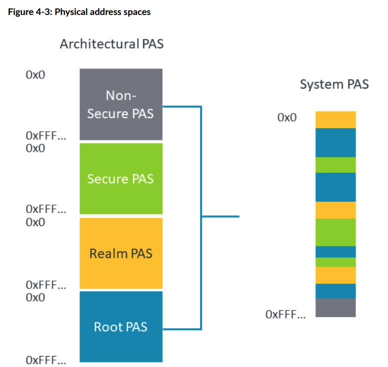

Depending on the Security state in which a PE is executing, a subset of PAS are
accessible. The subset is shown in the following table.

> 根据 PE 执行时所处的安全状态，不同的物理地址空间（PAS）是可访问的。下表列出了
> 可访问的物理地址空间的子集。
{: .prompt-trans}

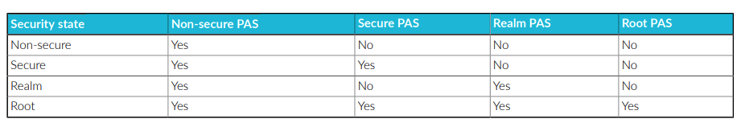

The PAS via which each physical location is accessible is controlled by Root
security state. This means that firmware executing in Root security state is
effectively able to transfer ownership of physical memory between each of
Non-secure, Secure and Realm worlds.

To ensure that the isolation rules for all worlds are enforced, the physical
memory access controls in the preceding table are enforced by the Memory
Management Unit (MMU), downstream of any address translation. This process is
called Granule Protection Check (GPC).

The PAS assignment of every granule of physical memory is described in the
Granule Protection Table (GPT). The Monitor in Exception level 3 can dynamically
update the GPT which allows the physical memory to be moved between the worlds.

Any access control violation results in a new type of fault, which is called a
Granule Protection Fault (GPF). Root state controls the enablement of the GPC,
the contents of the GPT and the routing of a GPF.

> 每个物理地址空间（PAS）能够访问物理内存的位置由根安全状态（Root security state）
> 进行控制。这意味着在根安全状态下运行的固件实际上可以在非安全世界、安全世界和
> Realm 世界之间转移物理内存的所有权。
>
> 为了确保所有世界的隔离规则得到执行，前述表格中的物理内存访问控制由内存管理单元
> （MMU）在地址转换之后进行强制执行。这个过程称为粒度保护检查（Granule
> Protection Check，GPC）。
>
> 物理内存中每个粒度（granule）的 PAS 分配情况都记录在粒度保护表（Granule
> Protection Table，GPT）中。异常级别 3（Exception level 3）下的 Monitor 可以动
> 态更新 GPT，从而实现物理内存在各个世界之间的移动。
>
> 任何访问控制违规都会导致一种新的故障类型，称为粒度保护故障（Granule Protection
> Fault，GPF）。根安全状态负责 GPC 的启用、GPT 的内容以及 GPF 的路由。
{: .prompt-trans}

Resources belonging to a Realm must be in Realm-owned memory, meaning part of
the Realm PAS, to ensure isolation. However, a Realm might need to access some
resources held in Non-secure memory, for example to enable message passing. This
means that a Realm needs to be able to access physical addresses in both the
Realm and Non-secure PASs.

Within the EL3 translation regime, RME introduces an additional bit in the
translation table descriptor, called NSE. Using NSE together with the existing
NS bit, EL3 software can map any of Root, Non-Secure, Secure and Realm PAS.

Within the Realm EL1&0 translation regime and the Realm EL2&0 translation regime,
the NS bit allows software at R-EL2 to map either Realm PAS or Non-Secure PAS.
Access to the different PAS is controlled by the state of the NS bit in the
Realm stage 2 translation table.

> 属于 Realm 的资源必须位于 Realm 所有的内存中，即属于 Realm 物理地址空间（PAS），
> 以确保隔离性。然而，Realm 可能需要访问存放在非安全内存中的某些资源，例如用于消
> 息传递。这意味着 Realm 需要能够访问 Realm PAS 和非安全 PAS 中的物理地址。
>
> 在 EL3 翻译机制下，RME 在翻译表描述符中引入了一个新位，称为 NSE 位。结合 NSE
> 位与现有的 NS 位，EL3 层的软件可以映射 Root、非安全、安全和 Realm 这四种 PAS。
>
> 在 Realm EL1&0 和 Realm EL2&0 的翻译机制下，NS 位允许 R-EL2 层的软件映射 Realm
> PAS 或非安全 PAS。对不同 PAS 的访问由 Realm 二级翻译表中的 NS 位状态进行控制。
> > NOTE
> >
> > 我们可以思考下guest和host共享的内存资源大概有哪些:
> >
> > * DMA BUFFER
> > * PV features share memory
> > * virtio
> >
> > 并且向DMA buffer 往往是动态的(其实PV share memory也是), 所以就需要RMM (R-EL2)
> > 去切换 page table entry, 至于是更改了该page 所属的PAS还是创建了一个新page，更改
> > 映射，就看RMM怎么实现
> {: .prompt-tip}
{: .prompt-trans}

The following diagram shows the position of the GPC in the logical sequence of
steps which occur during translation of a Virtual Address (VA) to a Physical
Address (PA). In this diagram, TTD is Translation Table Descriptor and GPTD is
Granule Protection Table Descriptor:

> 下图展示了在虚拟地址（VA）到物理地址（PA）转换过程中，GPC（粒度保护检查）在逻
> 辑步骤中的位置。在图中，TTD 代表翻译表描述符（Translation Table Descriptor），
> GPTD 代表粒度保护表描述符（Granule Protection Table Descriptor）：
{: .prompt-trans}

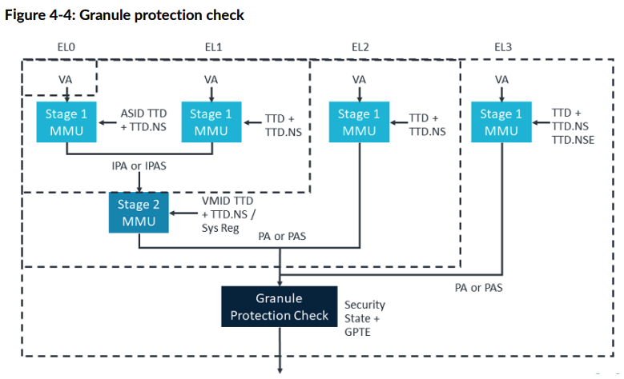

The diagram shows the translation stages within an RME-based platform for the
virtual address to physical address translation.

For more information on stage 1 and stage 2 translation see AArch64 Memory
Management.

RME adds the GPC after the translation process for stage 1 and stage 1 and 2
translations The GPC checks all physical addresses and PAS against the GPT to
allow memory access or create a fault. The GPT is held in Root memory to ensure
that it is isolated from all other worlds. The GPT can only be created and
modified by code running in the Root world, from the Monitor code or Trusted
Firmware.

Non-PE Requesters can also be included in this check if they are connected to a
Requester side filter like a System MMU (SMMU).

> 该图展示了在基于 RME 的平台上，虚拟地址到物理地址转换过程中的各个翻译阶段。
>
> 关于一级和二级地址转换的更多信息，请参阅《AArch64 内存管理》。
> 
> RME 在一级和一级/二级地址转换过程结束后增加了粒度保护检查（GPC）。GPC 会根据粒
> 度保护表（GPT）检查所有物理地址和物理地址空间（PAS），以决定是否允许内存访问或
> 产生故障。GPT 存储在 Root 内存中，以确保它与其他世界隔离。只有在 Root 世界下运
> 行的代码（如 Monitor 代码或可信固件）才能创建和修改 GPT。
>
> 如果非 PE 请求者（Non-PE Requesters）连接到类似于系统 MMU（SMMU）这样的请求端
> 过滤器，也可以包含在此检查范围内。
{: .prompt-trans}

## 5. Arm CCA Software Architecture

Arm CCA platforms are created through a mix of hardware additions, such as RME
in the PEs, and firmware components, in particular the Monitor and Realm
Management Monitor. This section describes the software stack for an Arm CCA
platform.

> Arm CCA 平台是通过硬件扩展（如处理器元素中的 RME）与固件组件（尤其是 Monitor
> 和 Realm Management Monitor）相结合来实现的。本节将介绍 Arm CCA 平台的软件栈。
{: .prompt-trans}

#### Software Stack

The actions performed by software to manage a Realm can be divided into two
parts:

* **Policy**: decisions regarding which resources (memory; processor cycles;
  devices) to allocate to a Realm. This is the responsibility of the
  hypervisor.
* **Mechanism**: enacting a policy decision requires changing architectural
  state, such as modifying a translation table, or context-switching the state
  held in a processor register.

> 由软件执行的 Realm 管理操作可以分为两个部分：
>
> 策略（Policy）：关于为 Realm 分配哪些资源（如内存、处理器周期、设备）的决策。
> 这部分由虚拟机管理程序（hypervisor）负责。
>
> 机制（Mechanism）：落实策略决策需要改变体系结构状态，例如修改翻译表或切换处理
> 器寄存器中保存的上下文状态。
{: .prompt-trans}

When this action relates to a Realm and the hypervisor cannot be trusted to
perform it, the RMM performs the action for the hypervisor.

The RMM isolates Realms from each other through the stage 2 page tables in the
Realm world.

The RMM interfaces directly to the Monitor which also interfaces with the Secure
world and the Normal world. The Monitor, running in Exception level 3, has the
platform-specific code that must service all the Trusted functionality of the
system. The RMM responds to a specific interface and has fully defined
functionality to manage the requests from the Host and Realms. Because this
interface is well-defined, the RMM can be generic code for all Arm CCA systems. 

> 当某项操作涉及 Realm 且不能信任虚拟机管理程序（hypervisor）来执行时，RMM 会代
> 替 hypervisor 执行该操作。
>
> RMM 通过 Realm 世界中的二级页表实现对各个 Realm 之间的隔离。
>
> RMM 直接与 Monitor 进行接口通信，而 Monitor 还与安全世界和普通世界进行交互。
> Monitor 运行在异常级别 3（Exception level 3），其中包含必须服务于系统所有可信
> 功能的平台专用代码。RMM 响应特定的接口，并具备完善的功能来管理来自 Host 和
> Realm 的请求。由于该接口定义明确，RMM 可以作为所有 Arm CCA 系统的通用代码。
{: .prompt-trans}

The following diagram shows the complete Arm CCA platform running a confidential
Realm VM in the Realm world:

> 下图展示了在 Realm 世界中运行机密 Realm 虚拟机的完整 Arm CCA 平台： 
{: .prompt-trans}


The RMM is the controlling software in the Realm world that reacts to requests
from the hypervisor in the Normal world to enable the management of the Realm VM
execution. The RMM communicates through the Monitor in Root world to control
Realm memory management functions for memory transition between NS PAS and Realm
PAS.

> RMM 是 Realm 世界中的控制软件，负责响应来自普通世界 hypervisor 的请求，以实现
> 对 Realm 虚拟机执行的管理。RMM 通过根世界（Root world）中的 Monitor 进行通信，
> 以控制 Realm 的内存管理功能，实现 NS PAS（非安全物理地址空间）与 Realm PAS
> （Realm 物理地址空间）之间的内存转换。
{: .prompt-trans}

### Realm Management Monitor

The RMM is the Realm world firmware that manages the execution of the Realm VMs
and their interaction with the hypervisor in Normal world. The RMM operates in
Exception level 2 in the Realm world, known as R_EL2.

In the Arm CCA system, the RMM provides services to the Host, to enable the Host
to manage the Realms, and the RME also supplies services directly to the Realms.

The Host services can be split into areas of policy and mechanics.

For the Policy functionality, the Host owns all the policy decisions, including
the following:

* When to create or destroy a Realm
* When to add or remove memory from a Realm
* When to schedule a Realm in or out

> RMM 是 Realm 世界中的固件，负责管理 Realm 虚拟机的执行以及与普通世界
> hypervisor 的交互。RMM 在 Realm 世界的异常级别 2（R_EL2）下运行。
>
> 在 Arm CCA 系统中，RMM 向主机（Host）提供服务，以使 Host 能够管理 Realm，同时
> RME 也直接向 Realm 提供服务。
>
> Host 服务可以分为策略（policy）和机制（mechanics）两部分。
>
> 在策略功能方面，Host 拥有所有策略决策权，包括如下内容：
>
> * 何时创建或销毁一个 Realm
> * 何时向 Realm 添加或移除内存
> * 何时调度 Realm 的运行或暂停
{: .prompt-trans}

The RMM supports the host Policies by providing the following functionality:

* Services to manipulate Realm page tables, which are used in creation or
  destruction and the addition or removal of Realm memory
* Management of Realm context. This is context save and restore used in
  scheduling.
* Interrupt support
* PSCI call interception. This is power management requests. The RMM also
  provides services to Realms, primarily attestation and cryptographic
  services.

> RMM 通过以下功能来支持主机（Host）的策略决策：
>
> * 提供操作 Realm 页表的服务，用于 Realm 的创建或销毁，以及内存的添加或移除
> * 管理 Realm 上下文，包括在调度时进行上下文的保存与恢复
> * 支持中断处理
> * 拦截 PSCI 调用（即电源管理请求）
{: .prompt-trans}

The RMM also upholds the following security primitives for the Realms:

* The RMM validates hosts requests for correctness
* The RMM isolates Realms from each other

The RMM specification defines two interfaces:

* The Realm Management Interface (RMI) used by the Host
* The Realm Services Interface (RSI) used by the Realm.

> RMM 还为 Realms 提供以下安全基础机制：
>
> * RMM 验证主机（Host）的请求是否正确
> * RMM 实现对各个 Realm 之间的隔离
>
> RMM 规范定义了两个接口：
> 
> * 主机使用的 Realm 管理接口（RMI）
> * Realm 使用的 Realm 服务接口（RSI）
{: .prompt-trans}

Each of these interfaces comprises a set of SMCCC-compliant commands.

Arm CCA additionally defines an interface called the Realm Host Interface (RHI)
used for communications between the guest and the hypervisor. The RMM is not
used for the RHI communication.

In the following sections, we look at each of these interfaces

> 每个接口都包含一组符合 SMCCC 标准的命令。
>
> Arm CCA 还定义了一个称为 Realm 主机接口（RHI）的接口，用于客户机与虚拟机管理程
> 序（hypervisor）之间的通信。RHI 通信不涉及 RMM。
>
> 在接下来的章节中，我们将分别介绍这些接口。
{: .prompt-trans}

### Realm Management Interface

The RMI is the interface between the RMM and the Normal world Host.

The RMI enables control of Realm management which includes creation, population,
execution, and destruction of the Realms.

The following diagram shows where the RMI is implemented between the Normal
world Host, Monitor, and the RMM:

> RMI 是 RMM 与普通世界 Host 之间的接口。
>
> RMI 实现了对 Realm 管理的控制，包括 Realm 的创建、资源分配、执行和销毁等操作。
>
> 下图展示了 RMI 在普通世界 Host、Monitor 和 RMM 之间的具体实现位置：
{: .prompt-trans}

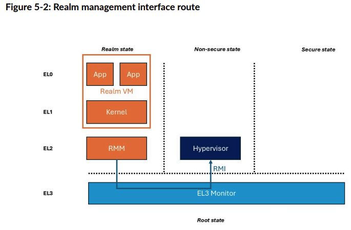

### Realm Services Interface

The Realm Service Interface (RSI) is the interface between the Realm VM and the
RMM.

The RSI allows the Realm to request services including:

* Requesting an attestation report describing the CCA platform and the Realm’s
  initial state
* Managing properties of the Realm’s address space, including sharing memory
  with the Host
* Attesting and accepting devices which are assigned to the Realm

The following diagram shows the position of the RSI between the RMM and each
individual Realm VM:

> Realm 服务接口（RSI）是 Realm 虚拟机与 RMM 之间的接口。
>
> 通过 RSI，Realm 可以请求以下服务：
> 
> * 请求认证报告，用于描述 CCA 平台和 Realm 的初始状态
> * 管理 Realm 地址空间的属性，包括与 Host 共享内存
> * 对分配给 Realm 的设备进行认证和接收
>
> 下图展示了 RSI 在 RMM 与各个 Realm 虚拟机之间的位置关系：
{: .prompt-trans}

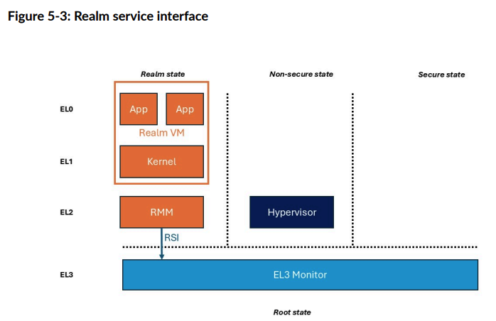

### Realm Host Interface

The Realm Host Interface (RHI) is the interface between the Realm and the
untrusted host hypervisor in the non-secure world.

The RHI enables the host to request Realm management functions through a trusted
interface.

> Realm 主机接口（RHI）是 Realm 与非安全世界中的不可信主机虚拟机管理程序
> （hypervisor）之间的接口。
>
> RHI 允许主机通过受信任的接口请求 Realm 管理功能。
{: .prompt-trans}

The RHI provides a standard interface for a Realm to request services from the
Host, where those services do not require participation of the CCA firmware (RMM
and EL3 Monitor). Examples of such services include:

* Early Provisioning of secrets to a Realm during guest boot.
* Discovery of Host-imposed constraints on the granularity that memory can be
  shared between Realm and Host.
* Retrieval of attestation evidence related to Realm-assigned devices. The
  attestation token is stored by the Host and secured via hashes held by the
  RMM.

The following diagram shows how RHI is used by the guest to request services
from the Host. Although the RMM and EL3 Monitor are not participants in this
communication, they are part of the transport for RHI commands.

> RHI 为 Realm 向 Host 请求服务提供了标准接口，这些服务不需要 CCA 固件（即 RMM
> 和 EL3 Monitor）的参与。此类服务示例包括：
>
> * 在客户机启动期间，提前向 Realm 提供密钥等机密信息。
> * 发现 Host 强加的内存共享粒度约束，即在 Realm 与 Host 之间共享内存时的限制。
> * 获取与分配给 Realm 的设备相关的认证证据。认证令牌由 Host 存储，并通过 RMM 保
>   存的哈希值进行保护。
>
> 下图展示了客户机如何通过 RHI 向 Host 请求服务。虽然 RMM 和 EL3 Monitor 不直接
> 参与此类通信，但它们是 RHI 命令传输路径的一部分。
>
> > 按照AMD SEV来看，Early Provisioning of secrets to a Realm VM, 是由VMM 和 
> > guest owner进行交互，所以实际上是由guest 直接请求VMM, 但是VMM也会向RMM导入 
> > 导出证书等内容用户加密信道的建立 
> {: .prompt-tip}
{: .prompt-trans}

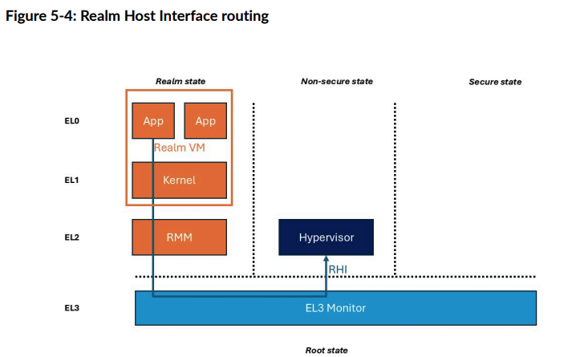

## 6. Device Assignment and Memory Encryption Contexts

## 7. Confidential Compute in use

The need for Confidentiality in Compute systems spans many market segments.
Confidential Compute enables shorter trust chain relationships for application
and OS developers and will ease the certification load.

The confidentiality afforded within a Realm VM enables different services to be
isolated from the Normal world execution, while being controlled from the Normal
world for setup and execution

> 计算系统对机密性的需求涵盖了许多市场领域。机密计算（Confidential Compute）为应
> 用和操作系统开发者提供了更短的信任链关系，也会减轻认证负担。
>
> Realm 虚拟机所提供的机密性，使得不同服务能够与普通世界的执行环境隔离，同时又可
> 以由普通世界进行配置和管理。
{: .prompt-trans}

### 7.1 Use cases

The following sections describe some of the use cases and how they are set up in
an Arm Confidential Compute platform, with pointers to any examples, where
available.

The use cases will describe what is being enabled and what it allows an end user
to achieve while showing which CCA features the use case exercises.

> 接下来的章节将介绍一些在 Arm 机密计算平台上的使用场景，以及这些场景的具体设置
> 方式，并在有示例时给出参考。
>
> 这些使用场景将说明实现了哪些功能，以及最终用户能够实现什么目标，同时展示该场景
> 涉及了哪些 CCA 特性。
{: .prompt-trans}

#### Boot and attest a Realm

Booting and attesting a Realm is the very basic task of initiating and booting a
Realm on a platform. For CCA this should be from an attested and trusted
platform.

Boot and attest use case enables an end user to attest that a Realm has been
created correctly, on a trustworthy CCA platform

The CCA features that are exercised by this are:
* Realm creation
* Realm execution
* Remote attestation of CCA platform and Realm

> 启动和认证 Realm 是在平台上初始化并启动 Realm 的最基本任务。对于 CCA，这一过程
> 应当在经过认证和可信的平台上进行。
>
> 启动和认证的使用场景使最终用户能够验证 Realm 是否在可信的 CCA 平台上被正确创建。
>
> 该场景涉及的 CCA 特性包括：
>
> * Realm 的创建
> * Realm 的执行
> * CCA 平台和 Realm 的远程认证
{: .prompt-trans}

The Boot and Attest use case is responsible for creating a Realm on an attested
platform and then executing code within that Realm in isolation from the
Non-secure and Secure worlds. The Realm is created under control from the Normal
world hypervisor using the RMI interface to create the isolated VM for
execution.

This example use case should be used as a starting point for other CCA use
cases. Although the Realm is a protected execution environment, its contents are,
by definition, entirely nonconfidential due to being input from a
non-confidential source media. Therefore, this should be used as a starting
point for any further CCA use cases.

The following link shows the Arm Learning Path for how to create a Realm in the
Arm Software stack:

> 启动和认证的使用场景负责在经过认证的平台上创建一个 Realm，并在该 Realm 中隔离
> 地执行代码，使其与非安全世界和安全世界隔离。Realm 的创建由普通世界的虚拟机管理
> 程序（hypervisor）通过 RMI 接口控制，以创建用于执行的隔离虚拟机。
>
> 此示例场景应作为其他 CCA 使用场景的起点。虽然 Realm 是一个受保护的执行环境，但
> 由于其内容完全来自非机密的源介质，因此本质上并不具备机密性。因此，该场景应作为
> 进一步 CCA 使用场景的基础。
>
> 以下链接展示了在 Arm 软件栈中创建 Realm 的 Arm 学习路径：
{: .prompt-trans}

#### Boot a Realm from an encrypted disk image

Cloud service developers will want to provision each Realm with minimal firmware
to enable standard boot of a Linux based encrypted Root FileSystem (FS). Owners
of Cloud workloads must ensure their data and workloads are provisioned after
the Root FS has been attested.

Booting a Realm from an encrypted disc builds on the basic Realm creation
described in the section above and ensures the Realm is provisioned with
confidential information, from the encrypted contents of a disk image.

> 云服务开发者希望为每个 Realm 配置最小化的固件，以支持基于 Linux 的加密根文件系
> 统（Root FS）的标准启动。云工作负载的所有者必须确保其数据和工作负载在根文件系
> 统认证之后再进行配置。
>
> 从加密磁盘启动 Realm 是在前文所述的基本 Realm 创建流程基础上进行扩展，确保
> Realm 能够从磁盘镜像的加密内容中获取机密信息进行配置。 
{: .prompt-trans}

The CCA features that are exercised in this use case are:

* The functionality described in Boot and attest a Realm
* A Boot Injection Protocol

Arm provids an example of a boot injection reference software with the Boot
Synchronisation RHI (RHI-BS) interface. Implementors have the option to:

* use the Arm interface
* develop their own interface code.

The reference software is developed from the Realm Host Interface specification
and requirements.

> 该使用场景涉及的 CCA 特性包括：
>
> * “启动和认证 Realm”中描述的相关功能
> * 启动注入协议（Boot Injection Protocol）
>
> Arm 提供了一个带有启动同步 RHI（RHI-BS）接口的启动注入参考软件示例。实现者可以
> 选择：
> 
> * 使用 Arm 提供的接口
> * 开发自己的接口代码 
>
> 参考软件是根据 Realm 主机接口（RHI）规范和相关需求开发的。
{: .prompt-trans}

The protocol describes the trusted injection of the disk encryption key
following Realm attestation to allow secrets to be exchanged between the Realm
application and the Realm owner.

Confidential Compute is not a single point solution. The operation of Secure
boot of a Realm on a platform will require extensive cloud infrastructure to
enable the platform to attest and execute the boot process.

> 该协议描述了在 Realm 认证完成后，如何可信地注入磁盘加密密钥，以便在 Realm 应用
> 与 Realm 所有者之间安全交换密钥等机密信息。
>
> 机密计算并不是一种单点解决方案。在平台上安全启动 Realm 的操作，需要广泛的云基
> 础设施支持，以实现平台的认证和启动过程的执行。
{: .prompt-trans}

#### Live CCA Firmware update

Cloud vendors require the ability to update CCA firmware, such as the Realm
Management Monitor (RMM) or the Root Monitor in EL3, in a live CCA system,
without having to reset the platform to reboot. This operation is required for
all initial CCA platforms.

Arm has developed reference software for this operation which is depends on the
Firmware Activity Log from the RHI 1.0 specification and Live Firmware
Activation specification 1.0.

All platforms will have their own Firmware update solutions so Arm reference
software demonstrating this operation considers the update process optional.
Again, the deployment of the firmware update is dependant upon a wider cloud
infrastructure.

> 服务厂商需要能够在运行中的 CCA 系统中更新 CCA 固件（如 Realm 管理监控器 RMM 或
> EL3 中的 Root Monitor），而无需重置平台或重启系统。这一操作是所有初始 CCA 平台
> 的基本需求。
>
> Arm 针对该操作开发了参考软件，其实现依赖于 RHI 1.0 规范中的固件活动日志
> （Firmware Activity Log）以及 Live Firmware Activation 1.0 规范。
>
> 所有平台都会有各自的固件更新解决方案，因此 Arm 的参考软件将该操作的更新流程视
> 为可选项。同样，固件更新的部署也依赖于更广泛的云基础设施。
{: .prompt-trans}

#### Per-Realm encryption

A cloud workspace owner will require confidentiality in their data when running
in a Realm and would prefer the reassurance of having isolation from all other
Realms running on that platform. Use the Memory Encryption Contexts (MEC) to
enforce separate encryption keys being used for each Realm. For more information
on MEC see Memory Encryption Contexts

Per Realm encryption will be mandatory in early CCA deployments to ensure the
confidentiality of separate workload memory.

Implementation is dependent upon the underlying processors supporting the MEC
feature (FEAT_MEC) corresponding to the architecture version v9.3. Any platform
implementing MEC must include an SMMU which is compliant with the SMMU
architecture specification defined in release F.a or later.

The software development must be compliant with the RMM specification v1.1 with
the MEC sections applied.

> 云工作空间的所有者在 Realm 中运行时需要确保其数据的机密性，并希望能够与平台上
> 其他所有 Realm 保持隔离。可以使用内存加密上下文（Memory Encryption Contexts，
> MEC）来实现对每个 Realm 使用独立加密密钥的强制隔离。关于 MEC 的更多信息，请参
> 阅《Memory Encryption Contexts》。
>
> 在早期 CCA 部署中，每个 Realm 的内存加密将是强制要求，以确保不同工作负载内存的
> 机密性。
>
> 具体实现依赖于底层处理器支持 MEC 功能（FEAT_MEC），该功能对应于架构版本 v9.3。
> 任何实现 MEC 的平台都必须包含符合 SMMU 架构规范 F.a 或更高版本的 SMMU。
>
> 软件开发必须符合 RMM v1.1 规范，并应用其中关于 MEC 的相关章节。
{: .prompt-trans}

#### Non-Realm workload Device Assignment (DA) on KVM Host

When running a workload on a cloud there is a requirement to be able to use a
PCIe-based DMA engine to access memory from a non-Realm source. The user must be
able to assign a PCIe Trusted Device Interface to a workload that is running a
Realm with at least one Plane as a Virtual Machine.

The Realm must fully attest the TDI to confirm the identity and configuration of
the device functionality before allowing the DMA to access the Realm (workload)
memory.

DA use cases require significant support and development to the whole Cloud
infrastructure and to the underlying platform with the integration of the PCIe
elements before the use cases are able to guarantee full CCA operation. The CCA
support for PCIe should include Root Complex Integrated Endpoint (RCiEP) devices
and any off-chip devices. Support for Security Protocol and Data Model (SPDM) is
not mandatory.

> 在云端运行工作负载时，需要能够使用基于 PCIe 的 DMA 引擎从非 Realm 来源访问内存。
> 用户必须能够将 PCIe 可信设备接口（Trusted Device Interface, TDI）分配给在
> Realm 中运行、至少包含一个 Plane 的虚拟机工作负载。
>
> Realm 必须对 TDI 进行完整认证，以确认设备功能的身份和配置，之后才允许 DMA 访问
> Realm（工作负载）内存。
>
> DMA 相关的使用场景需要云基础设施和底层平台进行大量支持和开发，尤其是在集成
> PCIe 元素后，才能保证 CCA 功能的完整实现。CCA 对 PCIe 的支持应包括 Root
> Complex 集成端点（RCiEP）设备以及所有外部芯片设备。对于安全协议与数据模型
> （SPDM），并不强制要求支持。 
{: .prompt-trans}

### 7.2 CCA usage scenarios

The above use cases are effectively building blocks to enable Arm-based
platforms to provide the CCA Guarantee for workloads running on the Arm-based
cloud platforms. The following sections describe some potential areas in which
the use cases can be implemented. This is not an exhaustive list but just a few
examples where the RME and use cases can be used in wider system operations.

> 上述使用场景实际上是构建模块，使基于 Arm 的平台能够为在 Arm 云平台上运行的工作
> 负载提供 CCA 保证。接下来的章节将介绍一些这些使用场景可以应用的潜在领域。这并
> 不是一个详尽的列表，而只是展示了 RME 和相关使用场景在更广泛系统操作中的部分应
> 用示例。
{: .prompt-trans}

#### Operating system vendor services

The use of Arm CCA allows for the execution of individual services in isolation from the Rich OS
environment that has been validated (and potentially attested) by the OEM Chain of Trust. This
means that an OS vendor can develop services to be run as Realm VMs to ensure they can be
executed within strict security requirements.

The basic use of the Arm RME will ensure that all VMs are fully attested on a
trusted platform that can also be regularly attested to ensure CCA Guarantees
are maintained.

> 使用 Arm CCA 可以让各个服务在经过 OEM 信任链验证（甚至认证）的Rich OS环境之外
> 实现隔离运行。这意味着操作系统厂商可以开发以 Realm 虚拟机形式运行的服务，从而
> 确保这些服务能够在严格的安全要求下执行。
>
> Arm RME 的基本应用能够确保所有虚拟机都在可信平台上进行完整认证，并且该平台可以
> 定期认证，以确保持续满足 CCA 的安全保证。
{: .prompt-trans}

#### Sensitive data services

Many OS services collect and store sensitive or personal data during their
execution. This data can be the target for malicious agents who mine and sell
data. Arm CCA allows these services to be executed on any Arm CCA system in
which the RME enables the data to be completely isolated from any Normal world
interference. This can apply to areas such as:

* Address book data
* Healthcare information
* Browser history and cookies
* Auto-complete systems
* Calendar and email
* Clipboard data

Arm CCA also allows isolation of personal data in AI models which can then allow
cloud access to that data and more confidence in off-system analysis of personal
data.

> 许多操作系统服务在运行过程中会收集和存储敏感或个人数据。这些数据可能成为恶意行
> 为者挖掘和出售的目标。Arm CCA 允许这些服务在任何 Arm CCA 系统上运行，在 RME 的
> 支持下，数据能够完全隔离，避免普通世界的任何干扰。这适用于以下领域：
>
> * 通讯录数据
> * 医疗健康信息
> * 浏览器历史和 Cookie
> * 自动补全系统
> * 日历和电子邮件
> * 剪贴板数据
>
> Arm CCA 还支持在 AI 模型中隔离个人数据，从而允许云端访问这些数据，并在进行系统
> 外分析个人数据时提供更高的安全信心。
{: .prompt-trans}

#### User data confidentiality

As OS vendor information in Sensitive data services shows, you can also ensure
isolation of user data from the Normal world without needing the many
relationships with the OEMs and Trusted OS developers. For users, there is no
ability for the platform developer and OS or hypervisor developer to access user
data through privilege escalation or hierarchical privilege.

This means that the user can trust their data on a large server system and be
assured that their data cannot be accessed by the platform owner. For example,
photos can never be seen, and personal works like music files can be stored and
executed without the controlling OS or hypervisor, in the Normal world, being
able to access the files.

This lack of access can both reassure the user and aid the platform developer.
An example is a personally created music file that is stored and executed on a
server using a service like Soundcloud, If any copyright issues for the music
led to a legal challenge, the platform provider is not responsible for a data
leak, and can claim zero liability.

Arm CCA also allows for any service or application developer to run their code
and data in an isolated Realm VM. Executing as a Realm VM allows the developer
to have a higher level of trust in the execution of his code on any platform
supporting Arm CCA.

The following sections show some examples:

> 如敏感数据服务中的操作系统厂商信息所示，用户数据可以与普通世界实现隔离，而无需
> 与 OEM 和可信操作系统开发者建立复杂的信任关系。对于用户来说，平台开发者、操作
> 系统或虚拟机管理程序开发者无法通过权限提升或层级权限访问用户数据。
>
> 这意味着用户可以信任自己的数据在大型服务器系统上的安全性，并确信平台所有者无法
> 访问自己的数据。例如，照片永远不会被查看，个人作品如音乐文件可以被存储和播放，
> 而普通世界中的控制操作系统或虚拟机管理程序都无法访问这些文件。
>
> 这种无法访问既能让用户更加安心，也有利于平台开发者。例如，个人创作的音乐文件存
> 储并在服务器上通过 Soundcloud 等服务播放时，如果因版权问题发生法律纠纷，平台提
> 供方无需为数据泄露负责，可以声明零责任。
>
> Arm CCA 还允许任何服务或应用开发者在隔离的 Realm 虚拟机中运行自己的代码和数据。
> 以 Realm 虚拟机方式运行，开发者可以更信任其代码在任何支持 Arm CCA 的平台上的执
> 行。
>
> 以下章节将展示一些示例：
{: .prompt-trans}

#### Machine Learning models

Machine Learning (ML) and Computer Vision (CV) models for learning and inference
will contain IP that requires isolating to stop theft. With the additional
requirement stop any chance of replacement when used for security functions like
face or other biometric recognition. Arm CCA allows the service to be managed,
updated, and executed in any system without the need to trust the Rich OS or
hypervisor that is being used.

This also allows service developers to ensure that their own ML service is used
for the biometric recognition without having to rely on an OS-based service that
they may not have a trust relationship with.

As Memory Encryption Contexts shows, the confidentiality enabled by Arm CCA
enables data for AI models to be secure on a personal device which can be
accessed and analyzed by cloud services. The user can be confident that the data
is secure on their platform and the access from the cloud is fully secured and
attested.
 
> 用于学习和推理的机器学习（ML）和计算机视觉（CV）模型通常包含需要隔离以防止被盗
> 的知识产权（IP）。此外，在用于安全功能（如人脸或其他生物识别）时，还需要防止模
> 型被替换的风险。Arm CCA 允许这些服务在任何系统中进行管理、更新和执行，无需信任
> 所用的丰富操作系统或虚拟机管理程序。
>
> 这也让服务开发者能够确保自己的机器学习服务被用于生物识别，而不必依赖于他们可能
> 不信任的操作系统服务。
>
> 正如内存加密上下文（Memory Encryption Contexts）所展示的，Arm CCA 提供的机密性
> 能够保障 AI 模型的数据在个人设备上的安全，并且可以被云服务安全访问和分析。用户
> 可以确信其数据在本地平台上是安全的，同时云端的访问也是完全安全且经过认证的。
{: .prompt-trans}

#### Large Trusted services and applications

In many systems the development of the TrustZone enabled Secure world requires
on-SoC memory which is required to be smaller in size than the Normal world DRAM
memory. Smaller memory makes it harder for trusted applications running in the
Secure World to manage large applications -- due to memory limitations, lack of
dynamic memory allocation and potential certification constraints.

The mechanisms in place for excution of applications in Realm world means large
applications can run in a Realm VM with full confidentiality using the RME
including DA and MEC.

> 在许多系统中，启用 TrustZone 的安全世界（Secure world）开发通常依赖于片上（SoC）
> 内存，而这部分内存的容量往往远小于普通世界（Normal world）的 DRAM 内存。较小的
> 内存容量使得在安全世界中运行的大型应用难以管理，原因包括内存限制、缺乏动态内存
> 分配以及潜在的认证约束。
>
> 而在 Realm 世界中运行应用的机制，使得大型应用可以在 Realm 虚拟机中运行，并通过
> RME（包括 DA 和 MEC）实现完全的机密性。
{: .prompt-trans}

#### Bring Your Own Device

With Bring Your Own Device (BYOD), an organization allows users to run services
and applications on their personal device. This means that users can access
sensitive company data such as email and work calendars.

BYOD use is often allowed with the understanding that, if the device is lost or
stolen, the device OS and all data are completely erased. The device is returned
to a factory initialized state, so that malicious actors cannot force access to
the company sensitive data. This can be an issue for the user, whose personal
data must also be erased.

Arm CCA can allow Secure services to be executed on a BYOD device, without the
need to completely reset the device and erase all user data if the device is
lost or stolen. Realms can be managed externally, and only the Realm world needs
to be reset. This configuration gives the BYOD device user more assurance when
using organization services.

> 在“自带设备”（BYOD，Bring Your Own Device）场景下，企业允许用户在个人设备上运
> 行服务和应用程序。这意味着用户可以访问公司的敏感数据，如电子邮件和工作日历。
>
> 通常，允许 BYOD 的前提是，如果设备丢失或被盗，设备操作系统及所有数据都将被彻底
> 擦除，设备会恢复到出厂初始化状态，以防止恶意行为者强行访问公司的敏感数据。然而，
> 这对用户来说也存在问题，因为他们的个人数据同样会被擦除。
>
> Arm CCA 可以让安全服务在 BYOD 设备上运行，即使设备丢失或被盗，也无需完全重置设
> 备和擦除所有用户数据。Realm 可以由外部进行管理，只需重置 Realm 世界即可。这种
> 配置为 BYOD 设备用户在使用企业服务时提供了更多保障。
{: .prompt-trans}
