## What is TrustZone?

TrustZone is the name of the Security architecture in the Arm A-profile
architecture. First introduced in Armv6K, TrustZone is also supported in Armv7-A
and Armv8-A. TrustZone provides two execution environments with system-wide
hardware enforced isolation between them, as shown in this diagram:

> TrustZone 是 Arm A-profile 架构中的安全架构名称。TrustZone 首次在 Armv6K 中引
> 入，并且在 Armv7-A 和 Armv8-A 中也得到了支持。TrustZone 提供了两个执行环境，并
> 在系统范围内通过硬件强制实现它们之间的隔离，如下图所示：

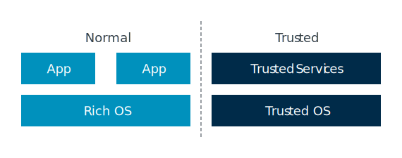

The Normal world runs a rich software stack. This software stack typically
includes a large application set, a complex operating system like Linux, and
possibly a hypervisor. Such software stacks are large and complex. While efforts
can be made to secure them, the size of the attack surface means that they are
more vulnerable to attack.

> 普通世界（Normal world）运行着丰富的软件栈。这个软件栈通常包括大量的应用程序、
> 一个复杂的操作系统（如 Linux），以及可能存在的虚拟机管理器（hypervisor）。这样
> 的软件栈庞大且复杂。尽管可以采取措施来提升其安全性，但由于攻击面较大，它们更容
> 易受到攻击。

The Trusted world runs a smaller and simpler software stack, which is referred
to as a Trusted Execution Environment (TEE). Typically, a TEE includes several
Trusted services that are hosted by a lightweight kernel. The Trusted services
provide functionality like key management. This software stack has a
considerably smaller attack surface, which helps reduce vulnerability to attack.

> 受信任世界（Trusted world）运行着更精简、更简单的软件栈，这被称为受信任执行环
> 境（Trusted Execution Environment，TEE）。通常，TEE 包含由轻量级内核托管的若干
> 受信任服务。这些受信任服务提供诸如密钥管理等功能。这样的软件栈攻击面要小得多，
> 从而有助于降低遭受攻击的风险。

> Note
> 
> You might sometimes see the term Rich Execution Environment (REE) used to
> describe the software that is running in the Normal world.
>
>> 你有时可能会看到“富执行环境（Rich Execution Environment，REE）”这个术语，用来
>> 描述运行在普通世界（Normal world）中的软件。

TrustZone aims to square a circle. As users and developers, we want the rich
feature set and flexibility of the Normal world. At the same time, we want the
higher degrees of trust that it is possible to achieve with a smaller and more
restricted software stack in the Trusted world. TrustZone gives us both,
providing two environments with hardware-enforced isolation between them.

> TrustZone 旨在实现看似矛盾的需求。作为用户和开发者，我们既希望拥有普通世界所带
> 来的丰富功能和灵活性，同时又希望获得受信任世界中通过更小、更受限制的软件栈所能
> 实现的更高程度的信任。TrustZone 让我们两者兼得，提供了两个通过硬件强制隔离的执
> 行环境。

### TrustZone for Armv8-M

TrustZone is also used to refer the Security Extensions in the Armv8-M
architecture. While there are similarities between TrustZone in the A profile
architecture and the M profile architecture, there are also important
differences. This guide covers the A profile only.

> ```
> refer: 指代，取代
> ```
>
> TrustZone 也用于指代 Armv8-M 架构中的安全扩展。虽然 A profile 架构中的
> TrustZone 与 M profile 架构中的 TrustZone 有一些相似之处，但也存在重要的区别。
> 本指南仅涵盖 A profile 架构。

### Armv9-A Realm Management Extension

The Armv9-A Realm Management Extension (RME) extends the concepts supported by
TrustZone. This guide does not cover RME, but you can find more information in
the Realm Management Extension Guide.

> Armv9-A 的 Realm 管理扩展（RME）扩展了 TrustZone 支持的相关概念。本指南不涉及
> RME，但你可以在《Realm 管理扩展指南》中获取更多信息。

## TrustZone in the processor

In this topic, we discuss support for TrustZone within the processor. Other
sections cover support in the memory system and the software story that is built
on the processor and memory system support.

> 在本主题中，我们将讨论处理器对 TrustZone 的支持。其他章节将介绍内存系统中的支
> 持，以及基于处理器和内存系统支持构建的软件方案。

### Security States

In the Arm architecture, there are two Security states: Secure and Non-secure.
These Security states map onto the Trusted and Normal worlds that we referred to
in What is TrustZone?

> 在 Arm 架构中，存在两种安全状态：安全（Secure）和非安全（Non-secure）。这些安
> 全状态分别对应于我们在“什么是 TrustZone？”中提到的受信任世界（Trusted world）
> 和普通世界（Normal world）。

> Note
>
> In Armv9-A, if the Realm Management Extension (RME) is implemented, then there
> are two extra Security states. This guide does not cover the change introduced
> by RME, for more information on RME, see Realm Management Extension Guide.
>
>> 在 Armv9-A 架构中，如果实现了 Realm 管理扩展（RME），那么还会有两个额外的安全
>> 状态。本指南不涉及 RME 所带来的变化，关于 RME 的更多信息，请参阅《Realm 管理扩展
>> 指南》。

At EL0, EL1, and EL2 the processor can be in either Secure state or Non-secure
state, which is controlled by the SCR_EL3.NS bit. You often see this written as:

> 在 EL0、EL1 和 EL2 级别，处理器可以处于安全状态（Secure state）或非安全状态
> （Non-secure state），这一状态由 SCR_EL3.NS 位控制。你经常会看到这样的表述：

* NS.EL1: Non-secure state, Exception level 1
* S.EL1: Secure state, Exception level 1

EL3 is always in Secure state, regardless of the value of the SCR_EL3.NS bit.
The arrangement of Security states and Exception levels is shown here:

> 无论 SCR_EL3.NS 位的取值如何，EL3 总是处于安全状态（Secure state）。安全状态和
> 异常级别的对应关系如下图所示：

Figure 1. Non-secure and Secure state

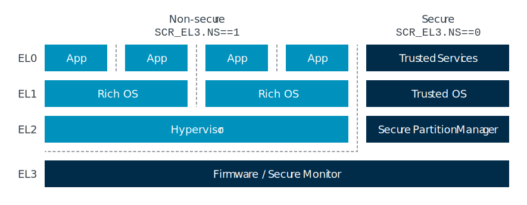

> Note
>
> Support for Secure EL2 was first introduced in Armv8.4 - A and support remains
> optional in Armv8-A.

## Switching between Security states

If the processor is in NS.EL1 and software wants to move into S.EL1, how does it
do this?

> 如果处理器当前处于 NS.EL1，且软件希望切换到 S.EL1，该如何实现？

To change Security state, in either direction, execution must pass through EL3,
as shown in the following diagram:

> 无论是从非安全状态切换到安全状态，还是反向切换，都必须经过 EL3。如下图所示，只
> 有通过 EL3，才能改变安全状态。

<center><font><strong> Figure 1. Change security state</strong></font></center>

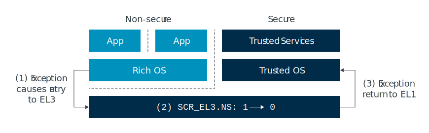

The preceding diagram shows an example sequence of the steps that are involved
in moving between Security states. Taking these one step at a time:

> 上面的图展示了在不同安全状态之间切换时涉及的步骤序列，下面我们一步一步来看：


* Entering a higher Exception level requires an exception. Typically, this
  exception would be an FIQ or an SMC (Secure Monitor Call) exception. We look at
  interrupt handling and SMCs in more detail later.
  > 进入更高的异常级别需要触发一个异常。通常，这个异常会是 FIQ 或 SMC（安全监控
  > 调用，Secure Monitor Call）异常。我们将在后文更详细地介绍中断处理和 SMC。
* EL3 is entered at the appropriate exception vector. Software that is running in
  EL3 toggles the SCR_EL3.NS bit.
  > 处理器通过相应的异常向量进入 EL3。在 EL3 运行的软件会切换 SCR_EL3.NS 位。
* An exception return then takes the processor from EL3 to S.EL1.
  > 异常返回后，处理器从 EL3 进入 S.EL1。

There is more to changing Security state than just moving between the Exception
levels and changing the SCR_EL3.NS bit. We also must consider processor state.

> 实际上，切换安全状态不仅仅是切换异常级别和更改 SCR_EL3.NS 位，还需要考虑处理器
> 的状态。

There is only one copy of the vector registers, the general-purpose registers,
and most System registers. When moving between Security states it is the
responsibility of software, not hardware, to save and restore register state. By
convention, the piece of software that does this is called the Secure Monitor.
This makes our earlier example look more like what you can see in the following
diagram:

> 向量寄存器、通用寄存器以及大多数系统寄存器都只有一份。当在安全状态之间切换时，
> 保存和恢复寄存器状态是软件的责任，而不是硬件的责任。按照惯例，负责这一工作的软
> 件被称为安全监控器（Secure Monitor）。这样，我们之前的例子实际上更接近下图所示
> 的流程。

<center><font><strong>
Figure 2. Secure Monitor
</strong></font></center>

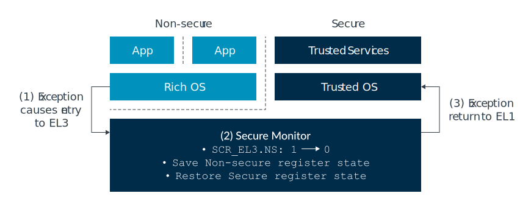

Trusted Firmware, an open-source project that Arm sponsors, provides a reference
implementation of a Secure Monitor. We will discuss Trusted Firmware later in
the guide.

> Trusted Firmware 是 Arm 赞助的一个开源项目，提供了安全监控器（Secure Monitor）
> 的参考实现。我们将在本指南后面讨论 Trusted Firmware。

A small number of registers are banked by Security state. This means that there
are two copies of the register, and the core automatically uses the copy that
belongs to the current Security state. These registers are limited to the ones
for which the processor needs to know both settings at all times. An example is
ICC_BPR1_EL1, a GIC register that is used to control interrupt preemption.
Banking is the exception, not the rule, and will be explicitly called out in the
Architecture Reference Manual for your processor.

> 只有少量寄存器会根据安全状态进行分组（banked）。这意味着这些寄存器有两份拷贝，
> 处理器会自动使用当前安全状态对应的那一份。这类寄存器仅限于处理器需要始终同时知
> 道两种设置的情况。例如，ICC_BPR1_EL1 是一个 GIC 寄存器，用于控制中断抢占。寄存
> 器分组是特例而不是常规做法，并且会在你的处理器的架构参考手册中明确说明。

When a System register is banked, we use (S) and (NS) to identify which copy we
are referring to. For example,

> 当系统寄存器是分组（banked）时，我们会用 (S) 和 (NS) 来标识我们指的是哪一份。
> 例如：

```
ICC_BPR1_ EL1 (S) and ICC_BPR1_EL1 (NS).
```

> NOTE
>
> In Armv6 and Armv7 - A most System registers are banked by Security state, but
> general- purpose registers and vector registers are still common.
>
>> 在 Armv6 和 Armv7-A 架构中，大多数系统寄存器会根据安全状态进行分组（banked），
>> 但通用寄存器和向量寄存器仍然是共用的。

## Virtual address spaces

The memory management guide in this series introduced the idea of multiple
virtual address spaces, or translation regimes. For example, there is a
translation regime for EL0/1 and a separate translation regime for EL2, shown
here:

> ```
> regime : 制度；规则
> ```
>
> 本系列的内存管理指南介绍了多虚拟地址空间（multiple virtual address spaces）或
> 称为转换机制（translation regimes）的概念。例如，EL0/1 有一种转换机制，EL2 则
> 有单独的转换机制，如下所示：

<center><font><strong>
Figure 1. Virtual address spaces
</strong></font></center>

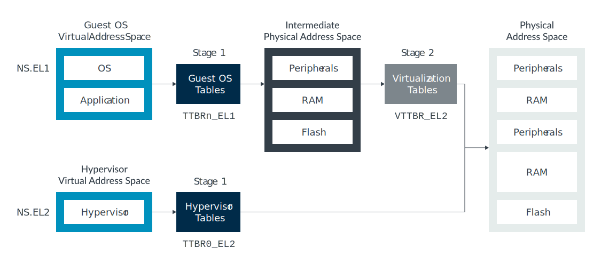

There are also separate translation regimes for the Secure and Non-secure
states. For example, there is a Secure EL0/1 translation regime and Non-secure
EL0/1 translation regime, which is shown here:

> 安全状态（Secure）和非安全状态（Non-secure）也分别拥有独立的转换机制。例如，存
> 在安全 EL0/1 的转换机制和非安全 EL0/1 的转换机制，如下所示：

<center><font><strong>
Figure 2. Secure EL0/1 translation regime and Non-secure EL0/1 translation regime

图2. 安全 EL0/1 转换机制与非安全 EL0/1 转换机制
</strong></font></center>

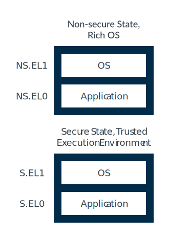

When writing addresses, it is convention to use prefixes to identify which
translation regime is being referred to:

> 在书写地址时，通常使用前缀来标识所指的转换机制：

* NS.EL1:0x8000 - Virtual address 0x8000 in the Non-secure EL0/1 translation regime
* S.EL1:0x8000 - Virtual address 0x8000 in the Secure EL0/1 translation regime

It is important to note that S.EL1:0x8000 and NS.EL1:0x8000 are two different
and independent virtual addresses. The processor does not use a NS.EL1
translation while in Secure state, or a S.EL1 translation while in Non-secure
state.

> 需要注意的是，S.EL1:0x8000 和 NS.EL1:0x8000 是两个不同且独立的虚拟地址。处理器
> 在安全状态下不会使用 NS.EL1 的转换机制，在非安全状态下也不会使用 S.EL1 的转换
> 机制。

## Physical address spaces

In addition to two Security states, the architecture provides two physical
address spaces: Secure and Non-secure.

> 除了两种安全状态之外，Arm 架构还提供了两种物理地址空间：安全（Secure）和非安全
> （Non-secure）。

While in Non-secure state, virtual addresses always translate to Non-secure
physical addresses. This means that software in Non-secure state can only see
Non-secure resources, but can never see Secure resources. This is illustrated
here:

> 在非安全状态下，虚拟地址总是被转换为非安全物理地址。这意味着，处于非安全状态的
> 软件只能访问非安全资源，无法访问安全资源。如下图所示

<center><font><strong>
Figure 1. Physical address spaces
</strong></font></center>

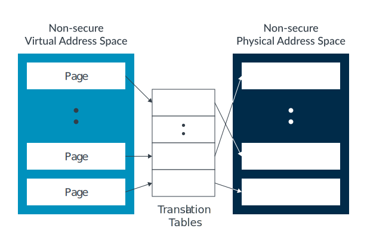

While in Secure state, software can access both the Secure and Non-secure
physical address spaces. The NS bit in the translation table entries controls
which physical address space a block or page of virtual memory translates to, as
shown in the following diagram:

> 在安全状态下，软件可以访问安全和非安全两种物理地址空间。转换表项中的 NS 位用于
> 控制虚拟内存的某个块或页应被转换到哪个物理地址空间，如下图所示：

<center><font><strong>
Figure 2. NS bit
</strong></font></center>

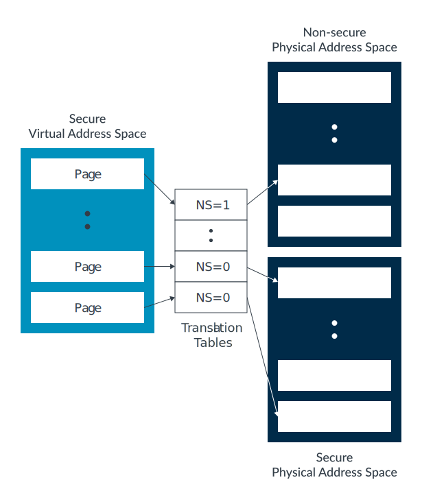

> Note
>
> In Secure state, when the Stage 1 MMU is disabled all addresses are treated as
> Secure.
>
>> 在安全状态下，如果一级 MMU 被禁用，所有地址都会被视为安全地址。
>>> 相当于在实模式下, 用物理地址访问，所有的地址都被看作安全地址

Like with virtual addresses, typically prefixes are used to identify which
address space is being referred to. For physical addresses, these prefixes are
NP: and SP:. For example:

> 与虚拟地址类似，物理地址通常也使用前缀来标识所指的地址空间。对于物理地址，这些
> 前缀是 NP: 和 SP:。例如：

* NP:0x8000 – Address 0x8000 in the Non-secure physical address space
* SP:0x8000 – Address 0x8000 in the Secure physical address space

It is important to remember that Secure and Non-secure are different address
spaces, not just an attribute like readable or writable. This means that NP:
0x8000 and SP:0x8000 in the preceding example are different memory locations and
are treated as different memory locations by the processor.

> 需要注意的是，安全（Secure）和非安全（Non-secure）是不同的地址空间，而不仅仅是
> 类似“可读”或“可写”的一种属性。这意味着在前面的例子中，NP:0x8000 和 SP:0x8000
> 是两个不同的内存位置，处理器也会将它们视为不同的内存位置。

> Note
>
> It can helpful to think of the address space as an extra address bit on the
> bus.
>> 可以将地址空间理解为总线上的一个额外地址位。

If the Armv9-A Realm Management Extension (RME) is implemented, the number of
physical address spaces increases to four. The extra physical address spaces are
Root and Realm. Software running in Secure state can still only access the
Non-secure and Secure physical address spaces. For more information on RME, see
Realm Management Extension Guide.

> 如果实现了 Armv9-A 的 Realm 管理扩展（RME），物理地址空间的数量会增加到四个。
> 新增的物理地址空间是 Root 和 Realm。运行在安全状态下的软件仍然只能访问非安全和
> 安全物理地址空间。关于 RME 的更多信息，请参阅《Realm 管理扩展指南》。

## Data, instruction, and unified caches

In the Arm architecture, data caches are physically tagged. The physical address
includes which address space the line is from, shown here:

> 在 Arm 架构中，数据缓存是按物理方式标记的。物理地址中包含了该缓存行所属的地址
> 空间，如下所示：

<center><font><strong>
Figure 1. Data-caches
</strong></font></center>

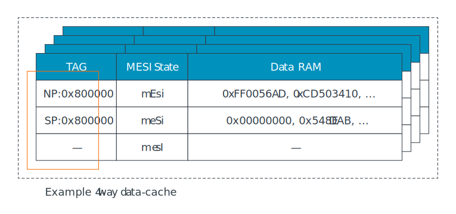

A cache lookup on NP:0x800000 never hits on a cache line that is tagged with SP:
0x800000. This is because NP:0x800000 and SP:0x800000 are different addresses.

> 对 NP:0x800000 进行缓存查找时，永远不会命中标记为 SP:0x800000 的缓存行。这是因
> 为 NP:0x800000 和 SP:0x800000 是不同的地址。

This also affects cache maintenance operations. Consider the example data cache
in the preceding diagram. If the virtual address va1 maps to physical address
0x800000, what happens when software issues DC IVAC, va1 (Data or unified Cache
line Invalidate by Virtual Address) from Non-secure state?

> 这同样会影响缓存维护操作。以前面图中的数据缓存为例，如果虚拟地址 va1 映射到物
> 理地址 0x800000，当软件在非安全状态下执行 DC IVAC, va1（按虚拟地址失效数据或统
> 一缓存行）时，会发生什么？

The answer is that in Non-secure state, all virtual addresses translate to
Non-secure physical addresses. Therefore, va1 maps to NP:0x800000. The cache
only operates on the line containing the specified address, in this case NP:
0x800000. The line containing SP:0x800000 is unaffected.

> 案是，在非安全状态下，所有虚拟地址都会转换为非安全物理地址。因此，va1 映射到
> NP:0x800000。缓存只会对包含指定地址的缓存行进行操作，在本例中即 NP:0x800000。
> 包含 SP:0x800000 的缓存行不会受到影响。

**Check your knowledge**

**If we performed the same operation from Secure state, with va1 still mapping to
NP:0x800000, which caches lines are affected?**

> 如果我们在安全状态下执行相同的操作，va1 仍然映射到 NP:0x800000，那么哪些缓存行
> 会受到影响？

Like in the earlier example, the cache invalidates the line containing the
specified physical address, NP:0x800000. The fact that the operation came from
Secure state does not matter.

> 和前面的例子一样，缓存会失效包含指定物理地址 NP:0x800000 的那一行。操作来自安
> 全状态这一事实并不会影响结果。

Is it possible to perform a cache operation by virtual address from Non-secure
targeting a Secure line?

> 是否可以在非安全状态下，通过虚拟地址对安全缓存行执行缓存操作？

No. In Non-secure state, virtual addresses can only ever map to Non-secure
physical addresses. By definition, a cache operation by VA from Non-secure state
can only ever target Non-secure lines.

> 不可以。在非安全状态下，虚拟地址只能映射到非安全物理地址。根据定义，通过虚拟地
> 址在非安全状态下进行的缓存操作只能作用于非安全缓存行。

For set/way operations, for example DC ISW, Xt, operations that are issued in
Non-secure state will only affect lines containing Non-secure addresses. From
Secure state set/way operations affect lines containing both Secure and
Non-secure addresses.

> 对于组/路操作（如 DC ISW, Xt），在非安全状态下发起的操作只会影响包含非安全地址
> 的缓存行。而在安全状态下，组/路操作会影响包含安全和非安全地址的缓存行。

This means that software can completely invalidate or clean the entire cache
only in Secure state. From Non-secure state, software can only clean or
invalidate Non-secure data.

> 这意味着，只有在安全状态下，软件才能完全失效或清除整个缓存；在非安全状态下，软
> 件只能清除或失效非安全数据。

## Translation Look aside Buffer

Translation Look aside Buffer (TLBs) cache recently used translations. The
processor has multiple independent translation regimes. The TLB records which
translation regime, including the Security state, an entry represents. While the
structure of TLBs is implementation defined, the following diagram shows an
example:

> 转换后备缓冲区（Translation Lookaside Buffer，TLB）用于缓存最近使用的地址转换。
> 处理器拥有多个独立的转换机制。TLB 会记录每个条目所对应的转换机制，包括安全状态
> （Security state）。虽然 TLB 的具体结构由实现决定，但下图展示了一个示例：

<center><font><strong>
Figure 1. Translation Lookaside Buffer (TLBs)
</strong></font></center>

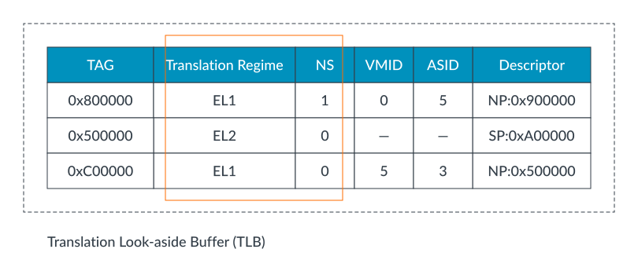

When software issues a TLB invalidate operation (TLBI instruction) at EL1 or EL2,
the software targets the current Security state. Therefore, TLBI ALLE1 from
Secure state invalidates all cached entries for the S.EL0/1 translation regime.

> 当软件在 EL1 或 EL2 层级下发起 TLB 失效操作（TLBI 指令）时，操作对象是当前的安
> 全状态。因此，在安全状态下执行 TLBI ALLE1，会使 S.EL0/1 转换机制下所有缓存的条
> 目失效。

EL3 is a special case. As covered earlier in Security states, when in EL0/1/2
the SCR_EL3.NS bit controls which Security state the processor is in. However,
EL3 is always in Secure state, regardless of the SCR_EL3.NS bit. When in EL3,
SCR_EL3.NS lets software control which Security state TLBIs operate on.

> EL3 是一个特殊情况。如前文所述，在 EL0/1/2 时，SCR_EL3.NS 位用于控制处理器所处
> 的安全状态。然而，无论 SCR_EL3.NS 位的值如何，EL3 始终处于安全状态。当处于 EL3
> 时，SCR_EL3.NS 位允许软件控制 TLB 失效操作作用于哪个安全状态。

For example, executing TBLI ALLE1 at EL3 with:

* SCR_EL3.NS==0: Affects Secure EL0/1 translation regime
* SCR_EL3.NS==1: Affects Non-secure EL0/1 translation regime

## SMC exceptions

As part of the support for two Security states, the architecture includes the
Secure Monitor Call (SMC) instruction. Executing SMC causes a Secure Monitor
Call exception, which targets EL3.

> 作为对两种安全状态支持的一部分，Arm 架构引入了安全监控调用（Secure Monitor
> Call，SMC）指令。执行 SMC 会触发一个安全监控调用异常，该异常会进入 EL3 层级。

SMC’s are normally used to request services, either from firmware resident in
EL3 or from a service that is hosted by the Trusted Execution Environment. The
SMC is initially taken to EL3, where an SMC dispatcher determines which entity
the call will be handled by. This is shown in the following diagram:

> SMC 通常用于请求服务，这些服务可能由驻留在 EL3 的固件提供，也可能由受信任执行
> 环境（Trusted Execution Environment）中的服务提供。SMC 指令首先会进入 EL3，在
> 那里由 SMC 分发器（dispatcher）决定由哪个实体处理该调用。如下图所示：

<center><font><strong>
Figure 1. SMC dispatcher
</strong></font></center>

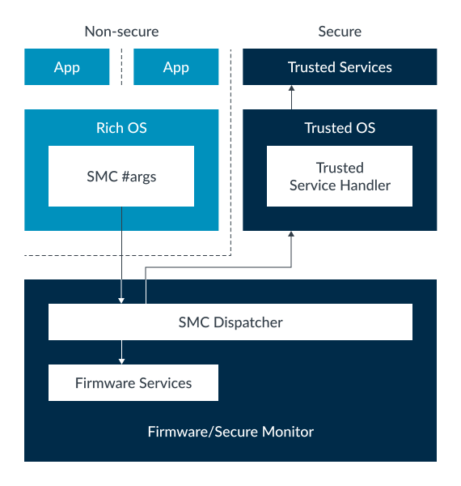

In a bid to standardize interfaces, Arm provides the SMC Calling Convention
(DEN0028) and Power State Coordination Interface Platform Design Document
(DEN0022). These specifications lay out how SMCs are used to request services.

> 为了规范接口，Arm 提供了 SMC 调用约定（SMC Calling Convention，DEN0028）和电源
> 状态协调接口平台设计文档（Power State Coordination Interface Platform Design
> Document，DEN0022）。这些规范详细说明了如何通过 SMC 请求服务。

Execution of an SMC at EL1 can be trapped to EL2. This is useful for hypervisors,
because hypervisors might want to emulate the firmware interface that is seen by
a virtual machine.

> 在 EL1 层级执行 SMC 指令时，可以被捕获到 EL2。这对于虚拟机管理器（hypervisor）
> 非常有用，因为 hypervisor 可能希望模拟虚拟机所看到的固件接口。

> Note
>
> The SMC instruction is not available at EL0 in either Security state. We
> discuss exceptions later in Interrupts when we look at the interrupt
> controller.
>
>> 在任一安全状态下，EL0 都无法使用 SMC 指令。关于异常的内容，我们将在后续“中断”
>> 部分讨论中断控制器时再进行介绍。
## Secure virtualization

When virtualization was first introduced in Armv7-A, it was only added in the
Non-secure state. Until Armv8.3, the same was true for Armv8 as illustrated in
the following diagram:

> 在 Armv7-A 首次引入虚拟化时，虚拟化功能仅在非安全状态下实现。直到 Armv8.3 之前，
> Armv8 也是如此，如下图所示：

<center><font><strong>
Figure 1. Secure virtualization
</strong></font></center>

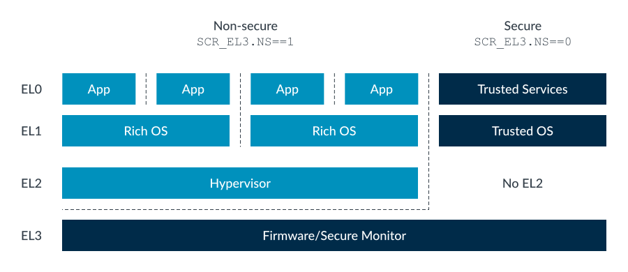

As previously described in Switching between Security states, EL3 is used to
host firmware and the Secure Monitor. Secure EL0/1 host the Trusted Execution
Environment (TEE), which is made up of the Trusted services and kernel.

> 如前文《在安全状态之间切换》中所述，EL3 用于承载固件和安全监控器（Secure
> Monitor）。安全 EL0/1 运行受信任执行环境（TEE），该环境由受信任服务和内核组成。


There was no perceived kkneed for multiple virtual machines in Secure state.
This means that support for virtualization was not necessary. As TrustZone
adoption increased, several requirements became apparent:

> 最初，人们认为在安全状态下不需要多个虚拟机。这意味着不需要为安全状态提供虚拟化
> 支持。随着 TrustZone 的广泛应用，几个新需求逐渐显现：

Some trusted services were tied to specific trusted kernels. For a device to
support multiple services, it might need to run multiple trusted kernels.
Following the principle of running with least privilege, moving some of the
firmware functionality out of EL3 was required. The solution was to introduce
support for EL2 in Secure state, which came with Armv8.4-A, as you can see in
this diagram:

> 一些受信任服务与特定的受信任内核绑定。为了让设备支持多个服务，可能需要运行多个
> 受信任内核。遵循最小权限原则，需要将部分固件功能从 EL3 移出。为了解决这些需求，
> Armv8.4-A 在安全状态下引入了对 EL2 的支持，如下图所示：

<center><font><strong>
Figure 2. Support for EL2 in Secure state
</strong></font></center>

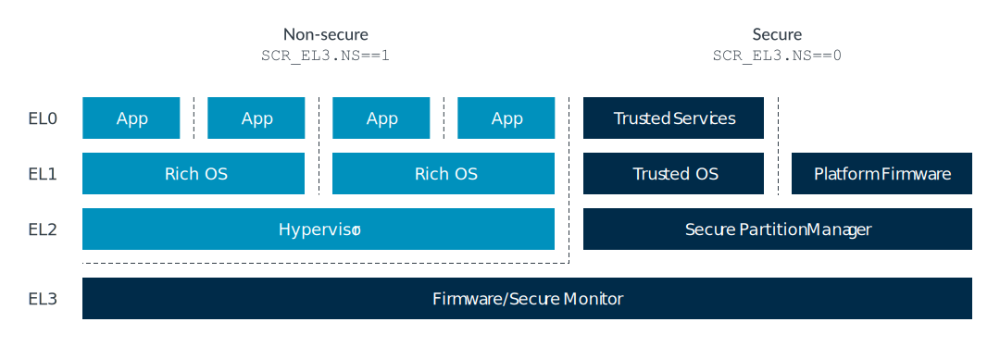

Rather than a full hypervisor, S.EL2 typically hosts a Secure Partition Manager
(SPM). An SPM allows the creation of the isolated partitions, which are unable
to see the resources of other partitions. A system could have multiple
partitions containing Trusted kernels and their Trusted services.

> 安全 EL2（S.EL2）通常不会运行完整的虚拟机管理器（hypervisor），而是承载安全分
> 区管理器（Secure Partition Manager，SPM）。SPM 允许创建隔离的分区，每个分区无
> 法访问其他分区的资源。这样，系统可以拥有多个分区，每个分区都包含受信任内核及其
> 受信任服务。

A partition can also be created to house platform firmware, removing the need to
have that code that is run at EL3.

> 也可以创建一个分区来容纳平台固件，这样就不再需要让这些代码在 EL3 级别运行。

* Enabling Secure EL2

  When S.EL2 is supported, it can be enabled or disabled. Whether S.EL2 is
  enabled is controlled by the SCR_EL3.EEL2 bit:

  > 当支持 S.EL2 时，它可以被使能或禁用。S.EL2 是否启用由 SCR_EL3.EEL2 位控制：

  + 0: S.EL2 disabled, behavior is as on a processor not supporting S.EL2
  + 1: S.EL2 enabled

* Stage 2 translation in Secure state

In Secure state, the Stage 1 translation of the Virtual Machine (VM) can output
both Secure and Non-secure addresses and is controlled by the NS bit in the
translation table descriptors. This results in two IPA spaces, Secure and
Non-secure, each with its own set of Stage 2 translation tables as you can see
in the following diagram:

> 在安全状态下，虚拟机（VM）的一级地址转换（Stage 1 translation）可以输出安全和
> 非安全地址，这由转换表描述符中的 NS 位进行控制。这样就产生了两个中间物理地址
> （IPA）空间：安全和非安全，每个空间都有自己的一套二级转换表（Stage 2
> translation tables），如下图所示：

<center><font><strong>
Figure 3. Stage 2 translation in Secure state 
</strong></font></center>

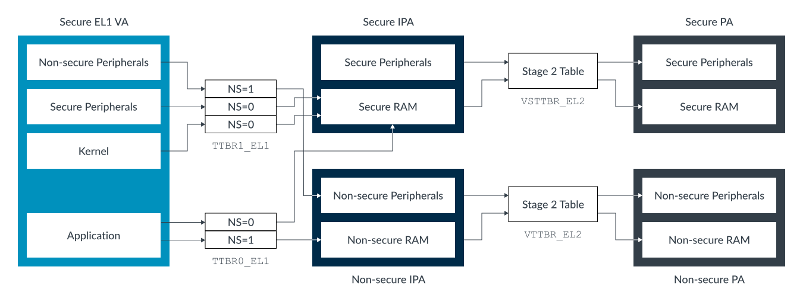

Unlike the Stage 1 tables, there is no NS bit in the Stage 2 table entries. For
a given IPA space, all the translations either result in a Secure or Non-secure
physical address, which is controlled by a register bit. The Non-secure IPAs
translate to Non-secure PAs and the Secure IPAs translate to Secure PAs.

> 与一级转换表不同，二级转换表（Stage 2 table）项中没有 NS 位。对于某个特定的
> IPA 空间，所有的地址转换结果要么都是安全物理地址，要么都是非安全物理地址，这由
> 一个寄存器位进行控制。非安全 IPA 会被转换为非安全物理地址，安全 IPA 会被转换为
> 安全物理地址。

## 参考链接
1. [Learn the architecture - TrustZone for AArch64](https://developer.arm.com/documentation/102418/0102/What-is-TrustZone-)
