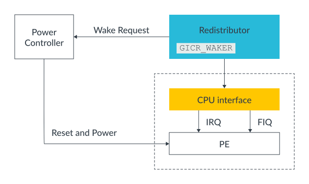
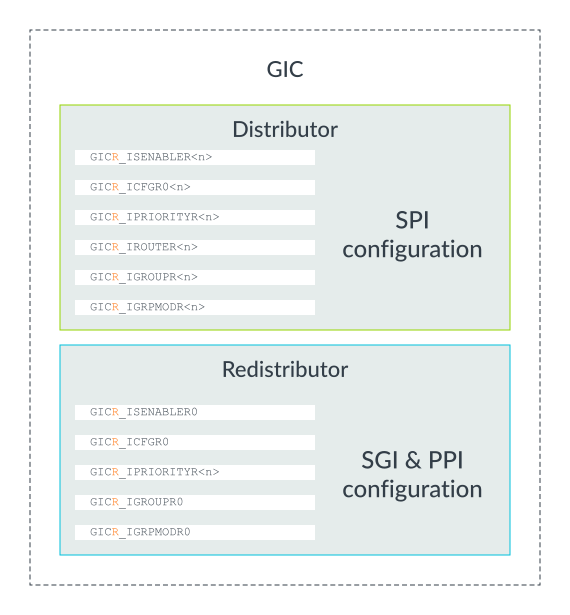

## Configuring the Arm GIC

This section of the guide describes how to enable and configure a
GICv3-compliant interrupt controller in a bare metal environment. For detailed
register descriptions see the Arm Generic Interrupt Controller Architecture
Specification GIC architecture version 3.0 and 4.

> 本节指南介绍了如何在裸机环境下启用并配置符合 GICv3 标准的中断控制器。有关寄存
> 器的详细描述，请参阅《Arm 通用中断控制器架构规范（GIC 架构版本 3.0 和 4）》。

接下来我们将先介绍全局设置，然后介绍每个 PE 的专用设置。
The configuration of Locality-specific Peripheral Interrupts (LPIs) is
significantly different to the configuration of Shared Peripheral Interrupts
(SPIs), Private Peripheral Interrupt (PPIs), and Software Generated Interrupts
(SGIs), and is beyond the scope of this guide. To learn more, refer to our guide
Arm CoreLink Generic Interrupt Controller v3 and v4: Locality-specific
Peripheral Interrupts.

> 本地性专用外设中断（LPI）的配置与共享外设中断（SPI）、私有外设中断（PPI）以及
> 软件生成中断（SGI）的配置有很大不同，超出了本指南的范围。如需了解更多，请参考
> 我们的《Arm CoreLink 通用中断控制器 v3 和 v4：本地性专用外设中断》指南。

Most systems that use a GICv3 interrupt controller are multi-core systems, and
possibly also multi-processor systems. Some settings are global, which means
that affect all the connected PEs. Other settings are particular to a single PE.

> 大多数采用 GICv3 中断控制器的系统都是多核系统，甚至可能是多处理器系统。其中一
> 些设置是全局性的，会影响所有连接的处理元件（PE）；而另一些设置则仅针对单个 PE。

Let’s look at the global settings, and then the settings for each PE.

### Global settings

The Distributor control register (GICD_CTLR) must be configured to enable the
interrupt groups and to set the routing mode as follows:

> 分发器控制寄存器（GICD_CTLR）必须进行配置，以启用中断分组并设置路由模式，具体
> 如下：

* Enable Affinity routing (ARE bits): The ARE bits in GICD_CTLR control whether
  the GIC is operating in GICv3 mode or legacy mode. Legacy mode provides
  backwards compatibility with GICv2. This guide assumes that the ARE bits are
  set to 1, so that GICv3 mode is being used.

  > 启用亲和性路由（ARE 位）：GICD_CTLR 中的 ARE 位用于控制 GIC 处于 GICv3 模式
  > 还是兼容模式。兼容模式（Legacy mode）用于向后兼容 GICv2。本指南假设 ARE 位已
  > 设置为 1，即使用的是 GICv3 模式。

* Enables: GICD_CTLR contains separate enable bits for Group 0, Secure Group 1
  and Non-secure Group 1:
  + EnableGrp1S enables distribution of Secure Group 1 interrupts.
  + EnableGrp1NS enables distribution of Non-secure Group 1 interrupts.
  + EnableGrp0 enables distribution of Group 0 interrupts.

  > 使能位：GICD_CTLR 包含用于 Group 0、安全 Group 1 和非安全 Group 1 的独立使能
  > 位：
  > + EnableGrp1S：使能安全 Group 1 中断的分发。
  > + EnableGrp1NS：使能非安全 Group 1 中断的分发。
  > + EnableGrp0：使能 Group 0 中断的分发。

> Note
>
> Arm CoreLink GIC-600 does not support legacy operation, and the ARE bits are
> permanently set to 1.
>
>> ```
>> permanently : ；永久的
>> ```
>> ARM corelink GIC-600 不支持 legacy operation, 并且 ARE bits 永久的设置为1

### Settings for each PE
This section covers settings that are specific to a single core or PE.

#### Redistributor configuration
Each core has its own Redistributor, as shown here:

<center><font><strong>
Figure 1. PE connected to redistributor
</strong></font></center>



The Redistributor contains a register called GICR_WAKER which is used to record
whether the connected PE is online or offline. Interrupts are only forwarded to
a PE that the GIC believes is online. At reset, all PEs are treated as being
offline.

> Redistributor 包含一个名为 GICR_WAKER 的寄存器，用于记录所连接的处理单元（PE）
> 是在线还是离线状态。只有当 GIC 认为某个 PE 处于在线状态时，中断才会被转发给该
> PE。在复位时，所有的 PE 都被视为离线状态。

To mark the connected PE as being online, software must:

* Clear GICR_WAKER.ProcessorSleep to 0.
* Poll GICR_WAKER.ChildrenAsleep until it reads 0.

It is important that software performs these steps before configuring the CPU
interface, otherwise behavior can be UNPREDICTABLE.

> 软件在配置 CPU 接口前必须先执行这些步骤，否则可能会导致不可预期的行为。


While the PE is offline (GICR_WAKER.ProcessorSleep==1), an interrupt that is
targeting the PE will result in a wake-request signal being asserted. Typically,
this signal will go to the power controller of the system. The power controller
then turns on the PE. On waking, software on that PE would clear the
ProcessorSleep bit, allowing the interrupt that woke the PE to be forwarded.

> 当处理单元（PE）处于离线状态（GICR_WAKER.ProcessorSleep==1）时，若有中断目标指
> 向该 PE，会产生一个唤醒请求信号（wake-request signal）。通常，这个信号会发送到
> 系统的电源控制器。电源控制器随后会开启该 PE。在唤醒后，该 PE 上的软件会清除
> ProcessorSleep 位，从而允许唤醒该 PE 的中断被转发。

#### CPU interface configuration

The CPU interface is responsible for delivering interrupt exceptions to the PE
to which it is connected. To enable the CPU interface, software must configure
the following:

> CPU 接口负责将中断异常传递给其所连接的处理单元（PE）。要使 CPU 接口可用，软件
> 需要进行以下配置：


* Enable System register access: The CPU interfaces (ICC_*_ELn) section describes
  the CPU interface registers, and how they are accessed as System registers in
  GICv3. Software must enable access to the CPU interface registers, by setting
  the SRE bit in the ICC_SRE_ELn registers.

  > 启用系统寄存器访问：
  >
  > CPU 接口（ICC_*_ELn）部分描述了 CPU 接口寄存器，以及在 GICv3 中如何作为系统寄
  > 存器进行访问。软件必须通过设置 ICC_SRE_ELn 寄存器中的 SRE 位，来启用对 CPU 接
  > 口寄存器的访问。

  > Note
  >
  > Many recent Arm Cortex processors do not support legacy operation, and the SRE
  > bits are fixed as set. On these processors this step can be skipped.
  >
  > > 许多新近的 Arm Cortex 处理器不再支持传统模式，SRE 位被固定为已设置状态。在这
  > > 些处理器上，这一步可以跳过。

+ Set Priority Mask and Binary Point registers: The CPU interface contains the
  Priority Mask register (ICC_PMR_EL1) and the Binary Point registers
  (ICC_BPRn_EL1). The Priority Mask sets the minimum priority that an interrupt
  must have in order to be forwarded to the PE. The Binary Point register is
  used for priority grouping and preemption. The use of both registers is
  described in more detail in Handling Interrupts.

  > 设置优先级屏蔽和二进制位寄存器：
  >
  > CPU 接口包含优先级屏蔽寄存器（ICC_PMR_EL1）和二进制位寄存器（ICC_BPRn_EL1）。
  > 优先级屏蔽寄存器用于设置中断被转发到处理单元（PE）所需的最低优先级。二进制位
  > 寄存器则用于优先级分组和抢占。关于这两个寄存器的具体用法，会在“处理中断”部分
  > 进行详细介绍

+ Set EOI mode: The EOImode bits in ICC_CTLR_EL1 and ICC_CTLR_EL3 in the CPU
  interface control how the completion of an interrupt is handled. This is
  described in more detail in End of interrupt.

  > 设置 EOI 模式：
  >
  > CPU 接口中的 ICC_CTLR_EL1 和 ICC_CTLR_EL3 寄存器的 EOImode 位用于控制中断完
  > 成后的处理方式。关于该内容会在“中断结束”部分进行更详细的说明。

+ Enable signaling of each interrupt group: The signaling of each interrupt
  group must be enabled before interrupts of that group will be forwarded by the
  CPU interface to the PE. To enable signaling, software must write to the
  ICC_IGRPEN1_EL1 register for Group 1 interrupts and ICC_IGRPEN0_EL1 registers
  for Group 0 interrupts. ICC_IGRPEN1_EL1 is banked by Security state. This
  means that ICC_GRPEN1_EL1 controls Group 1 for the current Security state. At
  EL3, software can access both Group 1 enables using ICC_IGRPEN1_EL3.

  > 启用各中断组的信号：
  > 
  > 必须先启用每个中断组的信号，CPU 接口才会将该组的中断转发给处理单元（PE）。要
  > 启用信号，软件需要为 Group 1 中断写入 ICC_IGRPEN1_EL1 寄存器，为 Group 0 中
  > 断写入 ICC_IGRPEN0_EL1 寄存器。ICC_IGRPEN1_EL1 是按安全状态分组的，这意味着
  > ICC_GRPEN1_EL1 控制当前安全状态下的 Group 1。在 EL3 层级，软件可以通过
  > ICC_IGRPEN1_EL3 同时访问两个 Group 1 的使能寄存器。

### PE configuration 

Some configuration of the PE is also required to allow it to receive and handle
interrupts. A detailed description of this is outside of the scope of this
guide. In this guide, we will describe the basic steps that are required for an
Armv8-A compliant PE executing in AArch64 state.

+ Routing controls: The routing controls for interrupts are in SCR_EL3 and
  HCR_EL2 of the PE. The routing control bits determine the Exception level to
  which an interrupt is taken. The routing bits in these registers have an
  UNKNOWN value at reset, so they must be initialized by software.

+ Interrupt masks: The PE also has exception mask bits in PSTATE. When these
  bits are set, interrupts are masked. These bits are set at reset.

+ Vector table: The location of the vector tables of the PE is set by the
  VBAR_ELn registers. Like with SCR_EL3 and HCR_EL2, VBAR_ELn registers have an
  UNKNOWN value at reset. Software must set the VBAR_ELn registers to point to
  the appropriate vector tables in memory.

To learn more about these steps, see the Learn the Architecture: Exception model
guide.

### SPI, PPI, and SGI configuration

So far, we have looked at configuring the interrupt controller itself. We will
now discuss the configuration of the individual interrupt sources.

Which registers are used to configure an interrupt depends on the type of
interrupt:

* SPIs are configured through the Distributor, using the GICD_* registers.
* PPIs and SGIs are configured through the individual Redistributors, using the
  GICR_* registers.

These different configuration mechanisms are illustrated in the following
diagram:

<center><font><strong>
Figure 2. Config registers
</strong></font></center>



For each INTID, software must configure the following:

+ Priority: GICD_IPRIORITYn, GICR_IPRIORITYn. Each INTID has an associated
  priority, represented as an 8-bit unsigned value. 0x00 is the highest possible
  priority, and 0xFF is the lowest possible priority. Running priority and
  preemption describes how the priority value in GICD_IPRIORITYn and
  GICR_IPRIORITYn masks low priority interrupts, and how it controls preemption.
  An interrupt controller is not required to implement all 8 priority bits. A
  minimum of 5 bits must be implemented if the GIC supports two Security states.
  A minimum of 4 bits must be implemented if the GIC support only a single
  Security state.

+ Group: GICD_IGROUPn, GICD_IGRPMODn, GICR_IGROUPn, GICR_IGRPMODn As described
  in Security model, an interrupt can be configured to belong to one of the
  three interrupt groups. These interrupt groups are Group 0, Secure Group 1 and
  Non-secure Group 1.

+ Edge-triggered or level-sensitive: GICD_ICFGRn, GICR_ICFGRn For PPIs and SPI,
  the software must specify whether the interrupt is edge-triggered or
  level-sensitive. SGIs are always treated as edge-triggered, and therefore
  GICR_ICFGR0 behaves as Read-As-One, Writes Ignored (RAO/WI) for these
  interrupts.

+ Enable: GICD_ISENABLERn, GICD_ICENABLER, GICR_ISENABLERn, GICR_ICENABLERn Each
  INTID has an enable bit. Set-enable registers and Clear-enable registers
  remove the requirement to perform read-modify-write routines. Arm recommends
  that the settings outlined in this section are configured before enabling the
  INTID.

+ Non-maskable: Interrupts configured as non-maskable are treated as higher
  priority than all other interrupts belonging to the same Group. That is, a
  non-maskable Non-secure Group 1 interrupt is treated as higher priority than
  all other Non-secure Group 1 interrupts.

  + The non-maskable property is added in GICv3.3 and requires matching support
    in the PE.

  + Only Secure Group 1 and Non-secure Group 1 interrupts can be marked as
    non-maskable.

For a bare metal environment, it is often unnecessary to change settings after
initial configuration. However, if an interrupt must be reconfigured, for
example to change the Group setting, you should first disable the interrupt
before changing its configuration.

The reset values of most of the configuration registers are IMPLEMENTATION
DEFINED. This means that the designer of the interrupt controller decides what
the values are, and the values might vary between systems.

### Arm GICv3.1 and the extended INTID ranges

Arm GICv3.1 added support for additional SPI and PPI INTIDs. The registers to
configure these interrupts are the same as the original interrupt ranges, except
that they have an E suffix. For example:

* GICR_ISENABLERn - Enable bits for the original PPI range
* GICR_ISENABLERnE - Enable bits for the additional PPIs that are introduced in
  GICv3.1

### Setting the target PE for SPIs

For SPIs, the target of the interrupt must be configured. This is controlled by
GICD_IROUTERn or GICD_IROUTERnE for the GICv3.1 extended SPIs. There is a
GICD_IROUTERn register for each SPI, and the Interrupt_Routing_Mode bit controls
the routing policy. The options are:

+ GICD_IROUTERn.Interrupt_Routing_Mode == 0 The SPI is delivered to the PE
  A.B.C.D, which are the affinity co-ordinates specified in the register.

+ GICD_IROUTERn.Interrupt_Routing_Mode == 1 The SPI can be delivered to any
  connected PE that is participating in distribution of the interrupt group. The
  Distributor, rather than software, selects the target PE. The target can
  therefore vary each time the interrupt is signaled. This type of routing is
  referred to as 1-of-N.

A PE can opt out of receiving 1-of-N interrupts. This is controlled by the
DPG1S, DPG1NS and DPG0 bits in GICR_CTLR.

1. [Arm Generic Interrupt Controller (GIC) Architecture Specification, v3 and v4 GIC architecture version 3 and version 4](https://developer.arm.com/documentation/ihi0069/latest/)
2. 
