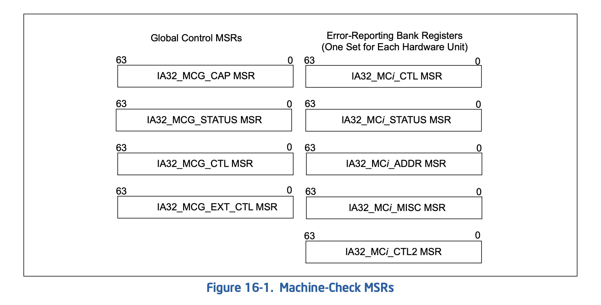
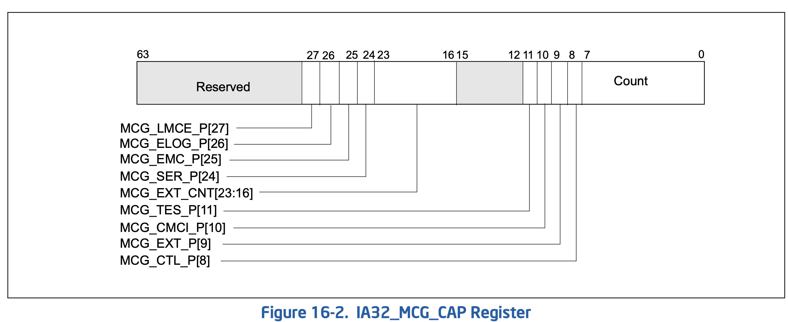

## 16.1 MACHINE-CHECK ARCHITECTURE

The Pentium 4, Intel Xeon, Intel Atom, and P6 family processors implement a
machine-check architecture that provides a mechanism for detecting and
reporting hardware (machine) errors, such as: system bus errors, ECC errors,
parity errors, cache errors, and TLB errors. It consists of a set of
model-specific registers (MSRs) that are used to set up machine checking and
additional banks of MSRs used for recording errors that are detected.

> Pentium 4、Intel Xeon、Intel Atom 和 P6 系列处理器实现了一种机器检查架构
> （Machine-Check Architecture，MCA），该架构提供了一种检测和报告硬件
> （机器）错误的机制，例如：系统总线错误、ECC（纠错码）错误、奇偶校验错误、
> 缓存错误以及 TLB（转换后备缓冲区）错误。它由一组特定型号的寄存器（MSRs）
> 组成，这些寄存器用于设置机器检查功能，以及用于记录检测到的错误的额外 MSR 组。

The processor signals the detection of an uncorrected machine-check error by
generating a machine-check excep- tion (#MC), which is an abort class
exception. The implementation of the machine-check architecture does not
ordinarily permit the processor to be restarted reliably after generating a
machine-check exception. However, the machine-check-exception handler can
collect information about the machine-check error from the machine-check MSRs.

> 处理器通过生成机器检查异常（#MC）来信号通知检测到无法纠正的机器检查错误，
> 这是一个中止类异常。机器检查架构的实现通常不允许处理器在产生机器检查异常
> 后可靠地重新启动。然而，机器检查异常处理程序可以从机器检查的
> MSR 中收集有关该错误的信息。

Starting with 45 nm Intel 64 processor on which CPUID reports
DisplayFamily_DisplayModel as 06H_1AH; see the CPUID instruction in Chapter 3,
“Instruction Set Reference, A-L,” in the Intel® 64 and IA-32 Architectures
Software Developer’s Manual, Volume 2A. The processor can report information on
corrected machine-check errors and deliver a programmable interrupt for
software to respond to MC errors, referred to as corrected machine-check error
interrupt (CMCI). See Section 16.5 for details.

> 从 45nm 的 Intel 64 处理器开始，如果 CPUID 报告的 DisplayFamily_DisplayModel 
> 为 06H_1AH，处理器能够报告已纠正的机器检查错误，并通过可编程中断将这些错误通知软件，
> 以响应机器检查错误（MC 错误）。这种中断被称为已纠正的机器检查错误中断（CMCI）。
> 有关详细信息，请参见《Intel® 64 和 IA-32 架构软件开发者手册》第 2A 卷第 3 章中的
> CPUID 指令部分，以及第 16.5 节的相关说明。

Intel 64 processors supporting machine-check architecture and CMCI may also
support an additional enhance- ment, namely, support for software recovery from
certain uncorrected recoverable machine check errors. See Section 16.6 for
details.

> 支持机器检查架构（MCA）和 CMCI（已纠正的机器检查错误中断）的 Intel 64 
> 处理器可能还支持一种额外的增强功能，即从某些未纠正但可恢复的机器检查错误中进
> 行软件恢复。有关详细信息，请参见第 16.6 节。

## 16.2 COMPATIBILITY WITH PENTIUM PROCESSOR

The Pentium 4, Intel Xeon, Intel Atom, and P6 family processors support and
extend the machine-check exception mechanism introduced in the Pentium
processor. The Pentium processor reports the following machine-check errors:

> Pentium 4、Intel Xeon、Intel Atom 和 P6 系列处理器支持并扩展了在 Pentium 
> 处理器中引入的机器检查异常机制。Pentium 处理器报告以下机器检查错误：

* Data parity errors during read cycles.
  > 读取周期中的数据奇偶校验错误。
* Unsuccessful completion of a bus cycle.
  > 总线周期的未成功完成。

The above errors are reported using the P5_MC_TYPE and P5_MC_ADDR MSRs
(implementation specific for the Pentium processor). Use the RDMSR instruction
to read these MSRs. See Chapter 2, “Model-Specific Registers (MSRs)‚” in the
Intel® 64 and IA-32 Architectures Software Developer’s Manual, Volume 4, for
the addresses.

> 上述错误使用 P5_MC_TYPE 和 P5_MC_ADDR MSR（特定于 Pentium 处理器的实现）进行报告。
> 可以使用 RDMSR 指令读取这些 MSR。

The machine-check error reporting mechanism that Pentium processors use is
similar to that used in Pentium 4, Intel Xeon, Intel Atom, and P6 family
processors. When an error is detected, it is recorded in P5_MC_TYPE and
P5_MC_ADDR; the processor then generates a machine-check exception (#MC).

> Pentium 处理器使用的机器检查错误报告机制与 Pentium 4、Intel Xeon、Intel
> Atom 和 P6 系列处理器使用的机制类似。当检测到错误时，它会记录在 P5_MC_TYPE 
> 和 P5_MC_ADDR 中；然后处理器会生成 machine-check exception (#MC）。

See Section 16.3.3, “Mapping of the Pentium Processor Machine-Check Errors to
the Machine-Check Architecture,” and Section 16.10.2, “Pentium Processor
Machine-Check Exception Handling,” for information on compatibility between
machine-check code written to run on the Pentium processors and code written to
run on P6 family processors.

> 有关与 Pentium 处理器上运行的机器检查代码和在 P6 系列处理器上运行的代码兼容性的信息，
> 请参见第 16.3.3 节“Pentium 处理器机器检查错误映射到机器检查架构”和第 16.10.2 节
> “Pentium 处理器机器检查异常处理”。

## 16.3 MACHINE-CHECK MSRS

Machine check MSRs in the Pentium 4, Intel Atom, Intel Xeon, and P6 family
processors consist of a set of global control and status registers and several
error-reporting register banks. See Figure 16-1.

> Pentium 4、Intel Atom、Intel Xeon 和 P6 系列处理器中的机器检查 MSR（模型特定寄存器）
> 由一组全局控制和状态寄存器以及多个错误报告寄存器组组成。请参见图 16-1。

Each error-reporting bank is associated with a specific hardware unit (or group
of hardware units) in the processor. Use RDMSR and WRMSR to read and to write
these registers

> 每个错误报告寄存器组与处理器中的特定硬件单元（或硬件单元组）相关联。可以使
> 用 RDMSR 和 WRMSR 指令来读取和写入这些寄存器。

### 16.3.1 Machine-Check Global Control MSRs

The machine-check global control MSRs include the IA32_MCG_CAP,
IA32_MCG_STATUS, and optionally IA32_MC- G_CTL and IA32_MCG_EXT_CTL. See
Chapter 2, “Model-Specific Registers (MSRs),” in the Intel® 64 and IA-32
Architectures Software Developer’s Manual, Volume 4, for the addresses of these
registers.

#### 16.3.1.1 IA32_MCG_CAP MSR

The IA32_MCG_CAP MSR is a read-only register that provides information about
the machine-check architecture of the processor. Figure 16-2 shows the layout
of the register.

> IA32_MCG_CAP MSR 是一个只读寄存器，提供有关处理器机器检查架构的信息。图 16-2 显
> 示了该寄存器的布局。

