> FROM intel sdm
>
> CHAPTER 3 PROTECTED-MODE MEMORY MANAGEMENT

## abstract

This chapter describes the Intel 64 and IA-32 architecture’s protected-mode
memory management facilities, including the physical memory requirements,
segmentation mechanism, and paging mechanism.

> 本章介绍 Intel 64 和 IA-32 架构的保护模式内存管理 facilities ，包括物理内存要求、
> 分段机制和分页机制。

See also: Chapter 5, “Protection” (for a description of the processor’s
protection mechanism) and Chapter 21, “8086 Emulation” (for a description of
memory addressing protection in real-address and virtual-8086 modes).

> 另请参见：第 5 章“保护”（有关处理器保护机制的说明）和第 21 章“8086 仿真”
> （有关实地址和虚拟 8086 模式下的内存寻址保护的说明）。

## 3.1 MEMORY MANAGEMENT OVERVIEW

The memory management facilities of the IA-32 architecture are divided into two
parts: segmentation and paging. Segmentation provides a mechanism of isolating
individual code, data, and stack modules so that multiple programs (or tasks)
can run on the same processor without interfering with one another. Paging
provides a mechanism for implementing a conventional demand-paged,
virtual-memory system where sections of a program’s execution environment are
mapped into physical memory as needed. Paging can also be used to provide
isolation between multiple tasks. When operating in protected mode, some form
of segmentation must be used. There is no mode bit to disable segmentation. The
use of paging, however, is optional.

> ```
> conventional [kənˈvenʃənl] : 常规的; 传统的; 习惯的;
> demand  [dɪˈmænd] : 需要, 要求
> ```
>
> IA-32架构的内存管理 facilities 分为两部分：分段和分页。 分段提供了一种隔离
> 各个代码、数据和堆栈模块的机制，以便多个程序（或任务）可以在同一处理器上
> 运行而不会相互干扰。 分页提供了一种实现传统的按需分页虚拟内存系统的机制，
> 其中程序执行环境的各个部分根据需要映射到物理内存中。 分页还可用于提供多
> 个任务之间的隔离。 当在保护模式下运行时，必须使用某种形式的分段。 没有mode bit
> 可以禁用分段。 然而，分页的使用是可选的。

These two mechanisms (segmentation and paging) can be configured to support
simple single-program (or single-task) systems, multitasking systems, or
multiple-processor systems that used shared memory. As shown in Figure 3-1,
segmentation provides a mechanism for dividing the processor’s addressable
memory space (called the linear address space) into smaller protected address
spaces called segments. Segments can be used to hold the code, data, and stack
for a program or to hold system data structures (such as a TSS or LDT). If more
than one program (or task) is running on a processor, each program can be
assigned its own set of segments. The processor then enforces the boundaries
between these segments and ensures that one program does not interfere with the
execution of another program by writing into the other program’s segments. The
segmentation mechanism also allows typing of segments so that the operations
that may be performed on a particular type of segment can be restricted.

> 这两种机制（分段和分页）可配置为支持简单的单程序（或单任务）系统、多任
> 务系统或多处理器系统（使用共享内存）。 如图 3-1 所示，分段提供了一种将处理
> 器的可寻址内存空间（称为线性地址空间）划分为更小的受保护地址空间（称为段）
> 的机制。 段可用于保存程序的代码、数据和堆栈，或保存系统数据结构（例如 TSS
> 或 LDT）。如果处理器上运行多个程序（或任务），则可以为每个程序分配其自己的
> 一组段。 然后，处理器enforces(强制执行)这些段之间的边界，并确保一个程序不会
> 通过写入另一个程序的段来干扰另一个程序的执行。 分段机制还允许对段进行类型化，
> 以便可以限制对特定类型的段执行的操作。

All the segments in a system are contained in the processor’s linear address
space. To locate a byte in a particular segment, a logical address (also called
a far pointer) must be provided. A logical address consists of a segment
selector and an offset. The segment selector is a unique identifier for a
segment. Among other things it provides an offset into a descriptor table (such
as the global descriptor table, GDT) to a data structure called a segment
descriptor. Each segment has a segment descriptor, which specifies the size of
the segment, the access rights and privilege level for the segment, the segment
type, and the location of the first byte of the segment in the linear address
space (called the base address of the segment). The offset part of the logical
address is added to the base address for the segment to locate a byte within
the segment. The base address plus the offset thus forms a linear address in
the processor’s linear address space.

> ```
> among other things: 除此之外
> ```
>
> 系统中的所有段都包含在处理器的线性地址空间中。 要在特定段中定位字节，必须提
> 供逻辑地址（也称为far pointer）。 逻辑地址由段选择器和偏移量组成。 段选择器
> 是段的唯一标识符。 除此之外，它还提供描述符表（例如全局描述符表，GDT）到一个
> 被称为段描述符的数据结构的偏移量(某个entry, 实际上就是在GDT中的偏移)。 每个段
> 都有一个段描述符，它指定了段的大小、段的访问权限和特权级别、段类型以及该段的
> 第一个字节在线性地址空间中的位置（称为段的基地址)。 逻辑地址的偏移部分被添加
> 到段的基地址上来locate段内的某个byte。 因此，基地址加上偏移量就形成了处理器线
> 性地址空间中的线性地址。

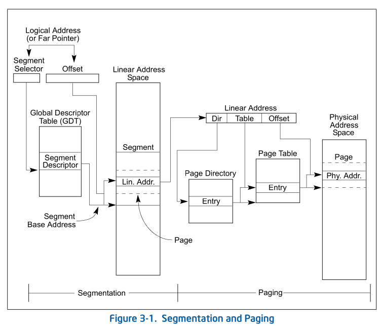

If paging is not used, the linear address space of the processor is mapped
directly into the physical address space of processor. The physical address
space is defined as the range of addresses that the processor can generate on
its address bus.

> 如果不使用分页，则处理器的线性地址空间直接映射到处理器的物理地址空间。 物理
> 地址空间定义为处理器可以在其地址总线上产生的地址范围。

Because multitasking computing systems commonly define a linear address space
much larger than it is economically feasible to contain all at once in
physical memory, some method of “virtualizing” the linear address space is
needed. This virtualization of the linear address space is handled through the
processor’s paging mechanism.

> ```
> economically [ˌiːkəˈnɒmɪkli]: 经济地; 在经济学上; 节约地; 节俭地; 节省地; 实惠地
> feasible [ˈfiːzəbl] : 可行的, 行的通的
> all at once : 同时;突然;忽然;一起
> ```
>
> 由于多任务计算系统通常定义的线性地址空间比在 physical memory 上同时包含所有
> 地址在 economically 要更feasible(经济上更合适). 因此需要某种“virtualizing”线性
> 地址空间的方法。 线性地址空间的虚拟化是通过处理器的分页机制来处理的。

Paging supports a “virtual memory” environment where a large linear address
space is simulated with a small amount of physical memory (RAM and ROM) and
some disk storage. When using paging, each segment is divided into pages
(typically 4 KBytes each in size), which are stored either in physical memory
or on the disk. The operating system or executive maintains a page directory
and a set of page tables to keep track of the pages. When a program (or task)
attempts to access an address location in the linear address space, the
processor uses the page directory and page tables to translate the linear
address into a physical address and then performs the requested operation (read
or write) on the memory location.

> 分页支持“虚拟内存”环境，在该环境上使用少量物理内存（RAM 和 ROM）和一些磁盘存储来
> 模拟大型线性地址空间。使用分页时，每个段被分为一些pages（通常每个大小为 4 KB），
> 这些页存储在物理内存或磁盘上。操作系统或执行程序维护一个页目录和一组页表来track页面。
> 当程序（或任务）尝试访问线性地址空间中的地址位置时，处理器使用页目录和页表将线性地
> 址转换为物理地址，然后在该内存位置上执行请求的操作（读或写)。

If the page being accessed is not currently in physical memory, the processor
interrupts execution of the program (by generating a page-fault exception). The
operating system or executive then reads the page into physical memory from the
disk and continues executing the program.

> 如果正在访问的页面当前不在物理内存中，则处理器会中断程序的执行（通过生成page-fault
> 异常）。然后操作系统或执行程序将页面内容从磁盘读入物理内存并继续执行程序.

When paging is implemented properly in the operating-system or executive, the
swapping of pages between physical memory and the disk is transparent to the
correct execution of a program. Even programs written for 16-bit IA-32
processors can be paged (transparently) when they are run in virtual-8086 mode.

> 当操作系统或执行程序中正确实现分页时，物理内存和磁盘之间的页面交换对于程序的
> 正确执行是透明的。 即使是为 16 位 IA-32 处理器编写的程序在virtual-8086 模式下运
> 行时也可以进行分页（透明地）。

## 3.2 USING SEGMENTS

The segmentation mechanism supported by the IA-32 architecture can be used to
implement a wide variety of system designs. These designs range from flat
models that make only minimal use of segmentation to protect programs to
multi-segmented models that employ segmentation to create a robust operating
environment in which multiple programs and tasks can be executed reliably.

> ```
> robust [roʊˈbʌst]: 强健的; 坚固的
> ```
>
> A-32架构支持的分段机制可用于实现多种系统设计。 这些设计的范围从仅使用最
> 少的分段来保护程序的平面模型到使用分段来创建可以可靠地执行多个程序和任务
> 的强健的操作环境的多分段模型。

The following sections give several examples of how segmentation can be
employed in a system to improve memory management performance and reliability.

> 以下部分给出了几个示例，说明如何在系统中使用分段来提高内存管理性能和可靠性。

### 3.2.1 Basic Flat Model

The simplest memory model for a system is the basic “flat model,” in which the
operating system and application programs have access to a continuous,
unsegmented address space. To the greatest extent possible, this basic flat
model hides the segmentation mechanism of the architecture from both the system
designer and the application programmer.

> ```
> continuous [kənˈtɪnjuəs] : 连续的,持续的,不断的
> extent  [ɪkˈstent] : 程度
> 
> greatest extent possible: 最大程度的
> ```
> 系统最简单的内存模型是基本的“平面模型”，在该模型中，操作系统和应用程序可以访
> 问连续的、未分段的地址空间。在最大程度上，这个基本的平面模型向系统设计者和
> 应用程序程序员隐藏了体系结构的segmentation 机制。

To implement a basic flat memory model with the IA-32 architecture, at least
two segment descriptors must be created, one for referencing a code segment and
one for referencing a data segment (see Figure 3-2). Both of these segments,
however, are mapped to the entire linear address space: that is, both segment
descriptors have the same base address value of 0 and the same segment limit of
4 GBytes. By setting the segment limit to 4 GBytes, the segmentation mechanism
is kept from generating exceptions for out of limit memory references, even if
no physical memory resides at a particular address. ROM (EPROM) is generally
located at the top of the physical address space, because the processor begins
execution at FFFF_FFF0H. RAM (DRAM) is placed at the bottom of the address
space because the initial base address for the DS data segment after reset
initialization is 0.

> ```
> keep from: 阻止,避免, 免于
> reside: 驻留
> ```
>
> 要使用 IA-32 架构实现基本平面内存模型，必须至少创建两个段描述符，一个用于引用
> 代码段，另一个用于引用数据段（见图 3-2）。 然而，这两个段都映射到整个线性地址
> 空间：也就是说，两个段描述符具有相同的基地址值 0 和相同的 4 GB 段限制。 通过
> 将段限制设置为 4 GB，即使特定地址没有物理内存reside，分段机制也不会因超出限制的
> 内存引用而生成异常。 ROM（EPROM）一般位于物理地址空间的顶部，因为处理器从FF
> FF_FFF0H开始执行。 RAM（DRAM）被放置在地址空间的底部，因为复位初始化后DS数据
> 段的初始基地址为0。

### 3.2.2 Protected Flat Model

The protected flat model is similar to the basic flat model, except the segment
limits are set to include only the range of addresses for which physical memory
actually exists (see Figure 3-3). A general-protection exception (#GP) is then
generated on any attempt to access nonexistent memory. This model provides a
minimum level of hardware protection against some kinds of program bugs.

> 受保护的平面模型与基本平面模型相似，只是段限制设置为仅包括物理内存实际存在的
> 地址范围（见图3-3）。然后，在任何访问不存在的内存的尝试中都会生成一个通用保护
> 异常（#GP）。该模型提供了针对某些程序错误的最低级别的硬件保护。

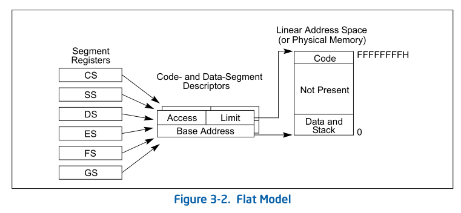

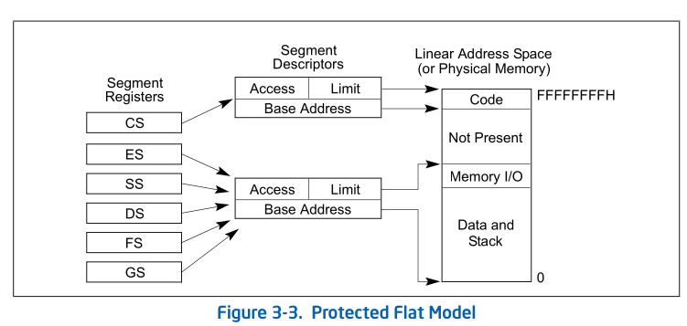

More complexity can be added to this protected flat model to provide more
protection. For example, for the paging mechanism to provide isolation between
user and supervisor code and data, four segments need to be defined: code and
data segments at privilege level 3 for the user, and code and data segments at
privilege level 0 for the supervisor. Usually these segments all overlay each
other and start at address 0 in the linear address space. This flat
segmentation model along with a simple paging structure can protect the
operating system from applications, and by adding a separate paging structure
for each task or process, it can also protect applications from each other.
Similar designs are used by several popular multitasking operating systems.

> 这种受保护的平面模型可以增加更多的复杂性，以提供更多的保护。例如，对于在用户
> 和supervisor 代码和数据之间提供隔离的分页机制，需要定义四个段：用户权限级别
> 为3的代码和数据段，supervisor 权限级别为0的代码和资料段。通常，这些段都相互
> 重叠，并从线性地址空间中的地址0开始。这种扁平的分段模型和简单的分页结构可以
> 保护操作系统不受应用程序的影响，并且通过为每个任务或进程添加单独的分页结构，
> 它还可以保护应用程序不受彼此的影响。几种流行的多任务操作系统也使用了类似的
> 设计。

> 这块我持怀疑态度, 如果 offset, base 都设置成一样的, 那么该保护就不是使用 
> segment来保护的, 实际上还是使用的paging
>
> 但是实际上Linux kernel还真是这么做的, 还需要仔细思考下
{: .prompt-info}

### 3.2.3 Multi-Segment Model

A multi-segment model (such as the one shown in Figure 3-4) uses the full
capabilities of the segmentation mechanism to provide hardware enforced
protection of code, data structures, and programs and tasks. Here, each program
(or task) is given its own table of segment descriptors and its own segments.
The segments can be completely private to their assigned programs or shared
among programs. Access to all segments and to the execution environments of
individual programs running on the system is controlled by hardware.

> 多段模型（如图 3-4 所示）使用分段机制的全部功能来提供对代码、数据结构以
> 及程序和任务的硬件强制保护。 这里，每个程序（或任务）都有自己的段描述符表
> 和自己的段。 这些段对于其分配的程序来说可以是完全私有的，也可以在程序之间共
> 享。对系统上运行的各个程序的所有段和执行环境的访问均由硬件控制。

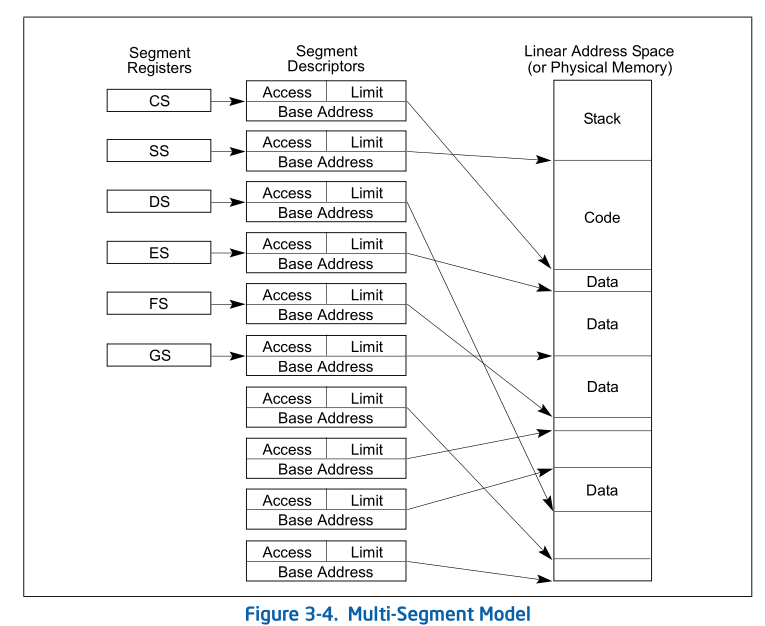

Access checks can be used to protect not only against referencing an address
outside the limit of a segment, but also against performing disallowed
operations in certain segments. For example, since code segments are desig-
nated as read-only segments, hardware can be used to prevent writes into code
segments. The access rights information created for segments can also be used
to set up protection rings or levels. Protection levels can be used to protect
operating-system procedures from unauthorized access by application programs.

> 访问检查不仅可以用于防止引用段限制之外的地址，还可以防止在某些段中执行不允许
> 的操作。 例如，由于代码段被指定为只读段，因此硬件可以使用其来防止写入代码段。 
> 为段创建的访问权限信息也可用于设置protection rings 或levels。 protection levels
> 可用于保护操作系统过程免遭应用程序未经授权的访问。

### 3.2.4 Segmentation in IA-32e Mode

In IA-32e mode of Intel 64 architecture, the effects of segmentation depend on
whether the processor is running in compatibility mode or 64-bit mode. In
compatibility mode, segmentation functions just as it does using legacy 16-bit
or 32-bit protected mode semantics.

> ```
> compatibility [kəmˌpætəˈbɪləti] : 兼容性
> ```
> 在Intel 64架构的IA-32e模式下，分段的效果取决于处理器是运行在兼容模式还是64位
> 模式。 在兼容模式下，分段功能就像使用传统 16 位或 32 位保护模式semantics一样。

In 64-bit mode, segmentation is generally (but not completely) disabled,
creating a flat 64-bit linear-address space. The processor treats the segment
base of CS, DS, ES, SS as zero, creating a linear address that is equal to the
effective address. The FS and GS segments are exceptions. These segment
registers (which hold the segment base) can be used as additional base
registers in linear address calculations. They facilitate addressing local data
and certain operating system data structures.

> 在 64 位模式下，通常（但不是完全）禁用分段，从而创建平坦的 64 位线性地址空间。
> 处理器将 CS、DS、ES、SS 的段基数视为零，从而创建等于有效地址的线性地址。 FS 
> 和 GS 段是例外。 这些段寄存器（保存段基址）可以用作线性地址计算中的附加基址寄
> 存器。 它们有助于寻址本地数据和某些操作系统数据结构


Note that the processor does not perform segment limit checks at runtime in
64-bit mode.

> 请注意，处理器在64位模式下运行时不执行段限制检查。

### 3.2.5 Paging and Segmentation

Paging can be used with any of the segmentation models described in Figures
3-2, 3-3, and 3-4. The processor’s paging mechanism divides the linear address
space (into which segments are mapped) into pages (as shown in Figure 3-1).
These linear-address-space pages are then mapped to pages in the physical
address space. The paging mechanism offers several page-level protection
facilities that can be used with or instead of the segment-protection
facilities. For example, it lets read-write protection be enforced on a
page-by-page basis. The paging mechanism also provides two-level
user-supervisor protection that can also be specified on a page-by-page basis.

> 分页可以与图 3-2、3-3 和 3-4 中描述的任何分段模型一起使用。 处理器的分页机制将
> 线性地址空间（段被映射到其中(线性地址空间)）划分为页（如图 3-1 所示）。 然后，
> 这些线性地址空间页被映射到物理地址空间中的页。 分页机制提供了多种页级保护设施，
> 可以与段保护设施一起使用或代替段保护设施。 例如，它允许page-by-page页强制执行
> 读写保护。 分页机制还提供两级 user-supervisor 保护，也可以page-by-page 指定。

## 3.3 PHYSICAL ADDRESS SPACE

In protected mode, the IA-32 architecture provides a normal physical address
space of 4 GBytes (232 bytes). This is the address space that the processor can
address on its address bus. This address space is flat (unsegmented), with
addresses ranging continuously from 0 to FFFFFFFFH. This physical address space
can be mapped to read-write memory, read-only memory, and memory mapped I/O.
The memory mapping facilities described in this chapter can be used to divide
this physical memory up into segments and/or pages.

> 在保护模式下，IA-32 架构提供 4 GB（232 字节）的 normal 物理地址空间。 这是处
> 理器可以在其地址总线上寻址的地址空间。 该地址空间是平坦的（未分段），地址范围从
> 0 到 FFFFFFFFH 连续。 该物理地址空间可以映射到读写memory、只读memory和 mmeory 
> mappedI/O(mmio)。 本章中描述的内存映射 facilities 可用于将该物理内存划分为段和/或页。

Starting with the Pentium Pro processor, the IA-32 architecture also supports
an extension of the physical address space to 236 bytes (64 GBytes); with a
maximum physical address of FFFFFFFFFH. This extension is invoked in either of
two ways:

> 从奔腾Pro处理器开始，IA-32体系结构还支持将物理地址空间扩展到236字节（64GB）;
> 最大物理地址为FFFFFFFFFH。此扩展可通过以下两种方式之一 invoke(引入)：

* Using the physical address extension (PAE) flag, located in bit 5 of control
  register CR4.
  > 使用位于 CR4 [bit 5] 的 PAE flag

* Using the 36-bit page size extension (PSE-36) feature (introduced in the
  Pentium III processors).
  > 使用 PSE-36 feature (在奔腾 3 处理器引入)

Physical address support has since been extended beyond 36 bits. See Chapter 4,
“Paging” for more information about 36-bit physical addressing.

> 此后，物理地址支持已扩展到 36 位以上。 有关 36 位物理寻址的更多信息，请参见第 4 章“分页”。

### Intel® 64 Processors and Physical Address Space

On processors that support Intel 64 architecture (CPUID.80000001H:EDX[29] = 1),
the size of the physical address range is implementation-specific and indicated
by CPUID.80000008H:EAX[bits 7-0].

> 在支持 Intel 64 架构 (CPUID.80000001H:EDX[29] = 1) 的处理器上，物理地址范围的大小是 
> implementation-specific，并由 CPUID.80000008H:EAX[位 7-0] 指示。

For the format of information returned in EAX, see “CPUID—CPU Identification”
in Chapter 3 of the Intel® 64 and IA-32 Architectures Software Developer’s
Manual, Volume 2A. See also: Chapter 4, “Paging.”

> 有关 EAX 中返回信息的格式，intel sdm CPUID 指令介绍和 chapter 4 Paging 章节

## 3.4 LOGICAL AND LINEAR ADDRESSES

At the system-architecture level in protected mode, the processor uses two
stages of address translation to arrive at a physical address: logical-address
translation and linear address space paging.

> 在保护模式下的system-architecture level，处理器使用两个阶段的地址转换来获
> 得物理地址：逻辑地址转换和线性地址空间分页。

Even with the minimum use of segments, every byte in the processor’s address
space is accessed with a logical address. A logical address consists of a
16-bit segment selector and a 32-bit offset (see Figure 3-5). The segment
selector identifies the segment the byte is located in and the offset specifies
the location of the byte in the segment relative to the base address of the
segment.

> 即使使用最少的段，处理器地址空间中的每个字节也可以通过逻辑地址进行访问。 
> 逻辑地址由 16 位段选择器和 32 位偏移量组成（见图 3-5）。 段选择器标识该字节
> 所在的段，偏移量指定字节在段中相对于段基地址的位置。

The processor translates every logical address into a linear address. A linear
address is a 32-bit address in the processor’s linear address space. Like the
physical address space, the linear address space is a flat (unsegmented),
2<sup>32</sup>-byte address space, with addresses ranging from 0 to FFFFFFFFH.
The linear address space contains all the segments and system tables defined
for a system.

> 处理器将每个逻辑地址转换为线性地址。 线性地址是处理器线性地址空间中的 32 位地址。
> 与物理地址空间一样，线性地址空间是平坦（不分段）的 2^32 字节地址空间，地址范围从
> 0 到 FFFFFFFFH。 线性地址空间包含为系统定义的所有段和system table.

To translate a logical address into a linear address, the processor does the
following:
> 为了将逻辑地址转换为线性地址，处理器执行以下操作：

1. Uses the offset in the segment selector to locate the segment descriptor for
   the segment in the GDT or LDT and reads it into the processor. (This step is
   needed only when a new segment selector is loaded into a segment register.)
   > 使用段选择器中的偏移量来定位 GDT 或 LDT 中该段的段描述符，并将其读入处理器.
   > （只有当新的段选择器加载到段寄存器中时才需要执行此步骤。）

2. Examines the segment descriptor to check the access rights and range of the
   segment to ensure that the segment is accessible and that the offset is
   within the limits of the segment.
   > ```
   > Examines [ɪɡˈzæmɪnz]: 检查; 审查;
   > ```
   > 检查段描述符以检查该段的access rights和range，以确保该段是 accessible并且偏
   > 移量在该段的限制内。

3. Adds the base address of the segment from the segment descriptor to the
   offset to form a linear address.
   > 将段描述符中的段基地址与偏移量相加，形成线性地址。

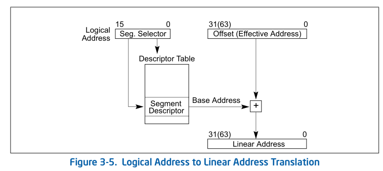

If paging is not used, the processor maps the linear address directly to a
physical address (that is, the linear address goes out on the processor’s
address bus). If the linear address space is paged, a second level of address
translation is used to translate the linear address into a physical address.

> 如果不使用分页，处理器会将线性地址直接映射到物理地址（即，线性地址则输出在处理
> 器地址总线上）。 如果线性地址空间被分页，则使用第二级地址转换来将线性地址转换为
> 物理地址。

See also: Chapter 4, “Paging.”

### 3.4.1 Logical Address Translation in IA-32e Mode

In IA-32e mode, an Intel 64 processor uses the steps described above to
translate a logical address to a linear address. In 64-bit mode, the offset and
base address of the segment are 64-bits instead of 32 bits. The linear address
format is also 64 bits wide and is subject to the canonical form requirement.

> ```
> be subject to :受支配，从属于; 有…倾向的
> ```
> 在 IA-32e 模式下，Intel 64 处理器使用上述步骤将逻辑地址转换为线性地址。 
> 在64位模式下，段的偏移量和基地址都是64位而不是32位。 线性地址格式也是 64 位宽，
> 并且符合规范形式要求。
>
>> 之前调研AMD dma use-after-free的时候介绍过
>{: .prompt-info}

Each code segment descriptor provides an L bit. This bit allows a code segment
to execute 64-bit code or legacy 32-bit code by code segment.

> 每个代码段描述符提供一个L位。 该位允许每个代码段指定执行 64 位代码或legacy 32 
> 位代码。

### 3.4.2 Segment Selectors

A segment selector is a 16-bit identifier for a segment (see Figure 3-6). It
does not point directly to the segment, but instead points to the segment
descriptor that defines the segment. A segment selector contains the following
items:

> 段选择器是段的 16 位标识符（见图 3-6）。 它并不直接指向段，而是指向定义该段
> 的段描述符。 段选择器包含以下item: 

* **Index** (Bits 3 through 15) 
 
  Selects one of 8192 descriptors in the GDT or LDT. The processor multiplies
  the index value by 8 (the number of bytes in a segment descriptor) and adds
  the result to the base address of the GDT or LDT (from the GDTR or LDTR
  register, respectively).
  > 选择 GDT 或 LDT 中的 8192 个描述符之一。 处理器将索引值乘以 8（段描述符中的字节数），
  > 并将结果添加到 GDT 或 LDT 的基地址（分别来自 GDTR 或 LDTR 寄存器）。

* **TI (table indicator) flag** (Bit 2) 

  Specifies the descriptor table to use: clearing this flag selects the GDT;
  setting this flag selects the current LDT.
  > 指定要使用的描述符表：清除该标志选择GDT； 设置此标志选择当前 LDT。


* **Requested Privilege Level (RPL)** (Bits 0 and 1) 

  Specifies the privilege level of the selector. The privilege level can range
  from 0 to 3, with 0 being the most privileged level. See Section 5.5,
  “Privilege Levels,” for a description of the relationship of the RPL to the
  CPL of the executing program (or task) and the descriptor privilege level
  (DPL) of the descriptor the segment selector points to.
  > 指定选择器的权限级别。 权限级别的范围为 0 到 3，其中 0 是最高权限级别。 
  > 请参阅第 5.5 节“Privilege levels”，了解 RPL 与执行程序（或任务）的 CPL 以及
  > 段选择器指向的描述符的描述符特权级别 (DPL) 之间的关系的描述。

The first entry of the GDT is not used by the processor. A segment selector
that points to this entry of the GDT (that is, a segment selector with an index
of 0 and the TI flag set to 0) is used as a “null segment selector.” The
processor does not generate an exception when a segment register (other than
the CS or SS registers) is loaded with a null selector. It does, however,
generate an exception when a segment register holding a null selector is used
to access memory. A null selector can be used to initialize unused segment
registers. Loading the CS or SS register with a null segment selector causes a
general-protection exception (#GP) to be generated.

> ``` 
> initialize [ɪˈnɪʃəlaɪz]
> ```
> 处理器不使用 GDT 的第一个条目。 指向 GDT 的该条目的段选择器（即索引为 0 且 TI 
> 标志设置为 0 的段选择器）被用作“null segment selector”。 当段寄存器（CS 或 SS 
> 寄存器除外）加载了 null selector 时，处理器不会生成异常。 然而，当使用持有 null 
> selector的段寄存器来访问内存时，它确实会生成异常。 null selector 可用于初始化
> 未使用的段寄存器。 使用空段选择器加载 CS 或 SS 寄存器会导致生成一般保护异常 (#GP)。

Segment selectors are visible to application programs as part of a pointer
variable, but the values of selectors are usually assigned or modified by link
editors or linking loaders, not application programs.

> 段选择器作为指针变量的一部分对应用程序可见，但选择器的值通常由link editors或ilin
> loader而不是应用程序分配或修改。

### 3.4.3 Segment Registers

To reduce address translation time and coding complexity, the processor
provides registers for holding up to 6 segment selectors (see Figure 3-7). Each
of these segment registers support a specific kind of memory reference (code,
stack, or data). For virtually any kind of program execution to take place, at
least the code-segment (CS), data-segment (DS), and stack-segment (SS)
registers must be loaded with valid segment selectors. The processor also
provides three additional data-segment registers (ES, FS, and GS), which can be
used to make additional data segments available to the currently executing
program (or task).

> 为了减少地址转换时间和编码复杂性，处理器提供了用于保存最多 6 个段选择器的寄存器
> （见图 3-7）。 每个段寄存器都支持特定类型的内存引用（代码、堆栈或数据）。 实际上，
> 要执行任何类型的程序，至少必须向代码段 (CS)、数据段 (DS) 和堆栈段 (SS) 寄存器加
> 载有效的段选择器。 该处理器还提供三个附加数据段寄存器（ES、FS 和 GS），
> 可用于为当前正在执行的程序（或任务）提供附加数据段。

For a program to access a segment, the segment selector for the segment must
have been loaded in one of the segment registers. So, although a system can
define thousands of segments, only 6 can be available for immediate use. Other
segments can be made available by loading their segment selectors into these
registers during program execution.

> 对于要访问段的程序，该段的段选择器必须已加载到段寄存器之一中。 因此，尽管系统可
> 以定义数千个段，但只有 6 个可以立即使用。 通过在程序执行期间将其段选择器加载到这
> 些寄存器中，可以使其他段可用。

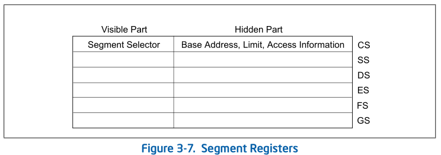

Every segment register has a “visible” part and a “hidden” part. (The hidden
part is sometimes referred to as a “descriptor cache” or a “shadow register.”)
When a segment selector is loaded into the visible part of a segment register,
the processor also loads the hidden part of the segment register with the base
address, segment limit, and access control information from the segment
descriptor pointed to by the segment selector. The information cached in the
segment register (visible and hidden) allows the processor to translate
addresses without taking extra bus cycles to read the base address and limit
from the segment descriptor. In systems in which multiple processors have
access to the same descriptor tables, it is the responsibility of software to
reload the segment registers when the descriptor tables are modified. If this
is not done, an old segment descriptor cached in a segment register might be
used after its memory-resident version has been modified.

> ```
> reside [rɪˈzaɪd] vi: 居住在; 定居于
> resident [ˈrezɪdənt] n: 居民; 住户; adj.(在某地)居住的
> ```
> 每个段寄存器都有一个“可见”部分和一个“隐藏”部分。 （隐藏部分有时称为“描述符缓存”
> 或“影子寄存器”。）当将段选择器加载到段寄存器的可见部分时，处理器还会将段选择器
> 的隐藏部分加载到段寄存器中。 段选择器指向的段描述符中的基地址、段限制和访问控
> 制信息。 缓存在段寄存器（可见和隐藏）中的信息允许处理器转换地址，而无需花费
> 额外的总线周期来从段描述符中读取基地址和限制。 在多个处理器可以访问相同描述符表
> 的系统中，当描述符表被修改时，软件负责重新加载段寄存器。 如果不这样做，则在修
> 改其 memory-resident version后，可能会使用缓存在段寄存器中的旧段描述符。 

Two kinds of load instructions are provided for loading the segment registers:
> 提供两种加载指令用于加载段寄存器：

1. Direct load instructions such as the MOV, POP, LDS, LES, LSS, LGS, and LFS
   instructions. These instructions explicitly reference the segment registers.
   > 直接加载指令，例如 MOV、POP、LDS、LES、LSS、LGS 和 LFS 指令。 这些指令显式
   > 引用段寄存器。

2. Implied load instructions such as the far pointer versions of the CALL, JMP,
   and RET instructions, the SYSENTER and SYSEXIT instructions, and the IRET,
   INT n, INTO, INT3, and INT1 instructions. These instructions change the
   contents of the CS register (and sometimes other segment registers) as an
   incidental part of their operation.
   > ```
   > incidental [ˌɪnsɪˈdentl] : 次要的; 附带发生的; 伴随而来的; 非有意的;
   > ```
   > 隐式加载指令，例如 CALL、JMP 和 RET 指令的far pointer version、SYSENTER 
   > 和 SYSEXIT 指令以及 IRET、INT n、INTO、INT3 和 INT1 指令。 这些指令更改
   > CS 寄存器（有时还更改其他段寄存器）的内容，作为其操作的附带部分。

The MOV instruction can also be used to store the visible part of a segment
register in a general-purpose register.

> MOV指令还可用于将段寄存器的可见部分 store 在通用寄存器中。

### 3.4.4 Segment Loading Instructions in IA-32e Mode

Because ES, DS, and SS segment registers are not used in 64-bit mode, their
fields (base, limit, and attribute) in segment descriptor registers are
ignored. Some forms of segment load instructions are also invalid (for example,
LDS, POP ES). Address calculations that reference the ES, DS, or SS segments
are treated as if the segment base is zero.
> 由于 ES、DS 和 SS 段寄存器在 64 位模式下不使用，因此它们在段描述符寄存器中的字段
> （基址、限制和属性）将被忽略。 某些形式的段加载指令也是无效的（例如LDS、POP ES）。
> 引用 ES、DS 或 SS 段的地址计算被视为段基址为零。

The processor checks that all linear-address references are in canonical form
instead of performing limit checks. Mode switching does not change the contents
of the segment registers or the associated descriptor registers. These
registers are also not changed during 64-bit mode execution, unless explicit
segment loads are performed. 

> 处理器检查所有线性地址引用是否采用规范形式，而不是执行limit check。 模式切换不
> 会更改段寄存器或相关描述符寄存器的内容。 这些寄存器在 64 位模式执行期间也不会
> 更改，除非执行显式段加载。

In order to set up compatibility mode for an application, segment-load
instructions (MOV to Sreg, POP Sreg) work normally in 64-bit mode. An entry is
read from the system descriptor table (GDT or LDT) and is loaded in the hidden
portion of the segment register. The descriptor-register base, limit, and
attribute fields are all loaded. However, the contents of the data and stack
segment selector and the descriptor registers are ignored.

> 为了为应用程序设置兼容模式，段加载指令（MOV 到 Sreg、POP Sreg）在 64 位模式下
> 正常工作。 从系统描述符表（GDT 或 LDT）中读取一个条目，并将其加载到段寄存器的
> 隐藏部分中。 描述符寄存器基址、限制和属性字段均已加载。 但是，数据和堆栈段选
> 择器以及描述符寄存器的内容将被忽略。

When FS and GS segment overrides are used in 64-bit mode, their respective base
addresses are used in the linear address calculation: (FS or GS).base + index +
displacement. FS.base and GS.base are then expanded to the full linear-address
size supported by the implementation. The resulting effective address
calculation can wrap across positive and negative addresses; the resulting
linear address must be canonical.

> ```
> displacement  [dɪsˈpleɪsmənt] : 移位; 取代; 替代;
> ```
>
> 当在 64 位模式下使用 FS 和 GS 段 overrides(相当于指定特定的该段)时，它们各自的
> 基地址用于线性地址计算：（FS 或 GS).base + index + displacement。 然后 
> FS.base 和 GS.base 扩展到implemention支持的完整线性地址大小。 由此产生
> 的有效地址计算可以跨越 positive和 negative 地址； 生成的线性地址必须是规范的。

In 64-bit mode, memory accesses using FS-segment and GS-segment overrides are
not checked for a runtime limit nor subjected to attribute-checking. Normal
segment loads (MOV to Sreg and POP Sreg) into FS and GS load a standard 32-bit
base value in the hidden portion of the segment register. The base address bits
above the standard 32 bits are cleared to 0 to allow consistency for
implementations that use less than 64 bits.

> 在 64 位模式下，使用 FS 段和 GS 段覆盖的内存访问不会检查 runtime limit,
> 也不会进行属性检查。 正常段加载（MOV 到 Sreg 和 POP Sreg）到 FS 中，
> GS 加载段寄存器隐藏部分中的标准 32 位基值。 标准 32 位以上的基地址位被清除为
> 0，以保证使用少于 64 位的实现的一致性。

The hidden descriptor register fields for FS.base and GS.base are physically
mapped to MSRs in order to load all address bits supported by a 64-bit
implementation. Software with CPL = 0 (privileged software) can load all
supported linear-address bits into FS.base or GS.base using WRMSR. Addresses
written into the 64-bit FS.base and GS.base registers must be in canonical
form. A WRMSR instruction that attempts to write a non-canonical address to
those registers causes a #GP fault.

> FS.base 和 GS.base 的隐藏描述符寄存器字段物理映射到 MSR，以便加载 64 位实现支持
> 的所有地址位。 CPL = 0 的软件（特权软件）可以使用 WRMSR 将所有支持的线性地址位
> 加载到 FS.base 或 GS.base 中。 写入 64 位 FS.base 和 GS.base 寄存器的地址必须
> 采用规范形式。 尝试将非规范地址写入这些寄存器的 WRMSR 指令会导致 #GP 错误。

When in compatibility mode, FS and GS overrides operate as defined by 32-bit
mode behavior regardless of the value loaded into the upper 32 linear-address
bits of the hidden descriptor register base field. Compatibility mode ignores
the upper 32 bits when calculating an effective address.

> 在兼容模式下，FS 和 GS 覆盖按照 32 位模式行为定义进行操作，无论加载到隐藏描述符
> 寄存器基字段的高 32 个线性地址位中的值如何。 兼容模式在计算有效地址时忽略高 32 
> 位。

A new 64-bit mode instruction, SWAPGS, can be used to load GS base. SWAPGS
exchanges the kernel data structure pointer from the IA32_KERNEL_GS_BASE MSR
with the GS base register. The kernel can then use the GS prefix on normal
memory references to access the kernel data structures. An attempt to write a
non-canonical value (using WRMSR) to the IA32_KERNEL_GS_BASE MSR causes a #GP
fault.

> 新的 64 位模式指令 SWAPGS 可用于加载 GS 基址。 SWAPGS 将 IA32_KERNEL_GS_BASE
> MSR 中的内核数据结构指针与 GS 基址寄存器进行交换。 然后，内核可以在普通内存引
> 用上使用 GS 前缀来访问内核数据结构。 尝试将非规范值（使用 WRMSR）写入 
> IA32_KERNEL_GS_BASE MSR 会导致 #GP 错误。

### 3.4.5 Segment Descriptors

A segment descriptor is a data structure in a GDT or LDT that provides the
processor with the size and location of a segment, as well as access control
and status information. Segment descriptors are typically created by compilers,
linkers, loaders, or the operating system or executive, but not application
programs. Figure 3-8 illustrates the general descriptor format for all types
of segment descriptors.

> 段描述符是 GDT 或 LDT 中的一种数据结构，它为处理器提供段的大小和位置，
> 以及访问控制和状态信息。 段描述符通常由编译器、链接器、加载器或操作系统或
> executive创建，但不是应用程序。图 3-8 说明了所有类型的段描述符的通用描述符
> 格式。

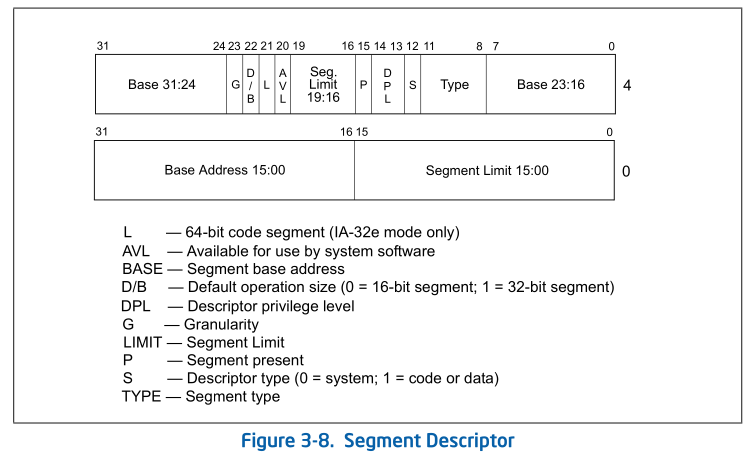

The flags and fields in a segment descriptor are as follows:

* **Segment limit field**

  Specifies the size of the segment. The processor puts together the two
  segment limit fields to form a 20-bit value. The processor interprets the
  segment limit in one of two ways, depending on the setting of the G
  (granularity) flag:
  > ```
  > granularity [grænju'læriti]: 颗粒,粒度
  > ```
  > 指定段的大小。 处理器将两个段限制字段放在一起形成一个 20 位值。 处理器
  > 以两种方式之一解释段限制，具体取决于 G（粒度）标志的设置：

  + If the granularity flag is clear, the segment size can range from 1 byte to
    1 MByte, in byte increments.
    > 如果粒度标志被清除，则段大小的范围可以从 1 byte到 1 MByte，以byte为增量。

  + If the granularity flag is set, the segment size can range from 4 KBytes to
    4 GBytes, in 4-KByte increments.
    > 如果设置了粒度标志，则段大小的范围可以从 4 KB 到 4 GB，以 4 KB 为增量。

  The processor uses the segment limit in two different ways, depending on
  whether the segment is an expand-up or an expand-down segment. See Section
  3.4.5.1, “Code- and Data-Segment Descriptor Types,” for more information
  about segment types. For expand-up segments, the offset in a logical address
  can range from 0 to the segment limit. Offsets greater than the segment limit
  generate general-protection exceptions (#GP, for all segments other than SS)
  or stack-fault exceptions (#SS for the SS segment). For expand-down
  segments, the segment limit has the reverse function; the offset can range
  from the segment limit plus 1 to FFFFFFFFH or FFFFH, depending on the setting
  of the B flag. Offsets less than or equal to the segment limit generate
  general-protection exceptions or stack-fault exceptions. Decreasing the value
  in the segment limit field for an expand-down segment allocates new memory
  at the bottom of the segment's address space, rather than at the top. IA-32
  architecture stacks always grow downwards, making this mechanism convenient
  for expandable stacks.
  > 处理器以两种不同的方式使用段限制，具体取决于该段是expand-down段还是expand-up。 
  > 有关段类型的更多信息，请参见第 3.4.5.1 节“代码段和数据段描述符类型”。 对于expand-up
  > 段，逻辑地址中的偏移量范围可以从 0 到段限制。 大于段限制的偏移量会生成一般保护异常
  > （#GP，对于除 SS 之外的所有段）或堆栈错误异常（#SS 对于 SS 段）。 对于expand-down段，
  > 段限制具有相反的功能； 偏移量的范围可以从段限制加 1 到 FFFFFFFFH 或 FFFFH，具体取决于
  > B flag的设置。 小于或等于段限制的偏移量会生成一般保护异常或堆栈错误异常。 减小
  > expand-down段的段限制字段中的值会在段地址空间的底部而不是顶部分配新内存。 IA-32架构
  > 堆栈总是向下增长，使得这种机制便于扩展堆栈。

* **Base address fields**

  Defines the location of byte 0 of the segment within the 4-GByte linear
  address space. The processor puts together the three base address fields to
  form a single 32-bit value. Segment base addresses should be aligned to
  16-byte boundaries. Although 16-byte alignment is not required, this
  alignment allows programs to maximize performance by aligning code and data
  on 16-byte boundaries.
  > ```
  > maximize  [ˈmæksɪmaɪz] :最大化;最大限度的利用;充分利用;使增大到最大限度
  > ```
  > 定义 4 GB 线性地址空间内段的字节 0 的位置。 处理器将三个基地址字段放在一起形
  > 成一个 32 位值。 段基地址应与 16 字节边界对齐。 尽管不需要 16 字节对齐，但这
  > 种对齐允许程序通过在 16 字节边界上对齐代码和数据来最大限度地提高性能。

* **Type field**

  Indicates the segment or gate type and specifies the kinds of access that can
  be made to the segment and the direction of growth. The interpretation of
  this field depends on whether the descriptor type flag specifies an
  application (code or data) descriptor or a system descriptor. The encoding of
  the type field is different for code, data, and system descriptors (see
  Figure 5-1). See Section 3.4.5.1, “Code-and Data-Segment Descriptor Types,”
  for a description of how this field is used to specify code and data-segment
  types.
  > 指示段或门类型，并指定可以对段进行访问的类型和增长方向。 该字段的解释取决于
  > 描述符类型标志指定应用程序（代码或数据）描述符还是系统描述符。 代码、数据和
  > 系统描述符的类型字段的编码是不同的（见图 5-1）。 有关如何使用此字段来指定
  > 代码和数据段类型的说明，请参见第 3.4.5.1 节“代码段和数据段描述符类型”。

* **S (descriptor type) flag**

  Specifies whether the segment descriptor is for a system segment (S flag is
  clear) or a code or data segment (S flag is set).
  > 指定段描述符是用于系统段（S 标志清零）还是代码或数据段（S 标志设置）。

* **DPL (descriptor privilege level) field**

  Specifies the privilege level of the segment. The privilege level can range
  from 0 to 3, with 0 being the most privileged level. The DPL is used to
  control access to the segment. See Section 5.5, “Privilege Levels,” for a
  description of the relationship of the DPL to the CPL of the executing code
  segment and the RPL of a segment selector.
  > 指定段的权限级别。 权限级别的范围为 0 到 3，其中 0 是最高权限级别。 DPL 
  > 用于控制对段的访问。 有关 DPL 与执行代码段的 CPL 和段选择器的 RPL 之间
  > 关系的描述，请参见第 5.5 节“特权级别”。

* **P (segment-present) flag**

  Indicates whether the segment is present in memory (set) or not present
  (clear). If this flag is clear, the processor generates a segment-not-present
  exception (#NP) when a segment selector that points to the segment descriptor
  is loaded into a segment register. Memory management software can use this
  flag to control which segments are actually loaded into physical memory at a
  given time. It offers a control in addition to paging for managing virtual
  memory. Figure 3-9 shows the format of a segment descriptor when the
  segment-present flag is clear. When this flag is clear, the operating system
  or executive is free to use the locations marked “Available” to store its own
  data, such as information regarding the whereabouts of the missing segment.
  > ```
  > regard [rɪˈɡɑːrd] : 将...认为;看待;注意;关注;尊重
  > regarding: prep. 关于；至于; v. 把...视为;看待
  > whereabout: 下落,行踪
  > ```
  >
  > 指示该段是否存在于内存中（设置）或不存在（clear）。 如果清除该标志，则当
  > 指向段描述符的段选择器加载到段寄存器中时，处理器会生成 segment-not-present
  > exception (#NP)。 内存管理软件可以使用此标志来控制在给定时间哪些段实际
  > 加载到物理内存中。 除了分页之外，它还提供了用于管理虚拟内存的控制。 图 3-9
  > 显示了当段存在标志清零时段描述符的格式。 当该标志被清除时，操作系统或执行程
  > 序可以自由地使用标记为“可用”的位置来存储其自己的数据，例如有关missing segment
  > 的下落的信息。

* **D/B (default operation size/default stack pointer size and/or upper bound) flag**

  Performs different functions depending on whether the segment descriptor is
  an executable code segment, an expand-down data segment, or a stack segment.
  (This flag should always be set to 1 for 32-bit code and data segments and to
  0 for 16-bit code and data segments.)
  > 根据段描述符是可执行代码段、向下扩展数据段还是堆栈段来执行不同的功能。 
  > （对于 32 位代码和数据段，该标志应始终设置为 1；对于 16 位代码和数据段，
  > 该标志应始终设置为 0。）

  + **Executable code segment.**

    The flag is called the D flag and it indicates the default length for
    effective addresses and operands referenced by instructions in the segment.
    If the flag is set, 32-bit addresses and 32-bit or 8-bit operands are
    assumed; if it is clear, 16-bit addresses and 16-bit or 8-bit operands are
    assumed.
    > 该标志称为 D 标志，它指示段中指令引用的有效地址和操作数的默认长度。 如果
    > 设置了该标志，则假定为 32 位地址和 32 位或 8 位操作数； 如果清除，则假定
    > 为 16 位地址和 16 位或 8 位操作数。

    The instruction prefix 66H can be used to select an operand size other than
    the default, and the prefix 67H can be used select an address size other
    than the default.
    > 指令前缀66H可用于选择默认值以外的操作数大小，并且前缀67H可用于选择默认
    > 值以外的地址大小。

  + **Stack segment (data segment pointed to by the SS register).**

    The flag is called the B (big) flag and it specifies the size of the stack
    pointer used for implicit stack operations (such as pushes, pops, and
    calls). If the flag is set, a 32-bit stack pointer is used, which is stored
    in the 32-bit ESP register; if the flag is clear, a 16-bit stack pointer is
    used, which is stored in the 16-bit SP register. If the stack segment is
    set up to be an expand-down data segment (described in the next paragraph),
    the B flag also specifies the upper bound of the stack segment.
    > 该标志称为 B（big）标志，它指定用于隐式堆栈操作（例如压入、弹出和调用）
    > 的堆栈指针的大小。 如果该标志被设置，则使用32位堆栈指针，该指针存储在32位
    > ESP寄存器中； 如果标志清零，则使用 16 位堆栈指针，该指针存储在 16 位 SP 
    > 寄存器中。 如果堆栈段设置为向下扩展数据段（在下一段中描述），则 B 标志还
    > 指定堆栈段的上限。

  + **Expand-down data segment.**

    The flag is called the B flag and it specifies the upper bound of the
    segment. If the flag is set, the upper bound is FFFFFFFFH (4 GBytes); if
    the flag is clear, the upper bound is FFFFH (64 KBytes).
    > 该标志称为 B 标志，它指定段的上限。 如果设置了该标志，则上限为 FFFFFFFFH 
    > (4 GBytes)； 如果该标志被清除，则上限为 FFFFH (64 KB)。

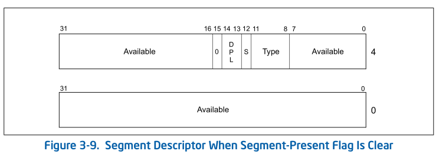

* **G (granularity) flag**

  Determines the scaling of the segment limit field. When the granularity flag
  is clear, the segment limit is interpreted in byte units; when flag is set,
  the segment limit is interpreted in 4-KByte units. (This flag does not affect
  the granularity of the base address; it is always byte granular.) When the
  granularity flag is set, the twelve least significant bits of an offset are
  not tested when checking the offset against the segment limit. For example,
  when the granularity flag is set, a limit of 0 results in valid offsets from
  0 to 4095.
  > 确定段限制字段的scaling(缩放比例)。 当粒度标志清除时，段限制以byte为单位解释；
  > 当设置标志时，段限制以 4 KB 为单位进行解释。 （此标志不会影响基地址的粒度；
  > 它始终是字节粒度的。）设置粒度标志后，在根据段限制检查偏移量时，不会测试偏移
  > 量的 12 个最低有效位。 例如，当设置粒度标志时，限制为 [0, 4095] 的有效偏移量。

* **L (64-bit code segment) flag**

  In IA-32e mode, bit 21 of the second doubleword of the segment descriptor
  indicates whether a code segment contains native 64-bit code. A value of 1
  indicates instructions in this code segment are executed in 64-bit mode. A
  value of 0 indicates the instructions in this code segment are executed in
  compatibility mode. If L-bit is set, then D-bit must be cleared. When not in
  IA-32e mode or for non-code segments, bit 21 is reserved and should always be
  set to 0.

  > 在 IA-32e 模式中，段描述符的第二个双字的位 21 指示代码段是否包含native 64 
  > 位代码。 值为 1 表示该代码段中的指令以 64 位模式执行。 值为 0 表示该代码段
  > 中的指令以兼容模式执行。 如果设置了 L 位，则必须清除 D 位。 当不在 IA-32e 
  > 模式下或对于非代码段时，位 21 被保留并且应始终设置为 0。

* **Available and reserved bits**

  Bit 20 of the second doubleword of the segment descriptor is available for
  use by system software.
  > 段描述符的第二个双字的位 20 可供系统软件使用。

#### 3.4.5.1 Code-and Data-Segment Descriptor Types

When the S (descriptor type) flag in a segment descriptor is set, the
descriptor is for either a code or a data segment. The highest order bit of the
type field (bit 11 of the second double word of the segment descriptor) then
determines whether the descriptor is for a data segment (clear) or a code
segment (set).

> 当段描述符中的 S（描述符类型）标志被设置时，该描述符用于代码段或数据段。
> 然后，类型字段的最高位（段描述符的第二个双字的位 11）确定描述符是用于数据段
> （清除）还是代码段（设置）。

For data segments, the three low-order bits of the type field (bits 8, 9, and
10) are interpreted as accessed (A), write-enable (W), and expansion-direction
(E). See Table 3-1 for a description of the encoding of the bits in the type
field for code and data segments. Data segments can be read-only or read/write
segments, depending on the setting of the write-enable bit.

> 对于数据段，类型字段的三个低位（位 8、9 和 10）被解释为已访问 (A)、可写 (W)
> 和扩展方向 (E)。 有关代码段和数据段类型字段中位编码的说明，请参见表 3-1。 
> 数据段可以是只读段或读/写段，具体取决于write-enable bit的设置。

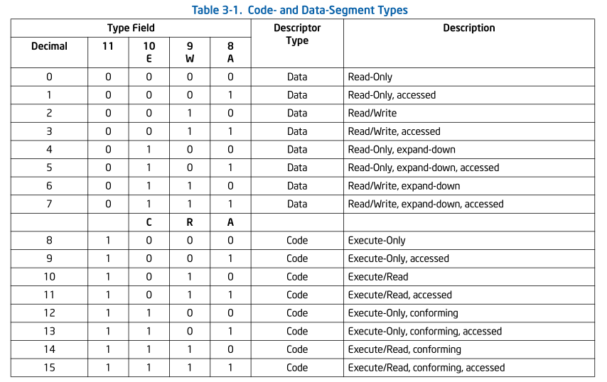

Stack segments are data segments which must be read/write segments. Loading the
SS register with a segment selector for a nonwritable data segment generates a
general-protection exception (#GP). If the size of a stack segment needs to be
changed dynamically, the stack segment can be an expand-down data segment
(expansion-direction flag set). Here, dynamically changing the segment limit
causes stack space to be added to the bottom of the stack. If the size of a
stack segment is intended to remain static, the stack segment may be either an
expand-up or expand-down type.

> 堆栈段是数据段，必须是读/写段。使用不可写数据段的段选择器加载 SS 寄存器会生成
> 一般保护异常 (#GP)。 如果堆栈段的大小需要动态改变，则堆栈段可以是expand-donw的
> 数据段（扩展方向标志设置）。 在这里，动态更改段限制会导致堆栈空间添加到堆栈底
> 部。如果堆栈段的大小旨在保持static，则堆栈段可以是向上扩展类型或向下扩展类型。

The accessed bit indicates whether the segment has been accessed since the last
time the operating-system or executive cleared the bit. The processor sets this
bit whenever it loads a segment selector for the segment into a segment
register, assuming that the type of memory that contains the segment descriptor
supports processor writes. The bit remains set until explicitly cleared. This
bit can be used both for virtual memory management and for debugging.

> ```
> explicitly /ɪkˈsplɪsətli/: 明确的,显示的
> ```
>
> 已访问位指示自上次操作系统或执行程序清除该位以来该段是否已被访问过。 每当处理
> 器将段的段选择器加载到段寄存器中时，假设包含段描述符的内存类型支持处理器写入，
> 处理器就会设置该位。 该位保持设置状态，直到显示的清除为止。该位可用于虚拟内存
> 管理和调试。

For code segments, the three low-order bits of the type field are interpreted
as accessed (A), read enable \(R\), and conforming \(C\). Code segments can be
execute-only or execute/read, depending on the setting of the read-enable bit.
An execute/read segment might be used when constants or other static data have
been placed with instruction code in a ROM. Here, data can be read from the
code segment either by using an instruction with a CS override prefix or by
loading a segment selector for the code segment in a data-segment register (the
DS, ES, FS, or GS registers). In protected mode, code segments are not
writable.

> 对于代码段，类型字段的三个低位被解释为已访问 (A)、read enable \(R\) 和
> conforming \(C\)。 代码段可以是只执行的，也可以是执行/读取的，具体取决于
> read-enable bit的设置。 当常量或其他静态数据与指令代码一起放置在 ROM 中时，
> 可能会使用执行/读取段。 这里，可以通过使用带有 CS 覆盖前缀的指令或通过在数据段
> 寄存器（DS、ES、FS 或 GS 寄存器）中加载代码段的段选择器来从代码段读取数据。
> 在保护模式下，代码段不可写。

Code segments can be either conforming or nonconforming. A transfer of
execution into a more-privileged conforming segment allows execution to
continue at the current privilege level. A transfer into a nonconforming
segment at a different privilege level results in a general-protection
exception (#GP), unless a call gate or task gate is used (see Section 5.8.1,
“Direct Calls or Jumps to Code Segments,” for more information on conforming
and nonconforming code segments). System utilities that do not access protected
facilities and handlers for some types of exceptions (such as, divide error or
overflow) may be loaded in conforming code segments. Utilities that need to be
protected from less privileged programs and procedures should be placed in
nonconforming code segments.

> 代码段可以是conforming，也可以是 nonconforming。 将执行转移到特权更高的 conforming
> segment 允许执行在当前特权级别上continue。 除非使用call-gate或task-gate，否则以不同
> 权限级别传输到nonconforming段会导致一般保护异常 (#GP)（请参阅第 5.8.1 节“直接调用或
> 跳转到代码段”有关conforming和nonconforming代码段的更多信息）。 不访问受保护facilities
> 和某些类型异常（例如除法错误或溢出）处理程序的system utilities 可以加载到 conforming 
> 代码段中。需要保护其不受特权较低的程序和procedure 影响的utilities 应放置在 nonconforming
> 的代码段中。
>
>> ???
>>
>> 难道某些异常handler所在的Trap Gate的Segment selector, 要指定为 conforming 代码段??
>>
>> 看下面描述是的
>{: .prompt-info}

> NOTE
>
> Execution cannot be transferred by a call or a jump to a less-privileged
> (numerically higher privilege level) code segment, regardless of whether the
> target segment is a conforming or nonconforming code segment. Attempting such
> an execution transfer will result in a general-protection exception.
>>
>> ```
>> numerically [nuˈmɛrɪkli]: 数字上的
>> ```
>> 无论目标段是conforming代码段还是nonconforming代码段，都不能通过调用或跳转将
>> 执行转移到特权较低（数字上特权级别较高）的代码段。 尝试这样的执行转移将导致
>> 一般保护异常。

All data segments are nonconforming, meaning that they cannot be accessed by
less privileged programs or procedures (code executing at numerically higher
privilege levels). Unlike code segments, however, data segments can be accessed
by more privileged programs or procedures (code executing at numerically lower
privilege levels) without using a special access gate.
> 所有数据段都是nonconforming的，这意味着它们不能被特权较低的程序或procedure
> （在数字上较高特权级别执行的代码）访问。 然而，与代码段不同的是，数据段可以
> 由更高特权的程序或过程（在数字上较低特权级别执行的代码）访问，而无需使用特殊
> 的访问门。

If the segment descriptors in the GDT or an LDT are placed in ROM, the
processor can enter an indefinite loop if software or the processor attempts to
update (write to) the ROM-based segment descriptors. To prevent this problem,
set the accessed bits for all segment descriptors placed in a ROM. Also, remove
operating-system or executive code that attempts to modify segment descriptors
located in ROM.

> ```
> indefinite  [ɪnˈdefɪnət]: 无限期的
> ```
>
> 如果 GDT 或 LDT 中的段描述符放置在 ROM 中，则当软件或处理器尝试更新（写入）
> ROM-based 的段描述符时，处理器可能会进入 indefinite loop。 为了防止出现此问
> 题，请设置 ROM 中所有段描述符的accessed bits。另外，删除尝试修改 ROM 中的段
> 描述符的操作系统或执行代码。

## 3.5 SYSTEM DESCRIPTOR TYPES

When the S (descriptor type) flag in a segment descriptor is clear, the
descriptor type is a system descriptor. The processor recognizes the following
types of system descriptors:

> 当段描述符中的S（描述符类型）标志清零时，该描述符类型是系统描述符。 处理器
> 可识别以下类型的系统描述符：

* Local descriptor-table (LDT) segment descriptor.
* Task-state segment (TSS) descriptor.
* Call-gate descriptor.
* Interrupt-gate descriptor.
* Trap-gate descriptor.
* Task-gate descriptor.

These descriptor types fall into two categories: system-segment descriptors and
gate descriptors. System-segment descriptors point to system segments (LDT and
TSS segments). Gate descriptors are in themselves “gates,” which hold pointers
to procedure entry points in code segments (call, interrupt, and trap gates) or
which hold segment selectors for TSS’s (task gates).

> ```
> in themselves: 本身, 自身
> ```
> 这些描述符类型分为两类：system-segment descriptor(系统段描述符)和gate descriptor
> (门描述符)。 系统段描述符指向系统段（LDT 和 TSS 段）。Gate descriptor 本身就是
> “gate”，它保存指向代码段中过程入口点的指针（调用、中断和陷阱门），或者保存 TSS
> （任务门）的段选择器。
>
>> TSS descriptor 只能在 GDT中.
> {: .prompt-info}

Table 3-2 shows the encoding of the type field for system-segment descriptors
and gate descriptors. Note that system descriptors in IA-32e mode are 16 bytes
instead of 8 bytes.

> Table 3-2 显示了系统段描述符和门描述符的类型字段的编码。 请注意，IA-32e 
> 模式下的系统描述符是 16 字节，而不是 8 字节。

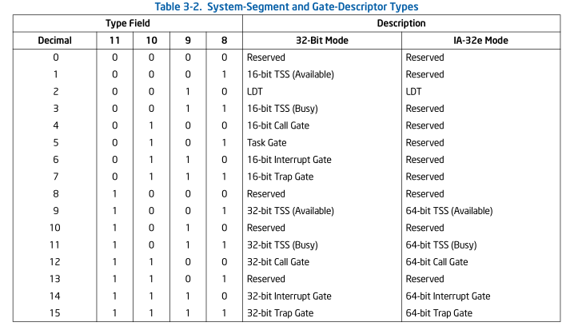

See also: Section 3.5.1, “Segment Descriptor Tables,” and Section 8.2.2, “TSS
Descriptor” (for more information on the system-segment descriptors); see
Section 5.8.3, “Call Gates”, Section 6.11, “IDT Descriptors”, and Section
8.2.5, “Task-Gate Descriptor” (for more information on the gate descriptors).

> 另请参见：第 3.5.1 节“段描述符表”和第 8.2.2 节“TSS 描述符”（有关系统段描述符的
> 更多信息）； 请参见第 5.8.3 节“调用门”、第 6.11 节“IDT 描述符”和第 8.2.5 节
> “任务门描述符”（有关门描述符的更多信息）。

### 3.5.1 Segment Descriptor Tables

A segment descriptor table is an array of segment descriptors (see Figure
3-10). A descriptor table is variable in length and can contain up to 8192
(2<sup>13</sup>) 8-byte descriptors. There are two kinds of descriptor tables:

> 段描述符表是段描述符的数组（见图3-10）。 描述符表的长度是可变的，最多可
> 以包含 8192 (2^13) 个 8 字节描述符。 描述符表有两种：

* The global descriptor table (GDT)
* The local descriptor tables (LDT)

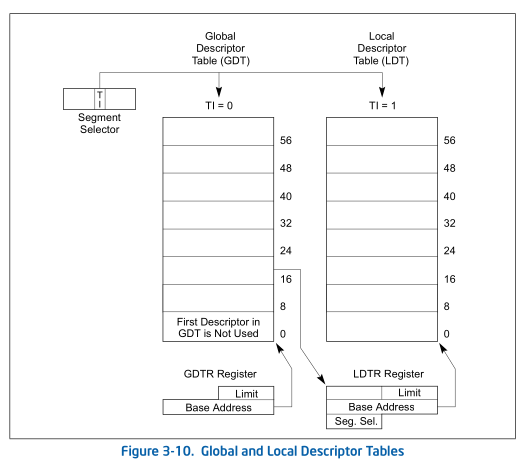

Each system must have one GDT defined, which may be used for all programs and
tasks in the system. Optionally, one or more LDTs can be defined. For example,
an LDT can be defined for each separate task being run, or some or all tasks
can share the same LDT.

> 每个系统必须定义一个GDT，它可以用于系统中的所有程序和任务。 可选地，可以定义
> 一个或多个LDT。 例如，可以为正在运行的每个单独的任务定义LDT，或者一些或所有
> 任务可以共享相同的LDT。

The GDT is not a segment itself; instead, it is a data structure in linear
address space. The base linear address and limit of the GDT must be loaded into
the GDTR register (see Section 2.4, “Memory-Management Registers”). The base
address of the GDT should be aligned on an eight-byte boundary to yield the
best processor performance. The limit value for the GDT is expressed in bytes.
As with segments, the limit value is added to the base address to get the
address of the last valid byte. A limit value of 0 results in exactly one valid
byte. Because segment descriptors are always 8 bytes long, the GDT limit should
always be one less than an integral multiple of eight (that is, 8N – 1).
> ```
> yield: v: 产生;屈服,投降;让步;放弃 n:产量;产出;利润
> integral: adj 完整的; n 整体
> integral multiple: 整数倍
> ```
> GDT 本身不是段；相反，它是线性地址空间中的数据结构。 GDT 的基线性地址和限制
> 必须加载到 GDTR 寄存器中（请参见第 2.4 节“内存管理寄存器”）。 GDT 的基地址
> 应在8-byte边界上对齐，以产生最佳的处理器性能。 GDT 的限制值以字节表示。 与段
> 一样，将限制值添加到基地址以获得最后一个有效字节的地址。 限制值 0 只会产生一
> 个有效字节。 由于段描述符始终为 8 字节长，因此 GDT 限制应始终小于 8 的整数倍
> （即 8N – 1）.

> 这里大概的意思是说, limit达到的效果是 [0, limit], 实际上range 为
> ```
> limit - 0 + 1 = limit + 1
> ```
>
> 所以要想指定N个 GDT descriptor大小, 需要将限制设置为 8N - 1, 该range正好为8N.
{: .prompt-tip}

The first descriptor in the GDT is not used by the processor. A segment
selector to this “null descriptor” does not generate an exception when loaded
into a data-segment register (DS, ES, FS, or GS), but it always generates a
general-protection exception (#GP) when an attempt is made to access memory
using the descriptor. By initializing the segment registers with this segment
selector, accidental reference to unused segment registers can be guaranteed
to generate an exception.

> ```
> accidental [ˌæksɪˈdentl]: 意外的;偶然的
> guaranteed [ˌɡærənˈtiːd]J
> ```
>
> GDT 中的第一个描述符未被处理器使用。 当加载到数据段寄存器（DS、ES、FS 或 GS）时，
> 此“null descriptor” 的段选择器不会生成异常，但当尝试使用该描述符access memory时，
> 它总是生成一般保护异常 (#GP)。通过使用该段选择器初始化段寄存器，可以保证意外
> 引用 unused 段寄存器会生成异常。

The LDT is located in a system segment of the LDT type. The GDT must contain a
segment descriptor for the LDT segment. If the system supports multiple LDTs,
each must have a separate segment selector and segment descriptor in the GDT.
The segment descriptor for an LDT can be located anywhere in the GDT. See
Section 3.5, “System Descriptor Types”, for information on the LDT
segment-descriptor type.

> LDT位于LDT类型的系统段中。 GDT 必须包含 LDT 段的段描述符。 如果系统支持多个
> LDT，则每个LDT在GDT中必须有一个单独的段选择器和段描述符。 LDT 的段描述符可以
> 位于 GDT 中的任何位置。 有关 LDT 段描述符类型的信息，请参见第 3.5 节“系统描述
> 符类型”。

An LDT is accessed with its segment selector. To eliminate address translations
when accessing the LDT, the segment selector, base linear address, limit, and
access rights of the LDT are stored in the LDTR register (see Section 2.4,
“Memory-Management Registers”).

> ```
> eliminate [ɪˈlɪmɪneɪt]: 消除, 排除;消灭, 清除
> ```
> LDT 通过其段选择器来访问。为了避免访问 LDT 时的地址转换，LDT 的段选择器、
> 基线性地址、限制和访问权限存储在 LDTR 寄存器中（请参见第 2.4 节“内存管理寄
> 存器”）。

When the GDTR register is stored (using the SGDT instruction), a 48-bit
“pseudo-descriptor” is stored in memory (see top diagram in Figure 3-11). To
avoid alignment check faults in user mode (privilege level 3), the pseudo-
descriptor should be located at an odd word address (that is, address MOD 4 is
equal to 2). This causes the processor to store an aligned word, followed by an
aligned doubleword. User-mode programs normally do not store
pseudo-descriptors, but the possibility of generating an alignment check fault
can be avoided by aligning pseudo-descriptors in this way. The same alignment
should be used when storing the IDTR register using the SIDT instruction.
When storing the LDTR or task register (using the SLDT or STR instruction,
respectively), the pseudo-descriptor should be located at a doubleword address
(that is, address MOD 4 is equal to 0).

> ```
> odd /ɑːd/: 古怪的，奇怪的
> ```
> 当 GDTR 寄存器被存储时（使用 SGDT 指令），一个 48 位“伪描述符”被存储在memory中
> （参见图 3-11 中的顶图）。 为了避免user mode （权限级别 3）下的对齐检查错误，
> 伪描述符应位于奇数字地址（即地址 MOD 4 等于 2）。 这导致处理器存储先对齐的word，
> 后跟在对齐doubleword。 用户态程序通常不存储伪描述符，但通过这种方式对齐伪描述
> 符可以避免产生对齐检查错误的可能性。 使用 SIDT 指令存储 IDTR 寄存器时应使用相
> 同的对齐方式。 当存储 LDTR 或任务寄存器（分别使用 SLDT 或 STR 指令）时，伪描述
> 符应位于双字地址（即地址 MOD 4 等于 0）。
>
>> 这个没看懂, 不知道SGDT 对 地址对齐要求和 特全级有什么关系
> {: .prompt-warning}


### 3.5.2 Segment Descriptor Tables in IA-32e Mode

In IA-32e mode, a segment descriptor table can contain up to 8192
(2<sup>13</sup>) 8-byte descriptors. An entry in the segment descriptor table
can be 8 bytes. System descriptors are expanded to 16 bytes (occupying the
space of two entries).

> 在IA-32e模式中，段描述符表可以包含多达8192（2^13）个8字节描述符。段描述符表中
> 的一个条目可以是8个字节。系统描述符被扩展到16个字节（占用两个条目的空间）。

GDTR and LDTR registers are expanded to hold 64-bit base address. The
corresponding pseudo-descriptor is 80 bits. (see the bottom diagram in Figure
3-11).

> GDTR 和 LDTR 寄存器扩展为保存 64 位基地址。 相应的伪描述符是80位。 
> （参见图 3-11 中的底部部分）。

The following system descriptors expand to 16 bytes:
 * Call gate descriptors (see Section 5.8.3.1, “IA-32e Mode Call Gates”).
 * IDT gate descriptors (see Section 6.14.1, “64-Bit Mode IDT”).
 * LDT and TSS descriptors (see Section 8.2.3, “TSS Descriptor in 64-bit
   mode”).
