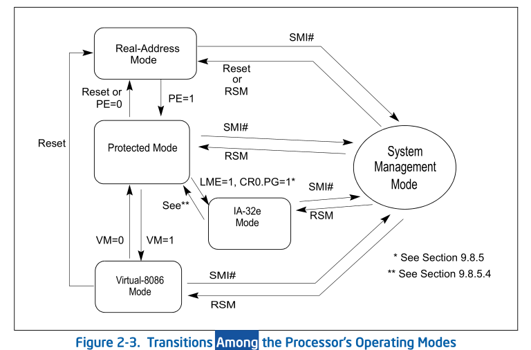
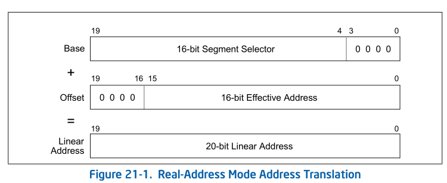
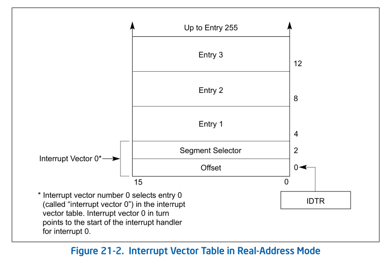
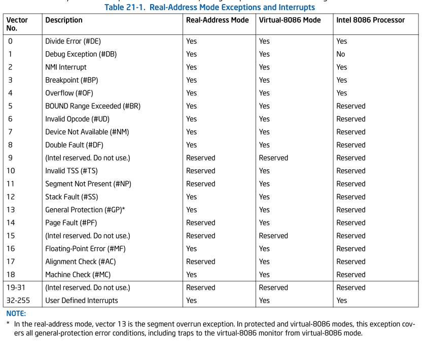
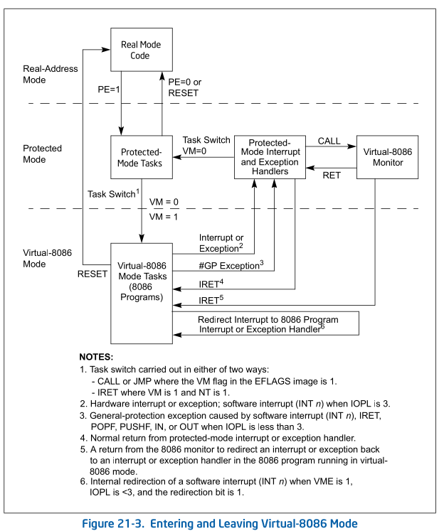

--- 
layout: post
title:  "vm86"
author: fuqiang
date:   2024-04-22 10:30:00 +0800
categories: [intel_sdm]
tags: [virt]
---


> FROM intel sdm `chapter 21 8086 emulation`

## abstract

IA-32 processors (beginning with the Intel386 processor) provide two ways to
execute new or legacy programs that are assembled and/or compiled to run on an
Intel 8086 processor:

> IA-32处理器(起始于intel386处理器)提供了两种来执行new/legacy 程序,这些程序被
> assembled(组装?) and/or compiled(编译) 以在intel 8086处理器上运行.


* Real-address mode.
* Virtual-8086 mode.

Figure 2-3 shows the relationship of these operating modes to protected mode
and system management mode (SMM).

> Figure 2-3 展示了这些操作模式和 保护模式以及 SMM 的关系



When the processor is powered up or reset, it is placed in the real-address
mode. This operating mode almost exactly duplicates the execution environment
of the Intel 8086 processor, with some extensions. Virtually any program
assembled and/or compiled to run on an Intel 8086 processor will run on an
IA-32 processor in this mode.

> 当处理器被 power up 或者 reset, 他处于 real-address mode. 这种操作模式几乎
> 完全复制了Intel 8086处理器的执行环境，并进行了一些扩展。实际上，任何在 Intel 
> 8086 处理器上组装和/或编译的程序都可以在此模式下在 IA-32 处理器上运行.

When running in protected mode, the processor can be switched to virtual-8086
mode to run 8086 programs. This mode also duplicates the execution environment
of the Intel 8086 processor, with extensions. In virtual-8086 mode, an 8086
program runs as a separate protected-mode task. Legacy 8086 programs are thus
able to run under an operating system (such as Microsoft Windows*) that takes
advantage of protected mode and to use protected-mode facilities, such as the
protected-mode interrupt- and exception-handling facilities. Protected-mode
multitasking permits multiple virtual-8086 mode tasks (with each task running a
separate 8086 program) to be run on the processor along with other
non-virtual-8086 mode tasks.

> ```
> take advantage of : 利用
> facility  [fəˈsɪləti] : 组件, 设施, 特色, 天赋, 才能
> ```
>
> 当运行在保护模式下时，处理器可以切换到virtual-8086模式来运行8086程序。该模式还
> 复制了Intel 8086 处理器的执行环境，并进行了扩展。在virtual-8086 模式下，8086 程
> 序作为单独的保护模式任务运行。 因此，传统 8086 程序能够在利用保护模式的操作系统
> （例如 Microsoft Windows*）下运行并使用保护模式facilities(组件, 设施)，例如保护
> 模式中断和异常处理facilities。 保护模式多任务处理允许多个virtual-8086 模式task
> （每个任务运行一个单独的 8086 程序）与其他 non-virtual-8086 模式任务一起在处理器
> 上运行。

This section describes both the basic real-address mode execution environment
and the virtual-8086-mode execution environment, available on the IA-32
processors beginning with the Intel386 processor.

> 本节介绍基于 real-address 模式执行环境和virtual-8086 模式执行环境，可在从 
> Intel386 处理器开始的 IA-32 处理器上使用。

## 21.1 REAL-ADDRESS MODE

The IA-32 architecture’s real-address mode runs programs written for the Intel
8086, Intel 8088, Intel 80186, and Intel 80188 processors, or for the
real-address mode of the Intel 286, Intel386, Intel486, Pentium, P6 family,
Pentium 4, and Intel Xeon processors.

> IA-32 架构的实地址模式运行为 Intel 8086、Intel 8088、Intel 80186 和 Intel 
> 80188 处理器编写的程序，或为 Intel 286、Intel386、Intel486、Pentium、
> P6 系列、Pentium 4 和 英特尔至强处理器, 实地址模式编写的程序.

The execution environment of the processor in real-address mode is designed to
duplicate the execution environment of the Intel 8086 processor. To an 8086
program, a processor operating in real-address mode behaves like a high-speed
8086 processor. The principal features of this architecture are defined in
Chapter 3, “Basic Execution Environment”, of the Intel® 64 and IA-32
Architectures Software Developer’s Manual, Volume 1.

> real-address模式下处理器的执行环境旨在复制Intel 8086处理器的执行环境。
> 对于 8086 程序来说，运行在实地址模式下的处理器的行为类似于高速 8086 处理器。
> 该架构的主要功能在 itnel sdm Volume 1 Chapter 3 "Basic Execution Environment"

The following is a summary of the core features of the real-address mode
execution environment as would be seen by a program written for the 8086:

> 以下是为 8086 编写的程序所看到的实地址模式执行环境的核心功能的摘要：

* The processor supports a nominal 1-MByte physical address space (see Section
  21.1.1, “Address Translation in Real-Address Mode”, for specific details).
  This address space is divided into segments, each of which can be up to 64
  KBytes in length. The base of a segment is specified with a 16-bit segment
  selector, which is shifted left by 4 bits to form a 20-bit offset from
  address 0 in the address space. An operand within a segment is addressed with
  a 16-bit offset from the base of the segment. A physical address is thus
  formed by adding the offset to the 20-bit segment base (see Section 21.1.1,
  “Address Translation in Real-Address Mode”).
  > 处理器支持标称 1 MB 物理地址空间（有关具体细节，请参见第 21.1.1 节"实地址模式
  > 下的地址转换"）。 该地址空间分为多个段，每个段的长度最多可达 64 KB。 
  > 段的基址由 16 位段选择器指定，该段选择器左移 4 位，形成距地址空间中地址 0 的 20 
  > 位偏移量。 段内的操作数通过距段基址的 16 位偏移量进行寻址。 因此，通过将偏移量添
  > 加到 20 位段基址来形成物理地址（请参见第 21.1.1 节“实地址模式下的地址转换”）。

* All operands in “native 8086 code” are 8-bit or 16-bit values. (Operand size
  override prefixes can be used to access 32-bit operands.)
  > “native 8086 代码”中的所有操作数都是 8 位或 16 位值。（操作数大小覆盖前缀
  > 可用于访问 32 位操作数。）

* Eight 16-bit general-purpose registers are provided: AX, BX, CX, DX, SP, BP,
  SI, and DI. The extended 32 bit registers (EAX, EBX, ECX, EDX, ESP, EBP, ESI,
  and EDI) are accessible to programs that explicitly perform a size override
  operation.
  > 提供 8 个 16 位通用寄存器：AX、BX、CX、DX、SP、BP、SI 和 DI。 扩展的 32 
  > 位寄存器（EAX、EBX、ECX、EDX、ESP、EBP、ESI 和 EDI）可供显式执行大小覆盖
  > 操作的程序访问。

* Four segment registers are provided: CS, DS, SS, and ES. (The FS and GS
  registers are accessible to programs that explicitly access them.) The CS
  register contains the segment selector for the code segment; the DS and ES
  registers contain segment selectors for data segments; and the SS register
  contains the segment selector for the stack segment.
  > 提供了四个段寄存器：CS、DS、SS 和 ES。 （FS 和 GS 寄存器可供显式访问它们的
  > 程序访问。）CS 寄存器包含代码段的段选择器； DS和ES寄存器包含数据段的段选择器；
  > SS 寄存器包含堆栈段的段选择器。

* The 8086 16-bit instruction pointer (IP) is mapped to the lower 16-bits of
  the EIP register. Note this register is a 32-bit register and unintentional
  address wrapping may occur.
  > unintentional:  [ˌʌnɪnˈtenʃənl] 无意的; 非故意的; 偶然的
  >
  > 8086 16 位指令指针（IP）映射到 EIP 寄存器的低 16 位。 请注意，该寄存器是 32 
  > 位寄存器，可能会发生 unintentional address  wrapping
  >
  >> unintentional address  wrapping 在 "21.1.1 Address Translation in Real-Address 
  >> Mode" 有介绍
  >{:.prompt-warning}

* The 16-bit FLAGS register contains status and control flags. (This register
  is mapped to the 16 least significant bits of the 32-bit EFLAGS register.)
  > 16 位标志寄存器包含状态和控制标志。（该寄存器映射到 32 位 EFLAGS 寄存器的 
  > 16 个最低有效位。）

* All of the Intel 8086 instructions are supported (see Section 21.1.3,
  “Instructions Supported in Real-Address Mode”).
  > 支持所有 Intel 8086 指令（请参见第 21.1.3 节“instruction supported in real-
  > address mode”）。

* A single, 16-bit-wide stack is provided for handling procedure calls and
  invocations of interrupt and exception handlers. This stack is contained in
  the stack segment identified with the SS register. The SP (stack pointer)
  register contains an offset into the stack segment. The stack grows down
  (toward lower segment offsets) from the stack pointer. The BP (base pointer)
  register also contains an offset into the stack segment that can be used as a
  pointer to a parameter list. When a CALL instruction is executed, the
  processor pushes the current instruction pointer (the 16 least-significant
  bits of the EIP register and, on far calls, the current value of the CS
  register) onto the stack. On a return, initiated with a RET instruction, the
  processor pops the saved instruction pointer from the stack into the EIP
  register (and CS register on far returns). When an implicit call to an
  interrupt or exception handler is executed, the processor pushes the EIP, CS,
  and EFLAGS (low-order 16-bits only) registers onto the stack. On a return
  from an interrupt or exception handler, initiated with an IRET instruction,
  the processor pops the saved instruction pointer and EFLAGS image from the
  stack into the EIP, CS, and EFLAGS registers.
  > ```
  > invocations [ˌɪnvəʊˈkeɪʃənz]: 调用; 启用; 祈祷
  > procedure  [prəˈsiːdʒə(r)] : 程序, 步骤, 手续, 手术
  > ```
  > 提供了一个 16 位宽的堆栈来处理procedure calls以及中断和异常处理程序的调用。 
  > 该堆栈包含在由 SS 寄存器标识的堆栈段中。 SP（堆栈指针）寄存器包含堆栈段的偏
  > 移量。 堆栈从堆栈指针向下增长（朝向较低的段偏移量）。 BP（基指针）寄存器还
  > 包含堆栈段的偏移量，可用作指向参数列表的指针。 当执行 CALL 指令时，处理器将
  > 当前指令指针（EIP 寄存器的 16 个最低有效位，以及far all 时 CS 寄存器的当前值）
  > 推送到堆栈上。 在使用 RET 指令启动的返回时，处理器将保存的指令指针从堆栈pop
  > 到 EIP 寄存器（以及远返回时的 CS 寄存器）。 当执行对中断或异常处理程序的隐式
  > 调用时，处理器会将 EIP、CS 和 EFLAGS（仅限低位 16 位）寄存器压入堆栈。 从使用 
  > IRET 指令启动的中断或异常处理程序返回时，处理器将保存的指令指针和 EFLAGS image
  > 从堆栈pop到 EIP、CS 和 EFLAGS 寄存器中。

* A single interrupt table, called the “interrupt vector table” or “interrupt
  table,” is provided for handling interrupts and exceptions (see Figure 21-2).
  The interrupt table (which has 4-byte entries) takes the place of the
  interrupt descriptor table (IDT, with 8-byte entries) used when handling
  protected-mode interrupts and exceptions. Interrupt and exception vector
  numbers provide an index to entries in the interrupt table. Each entry
  provides a pointer (called a “vector”) to an interrupt- or exception-handling
  procedure. See Section 21.1.4, “Interrupt and Exception Handling”, for more
  details. It is possible for software to relocate the IDT by means of the LIDT
  instruction on IA-32 processors beginning with the Intel386 processor.
  > ```
  > by means of: 通过
  > take the place of: 取代, 代替
  > ```
  > 提供了一个称为“中断向量表”或“中断表”的中断表来处理中断和异常（见图 21-2）。 
  > 中断表（具有 4-byte 条目）取代了处理保护模式中断和异常时使用的中断描述符表
  > （IDT，具有 8-byte条目）。 中断和异常向量号提供中断表中条目的索引。 每个条
  > 目都提供一个指向interrupt && exception-handling procedure 的指针（称为“向量”）。 
  > 更多详细信息，请参见第 21.1.4 节"中断和异常处理"。 从 Intel386 处理器开始，
  > 软件可以通过 IA-32 处理器上的 LIDT 指令来重新定位 IDT。

* The x87 FPU is active and available to execute x87 FPU instructions in
  real-address mode. Programs written to run on the Intel 8087 and Intel 287
  math coprocessors can be run in real-address mode without modification. 
  > ```
  > coprocessors: 辅助处理器, 协处理器
  > ```
  > x87 FPU 处于活动状态，可在实地址模式下执行 x87 FPU 指令。 为在 Intel
  > 8087 和 Intel 287 数学协处理器上运行而编写的程序无需修改即可在实地址模式下
  > 运行。

The following extensions to the Intel 8086 execution environment are available
in the IA-32 architecture’s real-address mode. If backwards compatibility to
Intel 286 and Intel 8086 processors is required, these features should not be
used in new programs written to run in real-address mode.
> Intel 8086 执行环境的以下扩展可在 IA-32 架构的实地址模式下使用。如果需要向后兼
> 容 Intel 286 和 Intel 8086 处理器，则不应在为在实地址模式下运行而编写的新程序中
> 使用这些功能。

* Two additional segment registers (FS and GS) are available.
* Many of the integer and system instructions that have been added to later
  IA-32 processors can be executed in real-address mode (see Section 21.1.3,
  “Instructions Supported in Real-Address Mode”).
  > ```
  > integer [ˈɪntɪdʒər]: 整数
  > ```
  > 许多已添加到后续 IA-32 处理器中的整数和系统指令都可以在实地址模式下执行
  > （请参见第 21.1.3 节“实地址模式支持的指令”）。
* The 32-bit operand prefix can be used in real-address mode programs to
  execute the 32-bit forms of instructions. This prefix also allows
  real-address mode programs to use the processor’s 32-bit general-purpose
  registers.
  > 32 位操作数前缀可用于实地址模式程序来执行 32 位形式的指令。 该前缀还允
  > 许实地址模式程序使用处理器的 32 位通用寄存器。

* The 32-bit address prefix can be used in real-address mode programs, allowing
  32-bit offsets. Many of the integer and system instructions that have been
  added to later IA-32 processors can be executed in real-address mode (see
  Section 21.1.3, “Instructions Supported in Real-Address Mode”).
  > 32位地址前缀可用于实地址模式程序，允许32位偏移。 许多已添加到后续 IA-32 
  > 处理器中的整数和系统指令都可以在实地址模式下执行（请参见第 21.1.3 节
  > “实地址模式支持的指令”）。

The following sections describe address formation, registers, available
instructions, and interrupt and exception handling in real-address mode. For
information on I/O in real-address mode, see Chapter 19, “Input/Output”, of the
Intel® 64 and IA-32 Architectures Software Developer’s Manual, Volume 1. a
32-bit register and unintentional address wrapping may occur.

> 以下部分描述了实地址模式下的地址形成、寄存器、可用指令以及中断和异常处理。
> 有关实地址模式下 I/O 的信息，请参阅intel sdm 第 1 卷第 19 章“Input/Output”。
> 可能会发生 32 位寄存器和unintentional address wrapping。


### 21.1.1 Address Translation in Real-Address Mode

In real-address mode, the processor does not interpret segment selectors as
indexes into a descriptor table; instead, it uses them directly to form linear
addresses as the 8086 processor does. It shifts the segment selector left by 4
bits to form a 20-bit base address (see Figure 21-1). The offset into a segment
is added to the base address to create a linear address that maps directly to
the physical address space.

> ```
> interpret  [ɪnˈtɜːprət]: 解释, 说明; 把...理解为
> ```
> 在实地址模式下，处理器不会将段选择器解释为描述符表的索引； 相反，它像 8086 处理
> 器一样直接使用它们来形成线性地址。 它将段选择子左移 4 位，形成 20 位基地址
> （见图 21-1）。 段中的偏移量被添加到基地址以创建直接映射到物理地址空间的线性地址。

When using 8086-style address translation, it is possible to specify addresses
larger than 1 MByte. For example, with a segment selector value of FFFFH and an
offset of FFFFH, the linear (and physical) address would be 10FFEFH (1 megabyte
plus 64 KBytes). The 8086 processor, which can form addresses only up to 20
bits long, truncates the high-order bit, thereby “wrapping” this address to
FFEFH. When operating in real-address mode, however, the processor does not
truncate such an address and uses it as a physical address. (Note, however,
that for IA-32 processors beginning with the Intel486 processor, the A20M#
signal can be used in real-address mode to mask address line A20, thereby
mimicking the 20-bit wrap-around behavior of the 8086 processor.) Care should
be take to ensure that A20M# based address wrapping is handled correctly in
multiprocessor based system.

> 当使用 8086 类型的地址转换时，可以指定大于 1 MB 的地址。 例如，如果段选择器值
> 为 FFFFH，偏移量为 FFFFH，则线性（物理）地址将为 10FFEFH（1 兆字节加 64 KB）。 
>
>> ```
>> 0xffff<<4 + 0xffff 
>>   = 64K * 16 + 64k 
>>   = 1M-byte + 64K 
>>   = 0x10ffef
>> ```
>{: .prompt-tip}
>
> 8086 处理器只能形成最多 20 位长的地址，它会截断高位，从而将该地址“包装”为 FFEFH。
> 然而，当在实地址模式下运行时，处理器不会截断此类地址并将其用作物理地址。 （但请
> 注意，对于从 Intel486 处理器开始的 IA-32 处理器，可以在实地址模式下使用 A20M# 
> 信号来maks address line A20，从而模仿 8086 处理器的 20 位wrap-around行为。 ）应注
> 意确保在基于多处理器的系统中正确处理基于 A20M# 的address wrapping



The IA-32 processors beginning with the Intel386 processor can generate 32-bit
offsets using an address override prefix; however, in real-address mode, the
value of a 32-bit offset may not exceed FFFFH without causing an exception.

> 从Intel386处理器开始的IA-32处理器可以使用address override prefix生成32位偏移量；
> 然而，在实地址模式下，32位偏移量的值不能超过FFFFH而不引起异常。

For full compatibility with Intel 286 real-address mode, pseudo-protection
faults (interrupt 12 or 13) occur if a 32- bit offset is generated outside the
range 0 through FFFFH.

> 为了与 Intel 286 实地址模式完全兼容，如果在 0 到 FFFFH 范围之外生成 32 位偏移，
> 则会发生 pseudo-protection (伪保护故障（中断 12 或 13）。

### 21.1.2 Registers Supported in Real-Address Mode

The register set available in real-address mode includes all the registers
defined for the 8086 processor plus the new registers introduced in later IA-32
processors, such as the FS and GS segment registers, the debug registers, the
control registers, and the floating-point unit registers. The 32-bit operand
prefix allows a real-address mode program to use the 32-bit general-purpose
registers (EAX, EBX, ECX, EDX, ESP, EBP, ESI, and EDI).

> 实地址模式下可用的寄存器集包括为 8086 处理器定义的所有寄存器以及后来的 
> IA-32 处理器中引入的新寄存器，例如 FS 和 GS 段寄存器、调试寄存器、
> 控制寄存器和浮点寄存器。 32 位操作数前缀允许实地址模式程序使用 32 位通用
> 寄存器（EAX、EBX、ECX、EDX、ESP、EBP、ESI 和 EDI）。

### 21.1.3 Instructions Supported in Real-Address Mode

The following instructions make up the core instruction set for the 8086
processor. If backwards compatibility to the Intel 286 and Intel 8086
processors is required, only these instructions should be used in a new program
written to run in real-address mode.

> 以下指令构成了 8086 处理器的核心指令集。 如果需要向后兼容 Intel 286 和 Intel 
> 8086 处理器，在编写为在实地址模式下运行的新程序中仅使用这些指令。

* Move (MOV) instructions that move operands between general-purpose registers,
  segment registers, and between memory and general-purpose registers.
* The exchange (XCHG) instruction.
* Load segment register instructions LDS and LES.
* Arithmetic instructions ADD, ADC, SUB, SBB, MUL, IMUL, DIV, IDIV, INC, DEC,
  CMP, and NEG.
* Logical instructions AND, OR, XOR, and NOT.
* Decimal instructions DAA, DAS, AAA, AAS, AAM, and AAD.
  > decimal  [ˈdesɪml] :十进制
* Stack instructions PUSH and POP (to general-purpose registers and segment
  registers).
* Type conversion instructions CWD, CDQ, CBW, and CWDE.
  > conversion : 转换, 转变
* Shift and rotate instructions SAL, SHL, SHR, SAR, ROL, ROR, RCL, and RCR.
  > rotate  [ˈroʊteɪt]: 旋转
* TEST instruction.
* Control instructions JMP, Jcc, CALL, RET, LOOP, LOOPE, and LOOPNE.
* Interrupt instructions INT n, INTO, and IRET.
* EFLAGS control instructions STC, CLC, CMC, CLD, STD, LAHF, SAHF, PUSHF, and
  POPF.
* I/O instructions IN, INS, OUT, and OUTS.
* Load effective address (LEA) instruction, and translate (XLATB) instruction.
* LOCK prefix.
* Repeat prefixes REP, REPE, REPZ, REPNE, and REPNZ.
* Processor halt (HLT) instruction.
* No operation (NOP) instruction.

The following instructions, added to later IA-32 processors (some in the Intel
286 processor and the remainder in the Intel386 processor), can be executed in
real-address mode, if backwards compatibility to the Intel 8086 processor is
not required.

> 如果不需要向后兼容 Intel 8086 处理器，则添加到后来的 IA-32 处理器（一些在 
> Intel 286 处理器中，其余在 Intel386 处理器中）的以下指令可以在实地址模式下执行。

* Move (MOV) instructions that operate on the control and debug registers.
* Load segment register instructions LSS, LFS, and LGS.
* Generalized multiply instructions and multiply immediate data.
  > Generalized [ˈdʒenrəlaɪzd] : 广义的
* Shift and rotate by immediate counts.
* Stack instructions PUSHA, PUSHAD, POPA, POPAD, and PUSH immediate data.
* Move with sign extension instructions MOVSX and MOVZX.
* Long-displacement Jcc instructions.
  > displacement: 移位;取代
* Exchange instructions CMPXCHG, CMPXCHG8B, and XADD.
* String instructions MOVS, CMPS, SCAS, LODS, and STOS.
* Bit test and bit scan instructions BT, BTS, BTR, BTC, BSF, and BSR; the
  byte-set-on condition instruction SETcc;and the byte swap (BSWAP) instruction.
* EFLAGS control instructions PUSHF and POPF.
* ENTER and LEAVE control instructions.
* BOUND instruction.
* CPU identification (CPUID) instruction.
* System instructions CLTS, INVD, WINVD, INVLPG, LGDT, SGDT, LIDT, SIDT, LMSW,
  SMSW, RDMSR, WRMSR, RDTSC, and RDPMC.

Execution of any of the other IA-32 architecture instructions (not given in the
previous two lists) in real-address mode result in an invalid-opcode exception
(#UD) being generated.

> 在实地址模式下执行任何其他 IA-32 架构指令（前两个列表中未给出）都会导致生成
> invaild-opcode 异常 (#UD)。
### 21.1.4 Interrupt and Exception Handling

When operating in real-address mode, software must provide interrupt and
exception-handling facilities that are separate from those provided in
protected mode. Even during the early stages of processor initialization when
the processor is still in real-address mode, elementary real-address mode
interrupt and exception-handling facilities must be provided to ensure reliable
operation of the processor, or the initialization code must ensure that no
interrupts or exceptions will occur.

> 当在实地址模式下运行时，软件必须提供与保护模式下提供的中断和异常处理设施分开
> 的facilities。 即使在处理器初始化的早期阶段，当处理器仍处于实地址模式时，
> 也必须提供基本实地址模式中断和异常处理设施，以确保处理器的可靠运行，
> 或者必须保证初始化代码没有中断或触发异常。

The IA-32 processors handle interrupts and exceptions in real-address mode
similar to the way they handle them in protected mode. When a processor
receives an interrupt or generates an exception, it uses the vector number of
the interrupt or exception as an index into the interrupt table. (In protected
mode, the interrupt table is called the interrupt descriptor table (IDT), but
in real-address mode, the table is usually called the interrupt vector table,
or simply the interrupt table.) The entry in the interrupt vector table
provides a pointer to an interrupt- or exception-handler procedure. (The
pointer consists of a segment selector for a code segment and a 16-bit offset
into the segment.) The processor performs the following actions to make an
implicit call to the selected handler:

> IA-32 处理器在实地址模式下处理中断和异常的方式与在保护模式下处理中断和异常的方
> 式类似。 当处理器接收到中断或生成异常时，它使用中断或异常的向量号作为中断表的索引。
> （在保护模式下，中断表称为中断描述符表（IDT），但在实地址模式下，该表通常称为中断
> 向量表，或简称为中断表。）中断向量表中的条目提供 指向中断或异常处理程序的指针。
> （指针由代码段的段选择器和段中的 16 位偏移量组成。）处理器执行以下操作以隐式调用
> 所选处理程序：

1. Pushes the current values of the CS and EIP registers onto the stack. (Only
   the 16 least-significant bits of the EIP register are pushed.)
2. Pushes the low-order 16 bits of the EFLAGS register onto the stack.
3. Clears the IF flag in the EFLAGS register to disable interrupts.
4. Clears the TF, RF, and AC flags, in the EFLAGS register.

5. Transfers program control to the location specified in the interrupt vector
   table.

An IRET instruction at the end of the handler procedure reverses these steps to
return program control to the interrupted program. Exceptions do not return
error codes in real-address mode. The interrupt vector table is an array of
4-byte entries (see Figure 21-2). Each entry consists of a far pointer to a
handler procedure, made up of a segment selector and an offset. The processor
scales the interrupt or exception vector by 4 to obtain an offset into the
interrupt table. Following reset, the base of the interrupt vector table is
located at physical address 0 and its limit is set to 3FFH. In the Intel 8086
processor, the base address and limit of the interrupt vector table cannot be
changed. In the later IA-32 processors, the base address and limit of the
inter- rupt vector table are contained in the IDTR register and can be changed
using the LIDT instruction.

> ```
> reverses [rɪˈvɜːsɪz] : 反转
> ```
>
> 处理程序末尾的 IRET 指令反转这些步骤，将程序控制权返回给被中断的程序。 
> 在实地址模式下，异常不会返回错误代码。 中断向量表是一个 4 字节条目的数组
> （见图 21-2）。 每个条目都包含一个指向处理程序过程的远指针，
> 该指针由段选择器和偏移量组成。 处理器将中断或异常向量 乘 4 以获得中断表
> 中的偏移量。 复位后，中断向量表的基址位于物理地址 0，其限制设置为 3FFH。 
> 在Intel 8086处理器中，中断向量表的基地址和限制是不能改变的。 在后来的 
> IA-32 处理器中，中断向量表的基址和限制包含在 IDTR 寄存器中，并且可以使用 
> LIDT 指令进行更改。

(For backward compatibility to Intel 8086 processors, the default base address
and limit of the interrupt vector table should not be changed.)

> （为了向后兼容 Intel 8086 处理器，不应更改中断向量表的默认基址和限制。）



Table 21-1 shows the interrupt and exception vectors that can be generated in
real-address mode and virtual-8086 mode, and in the Intel 8086 processor. See
Chapter 6, “Interrupt and Exception Handling”, for a description of the
exception conditions.

> 表 21-1 显示了在实地址模式和虚拟 8086 模式以及 Intel 8086 处理器中可以生成的中
> 断和异常向量。有关异常情况的描述，请参见第 6 章“interrupt and exception handling”。

## 21.2 VIRTUAL-8086 MODE

Virtual-8086 mode is actually a special type of a task that runs in protected
mode. When the operating-system or executive switches to a virtual-8086-mode
task, the processor emulates an Intel 8086 processor. The execution environment
of the processor while in the 8086-emulation state is the same as is described
in Section 21.1, “Real-Address Mode” for real-address mode, including the
extensions. The major difference between the two modes is that in virtual-8086
mode the 8086 emulator uses some protected-mode services (such as the
protected-mode interrupt and exception-handling and paging facilities).

> Virtual-8086 模式实际上是一种在保护模式下运行的特殊任务类型。 当操作系统
> 或执行程序切换到虚拟 8086 模式任务时，处理器将模拟 Intel 8086 处理器。
> 处理器在 8086 仿真状态下的执行环境与第 21.1 节“real address mode”中描述的实
> 地址模式相同，包括扩展。 两种模式之间的主要区别在于，在虚拟 8086 模式下，
> 8086 仿真器使用一些保护模式服务（例如保护模式中断、异常处理和分页功能）。

As in real-address mode, any new or legacy program that has been assembled
and/or compiled to run on an Intel 8086 processor will run in a
virtual-8086-mode task. And several 8086 programs can be run as
virtual-8086-mode tasks concurrently with normal protected-mode tasks, using
the processor’s multitasking facilities.

> concurrently  [kənˈkʌrəntli]: 同时
>
> 与实地址模式一样，任何已组装和/或编译以在 Intel 8086 处理器上运行的new/legacy程序
> 都将在虚拟 8086 模式任务中运行。 使用处理器的多任务处理功能，多个 8086 程序可以作
> 为虚拟 8086 模式任务与正常保护模式任务同时运行。



> NOTE:
>
> In the real-address mode, vector 13 is the segment overrun exception. In
> protected and virtual-8086 modes, this exception covers all
> general-protection error conditions, including traps to the virtual-8086
> monitor from virtual-8086 mode.
>
>> 在实地址模式下，向量13是段溢出异常。 在受保护模式和虚拟 8086 模式下，
>> 此异常涵盖所有general-proctection错误情况，包括从virtual-8086 模式到virtual-8086
>> 监视器的陷阱。

### 21.2.1 Enabling Virtual-8086 Mode

The processor runs in virtual-8086 mode when the VM (virtual machine) flag in
the EFLAGS register is set. This flag can only be set when the processor
switches to a new protected-mode task or resumes virtual-8086 mode via an IRET
instruction.

> 当 EFLAGS 寄存器中的 VM（虚拟机）标志被设置时，处理器以virtual-8086 模式运行。 
> 仅当处理器切换到新的protected-mode task 或通过 IRET 指令恢复虚拟 8086 模式时，
> 才能设置此标志。

System software cannot change the state of the VM flag directly in the EFLAGS
register (for example, by using the POPFD instruction). Instead it changes the
flag in the image of the EFLAGS register stored in the TSS or on the stack
following a call to an interrupt- or exception-handler procedure. For example,
software sets the VM flag in the EFLAGS image in the TSS when first creating a
virtual-8086 task.

> 系统软件无法直接更改 EFLAGS 寄存器中 VM 标志的状态（例如，通过使用 POPFD 指令）。
> 相反，它会在调用中断或异常处理程序过程后更改存储在 TSS 或堆栈中的 EFLAGS 
> 寄存器映像中的标志。 例如，当首次创建虚拟 8086 任务时，软件会在 TSS 的 EFLAGS 
> image中设置 VM 标志。

The processor tests the VM flag under three general conditions:

* When loading segment registers, to determine whether to use 8086-style
  address translation.
  > 当加载段寄存器时，确定是否使用8086风格的地址转换。
* When decoding instructions, to determine which instructions are not supported
  in virtual-8086 mode and which instructions are sensitive to IOPL
  > ```
  > sensitive: 敏感
  > ```
  > 解码指令时，确定哪些指令在 virtual-8086 模式下不支持以及哪些指令对 IOPL 
  > sensitive
* When checking privileged instructions, on page accesses, or when performing
  other permission checks. (Virtual-8086 mode always executes at CPL 3.)
  > 检查特权指令、页面访问或执行其他权限检查时。 （虚拟 8086 模式始终在 CPL 
  > 3 上执行。）

### 21.2.2 Structure of a Virtual-8086 Task

A virtual-8086-mode task consists of the following items:

* A 32-bit TSS for the task.
* The 8086 program.
* A virtual-8086 monitor.
* 8086 operating-system services.

The TSS of the new task must be a 32-bit TSS, not a 16-bit TSS, because the
16-bit TSS does not load the most-significant word of the EFLAGS register,
which contains the VM flag. All TSS’s, stacks, data, and code used to handle
exceptions when in virtual-8086 mode must also be 32-bit segments.

> 新任务的 TSS 必须是 32 位 TSS，而不是 16 位 TSS，因为 16 位 TSS 不加载 
> EFLAGS 寄存器的最高有效字，该寄存器包含 VM 标志。 在虚拟 8086 模式下用于处
> 理异常的所有 TSS、堆栈、数据和代码也必须是 32 位段。
>
>> RFLAGS.VM (Bit 17)
>{: .prompt-tip}

The processor enters virtual-8086 mode to run the 8086 program and returns to
protected mode to run the virtual- 8086 monitor.

> 处理器进入虚拟8086模式以运行8086程序，并返回到保护模式以运行虚拟8086 monitor。

The virtual-8086 monitor is a 32-bit protected-mode code module that runs at a
CPL of 0. The monitor consists of initialization, interrupt- and
exception-handling, and I/O emulation procedures that emulate a personal
computer or other 8086-based platform. Typically, the monitor is either part of
or closely associated with the protected-mode general-protection (#GP)
exception handler, which also runs at a CPL of 0. As with any protected-mode
code module, code-segment descriptors for the virtual-8086 monitor must exist
in the GDT or in the task’s LDT. The virtual-8086 monitor also may need
data-segment descriptors so it can examine the IDT or other parts of the 8086
program in the first 1 MByte of the address space. The linear addresses above
10FFEFH are available for the monitor, the operating system, and other system
software.

> ```
> closely: 紧密的, 接近的
> examine [ɪɡˈzæmɪn]: 检查审查
> ```
>
> virtual-8086 monitor是一个 32 位保护模式code module，运行于 CPL 0 。监视器由初始化、
> 中断和异常处理以及模拟个人计算机或其他 8086-based platform 的 I/O 模拟程序组成。
> 通常，监视器是受保护模式通用保护 (#GP) 异常处理程序的一部分或与之密切相关，该异
> 常处理程序也在 CPL 为 0 时运行。与任何受保护模式代码模块一样， virtual-8086 监视器
> 必须存在于 GDT 或任务的 LDT 中。 virtual-8086 监视器还可能需要数据段描述符，
> 以便它可以检查地址空间前 1 MB 中的 IDT 或 8086 程序的其他部分。 10FFEFH 以上的线
> 性地址可供显示器、操作系统和其他系统软件使用。

The 8086 operating-system services consists of a kernel and/or operating-system
procedures that the 8086 program makes calls to. These services can be
implemented in either of the following two ways:

> 8086 操作系统服务由 8086 程序调用的内核和/或操作系统过程组成。 这些服务可以通过
> 以下两种方式实现：

* They can be included in the 8086 program. This approach is desirable for
  either of the following reasons:
  > ```
  > desirable [dɪˈzaɪərəbl]: 可取的
  > ```
  > 它们可以包含在 8086 程序中。 由于以下任一原因，这种方法是可取的：
  + The 8086 program code modifies the 8086 operating-system services.
    > 8086程序代码修改8086操作系统服务。
  + There is not sufficient development time to merge the 8086 operating-system
    services into main operating system or executive.
    > ```
    > sufficient  [səˈfɪʃnt] : 足够的
    > ```
    > 没有足够的开发时间将 8086 操作系统服务合并到主操作系统或执行程序中。
* They can be implemented or emulated in the virtual-8086 monitor. This approach
  is desirable for any of the following reasons:
  > 它们可以在virtual-8086 监视器中实现或模拟。 由于以下任一原因，这种方法是可取的：
  + The 8086 operating-system procedures can be more easily coordinated among
    several virtual-8086 tasks.
    > ```
    > coordinateda  [koʊˈɔːrdɪneɪtɪd] : 使协调; 使相配合;
    > ```
    > 8086 操作系统程序可以更轻松地在多个虚拟 8086 任务之间进行协调。
  + Memory can be saved by not duplicating 8086 operating-system procedure code
    for several virtual-8086 tasks.
    > 通过不为多个虚拟 8086 任务复制 8086 操作系统过程代码，可以节省内存。
  + The 8086 operating-system procedures can be easily emulated by calls to the
    main operating system or executive.
    > 通过调用主操作系统或执行程序可以轻松模拟 8086 操作系统程序。

The approach chosen for implementing the 8086 operating-system services may
result in different virtual-8086- mode tasks using different 8086
operating-system services.

> 选择用于实现 8086 操作系统服务的方法可能会因使用不同 8086 操作系统服务的
> 导致virtual-8086-mode task 不同

### 21.2.3 Paging of Virtual-8086 Tasks

Even though a program running in virtual-8086 mode can use only 20-bit linear
addresses, the processor converts these addresses into 32-bit linear addresses
before mapping them to the physical address space. If paging is being used, the
8086 address space for a program running in virtual-8086 mode can be paged and
located in a set of pages in physical address space. If paging is used, it is
transparent to the program running in virtual-8086 mode just as it is for any
task running on the processor.

> ```
> done B, before done A: done B, 然后在 done A
> ```
> 即使在virtual-8086 模式下运行的程序只能使用 20 位线性地址，处理器也会将这些地址
> 转换为 32 位线性地址，然后再将它们映射到物理地址空间。 如果正在使用分页，则可
> 以对在虚拟 8086 模式下运行的程序的 8086 地址空间进行分页并将其定位在物理地址空
> 间中的一组页面中。 如果使用分页，则它对于在虚拟 8086 模式下运行的程序是透明的，
> 就像对于处理器上运行的任何任务一样。

Paging is not necessary for a single virtual-8086-mode task, but paging is
useful or necessary in the following situations:
> 对于单个虚拟 8086 模式任务来说，分页不是必需的，但在以下情况下分页是有用
> 或必要的：

* When running multiple virtual-8086-mode tasks. Here, paging allows the lower
  1 MByte of the linear address space for each virtual-8086-mode task to be
  mapped to a different physical address location.
  > 运行多个虚拟 8086 模式任务时。 这里，分页允许将每个虚拟 8086 模式任务的线性
  > 地址空间的低 1 MB 映射到不同的物理地址位置。
* When emulating the 8086 address-wraparound that occurs at 1 MByte. When using
  8086-style address translation, it is possible to specify addresses larger
  than 1 MByte. These addresses automatically wraparound in the Intel 8086
  processor (see Section 21.1.1, “Address Translation in Real-Address Mode”).
  If any 8086 programs depend on address wraparound, the same effect can be
  achieved in a virtual-8086-mode task by mapping the linear addresses between
  100000H and 110000H and linear addresses between 0 and 10000H to the same
  physical addresses.
  > 当模拟 1 MB 处发生的 8086 address-wraparound时。 当使用 8086 类型的地址转
  > 换时，可以指定大于 1 MB 的地址。 这些地址在 Intel 8086 处理器中自动 wraparound
  > （请参见第 21.1.1 节“实地址模式下的地址转换”）。如果任何8086程序依赖于address
  > wraparound, 则通过将100000H和110000H之间的线性地址以及0和10000H之间的线性地址映
  > 射到相同的物理地址，可以在虚拟8086模式任务中实现相同的效果。
* When sharing the 8086 operating-system services or ROM code that is common to
  several 8086 programs running as different 8086-mode tasks.
  > 当共享作为不同 8086 模式任务运行的多个 8086 程序所共用的 8086 操作系统服务或
  > ROM 代码时。
* When redirecting or trapping references to memory-mapped I/O devices.
  > 当重定向或捕获对 memory-mapped I/O 设备的引用时。

### 21.2.4 Protection within a Virtual-8086 Task

Protection is not enforced between the segments of an 8086 program. Either of
the following techniques can be used to protect the system software running in
a virtual-8086-mode task from the 8086 program:

> enforced [ɪnˈfɔːst]: 强迫的, 强制性的
>
> 8086 程序的段之间不强制执行保护。 可以使用以下任一技术来保护在 virtual-8086 
> 模式任务中运行的系统软件免受 8086 程序的影响：

+ Reserve the first 1 MByte plus 64 KBytes of each task’s linear address space
  for the 8086 program. An 8086 processor task cannot generate addresses
  outside this range.
  > 为 8086 程序保留每个任务的前 1 MB 加上 64 KB 的线性地址空间。 8086 处理器task
  > 无法生成此范围之外的地址。

+ Use the U/S flag of page-table entries to protect the virtual-8086 monitor
  and other system software in the virtual-8086 mode task space. When the
  processor is in virtual-8086 mode, the CPL is 3. Therefore, an 8086 processor
  program has only user privileges. If the pages of the virtual-8086 monitor
  have supervisor privilege, they cannot be accessed by the 8086 program.
  > 使用页表条目的 U/S 标志来保护virtual-8086 monitor和virtual-8086 模式任务
  > 空间中的其他系统软件。 当处理器处于virtual-8086模式时，CPL为3。因此，
  > 8086处理器程序仅具有用户权限。 如果虚拟 8086 监视器的页面具有管理员权限，
  > 则 8086 程序无法访问它们。

### 21.2.5 Entering Virtual-8086 Mode

Figure 21-3 summarizes the methods of entering and leaving virtual-8086 mode.
The processor switches to virtual-8086 mode in either of the following
situations:
> 图21-3总结了进入和离开虚拟8086模式的方法。 在以下任一情况下，处理器会切换到
> 虚拟 8086 模式：

* Task switch when the VM flag is set to 1 in the EFLAGS register image stored
  in the TSS for the task. Here the task switch can be initiated in either of
  two ways:
  > 当任务的 TSS 中存储的 EFLAGS 寄存器映像中的 VM 标志设置为 1 时，进行任务切
  > 换。 这里可以通过两种方式启动任务切换：
  + A CALL or JMP instruction.
  + An IRET instruction, where the NT flag in the EFLAGS image is set to 1. 
    > IRET, with EFLAGS image 's NT flag == 1

* Return from a protected-mode interrupt or exception handler when the VM flag
  is set to 1 in the EFLAGS register image on the stack.
  > 当堆栈上 EFLAGS 寄存器映像中的 VM 标志设置为 1 时，从保护模式中断或异常处理
  > 程序返回。

When a task switch is used to enter virtual-8086 mode, the TSS for the
virtual-8086-mode task must be a 32-bit TSS. (If the new TSS is a 16-bit TSS,
the upper word of the EFLAGS register is not in the TSS, causing the processor
to clear the VM flag when it loads the EFLAGS register.) The processor updates
the VM flag prior to loading the segment registers from their images in the new
TSS. The new setting of the VM flag determines whether the processor interprets
the contents of the segment registers as 8086-style segment selectors or
protected-mode segment selectors. When the VM flag is set, the segment
registers are loaded from the TSS, using 8086-style address translation to form
base addresses.

> 当使用任务切换进入virtual-8086模式时，virtual-8086模式任务的TSS必须是32位TSS。
> （如果新的TSS是16位TSS，则EFLAGS寄存器的高位不在TSS中，导致处理器在加载EFLAGS寄
> 存器时清除VM标志。）处理器在加载之前更新VM标志 该段将image注册到新的 TSS 中。 
> VM 标志的新设置确定处理器是否将段寄存器的内容解释为 8086 型段选择器或保护模式
> 段选择器。 当VM标志被设置时，段寄存器从TSS加载，使用8086类型的地址转换来形成基
> 地址。
>
> > 否则, 段寄存器的值将在段选择子 indicate 的 段描述符中加载
> {: .prompt.tip}

See Section 21.3, “Interrupt and Exception Handling in Virtual-8086 Mode”, for
information on entering virtual- 8086 mode on a return from an interrupt or
exception handler.

> 有关从中断或异常处理程序返回时进入虚拟 8086 模式的信息，请参见第 21.3 节
> “虚拟 8086 模式中的中断和异常处理”。



### 21.2.6 Leaving Virtual-8086 Mode

The processor can leave the virtual-8086 mode only through an interrupt or
exception. The following are situations where an interrupt or exception will
lead to the processor leaving virtual-8086 mode (see Figure 21-3):

> 处理器只能通过中断或异常离开虚拟 8086 模式。 以下是中断或异常将导致处理器离
> 开虚拟 8086 模式的情况（见图 21-3）：

* The processor services a hardware interrupt generated to signal the
  suspension of execution of the virtual-8086 application. This hardware
  interrupt may be generated by a timer or other external mechanism. Upon
  receiving the hardware interrupt, the processor enters protected mode and
  switches to a protected-mode (or another virtual-8086 mode) task either
  through a task gate in the protected-mode IDT or through a trap or interrupt
  gate that points to a handler that initiates a task switch. A task switch
  from a virtual-8086 task to another task loads the EFLAGS register from the
  TSS of the new task. The value of the VM flag in the new EFLAGS determines if
  the new task executes in virtual-8086 mode or not.
  > 处理器处理硬件中断，该中断产生用于作为暂停执行虚拟 8086 应用程序的信号。 
  > 该硬件中断可以由定时器或其他外部机制产生。 收到硬件中断后，处理器进入保
  > 护模式并且切换到一个 protected-mode task(或者 另一个 virtual-8086 mode task).
  > 方式有两种, 要么通过保护模式 IDT 中的任务门或通过指向handler的陷阱或中断门,
  > 该handler 会发起一个task switch. 从virtual-8086 任务到另一个任务的任务切换会
  > 从新任务的 TSS 加载 EFLAGS 寄存器。新 EFLAGS 中 VM 标志的值决定新任务是否以 
  > virtual-8086 模式执行。

* The processor services an exception caused by code executing the virtual-8086
  task or services a hardware interrupt that “belongs to” the virtual-8086
  task. Here, the processor enters protected mode and services the exception or
  hardware interrupt through the protected-mode IDT (normally through an
  interrupt or trap gate) and the protected-mode exception- and
  interrupt-handlers. The processor may handle the exception or interrupt
  within the context of the virtual 8086 task and return to virtual-8086 mode
  on a return from the handler procedure. The processor may also execute a task
  switch and handle the exception or interrupt in the context of another task.
  > 处理器为执行 virtual-8086 任务的代码引起的异常提供服务，或者为“属于”virtual-8086
  > 任务的硬件中断提供服务。 这里，处理器进入保护模式并通过保护模式IDT（通常通过中
  > 断或陷阱门）以及保护模式异常和中断处理程序来处理异常或硬件中断。 
  > 处理器可以在虚拟8086任务的上下文中处理异常或中断，并在从处理程序过程返回时
  > 返回到虚拟8086模式。 处理器还可以执行任务切换并在另一个任务的上下文中处理异常
  > 或中断。

* The processor services a software interrupt generated by code executing in
  the virtual-8086 task (such as a software interrupt to call a MS-DOS*
  operating system routine). The processor provides several methods of handling
  these software interrupts, which are discussed in detail in Section 21.3.3,
  “Class 3—Software Interrupt Handling in Virtual-8086 Mode”. Most of them
  involve the processor entering protected mode, often by means of a
  general-protection (#GP) exception. In protected mode, the processor can send
  the interrupt to the virtual-8086 monitor for handling and/or redirect the
  interrupt back to the application program running in virtual-8086 mode task
  for handling.

  > 处理器为 virtual-8086 任务中执行的代码生成的软件中断提供服务（例如调用 
  > MS-DOS* 操作系统例程的软件中断）。 处理器提供了几种处理这些软件中断的方法，
  > 这些方法在第 21.3.3 节“Class 3—Software Interrupt Handling in Virtual-8086 
  > Mode”中详细讨论。其中大多数涉及处理器进入保护模式，通常是通过通用保护（#GP）
  > 异常的方式。 在保护模式下，处理器可以将中断发送到virtual-8086监视器以进行处
  > 理和/或将中断重定向回以virtual-8086模式任务运行的应用程序以进行处理。

  IA-32 processors that incorporate the virtual mode extension (enabled with
  the VME flag in control register CR4) are capable of redirecting
  software-generated interrupts back to the program’s interrupt handlers
  without leaving virtual-8086 mode. See Section 21.3.3.4, “Method 5: Software
  Interrupt Handling”, for more information on this mechanism.
  > ```
  > incorporate /ɪnˈkɔːpəreɪt/: 合并,包含
  > ```
  > 包含虚拟模式扩展（通过控制寄存器 CR4 中的 VME 标志启用）的 IA-32 
  > 处理器能够将软件生成的中断重定向回程序的中断处理程序，而无需离开虚拟 
  > 8086 模式。 有关此机制的更多信息，请参见第 21.3.3.4 节“方法 5：software
  > interrupt handling”。

* A hardware reset initiated by asserting the RESET or INIT pin is a special
  kind of interrupt. When a RESET or INIT is signaled while the processor is in
  virtual-8086 mode, the processor leaves virtual-8086 mode and enters
  real-address mode.

  > 通过置位 RESET 或 INIT 引脚启动的硬件复位是一种特殊类型的中断。 当处理器
  > 处于虚拟 8086 模式时发出 RESET 或 INIT 信号时，处理器将离开虚拟 8086 模式
  > 并进入实地址模式。

* Execution of the HLT instruction in virtual-8086 mode will cause a
  general-protection (GP#) fault, which the protected-mode handler generally
  sends to the virtual-8086 monitor. The virtual-8086 monitor then determines
  the correct execution sequence after verifying that it was entered as a
  result of a HLT execution.
  > 在虚拟 8086 模式下执行 HLT 指令将导致general-protection (GP#) fault，保
  > 护模式处理程序通常会将其发送到 virtual-8086 监视器。 然后，virtual-8086 监视
  > 器在验证它是作为 HLT 执行的结果输入后确定正确的执行顺序。

See Section 21.3, “Interrupt and Exception Handling in Virtual-8086 Mode”, for
information on leaving virtual-8086 mode to handle an interrupt or exception
generated in virtual-8086 mode.

有关离开 virtual-8086 模式以处理 virtual-8086 模式中生成的中断或异常的信息，
请参见第 21.3 节 “Virtual-8086 模式下的中断和异常处理”。

### 21.2.7 Sensitive Instructions

When an IA-32 processor is running in virtual-8086 mode, the CLI, STI, PUSHF,
POPF, INT n, and IRET instructions are sensitive to IOPL. The IN, INS, OUT, and
OUTS instructions, which are sensitive to IOPL in protected mode, are not
sensitive in virtual-8086 mode.

> 当 IA-32 处理器运行在virtual-8086 模式下时，CLI、STI、PUSHF、POPF、INT n 和 
> IRET 指令对 IOPL 敏感。 IN、INS、OUT 和 OUTS 指令在保护模式下对 IOPL 敏感，
> 但在virtual-8086 模式下不敏感。

The CPL is always 3 while running in virtual-8086 mode; if the IOPL is less
than 3, an attempt to use the IOPL-sensitive instructions listed above
triggers a general-protection exception (#GP). These instructions are sensitive
to IOPL to give the virtual-8086 monitor a chance to emulate the facilities
they affect.

> 在virtual-8086 模式下运行时，CPL 始终为 3； 如果 IOPL 小于 3，则尝试使用上面列出
> 的 IOPL 敏感指令会触发一般保护异常 (#GP)。 这些指令对 IOPL 敏感，使virtual-8086 
> 监视器有机会模拟它们影响的facilities。

### 21.2.8 Virtual-8086 Mode I/O

NULL

## 21.3 INTERRUPT AND EXCEPTION HANDLING IN VIRTUAL-8086 MODE

NULL


## 21.4 PROTECTED-MODE VIRTUAL INTERRUPTS

NULL
