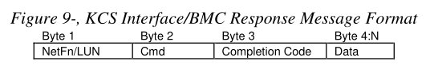
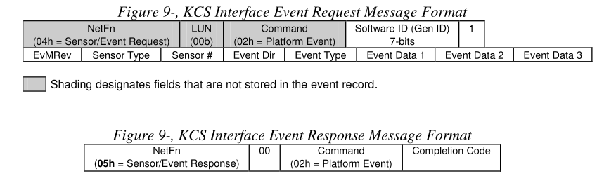
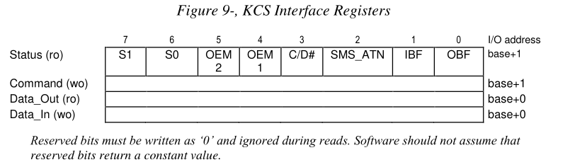
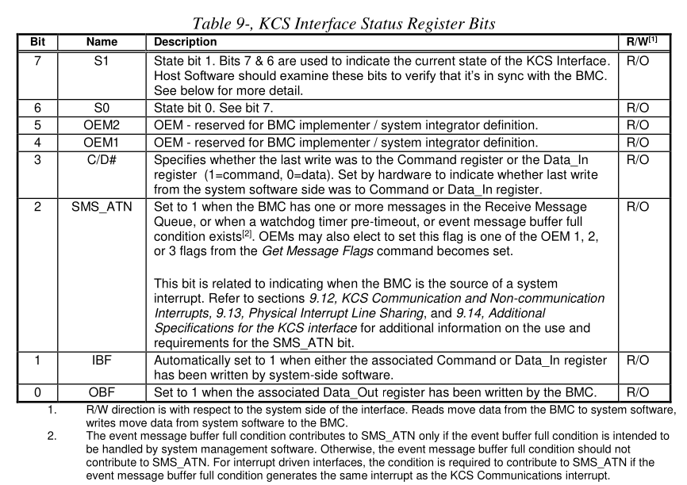
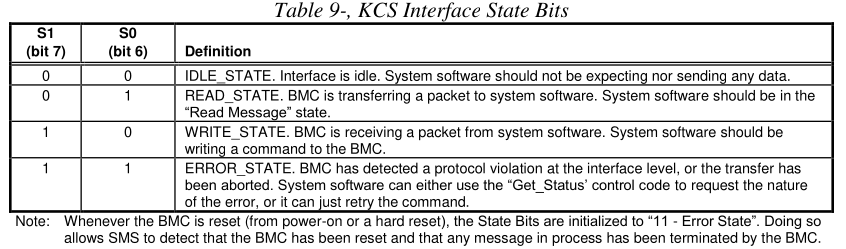
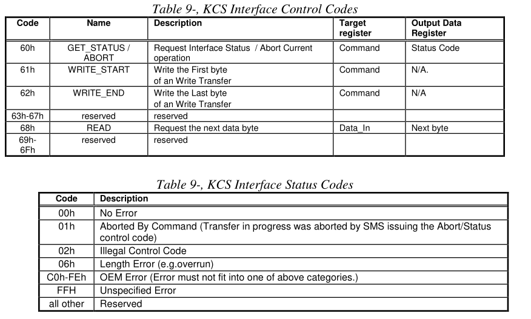
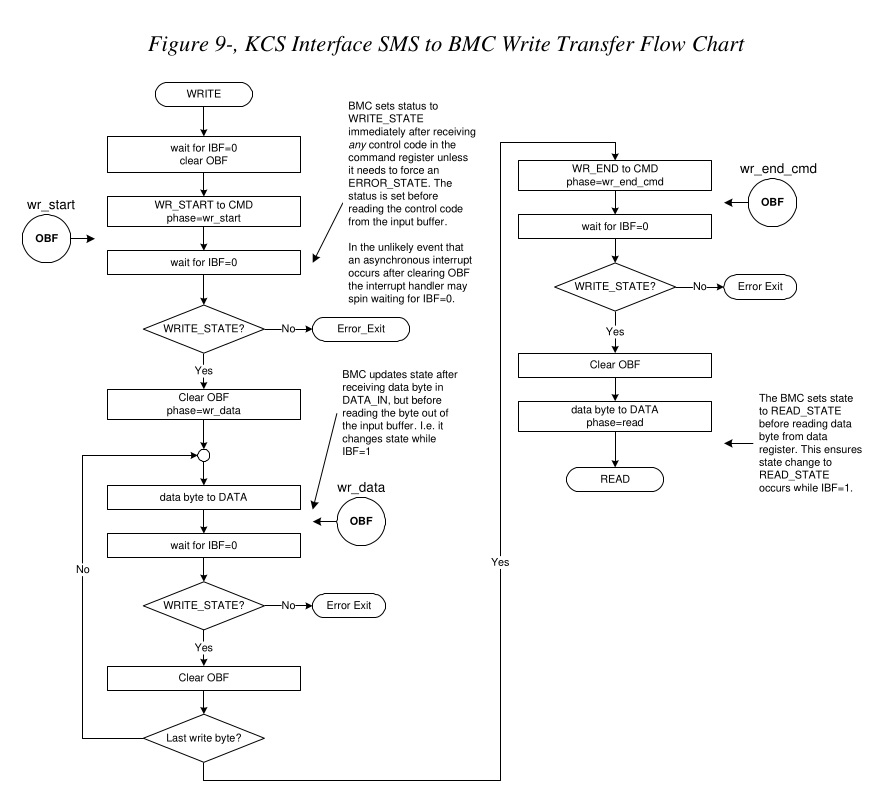
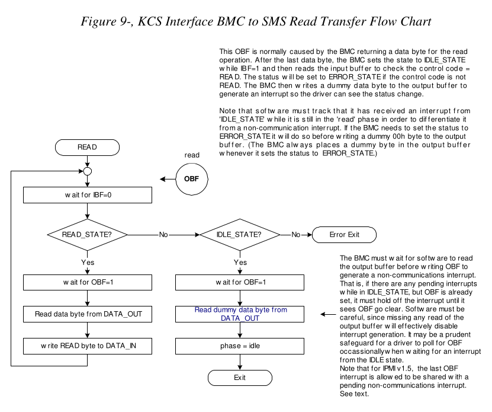
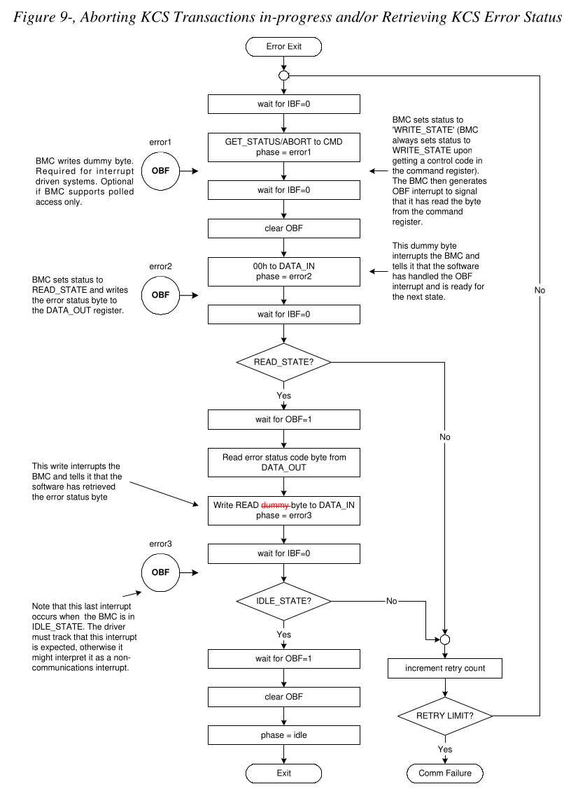

## abstract

This section describes the Keyboard Controller Style (KCS) Interface. The KCS
interface is one of the supported BMC to SMS interfaces. The KCS interface is
specified solely for SMS messages. SMM messages between the BMC and an SMI
Handler will typically require a separate interface, though the KCS interface
is designed so that system software can detect if a transaction was
interrupted. Any BMC-to-SMI Handler communication via the KCS interface is
implementation specific and is not covered by this specification.

> ```
> solely: 单独地;
> ```
> 本节介绍键盘控制器样式 (KCS) 接口。 KCS 接口是受支持的 BMC 到 SMS 接口之一。 
> KCS 接口专为 SMS 消息而指定。 BMC 和 SMI 处理程序之间的 SMM 消息通常需要单
> 独的接口，尽管 KCS 接口的设计使得系统软件可以检测事务是否被中断。 任何通
> 过 KCS 接口的 BMC 到 SMI 处理程序通信都是特定于实现的，并且不包含在本规范
> 中。

The KCS Interface is designed to support polled operation. Implementations can
optionally provide an interrupt driven from the OBF flag, but this must not
prevent driver software from the using the interface in a polled manner. This
allows software to default to polled operation. It also allows software to use
the KCS interface in a polled mode until it determines the type of interrupt
support. Methods for assigning and enabling such an interrupt are outside the
scope of this specification.

> KCS 接口旨在支持轮询操作。 实现可以选择提供由 OBF flag 驱动的中断，但这不能阻
> 止驱动程序软件以轮询方式使用接口。 这允许软件默认进行轮询操作。 它还允许软件
> 以轮询模式使用 KCS 接口，直到确定中断支持的类型。 分配和启用此类中断的方法超
> 出了本规范的范围.

## 9.1 KCS Interface/BMC LUNs

LUN 00b is typically used for all messages to the BMC through the KCS
Interface. LUN 10b is reserved for Receive Message Queue use and should not be
used for sending commands to the BMC. Note that messages encapsulated in a Send
Message command can use any LUN in the encapsulated portion.

> ```
> encapsulated [ɪnˈkæpsjuleɪtɪd] : v. 压缩;概括;简述; adj. 密封的;封装的
> ```
> LUN 00b 通常用于通过 KCS 接口发送至 BMC 的所有消息。 LUN 10b 保留供Receive Message 
> Queue 使用，不应用于向 BMC 发送命令。 请注意，Send Message command 中封装的消息可以
> 使用封装部分中的任何 LUN。

## 9.2 KCS Interface-BMC Request Message Format

Request Messages are sent to the BMC from system software using a write
transfer through the KCS Interface. The message bytes are organized according
to the following format specification:
> Request Messages 通过 KCS 接口使用写传输从系统软件发送到 BMC。 消息字节
> 按照以下格式规范组织：


Where:

* **LUN**
 
  Logical Unit Number. This is a sub-address that allows messages to be routed
  to different ‘logical units’ that reside behind the same physical interface.
  The LUN field occupies the least significant two bits of the first message
  byte.
  > occupy [ˈɑːkjupaɪ]: 占据; 使用，占用
  >
  > 这是一个子地址，允许消息路由到驻留在同一物理接口后面的不同“逻辑单元”。 LUN 
  > 字段占据第一个消息字节的最低有效两位。

* **NetFn**

  Network Function code. This provides the first level of functional routing
  for messages received by the BMC via the KCS Interface. The NetFn field
  occupies the most significant six bits of the first message byte. Even NetFn
  values are used for requests to the BMC, and odd NetFn values are returned in
  responses from the BMC.
  > ```
  > even: 偶数
  > odd /ɑːd/: 奇数
  > ```
  > Network Function Code。 这为 BMC 通过 KCS 接口接收的消息提供第一级功能路由。 
  > NetFn 字段占据第一个消息字节的最高有效六位。 偶数 NetFn 值用于向 BMC 发出
  > 请求，奇数 NetFn 值在 BMC 的响应中返回。

* **Cmd**

  Command code. This message byte specifies the operation that is to be
  executed under the specified Network Function.

  > Command code. 该消息字节指定要在指定Network Function 下执行的操作。

* **Data**

  Zero or more bytes of data, as required by the given command. The general
  convention is to pass data LS-byte first, but check the individual command
  specifications to be sure.

  > ```
  > convention [kənˈvenʃn]: 协定,协议;约束,约定;惯例
  > ```
  > 根据给定命令的需要，零个或多个字节的数据。 一般约定是首先传递数据 LS-byte ，但
  > 请检查各个命令规范来确定。

## 9.3 BMC-KCS Interface Response Message Format

Response Messages are read transfers from the BMC to system software via the
KCS Interface. Note that the BMC only returns responses via the KCS Interface
when Data needs to be returned. The message bytes are organized according to
the following format specification:

> Response Messages 是通过 KCS 接口从 BMC 到系统软件的读取传输。 请注意，BMC 仅在需
> 要返回数据时才通过 KCS 接口返回响应。 消息字节按照以下格式规范组织：



Where:

* **LUN**

  Logical Unit Number. This is a return of the LUN that was passed in the
  Request Message.

* **NetFn**

  Network Function. This is a return of the NetFn code that was passed in the
  Request Message. Except that an odd NetFn value is returned.

  > 注意其返回的NetFn 是偶数. 而 Request Message 中是奇数.
  {: .prompt-tip}

* **Cmd**
 
  Command. This is a return of the Cmd code that was passed in the Request
  Message.

* **Completion Code**

  The Completion Code indicates whether the request completed successfully or
  not.
  > Completion Code 指示请求是否成功完成。

* **Data**

  Zero or more bytes of data. The BMC always returns a response to
  acknowledge the request, regardless of whether data is returned or not.
  > 零个或多个字节的数据。 无论是否返回数据，BMC 都会返回响应来确认请求。

## 9.4 Logging Events from System Software via KCS Interface

The KCS Interface can be used for sending Event Messages from system software
to the BMC Event Receiver. The following figures show the format for KCS
Interface Event Request and corresponding Event Response messages. Note that
only Event Request Messages to the BMC via the KCS Interface have a Software ID
field. This is so the Software ID can be saved in the logged event.

> KCS 接口可用于将Event Message 从系统软件发送到 BMC Event Receiver。 下图显示了
> KCS接口Event Request 和相应 Event Response 消息的格式。 请注意，只有通过 KCS 
> 接口发送至 BMC 的事件请求消息才具有软件 ID 字段。 这样软件 ID 就可以保存在记
> 录的事件中。



> designates /ˈdezɪɡneɪts/ 指定；命名；选定，指派，委任

## 9.5 KCS Interface Registers

The KCS Interface defines a set of I/O mapped communication registers. The bit
definitions, and operation of these registers follows that used in the Intel
8742 Universal Peripheral Interface microcontroller. The term ‘Keyboard
Controller Style’ reflects the fact that the 8742 interface is used as the
system keyboard controller interface in PC architecture computer systems.

> KCS 接口定义了一组 I/O 映射通信寄存器。 这些寄存器的位定义和操作遵循 Intel 
> 8742 Universal Peripheral 微控制器中使用的定义和操作。 术语“Keyboard Controller
> Style” 反映了 8742 接口在 PC 架构计算机系统中用作系统键盘控制器接口.

The specification of the KCS Interface registers is given solely with respect
to the ‘system software side’ view of the interface in system I/O space. The
functional behavior of the management controller to support the KCS Interface
registers is specified, but the physical implementation of the interface and
the organization of the interface from the management controller side is
implementation dependent and is beyond the scope of this specification.
> KCS 接口寄存器的规范仅针对系统 I/O 空间中接口的“系统软件端”视图给出。 管理控
> 制器支持  KCS 接口寄存器的功能行为已被指定，但管理控制器侧接口的物理实现和接口
> 的组织取决于实现，并且超出了本规范的范围。

On the system side, the registers are mapped to system I/O space and consists
of four byte-wide registers.
> 在系统方面，寄存器映射到系统I/O空间并由四个byte-wide的寄存器组成。

* **Status Register** - provides flags and status bits for use in various
  defined operations.
  > 提供了在各种定义的操作中使用的标志和状态位。
* **Command Register** - provides port into which ‘Write Control Codes’ may be
  written.
  > 提供可以写入“Write Control Codes”的端口。
* **Data_In** - provides a port into which data bytes and ‘Read Control Codes’
  may be written.
  > 提供一个可以写入数据字节和“Read Control Codes”的端口。
* **Data_Out** - provides a port from which data bytes may be read.
  > 提供可以读取数据字节的端口。

The default system base address for an I/O mapped KCS SMS Interface is CA2h.
Refer to Appendix C1 - Locating IPMI System Interfaces via SM BIOS Tables for
information on using SM BIOS tables for describing optional interrupt usage,
memory mapped registers, 32-bit and 16-byte aligned registers, and alternative
KCS interface addresses. Software can assume the KCS interface registers are
I/O mapped and byte aligned at the default address unless other information is
provided.

> ```
> Appendix [əˈpendɪks]: 附录
> ```
> I/O 映射的 KCS SMS 接口的默认系统基地址是 CA2h。 请参阅附录 C1 - 通过 SM BIOS
> 表定位 IPMI 系统接口，了解有关使用 SM BIOS 表描述可选中断使用、内存映射寄存器、
> 32 位和 16 字节对齐寄存器以及备用 KCS 接口地址的信息。 软件可以假定 KCS 
> 接口寄存器已进行 I/O 映射并在默认地址处进行字节对齐，除非提供其他信息



## 9.6 KCS Interface Control Codes

Control codes are used for ‘framing’ message data transferred across the KCS
Interface. Control Codes are used to:

> ```
> frame: n. 框架 v. 表达,指定,拟定
> ```
> Control Code 用于“构建”通过 KCS 接口传输的消息数据。 控制代码用于：

* Identify the first and last bytes of a packet.
* Identify when an error/abort has occurred.
* Request additional data bytes.

## 9.7 Status Register

System software always initiates a transfer. If the BMC has a message for SMS,
it can request attention by setting the SMS_ATN bit in the status register.
System software then detects the flag and initiates the transfer.

> ```
> initiates [ɪˈnɪʃieɪts]
> ```
> 系统软件总是发起传输。 如果 BMC 有 SMS 消息，则可以通过设置状态寄存器中的 
> SMS_ATN 位来请求关注。 然后系统软件检测该标志并启动传输。

Other bits in the status register are used to arbitrate access to the command
and data registers between the BMC and system software and to indicate the
“state” (write, read, error, or idle) of the current transaction. The following
tables summarize the functions of the Status Register bits.

> ```
> arbitrate [ˈɑːrbɪtreɪt]: v. 仲裁,中断
> ```
> 状态寄存器中的其他位用于仲裁 BMC 和系统软件之间对命令和数据寄存器的访问，并指
> 示当前事务的“状态”（写入、读取、错误或空闲）。 下表总结了状态寄存器位的功能。



> * **C/D#**:
>
>   Specifies whether the last write was to the Command register or the Data_In
>   register (1=command, 0=data). Set by hardware to indicate whether last write
>   from the system software side was to Command or Data_In register.
>   > 指定最后一次写入是写入命令寄存器还是 Data_In 寄存器（1=命令，0=数据）。 由硬件
>   > 设置以指示系统软件端的最后一次写入是对 Command 还是 Data_In 寄存器。
>
> * **IBF**
>
>   Automatically set to 1 when either the associated Command or Data_In register
>   has been written by system-side software.
>   > 当系统端软件写入关联的 Command 或 Data_In 寄存器时，自动设置为 1。
>
> * **OBF** 
>
>   Set to 1 when the associated Data_Out register has been written by the BMC.
>
>   > 当系统端软件写入关联的 Command 或 Data_In 寄存器时，自动设置为 1。

Bits 7:6 are state bits that provide information that is used to ensure that
the BMC and system software remain in sync with one another. Following are the
possible states and their meaning:
> 位 7:6 是状态位，提供用于确保 BMC 和系统软件保持彼此同步的信息。 以下是可能
> 的状态及其含义：



> * **IDLE_STATE.**
>
>   Interface is idle. System software should not be expecting nor sending any 
>   data.
>   > 接口空闲。 系统软件不应期待也不发送任何数据。
>
> * **READ_STATE.**
> 
>   BMC is transferring a packet to system software. System software should be 
>   in the “Read Message” state.
>   > BMC 正在向系统软件传输数据包。 系统软件应处于“Read Message”状态。
>
> * **WRITE_STATE.**
>
>   BMC is receiving a packet from system software. System software should be
>   writing a command to the BMC.
>   > BMC正在接收来自系统软件的数据包。 系统软件应该向 BMC 写入命令。
>
> * **ERROR_STATE.**
>
>   BMC has detected a protocol violation at the interface level, or the transfer 
>   has been aborted. System software can either use the “Get_Status’ control code 
>   to request the nature of the error, or it can just retry the command.
>   > ```
>   > nature : n. 自然; 性质
>   > ```
>   > BMC 检测到接口级别的协议违规，或者传输已中止。 系统软件可以使用“Get_Status” control
>   > code 来请求错误的性质，也可以仅重试该命令。

### 9.7.1 SMS_ATN Flag Usage

The SMS_ATN flag is used to indicate that the BMC requires attention from
system software. This could either be because a message was received into the
Receive Message Queue and ready for delivery to system software, the Event
Message Buffer is full (if the Event Message Buffer is configured to generate
an interrupt to system management software), a watchdog pre-timeout occurred,
or because of an OEM event. Flags in the BMC identify which conditions are
causing the SMS_ATN flag to be set. All conditions must be cleared (i.e. all
messages must be flushed) in order for the SMS_ATN bit to be cleared.

> SMS_ATN 标志用于指示 BMC 需要系统软件的关注。 这可能是因为消息已接收到接
> 收消息队列并准备好传送到系统软件、事件消息缓冲区已满（如果事件消息缓冲区
> 配置为向系统管理软件生成中断）、看门狗预置 发生超时，或由于 OEM 事件。 BMC 
> 中的标志标识哪些条件导致 SMS_ATN 标志被设置。 必须清除所有条件（即必须刷新
> 所有消息）才能清除 SMS_ATN 位。

The SMS_ATN bit is also used when the KCS interface is interrupt driven, or
when OEM events or watchdog pre-timeouts generate a system interrupt. Refer to
sections 9.12, KCS Communication and Non-communication Interrupts, 9.13,
Physical Interrupt Line Sharing, and 9.14, Additional Specifications for the
KCS interface for additional information on the use and requirements for the
SMS_ATN bit.

> 当 KCS 接口是中断驱动时，或者当 OEM 事件或看门狗预超时生成系统中断时，
> 也会使用 SMS_ATN 位。 有关 SMS_ATN 位的使用和要求的附加信息，请参阅第 9.12 
> 节“KCS 通信和非通信中断”、第 9.13 节“物理中断线路共享”和 9.14 节“KCS 接口
> 的附加规范”。

## 9.8 Command Register

The Command register must only be written from the system side when the IBF
flag is clear. Only WRITE_START, WRITE_END, or GET_STATUS/ABORT Control Codes
are written to the command register.

> 仅当 IBF 标志清零时，才必须从系统侧写入命令寄存器。 仅 WRITE_START、WRITE_END 
> 或 GET_STATUS/ABORT Control Codes 会写入Control Register。

## 9.9 Data Registers

Packets to and from the BMC are passed through the data registers. These bytes
contain all the fields of a message, such as the Network Function code, Command
Byte, and any additional data required for the Request or Response message.
> 进出 BMC 的数据包通过Data Register 传递。 这些字节包含消息的所有字段，例如
> NetFn、Command Byte 以及Request 或 Response 消息所需的任何附加数据。

The Data_In register must only be written from the system side when the IBF
flag is clear. The OBF flag must be set (1) before the Data_Out register can be
read (see status register).

> 仅当 IBF 标志清零时，才必须从系统侧写入 Data_In 寄存器。 在读取 Data_Out 寄存器之前，
> 必须将 OBF 标志设置为 (1)（请参阅状态寄存器）。

## 9.10 KCS Control Codes

The following table details the usage of ‘Control Codes’ by the KCS interface.



## 9.11 Performing KCS Interface Message Transfers

System Management Software that uses the KCS Interface will typically be
running under a multi-tasking operating system. This means transfers with the
BMC may be interrupted by higher priority tasks or delayed by other System
Management Software processing. The SMS channel handshake is optimized to allow
the BMC to continue to perform tasks between data byte transfers with System
Management Software. The BMC does not time out data byte transfers on the SMS
interface.

> 使用 KCS 接口的系统管理软件通常在多任务操作系统下运行。 这意味着与 
> BMC 的传输可能会被更高优先级的任务中断或被其他系统管理软件处理延迟。
> SMS 通道握手经过优化，允许 BMC 通过系统管理软件在数据字节传输之间继续执行任务。
> BMC 不会使 SMS 接口上的数据字节传输超时。

Request and Response Messages are paired together as a Write Transfer to the
BMC to send the request followed by a Read Transfer from the BMC to get the
response.

> Request 和 Response 消息配对在一起，作为向 BMC 的Write Transfer 以发送请求，
> 然后从 BMC 进行Read Transfer 以获取响应。

The process, as seen from the system perspective is depicted in Figure 9-6, KCS
Interface SMS to BMC Write Transfer Flow Chart, and Figure 9-7, KCS Interface
BMC to SMS Read Transfer Flow Chart, below.

> 从系统角度来看，该过程如图 9-6（KCS 接口 SMS 到 BMC 写入传输流程图）和图 9-7
> （KCS 接口 BMC 到 SMS 读取传输流程图）所示。

During the write transfer each write of a Control Code to the command register
and each write of a data byte to Data_In will cause IBF to become set,
triggering the BMC to read in the corresponding Control Code or data byte.

> 在写传输期间，每次向命令寄存器写入Control Code 以及每次向 Data_In 写入数据字节都
> 会导致 IBF 置位，从而触发 BMC 读入相应的 Control Code 或数据字节。

If the KCS interface uses an interrupt, the BMC will write a dummy value of 00h
to the output data register after it has updated the status register and read
the input buffer. This generates an ‘OBF’ interrupt. The points at which this
would occur are shown as “OBF” in Figure 9-6, KCS Interface SMS to BMC Write
Transfer Flow Chart, below.

> 如果KCS接口使用中断，则BMC在更新状态寄存器并读取输入缓冲区后将向输出数据寄存器
> 写入虚拟值00h。 这会生成“OBF”中断。 发生这种情况的点在下面的图 9-6 KCS 接口 
> SMS 到 BMC 写入传输流程图中显示为“OBF”。

During the read phase, each write of a READ Control Code to Data_In will cause
IBF to become set, causing the BMC to read in the Control Code and write a data
byte to Data_Out in response. If the KCS interface uses an interrupt, the write
of the data byte to Data_Out will also generate an interrupt. The point at
which this would occur during the READ_STATE is shown as “OBF” in Figure 9-7,
KCS Interface BMC to SMS Read Transfer Flow Chart, below.

> 在读取阶段，每次向 Data_In 写入 READ 控制代码都会导致 IBF 置位，从而导致 BMC 
> 读取控制代码并将数据字节写入 Data_Out 作为响应。 如果KCS接口使用中断，则将数
> 据字节写入Data_Out也会产生中断。 在 READ_STATE 期间发生这种情况的点在下面的图
> 9-7 KCS 接口 BMC 到 SMS 读取传输流程图中显示为“OBF”。

Note that software does not need to use the Get Status/Abort transaction to
return the interface to the IDLE_STATE or handle an error condition. The
interface should return to IDLE_STATE on successful completion of any full
command/response transaction with the BMC. Thus, since the interface will allow
a command transfer to be started or restarted at any time when the input buffer
is empty, software could elect to simply retry the command upon detecting an
error condition, or issue a ‘known good’ command in order to clear ERROR_STATE.

> 请注意，软件不需要使用Get Status/Abort translation 来将接口返回到 IDLE_STATE 
> 或处理错误情况。成功完成与 BMC 的任何完整命令/响应事务后，接口应返回 IDLE_STATE。
> 因此，由于接口将允许在输入缓冲区为空时随时启动或重新启动命令传输，因此软件可以
> 选择在检测到错误情况时简单地重试该命令，或者发出“known good”命令，以便 清除 
> ERROR_STATE。

## 9.12 KCS Communication and Non-communication Interrupts

The following lists some general requirements and clarifications to support
both KCS communication and KCS non-communication interrupts on the same
interrupt line using the OBF signal. A KCS communications interrupt is defined
as an OBF-generated interrupt that occurs during the process of sending a
request message to the BMC and receiving the corresponding response. This
occurs from the start of the write (request) phase of the message (issuing
WRITE_START to the command register) through to the normal conclusion of the
corresponding read (response) phase of the message. (The conclusion of the
communications interval is normally identified by the interface going to
IDLE_STATE). KCS communications interrupts are also encountered during the
course of processing a GET_STATUS/ABORT control code.

> ```
> clarifications [ˌklɛrɪfɪˈkeɪʃənz]: 澄清（法）；净（纯）化；清化（理）；说（阐）明；解释
> conclusion [kənˈkluːʒn] 结论; 结果; 结束; 缔结; 达成; 签订; 结局; 推论; 结尾
> interval: /ˈɪntərvl/: 间隔；(时间上的)间隙；间歇;
> ```
>
> 下面列出了使用 OBF 信号在同一中断线上支持 KCS 通信和 KCS 非通信中断的一些一
> 般要求和说明。 KCS通信中断被定义为OBF-generated 的中断，该中断发生在向BMC发送请求消
> 息并接收相应响应的过程中。 这发生在从消息的写入（请求）阶段（向命令寄存器发出 
> WRITE_START）开始到消息的相应读取（响应）阶段正常结束之间。 （通信间隔的结束
> 通常由接口进入 IDLE_STATE 来标识）。 在处理 GET_STATUS/ABORT 控制代码的过程中
> 也会遇到 KCS 通信中断。

A KCS non-communication interrupt is defined as an OBF-generated interrupt that
occurs when the BMC is not in the process of transferring message data or
getting error status. This will typically be an interrupt that occurs while the
interface is in the IDLE_STATE.

> KCS非通信中断被定义为OBF-generated 的中断，当BMC不在传输消息数据或获取错误状态的
> 过程中时发生。 这通常是接口处于 IDLE_STATE 时发生的中断。

There are several options in the BMC that can be enabled to cause KCS
non-communication interrupts as described in the Set BMC Global Enables
command, and Get Message Flags commands. These are the watchdog timer
pre-timeout interrupt, event message buffer interrupt, receive message queue
interrupt, and the OEM interrupts. Software can detect which of the standard
interrupts are supported by attempting to enable them using the Set BMC Global
Enables command and checking for an error completion code.

> BMC 中有多个选项可以启用以导致 KCS 非通信中断，如 Set BMC Global Enables Command,和
> Get Message Flags commands中所述。 它们是看门狗定时器预超时中断、事件消息缓冲区中断、
> 接收消息队列中断和 OEM 中断。 软件可以通过尝试使用 Set BMC Global Enables 命令启用
> 标准中断并检查错误完成代码来检测支持哪些标准中断。

## 9.13 Physical Interrupt Line Sharing

A typical interrupt-driven implementation will assert a physical interrupt line
when OBF is asserted. In order to allow a single interrupt line to serve for
both communication and non-communication interrupts, the physical interrupt
line must be automatically deasserted by the BMC whenever a communication phase
begins, even if there is a pending non-communications interrupt to be serviced.
This is necessary so the interrupt line can be used for signaling communication
interrupts . Once the communication operations have completed (return to idle
phase) the controller must re-assert the interrupt line if the
non-communications interrupt is still pending.

> 典型的中断驱动实现将在 OBF 置位时置位物理中断线。 为了允许单个中断线同时服务于
> 通信和非通信中断，无论何时通信阶段开始，物理中断线都必须由 BMC 自动取消置位，即
> 使有待处理的非通信中断需要服务。 这是必要的，因此中断线可用于发出通信中断信号。
> 一旦通信操作完成（返回空闲阶段），如果非通信中断仍待处理，控制器必须重新断言中断
> 线。

## 9.14 Additional Specifications for the KCS interface

This section lists additional specifications for the KCS interface.

* The BMC must generate an OBF whenever it changes the status to ERROR_STATE.
  This will ensure that any transition to ERROR_STATE will cause the interrupt
  handler to run and catch the state.
  > 每当 BMC 将状态更改为 ERROR_STATE 时，都必须生成 OBF。 这将确保任何到 
  > ERROR_STATE 的转换都会导致中断处理程序运行并捕获状态。

* The BMC generates an OBF upon changing the status to IDLE_STATE. An IPMI 1.5
  implementation is allowed to share this interrupt with a pending KCS
  non-communication interrupt, or it elect to always generate a separate OBF
  interrupt for non-communications interrupts.
  > BMC 在状态更改为 IDLE_STATE 时生成 OBF。 IPMI 1.5 实现允许与待处理的 
  > KCS 非通信中断共享此中断，或者选择始终为非通信中断生成单独的 OBF 中断。

* A BMC implementation that elects to always generate a separate
  non-communications interrupt must wait for the OBF interrupt that signals
  entering the IDLE_STATE to be cleared before it asserts an OBF interrupt for
  the non-communications interrupt.

  > ```
  > elects /ɪˈlekts/: 选举; 选择; 决定
  > ```
  > 选择始终生成单独的非通信中断的 BMC 实现必须等待信号进入 IDLE_STATE 的 OBF
  > 中断被清除，然后才能为非通信中断断言 OBF 中断。

* IPMI v1.5 systems are allowed to generate a single OBF that covers both the
  last communications interrupt (when the BMC status goes to IDLE_STATE) and a
  pending non-communications interrupt. I.e. it is not required to generate a
  separate OBF interrupt for the non-communications interrupt if a
  non-communications interrupt was pending at the time the BMC status goes to
  IDLE_STATE. In order to support this, an IPMI v1.5 KCS interface
  implementation must set SMS_ATN for all standard (IPMI defined)
  non-communication interrupt sources.
  > IPMI v1.5 系统允许生成单个 OBF，该 OBF 涵盖最后的通信中断（当 BMC 状态进入 
  > IDLE_STATE 时）和待处理的非通信中断。 IE。 如果 BMC 状态进入 IDLE_STATE 时
  > 非通信中断处于待处理状态，则不需要为非通信中断生成单独的 OBF 中断。 为了支
  > 持这一点，IPMI v1.5 KCS 接口实现必须为所有标准（IPMI 定义）非通信中断源设置 
  > SMS_ATN。

* For IPMI v1.5, the BMC must set the SMS_ATN flag if any of the standard
  message flags become set. This includes Receive Message Available, Event
  Message Buffer Full (if the Event Message Buffer Full condition is intended
  to be handled by System Management Software), and Watchdog Timer pre-timeout
  flags, as listed in the Get Message Flags command. This is independent of
  whether the corresponding interrupt is enabled or not.
  > 对于 IPMI v1.5，如果设置了任何标准消息标志，BMC 必须设置 SMS_ATN 标志。 
  > 这包括接收消息可用、事件消息缓冲区已满（如果事件消息缓冲区已满条件旨在由系统
  > 管理软件处理）和看门狗定时器预超时标志，如获取消息标志命令中列出的。 这与相应
  > 的中断是否启用无关。

* The BMC must change the status to ERROR_STATE on any condition where it
  aborts a command transfer in progress. For example, if the BMC had an OEM
  command that allowed the KCS interface to be asynchronously reset via IPMB,
  the KCS interface status should be put into the ERROR_STATE and OBF set, not
  IDLE_STATE, in order for software to be notified of the change. However, the
  BMC does not change the status to the ERROR_STATE, but to the IDLE_STATE,
  when the BMC executes the Get Status/Abort control code from SMS I/F, even if
  the Get Status/Abort control code is used to abort a transfer.
  > 在任何中止正在进行的命令传输的情况下，BMC 都必须将状态更改为 ERROR_STATE。 
  > 例如，如果 BMC 有一个 OEM 命令允许通过 IPMB 异步重置 KCS 接口，则应将 
  > KCS 接口状态设置为 ERROR_STATE 和 set OBF， 而不是 IDLE_STATE ，以便向软件
  > 通知更改。 然而，当 BMC 从 SMS I/F 执行 Get Status/Abort 控制代码时，BMC 
  > 不会将状态更改为 ERROR_STATE，而是更改为 IDLE_STATE，即使 Get Status/Abort
  > 控制代码用于中止传输 。

* A cross-platform driver must be able to function without handling any of the
  OEM bits. Therefore, enabling SMS_ATN on OEM interrupts/states must not be
  enabled by default, but must be explicitly enabled either by the Set BMC
  Global Enables command or by an OEM-defined command.

  > 跨平台驱动程序必须能够在不处理任何 OEM 位的情况下运行。 因此，默认情况下不
  > 得启用 OEM 中断/状态上的 SMS_ATN，而必须通过 Set BMC Global Enables 命令或 
  > OEM 定义的命令显式启用。

* The SMS_ATN bit will remain set until all standard interrupt sources in the
  BMC have been cleared by the Clear Message Flags command, or by a
  corresponding command. For example, the Read Message command can
  automatically clear the Receive Message Queue interrupt if the command
  empties the queue.
  > SMS_ATN 位将保持设置状态，直到 BMC 中的所有标准中断源已被Clear Message Flag 
  > command 或相应的命令清除。 例如，如果读取消息命令清空队列，则该命令可以自动
  > 清除接收消息队列中断。

* A KCS interface implementation that allows its interrupt to be shared with
  other hardware must set SMS_ATN whenever it generates a KCS interrupt. A
  system will typically report whether it allows an interrupt to be shared or
  not via resource usage configuration reporting structures such as those in
  ACPI.
  > 允许与其他硬件共享其中断的 KCS 接口实现必须在生成 KCS 中断时设置 SMS_ATN。 
  > 系统通常会通过资源使用配置报告结构（例如 ACPI 中的报告结构）来报告是否允许共
  > 享中断。

* OEM non-communications interrupts should be disabled by default. They must be
  returned to the disabled state whenever the controller or the system is
  powered up or reset. This is necessary to allow a generic driver to be used
  with the controller. A driver or system software must be explicitly required
  to enable vendor-specific non- communications interrupt sources in order for
  them to be used. OEM non-communications interrupt sources must not contribute
  to SMS_ATN when they are disabled.

* The OEM 0, 1, and 2 flags that are returned by the Get Message Flags command
  may also cause the SMS_ATN flag to be set. A platform or system software must
  not enable these interrupts/flags unless there is a corresponding driver that
  can handle them. Otherwise, a generic cross-platform driver could get into a
  situation where it would never be able to clear SMS_ATN.

* It is recommended that any OEM generated non-communications interrupts cause
  at least one of the OEM flags in the Get Message Flags to become set. This
  will enable improving system efficiency by allowing a cross- platform driver
  to pass the value of the Get Message Flags to an OEM extension, saving the
  OEM extension software from having to issue an additional command to
  determine whether it has an anything to process.

* It is recommended that an OEM that uses the OEM flags sets the SMS_ATN flag
  if one or more of the OEM flags (OEM 0, OEM 1, or OEM 2) becomes set,
  especially if those flags can be the source of a KCS non- communications
  interrupt. The driver can use SMS_ATN as the clue to execute the Get Message
  Flags command and pass the data along to an OEM extension routine.

* OEM non-communications interrupts may elect to either share the IDLE_STATE
  OBF interrupt with the non- communications interrupt OBF, or generate a
  separate non-communications OBF interrupt. If the OEM non- communications
  interrupt implementation shares the IDLE_STATE OBF interrupt, the OEM non-
  communications interrupt must also set SMS_ATN.

  > OEM 非通信中断可以选择与非通信中断 OBF 共享 IDLE_STATE OBF 中断，
  > 或者生成单独的非通信 OBF 中断。 如果 OEM 非通信中断实现共享 
  > IDLE_STATE OBF 中断，则 OEM 非通信中断还必须设置 SMS_ATN。

## 9.15 KCS Flow Diagrams

The following flow diagrams have been updated from corresponding diagrams in
the original IPMI v1.0, rev. 1.1 specification. This information applies to the
following flow diagrams:
> 以下流程图已根据原始 IPMI v1.0 修订版中的相应图表进行了更新。 1.1 规范。 
> 此信息适用于以下流程图：

* All system software wait loops should include error timeouts. For simplicity,
  such timeouts are not shown explicitly in the flow diagrams. A five-second
  timeout or greater is recommended.
  > 所有系统软件等待循环都应包括错误超时。 为简单起见，流程图中未明确显示此类超时。 
  > 建议设置五秒或更长的超时时间。

* The phase values represent state information that could be kept across
  different activations of an interrupt handler, and corresponding entry
  points. Based on the 'phase' the interrupt handler would branch to the
  corresponding point when an OBF interrupt occurred. The information may also
  be useful for error reporting and handling for both polled- and
  interrupt-driven drivers. Note that other state may need to be kept as well.
  For example, during the 'wr_data’ phase, the handler may also need to
  preserve a byte counter in order to track when the last byte of the write was
  to be sent.
  > phase 值表示可以在中断处理程序的不同activations 和相应的入口点之间保存的状态信息。
  > 当 OBF 中断发生时，中断处理程序将根据“phase”分支到相应的点。 该信息对于
  > 轮询驱动驱动程序和中断驱动驱动程序的错误报告和处理也可能有用。 请注意，
  > 可能还需要保留其他状态。 例如，在“wr_data” phase ，处理程序可能还需要保留字
  > 节计数器，以便跟踪写入的最后一个字节何时发送。

* The symbol of a circle with an arrow and the text ‘OBF’ inside the circle
  represents the points where the BMC would write a dummy data byte to the
  output buffer in order to create an OBF interrupt. The label above the circle
  indicates where an interrupt handler would branch to when the OBF interrupt
  occurs under in the corresponding phase. An interrupt handler would exit upon
  completing the step that occurs before where the OBF interrupt symbol points.
  > 带箭头的圆圈符号和圆圈内的文本“OBF”代表 BMC 将dummy data byte 写入输出缓冲区
  > 以创建OBF 中断的点。圆圈上方的标签表示在相应阶段发生 OBF 中断时中断处理程序
  > 将分支到的位置。中断处理程序将在完成 OBF 中断符号指向之前发生的步骤后退出。



* wr_start OBF
  > BMC sets status to WRITE_STATE immediately after receiving any control code in
  > the command register unless it needs to force an ERROR_STATE. The status is
  > set before reading the control code from the input buffer.
  >
  > In the unlikely event that an asynchronous interrupt occurs after clearing OBF
  > the interrupt handler may spin waiting for IBF=0.
  >
  > > BMC 在接收到命令寄存器中的任何控制代码后立即将状态设置为 WRITE_STATE，除非需要强制 
  > > ERROR_STATE。 在从输入缓冲区读取Control Code 之前设置状态。 
  > >
  > > 万一在清除 OBF 后发生异步中断，中断处理程序可能会旋转等待 IBF=0。

* wr_data OBF

  > BMC updates state after receiving data byte in DATA_IN, but before reading the
  > byte out of the input buffer. I.e. it changes state while IBF=1
  >
  > > BMC 在接收 DATA_IN 中的数据字节之后、从输入缓冲区读取该字节之前更新状态。 
  > > IE。 当 IBF=1 时它改变状态

* before READ

  > The BMC sets state to READ_STATE before reading data byte from data register.
  > This ensures state change to READ_STATE occurs while IBF=1
  >
  > > 在从data register 读取数据字节之前，BMC 将状态设置为 READ_STATE。 这确保在 
  > > IBF=1 时发生状态更改为 READ_STATE



* read OBF
  > This OBF is normally caused by the BMC returning a data byte for the read
  > operation. After the last data byte, the BMC sets the state to IDLE_STATE while
  > IBF=1 and then reads the input buffer to check the control code = READ. The
  > status will be set to ERROR_STATE if the control code is not READ. The BMC then
  > writes a dummy data byte to the output buffer to generate an interrupt so the
  > driver can see the status change.
  >
  > > 此 OBF 通常是由 BMC 返回读操作的数据字节引起的。 在最后一个数据字节之后，当
  > > IBF=1 时，BMC 将状态设置为 IDLE_STATE，然后读取输入缓冲区以检查控制代码 = READ。 
  > > 如果控制代码未读取，状态将设置为 ERROR_STATE。 然后，BMC 将虚拟数据字节写入输出缓
  > > 冲区以生成中断，以便驱动程序可以看到状态更改。
  >
  > Note that software must track that it has received an interrupt from
  > 'IDLE_STATE' while it is still in the 'read' phase in order to differentiate it
  > from a non-communication interrupt. If the BMC needs to set the status to
  > ERROR_STATE it will do so before writing a dummy 00h byte to the output buffer
  > . (The BMC always places a dummy byte in the output buffer whenever it sets the
  > status to ERROR_STATE.)
  >
  > > 请注意，软件必须跟踪它在仍处于“read” phase 时已从“IDLE_STATE”接收到中断，
  > > 以便将其与非通信中断区分开来。 如果 BMC 需要将状态设置为 ERROR_STATE，它将在将
  > > dummy 00h byte 写入输出缓冲区之前执行此操作。 （每当 BMC 将状态设置为 ERROR_STATE 
  > > 时，BMC 总是在输出缓冲区中放置一个 dummy byte。）

* Read dummy data byte from DATA_OUT

  > The BMC must wait for software to read the output buffer before writing OBF to
  > generate a non-communications interrupt. That is, if there are any pending
  > interrupts while in IDLE_STATE, but OBF is already set, it must hold off the
  > interrupt until it sees OBF go clear. Softw are must be careful, since missing
  > any read of the output buffer will effectively disable interrupt generation. It
  > may be a prudent safeguard for a driver to poll for OBF occassionallyw hen
  > waiting for an interrupt from the IDLE state.
  >
  > > BMC 必须等待软件读取输出缓冲区后才能写入 OBF 以产生非通信中断。 也就是说，
  > > 如果处于 IDLE_STATE 时有任何挂起的中断，但 OBF 已设置，则必须推迟中断，直到看到
  > > OBF 清除为止。 软件必须小心，因为错过任何输出缓冲区的读取将有效地禁用中断生成。 
  > > 对于驱动程序来说，在等待来自 IDLE 状态的中断时偶尔轮询 OBF 可能是一种谨慎的保护措施。
  > 
  > Note that for IPMI v1.5, the last OBF interrupt is allowed to be shared with a
  > pending non-communications interrupt. See text.
  >
  > > 请注意，对于 IPMI v1.5，允许最后一个 OBF 中断与待处理的非通信中断共享。 见正文。




## 9.16 Write Processing Summary

The following summarizes the main steps write transfer from system software to
the BMC:

* Issue a ‘WRITE_START’ control code to the Command register to start the
  transaction.
* Write data bytes (NetFn, Command, Data) to Data_In.
* Issue an ‘WRITE_END’ control code then the last data byte to conclude the
  write transaction.

## 9.17 Read Processing Summary

The following summarizes the main steps for a read transfer from the BMC to
system software:

* Read Data_Out when OBF set
* Issue READ command to request additional bytes
* If READ_STATE (after IBF = 0), repeat previous two steps.

## 9.18 Error Processing Summary

The following summarizes the main steps by which system software processes KCS
Interface errors:

* Issue a ‘GET_STATUS/ABORT’ control code to the Command register. Wait for
  IBF=0. State should be WRITE_STATE.
* If OBF=1, Clear OBF by reading Data_Out register.
* Write 00h to data register, wait for IBF=0. State should now be READ_STATE.
* Wait for OBF=1. Read status from Data_Out
* Conclude by writing READ to data register, wait for IBF=0. State should be 
  IDLE.

## 9.19 Interrupting Messages in Progress

If, during a message transfer, the system software wants to abort a message it
can do so by the following methods:

> 如果在消息传输过程中，系统软件想要中止消息，可以通过以下方法来完成：

1. Place another “WRITE_START” command into the Command Register (a WRITE_START
   Control Code is always legal). The BMC then sets the state flags to
   “WRITE_STATE” and sets its internal flags to indicate that the stream has
   been aborted.
   > 将另一个“WRITE_START”命令放入命令寄存器（WRITE_START 控制代码始终合法）。 
   > 然后，BMC 将状态标志设置为“WRITE_STATE”，并设置其内部标志以指示流已被中止。

2. Send a “GET_STATUS/ABORT” request. This is actually the same as #1 above but
   is explicitly stated to indicate that this command will cause the current
   packet to be aborted. This command allows a stream to be terminated and the
   state to be returned to IDLE without requiring a complete BMC request and
   response transfer.
   > 发送“GET_STATUS/ABORT”请求。 这实际上与上面的 #1 相同，但明确指出该命令将
   > 导致当前数据包中止。 该命令允许终止流并将状态返回到 IDLE，而不需要完整的
   > BMC 请求和响应传输。

## 9.20 KCS Driver Design Recommendations

* A generic, cross-platform driver that supports the interrupt-driven KCS
  interface is not required to handle interrupts other than the interrupt
  signal used for IPMI message communication with the BMC. The message
  interrupt may be shared with other BMC interrupt sources, such as the
  watchdog timer pre-timeout interrupt, the event message buffer full
  interrupt, and OEM interrupts.

* A cross-platform driver should use the Get BMC Global Enables and Set BMC
  Global Enables commands in a ‘read-modify-write’ manner to avoid modifying
  the settings of any OEM interrupts or flags.

* It is recommended that cross-platform driver software provide a ‘hook’ that
  allows OEM extension software to do additional processing of KCS
  non-communication interrupts. It is highly recommended that the driver
  execute the Get Message Flags command whenever SMS_ATN remains set after
  normal processing and provide the results to the OEM extension software.

* The driver cannot know the whether the pre-existing state of any OEM
  interrupts or flags is correct. Therefore, a driver that supports OEM
  extensions should allow for an OEM initialization routine that can configure
  the OEM flags/interrupts before KCS OBF-generated interrupts are enabled.

* It is recommended that cross-platform drivers or software make provision for
  BMC implementations that may miss generating interrupts on a command error
  condition by having a timeout that will activate the driver or software in
  case an expected interrupt is not received.

* A driver should be designed to allow for the possibility that an earlier BMC
  implementation does not set the SMS_ATN flag except when there is data in the
  Receive Message Queue. If the driver cannot determine whether SMS_ATN is
  supported for all enabled standard flags or not, it should issue a Get
  Message Flags command whenever it gets a KCS non-communication interrupt.

* A driver or system software can test for whether the Watchdog Timer
  pre-timeout and/or Event Message Buffer Full flags will cause SMS_ATN to
  become set. This is accomplished by disabling the associated interrupts (if
  enabled) and then causing a corresponding action that sets the flag. This is
  straightforward by using the watchdog timer commands in conjunction with the
  Set BMC Global Enables and Get Message Flags commands.

  For example, to test for the Event Message Buffer Full flag setting SMS_ATN,
  first check to see if the Event Message Buffer feature is implemented by
  attempting to enable the event message buffer using the Set and Get BMC
  Global Enables command. If the feature is not implemented, an error
  completion code will be returned. Next, disable event logging and use the
  watchdog timer to generate an SMS/OS ‘no action’ timeout event, then see if
  the SMS_ATN becomes set. If so, use the Get Message Flags command to verify
  that the Event Message Buffer Full flag is the only one set (in case an
  asynchronous message came in to the Receive Message Queue during the test.)
  The pre-timeout interrupt can be testing in a similar manner.


* It is possible (though not recommended) for a BMC implementation to include
  proprietary non- communication interrupt sources that do not set SMS_ATN.
  These sources must not be enabled by default. It is recommended that a
  generic cross-platform driver have provisions for OEM extensions that get
  called whenever a non-communication interrupt occurs. It is recommended that
  the extension interface provides the last reading of the KCS flags so that an
  OEM extension can see the state of SMS_ATN.

* Software should be aware that IPMI v1.0 implementations were not required to
  set SMS_ATN for all non- communication interrupts. If a BMC implementation
  does not set SMS_ATN for all non-communication interrupts, it must generate a
  separate OBF interrupt for non-communication interrupts. A controller that
  does not set SMS_ATN for all non-communication interrupts is not allowed to
  use the same OBF interrupt to signal the both completion of communications
  and a non-communications interrupt.

* Regardless of whether the IDLE_STATE OBF interrupt is shared with a pending
  non-communications interrupt, software drivers must examine SMS_ATN after
  clearing OBF. If SMS_ATN is asserted the driver must process the
  non-communications interrupt sources.
