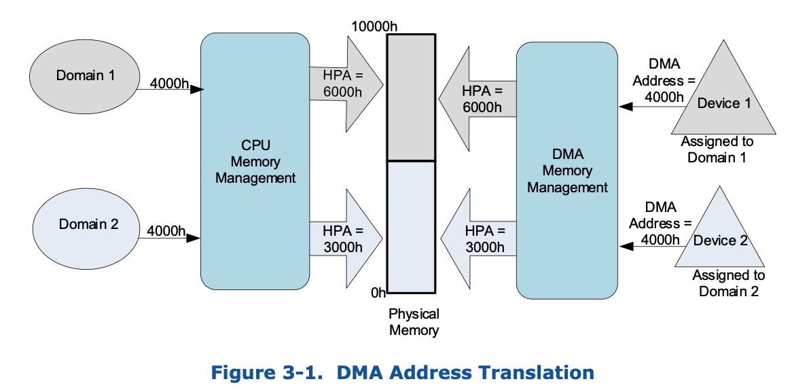

## what is iommu

IOMMU 顾名思义，就是让IO 的MMU, 可以允许IO request 进行类似于 CPU 侧MMU根据页表映射
而完成地址转换的行为。


而IO request 主要包含哪些呢?
* DMA request
* interrupt

而iommu 的作用就是完成这些request的重映射, 如下图所示:



CPU 侧 request 通过`CPU Memory Management`(MMU) 完成VA->PA的映射转换, 最终得到HPA。当然，
不同的domain（进程）由于其页表建立的映射关系不同，访问的相同的VA可以得到PA可能不
同。

Device侧 request 通过 `DMA Memory Management`(IOMMU) 完成 设备发出的DMA地址->HPA 的转换.
IOMMU可以为每个设备(不准确，我们先这样理解) 都分配独立的页表, 从而让不同设备使用相同的
DMA地址最终访问到不同的HPA.

DMA request 看似比较好理解, 无非是让原本IO request 访问的地址 A, 重映射到地址B。但是，
真的有这么简单么? 我们知道，内存访问是带有属性的(e.g., access right, memory type..), 
这些属性，我们可以通过关注TLB中存储的字段得到。而DMA remapping 也可以让这些属性发生改变.

而中断重映射也是同理，通过中断重映射，不仅可以改变 address（也就是哪个dest cpu，
哪个vector), 同样也会改变其attr，这个我们可以通过关注 MSI message (MSI data, MSI address)
得到。

所以综上所述，重映射就像kernel中的`remap()`动作一样，我们可以重新定义该虚拟地址
对应的**physical address**, 同样，我们可以根据变动页表的某些字段，来改变访问该VA
时的某些行为.

## IOMMU can do what

上面提到，IOMMU主要的工作是重映射设备发出的IO request, 而有了这个功能之后，可以
做什么呢?

那既然, IOMMU 的功能和MMU比较类似，我们来思考下MMU(也就是分页)可以什么? 可能很多小伙伴
就会马上回答到, 多进程! 没错，我们这里改成多实例。而要让多实例可以良好的共享内存
资源，我们需要完成以下两点需求:

* 物理地址隔离
* 地址转换

物理地址隔离比较好理解, 不能让一个实例可以无条件的访问另一个实例内存。这样很不安
全。而地址转换为什么又是必须的呢?

## How IOMMU work

IOMMU

## iommu kernel cmdline

* off
* force
* noforce
* biomerge
* merge
* panic
* nopanic
* forcesac
* allowdac
* nodac
* usedac
* soft
* pt
* nopt


## struct


## 代码记录

### init
```sh
pci_iommu_init
=> intel_iommu_init
   => dmar_table_init
      => if dmar_table_initialized == 0:
         => ret = parse_dmar_table()
            ## 为各个unit 定义callbak
            => define some callbak {
                  struct dmar_res_callback cb = {
                     .arg[ACPI_DMAR_TYPE_HARDWARE_UNIT] = &drhd_count,
                     .cb[ACPI_DMAR_TYPE_HARDWARE_UNIT] = &dmar_parse_one_drhd,
                     .cb[ACPI_DMAR_TYPE_RESERVED_MEMORY] = &dmar_parse_one_rmrr,
                     ...
                  }
               }
            => dmar_table_detect();
               => status = acpi_get_table(ACPI_SIG_DMAR, 0, &dmar_tbl)
            => dmar = (struct acpi_table_dmar *)(tboot_get_dmar_table(dmar_tbl))
            => ret = dmar_walk_dmar_table(dmar, &cb)
               => dmar_walk_remapping_entries
                  => foreach remapping struct:
                     => cb->cb[iter->type](iter, cb->arg[iter->type])
            ## ----- parse_dmar_table END
         => if ret > 0: 
             => dmar_table_initialized = 1
   => dmar_dev_scope_init
   => dmar_register_bus_notifier
   => init_no_remapping_devices
   => init_dmars
   => init_iommu_pm_ops
   => foreach drhd
      => iommu_device_sysfs_add
      => iommu_device_register
      => iommu_pmu_register
```

主要看下`dmar_parse_one_drhd`
```sh
dmar_parse_one_drhd
=> drhd = (struct acpi_dmar_hardware_unit *)header
# new a dmaru
## dmaru -> | --dmaru-- | --header-- |
=> dmaru = kzalloc(sizeof(struct dmar_drhd_unit) + header->length)
=> dmaru->hdr = (void *)(dmaru + 1)
# copy header
=> memcpy(dmaru->hdr, header, header->length)
=> init some dmaru member
   => reg_base_addr, segment, reg_size, include_all
   => devices
      ## 在这里仅仅是alloc, 并没有初始化
      => dmar_alloc_dev_scope(start, end, cnt[oparam])
         => if dev_scope->entry_type in
                 ACPI_DMAR_SCOPE_TYPE_NAMESPACE
                 ACPI_DMAR_SCOPE_TYPE_ENDPOINT
                 ACPI_DMAR_SCOPE_TYPE_BRIDGE
               ## don't alloc for 
               ##    ACPI_DMAR_SCOPE_TYPE_IOAPIC
               ##    ACPI_DMAR_SCOPE_TYPE_HPET
               => (*cnt)++
         => kcalloc(sizeof(struct dmar_dev_cscope ) * *cnt)
      => alloc_iommu()
         => iommu(struct intel_iommu *) = kzalloc()
         => iommu->seq_id = ida_alloc_range()
         => iommu->name = f"dmar{iommu->seq_id}"
         => map_iommu(iommu, drhd)
            => iommu->reg_phys = drhd->reg_base_addr
            => iommu->reg_size = drhd->reg_size
            ## reserve drhd mmio address range
            => request_mem_region()
            => iommu->reg = ioremap()
            => iommu->cap = dmar_readq(iommu->reg + DMAR_CAP_REG)
            => iommu->ecap = dmar_readq(iommu_reg + DMAR_ECAP_REG)
            => ...
         => 
      => dmar_register_drhd_unit()
```

## 
