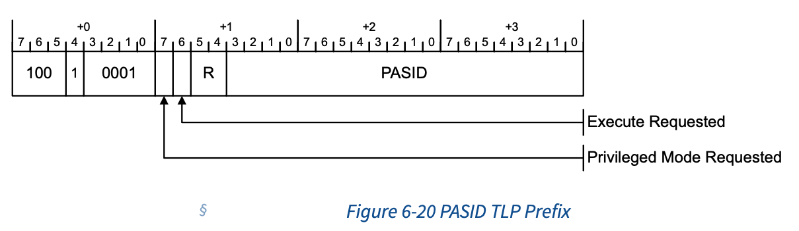
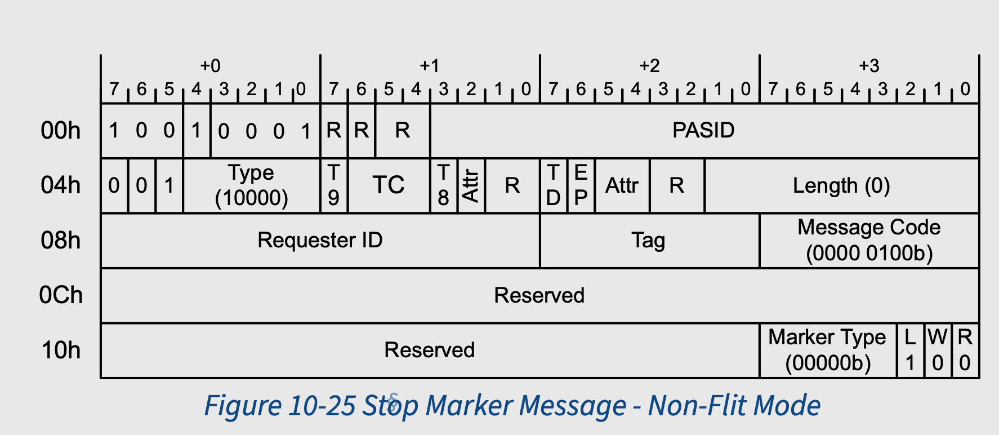

## PASID 简介

### PASID overflow

PASID 全称Process Address Space ID, PASID 同 requester ID结合，共同确定该request
所映射的地址空间。所以 PASID 和 ASID 类似, 均标识一个地址映射关系。但是ASID 用于
标识CPU 侧的memory request，而PASID 则标识PCIe end point 的DMA（还有其他request，
下面描述）. 


我们结合上图, 对比下两者:
||ASID|PASID|
|---|---|---|
|memory request 发起者|CPU|PCIe EP|
|通过该ID查阅对象|TLB|IOMMU DMA remapping table|
|作用|让TLB中可以缓存多个地址空间映射|让IOMMU 可以为一个function 的request 使用不同的地址空间|

每个 function 都有一组独特的 PASID 值。一个 function 使用的 PASID 值与任何其他
function 使用的 PASID 值无关


如上图所示 request1, request2, request3 来源于一个设备，Request ID相同.
但是request1 和request2/3 的PASID 不相同，所以该地址使用的 
`request address`->`phyiscal address` 的映射关系"数据库" 不同. 而request2，
request 3 PASID 也相同。其两者均使用同一套映射关系进行地址映射。

而request 4 和request 3 即使PASID 相同，但是该request来自于不同的function，
所以两者使用不同的映射关系进行映射。

**_总结_**

PASID 用来标识PCIe EP 发出的memory request, 当该request到达iommu时，IOMMU会
根据PASID查询该function并所属于该PASID的 remapping table, 最终得到访问的物理
地址.

***

上面我们提到，可以用PASID标识一个request，在PCIe协议中就是一个TLP，那么问题来了:
1. TLP的种类有那么多，PASID可以标记哪些request ?
2. 标记无非是在TLP中加字段，PASID在TLP中的哪个位置呢 ?

### PASID in PCIe
#### PASID request

PASID 可以作用与下面的request:
* Memory Requests(including AtomicOp Requests)

  with Address Type (AT) of Untranslated or Translated Request(个人认为还包括Translation
  Request)

* Address Translation Requests:
  + ATS Invalidation Request Messages
  + Page Request Messages
  + PRG Response Messages


#### PAISD Prefix



关于各个字段的解释，见PCIe 6.0 spec `6.20.2.1 PASID TLP Prefix - Non-Flit Mode`

接下来，我们来看下PASID的生命周期

## PASID drain

PASID 可以分配，释放，再分配。这里面比较关键的步骤是释放步骤，也就是将PASID
drain.

那释放一个PASID 有什么难点么?

难点就在于，在释放期间，如何彻底的clean/flush 掉 在PCIe 拓扑中的和该PASID 相关的
所有资源. 那PASID 的资源，可以在哪些地方呢?

我们以下图展示:


主要包括下面部分:
* IOMMU
  + IOTLB in IOMMU : IOMMU 保存该 pasid的iotlb
  + page request queue: page request queue中有该pasid相关的未处理的page request
* 链路上的各种request:
   + to upstream:
     * Memory Request 
     * Translation Request
     * Page Request
   + to downstream:
     * Memory Read Completion
     * Translation Completion (include translation fault)
     * Page Request Response
* Device 上 Pending 的 request
  + IOTLB in Device: 设备端保存的IOTLB
  + Memory Request: 设备还未发出的Memory Request
  + Page Request: 设备还未发出的Page Request

这里面比较重要的是各种request, 为什么这么说, 因为这些request 往往和其他组件有交
互, 举个例子:
1. 当device发出了 Translation Request
2. 当IOMMU处理后，可能会更新其本地的IOTLB（<font color=red><strong>存疑需确认</strong></font>). 
3. IOMMU 向 Device发出Translation Completion(当然有可能还是 表示 translation fault的消息). 
4. 设备更新本地IOTLB

如果我们非常武断的在步骤2后，发出PASID drain动作，并认为在步骤3执行之前，该动作
已经完成. 那么IOMMU 和 Device 中的IOTLB 将是stale的. 而随后如果software侧又分配
了该PASID，则可能使用stale IOTLB 酿成严重后果。

所以，我们需要一个规范，来规定，PASID drain 需要做什么动作，并且需要达到一个什么
样的状态可以认为PASID drain 动作完成. 对于设备/iommu 两个角色来说，谁在这个过程
中比较关键呢? 是设备，因为设备是这些request的发起者和接收者, 正说为做事有始有终,
最保险的方式是设备端将所有pending的request全部处理完, 再将PASID drain。

PCIe SPEC `6.20.1 Managing PASID Usage` 章节中描述了 设备应该做的事情, 原文如下:

* Stopped queuing new Requests for this PASID.
  > 不再发出新的request
* Completed all Non-Posted Requests associated with this PASID.
  > 等待所有 Non-Posted Request 完成
* Flushed to the host all Posted Requests addressing host memory in all TCs that
    were used by the PASID. The mechanism used for this is device specific (for
    example: a non-relaxed Posted Write to host memory or a processor read of
    the Function can flush TC0; a zero length read to host memory can flush
    non-zero TCs).
  > 确保所有到host memory 的 Posted Request 完成
* Optionally flushed all Peer-to-Peer Posted Requests to their destination(s).
    The mechanism used for this is device specific. 
  > 确保所有PTP Posted Request 完成
* Complied with additional rules described in Address Translation Services (§
    Chapter 10. ) if Address Translations or Page Requests were issued on the
    behalf of this PASID.
  > Page Requests 相关请求要服从 Chatper 10 描述的规则.

总结下上面的规则:
* new memory request: 不发
* 链路上的 memory request: flush or wait, 总之就是等其complete.
* Page Request: 额外的规则

Page Request 为什么如此特殊呢? 能不能按照上面的规则来？(no new and wait old
complete). 当然可以。但是可以做一些优化。

我们先展示下Page Request正常的处理流程，在展示在处理Page Request过程中如果触发
了PASID drain, 会有一些什么问题, 或者说可优化的点 ?
***

正常处理流程:


重点是步骤3和4, 当PCIe EP 发送 Page  Request Message 到IOMMU后，IOMMU会将该
Message 的信息存放到Page Request Queue中，并notify to host (deliver interrupt).
软件收到该notify后，会从Page Request Queue中获取Request，并建立IOVA->PA的映射。

而如果在这个过程中发生了PASID Drain 呢?


在步骤3后，发生PASID Drain(host software 发起), 此时如果PCIe EP一定要等Page
Request Response 的话，host software 就比较纠结，我是为其建立映射好，还是不建立
映射好，如果为其建立映射，在设备发出Stop Request Completion 后，还得把这些映射销
毁。如果不为其建立映射, 软件也不知道现在 PCIe EP是否正在执行 Stop Request(或者说
是否不再发出新的request), 所以为了保险起见，软件一般会正确处理该Page Request，为其
建立映射，在收到Stop Request Completion后，再销毁该映射。

所以这就导致了一些不必要的处理。

能不能有一些优化呢?

### PASID Drain with Page Request optimization

PCIe Spec `10.4.1.2 Managing PASID Usage on PRG Requests`, 描述了这一优化。

该章节起到了两种方式:

* 未优化:
  + * Stop queueing new Page Request Messages for this PASID.
    * Finish transmitting any multi-page Page Request Messages for this PASID 
      (i.e., send the Page Request Message with the L bit Set).
    * Wait for PRG Response Messages associated any outstanding Page Request
       Messages for the PASID.
    * Indicate that the PASID has stopped using a device specific mechanism. 
      This mechanism must indicate that a Stop Marker Message will not be 
      generated.
  + 这种就是典型的`no new and wait old completion`
* 优化(use Stop Marker Message):
  + * Stop queueing new Page Request Messages for this PASID.
    * Finish transmitting any multi-page Page Request Messages for this PASID
      (i.e., send the Page Request Message with the L bit Set).
    * (3)Internally mark all outstanding Page Request Messages for this PASID as
      stale. PRG Response Messages associated with these requests will return
      Page Request Allocation credits and PRG Index values but are otherwise
      ignored.
    * (4)Indicate that the PASID has stopped using a device specific mechanism.
      This mechanism must indicate that a Stop Marker Message will be generated.
    * (5)Send a Stop Marker Message to indicate to the host that all subsequent
      Page Request Messages for this PASID are for a new use of the PASID value.
  + 首先设备端首先支持去 Mark 那些标记该PASID的为complete 的 Page Request
    Message为stale. 如果收到标记的这些request的PRG Response Message, 仅获取PRG
    index value 并获取Page Request Allocation credits(<font color=red>待研究</font>)
    并不会根据该 Response Message 更新其IOTLB.

    然后，PCIe EP 就认为自己已经准备好drain 该PASID, 做了两件事情:
    1. stop message complete
    2. Send a Stop Marker Messages

    并且手册中提到, 这两个操作是无顺序的，可以并行.
    ```
    Note: Steps 4 and 5 may be performed in either order, or in parallel.
    ```
这里比较关键的是步骤3, 将外面的PRG Response Request标记为Stale之后, Software
就可以随意处理"Stale Page Request"（不为其建立映射了，随意回下就可以了). 但是
这里有一个问题:

host software 如何看到设备做完了第三步 ?

Stop Marker Message 可以用来指示, Stop Marker Message, 本身就是一个Page Request
只不过(L, W, R) 为(1, 0, 0), 该消息只是起到一个指示的作用, 无需 Response:



当 Software 在收到Stop Marker后, 认为该设备已经stopped pasid.

> NOTE
>
> 这里有一个疑问 ?
>
> 步骤5也可以指示设备是否完成stopped pasid, 为什么非得要另加一个Stop Marker
> Message的机制 ??

> WARN
>
> 以上内容，都是自己的理解，如有错误或者其他的想法，欢迎评论一起讨论

### TODO
+ ATS
+ Page Request
  + credits ??
+ VT-d SMS
+ Kernel Handle

## 参考链接
1. PCIe 6.0 6.20 PASID
