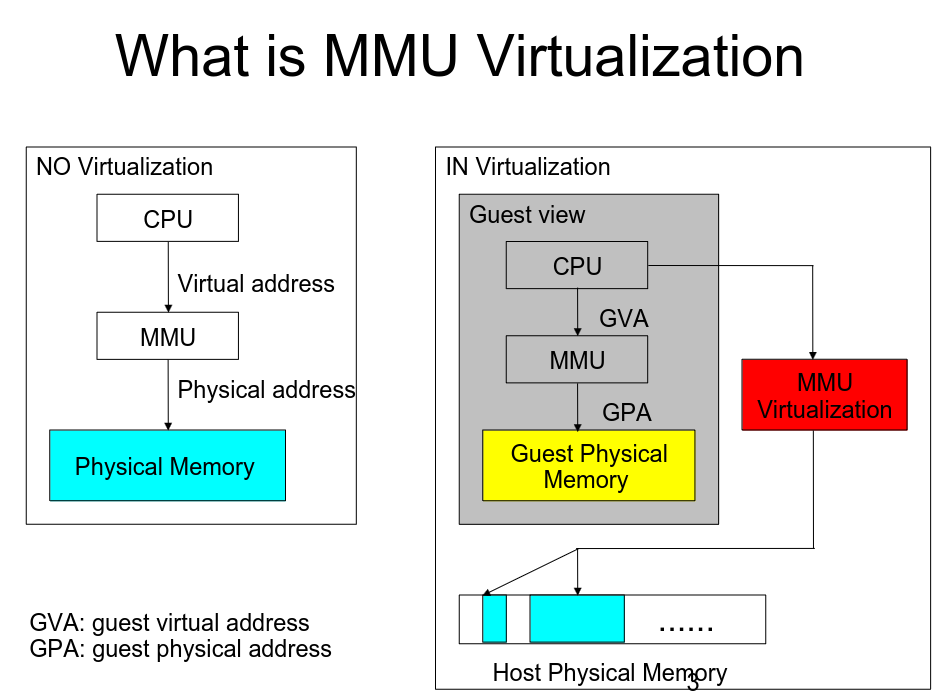
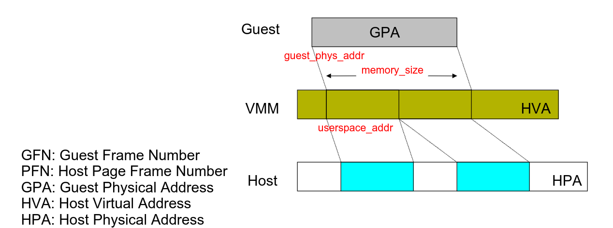

## what is MMU virtualization



在NO virtualization的情况下, CPU 如果要进行访存(开启分页), 需要通过
硬件mmu, 将 VA 转化为PA. 然后再对该内存进行读写操作.

但是在虚拟机中, 在GUEST 视角下, 其访存行为应该和NO virtualization场景
一致, I.E, 都是由"MMU" 将GVA 通过自己定义的pgtable 转化为GPA. 但是在
KVM下, KVM为guest分配其内存 -- HPA, 而这些HPA 应该尽量是自由的. 所以,
需要GPA和HPA之间存在一定的映射关系.

> 一般情况下, 会将
> * guest视角的 VA, PA 称为 GVA, GPA.
> * host 视角的 VA, PA 称为 HVA, HPA
{: .prompt-info}

而`mmu virtualization` 就是完成上述工作. 但是光有映射关系不行, GUEST还有
其他需求:

### GUEST需求

很简单, 和硬件MMU行为越像越好, 硬件MMU的工作比较抽象, 我们有一个更具体的实
体可以参考 MMU 应该关心哪些内容, 那就是**`TLB`**. TLB 有啥呢?

* VA->PA mapping relations
* access right flag
  + R/W 
  + U/S
* A/D flag (access dirty)

要想模拟的像, 就要保证在GUEST在访问GVA时, 上面的这些信息在GUEST看起来是对的.

举个例子来说, 如果GUEST做了如下动作:
```
1. clear dirty flag of PTE_a
2. write access a page that PTE_a point(though PTE_a pgtable entry)
```

如果guest 再次读取PTE_a, 其dirty flag一定是置位的.
> NOTE
>
> 不考虑stale tlb的情况
{: .prompt-info}

### VMM 各个组建协作

我们以QEMU, KVM为例, QEMU负责规划整个硬件模型, 并且控制各个资源规划,而KVM 则是
分配维护某些资源, 其中就包括内存.

内存方面, QEMU负责规划物理内存的布局(physical address space), 所以其知道那些
physical address space 是映射到memory. 但是这些内存的分配和维护是KVM去做, 所以
需要定义一个interface, 来让QEMU将内存信息传递到KVM.

该接口有两个版本:
* ioctl(KVM_SET_MEMORY_REGION, struct kvm_memory_region) -- 被弃用

  <details markdown=1 open>
  <summary>struct kvm_memory_region</summary>

  ```cpp
  /* for KVM_CREATE_MEMORY_REGION */
  struct kvm_memory_region {
          __u32 slot;
          __u32 flags;
          __u64 guest_phys_addr;
          __u64 memory_size; /* bytes */
  };
  ```
  </details>
* ioctl(KVM_SET_USER_MEMORY_REGION, struct kvm_userspace_memory_region)

  <details markdown=1 open>
  <summary>struct kvm_userspace_memory_region</summary>

  ```cpp
  /* for KVM_SET_USER_MEMORY_REGION */
  struct kvm_userspace_memory_region {
          __u32 slot;
          __u32 flags;
          __u64 guest_phys_addr;
          __u64 memory_size; /* bytes */
          __u64 userspace_addr; /* start of the userspace allocated memory */
  };
  ```
  </details>

该接口作用是:

QEMU 定义了一些物理内存空间, 有一些物理地址空间是memory, 需要KVM 管理.

`kvm_userspace_memory_region`和`kvm_memory_region`不同的是, `kvm_userspace_memory_region`
多了一个成员:`userspace_addr`, 该成员表示是QEMU VA, 这也就是说明, GUEST内存, 是
QEMU 进程虚拟内存空间的一部分, 这样做的好处是, 可以内存管理的其他组建可以管理
到guest memory, 例如 thp, ksm, vmscan等

那么在该接口下, GPA 不仅和HPA有映射关系, GPA和 HVA(qemu VA) 也有了映射关系. 如下图:



KVM需要建立, 维护上述关系.

> 这里我们这样去想:
>
> 在no-virtualization的场景下, 应用程序所期望的是: 对某个phyiscal address 做操作, 就是对
> 内存条上的存储单元做操作. 而在虚拟化场景下, 不能让GUEST直接操作真正的内存条, KVM的做法是,
> 虚拟出一个内存条, 其存储单元所对应的物理地址称为 GPA, 然后让虚拟内存条上的地址(GPA)和真
> 正的内存条的地址(HPA)有一定的映射关系, 这个由KVM 负责维护. GUEST 访问GPA, 最终通过该映射关系,
> 最终访问到根据KVM 所建立映射关系的HPA
>
> 而HVA和HPA其实就是对 QEMU/KVM 本身而言, 关于这部分HPA该怎么管理的问题. 如果没有HVA->HPA的映射,
> KVM mmu virtualization 也能实现(并且第一版patch就是这么实现的-- 上面列出的第一版接口), 无非
> 就是分配的这些page只能作为一些special page被管理. 而有后者则是当作QEMU anonymous page 被管理.
{: .prompt-tip}

## SOFT MMU && Hard MMU

KVM mmu virtualization 有两种实现方式, 早期的CPU 不支持 EPT, KVM 通过纯软件的方式实现.
称为 shadow page table(影子页表), 而后续的CPU 支持了EPT, KVM 则实现了利用硬件辅助的方式

关于两种实现, 我们在

* [soft mmu virtualization][software_mmu_virt]
* [hard mmu virtualization][hardware_mmu_virt]

中讲述.

## 参考链接



[xiaoguangrong KVM MMU virtualization PPT 1][KVM_MMU_Virtualization_xiaoguangrong1]

[xiaoguangrong KVM MMU virtualization PPT 2][KVM_MMU_Virtualization_xiaoguangrong2]

