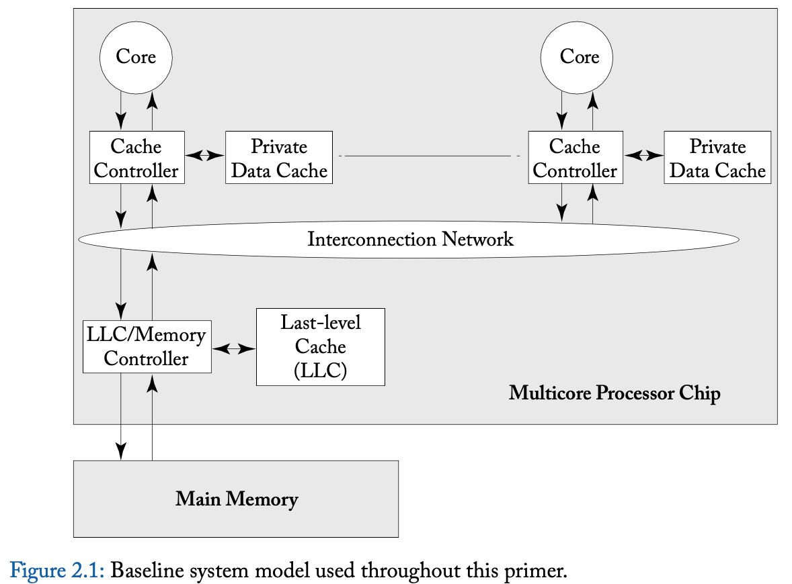
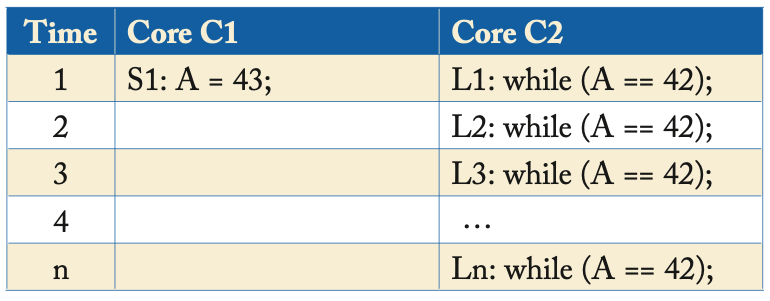
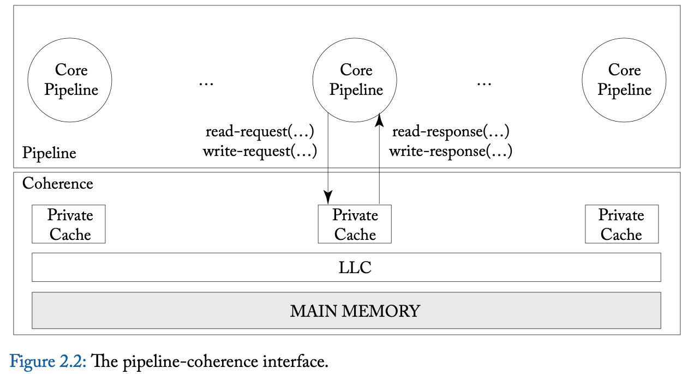

In this chapter, we introduce enough about cache coherence to understand how
consistency models interact with caches. We start in Section 2.1 by presenting
the system model that we consider throughout this primer. To simplify the
exposition in this chapter and the follow- ing chapters, we select the simplest
possible system model that is sufficient for illustrating the important issues;
we defer until Chapter 9 issues related to more complicated system models.
Section 2.2 explains the cache coherence problem that must be solved and how
the possibility of incoherence arises. Section 2.3 precisely defines cache
coherence.

> 在本章中，我们介绍了足够的cache coherence相关内容，以理解consistency模型如
> 何与缓存交互。
>
> + 我们在Section 2.1中开始介绍我们在整个入门教材中考虑的系统模型。
>   为了简化本章及后续章节的阐述，我们选择了一个足够简单的系统模型来说明
>   重要问题；与更复杂系统模型相关的问题将推迟到Chapter 9讨论。
> + Section 2.2解释了必须解决的cache coherence问题以及不一致性可能出现的原因。
> + Section 2.3精确地定义了cache coherence。

## 2.1 BASELINE SYSTEM MODEL

In this primer, we consider systems with multiple processor cores that share
memory. That is, all cores can perform loads and stores to all (physical)
addresses. The baseline system model includes a single multicore processor chip
and off-chip main memory, as illustrated in Figure 2.1. The multicore processor
chip consists of multiple single-threaded cores, each of which has its own
private data cache, and a last-level cache (LLC) that is shared by all cores.
Throughout this primer, when we use the term “cache,” we are referring to a
core’s private data cache and not the LLC. Each core’s data cache is accessed
with physical addresses and is write-back. The cores and the LLC communicate
with each other over an interconnection network. The LLC, despite being on the
processor chip, is logically a “memory-side cache” and thus does not introduce
another level of coherence issues. The LLC is logically just in front of the
memory and serves to reduce the average latency of memory accesses and increase
the memory’s effective bandwidth. The LLC also serves as an on-chip memory
controller.

> 在本入门教材中，我们考虑具有多个处理器核心共享内存的系统。也就是说，所有核心都
> 可以对所有（物理）地址进行加载和存储。基础系统模型包括一个多核处理器芯片和芯片
> 外的主存，如图2.1所示。多核处理器芯片由多个单线程核心组成，每个核心都有自己的
> 私有数据缓存，以及一个由所有核心共享的最后一级缓存（LLC）。在整个入门教材中，
> 当我们使用“缓存”这个术语时，我们指的是核心的私有数据缓存，而不是LLC。每个核心
> 的数据缓存通过物理地址访问，并采用写回（write-back）机制。核心和LLC通过互连网
> 络进行通信。尽管LLC位于处理器芯片上，但在逻辑上它是一个“内存侧缓存”，因此不会
> 引入另一级的coherence问题。LLC在逻辑上位于内存前面，旨在减少内存访问的平均延迟
> 并增加内存的有效带宽。LLC还充当片上内存控制器。

This baseline system model omits many features that are common but that are not
required for purposes of most of this primer. These features include
instruction caches, multiple-level caches, caches shared among multiple cores,
virtually addressed caches, TLBs, and coherent di- rect memory access (DMA).
The baseline system model also omits the possibility of multiple multicore
chips. We will discuss all of these features later, but for now, they would add
unnec- essary complexity.

> 该基础系统模型省略了许多常见但对于本入门教材的大部分内容来说并不必要的特性。这
> 些特性包括指令缓存、多级缓存、多个核心共享的缓存、虚拟地址缓存、TLB（转换后备
> 缓冲区）以及一致性直接内存访问（DMA）。基础系统模型也不考虑多个多核芯片的可能
> 性。我们将在后面讨论所有这些特性，但目前它们会增加不必要的复杂性。



## 2.2 THE PROBLEM: HOW INCOHERENCE COULD POSSIBLY OCCUR

The possibility of incoherence arises only because of one fundamental issue:
there exist multiple actors with access to caches and memory. In modern
systems, these actors are processor cores, DMA engines, and external devices
that can read and/or write to caches and memory. In the rest of this primer, we
generally focus on actors that are cores, but it is worth keeping in mind that
other actors may exist.
> ```
> fundamental: 基本的，根本的
> ```
> 不一致性问题的可能性仅仅源于一个根本性问题：存在多个访问缓存和内存的主体。在现
> 代系统中，这些主体包括处理器核心、DMA引擎以及可以读写缓存和内存的外部设备。在
> 本入门教材的其余部分中，我们通常关注作为主体的核心，但值得记住的是，其他主体也
> 可能存在。

Table 2.1 illustrates a simple example of incoherence. Initially, memory
location A has the value 42 in memory as well as both of the cores’ local
caches. At time 1, Core 1 changes the value at memory location A from 42 to 43
in its cache, making Core 2’s value of A in its cache stale. Core 2 executes a
while loop loading, repeatedly, the (stale) value of A from its local cache.
Clearly, this is an example of incoherence as the store from Core 1 has not not
been made visible to Core 2 and consequently C2 is stuck in the while loop.

> 表2.1展示了一个不一致性的简单例子。最初，内存位置A在内存中以及两个核心的本地缓
> 存中都有值42。在时间点1，核心1将其缓存中内存位置A的值从42更改为43，使得核心2缓
> 存中的A值变得过时。核心2执行一个while循环，不断从其本地缓存中加载（过时的）A值。
> 显然，这是不一致性的一个例子，因为核心1的存储操作没有对核心2可见，导致核心2陷
> 入while循环中。

To prevent incoherence, the system must implement a cache coherence protocol
that makes the store from Core 1 visible to Core 2. The design and
implementation of these cache coherence protocols are the main topics of
Chapters 6–9.

> 为了防止不一致性，系统必须实现一个缓存一致性协议，使核心1的存储操作对核心2可见。
> 这些缓存一致性协议的设计和实现是第6至第9章的主要内容。

Table 2.1: Example of incoherence. Assume the value of memory at memory
location A is ini- tially 42 and cached in the local caches of both cores.

> 表2.1：不一致性的例子。假设内存位置A的值最初为42，并被缓存到两个核心的本地缓存
> 中。



## 2.3 THE CACHE COHERENCE INTERFACE

Informally, a coherence protocol must ensure that writes are made visible to
all processors. In this section, we will more formally understand coherence
protocols through the abstract interfaces they expose.

> ```
> Informally : 非正式的
> formally : 正式的
> ```
> 非正式地说，缓存一致性协议必须确保写操作对所有处理器可见。在本节中，我们将通过
> 它们所暴露的抽象接口更正式地理解一致性协议。

The processor cores interact with the coherence protocol through a coherence
interface (Figure 2.2) that provides two methods: (1) a read-request method that
takes in a memory location as the parameter and returns a value; and (2) a
write-request method that takes in a memory location and a value (to be written)
as parameters and returns an acknowledgment.

> 处理器核心通过一个一致性接口与一致性协议进行交互（如图2.2所示），该接口提供了
> 两种方法：
>
> （1）读取请求方法，该方法将内存位置作为参数并返回一个值；
>
> （2）写入请求方法，该方法将内存位置和一个要写入的值作为参数，并返回一个确认信
>      息。

There are many coherence protocols that have appeared in the literature and been
employed in real processors. We classify these protocols into two categories
based on the nature of their coherence interfaces—specifically, based on whether
there is a clean separation of coherence from the consistency model or whether
they are indivisible.

> 在文献中出现并在实际处理器中使用的coherence协议有很多。我们根据其coherence接口
> 的性质将这些协议分为两类——具体来说，是基于coherence与consistency模型之间是否存
> 在明确的分离，或者它们是否是不可分割的。 

**Consistency-agnostic coherence**. In the first category, a write is made
visible to all other cores before returning. Because writes are propagated
synchronously, the first category presents an interface that is identical to
that of an atomic memory system (with no caches). Thus, any subsystem that
interacts with the coherence protocol—e.g., the processor core pipeline—can as-
sume it is interacting with an atomic memory system with no caches present. From
a consis- tency enforcement perspective, this coherence interface enables a nice
separation of concerns. The cache coherence protocol abstracts away the caches
completely and presents an illusion of atomic memory—it is as if the caches are
removed and only the memory is contained within the coherence box (Figure 2.2)—
while the processor core pipeline enforces the orderings mandated by the
consistency model specification.

> ```
> agnostic : 通常指的是对某个特定的细节或差异不关心或不依赖
> consistency-agnostic coherence: 可以翻译为“与consistency无关的coherence”。这意
> 味着这种coherence协议的设计和实现不依赖于特定的consistency模型，它们可以与多种
> consistency模型一起工作，而无需对这些模型的细节进行特殊处理。
> ```
>
> **Consistency-agnostic coherence**。在第一类中，一次写操作在返回之前对所有其他核心
> 可见。由于写操作是同步传播的，第一类提供的接口与atomic内存系统（没有缓存）相同。
> 因此，任何与coherence协议交互的子系统，例如处理器核心流水线，都可以假设它正在
> 与一个没有缓存的原子内存系统交互。从consistency执行的角度来看，这种coherence接
> 口实现了关注点的良好分离。缓存一致性协议完全抽象掉了缓存，并呈现出原子内存的假
> 象——就好像缓存被移除，只剩下内存包含在coherence框中（如图2.2所示）——而处理器核
> 心流水线则执行consistency模型规范所要求的顺序。

**Consistency-directed coherence**. In the second, more-recent category, writes
are propagated asynchronously—a write can thus return before it has been made
visible to all processors, thus allowing for stale values (in real time) to be
observed. However, in order to correctly enforce consistency, coherence
protocols in this class must ensure that the order in which writes are
eventually made visible adheres to the ordering rules mandated by the
consistency model. Referring back to Figure 2.2, both the pipeline and the
coherence protocol enforce the orderings mandated by the consistency model. This
second category emerged to support throughput-based general-purpose graphics
processing units (GP-GPUs) and gained prominence after the publication of the
first edition of this primer.1

> **Consistency-directed coherence**。在第二类较新的范畴中，写操作是异步传播的——
> 因此，写操作可以在尚未对所有处理器可见之前返回，这样就可能观察到过时的值（在实
> 际时间上）。然而，为了正确执行一致性，这一类的coherence协议必须确保写操作最终
> 可见的顺序符合一致性模型所要求的顺序规则。回到图2.2，流水线和coherence协议都执
> 行了一致性模型规定的顺序。这第二类的出现是为了支持基于吞吐量的通用图形处理单元
> （GP-GPUs），并在本指南的第一版出版后获得了显著发展。



The primer (and the rest of the chapter) focuses on the first class of coherence
protocols. We discuss the second class of coherence protocols in the context of
heterogeneous coherence (Chapter 10).

> 本指南（以及本章的其余部分）主要关注第一类coherence协议。我们将在异构coherence
> 的背景下（第10章）讨论第二类coherence协议。

## 2.4 (CONSISTENCY-AGNOSTIC) COHERENCE INVARIANTS

What invariants must a coherence protocol satisfy to make the caches invisible
and present an abstraction of an atomic memory system?

> 为了使缓存不可见并呈现原子内存系统的抽象，coherence协议必须满足哪些不变性？

There are several definitions of coherence that have appeared in textbooks and
in published papers, and we do not wish to present all of them. Instead, we
present the definition we prefer for its insight into the design of coherence
protocols. In the sidebar, we discuss alternative definitions and how they
relate to our preferred definition.

> 在教科书和已发表的论文中出现了几种coherence的定义，我们不打算全部展示，而是介
> 绍我们 prefer definition，因为它为coherence协议的设计提供了深刻的见解。在侧边
> 栏中，我们讨论了其他定义以及它们与我们perfer definition 之间的关系。

We define coherence through the single-writer–multiple-reader (SWMR) invariant.
For any given memory location, at any given moment in time, there is either a
single core that may write it (and that may also read it) or some number of
cores that may read it. Thus, there is never a time when a given memory location
may be written by one core and simultaneously either read or written by any
other cores. Another way to view this definition is to consider, for each memory
location, that the memory location’s lifetime is divided up into epochs. In each
epoch, either a single core has read-write access or some number of cores
(possibly zero) have read-only access. Figure 2.3 illustrates the lifetime of an
example memory location, divided into four epochs that maintain the SWMR
invariant.

> 我们通过单一写入者–多重读取者（SWMR）不变性来定义coherence。对于任何给定的内存
> 位置，在任何给定的时刻，要么是由一个核心可以写入（也可以读取），要么是由若干核
> 心可以读取。因此，永远不会出现一个内存位置可以被一个核心写入的同时，也被其他任
> 何核心读取或写入的情况。另一种看待这个定义的方法是考虑，对于每个内存位置，其生
> 命周期被划分为多个时期。在每个时期中，要么是一个核心具有读写访问权限，要么是若
> 干核心（可能为零）具有只读访问权限。图2.3展示了一个示例内存位置的生命周期，分
> 为四个保持SWMR不变性的时期。


In addition to the SWMR invariant, coherence requires that the value of a given
memory location is propagated correctly. To explain why values matter, let us
reconsider the example in Figure 2.3. Even though the SWMR invariant holds, if
during the first read-only epoch Cores 2 and 5 can read different values, then
the system is not coherent. Similarly, the system is incoherent if Core 1 fails
to read the last value written by Core 3 during its read-write epoch or any of
Cores 1, 2, or 3 fail to read the last write performed by Core 1 during its
read-write epoch.

> 除了SWMR不变性之外，coherence还要求给定内存位置的值被正确传播。为了说明为什么
> 值很重要，让我们重新考虑图2.3中的例子。即使SWMR不变性成立，如果在第一个只读时
> 期内，核心2和核心5读取到了不同的值，那么系统就不是一致的。同样地，如果在其读写
> 时期内，核心1未能读取到核心3最后写入的值，或者核心1、2或3中的任何一个未能读取
> 到核心1在其读写时期内执行的最后一次写入，那么系统也是不一致的。

Thus, the definition of coherence must augment the SWMR invariant with a data
value invariant that pertains to how values are propagated from one epoch to
the next. This invariant states that the value of a memory location at the
start of an epoch is the same as the value of the memory location at the end of
its last read-write epoch.

> 因此，coherence的定义必须在SWMR不变性的基础上增加一个数据值不变性，该不变性涉
> 及值如何从一个时期传播到下一个时期。这个不变性表明，一个时期开始时的内存位置的
> 值与其上一个读写时期结束时的内存位置的值相同。

There are other interpretations of these invariants that are equivalent. One
notable ex- ample [5] interpreted the SMWR invariants in terms of tokens. The
invariants are as follows. For each memory location, there exists a fixed
number of tokens that is at least as large as the number of cores. If a core
has all of the tokens, it may write the memory location. If a core has one or
more tokens, it may read the memory location. At any given time, it is thus
impossible for one core to be writing the memory location while any other core
is reading or writing it.

> 这些不变性还有其他等价的解释。其中一个显著的例子 [5] 是用令牌来解释SMWR不变性。
> 这些不变性如下所述：对于每个内存位置，存在一个固定数量的令牌，至少与核心的数量
> 一样多。如果一个核心拥有所有的令牌，它可以写入该内存位置。如果一个核心拥有一个
> 或多个令牌，它可以读取该内存位置。因此，在任何给定时间，不可能出现一个核心正在
> 写入内存位置的同时，任何其他核心正在读取或写入它的情况。

> Coherence invariants
>
> 1. Single-Writer, Multiple-Read (SWMR) Invariant. For any memory location A,
>    at any given time, there exists only a single core that may write to A (and
>    can also read it) or some number of cores that may only read A.
>
>>    单一写入者、多重读取者（SWMR）不变量。对于任何内存位置A，在任何给定的时刻，
>>    只存在一个核心可以写入A（并且也可以读取它），或者有若干核心只能读取A。

> 2. Data-Value Invariant. The value of the memory location at the start of an
>    epoch is the same as the value of the memory location at the end of the its
>    last read-write epoch.
>
>    > 数据值不变量。一个时期开始时的内存位置的值与其上一个读写时期结束时的内存位置
>    > 的值相同。

### 2.4.1 MAINTAINING THE COHERENCE INVARIANTS

The coherence invariants presented in the previous section provide some
intuition into how coherence protocols work. The vast majority of coherence
protocols, called “invalidate protocols,” are designed explicitly to maintain
these invariants. If a core wants to read a memory location, it sends messages
to the other cores to obtain the current value of the memory location and to
ensure that no other cores have cached copies of the memory location in a
read-write state. These messages end any active read-write epoch and begin a
read-only epoch. If a core wants to write to a memory location, it sends
messages to the other cores to obtain the current value of the memory location,
if it does not already have a valid read-only cached copy, and to ensure that
no other cores have cached copies of the memory location in either read-only or
read-write states. These messages end any active read-write or read-only epoch
and begin a new read-write epoch. This primer’s chapters on cache coherence
(Chapters 6–9) expand greatly upon this abstract description of invalidate
protocols, but the basic intuition remains the same.

> ```
> intuition: 直觉, 直观理解, 在技术上下文中，它可以表示对某个概念或机制的基本理
>            解或感知。
> ```
>
> 前一节中介绍的 coherence invariants 提供了一些关于一致性协议如何工作的
> intuition。绝大多数的一致性协议，称为“无效化协议”，其设计明确旨在维护这些
> invariants。如果一个核心想要读取一个内存位置，它会向其他核心发送消息，以获取该
> 内存位置的当前值，并确保没有其他核心在读写状态下缓存了该内存位置的副本。这些消
> 息结束了任何活跃的读写时期，并开始一个只读时期。如果一个核心想要写入一个内存位
> 置，它会向其他核心发送消息，以获取该内存位置的当前值（如果它尚未拥有有效的只读
> 缓存副本），并确保没有其他核心在只读或读写状态下缓存了该内存位置的副本。这些消
> 息结束了任何活跃的读写或只读时期，并开始一个新的读写时期。本教程中关于缓存一致
> 性的章节（第6至9章）将大大扩展对无效化协议的这一抽象描述，但基本的intuition保
> 持不变。


### 2.4.2 THE GRANULARITY OF COHERENCE

A core can perform loads and stores at various granularities, often ranging
from 1–64 bytes. In theory, coherence could be performed at the finest
load/store granularity. However, in practice, coherence is usually maintained
at the granularity of cache blocks. That is, the hardware enforces coherence on
a cache block by cache block basis. In practice, the SWMR invariant is likely
to be that, for any block of memory, there is either a single writer or some
number of readers. In typical systems, it is not possible for one core to be
writing to the first byte of a block while another core is writing to another
byte within that block. Although cache-block granularity is common, and it is
what we assume throughout the rest of this primer, one should be aware that
there have been protocols that have maintained coherence at finer and coarser
granularities.

> 一个核心可以在不同的粒度上执行加载和存储操作，通常范围从1到64字节。理论上，缓
> 存一致性可以在最细的加载/存储粒度上进行。然而，在实践中，缓存一致性通常是在缓
> 存块的粒度上维护的。也就是说，硬件在每个缓存块的基础上强制执行一致性。在实践中，
> SWMR invariant 很可能是，对于任何内存块，要么有一个单一的写入者，要么有若干个
> 读取者。在典型系统中，一个核心不可能在写入一个块的第一个字节的同时，另一个核心
> 在该块内的另一个字节进行写入。虽然缓存块粒度很常见，并且这是我们在本教程其余部
> 分中假设的粒度，但需要注意的是，也存在在更细和更粗粒度上维护一致性的协议。
