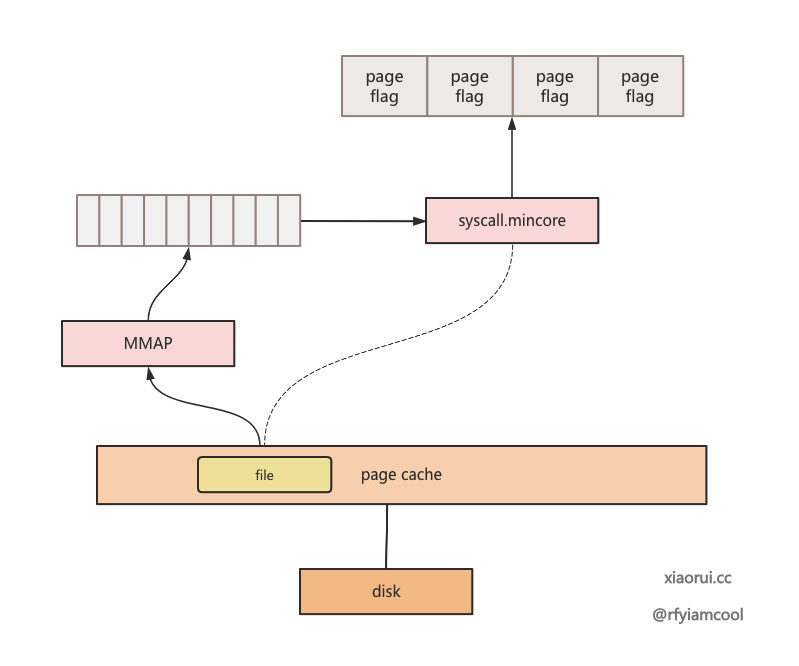
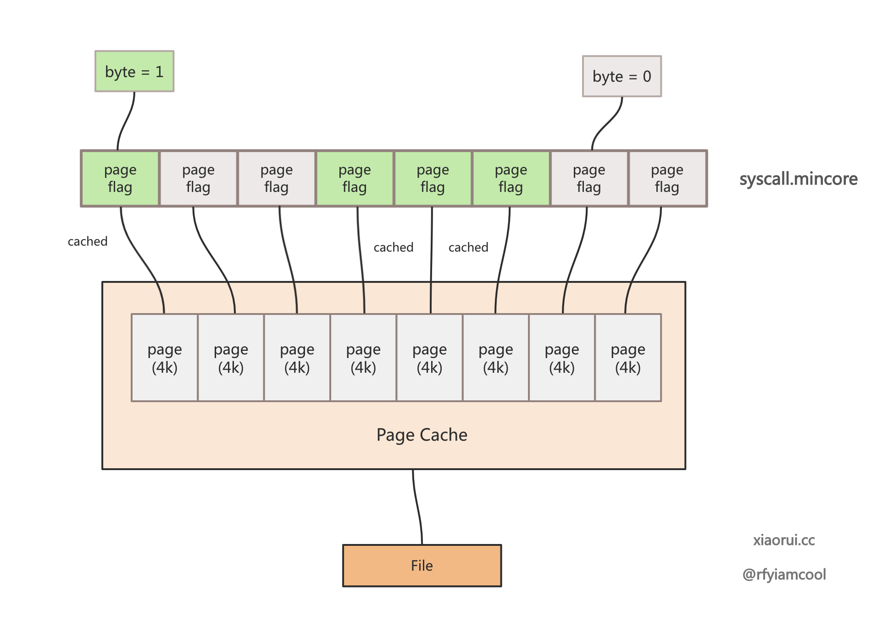

## 简介

pgcacher可以用来获取当前系统中pagecache相关信息。pgclear打印的信息
格式大致如下:
```
# sudo pgcacher -pid=933 -worker=5  -limit 2
+---------------------------------+----------------+-------------+----------------+-------------+---------+
| Name                            | Size           │ Pages       │ Cached Size    │ Cached Pages│ Percent │
|---------------------------------+----------------+-------------+----------------+-------------+---------|
| /usr/lib64/libc.so.6            | 2.131M         | 546         | 2.131M         | 546         | 100.000 |
| /usr/lib64/libsystemd.so.0.36.0 | 939.391K       | 235         | 939.391K       | 235         | 100.000 |
|---------------------------------+----------------+-------------+----------------+-------------+---------|
│ Sum                             │ 3.048M         │ 781         │ 3.048M         │ 781         │ 100.000 │
+---------------------------------+----------------+-------------+----------------+-------------+---------+
```

* name: 文件名称
* size: 文件大小
* page
* cached size: pagecache 占用的大小
* cached pages: pagecache 占用的 page 数量
* percent: cached size / size

pgcacher大致的原理:

从系统中的`/proc/{pid}/maps`和`/proc/{pid}/fd`获取进程所使用的文件
路径, 然后将文件mmap到当前进程，通过`syscall.mincore`获取该文件
block在内存中有pagecache。




> 这里面只画了mmap一条线，没有画FD的，不知道是作者漏画了，还是别有
> 深意
{: .prompt-tip}

下面是`syscall.mincore`的原理图，我们再另一篇文章中展示



## 常用命令
1. 查看某个进程 pgcache 占用情况
   ```sh
   wang@fedora ~ sudo pgcacher -pid=1 -worker 5 -limit 3
   2024/10/10 13:03:02 skipping "/sys/fs/cgroup": file is a directory
   +-------------------------------------------------------+----------------+-------------+----------------+-------------+---------+
   | Name                                                  | Size           │ Pages       │ Cached Size    │ Cached Pages│ Percent │
   |-------------------------------------------------------+----------------+-------------+----------------+-------------+---------|
   | /usr/lib64/libcrypto.so.3.0.9                         | 4.237M         | 1085        | 4.237M         | 1085        | 100.000 |
   | /usr/lib64/systemd/libsystemd-shared-253.12-1.fc38.so | 3.651M         | 935         | 3.651M         | 935         | 100.000 |
   | /usr/lib64/libc.so.6                                  | 2.131M         | 546         | 2.131M         | 546         | 100.000 |
   |-------------------------------------------------------+----------------+-------------+----------------+-------------+---------|
   │ Sum                                                   │ 10.019M        │ 2566        │ 10.019M        │ 2566        │ 100.000 │
   +-------------------------------------------------------+----------------+-------------+----------------+-------------+---------+
   ```
   + pid: 指定进程号
   + worker: 指定多线程数量，加快处理速度
   + limit: 限制打印条目
2. 查看某些文件的pgcache占用
   ```sh
    wang@fedora  ~/workspace/vm/centos-qcow2  pgcacher cgdb.sh test.sh dange.xml
   +-----------+----------------+-------------+----------------+-------------+---------+
   | Name      | Size           │ Pages       │ Cached Size    │ Cached Pages│ Percent │
   |-----------+----------------+-------------+----------------+-------------+---------|
   | test.sh   | 4.166K         | 2           | 4.166K         | 2           | 100.000 |
   | cgdb.sh   | 1.471K         | 1           | 1.471K         | 1           | 100.000 |
   | dange.xml | 6.869K         | 2           | 0B             | 0           | 0.000   |
   |-----------+----------------+-------------+----------------+-------------+---------|
   │ Sum       │ 12.506K        │ 5           │ 5.637K         │ 3           │ 60.000  │
   +-----------+----------------+-------------+----------------+-------------+---------+
   ```

   本次测试，只cat了`test.sh`, `cgdb.sh` 没有cat `dange.xml`

3. 查看某个目录的文件pgcache占用（递归）
   ```sh
    wang@fedora  ~  pgcacher --depth 4 a
   +-----------+----------------+-------------+----------------+-------------+---------+
   | Name      | Size           │ Pages       │ Cached Size    │ Cached Pages│ Percent │
   |-----------+----------------+-------------+----------------+-------------+---------|
   | a/b/a.md  | 16B            | 1           | 16B            | 1           | 100.000 |
   | a/b/a.txt | 69B            | 1           | 0B             | 0           | 0.000   |
   |-----------+----------------+-------------+----------------+-------------+---------|
   │ Sum       │ 85B            │ 2           │ 16B            │ 1           │ 50.000  │
   +-----------+----------------+-------------+----------------+-------------+---------+
   ```
4. 查看系统中所有进程占用的 pgcache 情况
   ```sh
    wang@fedora  ~  pgcacher -top -limit 3;
   +--------------------------------+----------------+-------------+----------------+-------------+---------+
   | Name                           | Size           │ Pages       │ Cached Size    │ Cached Pages│ Percent │
   |--------------------------------+----------------+-------------+----------------+-------------+---------|
   | /usr/lib/locale/locale-archive | 213.972M       | 54777       | 213.972M       | 54777       | 100.000 |
   | /usr/lib64/firefox/libxul.so   | 125.989M       | 32254       | 125.989M       | 32254       | 100.000 |
   | /usr/lib64/libLLVM-16.so       | 117.789M       | 30154       | 117.789M       | 30154       | 100.000 |
   |--------------------------------+----------------+-------------+----------------+-------------+---------|
   │ Sum                            │ 457.750M       │ 117185      │ 457.750M       │ 117185      │ 100.000 │
   +--------------------------------+----------------+-------------+----------------+-------------+---------+
   ```

   > 该命令只能查询当前系统中，进程打开的文件，以及mmap的文件占用。并不是系统中
   > 所有文件的pgcache占用统计
   > ```
   > -top: scan the open files of all processes, show the top few files that 
   > occupy the most memory space in the page cache, default: false
   > ```
   {: .prompt-info}

## pgcacher 执行流程

`pgcacher`流程主要分为以下几个步骤

1. 汇总所有要统计的文件
2. 对这些文件进行`mmap`, 然后调用`mincore`, 获取该文件在内存中的有哪些block申请了`pgcache`
3. 统计打印

我们先看下如何汇总所有要统计的文件

### 汇总所有统计的文件

主要分为种方式:

1. 从进程角度出发, 统计某个或者某些进程使用的文件, 而从进程角度出发主要又分两种方式:
   * **-pid** : 统计某个进程
   * **-top**: 统计所有进程
2. 从文件系统角度出发, 统计某些文件，或者某个目录下的所有文件

#### 从进程角度出发

该方式主要分为两种, `-pid`获取某一个进程。`-top`获取所有进程，
我们分别来看下: 

* **-pid**
  ```sh
  main
    => pg.appendProcessFiles(pid)
       => pg.getProcessFiles(pid)
         => pg.getProcessFdFiles(pid)
            => loop /proc/${pid}/fd       # 获取所有打开fd的 文件路径
         => pg.getProcessMaps(pid)        # 获取mmap 的文件路径
            => loop /proc/${pid}/maps
         =>  AREADY GET THIS PROCESS ALL FILEs
    => pg.getPageCacheStats()             # 获取 files pagecache 情况
    => pg.output()                        # 以一定格式输出
  ```
* **-top**
  ```sh
  main
     => pg.handleTop()
        => psutils.Processes()
           => processes()      # return all process
        => loop all process
           => pg.getProcessFiles(process.Pid())
        => pg.getPageCacheStats()
        => pg.output()
  ```

两者流程差不多，`-top`就是先获取所有进程，然后收集每个进程使用的文件

#### 从文件角度出发

从文件角度出发，这个比较简单，从文件系统tree，或者参数中的文件列表就可以
只要所需要统计的文件的路径，流程不再展开

### 统计文件的pgcache占用情况

该流程主要在`pg.getPageCacheStats()`流程
```sh
pg.getPageCacheStats()
  => pcstats.GetPcStatus()
     => GetFileMincore()
        => unix.Mmap()               # 先mmap文件，目的是为了下面调用sys_mincore
        => unix.Syscall(unix.SYS_MINCORE, ...) # 调用mincore
  # 根据mincore的返回，获取各种
  => Get Cached
  => Get Pages
  => Get Uncached
  => Calculate Percent
```

该流程也比较简单，对文件依次，进行`sys_mmap()`, 然后对`mmap()`的地址空间
做`sys_mincore()`, 查看这些地址所在的page, 是否存在其pgcache

> 虽然此时 VA->PA 没有建立起映射， 但是`sys_mincore`流程，仍然可以
> 通过`address_space->i_pages`获取到该地址空间是否有pgcache，我们在另外
> 一篇文章中，看下`sys_mincore()`原理
{: .prompt-tip}

## pgcacher遗漏 pgcache -- blockdev

目前，`pgcacher` 发现对blockdev 有忽略, 例如执行下面命令:

### 简单测试

*  从文件角度查看
  ```
  # sudo ./pgcacher /dev/nvme0n1
  +--------------+----------------+-------------+----------------+-------------+---------+
  | Name         | Size           │ Pages       │ Cached Size    │ Cached Pages│ Percent │
  |--------------+----------------+-------------+----------------+-------------+---------|
  | /dev/nvme0n1 | 0B             | 0           | 0B             | 0           | 0.000   |
  |--------------+----------------+-------------+----------------+-------------+---------|
  │ Sum          │ 0B             │ 0           │ 0B             │ 0           │ NaN     │
  +--------------+----------------+-------------+----------------+-------------+---------+
  ```
* 从进程调度
  ```
  # sudo xxd /dev/nvme0n1|less
  # sudo ~/workspace/tools/mm/pgcacher_org/pgcacher -pid $(ps aux |grep xxd |grep -v -E 'grep|sudo' |awk '{print $2}')
  +---------------------------------+----------------+-------------+----------------+-------------+---------+
  | Name                            | Size           │ Pages       │ Cached Size    │ Cached Pages│ Percent │
  |---------------------------------+----------------+-------------+----------------+-------------+---------|
  | /usr/lib64/libc.so.6            | 2.131M         | 546         | 2.131M         | 546         | 100.000 |
  | /usr/lib64/ld-linux-x86-64.so.2 | 829.688K       | 208         | 829.688K       | 208         | 100.000 |
  | /usr/bin/xxd                    | 23.758K        | 6           | 23.758K        | 6           | 100.000 |
  |---------------------------------+----------------+-------------+----------------+-------------+---------|
  │ Sum                             │ 2.964M         │ 760         │ 2.964M         │ 760         │ 100.000 │
  +---------------------------------+----------------+-------------+----------------+-------------+---------+
  ```

### 相关代码

从进程角度出发, 在获取进程所使用的文件列表时(`getProcessFiles()`), 
忽略了`/dev下的所有文件`.

```go
func (pg *pgcacher) getProcessFdFiles(pid int) []string {
        ...
        readlink := func(file fs.DirEntry) {
                ...
                if strings.HasPrefix(target, "/dev") { // ignore devices
                        return
                }
                ...
        }
        ...
}
```

> 个人建议，可以增加选择统计下`blockdev`file.
{: .prompt-warning}

从文件角度出发，似乎也有问题:
```go
func GetPcStatus(fname string, filter func(f *os.File) error) (PcStatus, error) {
        ...
        f, err := os.Open(fname)
        ...
        finfo, err := f.Stat()
        ...
        pcs.Size = finfo.Size()
        ...
        mincore, err := GetFileMincore(f, finfo.Size())
        ...
}
```
通过`os.Stat()`并不能统计到block_dev文件大小，导致`finfo.Size()`输出为0,

> 个人建议, 对于block_dev, 可以使用下面的接口获取文件大小
> ```
> unix.Syscall(unix.SYS_IOCTL, , BLKGETSIZE64,,)
> ```
{: .prompt-warning}

### 个人修改

个人针对上面的问题进行了修改，目前的方案还需要进一步改进:

目前支持`statblockdev`参数，添加该参数，可以对blockdev设备进行统计。
但是个人认为该方法不太好，最好总能打印出blockdev， 但是选择性统计，
blockdev设备的pgcache情况.(因为这个操作比较耗时)

git 链接 \[[3][my_pgcacher_git_link]\]

## 参考链接

[1]. [\[GITHUB PROTECT\]: pgcacher][pgcacher_git_link]

[2]. [\[GITHUB ISSUE\]: pgcache ignore block_dev file][pgcacher_ignore_stat_some_pgcache_issue]

[3]. [\[MY GITHUB PROTECT\]: pgcacher ][my_pgcacher_git_link]

[pgcacher_git_link]: https://github.com/rfyiamcool/pgcacher
[pgcacher_ignore_stat_some_pgcache_issue]: https://github.com/rfyiamcool/pgcacher/issues/15
[my_pgcacher_git_link]: https://github.com/cai-fuqiang/pgcacher
