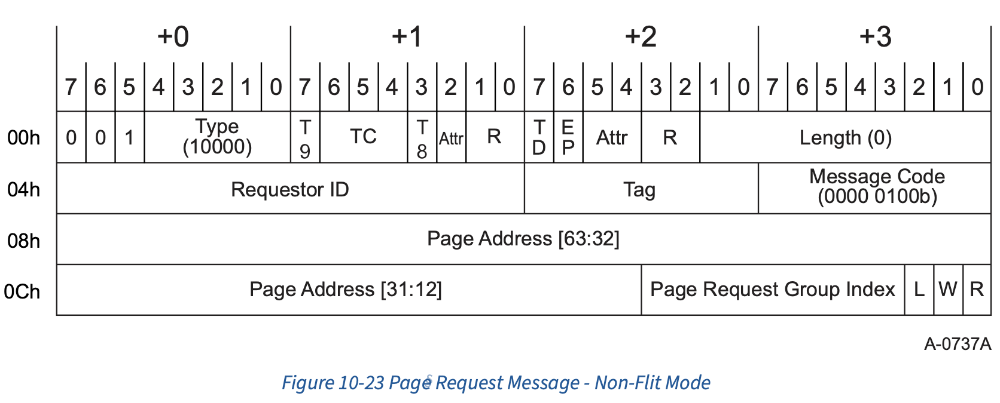
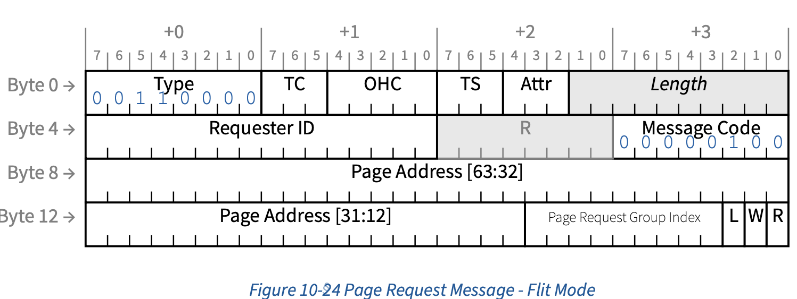
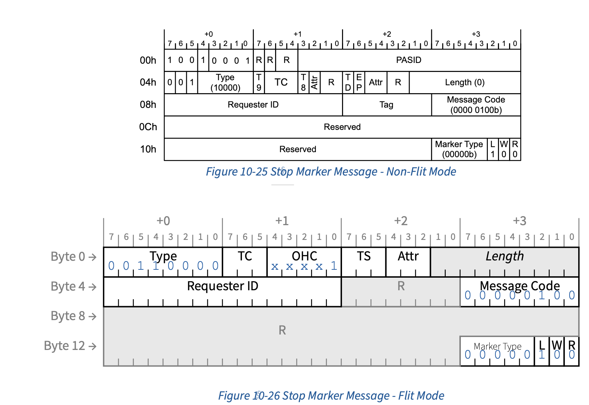
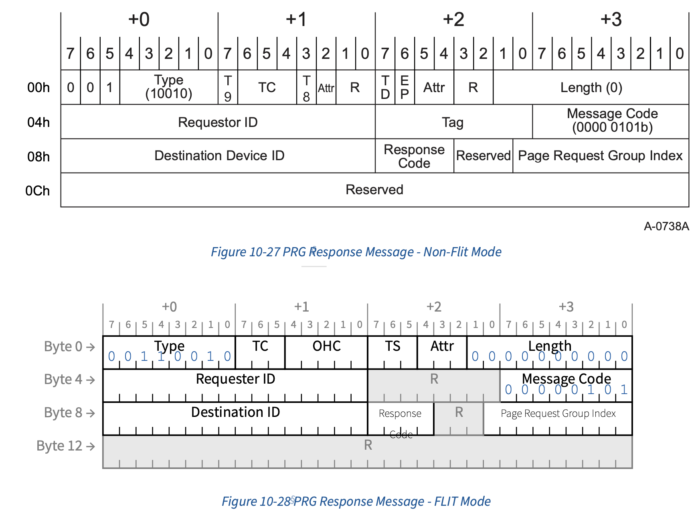

## 10.4 Page Request Services

The general model for a page request is as follows:

1. A Function determines that it requires access to a page for which an ATS
   translation is not available.

2. The Function causes the associated Page Request Interface to send a Page
   Request Message to its RC. A Page Request Message contains a page address and
   a Page Request Group (PRG) index. The PRG index is used to identify the
   transaction and is used to match requests with responses.

3. When the RC determines its response to the request (which will typically be
   to make the requested page resident), it sends a PRG Response Message back to
   the requesting Function.

4. The Function can then employ ATS to request a translation for the requested page(s).

> 1. Function 判断其需要访问某个尚未有 ATS 转换的页面。
> 2. Function 促使其关联的页面请求接口（Page Request Interface）向其 RC 发送一个
>    页面请求消息（Page Request Message）。页面请求消息包含一个页面地址和一个页
>    面请求组（PRG）索引。PRG 索引用于标识该事务，并用于将请求与响应进行匹配。
> 3. 当 RC 确定对该请求的响应（通常是使所请求的页面变为常驻内存）后，它会向发起
>    请求的 Function 发送一个 PRG 响应消息（PRG Response Message）。
> 4. 随后，Function 可以使用 ATS 请求所需页面的转换

A Page Request Message is a PCIe Message Request that is Routed to the Root
Complex with a Message Code of 4 (0000 0100b). The mechanism employed at the RC
to buffer requests is implementation specific. The only requirement is that an
RC not silently discard requests. 

> Page Request Message 是一种 PCIe Message Request，其会以 Message Code 4（0000
> 0100b）路由到 Root Complex。RC 端用于缓存请求的机制由具体实现决定。唯一的要求
> 是，RC 不能悄无声息地丢弃请求。

All Page Request Messages and PRG Response Messages travel in PCIe Traffic Class
0. A Page Request Message or PRG Response Message with a Traffic Class other
than 0 shall be treated as Malformed TLPs by the RC or endpoint that receives
the same. Intermediate routing elements (e.g., Switches) shall not detect this
error.

>> Malformed TLPs（Malformed Transaction Layer Packets）是指格式错误的 PCIe 事务
>> 层数据包。
>
> 所有 Page Request Message 和 PRG Response Message 都在 PCIe Traffic Class 0 中
> 传输。带有非 0 Traffic Class 的 Page Request Message 或 PRG Response Message，
> 应当被接收该消息的 RC 或 endpoint 视为 Malformed TLPs。中间的路由元件（例如
> Switches）不应检测此类错误

The Relaxed Ordering and ID-Based Ordering bits in the Attr field of Page
Request Messages and PRG Response messages may be used. The No Snoop bit in the
Attr field is reserved.

> Page Request Message 和 PRG Response message 的 Attr 字段中的 Relaxed Ordering
> 和 ID-Based Ordering 位可以使用。Attr 字段中的 No Snoop 位为保留位。

The page request service allows grouping of page requests into Page Request
Groups (PRGs). A PRG can contain one or more page requests. All pages in a PRG
are responded to en mass by the host. Individual pages within a PRG are
requested with independent Page Request Messages and are recognized as belonging
to a common PRG by sharing the same PRG index. The last request of a PRG is
marked as such within its Page Request Message. One request credit is consumed
per page request (not per PRG).

> page request service 允许将多个页面请求分组为 Page Request Groups（PRGs）。一
> 个 PRG 可以包含一个或多个页面请求。host会对 PRG 中的所有页面统一响应。PRG 内的
> 每个页面通过独立的 Page Request Message 请求，并通过共享相同的 PRG index 被识
> 别为属于同一个 PRG。PRG 的最后一个请求会在其 Page Request Message 中被标记为最
> 后一个。每个页面请求会消耗一个 request credit（而不是每个 PRG 消耗一个）。

A PRG Response Message is a PCIe Message Request that is Routed by ID back to
the requesting Function. It is used by system software to alert a Function that
the page request(s) associated with the corresponding PRG has (have) been
satisfied. The page request mechanism does not guarantee any request completion
order and all requests are inherently independent of all other concurrently
outstanding requests. If a Function requires that a particular request be
completed before another request, the initial request will need to complete
before the subsequent request is issued. It is valid for a Function to
speculatively request a page without ascertaining its residence state and/or to
issue multiple concurrently outstanding requests for the same page.

> PRG Response Message 是一种 PCIe Message Request，它会通过 ID 路由回发起请求的
> Function。系统软件使用它来通知 Function，与对应 PRG 相关联的页面请求已经被满足。
> page request 机制不保证请求完成的顺序，所有请求本质上都是彼此独立的，与其他并
> 发未完成的请求没有依赖关系。如果 Function 需要某个请求在另一个请求之前完成，必
> 须等到初始请求完成后再发起后续请求。Function 可以在不确定页面是否常驻的情况下，
> 提前发起页面请求，也可以对同一页面同时发起多个并发的请求，这都是允许的。

A Page Request Interface is allocated a specific number of page request message
credits. An RC (system software) can divide the available credits in any manner
deemed appropriate. Any measures the host chooses to employ to ensure that
credits are correctly metered by Page Request Interfaces (a Page Request
Interface is not using more than its allocation) is an implementation choice. A
Page Request Interface is not allowed to oversubscribe the available number of
requests (doing so can result in the page request mechanism being disabled if
the buffer limit is exceeded at the root). A Page Request Interface’s page
request allocation is static. It is determined when the Page Request Interface
is enabled and can only be changed by disabling and then re-enabling the
interface.

> Page Request Interface 会被分配一定数量的 page request message credit。RC
> （system software）可以以任何认为合适的方式分配这些可用的 credit。host为确保
> Page Request Interface 正确计量 credit（即 Page Request Interface 没有超出分配
> 额度使用 credit）所采取的任何措施，属于实现选择。Page Request Interface 不允许
> 超额发起请求（如果超出 root 端的 buffer 限制，可能导致 page request 机制被禁
> 用）。Page Request Interface 的 page request credit 分配是静态的：它在 Page
> Request Interface 启用时确定，只有在禁用并重新启用接口时才能更改。

### 10.4.1 Page Request Message

A Function uses a Page Request Message to send page requests to its associated
host. A page request indicates a page needed by the Function. The Page Request
Interface associated with a Function is given a specific Page Request
allocation. A Page Request Interface shall not issue page requests that exceed
its page request allocation.

> Function 使用 Page Request Message 向其关联的host发送页面请求。每个页面请求表
> 示 Function 需要的一个页面。与 Function 关联的 Page Request Interface 会被分配
> 一个特定的 Page Request allocation。Page Request Interface 不得发起超过其 page
> request allocation 的页面请求。

A page request contains the untranslated address of the page that is needed, the
access permissions needed for that page, and a PRG index. A PRG Index is a 9-bit
scalar that is assigned by the Function to identify the associated page request.
Multiple pages may be requested using a single PRG index. When more than a
single page is to be associated with a given PRG, the Last flag in the Page
Request Record is cleared in all the requests except the last request associated
with a given PRG (the flag is set in the last request). Page requests are
responded to en mass. No response is possible (except for a Response Failure
error) until the last request of a PRG has been received by the root. The number
of PRGs that a Function can have outstanding at any given time is less than or
equal to the associated Page Request Interface’s Outstanding Page Request
Allocation. It is valid for a request group to contain multiple requests for the
same page and for multiple outstanding PRGs to request the same page.

> page request 包含所需页面的未转换地址、该页面所需的访问权限，以及一个 PRG
> index。PRG index 是由 Function 分配的 9-bit 标量，用于标识相关的 page request。
> 可以通过同一个 PRG index 请求多个页面。当需要将多个页面关联到同一个 PRG 时，
> Page Request Record 中的 Last 标志位在该 PRG 关联的所有请求中都被清除，只有在
> 最后一个请求中该标志位才会被置位。page request 会被统一响应。在 root 收到某个
> PRG 的最后一个请求之前，不会有响应（除了 Response Failure 错误之外）。Function
> 在任意时刻可拥有的未完成 PRG 数量小于等于其关联 Page Request Interface 的
> Outstanding Page Request Allocation。一个请求组包含对同一页面的多个请求，以及
> 多个未完成的 PRG 同时请求同一页面，都是允许的。

A Page Request Interface applies to the “main” Function and its enabled Shadow
Functions (where the “main” is the Function that contains both the Page Request
Extended Capability and the Shadow Function Extended Capability). All pages
request messages of a single PRG must have the same Requester ID (of either the
“main” Function or one of its Shadows).

> Page Request Interface 适用于 “main” Function 及其已启用的 Shadow Function（其
> 中 “main” 指同时包含 Page Request Extended Capability 和 Shadow Function
> Extended Capability 的 Function）。单个 PRG 的所有 page request message 必须具
> 有相同的 Requester ID（可以是 “main” Function，也可以是其某个 Shadow Function
> 的 Requester ID）。

The first two DWs of a Page Request Message contain a standard PCIe message
header. The second two DWs of the message contain page request specific data
fields.

> Page Request Message 的前两个 DW（Double Word，双字）包含标准的 PCIe message
> header。该消息的后两个 DW 包含 page request 专用的数据字段。

* **_R_**: **Read Access Requested** - This field, when Set, indicates that the
    requesting Function seeks read access to the associated page. When Clear,
    this field indicates that the requesting Function will not read the
    associated page. If R and W are both Clear and L is Set, this is a Stop
    Marker (see § Section 10.4.1.2.1 ). The R field must be Set for Page
    Requests with a PASID and that have the Execute Requested bit Set.

    > 当该字段被置位时，表示请求的 Function 需要对关联页面的读访问权限。若该字段
    > 为清除状态，则表示请求的 Function 不会读取关联页面。如果 R 和 W 都为清除状
    > 态且 L 被置位，则该请求为 Stop Marker（参见第 10.4.1.2.1 节）。对于带有
    > PASID 且设置了 Execute Requested 位的 Page Request，R 字段必须被置位。

* **_W_** **Write Access Requested** - This field, when Set, indicates that the
    requesting Function seeks write access and/or zero-length read access to the
    associated page. When Clear, this field indicates that the requesting
    Function will not write to the associated page.

    Upon receiving a Page Request Message with the W field Set, the host is
    permitted to mark the associated page dirty.

    If R and W are both Clear and L is Set, this is a Stop Marker (see § Section
    10.4.1.2.1 ).

    > 当该字段被置位时，表示请求的 Function 需要对关联页面进行写访问和/或零长度
    > 读访问。若该字段为清除状态，则表示请求的 Function 不会向关联页面写入数据。
    >
    > 当收到 W 字段被置位的 Page Request Message 时，host 可以将关联页面标记为
    > dirty。

* **_L_** **Last Request in PRG** - This field, when Set, indicates that the
    associated page request is the last request of the associated PRG. A PRG can
    have a single entry, in which case the PRG consists of a single request in
    which this field is Set. When Clear, this field indicates that additional
    page requests will be posted using this record’s PRG Index.

    > 当该字段被置位时，表示关联的 page request 是对应 PRG 的最后一个请求。一个
    > PRG 可以只包含一个条目，此时该 PRG 仅由一个请求组成，并且该字段被置位。若
    > 该字段为清除状态，则表示还会有更多的 page request 使用该记录的 PRG Index
    > 被提交。

    If R and W are both Clear and L is Set, this is a Stop Marker (see § Section
    10.4.1.2.1 ).

* **Page Request Group Index** - This field contains a
    Function supplied identifier for the associated page request. A Function
    need not employ the entire available range of PRG index values. A host shall
    never respond with a PRG Index that has not been previously issued by the
    Function and that is not currently an outstanding request PRG Index (except
    when issuing a Response Failure, in which case the host need not preserve
    the associated request’s PRG Index value in the error response).

    > 该字段包含由 Function 提供的、用于标识关联 page request 的标识符。Function
    > 不必使用全部可用范围的 PRG index 值。host 不应对 Function 尚未发出的，或者
    > 当前不是未完成请求的 PRG Index 进行响应（除非是在发出 Response Failure 时，
    > 此时 host 在错误响应中无需保留关联请求的 PRG Index 值）。

* **Page Address** - This field contains the untranslated address of the page to
    be loaded. For pages larger than 4096 bytes, the least significant bits of
    this field are ignored. For example, the least significant bit of this field
    is ignored when an 8096-byte page is being requested.

    > 该字段包含要加载页面的未转换地址。对于大于 4096 字节的页面，该字段的低位会
    > 被忽略。例如，当请求一个 8096 字节的页面时，该字段的最低位会被忽略。

#### 10.4.1.1 PASID Usage

The PASID Extended Capability indicates whether a Function supports PASID TLP
Prefixes (NFM) or OHC-A1 with PASID (FM), and whether it is enabled to send and
receive them.

> PASID Extended Capability 指示一个 Function 是否支持 PASID TLP Prefix（NFM）或
> OHC-A1 with PASID（FM），以及它是否已启用以发送和接收这些前缀。

Functions that support PASID are permitted to send a PASID on Page Request
Messages. The PASID field contains the process address space of the page being
requested and the Execute Requested and Privileged Mode Requested bits indicate
the access being requested.

> 支持 PASID 的 Function 可以在 Page Request Message 中发送 PASID。PASID 字段包
> 含所请求页面的进程地址空间，Execute Requested 和 Privileged Mode Requested 位
> 指示所请求的访问权限。

If one Page Request Message in a PRG has a PASID, all Page Request Messages in
that PRG must contain identical PASID values. Behavior is undefined when the
PASID values are inconsistent.

> 如果一个 PRG 中的某个 Page Request Message 有 PASID，那么该 PRG 中所有的 Page
> Request Message 必须包含相同的 PASID 值。如果 PASID 值不一致，行为未定义。

Functions that support PASID and have the PRG Response PASID Required bit Set
(see § Section 10.5.2.3 ), expect that PRG Response Messages will contain a
PASID if the associated Page Request Message had a PASID. For such PRG Response
Messages, the Execute Requested and Privileged Mode Requested bits are reserved
and the PASID field contains the PASID from the associated Page Request Message.

> 支持 PASID 并且设置了 PRG Response PASID Required 位（参见第 10.5.2.3 节）的
> Function，期望当相关的 Page Request Message 带有 PASID 时，PRG Response
> Message 也包含 PASID。对于这样的 PRG Response Message，Execute Requested 和
> Privileged Mode Requested 位为保留位，PASID 字段包含来自关联 Page Request
> Message 的 PASID。

#### 10.4.1.2 Managing PASID Usage on PRG Requests

There are rules for stopping and starting the use of a PASID.

> 对于停止和启动 PASID 的使用有相关规则。

This section describes additional rules that apply to Functions that have issued
Page Request Messages in a PASID that is being stopped. No additional rules are
required to start the usage of the Page Request Interface for a PASID.

> 本节描述了适用于在被停止的 PASID 中已经发出 Page Request Message 的 Function
> 的附加规则。对于启动 PASID 的 Page Request Interface 的使用，不需要额外的规则。

When stopping the use of a particular PASID, a Stop Marker Message may be
optionally used to avoid waiting for PRG Response Messages before the Function
indicates that the stop request for a particular PASID has completed.

> 当停止使用某个特定 PASID 时，可以选择性地使用 Stop Marker Message，以避免在
> Function 指示某个 PASID 的停止请求已完成之前，必须等待 PRG Response Message。

To stop without using a Stop Marker Message, the Function shall:

1. Stop queueing new Page Request Messages for this PASID.

2. Finish transmitting any multi-page Page Request Messages for this PASID (i.e.,
   send the Page Request Message with the L bit Set).

3. Wait for PRG Response Messages associated any outstanding Page Request
   Messages for the PASID.

4. Indicate that the PASID has stopped using a device specific mechanism. This
   mechanism must indicate that a Stop Marker Message will not be generated.

> 按照你的要求（功能、专业名词不翻译），下面是你的英文内容的中文翻译：

> 如果在停止时不使用 Stop Marker Message，Function 应当：

> 1. 停止为该 PASID 排队新的 Page Request Message。
> 2. 完成对该 PASID 的所有多页 Page Request Message 的发送（即，发送带有 L 位设
>    置的 Page Request Message）。
> 3. 等待与该 PASID 所有未完成 Page Request Message 相关的 PRG Response Message。
> 4. 通过设备特定的机制指示该 PASID 已经停止。该机制必须能够指示不会生成 Stop
>    Marker Message。

To stop with the use of a Stop Marker Message the Function shall:

1. Stop queueing new Page Request Messages for this PASID.

2. Finish transmitting any multi-page Page Request Messages for this PASID (i.e.,
   send the Page Request Message with the L bit Set).

3. Internally mark all outstanding Page Request Messages for this PASID as
   stale. PRG Response Messages associated with these requests will return Page
   Request Allocation credits and PRG Index values but are otherwise ignored.
   184

4. Indicate that the PASID has stopped using a device specific mechanism. This
   mechanism must indicate that a Stop Marker Message will be generated.

5. Send a Stop Marker Message to indicate to the host that all subsequent
   Page Request Messages for this PASID are for a new use of the PASID value.
   Note: Steps 4 and 5 may be performed in either order, or in parallel.

> 如果在停止时使用 Stop Marker Message，Function 应当：
> 1. 停止为该 PASID 排队新的 Page Request Message。
>
> 2. 完成对该 PASID 的所有多页 Page Request Message 的发送（即，发送带有 L 位设
>    置的 Page Request Message）。
>
> 3. 在内部将该 PASID 的所有未完成 Page Request Message 标记为 stale。与这些请求
>    相关的 PRG Response Message 会返回 Page Request Allocation credit 和 PRG
>    Index 值，但除此之外会被忽略。
> 4. 通过设备特定的机制指示该 PASID 已经停止。该机制必须能够指示会生成 Stop
>    Marker Message。
> 5. 发送 Stop Marker Message，以向主机指示该 PASID 的所有后续 Page Request
>    Message 都属于对该 PASID 值的新使用。
>
> 注：步骤 4 和 5 可以任意顺序执行，也可以并行执行。

##### 10.4.1.2.1 Stop Marker Messages

A Stop Marker Message indicates that a Function has stopped using the Page
Request Interface and has transmitted all pending Page Request Messages for a
specific PASID. Stop Marker Messages are strongly ordered with respect to Page
Request Messages and serve to push Page Request Messages toward the Host. When
the Host receives the Stop Marker Message, this indicates that all Page Request
Messages associated with the PASID being stopped have been delivered and that
any subsequent Page Request Message with the same PASID value are associated
with a new incarnation of that PASID value.

Stop Marker Messages do not have a response. They do not have a PRG Index and do
not consume Page Request allocation (see § Section 10.5.2.5 ).

The Stop Marker Message bit layout is shown in § Figure 10-25.

A Stop Marker Message is encoded as a Page Request Message for which:

* In NFM, includes a PASID TLP Prefix.

* In FM, includes OHC-A1 with PASID. The Execute Requested and Privileged Mode
  Requested bits and the Last DW BW / 1st DW BE fields in the OHC-A1 are
  Reserved.
* The L, W and R fields contain 1b, 0b and 0b respectively.
* The Untranslated Address field and upper bits of the PRG Index field are Reserved.
* The Marker Type field contains 0 0000b to indicate that this is a Stop Marker Message.
* The Traffic Class must be 0.
* The Relaxed Ordering attribute bit must be Clear.
* The ID-Based Ordering attribute bit may be Set.

Behavior is undefined if a Stop Marker Message is received and any of the following are true:

* Marker Type not equal to 0 0000b.
* No PASID TLP Prefix is present (NFM).
* The PASID value does not match an outstanding stop request.
* An incomplete Page Request Message for the PASID is outstanding (i.e., for
  some PRG Index, the most recently received Page Request Message did not have
  the L bit Set).

### 10.4.2 Page Request Group Response Message

System hardware and/or software communicate with a Function’s page request
interface via PRG Response Messages. A PRG Response Message is used by a host to
signal the completion of a PRG, or the catastrophic failure of the interface. A
single PRG Response Message is issued in response to a PRG, independent of the
number of page requests associated with the PRG. There is no mechanism for
indicating a partial request completion or partial request failure. If any of
the pages associated with a given PRG cannot be satisfied, then the request is
considered to have failed and the reason for the failure is supplied in the PRG
Response Message. The host has no obligation to partially satisfy a multi-page
request. If one of the requested pages cannot be made resident, then the entire
request can, but need not, be discarded. That is, the residence of pages that
share a PRG with a failed page request, but that are not associated with the
failure, is indeterminate from the Function’s perspective.

There are four possible Page Request failures:

1. The requested page is not a valid Untranslated Address.

2. PASID support exists, the Page Request has a PASID, and either PASID usage is
   not enabled for this request, the PASID value is not valid, or the Execute
   Requested bit is Set when R is Clear. 185

3. The requested page does not have the requested access attributes (including
   Execute permission and/or Privileged Mode access when those bits are present)

4. The system is, for an unspecified reason, unable to respond to the request.
   This response is terminal (the host may no longer respond to any page
   requests and may not supply any further replies to the Function until the
   Function’s page request interface has been reset). For example, a request
   that violates a Function’s assigned request limit or overflows the RC’s
   buffering capability may cause this type of failure.

A Function’s response to Page Request failure cases 1, 2, and 3 above is
implementation dependent. The failure is not necessarily persistent, that is,
a failed request may, in some instances succeed if re-issued. The range of
possibilities precludes the precise specification of a generalized failure
behavior, though on a per Function basis, the response to a failure will be
an implementation dependent behavior.

All responses are sent to their associated Functions via PRG Response
Messages. A Function must be capable of sinking multiple consecutive messages
without losing any information. To avoid deadlock, a Function must able to
process PRG Response Messages for all of the Function's outstanding Page
Request Messages without depending on the Function sending or receiving any
other TLP. 186 A PRG Response Message is an ID routed PCIe message. The only
Page Request Interface specific fields in this message are the Response Code
and PRG. All other fields are standard PCIe message fields. (Note: these
messages are routed based on the ID in bytes 8 and 9; with bytes 4 and 5
containing the host’s Requester ID.)

Receipt of a PRG Response Message that contains a PRG Index that is not
currently outstanding at a Function shall result in the UPRGI flag in the
Page Request Extended Capability being Set, contingent upon the TLP otherwise
being error free. Because of ambiguous language in earlier versions of this
specification, it is permitted (though discouraged) to handle this case as an
Unsupported Request (UR) or Unexpected Completion (UC) by the Function
containing the Page Request Extended Capability, but otherwise no other error
is permitted to be logged or signaled.

#### 10.4.2.2 PASID Usage on PRG Responses

If a Page Request has a PASID, the corresponding PRG Response Message may
optionally contain one as well. If the PRG Response PASID Required bit is Clear,
PRG Response Messages do not have a PASID.

If the PRG Response PASID Required bit is Set, PRG Response Messages have a
PASID if the Page Request also had one. The Function is permitted to use the
PASID value from the prefix in conjunction with the PRG Index to match requests
and responses.

When a PASID is attached to PRG Response Messages, the Execute Requested and
Privileged Mode Requested bits are Reserved and the PASID value is copied from
the PASID value of the Page Request.
