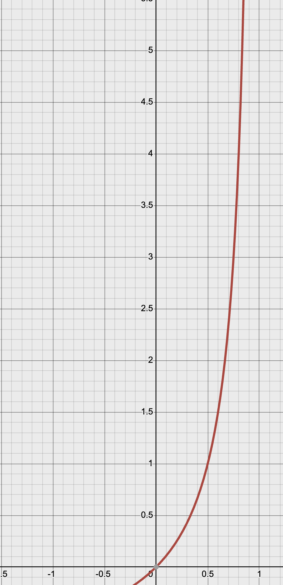

<script type="text/javascript" async
  src="https://cdnjs.cloudflare.com/ajax/libs/mathjax/3.2.0/es5/tex-mml-chtml.js">
</script>
#
## 简介

在大型机器，并且系统负载高时热迁移，工作负载往往比热迁移速度更快，从而导致
live migration无法 converge.

这个往往受限于bandwidth, 虽然现在网卡的带宽越来越高。但是虚拟机的核心数量
以及cpu主频，内存带宽也在逐渐增大。

`Chegu Vinod` 在 2013 年提出了 auto-converge, （但是的场景即使使用了10Gig
NICs也仍然NOT converge). 所以，他提出了该方案，来限制脏页产生速度，也就是
简单粗暴的限制vcpu的"频率", (让vcpu线程sleep).

我们来看下该patch 的 commit message:
```
Busy enterprise workloads hosted on large sized VM's tend to dirty
memory faster than the transfer rate achieved via live guest migration.
Despite some good recent improvements (& using dedicated 10Gig NICs
between hosts) the live migration does NOT converge.

在大型虚拟机上运行的繁忙企业级工作负载通常会比实时迁移的传输速率更快
地修改内存数据。尽管近期在迁移性能上已有一些改进（包括在主机之间使用
专用的10Gb网卡），实时迁移仍然无法收敛。

If a user chooses to force convergence of their migration via a new
migration capability "auto-converge" then this change will auto-detect
lack of convergence scenario and trigger a slow down of the workload
by explicitly disallowing the VCPUs from spending much time in the VM
context.

如果用户选择通过一个新的迁移功能“auto-converge”来强制迁移收敛，
那么该功能将自动检测到未收敛的情况，并通过显式限制虚拟 CPU 在 
VM 上下文中的执行时间来减缓工作负载。

The migration thread tries to catchup and this eventually leads
to convergence in some "deterministic" amount of time. Yes it does
impact the performance of all the VCPUs but in my observation that
lasts only for a short duration of time. i.e. end up entering
stage 3 (downtime phase) soon after that. No external trigger is
required.

迁移线程会努力追赶同步速度，这最终会在“确定的”时间内实现收敛。
虽然这确实会影响所有虚拟 CPU 的性能，但根据我的观察，这种影响只会
持续较短的时间，即在此之后很快便进入第3阶段（停机阶段）。整个过程
不需要额外的触发。

Thanks to Juan and Paolo for their useful suggestions.
```

我们来分析下具体代码:

## first patch 代码分析

### intro async_run_on_cpu

引入该函数的主要目的，是为了让vcpu thread sleep 完成之前，migration
thread 不必wait（打得就是频率差，否则就没有意义了)

原commit message:
```
Introduce an asynchronous version of run_on_cpu() i.e. the caller
doesn't have to block till the call back routine finishes execution
on the target vcpu.
```
代码如下:
```cpp
void async_run_on_cpu(CPUState *cpu, void (*func)(void *data), void *data)
{
    struct qemu_work_item *wi;
    
    if (qemu_cpu_is_self(cpu)) {
        func(data);
        return;
    }
    
    wi = g_malloc0(sizeof(struct qemu_work_item));
    wi->func = func;
    wi->data = data;
    wi->free = true;
    if (cpu->queued_work_first == NULL) {
        cpu->queued_work_first = wi;
    } else {
        cpu->queued_work_last->next = wi;
    }
    cpu->queued_work_last = wi;
    wi->next = NULL;
    wi->done = false;
    
    qemu_cpu_kick(cpu);
}
```

### intro auto-converge param && cap
```diff
diff --git a/migration.c b/migration.c
index 058f9e6..d0759c1 100644
--- a/migration.c
+++ b/migration.c
@@ -473,6 +473,15 @@ void qmp_migrate_set_downtime(double value, Error **errp)
     max_downtime = (uint64_t)value;
 }
 
+bool migrate_auto_converge(void)
+{
+    MigrationState *s;
+
+    s = migrate_get_current();
+
+    return s->enabled_capabilities[MIGRATION_CAPABILITY_AUTO_CONVERGE];
+}
+
 int migrate_use_xbzrle(void)
 {
     MigrationState *s;
diff --git a/qapi-schema.json b/qapi-schema.json
index a80ee40..c019fec 100644
--- a/qapi-schema.json
+++ b/qapi-schema.json
@@ -605,10 +605,13 @@
 #          This feature allows us to minimize migration traffic for certain work
 #          loads, by sending compressed difference of the pages
 #
+# @auto-converge: If enabled, QEMU will automatically throttle down the guest
+#          to speed up convergence of RAM migration. (since 1.6)
+#
 # Since: 1.2
 ##
 { 'enum': 'MigrationCapability',
-  'data': ['xbzrle'] }
+  'data': ['xbzrle', 'auto-converge'] }
```

### calc if dirty throttle or not
```diff
@@ -378,8 +381,14 @@ static void migration_bitmap_sync(void)
+    static int64_t bytes_xfer_prev;
     ...
+    int64_t bytes_xfer_now;
+
+    if (!bytes_xfer_prev) {
+        bytes_xfer_prev = ram_bytes_transferred();
+    }

@@ -404,6 +413,23 @@ static void migration_bitmap_sync(void)
 
     /* more than 1 second = 1000 millisecons */
     if (end_time > start_time + 1000) {
+        if (migrate_auto_converge()) {
+            /* The following detection logic can be refined later. For now:
+               Check to see if the dirtied bytes is 50% more than the approx.
+               amount of bytes that just got transferred since the last time we
+               were in this routine. If that happens >N times (for now N==4)
+               we turn on the throttle down logic */
             
           /* 后续可以进一步优化以下检测逻辑。当前逻辑如下：
              检查脏页字节数是否比上次进入该函数以来传输的字节数大50%。
              如果这种情况发生超过 N 次（目前 N==4），则开启降速逻辑 */
             //==(1)==
+            bytes_xfer_now = ram_bytes_transferred();
+            if (s->dirty_pages_rate &&
+               (num_dirty_pages_period * TARGET_PAGE_SIZE >
+                   (bytes_xfer_now - bytes_xfer_prev)/2) &&
                //==(2)==
+               (dirty_rate_high_cnt++ > 4)) {
+                    trace_migration_throttle();
+                    mig_throttle_on = true;
+                    dirty_rate_high_cnt = 0;
+             }
+             bytes_xfer_prev = bytes_xfer_now;
+        } else {
              //==(3)==
+             mig_throttle_on = false;
+        }
```
在`migration_bitmap_sync`后，还是按照之前的逻辑，本次和上次差距1s，则认为
migration线程有压力。然后做了一个简单的算法:

先简单介绍下其中变量含义:
* bytes_xfer_prev: sync之前, 要传输的memory 数量 
* bytes_xfer_now: sync 之后, 要传输的memory 数量
* num_dirty_pages_period: 本次和上次相比，dirty page的变化量
* dirty_rate_high_cnt: 进入dirty rate high if分支的次数
* mig_throttle_on: 表示开启`mig_throttle_on`

所以, 该算法比较简单，触发条件有两个
1. (dirty_page_now - dirty_page_last) / (byte_xfer_now) - (byte_xfer_prev) > 0.5
   则认为需要限制脏页产生速率。

   该公式分子部分，相当于脏页产生速率，而分母部分相当于 migration thread页面传输速率。
   值越大，说明，脏页产生速率相对越快。
2. 达到1中的条件5次。

   达到条件2后, 将`dirty_rate_high_cnt` 设置为0。所以下次如果再想触发`mig_throttle`, 
   还需要再次达到条件2.

3. 一旦开启了auto_converge, 就无法将 `mig_throttle_on` 设置为false

### notify vcpu down ratio
```diff
@@ -628,6 +656,7 @@ static int ram_save_iterate(QEMUFile *f, void *opaque)
         }
         total_sent += bytes_sent;
         acct_info.iterations++;
+        check_guest_throttling();
         /* we want to check in the 1st loop, just in case it was the 1st time
            and we had to sync the dirty bitmap.
            qemu_get_clock_ns() is a bit expensive, so we only check each some

+static void check_guest_throttling(void)
+{
+    static int64_t t0;
+    int64_t        t1;
+
+    if (!mig_throttle_on) {
+        return;
+    }
+
+    if (!t0)  {
+        t0 = qemu_get_clock_ns(rt_clock);
+        return;
+    }
+
+    t1 = qemu_get_clock_ns(rt_clock);
+
+    /* If it has been more than 40 ms since the last time the guest
+     * was throttled then do it again.
+     */
     //==(1)==
+    if (40 < (t1-t0)/1000000) {
+        mig_throttle_guest_down();
+        t0 = t1;
+    }
+}
```
在在每一轮的`ram_save_iterate`中，查看是否需要notify vcpu，但是这里
notify 也有一个频率为40ms, 我们下面看看是如何notify vcpu，以及
vcpu那边如何down ratio.

```diff
+/* Stub function that's gets run on the vcpu when its brought out of the
+   VM to run inside qemu via async_run_on_cpu()*/
+static void mig_sleep_cpu(void *opq)
+{
+    qemu_mutex_unlock_iothread();
     //==(1)==
+    g_usleep(30*1000);
+    qemu_mutex_lock_iothread();
+}
+
+/* To reduce the dirty rate explicitly disallow the VCPUs from spending
+   much time in the VM. The migration thread will try to catchup.
+   Workload will experience a performance drop.
+*/
+static void mig_throttle_cpu_down(CPUState *cpu, void *data)
+{
+    async_run_on_cpu(cpu, mig_sleep_cpu, NULL);
+}
+
+static void mig_throttle_guest_down(void)
+{
+    qemu_mutex_lock_iothread();
+    qemu_for_each_cpu(mig_throttle_cpu_down, NULL);
+    qemu_mutex_unlock_iothread();
+}
```
从(1) 中可以看到, 每次sleep 30ms, 上面说了40ms kick 一次vcpu, 那么cpu sleep time和runtime的
占比大概是3:1

> ======还存在的问题======

这样做似乎太简单粗暴了，是固定频率限制，在某些情况下可能不管用

## dynamic cpu throttle

`Jason J. Herne` 发现了之前的`auto-converge`不太好用，因为他是让vcpu下降到一个固定
频率，但是在这个固定的频率下, 迁移的效率还是不够，导致迁移迟迟不能完成。所以，
`Jason J. Herne`发送了一个mail，并且他想做一个真正"auto"的方式，动态的调整throttle
的力度. 向大家征求意见:

[mail 地址 -- 2015-03-12](https://lore.kernel.org/all/54F4D076.3040402@linux.vnet.ibm.com/)

其中`Dr. David Alan Gilbert`从工程角度, 针对`Jason J. Herne`提出的一些问题给
出了建议, 例如针对这些不太容易迁移的虚拟机，可以使用:
* xbzrle
* post-copy
* inc max-downtime

等等来加速虚拟机迁移。并且对`Jason J. Herne`的想法给予肯定。

`Jason J. Herne` 编写了该patch。（我们只看下[v7 版本](https://lore.kernel.org/all/1441732357-11861-1-git-send-email-jjherne@linux.vnet.ibm.com/))


首先看下 commit message:
```
This patch set provides a new method for throttling a vcpu and makes use of
said method to dynamically increase cpu throttling during an autoconverge
migration until the migration completes. This method ensures that all
migrations will eventually converge.

> 这个补丁集提供了一种新的限制虚拟 CPU 的方法，并利用该方法在自动收敛迁移过程
> 中动态增加 CPU 限速，直到迁移完成。该方法确保所有迁移最终都能收敛。

The method used here for throttling vcpus is likely not the best. However, I
believe that it is preferable to what is used for autoconverge today.

> 这里用于限制虚拟 CPU 的方法可能不是最好的。然而，我认为它比目前用于自动收敛
> 的方式更为可取。

This work is related to the following discussion:
https://lists.gnu.org/archive/html/qemu-devel/2015-03/msg00287.html
```

该系列patch, 主要分为如下部分:

* 重新定义涉及throttle 相关接口
  + active/stop -- 开启关闭 throttle
  + set throttle_percentage  -- 动态调整 throttle 力度
  + periodic tick -- 可以更精准的周期性触发 periodic tick, 不再依赖migration thread notify
  + sleep interface -- 可以根据 动态调整的  throttle 的值，来sleep.
* 增加两个参数
  + x-cpu-throttle-initial: 初始值
  + x-cpu-throttle-increment: 如果本次限制之后，再次达到了dirty radio 的限制，则一次增加  
                              throttle的值
* migration_bitmap_sync 处理逻辑(core)
  + dynamic inc
* 增加 thrrole ratio 查询
  + info migrate
  + query-migrate


我们这里，只列举下和动态调整`throttle`的相关改动
```diff
+/* Reduce amount of guest cpu execution to hopefully slow down memory writes.
+ * If guest dirty memory rate is reduced below the rate at which we can
+ * transfer pages to the destination then we should be able to complete
+ * migration. Some workloads dirty memory way too fast and will not effectively
+ * converge, even with auto-converge.
+ */
+static void mig_throttle_guest_down(void)
+{
+    MigrationState *s = migrate_get_current();
     //初始值
+    uint64_t pct_initial =
+            s->parameters[MIGRATION_PARAMETER_X_CPU_THROTTLE_INITIAL];
     //每次增加的值
+    uint64_t pct_icrement =
+            s->parameters[MIGRATION_PARAMETER_X_CPU_THROTTLE_INCREMENT];
+
     //如果第一次执行，则设置为初始值
+    /* We have not started throttling yet. Let's start it. */
+    if (!cpu_throttle_active()) {
+        cpu_throttle_set(pct_initial);
+    } else {
         //说明是第2+次，触发了，则在原来值的基础上加上inc的值
+        /* Throttling already on, just increase the rate */
+        cpu_throttle_set(cpu_throttle_get_percentage() + pct_icrement);
+    }
+}
```

可以看到，上面的patch，通过`cpu_throttle_set()`传入了
`current_pct +  pct_icrement`, 这个值代表的是，睡眠时间所占的比重。

我们来看下为达到这样的时间比例，QEMU如何实现:

首先引入了一个时间片的值，该值为10ms

```diff
+#define CPU_THROTTLE_TIMESLICE_NS 10000000
```

该值表示vcpu运行的时间片固定值, 也就是为了避免因为alarm频繁的
vm-exit. 将该值固定下来，然后让睡眠时间根据该值和pct再计算

定义了一个timer, 使用`QEMU_CLOCK_VIRTUAL_RT`, expired function
为`cpu_throttle_timer_tick`
```diff
 void cpu_ticks_init(void)
 {
     seqlock_init(&timers_state.vm_clock_seqlock, NULL);
     vmstate_register(NULL, 0, &vmstate_timers, &timers_state);
+    throttle_timer = timer_new_ns(QEMU_CLOCK_VIRTUAL_RT,
+                                           cpu_throttle_timer_tick, NULL);
 }
```

在set 新的throttle时, 会在当前时间上，增加`CPU_THROTTLE_TIMESLICE_NS`
设置timer，也就是使其，在下一个时间片上触发timer.

```diff
+void cpu_throttle_set(int new_throttle_pct)
+{
+    /* Ensure throttle percentage is within valid range */
+    new_throttle_pct = MIN(new_throttle_pct, CPU_THROTTLE_PCT_MAX);
+    new_throttle_pct = MAX(new_throttle_pct, CPU_THROTTLE_PCT_MIN);
+
+    atomic_set(&throttle_percentage, new_throttle_pct);
+
+    timer_mod(throttle_timer, qemu_clock_get_ns(QEMU_CLOCK_VIRTUAL_RT) +
+                                       CPU_THROTTLE_TIMESLICE_NS);
+}
```

timer 触发时，使用`CPU_THROTTLE_TIMESLICE_NS/(1-pct)`, 我们来看下该公式:

$$
\begin{align}
timer\_val \\
=& 总的时间片 \\
=& \frac{vcpu时间片}{vcpu时间比例} \\
=& \frac{CPU\_THROTTLE\_TIMESLICE\_NS}{1-pct} \\
\end{align}
$$

所以，这里传入的应该是总的时间片.

我们来看下timer expired callbak

```diff
+static void cpu_throttle_timer_tick(void *opaque)
+{
+    CPUState *cpu;
+    double pct;
+
+    /* Stop the timer if needed */
+    if (!cpu_throttle_get_percentage()) {
+        return;
+    }
+    CPU_FOREACH(cpu) {
+        if (!atomic_xchg(&cpu->throttle_thread_scheduled, 1)) {
             //通知各个vcpu睡眠
+            async_run_on_cpu(cpu, cpu_throttle_thread, cpu);
+        }
+    }
+throttle-trigger-threshold
+    pct = (double)cpu_throttle_get_percentage()/100;
     //这里是再次触发timer的时间, 上面说到`CPU_THROTTLE_TIMESLICE_NS / (1-pct)`
     //是总的时间片，所以包含了vcpu time slice和sleep time slice
+    timer_mod(throttle_timer, qemu_clock_get_ns(QEMU_CLOCK_VIRTUAL_RT) +
+                          
+                          CPU_THROTTLE_TIMESLICE_NS / (1-pct));
+}
```
那notify callbak一定是执行sleep了，我们关注下sleep时间:
```diff
+static void cpu_throttle_thread(void *opaque)
+{
+    CPUState *cpu = opaque;
+    double pct;
+    double throttle_ratio;
+    long sleeptime_ns;
+
+    if (!cpu_throttle_get_percentage()) {
+        return;
+    }
+
+    pct = (double)cpu_throttle_get_percentage()/100;
+    throttle_ratio = pct / (1 - pct);
+    sleeptime_ns = (long)(throttle_ratio * CPU_THROTTLE_TIMESLICE_NS);
+
+    qemu_mutex_unlock_iothread();
+    atomic_set(&cpu->throttle_thread_scheduled, 0);
+    g_usleep(sleeptime_ns / 1000); /* Convert ns to us for usleep call */
+    qemu_mutex_lock_iothread();
+}
```
睡眠时间为:

$$
\begin{align}
sleep_ns = & {总的时间片}* (pct) \\
=&  \frac{CPU\_THROTTLE\_TIMESLICE\_NS}{1-pct} * {pct} \\
=& \frac{pct}{1-pct} * {CPU\_THROTTLE\_TIMESLICE\_NS} \\
=& {throttle\_ratio} * {CPU\_THROTTLE\_TIMESLICE\_NS}
\end{align}
$$

***

> ======还存在的问题======

上面的patch虽然能动态的调整迁移过程中的`throttle`, 并且可以灵活的配置
`throttle`的初始值和增量, 进入guestdown的条件，是不变的。还是按照
最初的`dirty page inc / xfer inc > 50%`, 也就是说达到这个条件后，肯定
会影响虚拟机性能。

zhukeqian 觉得不妥，想让用户来配置该值, 来确定这个百分比

## configure throttle-trigger-threshold

首先来看下commit message:
```
Currently, if the bytes_dirty_period is more than the 50% of
bytes_xfer_period, we start or increase throttling.

> 当前，如果 bytes_dirty_period 超过 bytes_xfer_period 的 50%，我
> 们将开始或增加限速。

If we make this percentage higher, then we can tolerate higher
dirty rate during migration, which means less impact on guest.
The side effect of higher percentage is longer migration time.
We can make this parameter configurable to switch between mig-
ration time first or guest performance first.

> 如果我们提高这个百分比，就可以在迁移过程中容忍更高的脏页速率，
> 这意味着对虚拟机的影响会更小。提高百分比的副作用是迁移时间会变
> 长。我们可以将这个参数设置为可配置，以便在迁移时间优先和虚拟机
> 性能优先之间进行切换。

The default value is 50 and valid range is 1 to 100.

> 默认值为 50，有效范围是 1 到 100。
```
目前该配置的默认值是50%，保持和原来一样的值，但是可以调整为`[1,100]`

只看下判断是否`throttle`的代码改动:

```diff
+static void migration_trigger_throttle(RAMState *rs)
+{
+    MigrationState *s = migrate_get_current();
     //throttle_trigger_threshold新增的调整参数
+    uint64_t threshold = s->parameters.throttle_trigger_threshold;
+
+    uint64_t bytes_xfer_period = ram_counters.transferred - rs->bytes_xfer_prev;
+    uint64_t bytes_dirty_period = rs->num_dirty_pages_period * TARGET_PAGE_SIZE;
     //按照比例计算bytes_dirty_threshold 
+    uint64_t bytes_dirty_threshold = bytes_xfer_period * threshold / 100;
+
+    /* During block migration the auto-converge logic incorrectly detects
+     * that ram migration makes no progress. Avoid this by disabling the
+     * throttling logic during the bulk phase of block migration. */
+    if (migrate_auto_converge() && !blk_mig_bulk_active()) {
+        /* The following detection logic can be refined later. For now:
+           Check to see if the ratio between dirtied bytes and the approx.
+           amount of bytes that just got transferred since the last time
+           we were in this routine reaches the threshold. If that happens
+           twice, start or increase throttling. */
+
         //使用按比例计算后的 bytes_dirty_threshold 值来比较
+        if ((bytes_dirty_period > bytes_dirty_threshold) &&
+            (++rs->dirty_rate_high_cnt >= 2)) {
+            trace_migration_throttle();
+            rs->dirty_rate_high_cnt = 0;
+            mig_throttle_guest_down();
+        }
+    }
+}
```

***

> ======还存在的问题======

inc throttle 的目前的算法，是在初始值上累加，每次增长的睡眠值在后期的很明显。
我们来看下公式:

$$
\begin{align}
sleep_ns = & {总的时间片}* (pct) \\
=&  \frac{CPU\_THROTTLE\_TIMESLICE\_NS}{1-pct} * {pct} \\
=& \frac{pct}{1-pct} * {CPU\_THROTTLE\_TIMESLICE\_NS} \\

\end{align}
$$

我们来看下

$$
\begin{align}
y = \frac{x}{1-x}
\end{align}
$$

的图像(过于基础 - - )



是一个指数级增长。该值`* CPU_THROTTLE_TIMESLICE_NS(10ms)`， 不过, 由于
`x-cpu-throttle-increment`是整型, 所以其最大可以达到
```
99 / 1 * 10ms = 990ms = 0.99s
```

但是不可否认的是，后期的睡眠时间增长非常快。于是`Keqian Zhu`
增加了`cpu-throttle-tailslow` 参数，让其在后期可以增长的相对平缓。
但是延长迁移时间

## cpu-throttle-tailslow

commit message

```
At the tail stage of throttling, the Guest is very sensitive to
CPU percentage while the @cpu-throttle-increment is excessive
usually at tail stage.

> 在限流的尾阶段，虚拟机对 CPU 使用率非常敏感，而此时 
> @cpu-throttle-increment 通常过大。

If this parameter is true, we will compute the ideal CPU percentage
used by the Guest, which may exactly make the dirty rate match the
dirty rate threshold. Then we will choose a smaller throttle increment
between the one specified by @cpu-throttle-increment and the one
generated by ideal CPU percentage.

> 如果该参数为真，我们将计算虚拟机理想的 CPU 使用百分比，使其脏页率
> 正好匹配脏页率阈值。然后，我们将在 @cpu-throttle-increment 和根据
> 理想 CPU 使用率生成的增量之间选择一个较小的限流增量。

Therefore, it is compatible to traditional throttling, meanwhile
the throttle increment won't be excessive at tail stage. This may
make migration time longer, and is disabled by default.

> 因此，这种方法与传统限流兼容，同时在尾阶段限流增量不会过大。这样可能会延
> 长迁移时间，默认情况下是禁用的。
```

来看下如何计算得出一个新的增长量的相关代码:

```diff
+static void mig_throttle_guest_down(uint64_t bytes_dirty_period,
+                                    uint64_t bytes_dirty_threshold)
 {
     MigrationState *s = migrate_get_current();
     uint64_t pct_initial = s->parameters.cpu_throttle_initial;
-    uint64_t pct_icrement = s->parameters.cpu_throttle_increment;
+    uint64_t pct_increment = s->parameters.cpu_throttle_increment;
+    bool pct_tailslow = s->parameters.cpu_throttle_tailslow;
     int pct_max = s->parameters.max_cpu_throttle;

+    uint64_t throttle_now = cpu_throttle_get_percentage();
+    uint64_t cpu_now, cpu_ideal, throttle_inc;
+
     /* We have not started throttling yet. Let's start it. */
     if (!cpu_throttle_active()) {
         cpu_throttle_set(pct_initial);
     } else {
         /* Throttling already on, just increase the rate */
-        cpu_throttle_set(MIN(cpu_throttle_get_percentage() + pct_icrement,
-                         pct_max));
+        if (!pct_tailslow) {
+            throttle_inc = pct_increment;
+        } else {
+            /* Compute the ideal CPU percentage used by Guest, which may
+             * make the dirty rate match the dirty rate threshold. */
+            cpu_now = 100 - throttle_now;
             //下面解释为什么这样可以得出 cpu_ideal
+            cpu_ideal = cpu_now * (bytes_dirty_threshold * 1.0 /
+                        bytes_dirty_period);
             //计算cpu运行时间增量。这里和 pct_increment 取最小值
+            throttle_inc = MIN(cpu_now - cpu_ideal, pct_increment);
+        }
+        cpu_throttle_set(MIN(throttle_now + throttle_inc, pct_max));
     }
 }
```
我们还是先解释下参数:
* bytes_dirty_period: 该period dirty byte数量. (当前值)
* bytes_dirty_threshold: 该period dirty threshold (目标阈值)

我们期望的是，经过调整vcpu ratio, 可以让 
```
byte_dirty_period <= bytes_dirty_threshold
```
我们假设，`byte_dirty_period`和`cpu_run_time`成正比
所以可得:
$$
\begin{align}

byte\_dirty\_period &= A * byte\_dirty\_threshold \\

byte\_dirty\_period &= \frac{cpu\_ideal}{cpu\_now} * byte\_dirty\_threshold \\

cpu\_ideal &= \frac{byte\_dirty\_period}{byte\_dirty\_threshold} * cpu\_now

\end{align}
$$

(11) 解释: 

由于`byte_dirty_period`较大， 我们需要在`byte_dirty_threshold`乘一个因子，让其
达到`byte_dirty_period`, 而前面我们假设认为`byte_dirty_period`  和
`cpu_run_time` 成正比, 所以我们可以将 `cpu_ideal / cpu_now` 作为乘因子。

由于上面是取 `cpu_now - cpu_ideal` 和 `pci_increment`的最小值，所以该流程
仅在后期起作用。

## commit && mail list

1. [1]: org Patch
   + `3c02270db980007424d797506301826310ce2db4`
   + [\[PATCH v8 0/3\] Throttle-down guest to help with live migration convergence](https://lore.kernel.org/all/1372067382-141082-1-git-send-email-chegu_vinod@hp.com/)
   + [\[PATCH v8 3/3\] Throttle-down guest to help with live migration convergence](https://lore.kernel.org/all/1372067259-141032-1-git-send-email-chegu_vinod@hp.com/)
2. Dynamic cpu throttling for auto-converge
   + `070afca258f973c704dcadf2769aa1ca921209a1`
   + https://lore.kernel.org/all/1441732357-11861-1-git-send-email-jjherne@linux.vnet.ibm.com/
3. migration/throttle: Add throttle-trig-thres migration parameter
   + `dc14a470763c96fd9d360e1028ce38e8c3613a77`
   + https://patchwork.kernel.org/project/qemu-devel/patch/20200316042935.28306-1-zhukeqian1@huawei.com/
4. migration/throttle: Add cpu-throttle-tailslow migration parameter
   + `cbbf818224faf5ede75c876e4900c9f8e6b6c0db`
   + https://lore.kernel.org/all/20200413101508.54793-1-zhukeqian1@huawei.com/

