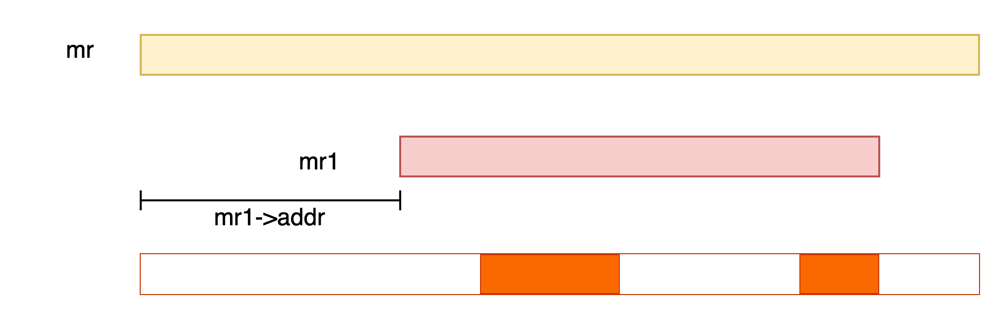
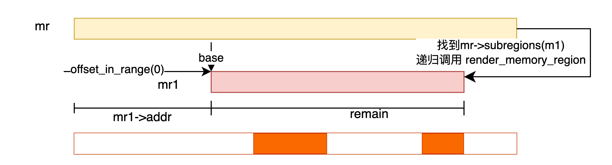
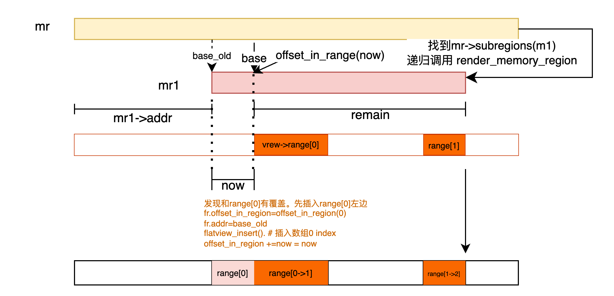
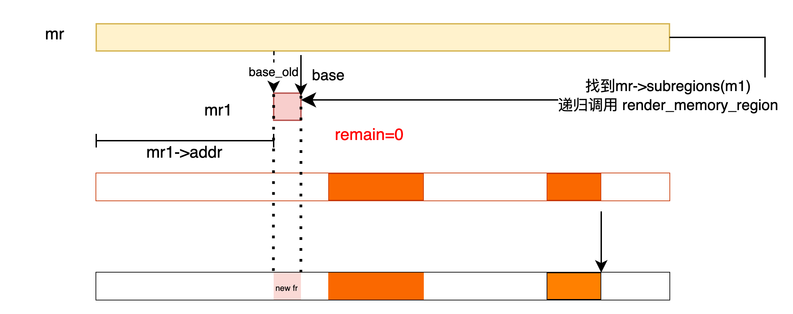
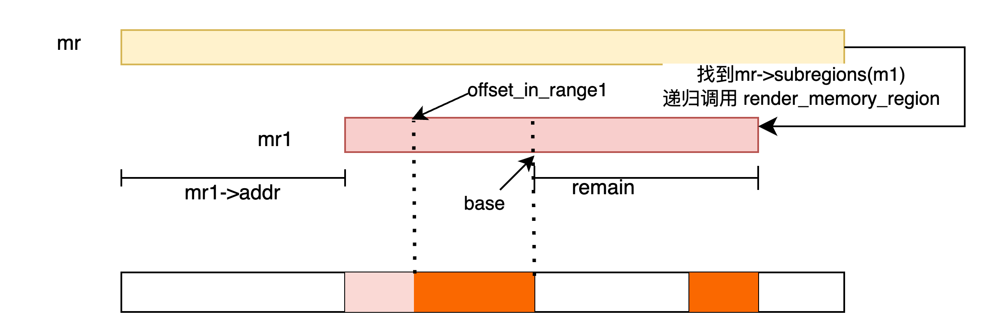
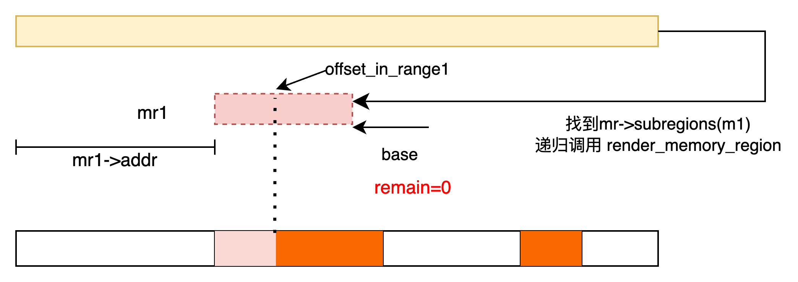
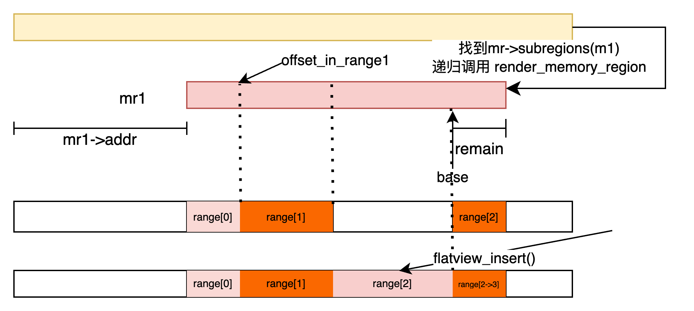
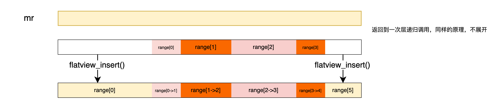

## struct 

## 内存初始化流程

### 初始化MemoryRegion
```
main
=> qemu_init
   => qemu_create_machine
   => qmp_x_exit_preconfig
      => qemu_init_board
          => machine_run_board_init
             => create_default_memdev(current_machine, mem_path, errp)
                => user_creatable_complete
                   => host_memory_backend_memory_complete
                      => ram_backend_memory_alloc
                         => memory_region_init_ram_flags_nomigrate
             => pc_init_v6_2
                => pc_init1


qemu_create_machine
   ...
   => cpu_exec_init_all
      => io_mem_init
      => memory_map_init
         => system_memory
            {
               memory_region_init(system_memory, NULL, "system", UINT64_MAX);
               address_space_init(&address_space_memory, system_memory, "memory");
            }
         => system_io
            {
                memory_region_init_io(system_io, NULL, &unassigned_io_ops, NULL, "io",
                                      65536);
                address_space_init(&address_space_io, system_io, "I/O");
            }

pc_init1
=> memory_region_init(pci_memory, NULL, "pci", UINT64_MAX);      #if pcmc->pci_enabled
=> rom_memory = pci_memory
=> pc_memory_init(pcms, system_memory, rom_memory, hole64_size);
   => ram-below-4g 
      {
         memory_region_init_alias(ram_below_4g, NULL, 
                                  "ram-below-4g", machine->ram,
                                  0, x86ms->below_4g_mem_size);
         memory_region_add_subregion(system_memory, 
                                  0, ram_below_4g);
         e820_add_entry(0, x86ms->below_4g_mem_size, 
                                  E820_RAM);
      }
   => ram-above-4g                                                #if pcmc->ram_above_4g
      {
         memory_region_init_alias(ram_above_4g, NULL, "ram-above-4g",
                                  machine->ram,
                                  x86ms->below_4g_mem_size,
                                  x86ms->above_4g_mem_size);
         memory_region_add_subregion(system_memory, 
                            x86ms->above_4g_mem_start,
                            ram_above_4g);
         e820_add_entry(x86ms->above_4g_mem_start, 
                            x86ms->above_4g_mem_size,
                            E820_RAM);

      }
   => firmware
      {
         pc_system_firmware_init(pcms, rom_memory);
         memory_region_init_ram(option_rom_mr, NULL, 
                       "pc.rom", PC_ROM_SIZE, &error_fatal);
         memory_region_add_subregion_overlap(rom_memory,
                       PC_ROM_MIN_VGA,option_rom_mr, 1);
      }
```

### 虚拟机ram分配流程 
无论是分配rom，还是ram，都会通过`memory_region_init_ram*` 相关接口
来分配虚拟机内存。
```
memory_region_init_ram_flags_nomigrate
=> memory_region_init(mr, owner, name, size)   # ==(1)==
=> init member 
   {
     mr->ram = true
     mr->terminate = true
     mr->destructor = memory_region_destructor_ram;
     mr->ram_block = qemu_ram_alloc(size, ram_flags, mr, &err)
     => qemu_ram_alloc_internal()
        => 根据host page size以及TARGET_PAGE_SIZE最大值，确定align
        => 根据align向上取整 size, max_size
        => new_block = g_malloc0()             # 相当于添加一块内存条
        => init new_block member {
              new_block->mr 
              new_block->resized
              new_block->used_length = size
              new_block->max_length = max_size;
              new_block->fd = -1
              new_block->guest_memfd = -1
           }
        => ram_block_add(new_block, &local_err) # 相当于把内存条，添加到系统中
   }
```
1. `memory_region_init()` 参数:
   + **MemoryRegion *mr**: 要初始化的mr的名称
   + **Object *owner**: 表示上一级的mr
   + **char *name**: "pc.ram", "pc.bios","pc.rom"
   + **uint64 size**: mr 的 size
2. `qemu_ram_alloc_internal` 参数
   + size: 当前的内存条大小
   + max_size: 该内存条最大的大小
   + resized: resize的callbak
   + host: 表示虚拟机物理内存对应的QEMU进程地址空间的虚拟内存
   + ram_flags:
   + mr: 该`RAMBlock`所属的`MemoryRegion`


ram_block_add
```sh
ram_block_add
=> old_ram_size = last_ram_page()  # 注意，这里使用的是max_length
                                   # 遍历所有RAMBlock, 找到最大的`block->offset +
                                   #  block->max_length`

=> new_block->offset = find_ram_offset(new_block->max_length)  # ==(1)==
   {
      这个代码比较晦涩，我们总结下这个流程所干的事情。该函数最终是要返回一个offset，
      该代码最终要从各个现有的`RAMBlock` gap 中找到一个最小的mingap, 然后将
      返回mingap的begin。
   }
=> if (!new_block->host)                                       # 表示还未映射虚拟内存
   {
      new_block->host = qemu_anon_ram_alloc(
            new_block->max_length,
            &new_block->mr->align,
            shared, noreserve);
         => qemu_ram_mmap
            => mmap_activate
               => mmap
      memory_try_enable_merging(new_block->host, new_block->max_length);
         => qemu_madvise(addr, len, QEMU_MADV_MERGEABLE);       # 设置该内存可以使用KSM合并
            => madvise
   }
=> guest memfd 处理     # 这个先越过
=> new_ram_size=MAX(old_ram_size, new_block->offset + max_length)
=> if new_ram_size > old_ram_size                               # ==(2)==
       dirty_memory_extend(old_ram_size, new_ram_size);         # 如果新的ram size比old ram size大
                                                                # 则extend dirty memory, 这个和脏页bitmap有关
=> insert new_block to ram_list.blocks
=> cpu_physical_memory_set_dirty_range
=> madvise(...)
```
1. 我们展开下这个函数代码:
   <details markdown=1 open>
   <summary>find_ram_offset代码展开</summary>

   ```cpp
   static ram_addr_t find_ram_offset(ram_addr_t size)
   {
       RAMBlock *block, *next_block;
       ram_addr_t offset = RAM_ADDR_MAX, mingap = RAM_ADDR_MAX;
   
       ...
       //第一层循环，遍历每个block
       RAMBLOCK_FOREACH(block) {
           ram_addr_t candidate, next = RAM_ADDR_MAX;
   
           /* Align blocks to start on a 'long' in the bitmap
            * which makes the bitmap sync'ing take the fast path.
            */
           //获取当前block(L1)的end
           candidate = block->offset + block->max_length;
           candidate = ROUND_UP(candidate, BITS_PER_LONG << TARGET_PAGE_BITS);
   
           /* Search for the closest following block
            * and find the gap.
            */
           //第二层循环遍历block(L2), 查找队列中L2.begin - L1.end
           //值最小的, 其实也就类似与相邻的
           RAMBLOCK_FOREACH(next_block) {
               if (next_block->offset >= candidate) {
                   next = MIN(next, next_block->offset);
               }
           }
   
           /* If it fits remember our place and remember the size
            * of gap, but keep going so that we might find a smaller
            * gap to fill so avoiding fragmentation.
            */
           //需要满足，该gap的大小一定要 > size(new_block->max_length)
           //同时去每一轮L1 循环中最小的值
           if (next - candidate >= size && next - candidate < mingap) {
               offset = candidate;
               mingap = next - candidate;
           }
   
           trace_find_ram_offset_loop(size, candidate, offset, next, mingap);
       }
       ...
   
       return offset
   }
   ```

   </details>
2. <font color=red size=5>脏页相关处理，我们放在....看(未完成)</font>

### 小结

本节描述的是AddressSpace的创建，以及添加MemoryRegion，以及初始化
RAMBlock的流程, 通过上述流程，构建出了虚拟机的物理内存布局，QEMU
这边还需要做的是，将这些地址空间, GPA space(以及QEMU VA space)传
递给KVM。

## 内存布局的提交

### MemoryListene

上一节其实描述的是内存布局的改变过程。对于内存布局改变，可能需要通知到
KVM, 来改变kvm mmu。

其实内存布局的改变，不只是影响到KVM内存虚拟化模块，可能还有其他模块,
例如vfio 等等，所以QEMU 抽象了一个`MemoryListener`机制, 在每次内存
布局发生变化时，可以通知到相关`MemoryListener`, 而 `KVM Memory Listener`
所干的事情， 就是通知KVM，改变`GPA->HPA`的映射关系.

数据结构:

```cpp
struct MemoryListener {
    void (*begin)(MemoryListener *listener);
    void (*commit)(MemoryListener *listener);
    void (*region_add)(MemoryListener *listener, MemoryRegionSection *section);
    void (*region_del)(MemoryListener *listener, MemoryRegionSection *section);
    void (*region_nop)(MemoryListener *listener, MemoryRegionSection *section);
    ... log 相关 ...
    ... eventfd相关 ...
    unsigned priority;
    const char *name;
    AddressSpace *address_space;
    QTAILQ_ENTRY(MemoryListener) link;
    QTAILQ_ENTRY(MemoryListener) link_as;
}
```
* begin: 在执行内存变更之前所需执行的函数
* commit: 在执行内存变更
* region_xxx: 添加, 删除region
* log_xxx: 脏页机制, 开启同步
* priority: 优先级, **优先级低** 的在 **add** 时会被 **先调用** , **del** 时会被 **后** 调用
* address_space: address_space of this listener
* link: 将各个`MemoryListener`链接起来
* link_as: as表示 `AddressSpace` , 所以将相同AddressSpace的 Listener链接起来

#### MemoryListener REGSITER
我们以 kvm MemoryListener 为例
```
kvm_init
   => kvm_memory_listener_register(s, &s->memory_listener,
                             &address_space_memory, 
                             0, "kvm-memory");
   => memory_listener_register(&kvm_io_listener,
                         &address_space_io);
```
有两个空间的注册，一个是`address_space_memory`, 还有一个是`address_space_io`,
我们以`address_space_memory`为例。


```sh
kvm_memory_listener_register            # 内存空间
=> assign listeners member: callbak and others
   { 
     region_add = kvm_region_add
     region_del = kvm_region_del
     commit = kvm_region_commit
     priority = MEMORY_LISTENER_PRIORITY_ACCEL; # 10 very high
     ...
     log_xxx
   }
   =>memory_listener_register()
```
`memory_listener_register`具体代码

```sh
void memory_listener_register(MemoryListener *listener, AddressSpace *as)

=> listeners->address_space = as
=> 链接到memory_listeners 全局list中, 按照priority 从小到大排列
=> 将listeners 链接到 as->listeners 链表中, 同样按照从小到大排列
   => listener_add_address_space(listener, as)
```

这里注册了一个listener, 所以需要执行对该as 的 所有region 进行
`region_add()` update transaction

由于上面的register流程，触发了一个add transaction(`listener_add_address_space`),
将会走一个完整的transaction commmit的流程，主要分为三个动作。

* begin
* add
* commit

具体流程如下:

```sh
listener_add_address_space
=> listener->begin()
=> if(global_dirty_tracking)  listener->log_global_start()
=> 获取当前 flatview
   {
     address_space_get_flatview()
     => while(!flatview_ref(view))
        view = address_space_to_flatview()
          => qatomic_rcu_read(&as->current_map); 
     # current_map表示当前的flatview, 并且如果有人replace as->current_map,
     # 则as->current_map 返回false, 
     # flatview_ref
     # => qatomic_fetch_inc_nonzero() > 0 atomic_fetch_inc return old value
   }
=> 遍历之前的view, 添加每一个 MemoryRegionSection

     listener->log_stop()
     listener->region_add()
   }
=> listener->commit()
```
该流程先获取了当前的flatview(flatview可以认为是对该address space，平坦内存的视角), 
因为该listener是刚创建的, 所以需要对flatview 中的各个region都需要做add动作。做完
add动作后，再调用`commit()` callbak。 

我们之后章节会以kvm MemoryListener为例来看下涉及的各个callbak

#### MemoryListener Commit 
上面流程是从MemoryListener 注册的流程中触发了一次add transaction 
commit, 而除此之外，其他流程也可能对该MemoryRegion 进行update，
从而触发MemoryListener:

> <font color="red" size=5 markdown=1>
> 之后，补充vfio增加新的AddressSpace，从而触发listener 的流程
> </font>
{: .prompt-warning}

这个过程通过`memory_region_transaction_commit` 实现

```sh
memory_region_transaction_commit
=> depth处理
=> pending处理
=> flatview_reset()
=> MEMORY_LISTENER_CALL_GLOBAL(begin, Forward);
   {
      => foreach entry listener: listener->begin()
   }
=> foreach entry address space
   {
      => address_space_set_flatview()
      => address_space_update_ioeventfds()
   }
=> MEMORY_LISTENER_CALL_GLOBAL(commit, Forward)
   {
      => foreach entry listener: listener->commit()
   }
```
先调用begin进行一些初始化工作，在遍历各个address space， 
来更新flatview，同时，可能涉及 会调用memory listener
的`region_add()`,`region_del()`, 再遍历各个memory 
listener 完成 commit回调


## flatview

通过在`qemu monitor`中执行 info mtree, 可以发现用各个memory region
展示的address space, 是一个树状结构，并且算上alias，应该是一个无环图.
但是我们在进行MemoryListener 的commit 操作时，需要的是一个平坦视角
的region 集合。

而qemu的flatview 就时完成上述工作.

先看相关数据结构:

**AddressSpace**:

```cpp
struct AddressSpace {
    ...
    /* Accessed via RCU.  */
    struct FlatView *current_map;
    ...
};
```
* current_map: 表示该AddressSpace对应的Flatview

**FlatView**:

```cpp
struct FlatView {
    struct rcu_head rcu;
    unsigned ref;
    FlatRange *ranges;
    unsigned nr;
    unsigned nr_allocated;
    struct AddressSpaceDispatch *dispatch;
    MemoryRegion *root;
};
```
* FlatRange *ranges: 这里表示, 该平坦模型的每个区域
* nr: FlagRange 的个数
* nr_allocated: 表示已经分配的FlagRange的个数
* AddressSpaceDispatch: 之后分析
* MemoryRegion *root: address space 的 root mr

FlatRange:
```cpp
struct FlatRange {
    MemoryRegion *mr;
    hwaddr offset_in_region;
    AddrRange addr;
    uint8_t dirty_log_mask;
    bool romd_mode;
    bool readonly;
    bool nonvolatile;
};
```
* addr.start: 该range的起点
* addr.size
* romd_mode:
* readonly: 示内存范围是否为只读
* romd_mode：表示该范围是否处于ROM数据模式
* nonvolatile: 表示该range是否易失

FlatView 和 FlatRange 数组关系:
```
 FlagView

+-------+----+
|ranges      |
+------------+       FlatRange arr
|nr          +-------+----+
+------------+       |r1  +----+
|nr_allocated|       +----+    |
+------------+       |r2  +----+---+
                     +----+    |   |                            
                     |r3  +----+---+----+                       
                     +----+    |   |    |                       
                     |... |    |   |    |                       
                     +----+    |   |    |                       
                               |   |    |                       
                     +--------++--++--+-+-+-------------------+
     vm pa addrspace |        |r1 |r2 |r3 |                   |
                     +--------+-+-+---+---+-------------------+
                                |
                                |
                              r1.addr.start
```

具体函数流程在`generate_memory_topology`:
```sh
generate_memory_topology
  => flatview_new()                  # 创建一个新的view
  # 会递归调用，相当于把MemoryRegion
  # 展开，分成若干个FlagRange, 添加
  # 到FlatView中
  => render_memory_region(view, mr, int128_zero(),
                     addrrange_make(int128_zero(), int128_2_64()),
                     false, false, false);
  => flatview_simplify()             # 将FlatView中的 FlagRange 能合并的进行合并
  => address_space_dispatch_new()    # 创建一个新的dispatch
  => foreach view->ranges
     {
        => flatview_add_to_dispatch() # 将各个FlagRange添加到dispatch中
     }
  => address_space_dispatch_compact()
  => g_hash_table_replace(flat_views, mr, view);
```
我们直接展开上面提到的一些函数:

### render_memory_region

看一下`render_memory_region`参数:
```cpp
static void render_memory_region(FlatView *view,
                                 MemoryRegion *mr,
                                 Int128 base,
                                 AddrRange clip,
                                 bool readonly,
                                 bool nonvolatile,
                                 bool unmergeable);
```
* view: FlatView, FlatView一定是站在 AddressSpace 层级下的, 而并非某个 memory region
* mr: 需要展开的MemoryRegion
* base: 表示要展开的 MemoryRegion的的begin处在物理地址的offset
* clip: 表示物理地址的一个区间
* readonly, nonvolatile, unmergeable : MemoryRegion  attr

我们展开看`render_memory_region`的代码, 该代码比较复杂，我们用一个, 
例子来展示:



目前flatview中有两个range(橙色), 然后对mr调用`render_memory_region`,
mr中有一个子mr，为mr1, `mr1->addr` 不为0

#### render_memory_region -- part 1

```cpp
static void render_memory_region(FlatView *view,
                                 MemoryRegion *mr,
                                 Int128 base,
                                 AddrRange clip,
                                 bool readonly,
                                 bool nonvolatile,
                                 bool unmergeable)
{
    MemoryRegion *subregion;
    unsigned i;
    hwaddr offset_in_region;
    Int128 remain;
    Int128 now;
    FlatRange fr;
    AddrRange tmp;

    if (!mr->enabled) {
        return;
    }
    //先加上base==(3.1)==
    int128_addto(&base, int128_make64(mr->addr));
    readonly |= mr->readonly;
    nonvolatile |= mr->nonvolatile;
    unmergeable |= mr->unmergeable;

    
    //跟据 base和size定义AddrRange，作为本次要操作的
    //MemoryRegion的地址范围
    
    tmp = addrrange_make(base, mr->size);

    // 查看这两者是否有重叠,  如果没有重叠，说明
    // 该MemoryRegion中没有clip中想要的地址范围，
    // 无需更新FlatView
    // ==(1)==
    /*
     */

    if (!addrrange_intersects(tmp, clip)) {
        return;
    }

    //取交集 
    //
    //==(2)==
    clip = addrrange_intersection(tmp, clip);

    //如果mr是alias, 该指针指向被alias的MemoryRegion. addr表示其在自己
    //视角内的物理地址 而alias_offset,  则表示该截取的被引用MemoryRegion
    //的一个偏移(基于addr的一个偏移，所以这里先减addr，再减alias_offset) 
    //
    //==(3)==                      
                                    
    if (mr->alias) {             
        int128_subfrom(&base, int128_make64(mr->alias->addr));
        int128_subfrom(&base, int128_make64(mr->alias_offset));
        render_memory_region(view, mr->alias, base, clip,
                             readonly, nonvolatile, unmergeable);
        return;
    }

    //subregion处理
    /* Render subregions in priority order. */
    QTAILQ_FOREACH(subregion, &mr->subregions, subregions_link) {
        render_memory_region(view, subregion, base, clip,
                             readonly, nonvolatile, unmergeable);
    }

    ...
}
```
<details markdown=1>
<summary>部分代码解释</summary>

1. `addrrange_intersects`代码
   ```cpp
   static bool addrrange_intersects(AddrRange r1, AddrRange r2)
   {
       return addrrange_contains(r1, r2.start)
           || addrrange_contains(r2, r1.start);
   }
   ```
   判断逻辑也很简单，就是看r1中是否有r2的start，或者r2
   中是否有r1 的start
2. `addrrange_intersection`代码
   ```cpp
   static AddrRange addrrange_intersection(AddrRange r1, AddrRange r2)
   {
       Int128 start = int128_max(r1.start, r2.start);
       Int128 end = int128_min(addrrange_end(r1), addrrange_end(r2));
       return addrrange_make(start, int128_sub(end, start));
   }
   ```
   取两者最大的start，和最小的end，构成一个AddrRange, 即为交集

3. 举个例子:
   ```
   memory-region: pci
     0000000000000000-ffffffffffffffff (prio -1, i/o): pci
       00000000000c0000-00000000000dffff (prio 1, rom): pc.rom
       00000000000e0000-00000000000fffff (prio 1, rom): alias isa-bios @pc.bios 0000000000020000-000000000003ffff

     memory-region: pc.bios
       00000000fffc0000-00000000ffffffff (prio 0, rom): pc.bios
   ```
   在该函数开始(3.1)给出了计算FlatView下 base的方法，就是用传过来的
   ```
   base_flat=base' + mr->addr
   ```
   而该base和实际查找的range又有一个offset
   ```
   base_region_flag = offset + base_flat
   ```
   所以综合计算可得，传入的`base'`，应为
   ```
   base'=base_flag - mr->addr = base_region_flag - mr - offset
   ```
   所以，我们来看, 如果要在pci memory 中查找，e0000该如何传递呢？
   (这时isa-bios mr->addr = 0xe000)
   ```
   render_memory_region
   base' = 0xe0000 - 0x20000 - 0xfffc0000
   => render_memroy_region  --> 递归
      {
           base = base' + mr->addr = 0xe0000 - 0x2000 - 0xfffc0000  + 0xfffc0000
                                   = 0xe0000
           
      }
   ```
</details>

经过上面代码，递归mr1



#### render_memory_region -- part2
```cpp
static void render_memory_region() 
{
    ...

    if (!mr->terminates) {
        return;
    }

    //找到clip在该region的offset
    offset_in_region = int128_get64(int128_sub(clip.start, base));
    base = clip.start;
    remain = clip.size;

    fr.mr = mr;
    fr.dirty_log_mask = memory_region_get_dirty_log_mask(mr);
    fr.romd_mode = mr->romd_mode;
    fr.readonly = readonly;
    fr.nonvolatile = nonvolatile;
    fr.unmergeable = unmergeable;

    /* Render the region itself into any gaps left by the current view. */
    for (i = 0; i < view->nr && int128_nz(remain); ++i) {
        //数组从小到大排列，这里就是找一个base < range.end 的第一个range
        if (int128_ge(base, addrrange_end(view->ranges[i].addr))) {
            continue;
        }
        //查看[base, base + remain]是否和当前region有重叠, 如果有重叠, 
i       //则先把重叠部分抠出来==(1)==
        //当然，不一定有重叠，也可能有个gap能彻底容纳该区域
        if (int128_lt(base, view->ranges[i].addr.start)) {
            //找到重叠的左边界(相当于range end, base 相当于range begin)
						//当然，不一定有重叠
            now = int128_min(remain,
                             int128_sub(view->ranges[i].addr.start, base));
            //fr在该region中的offset
            fr.offset_in_region = offset_in_region;
            //fr在FlatView中的地址
            fr.addr = addrrange_make(base, now);
            //插入到数组合适位置
            flatview_insert(view, i, &fr);
            ++i;
            //移动base， offset_in_region, 减少remain
            int128_addto(&base, now);
            offset_in_region += int128_get64(now);
            int128_subfrom(&remain, now);
        }
        //这个时候需要跳过重叠部分
        now = int128_sub(int128_min(int128_add(base, remain),
                                    addrrange_end(view->ranges[i].addr)),
                         base);
        int128_addto(&base, now);
        offset_in_region += int128_get64(now);
        int128_subfrom(&remain, now);
    }
    //重叠部分跳过后，有两种情况，一种是还有range需要处理，另一种是没有了==(2)===
    if (int128_nz(remain)) {
        //==(3)===, 处理剩余region(重叠右侧)
        fr.offset_in_region = offset_in_region;
        fr.addr = addrrange_make(base, remain);
        flatview_insert(view, i, &fr);
    }
    //返回上一级递归流程 ===(4)===
}
```
1. 如下图

   

   经过上面流程，新生成了一个range, 并插入到数组合适的位置。
   同时改变base，和remain, 所以还有remain大小的空间需要继续处理.

   当然上面也提到过，不一定需要再继续处理，如下图所示:

   

2. 还需要处理的情况(本文场景)
    
   不需要处理的情况
   

3. 我们还需要处理重叠区域右侧的range, 如下图:

    

4. 返回上一级递归流程中，我们会对mr, 和已经更新过的FlatView的各个range在做处理
   如下所示

   

## 内存分派 AddressSpaceDispatch

内存分派的需求时，给定一个AddressSpace和一个address， 能够快速找到`MemoryRegionSection`,
从而找到对应的MemoryRegion. 相关数据结构如下:

`FlatView`中`dispatch`成员存储着其AddressSpace 的 dispatch信息

```cpp
struct FlatView {
    struct AddressSpaceDispatch *dispatch;
};
```

`struct AddressSpaceDispatch` 相关数据结构:

```cpp
struct AddressSpaceDispatch {
    MemoryRegionSection *mru_section;
    /* This is a multi-level map on the physical address space.
     * The bottom level has pointers to MemoryRegionSections.
     */
    PhysPageEntry phys_map;
    PhysPageMap map;
};
```
* mru_section: Most Recently Used
* phys_map: 类似于寻址过程中的CR3, 指向第一级页表项(MemoryRegionSection)
* map: 相当于表示整套页表

`PhysPageEntry` 和`PhysPageMap`定义如下:

```cpp
struct PhysPageEntry {
    /* How many bits skip to next level (in units of L2_SIZE). 0 for a leaf. */
    uint32_t skip : 6;
     /* index into phys_sections (!skip) or phys_map_nodes (skip) */
    uint32_t ptr : 26;
};

typedef PhysPageEntry Node[P_L2_SIZE];

typedef struct PhysPageMap {
    struct rcu_head rcu;

    unsigned sections_nb;
    unsigned sections_nb_alloc;
    unsigned nodes_nb;
    unsigned nodes_nb_alloc;
    Node *nodes;
    MemoryRegionSection *sections;
} PhysPageMap;
```
PhysPageEntry:
* skip: 就类似于PMD_SHIFT
* ptr: 类似于在页表中的offset(index)

PhysPageMap:

* Nodes: 中间节点，类似于页表项
* sections: 指向所有的 MemoryRegionSections, 类似于寻址过程中的物理页面(也就是寻址的终点)
* section_nb: 表示sections成员指向的数组的有效个数（实际的数组大小)
* section_nb_alloc: sections 指向的数组, 总共分配的个数

`MemoryRegionSection`和 `FlatView`成员有点重合
```cpp
struct MemoryRegionSection {
    Int128 size;
    MemoryRegion *mr;
    FlatView *fv;
    hwaddr offset_within_region;
    hwaddr offset_within_address_space;
    bool readonly;
    bool nonvolatile;
    bool unmergeable;
};
```

* offset_within_address_space: 是不是指 `FlagRange.addr.start`

### init

在`generate_memory_topology` 函数中, 会在`render_memory_region`
调用结束之后，创建一些 dummy section:

```cpp
AddressSpaceDispatch *address_space_dispatch_new(FlatView *fv)
{
    //创建新的 AddressSpaceDispatch
    AddressSpaceDispatch *d = g_new0(AddressSpaceDispatch, 1);
    uint16_t n;

    //创建一个 dummy 的 MemoryRegionSection
    n = dummy_section(&d->map, fv, &io_mem_unassigned);
    assert(n == PHYS_SECTION_UNASSIGNED);

    d->phys_map  = (PhysPageEntry) { .ptr = PHYS_MAP_NODE_NIL, .skip = 1 };

    return d;
}

static uint16_t dummy_section(PhysPageMap *map, FlatView *fv, MemoryRegion *mr)
{
    assert(fv);
    //offset都是0， size是最大
    MemoryRegionSection section = {
        .fv = fv,
        .mr = mr,
        .offset_within_address_space = 0,
        .offset_within_region = 0,
        .size = int128_2_64(),
    };
    //加入到map中
    return phys_section_add(map, &section);
}
static uint16_t phys_section_add(PhysPageMap *map,
                                 MemoryRegionSection *section)
{
    /* The physical section number is ORed with a page-aligned
     * pointer to produce the iotlb entries.  Thus it should
     * never overflow into the page-aligned value.
     */
    assert(map->sections_nb < TARGET_PAGE_SIZE);

    //如果使用的大小等于数组大小，需要扩展数组大小
    if (map->sections_nb == map->sections_nb_alloc) {
        map->sections_nb_alloc = MAX(map->sections_nb_alloc * 2, 16);
        map->sections = g_renew(MemoryRegionSection, map->sections,
                                map->sections_nb_alloc);
    }
    //放到数组中
    map->sections[map->sections_nb] = *section;
    memory_region_ref(section->mr);
    return map->sections_nb++;
}
```

该流程主要是new了一个 AddressSpaceDispatch , 然后创建一个dummy的
`MemoryRegionSection`， 并将其更新到dispatch->map 数组中。

### add
```cpp
/*
 * The range in *section* may look like this:
 *
 *      |s|PPPPPPP|s|
 *
 * where s stands for subpage and P for page.
 */
void flatview_add_to_dispatch(FlatView *fv, MemoryRegionSection *section)
{
    MemoryRegionSection remain = *section;
    Int128 page_size = int128_make64(TARGET_PAGE_SIZE);

    /* register first subpage */
    if (remain.offset_within_address_space & ~TARGET_PAGE_MASK) {
        uint64_t left = TARGET_PAGE_ALIGN(remain.offset_within_address_space)
                        - remain.offset_within_address_space;

        MemoryRegionSection now = remain;
        now.size = int128_min(int128_make64(left), now.size);
        register_subpage(fv, &now);
        if (int128_eq(remain.size, now.size)) {
            return;
        }
        remain.size = int128_sub(remain.size, now.size);
        remain.offset_within_address_space += int128_get64(now.size);
        remain.offset_within_region += int128_get64(now.size);
    }

    /* register whole pages */
    if (int128_ge(remain.size, page_size)) {
        MemoryRegionSection now = remain;
        now.size = int128_and(now.size, int128_neg(page_size));
        register_multipage(fv, &now);
        if (int128_eq(remain.size, now.size)) {
            return;
        }
        remain.size = int128_sub(remain.size, now.size);
        remain.offset_within_address_space += int128_get64(now.size);
        remain.offset_within_region += int128_get64(now.size);
    }

    /* register last subpage */
    register_subpage(fv, &remain);
}
```
1. 


## kvm MemoryListener ops: begin, add(del), commit

* kvm_region_add
  ```sh
  => update = g_new0(KVMMemoryUpdate, 1);
  => update->section = *section;
  => QSIMPLEQ_INSERT_TAIL(&kml->transaction_add, update, next);
  ```
  大概流程是，创建一个`KVMMemoryUpdate`, 并且初始化其section成员，
  将其链接到`kml(KVMMemoryListener)->transaction_add`链表上

* kvm_region_del
  ```sh
  => update = g_new0(KVMMemoryUpdate, 1);
  => update->section = *section;
  => QSIMPLEQ_INSERT_TAIL(&kml->transaction_del, update, next);
  ```
  前面两个操作类似，不过是将其链接到 `kml->transaction_del` 链表上

* kvm_region_commit

  该流程主要将 as update transaction 进行commit对于`region_add()`/
  `region_del()`来说主要是将 `kml->transaction_del(add)`链表上未
  commit的region更新

  ```sh
  => 首先判断del的range和add的range是否overlaps
     NOTE: 这里算法默认认为两个链表是从小到大排序好的，但是kvm_region_add()
     并没有这个保证
     {
       if (range_overlaps_range(&r1, &r2)) need_inhibit = true; break;
     }
     如果overlap了， 则赋值 need_inhibit, 并如下调用accel_ioctl_inhibit_begin()
  => kvm_slot_lock()
  => if (need_inhibit) accel_ioctl_inhibit_begin() # 作用未知
  => 遍历kml->transaction_del list，对每一个KVMMemoryUpdate 调用kvm_set_phys_mem(,,false)
  => 遍历kml->transaction_del list, 对每一个KVMMemoryUpdate 调用kvm_set_phys_mem(,,true)
  => if (need_inhibit) accel_ioctl_inhibit_end() # 作用未知
  ```
可以看到该流程比较简单，就是通过add/del callbak，将所需要添加删除的region, 添加到
相应链表上，在commit 中集中通知kvm增删。

然后通知KVM流程, 该流程主要是构建
```sh
kvm_vm_ioctl(s, KVM_SET_USER_MEMORY_REGION, kvm_userspace_memory_region2 *mem);
```
所需要的相关参数，实际上就是`kvm_userspace_memory_region`(对于 memfd的mr来说，是
`struct kvm_userspace_memory_region2`
```cpp
struct kvm_userspace_memory_region {
    __u32 slot;
    __u32 flags;
    __u64 guest_phys_addr;
    __u64 memory_size; /* bytes */
    __u64 userspace_addr; /* start of the userspace allocated memory */
};
```
* slot: slot index
* flags: 该slot的属性，例如KVM_MEM_READONLY, 定义只读
* guest_phys_addr: GPA
* memory_size: slot region size
* userspace_addr: QEMU VA

`kvm_set_phys_mem`代码, 来看下各个成员的构建
```sh
kvm_set_phys_mem
   => 对其
   # 构建kvm_userspace_memory_region member
   #    userspace_addr: ram
   #    memory_size: size
   #    guest_phys_addr
   # MemoryRegionSection的作用是映射某个mr中的中的
   # 一部分到AddressSpace中的平坦视角, 之后的章节，
   # 我们会详细介绍，这里只需要知道, 可以通过
   # MemoryRegionSection获取到 AddressSapce 中平坦
   # 视角的一个addr(offset), 以及MemoryRegion中对应的
   # 一个addr，以及其size
   => memory_size, guest_phys_addr
      {
         size = kvm_align_section(section, &start_addr); 
         {
            => 将section->offset_within_address_space 
               进行host page size 向上取整, 获取到一个值
               作为 guest_phys_addr
            => 因为向上取整了，所以size将会变小，这里重新
               计算一个减去取整的区间，然后在做page size 
               mask，重新得到一个size。作为memory_size
         }
      }
   => userspace_addr 
      {
         # 由于上面 kvm_align_section 的操作，会对guest_phys_addr
         # 进行向上取整。所以这里获取ram时，也得做一个相应的delta
         # mr_offset = section->offset_within_region + delta
         #           = section->offset_within_region + (current - record_in_section)
         #           = section->offset_within_region + start_addr - 
         #                     section->offset_within_address_space            
         mr_offset = section->offset_within_region + start_addr -
              section->offset_within_address_space;
         # 通过mr得到相应的RAMBlock, 然后，获取到qemu va
         ram = memory_region_get_ram_ptr(mr) + mr_offset;
         {
             => 通过alias映射找到最终的mr
             => qemu_map_ram_ptr(mr->ram_block, offset);
                => ramblock_ptr(block, addr);
                   => block->host + offset
         }
      }
   # 该流程区分 add / del 操作
   => if del:
      => find KVMSlot
      => kvm_slot_get_dirty_log                     # get dirty log
         => kvm_vm_ioctl(s, KVM_GET_DIRTY_LOG, &d)
      => sync dirty page
      => kvm_set_user_memory_region(,,false)
         => mem.memory_size = 0                     # 如果memory_size为0, kvm 认为要删除slot
         => kvm_vm_ioctl(s, KVM_SET_USER_MEMORY_REGION, &mem);
   => if add:
      => kvm_slot_init_dirty_bitmap
      => kvm_set_user_memory_region(,, true);
         => mem.memory_size = slot->memory_size
         => kvm_vm_ioctl(s, KVM_SET_USER_MEMORY_REGION, &mem);
```

