- [introduce](#introduce)
  - [Backgroud](#backgroud)
  - [MAIN features](#main-features)
- [overflow](#overflow)
  - [object (abstract)](#object-(abstract))
  - [concrete definition](#concrete-definition)
- [MONITOR](#MONITOR)
- [CONTROL](#CONTROL)

## introduce
Intel RDT技术提供了一种硬件机制，对内存方面的共享资源(例如L2, L3 cache, 
memory bandwidth) 进行monitor 和 allocate. 

### Backgroud

资源分配无论在现实生活还是在计算机系统中, 一直有一个难题：

如何将资源, 进行更合理的分配。而资源分配使用，无非就几种方式:

* share
* split
* isolate

我们一方希望资源可以被共享，让资源的利用率最大化，另一方面，我们又希望
自己有个独立的资源，用于更频繁的使用，并且不希望别人占用过多的其他公共
资源。所以，我们又希望将资源split，然后isolate。两者在某种程度上是对立的.

举一个例子。有一个村庄，每个人共享村庄里的土地资源，但是为了更方便的生活，
大家为自己的家庭盖了房子。每个家庭情况不一样，有的家庭物品多，多的放不下，
有的家庭物品少，大部分房间都是空的。这样做看起来空间利用率不是很高，
但是大家找东西方便了，只在自己家找就行了。

但是，某一天该城市发生了战争，每个村民物资种类不够，有的人种蔬菜，有的人
种粮食，大家需要共享，但是从村南五环到村北五环太远了。于是村长想出了一个
方案，大家都把自己富余物资收集到村委会，由村委会来调配物资，供大家吃饱穿暖。
一开始村委会的策略比较简单，按需分配，大家需要多少就分多少。

但是有些大聪明耍起了小聪明，每次找村委会要很多物资，吃不了放地库囤着。那大家
肯定不乐意啊，于是大家商量了下，按人头分配，每个人分配到的物资是固定的。这样，
某些村民饭量小，吃不了. 而有些村民饭量大, 吃不够...

于是村长又开始新一轮的分配策略...

而在计算机的内存子系统来看，也是类似的情况。(甚至与整个计算机体系，一直在share， 
isolate 中纠结演变), 为什么支持多核，就是为了让多个cpu共享内存, io 等其他资源。
另外支持smp后，每个cpu core希望有一个很方便，独占的访问空间，例如l1, l2 cache. 
但是随着smp core的增加，维护各个cache之间的一致性的代价又很大(尤其
是在多numa场景下). 于是NUMA aware kernel会尽量避免跨numa调度。

另外随着单个计算节点的资源越多，其上面的应用更多更复杂，并且随虚拟化技术兴起, 
对资源隔离的需求也逐渐增大。而软件层面，Linux 中的cgroup 技术可以对很多资源做隔
离和限制，例如，CPU, memory 使用量, block io 带宽 等等。但是，关于cache, 
memory bandwidth 等共享资源，由于没有硬件的辅助手段进行monitor 和control，
一直是个空白。

直到Intel推出了RDT技术。

> 关于cache和 memory bandwidth 如何在多个cpu core之间，以及cpu core 和 IO
> 之间共享的，我们在这里简单列个图介绍下，关于更多细节. 请参考, CMU 关于 
> cache coherence 的相关课程6,7
> 
> 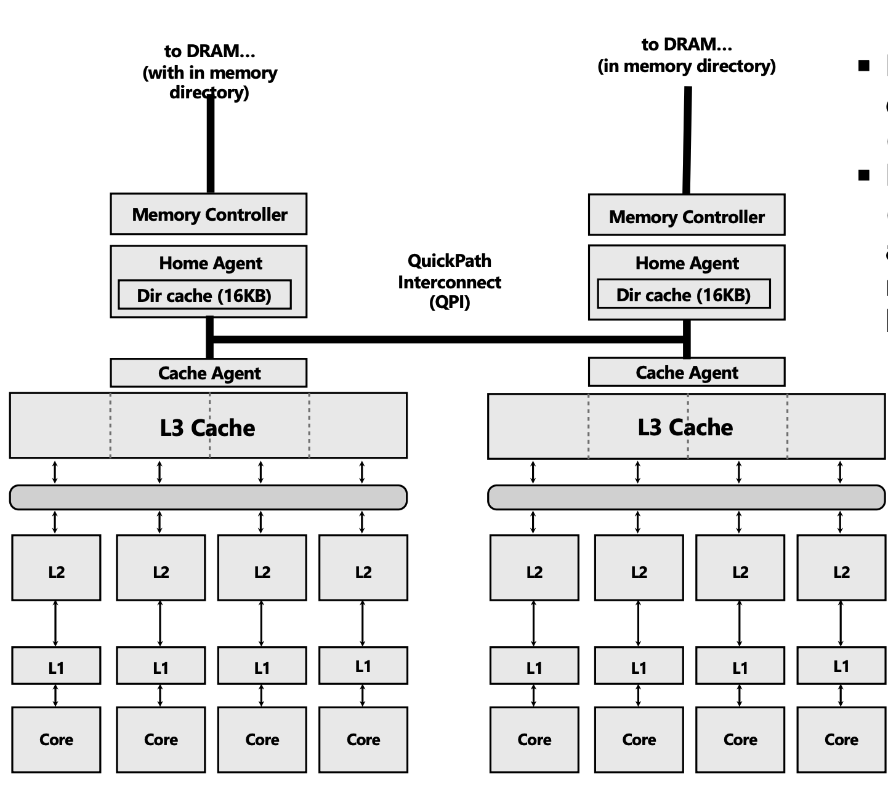 
> 
> 在这个系统中 每个numa上有四个core，每个core独享l1,
> l2 cache ，每个numa共享l3 cache，每个numa有一个memory
> control，链接各自的DRAM。而各个numa 之间，使用QPI 进行
> interconnect，用来维护cache coherence.
>
> 从这个图中可以看出，关于L3 cache, 其share scope 是一个
> numa node, 而memory bandwidth，则是所有cpu core。（虽然
> 每个numa上的memory controlller 链接各自的DRAM， 但是其他
> numa仍然可以通过QPI，来请求该numa上的memory)
{: .prompt-tip}

### MAIN features

[introduce](#introduce)章节中提到Intel RDT 技术主要围绕两个功能展开:`monitor`,`allocate(control)`,
而monitor和control的既包括cpu agent（logic cpu core), 也包括 non-cpu agent
(io设备DMA也和cpu之间共享cache和memory).

> 本文暂不介绍non-cpu agent 的相关内容. 之后介绍的所有的内容，都是基于cpu agent。
{: .prompt-warning}

所以本章节，我们将这两个功能展开，来看下，其提供的一些子功能。
* <strong>monitor</strong>

  |feature|简称|作用|
  |--|--|--|
  |Cache Monitor Technology|CMT|监控L2/L3 cache的使用|
  |Memory BandWidth Monitor|MBM|监控带宽使用|

* <strong>control(allocate)</strong>

  |feature|简称|作用|
  |--|--|--|
  |Cache Allocation Technology|CAT|控制 L2, L3 cache 分配|
  |Code and Data Prioritization|CDP|在L2, L3中icache和dcache是共享的， 该功能可以细粒度控制icache/dcache 各自的占用|
  |Memory BandWidth Allocation|MBA|控制带宽分配|

如前面章节提到的，RDT 其子功能也是围绕着cache，memory ndwidth 共享资源，提供
提供监控和控制能力。

## overflow

无论是monitor还是control，都得为其划分针对的"对象"。而这又
引出了一系列的问题(正如前面所说, 我们仅关注cpu-agent):

* 如何规定对象形态? (per-cpu? per-timestamp? per-xxx?)
* 软件如何配置当前cpu上下文是属于哪个对象?
* 软件配置后，硬件如何识别当前访存指令属于哪个对象？

该章节，我们围绕"对象"来看下，RDT的控制粒度，以及其大概的实现细节。

### object (abstract)

RDT 为了让软件可以更灵活的配置，在application 和 logic core 之间定义了一个
抽象层: TAGS。software 可以为logic core 定义不同的tags，然后可以为不同的
application 分配不同的tags, 从而完成不同粒度的监控/控制。

大体流程，如下图所示:

* monitor:

  

  软件可以配置当前进程上下文，是属于哪个TAG，然后在切换到该进程时，切换到该TAG，
  而资源计数器，也是为每个tag定义了单独的计数器。当进程执行访存指令时，根据其
  TAG更新计数器。

* control

  

  一种简单的控制方法是isolate，即为每个对象划定一个资源范围。而RDT中的CAT, CDP就是
  这样实现的。从图中可以看到，每个TAG都规定了一个资源范围，其只能访问该范围内的资源。
  软件可以自由定义其TAG所属的范围，可以让不同的tag之间是isolate 状态（TAG0， TAG1），
  也可以让其之间又overlap（TAG0/TAG1 和 TAG2)

  > cache和memory bandwidth的控制策略不同，cache使用的是isolate的策略，而memory control
  > 则是delay.
  {: .prompt-tip}

上面我们抽象的介绍了TAG, 下面我们来看下手册中的具体定义

### concrete definition

针对monitor和control功能，RDT定义了不同的TAG.

|TAG|简称|FOR|
|---|---|---|
|Resource Monitoring IDs|RMIDs|monitor|
|Classes of Sevice|CLOS|resource|

software 可以通过MSR `IA32_QM_EVTSEL` 来配置当前logic cpu context所属的 CLOS/RMID

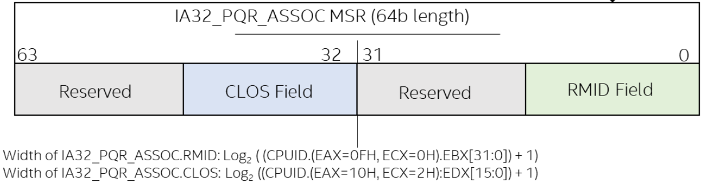

接下来，我们来分章节来看下，RDT monitor/control 子功能所其他细节。

## MONITOR

软件侧使用monitor 功能 的大致流程如下:

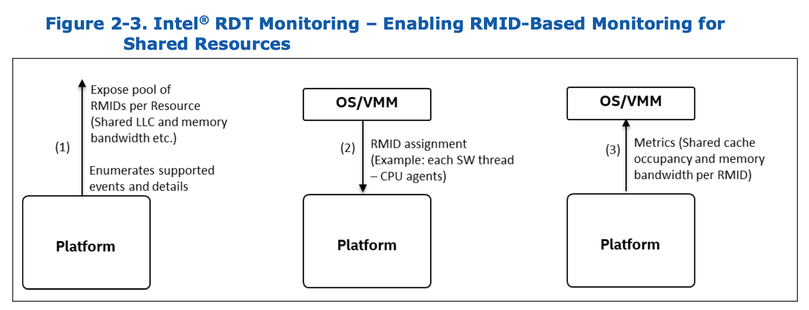

1. 通过CPUID/ACPI  来获取RDT 支持的features，以及支持RMIDs的总数量
2. software 可以通过某种方式来配置当前的RMID
3. 允许软件通过MSRs/MMIO 来收集monitor stats

我们来看下具体实现:

* CPUID: EAX=0xf, ECS=0x0, 0x1
* specfy RMID: `IA32_PQR_ASSOC`
* collect event stats: `IA32_QM_EVTSEL`, `IA32_QM_CTR`

### CPUID (EAX=0F)

CPUID.EAX[0x0F]有两个分支来展示RDT相关feature.

展开

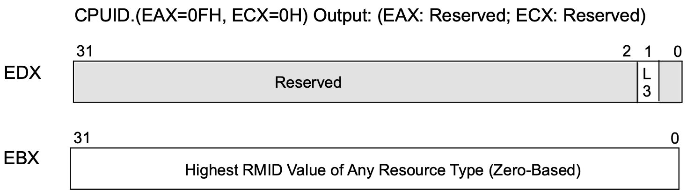

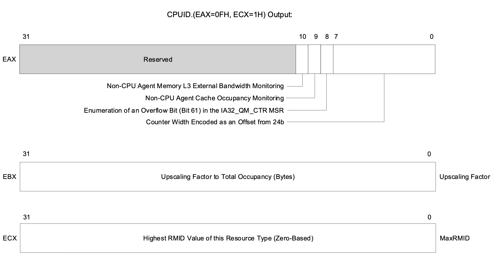

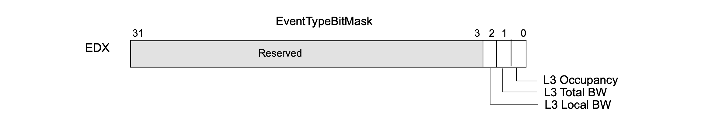

* RMIDs numbers: 
  + `CPUID.(EAX=0FH, ECX=1H).EBX` reports the highest RMID 
    value of any resource type that supports monitoring in the 
    processor.
  + `CPUID.(EAX=0FH, ECX=1H).ECX` enumerates the highest RMID value that 
    can be monitored with this resource type, see Figure 18-21.
* support Non-CPU features: `CPUID.(EAX=0FH, ECX=1H).EAX[bit 9,10]`
  + bit 9: Non-CPU Agent Cache Occupancy Monitoring
  + bit 10: Non-CPU Agent Memory L3 External Bandwidth Monitoring
* support EventType mask: `CPUID.(EAX=0FH, ECX=1H).EDX[bit 0, 1, 2]`

在[IA32_QM_EVTSEL and IA32_QM_CTR](#ia32_qm_evtsel-and-ia32_qm_ctr)
列举各个Event Type对应的EventID值, 以及其对应的feature

### IA32_PQR_ASSOC (RMID Field)

`IA32_PQR_ASSOC`我们在[concrete definition](#concrete-definition)章节介绍过,
在`MONITOR` 相关功能中, 软件需要配置其`RMID` Field 来标记
当前CPU上下文。

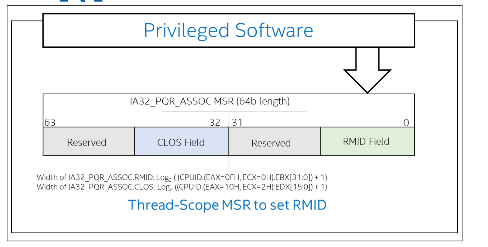

### IA32_QM_EVTSEL and IA32_QM_CTR

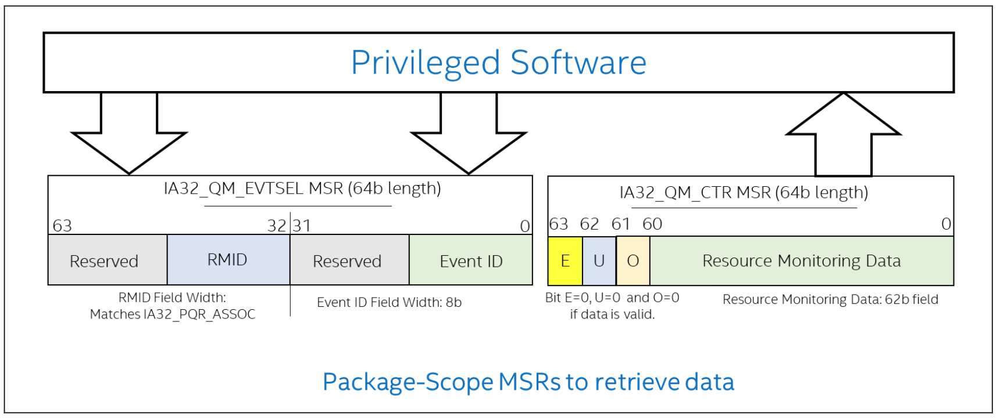

Software通过设置`IA32_QM_EVTSEL` MSR，来选择要collect的RMID
和EventID, 并通过`IA32_QM_CTR`进行query.

eventid 值如下:

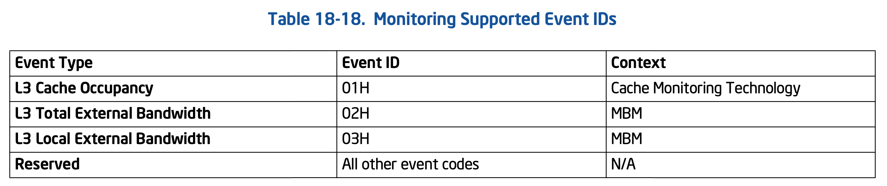

* CMT: `L3 cache occupancy`
* MBM: `L3 Total External Bandwidth` and `L3 Local External Bandwidth`

> 关于L3 local/total BW , 我们可以简单认为，某个CPU访存，触发
> 了L3 cache miss, 如果其访存地址位于local memory, 记录到L3 
> local/total BW 中; 如果其访存地址位于remote memory, 则只记录到
> L3 total BW 中.
>
> 如果要继续深入理解L3 Total External Bandwidth/L3 local External 
> Bandwidth 推荐走读CMU directory-based cache coherence 相关课程.6
{: .prompt-tip}

### CONTROL

其软件侧整体的使用流程方式和monitor功能很相似，我们来看下:

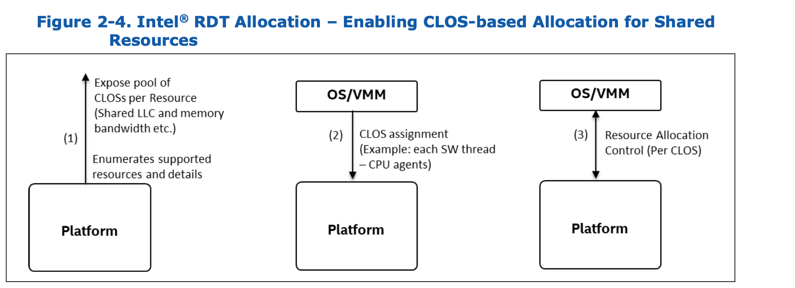

1. 通过CPUID/ACPI 获取RDT支持的feature，以及支持的CLOS总数量
2. software 可以通过某种方式配置当前CLOS
3. 允许软件通过MSR/MMIO 来进一步配置每个CLOS的资源

### CPUID (暂忽略)

（略)

### IA32_PQR_ASSOC (CLOS Field)

CAT和MBA 都使用 CLOS 最为TAG。前面提到过，和RMID一样，软件
可以通过配置 `IA32_PQR_ASSOC` MSR中的CLOS Field, 来决定当前
CPU的CLOS.

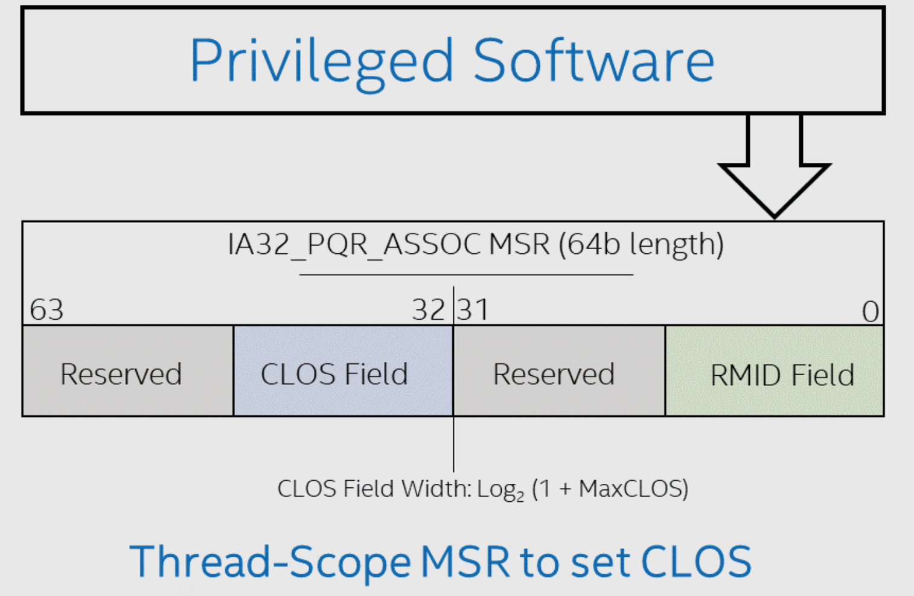

关于具体的feature，其他配置方法，我们分别来看下:

### CAT

我们先来看下CAT可以达到的效果:

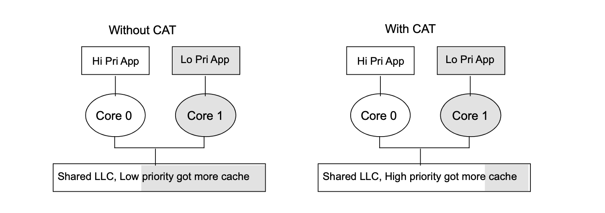

在没有cat时，某些低优先级的 application会和高优先级application共享LLC，
甚至低优先级应用在短时间内访问大量内存后，其会争抢到跟多的cache。

但是有了cat之后，限制低优先级应用的cache使用量。

前面提到，`IA32_PQR_ASSOC`中的CLOS决定了要control的对象。而`capacity bitmap`(CBM)
则决定了不同的CLOS分配的cache的区域。

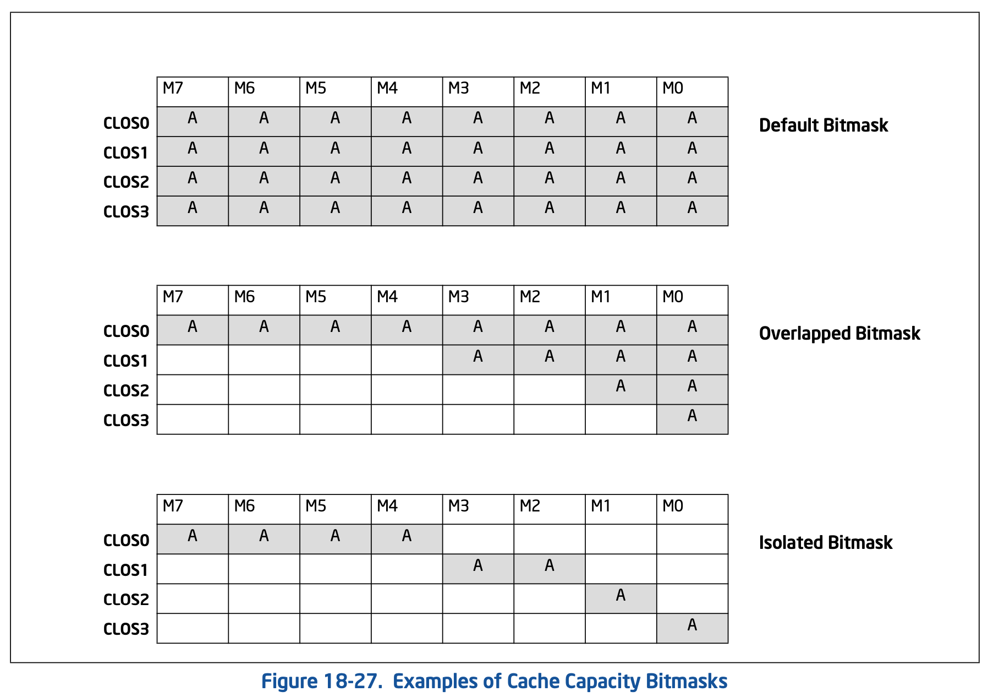

图中的每个bit可以认为一块cache资源，A 表示allocate给横轴的clos。

* in default bitmask，所有clos都分配了全部的cache，大家共享所有cache。
* in overlappd bitmask, cache of `clos0 ∈ clos1 ∈ clos2 ∈ clos3`
* in isolated bitmap, clos0，clos1，clos2，clos3 都使用独立的cache。互不冲突，其中
  cache size of ( `clos0 = 2clos1 = 4 clos2 = 4 clos3`)

<strong>那么cat是怎么做的呢?</strong>

我们很容易想到，是不是基于way做的，我们首先回顾下，cache的组相连7,8:

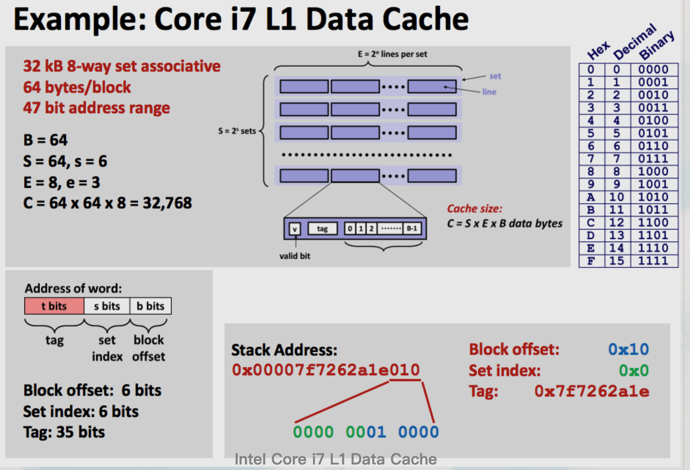

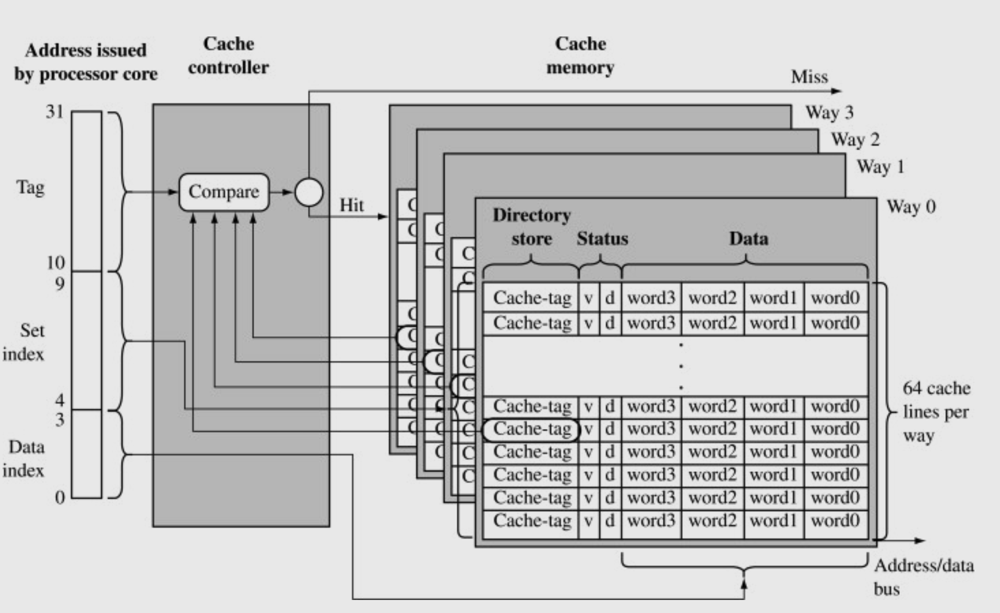

图片中描述的是某牙膏厂某代i7 l1 data cache和另一张不知名cpu的cache图，用来更方便
的看per-way cache, 具体参数如下(第一个图): 

* B=64: 每个block(cache line data part)为大小64byte
* E=8: 一共有8-way
* S=64: 每个1-way有64 个block
* cache line 总大小: 64 * 64 * 8 = 32 kbyte

每个地址可以分为三部分来索引cache.

* set index: 用来选择way index
* tag: 在每一way中选择具体的cache line
* block index: 在每个cache line中选择offset

那么，当一个地址确定时，其way index，block index已经确定，而变数就是该way中的
index. 该mask 主要用来确定，在该way中能够选择哪些index用来存储该cacheline。

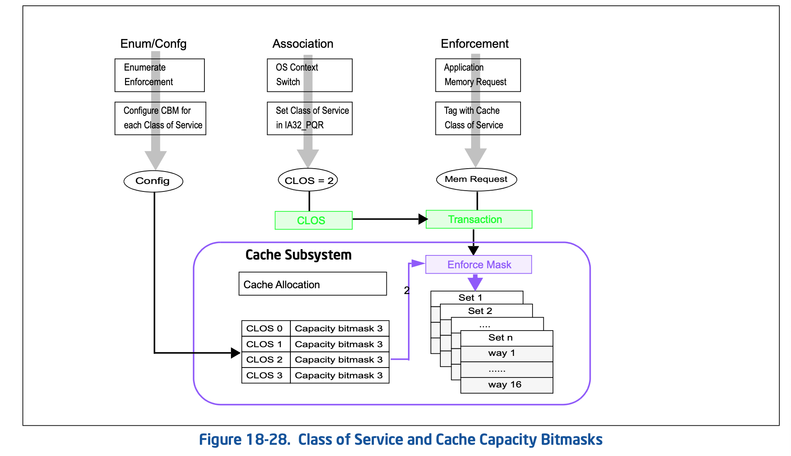

## 相关链接
1. [Intel® Resource Director Technology (Intel® RDT) Architecture Specification](https://cdrdv2-public.intel.com/789566/356688-intel-rdt-arch-spec.pdf)
1. [\[youtube\]Resource Allocation: Intel Resource Director Technology (RDT) by Fenghua Yu, Intel](https://www.youtube.com/watch?v=rKe5_xWpH8o)
2. [\[PDF\] Resource Allocation: Intel Resource Director Technology (RDT) by Fenghua Yu, Intel](https://events.static.linuxfound.org/sites/events/files/slides/cat8.pdf)
3. [Intel Resource Director Technology(RDT) -- huataihuang](https://cloud-atlas.readthedocs.io/zh-cn/latest/kernel/cpu/intel/intel_rdt/intel_rdt_arch.html)
4. [浅度剖析内核 RDT 框架 -- 苏里南公牛](https://zhuanlan.zhihu.com/p/678577734)
5. [Snooping-Based Cache Coherence](https://www.cs.cmu.edu/afs/cs/academic/class/15418-s22/www/lectures/11_snooping.pdf)
6. [Directory-Based Cache Coherence](https://www.cs.cmu.edu/afs/cs/academic/class/15418-s22/www/lectures/13_directory_coherence.pdf)
7. [\[计算机体系结构\] Cache Memory -- houmin](https://houmin.cc/posts/9bccd097/)
8. [Cache 直接映射、组相连映射以及全相连映射](https://my.oschina.net/fileoptions/blog/1630855)
