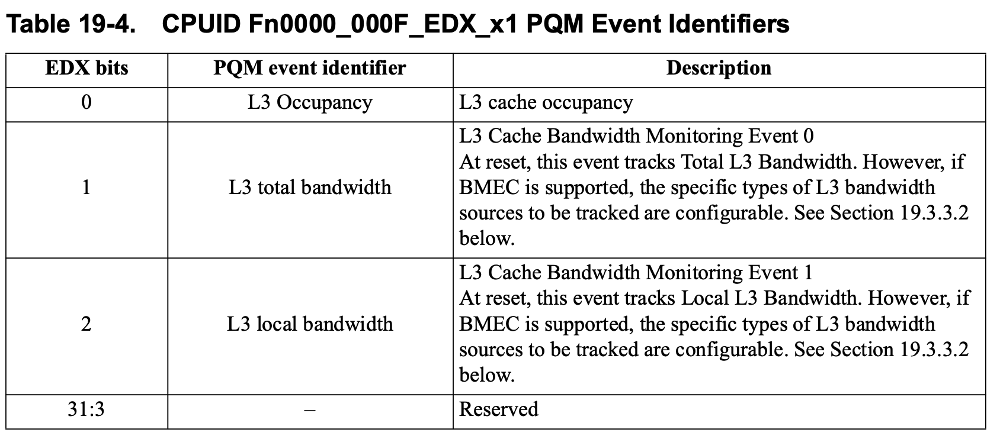
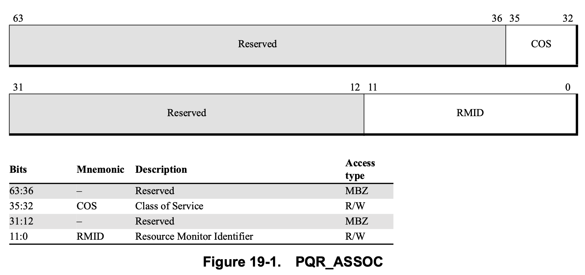
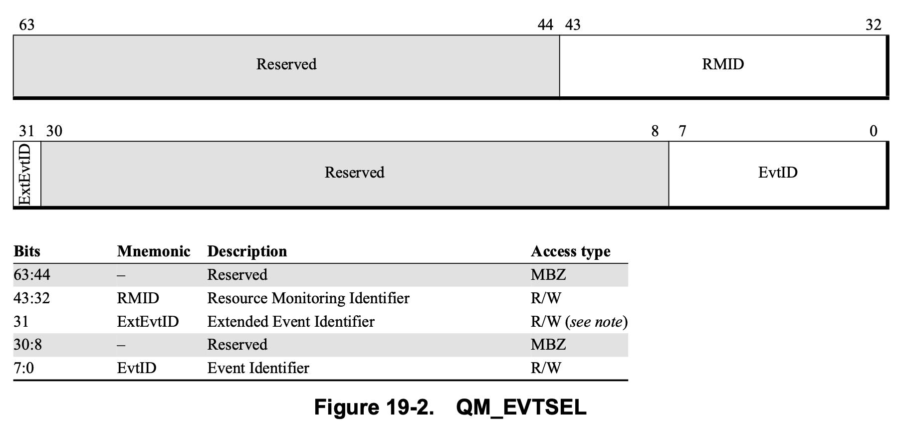
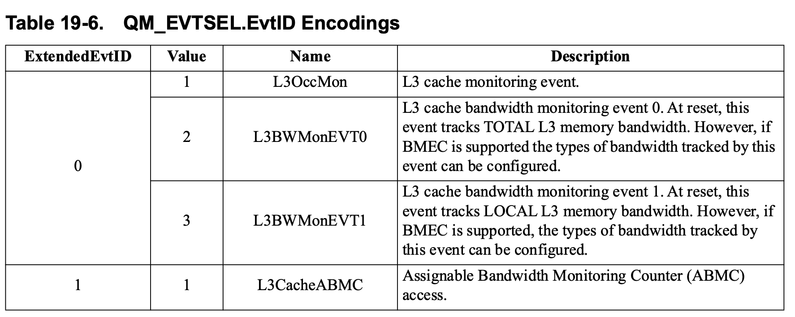
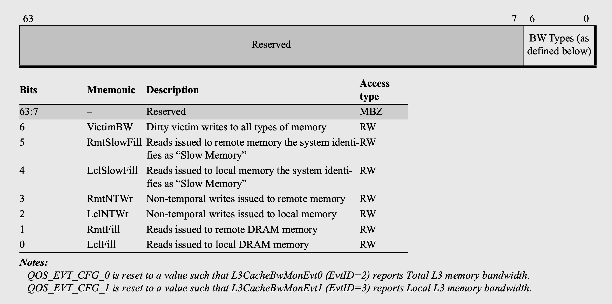
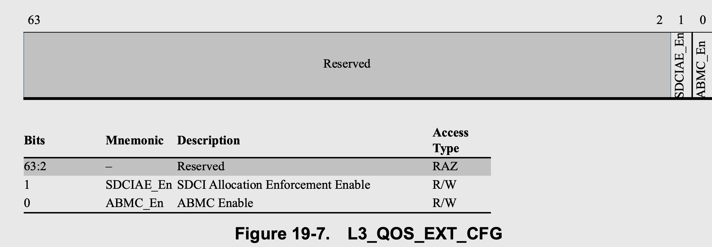

<!-- vim-markdown-toc GFM -->

* [introduce](#introduce)
* [overflow](#overflow)
  * [features](#features)
  * [features detect](#features-detect)
* [PQM](#pqm)
  * [CPUID (PQM)](#cpuid-pqm)
  * [configuration](#configuration)
    * [PQM MSR](#pqm-msr)
  * [Monitoring L3 Occupancy](#monitoring-l3-occupancy)
  * [MBM](#mbm)
    * [BMEC](#bmec)
    * [AMBC](#ambc)
* [PQE](#pqe)
  * [cat](#cat)
  * [L3BE](#l3be)
  * [L3SMBE](#l3smbe)
  * [SDCIAE](#sdciae)
* [相关链接](#相关链接)
  * [其他资讯](#其他资讯)

<!-- vim-markdown-toc -->

## introduce

amd PQOS ~= intel RDT

> amd PQOS 和 intel RDT 实在是太像了，cpuid，包括MSR命名
> 格式几乎都一样。所以，之后的很多章节，我们仅把图片粘贴上，
> 以便之后查找。
{: .prompt-info}

## overflow

### features
POS 包括两个主要的功能:

* **PQOS Monitoring(PQM)**: monitoring the usage of shared resources
  + L3 cache occupancy
  + L3 cache bandwidth
* **PQOS Enforcement(PQE)**:  set and enforce limits on usage of shared resources
  + L3 cache allocation
  + L3 cache bandwidth

### features detect
* PQE, PQM 

  通过 CPUID Fn0000_0007_EBx[PQE, PQM] 来查看PQOS主要功能检测 :

  

* PQOS Versions

  PQOS相关的attribute和capablities也使用CPUID 报告, 但是某些早期CPU使用PQOS version,
  PQOS version 和具体的 Family/Model 关系如下:

  

* capablities && attribute of PQOS
  + Fn0000_000F: PQM
  + Fn0000_0010: PQE

具体的细节，我们放到之后的章节中分别介绍。

## PQM

### CPUID (PQM)
* Fn0000_000F_EDX_x0:
  + EDX[bit 1] L3CacheMon: 是否支持L3 monitoring
  + EBX: RMID 最大值

  

* Fn0000_000F_EDX_x1: 是否支持某些monitor的sub feature
  + EAX 
    - non-zero: it indicates the size of the L3 monitoring counter, offset from 24 bits. 
    - 0: the counter size is determined by the PQOS version number

    > 在[PQM MSR](#pqm-msr)章节中会介绍
  + EBX: counter scaling factor, 在通过QM_CTR 获取到counter值的时候，
    需要在乘 scaling factor 来获取实际的 cache occupancy/bandwidth(bytes)
  + ECX: identifies the largest RMID for L3 monitoring

  + EDX[bit 0]: L3 Occupancy
  + EDX[bit 1]: L3 total bandwidth
  + EDX[bit 2]: L3 local bandwidth

  

* Fn8000_0020_EBX_x0: 包含一些PQM和PQE的一些扩展功能:

  

  其中BMEC和ABMC是PQM功能，其余都是PQE功能。

### configuration

#### PQM MSR
* PQR_ASSOC

  

* QM_EVTSEL

  

  和intel rdt不同的是, qpos似乎支持一些Extended Event

  

  Q: 为什么要这么搞呢，按照道理EvtID[bit 0-7] 可以配置255个字段, 为什么要
     弄一个类似于二维的字段呢

  A: **不知道**

* QM_CTR

  

  其中, 关于CNT_LEN 可以在 CPUID  Fn0000_000F_EAX_x1[CounterSize]中获取到。
  具体值为(CounterSize + 24)

  但是如果获取到CounterSize的值为0， 则需要根据PQOS Version 来判定:

  

### Monitoring L3 Occupancy

如前面提到eventid为1，其他略， 和rdt cat 功能一样

### MBM

MBM eventid 类型如下:


> 1. read to Local NUMA Domain: 为什么需要两个eventid。
>
> 因为
> - evtid 2 获取 total
> - evtid 3 获取 non-local
>
> 所以 local = evtid2 - evtid3
> 2.  non-temporal 参考amd sdm `4.6.1.2 Move non-temporal`, 大概的意思
> 是说，操作的数据是非临时数据，短时间内不会访问到(非临时的意思是，
> 这个数据比较稳定，现在store了一个值，短时间内不会被访问修改)
{: .prompt-tip}

从上面来看，evtid 和 并且但是其多了一些更细粒度的控制eventid功能，
主要有两个:
+ BMEC
+ AMBC

#### BMEC

BMEC feature 允许软件配置指定的L3 transcation 被监控计数。其提供了一组n个MSRs,
-- QOS_EVT_CFG_n , 其用来指定对应的L3CacheBwMonEvt<n> 对应的event id的BW type。

例如QOS_EVT_CFG_1 对应与 L3CacheBwMonEvt_1, 其对应的EvtID是3，而QOS_EVT_CFG_1则
可以配置指定EvtID 3 的 BW type, 如下图所示


上图还展示了EvtID 2 默认配置为 Total L3 Bandwidth, EvtID 3 的默认配置为 Local
L3 Bandwidth


* CPUID

  BMEC 通过cpuid 获取如下信息
  + Fn8000_0020_EBX_x0[BMEC] (bit 3): 判定BMEC功能是否支持
  + Fn8000_0020_EBX_x3[EVT_NUM] (bit 7:0): 指示 QOS_EVT_CFG 中的 n
  + CPUID Fn8000_0020_ECX_x3: 指示哪些类型的L3 tranaction 被counted

  QOS_EVT_CFG_n, n 值表示EVT_NUM ， 其在实现中 >= 2

* QOS_EVT_CFG_n MSR details

  

所以，该功能就是提供了一种方式，可以指定EvtID的BW type。可以是一个集合(QOS_EVT_CFG_n
中多个bit置位)


#### AMBC

AMBC 就更加灵活, 支持指定一组counter , 这些counter 用来计数特定的RMID（COS）,BwType, 
counterID, 并且查询这些counter时，也仍然使用`QM_EVTSEL`, `QM_CTR`. 只不过在设置
`QM_EVTSEL`时，按照另一种方式配置，下面会介绍。

我们来看下具体细节:

* CPUID: Fn8000_0020_x5
  * EAX: 指示counter的大小以及counter的overflow bit
  * EBX: 指示支持的ABMC counter的数量
  * ECX: 指示能不能在 QOS_ABMC_CFG 中的BwTSrc字段中填写COS 而非RMID

* L3_QOS_EXT_CFG

   

  该MSR 用来使能ABMC 功能.( 当然还有一个PQE相关功能 SDCIAE, 在[PQE](#pqe) 章节中会介绍)

* L3_QOS_AMBC_CFG MSR

  

  + CfgEn: 如果使能，则表示本次会配置该register 分配到（作用于) CtrID中指定的counter, 反之则不会有任何配置
  + CtrEn: 如果使能，则表示本次会使能对 Bw Type field tracking.
  + CtrID: 表明该寄存器作用与哪个counter
  + IsCOS: 指示 BwSrc 是 COS 还是RMID
  + BwSrc: COS/RMID
  + BwType: 上图中展示了。

* L3_QOS_ABMC_DEC MSR

  读取该寄存器，获取的是 QOS_EVT_CFG 的配置的值, 所以其格式和 几乎QOS_ABMC_CFG MSR相同.
  但是有一个字段需要注意下:
  + CfgErr: 如果是1， 则表示上一次配置是invalid，并且相应的counter 是not enabled.

这两个寄存器用来，获取/更新 当前 AMBC 配置.

* QM_EVTSEL - 通过下面方式选定:
  + EventedEvtID: 12
  + EvtID: L3CacheAMBC
  + RMID: 需要配置为counter id
* QM_CTR
  读取QM_EVTSEL 选定的 counter值

## PQE

PQE 功能主要分为:

+ CAT
+ CDP
+ L3 bandwidth allocation
+ L3 slow memory bandwidth allocation
+ SDCI allocation enforcement

CPUID `Fn0000_00010_EDX_x0` 用来 指示 是否支持`L3 Alloc`


CPUID `Fn0000_00010_x1_ECX_1` 来指示是否支持哪些sub-feature:
* EAX: 指示 CBM_LEN
* EBX: 指示 L3 Cache Allocation Sharing Mask
* ECX: 指示是否支持一些增强功能，例如CDP
* EDX:  指示 COS_MAX

我们分功能介绍

### cat

这里我们不过多介绍CAT, 因为大部分和rdt一样，只不过CBM对应于L3_MASK.

但是需要注意一点，CPUID Fn 0000_0010_EBX_x1[L3ShareAllocmask] 
表示其他的一些function肯定会共享这些L3 cache。所以，在L3ShareAllocMask 中bit为1时，
对应的cache即便是配置了各个CPU对应的CLOS 的L3_MASK 没有overlap，也仍然有其他的function
和该cpu争抢cache。

### L3BE

我们主要关注下这部分，其功能配置和rdt很不一样。

AMD 的带宽控制，是允许软件配置一个最大的带宽限制(通过 L3BE MSR), 该值是一个absolute bw number:
```
L3BE value ++ == limit BW + 1/8 GB/s, 所以跟rdt的比例throttle还不一样。

我们看下具体细节
```

* CPUID
  + Fn8000_0020_EBX_x0[L3BE](bit 1): 指示L3BE是否支持
  + Fn8000_0020_x1:
    - EAX[30:0]: BW LEN(下面会介绍)
    - EDX[31:0]: L3BE feature支持的最大 COS number

* L3QOS_BW_CONTROL_n MSRs （用来配置 bw limit)
 
  

  + U(unlimited): 当设置是，表明当前COS bw 不受限制，该MSR中的BW字段被忽略
  + BW: expressed in 1/8 GB/s increment

在某些时候，某个COS怎么也达不到设置的受限制，可能是由于下面原因:

1. The specified limit may be greater than the maximum system bandwidth.
   > 内存总带宽受限
2. The sum of the limits applied to all classes of service in the domain may
   exceed the maximum bandwidth the system can deliver to that COS domain.
   > 软件配置的所有其他cos limit 超过了系统能给该COS domain的最大带宽。
3. Multiple COS domains which share the same memory channels may demand more
   total bandwidth than the shared memory can supply.
   > 内存通道受限
4. I/O or other system entities may consume a large fraction of system
   bandwidth and result in less bandwidth being available to the various
   processor COS domains.
   > I/O 设备抢占带宽
5. Large amounts of write traffic may affect the memory system’s ability to
   deliver read bandwidth.
   > 写带宽影响了读带宽

手册中还举了一个例子, 大致为，有两个COSx, y. COSx 配置 limit A，
COS y 配置Limit 2 * A. 此时总带宽为 2 * A, 带宽肯定不够分，此时
分配给COS x A， COS y A， 而不是按照其比例，分配 (2/3)* A 给COS x，
(4/3) * A 给 y.

另外, 当CDP enable时，L3QOS_BW_CONTROL 只能用0, 2, 4, 6这样的index寄存器，
例如
+ COS 0 -> index 0
+ COS 1 -> index 1
+ COS 2 -> index 2

所以，该寄存器只能用一半。这样的操作很迷, 不知道为啥。

### L3SMBE

L3SMBE 配置和L3BE 很像，只不过是控制slow memory 带宽，不再赘述。

### SDCIAE

Smart Data Cache Injection 可以让I/O 设备访问L3 cache. 避免直接访问内存，
这样可以减少对内存带宽的占用。

而SDCIAE 功能则可以限制 SDCI 所占用的L3 cache的portion.

该功能页很简单，如果开启了该功能，只允许SDCI 使用L3_MASK_[MAX_COS]指示的缓存，
例如如果 MAX_COS 是15， 则SDCI 将根据 L3_MASK_15  分配缓存。

## 相关链接
1. [amd spec 19 Platform Quality of Service (PQOS) Extension](https://www.amd.com/content/dam/amd/en/documents/processor-tech-docs/programmer-references/40332.pdf)

### 其他资讯
1. [AMD Publishes Platform QoS Patches For Next-Gen Processors](https://www.phoronix.com/news/AMD-Platform-QoS-RFC-Patches)
