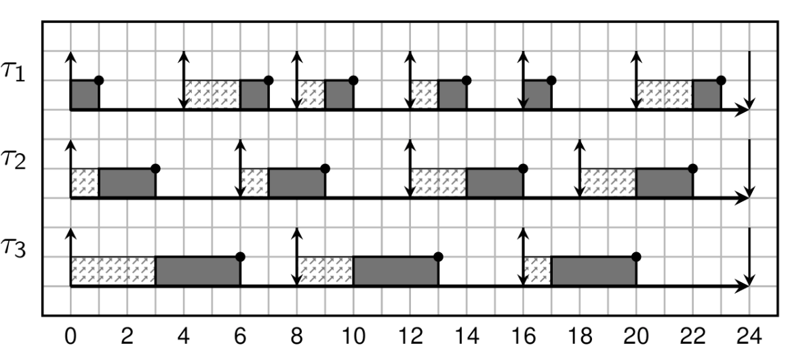
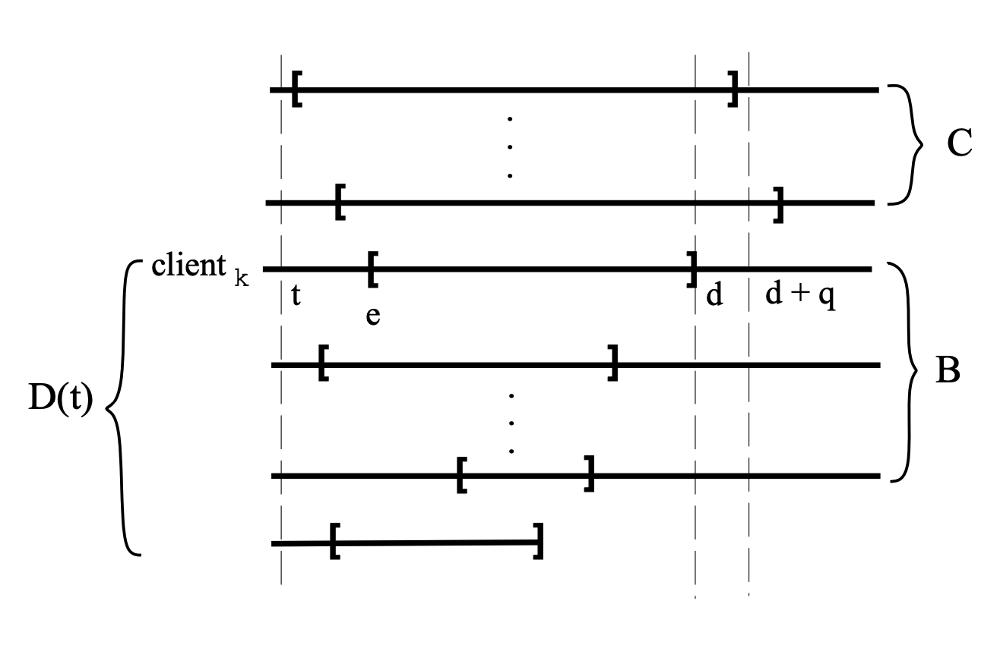

## 前言
本文参考eevdf论文, 介绍eevdf 算法涉及到的概念，基本原理，以及公式推导,
关于eevdf不难理解的章节, 本文 将以概括的方式涵盖, 较难理解的章节，本文
将以中英翻译的方式将论文内容展现出来。

关于论文中的公式，本文尽量将其详细的展开推导。并添加一些直观上的理解。

## 1. introduce

论文中的第一章节主要讲解了调度器的职责以及面临的挑战:

* 职责:
  + 在多个竞争client之间分配资源
* 挑战:
  + 随着更多实时性应用的出现（多媒体)，调度器应该更及时响应这些任务。
    这样就得要求调度器能够预测哪些应用是偏实时性应用，哪些应用是偏
    批处理应用

目前有两种调度器一定程度上满足了这种需求:

* proportional share （例如stride schedule)
* real-time (例如deadline 调度器)

简单介绍下这两个调度器:

|调度器类型|基本算法|优点|缺点|
|----|----|----|---|
|proportional share|每个client有一个权重，按照权重所<br/>占总权重的比例份额分配资源|灵活, 适应过载场景|实时性不高|
|real-time|基于事件驱动，每个事件由预测的服<br/>务时间和截止时间来描述|实时性高|不好为批处理任务，建立事<br/>件驱动模型;因为严格的准入策略，<br/>使他们非常不灵活|

关于real-time 不灵活的场景我们设想下: 假设现在cpu已经跑满了实时性任务，但是又来
了新任务。如果将其强行加入，可能导致之前的实时性任务都不能满足其之前定义的实时性
需求。可能导致较长时间内新任务都不能加入。而比例份额算法，则保持了较高的弹性，通过
降低这些任务的性能，来满足新任务的运行。灵活度较高。

而该论文则是结合了这两个调度器。即让资源分配按照 `proportional share`模型分配，但是
其又像使用`real-time` 算法的思想，怎么做呢?

首先是结合比例分配算法为所有的任务建立事件驱动模型:

1. 为每个客户端分配一个权重，并按照该权重分配相应的资源份额
2. **client对时间片的需求转换为一系列对资源的请求**

这样就为不同类型的任务统一了使用事件驱动模型的方法.

然后再按照`real-time`的思想设置服务时间和到期时间:
* 为每个client的请求分配一个虚拟的可用时间和虚拟的deadline
* 当一个请求的虚拟可用时间小于或等于当前虚拟时间时，该请求认为是可用的

* 该算法将新的时间片分配给<font color=red><strong>最早的虚拟截止时间</strong>
  </font>的<font color=red><strong>可用的</strong> </font>请求的client

自此为止，eevdf的设计需求，基本实现介绍完毕。

## 2. Assumptions

本章主要描述数学建模:
首先按照比例分撇算法, 定义:
* $w_i$: 任务i 的权重
* $\mathcal{A(t)}$: 在t时刻，活跃状态（正在竞争资源）的任务集合
* $f_i(t)$: t时刻，任务i的份额

可得下面公式:

$$
f_i(t) = \frac{w_i}{\sum_{j \in \mathcal{A(t)}} w_j} \tag{1}
$$

理想状态下, 在一个时间段内$[t, t + \Delta{t}]$, client i 获得的调度份额是$f_i(t)
\Delta{t}$, 在完全公平的理想状态下，任务i 在$[t_0, t_1]$ 时间段内应得的服务时间为:

$$
S_i(t_0, t_1) = \int ^{t_1}_{t_0} f_i\mathcal{(T)dT} \tag{2}
$$

当然这是在理想状态下的完全公平调度，理想状态是指在任意$t_1$无限接近$t_0$时,
client i 仍然根据上面的公式，获取到想要的调度份额。

但是现实总之残酷的, 正如`<<操作系统导论>>`一书中将调度部分纳入`virtualization`章
节一样, 我们总是希望计算机可以同时运行多个任务（虽然在某些情况下表现出的行为也类
似这样）, 但是计算机硬件(单核)在某个时刻只能运行一个任务。这样就导致了任务的运行
的时间段是 **离散**, 离散是公平调度问题的最终祸首。我们可以想象一个理想的世界: 每当
我们运行一个新任务，cpu自动会搞出一个物理核无性能损耗的运行它，这样还会有这样那
样的调度问题么。显然已经避免了绝大部分。

另外，因为更雪上加霜的是，因为离散所带来的调度器本身的开销，最终使得调度系统不得
不将离散更加离散，从而减少调度器本身的开销。

所以理想环境的服务时间和现实的服务时间有差距, 我们将时间段$[t_0^i, t]$这个时间段
client i服 务时间差，任务i的服务时间差记做$lag_i(t)$, 将现实的服务时间记做
$s_i(t_0^1, t)$, 可得:

$$
lag_i(t) = S_i(t_0 ^ i, t) - s_i(t_0 ^i,t) \tag{3}
$$

> NOTE
>
> 我们来思考下, $lag$ 是在计算机离散调度下，理想于现实的差距。我们来思考下，
> 如果我们将时间片设置为1ms，那么现在有两个client a, b. a 运行了该时间片。
> 那么在t = 1ms这一时刻
>
> $$
> \begin{align*}
> S_{a,b}(0, 1) &= 0.5\\
> s_a(0, 1) &= 1 \\
> s_b(0, 1) &= 0 \\
> lag_a(1) &= -0.5 \\
> lag_b(1) &= 0.5 \\
> \end{align*}
> $$
>
> 这个我们可以怎么理解呢? lag 为正表示整体系统在该时刻欠task的资源, lag为负
> 表示task 欠整体系统的资源。但是从整体来看，$\sum lag = 0$, `section 6 
> Corollary 1`.
> 
> 另外，随着离散的调度运行下去，各个任务的lag 会发生动态变化，加入在下一个1ms,
> client b 运行，则该在此刻观察，这两个任务的lag 都为0。
>
> ***
>
> 另外，我们再思考下，lag和延迟有什么关系。可以lag 为负就是表示该任务有延迟，
> lag为负, 则表示自己的运行给他人带来了延迟。所以在lag 为负的情况下, 该client就
> 不应该在运行，应该让渡给lag 为正的client。
>
> ***
>
> 我们再从另外一个角度思考下，我们应以什么粒度的时间间隔观察lag, 粒度大小会带来什么
> 影响。观察lag就意味着, 我们需要重新评估该任务是否应该继续运行。这个就相当于调
> 度点, 粒度越小, 就意味着调度越频繁, 延迟越低。
>
> **通过上面的思考可以看出, lag概念的引入对eevdf的算法十分重要:**
> * lag正负可以决定 该任务是否有资格在下一个时间片运行
> * 对lag 的观察频率可以决定该任务的运行频率，继而影响延迟
>
> 但是, 个人认为, lag虽然是一个非常重要的概念，但是不是该论文最大的亮点，该论文
> 最大的亮点是，在比例份额调度的算法前提下，引入了real-time的算法模型: 事件驱动.
> 我们在下一个章节将会看到，作者引入了
> * event
> * service time
> * virtual deadline
> * virtual eligible time
{: .prompt-tip}

## 3. The EEVDF Algorithm

为了更好的理解EEVDF，我们先简单看下EDF算法(Early Deadline First)算法，涉及
三个概念:
* period: 任务的请求周期
* runtime((WCET): 周期内最坏情况下的调度时间
* deadline: 截止日期

我们举一个例子来看下(deadline = period):

> NOTE
>
> 盗用链接 [2] 中的例子

假设有三个任务:

|Task|Runtime(WCET)|Period|
|----|-------------|------|
|T1  | 1           |4     |
|T2  | 2           |6     |
|T3  | 3           |8     |

此时cpu并未打满:
$$
\frac{1}{4} + \frac{2}{6} + \frac{3}{8} = \frac{23}{24}
$$

来看调度的效果图:



可以看到三个任务均完美的运行.

那么在比例分配的算法前提下，我们利用edf 的概念和算法，满足我们的一些实时性的需求。

EDF好在哪呢? 好在其规定了deadline来对实时性的保证。

于是作者提出：我们能否在某个周期内，像EDF那样，在deadline之前, 一定完成某个
runtime。(当前我们后面可以看到不是在virtual deadline， 而是 $d + q$(q表示时间片),
但是需要满足，比例分配算法，比例分配算法可以决定什么? 决定分配份额！也就是
runtime. 好，那我们就在deadline 到达之前完成其比例份额的时间片!

基于这一思想，我们来看下论文中的数学建模:

***

定义如下概念:
* period: T
* service time(runtime): r
* 比例:$f$

可以得出
$$
f = \frac{r}{T}
$$

我们让deadline = period, 则deadline d:

$$
\begin{align*}
&T = \frac{r}{f} \\
&d = t + T = t + \frac{r}{f}
\end{align*}
$$

从上面这些信息看，通过作者的抽象和deadline real-time 很像，而区别服务的请求发起
不同，real-time 服务请求往往是外部事件（例如 packet arrival)，而在作者定义的模型
中，事件的发起既可以外部时间生成（例如客户端进入竞争），又可以是内部事件（例如客
户端完成当前请求后，产生新请求)。所以，这样的模型不仅可以满足事件驱动模型（例如
多媒体），同时也支持传统的批处理应用。

> NOTE
>
> 此时, 离算法的核心比较接近了, 我们思考下:
>
> 现在距离最终的算法完成，还需要完成哪些工作?
> * period ?: 就像deadline算法一样，可以定义每个任务的执行周期
> * runtime ?: $r = T * f$ 公式，就可以得出在该周期内的服务时间
> * deadline?: 上面也已经给出计算方法
>
> 那还剩余什么?
>
> 正如前文所说: **_when to initial a new request?_**
>
> 该选项尤其对于批处理任务十分重要。**_这是本文中的精髓部分, 最闪亮的点_**。
>
> 我们简单举个例子:
> 
> 假设现在有两个任务c1, c2 两者都是批处理任务，我们定义两者$f$相同, 周期不同.
> $T_1 = 2ms, T_2 = 3ms$, 时间片为1ms
> 
> 我们来看下，如果我们严格按照EDF的算法将是什么样子:
>
> 
>
> > 在$t = 4$, client 1 发起了一个新请求，deadline 和client2相同，为了更形象的表
> > 示，我们选择client1 执行
> {: .prompt-info}
>
> 上图的处理逻辑是永远选择deadline小的任务执行。但是从上图可见，批处理任务和实时
> 任务不同，其"贪婪性"意味着如果不抢占他，则会一直执行，从上图可以看出这严重影响
> 了公平性。
>
> **所以, 我们必须采用其他的机制来打断其执行，并且在合适的时机再次发起请求**
{: .prompt-tip}

通过公式(1) (2) 可以推导 client i 在 时间段$[t_1, t_2)$内应得的服务时间:

$$
S_i(t_1,t_2) = w_i \int^{t_2}_{t_1}\frac{1}{\sum_{j \in {\mathcal{A(T)}}} w_j} \mathcal{dT} \tag{4}
$$

同时我们定义系统的虚拟时间:

$$
V(t) = \int_0^t \frac{1}{\sum_{j \in {\mathcal{A(T)}}} w_j} \mathcal{dT} \tag{5}
$$

virtual time的以所有客户端weight 和成反比增长。

结合(4)(5) 得出:

$$
S_i(t_1, t_2) = w_i(V(t_2) - V(t_1)) \tag{6}
$$

作者的想法很直接，就是在client 运行过程中, 在任务要发起的时刻, 我们计算一个
eligible time, 只有时刻达到或超过eligible time时，才能发起下一个请求。

那eligible time 怎么计算呢? 让其实际服务时间和理想服务时间相等，这符合比例分配调
度的思想。

我们假设在$t^i_0$ 客户端开始活跃，想要在t时刻发起一个新请求，需要满足:

$$
S_i(t_0^i, e) = s_i(t_0^i, t)
$$

我们来直观理解下，如果在时刻t，$e > t$，则表示在未来的时刻$e$，才能用这么多的资源，
显然在时刻$t$用超了, 则此时该任务不能在运行，直到时间流逝到e时刻。该等式相等，再
发出一个新请求。

相反, 如果在时刻t, 计算得到的$e < t$, 则表示在过去的时刻$e$, 就应该用用这些资源，
但是现在到了时刻t还没有使用，那就很亏，需要立即发出请求，使用这些资源。

我们结合等式(6) 可以推导 $V(e)$

$$
V(e) = V(t_0^i) + \frac{s_i(t_0^i, t)}{w_i} \tag{7}
$$


> NOTE
>
> 推导过程:
>
> $$
> \begin{align*}
> S_i(t_0^i, e) &= s_i(t_0^i, t) \\
> w_i(V(e) - V(t_0^i)) &= s_i(t_0^i, t)  \\
> V(e) &= V(t_0^i) + \frac{s_i(t_0^i, t)}{w_i} \tag{7}
> \end{align*}
> $$
>
{: .prompt-tip}

再接着定义deadline, deadline 应该选择为在[e, d] 时间内, 使其理想的服务时间等于
服务时间.即

$$
S_i(e, d) = r
$$

这个也好理解, 在e 时刻, 发起请求时，请求的服务时间为r，使deadline定义为理想状态
下完成该服务时间r所需要的时间。

结合公式(6)， 推导$V(d)$

$$
V(d) = V(e) + \frac{r}{w_i} \tag{8}
$$

> NOTE
>
> 推导过程:
>
> $$
> \begin{align*}
> S_i(e, d) &= w_i(V(d) - V(e)) = r \\
> V(d) &= V(e) + \frac{r}{w_i}
> \end{align*}
> $$
>
{: .prompt-tip}

***

文中给出了EEVDF 算法的核心描述:

> **EEVDF Algorithm**. A new quantum is al located to the client that has the
> eligible request with the earliest virtual dead line.

***

接下来，我们来用公式描述一个批处理任务的连续多次请求ve 和 vd 表达式:

第一次:
$$
ve^{(1)} = V(t^i_0) \tag{9}
$$

根据公式8

$$
vd^{(k)} = ve^{(k)} + \frac{r^{(k)}}{w_i} \tag{10}
$$

如果每次任务都能用完其服务时间, 结合公式(7)(8)可得

$$
ve^{(k+1)} = vd^{(k)} \tag{11}
$$

> NOTE
>
> 我们来推导下公式(11):
> 
> 由于每次client都能使用完其服务时间，那么第k次也是如此, 可得
>
> $$
> \begin{align*}
> r^{(k)} &= S_i(e^{(k)}, d^{(k)}) = s_i(e^{(k)}, d^{(k)}) \\
> vd^{(k)} &= ve^{(k)} + \frac{r^{(k)}}{w_i} \\
> &= ve^{(k)} + \frac{s_i(e^{(k)}, d^{(k)})}{w_i}
> \end{align*}
> $$
>
> 根据公式(7), 可以看出，该等式正好符合$V(e)$的表达式，所以等于下一次
> 的$V(e)$ 即:
>
> $$
> vd^{(k)} = ve^{(k)} + \frac{s_i(e^{(k)}, d^{(k)})}{w_i} = vd^{(k+1)}
> $$
>
> > 另外需要注意的是，这里为什么要计算$V(e)$, $V(d)$, 而非使用real-time $e,d$.
> > 原因在于我们可以在$t$时刻计算出 $V(d), V(e)$, 但是计算不出 $e,d$, 为什么？
> > 因为这是发生在未来的时间，未来的$V$的斜率无法预知(甚至会发生跳变). 文章中
> > 举了一个例子, 我们可以定义一个水库满的状态，但是无法定义该水库什么时候会满，
> > 因为我们不知道水库进水的速度。
> > 
> > 我们看公式(7)和公式(8)，$\frac{s_i(t_0^i, t)}{w_i}$ 和 $\frac{r}{w_i}$有步进
> > 算法per-task vruntime的影子, 但其实完全不同, 我们怎么直观理解呢?
> >
> > 我们先举个例子: 系统中有两个client 1, 2:
> > * 时间片: 1
> > * 服务时间: $r_1 = r_2 = 1$
> > * weight: 
> >   + $w_1 = 1$
> >   + $w_2 = 4$
> > * 任务加入时间
> >   + client 1: 0
> >   + client 1: 1
> >
> > 如下图:
> >
> > 
> >
> > 在eevdf中对于各个client来说，只有一个时间会变化, 即 virtual time: $V(t)$。
> > 随着时间的流逝, 而权重小的任务在一次请求后，$V(e)$会变得很大, 如时刻$1.4$, client 1 
> > 在发起下一个请求时$V(e) \rightarrow 3$, 就会导致在比较长的时间内, $V(t)$才追
> > 上能$V(e)$. 让资源让渡给其他任务, 而权重大的任务相反, 从而获得更多的执行次数.
> >
> > 而关于$V(d)$, 从图中可以看出, 加入两个任务同时发出请求，并且都是eligible,
> > 则权重大的任务 $V(d)$ 会计算的比较小, 如时刻$1, 2$, 从而抢先获得资源
> >
> > 另外，我们从这个例子中也可以看出$V$的优雅, 无论发生了什么，任务只需关注各自
> > $V(e), V(d)$, 例如在时刻 $1$ , 无论 有无client 2 加入, 调度器如果要运行
> > client 1, 只需要关注:
> > * whether $V_1(d) = 2$ is earliest
> > * whether $V(t) \ge V(e)$
> > 
> > 如果两个条件都是真, 则运行client 1
> >
> > 而对于$V(d)$来说, 权重大的任务其$V(d)$的间隔就越短。对资源需求越迫切。另外,
> > 我们是否真的能在$V(d)$之前完成所要求的资源么?
> >
> > A: 不会, 我们需要认识到一点，在service time为1的情况下, client 2 $V(e)$ 的变化
> > 一定比 $V(t)$ 要快。(因为分母不同, $V(e) 为 \frac{1}{w_2 (4)}$, $V(d)$ 为
> > $\frac{1}{\sum w_i (5)}$, 那也就意味着在 $V(t) \in [1.4, 2)$ 这段时间内,
> > $V(e)$ 一直追赶 $V(t)$, 也就是这段时间内 $V(e) < V(t)$. 那在这段时间中的各个
> > $V(d)$的点也是如此，即在这些$V(d)$ 时刻中，$lag_2 > 0$. $lag > 0$就说明有延
> > 迟。
> >
> > 我们来举个例子, 以client 2 在$V(t) = 1.4$ 发出的请求为例 -- $(1.25, 1.5)$, 我们
> > 看下在$V(t) = 1.5$时的lag值. 下面的时间都时real time, $V(e) = 1.25时$, 
> > $V_{real\_time}(e) = 2.5$, $V(d) = 1.5$时, $V_{real\_time}(d) = 3.5$, real
> > time 的时间范围是, $[2.5, 3.5]$, 其实就是一个单位的服务时间r.
> >
> > $$
> > \begin{align*}
> > s_2(2.5, 3.5) &= 1 \\
> > S_2(2.5, 3.5) &= 4 * \frac{3.5 - 2.5}{5} = 0.8 \\
> > lag_2(3.5) &= S_2 - s_2 = 0.8 - 0.5 = 0.3
> > \end{align*}
> > $$
> >
> > 可以看到, 在$V(d) = 1.5, lag = -0.2$, 为什么会出现这种情况呢?
> > 因为在$V(e) = 1.25$ 时, client 2 已经eligible，并且其deadline也是最小的。其
> > 该run，但是其没run。如果计算这段时间lag, 这段$lag = - 4 \frac{0.5}{5} = -0.4$, 
> > 在其运行时, 每经过一个时间片, $lag$ 增加一些，知道$V(t) = 2$ 时, 
> > $lag\rightarrow = 0$
> >
> > 但这个延迟会限制在一个时间内, 即 $q$, 也就是说，在$V(d)$时刻该满足的需求，一定
> > 会在 $d+q$ 时刻满足, 这个会在第6章 **Lemma 4** 中证明.
> {: .prompt-info}
{: .prompt-tip}

由于上面我们举了一个例子，这里我们不再引用论文中的例子, 来说明eevdf算法是如何处理
批处理任务的, 我们从另一个角度触发，理解下 eevdf 中的$r$ -- service time.

$r$指的服务时间, 如果按照EDF 中的定义，服务时间是指, 在某个period $T$ 内, client运行
的时间，这个时间往往指最坏情况下的运行时间。

但是在批处理任务中, $r$ 就变成了$S_i$, 即理想情况下的服务时间, 前面提到过$r$ 和
period $T$ 的转换公式

$$
T = \frac{r}{f}
$$

如果$r$越大, 则$T$越大, 则其对资源的需求就越不迫切, 根据前面的公式(10) 可以看出，
其$V(d)$ 的间隔就会越大, 则在争抢资源中就会比较被动。俗称喝汤。

## chapter 3

$$
\begin{align}
S_i(t_0, t^+) &= (t - t_0 - s_3(t_0, t)) \frac{w_i}{w_1+w_2}, i = 1, 2 \\
&=(t - t_0 - (S_3(t_0, t) - lag_3(t))) \frac{w_i}{w_1+w_2} \\
&=(t - t_0 - \frac{(t - t_0) * w_3}{w_1+w_2+w_3} + lag_3(t)) \frac{w_i}{w_1+w_2} \\
&=\frac{(t - t_0)(w_1+w_2+w_3) - (t - t_0) * w_3}{w_1+w_2+w_3} * \frac{w_i}{w_1+w_2} + w_i\frac{lag_3(t)}{w_1+w_2} \\
&= \frac{(t - t_0)(w_1+w_2)}{w_1+w_2+w_3} * \frac{w_1}{w_1+w_2} + w_i\frac{lag_3(t)}{w_1+w_2} \\
&= \frac{(t-t_0)w_1}{w_1+w_2+w_3} + w_i\frac{lag_3(t)}{w_1+w_2} \\
&= w_i(V(t) - V(t_0)) + w_i\frac{lag_3(t)}{w_1+w_2}
\end{align}
$$

因为:
$$
S_i(t_0, t^+) = w_i(V(t^+) - V(t_0))
$$


推导:
$$
\begin{align}
w_i(V(t^+) - V(t_0)) &= w_i(V(t) - V(t_0)) + w_i\frac{lag_3(t)}{w_1+w_2} \\
V(t^+) &= V(t) + \frac{lag_3(t)}{w_1+w_2}
\end{align}
$$

可以看到在此刻, $V(t)$ 发生了跳变.

由于$t^+$ 和 $t$ 非常接近, 所以

$$
\begin{align}
s_i(t_0, t) &= s_i(t_0, t^+) \\
lag_i(t^+) &= S_i(t_0, t^+) - s_i(t_0, t^+) \\
&= w_i(V(t^+)  - V(t_0)) - s_i(t_0, t) \\
&= w_i(V(t^+) - V(t_0)) - (S_i(t_0, t) - lag_i(t)) \\
&= w_i(V(t^+) - V(t_0)) - (w_i(V(t) - V(t_0)) - lag_i(t)) \\
&= w_i(V(t^+) - V(t)) + lag_i(t) \\
&= w_i\frac{lag_3(t)}{w_1+w_2} + lag_i(t)
\end{align}
$$

所以，此时 $lag_i(t)$ 也发生了跳变.

因此，当客户端3离开时，它的 $lag$ 会按比例分配给剩余的客户端，这与我们对公平性的
理解是一致的。通过对`公式(9)`进行推广，我们得出了以下虚拟时间的更新规则：当某个客
户端j在时刻t退出竞争时，虚拟时间应按如下方式更新。

$$
V(t) = V(t) + \frac{lag_j(t)}{\sum_{i \in \mathcal{A}(t^+)} w_i}
$$

> 

论文中还提到:

> Correspondingly, when a client $j$ joins the competition at time $t$, the
> virtual time is updated as follows

$$
V(t) = V(t) - \frac{lag_j(t)}{\sum_{i \in \mathcal{A}(t^+)} w_i}
$$

我们来推导下这部分:

当task 3 任务带有 $lag_3$ 不为0时加入调度, 我们应该将$lag_j$这部分时间补偿/惩罚
给其他进程，和离开时相反:

* $lag_j$ > 0 : 补偿
* $lag_j$ < 0 : 惩罚

我们将现在的时刻记为$t$, 将来的某个时刻记做$t_n$, 进程刚进入completion的时刻为
$t^+$, 如下图所示
```
task 1 -----------
task 2 -----------
task 3 -----------
      t,t+       tn
```

我们这里要给予task3 惩罚

$$
s_3(t, t_n) = S_3(t, t_n) - lag_3(t)
$$

可以推导

$$
\begin{align}
S_i(t^+, t_n) &= ((t_n - t) - s_3(t, t_n))\frac{w_i}{w_1+w_2+w_3} \\
&= ((t_n - t) - (S_3(t_n, t) - lag_3(t)))\frac{w_i}{w_1+w_2+w_3}  \\
&= w_i(V(t_n) - V(t)) - lag3(t)\frac{w_i}{w_1+w_2+w_3} \\

w_i(V(t_n) - V(t^+)) &= w_i(V(t_n) - V(t)) + lag3(t)\frac{w_i}{w_1+w_2+w_3} \\

V(t^+) &= V(t) + \frac{lag3(t)}{w_1+w_2+w_3} 

\end{align}
$$

继而可以得出上面的公式.

任务加入和任务离开不同的是, 当任务 $j$ 再次到达时，任务 $j$ 会自带一个 $lag_j(t)
$,这里的 $lag_j(t)$ 和 j 任务离开时, 取同样的值.

论文的原文:

> Where $\mathcal{A}(t^+)$ contains all the active clients immediately after client j joins
> the competition, and $lag_j(t)$ represents the lag with which client j joins the
> competition. Although it might not be clear at this point, by updating the
> virtual time according to Eq. (18) and (19) we ensure that the sum over the
> lags of all active clients is always zero. This can be viewed as a
> conservation property of the service time, i.e., any time a client receives
> more service time than its share, there is at least another client that
> receives less. We note that if the lag of the client that leaves or joins the
> competition is zero, then according to Eq. (18) and (19) the virtual time does
> not change.9

大概的意思是, 所有的lag相加应该为0, 所以 任务 $j$ 离开的lag和任务j加入的lag应该
是相反值. 

但是，假设任务j离开是，只有任务1，任务2，其惩罚/奖励是针对任务1，2的，但是如果任
务j加入时，有任务1，2，3，其奖励/惩罚时针对任务1，2，3。似乎任务3享受到了额外的
甜点。但是该算法并不关注谁在补偿中得到的甜头，而是关注针对当前 加入/离开 任务的
奖励/惩罚。(幸运的是，论文该章节的最后一个段落会讲到这个事情。

上面提到的是任务加入与推出，那么设想下，如果任务的权重发生了变化，那$V(t)$ 该如
何计算呢?

> We note that changing the weight of an active client is equivalent to a leave
> and a rejoin operation that take place at the same time. To be specific,
> suppose that at time $t$ the weight of client $j$ is changed from $w_j$ to
> $w'_j$ . Then this is equivalent to the following two operations: client j
> leaves the competition at time t, and rejoins it immediately (at the same time
> t) having weight $w'_j$ . By adding Eq. (18) and (19), we obtain

论文中提到，任务权重发生变化，相当于任务触发了leaves 和json操作，只不过在加入后，任务
的权重从$w_j$ 变为了$w'_j$

那么可得下面的公式:

$$
V(t) = V(t) + \frac{lag_j(t)}{\sum{_{i \in \mathcal{A}(t^+)} w_i} - w_i} - 
   \frac{lag_j(t)}{\sum{_{i \in \mathcal{A}(t^+)} w_i} - w_j + w'_j}
$$

所以，这里也可看出来, 当一个lag 为 0 的任务，在离开和加入时，权重没有变化，则
virtual time 也不会发生变化。这种情况下，virtual time的变化时连续的。(不会发生跳
变)

> As for join and leave operations, notice that the virtual time does not change
> when the weight of a client with $zero$ lag is modified. Thus, in a system in
> which any client is allowed to join, leave, or change its weight only when its
> lag is zero, the variation of the virtual time is continuous

## 6 Fairness Analysis of the EEVDF Algorithm

In this section we determine bounds for the service time lag. First we show that
during any time interval in which there is at least one active client, there is
also at least one eligible pending request (Lemma 2). A direct consequence of
this result is that the EEVDF algorithm is work-conserving, i.e., as long as
there is at least one active client the resource cannot be idle. By using this
result, in Theorem 1 we give tight bounds for the lag of any client in a steady
system (see Denitions 1 and 2 below). Finally, we show that in the particular
case when all the requests have durations no greater than a time quantum q, our
algorithm achieves tight bounds which are optimal with respect to any
proportional share allocation algorithm (Lemma 5).

> 本节我们将确定服务时间 lag 的界限。首先，我们证明在任何存在至少一个活跃客户端
> 的时间区间内，必然也存在至少一个符合条件的待处理请求（见引理2）。这一结果的直
> 接推论是，EEVDF 算法是 work-conserving 的，也就是说，只要有至少一个活跃客户端，
> 资源就不会空闲。基于这一结果，我们在定理1中为稳态系统中任意客户端的 lag 给出了
> 严格界限（见下方定义1和定义2）。最后，我们还证明，在所有请求的持续时间均不超过
> 一个时间片 q 的特殊情况下，我们的算法能够实现最优的严格界限，与任何比例分配算
> 法相比都是最优的（见引理5）。
>
> > work-conserving 调度算法会确保资源始终被分配给等待的任务，不会让资源空闲，除
> > 非队列里没有任务。
> {: .prompt-tip}
{: .prompt-trans}

Throughout this section we refer to any event that can change the state of the
system, i.e., a client joining or leaving the competition, and changing the
client's weight, simply as event. We introduce now some definitions to help us
in our analysis.

> 在本节中，我们将任何可能改变系统状态的事件——即客户端加入或离开竞争，以及更改客
> 户端权重——统称为事件。接下来，我们将引入一些定义以辅助我们的分析。
{: .prompt-trans}

**Definition 1** A system is said to be **steady** if all the events occurring
in that system involve only clients with $zero$

> 给出了 **steady system** 的定义: 所有event 均发生在 client with zero lag.
{: .prompt-tip}

Thus, in a steady system the lag of any client that joins, leaves, or has its
weight changed, is zero. Recall that in a system in which all events involve
only clients having zero lags the virtual time is continuous. As we will see,
this is the basic property we use to determine tight bounds for the client lag.
The following definition restricts the notion of steadiness.

> 因此，在一个稳态系统中，任何加入、离开或权重发生变化的客户端，其 lag 都为零。
> 请注意，在一个所有事件仅涉及 lag 为零的客户端的系统中，虚拟时间是连续的。正如
> 我们将看到的，这正是我们用来确定客户端 lag 严格界限的基本性质。下面的定义对
> steadiness 的概念进行了限定。
{: .prompt-trans}

**Definition 2** An interval is said to be **steady** if all the events
occurring in that interval involve only client with zero lag

> 给出了 **steady interval** 的定义: 在某个 interval 内，所有event
> 均在 client with zero lag 发生。
{: .prompt-tip}

We note that a steady system could be alternatively defined as a system for
which any time interval is steady. The next lemma gives the  condition for a
client request to be eligible.

> 结合 **steady interval** 和 **steady system**, 可以推导出, 在在任意时间的
> interval 都是 steady 的可以成为 **steady system**. 
{: .prompt-tip}

**Lemma 1** Consider an active client $k$ with a positive $lag$ at time $t$,
i.e.,

$$
lag_k(t) \geq 0;
$$

*Then client k has a pending eligible request at time t*

> 下面给出了这条引理的证明:
{: .prompt-tip}

**Proof**. Let r be the length of the pending request of client k at time t
(recall that an active client has always a pending request), and let $ve$ and
$vd$ denote the virtual eligible time and the virtual deadline of the request.
For the sake of contradiction, assume the request is not eligible at time t,
i.e.,

> 证明：设 r 为客户端 k 在时刻 t 的待处理请求的长度（注意，活跃客户端始终有一个
> 待处理请求），令 $ve$ $vd$ 分别表示该请求的虚拟可执行时间和虚拟截止时间。为
> 进行反证，假设该请求在时刻 t 不具备可执行资格，即，
{: .prompt-trans}

$$
ve > V(t)
$$

Let $t'$ be the time when the request was initiated. Then from Eq. (7) we have

> r : 客户端k 在t 时刻待处理请求的长度
> 
> t': 为发起请求的时刻
> > 注意，这里的发起请求，是指new request， 也就是next)
> {: .prompt-info}
{: .prompt-tip}

$$
ve = V(t_0^k) + \frac{s_k(t_0^k, t')}{w_k}
$$

Since between $t'$ and $t$ the request was not eligible, it follows that the
client has not received any service time in the interval $[t', t)$, and
therefore $s_k(t_0^k, t') = s_k(t_0^k, t)$ . By substituting $s_k(t_0^k, t')$ to
$s_k(t_0^k, t)$ in Eq. (23) and by using Eq. (3) and (6) we obtain

$$
\begin{align}
lag_k(t) &= w_k(V(t) - V(t_0^k)) - s_k(t_0^k, t) \\
&= w_k(V(t) - V(t_0^k)) - w_k(ve - V(t_0^k)) \\
&= w_k(V(t) - ve)
\end{align}
$$

> 我们详细推导下:
>
> $$
> \begin{align}
> s_k(t_0^k,t') &=  we*w_k + V(t_0^k) \\
> lag_k(t) &= S_k(t_0^k, t) - s_k(t_0^k, t) \\
> &= S_k(t_0^k, t) - s_k(t_0^k, t')  \\
> &= w_k(V(t) - V(t_0^k)) - w_k(ve - V(t_0^k)) \\
> &= w_k(V(t) - ve)
> \end{align}
> $$
{: .prompt-tip}

Finally, from Ineq. (22) it follows that $lag_k (t) < 0$, which contradicts the
hypothesis and therefore proves the lemma.

> 由上面的等式可以得出 $V(t) - ve < 0$, 从而得出 $lag_k(t) < 0$
>
> 我们具体来思考下他是怎么证明的:
> 
> 需要证明的引理是: 如果一个客户端k, 在t时刻有一个正的lag, 那么客户端一定有一个
> pending的 eligible request.
>
> 那么证明的方法是，反证。
>
> 证明: 如果一个客户端k，在t时刻有一个正的lag, 客户端不一定有一个pending的eligible
> request. 如果没有eligible request，会是什么样的场景呢?
>
> $$
> ve > V(t)
> $$
>
> 结果推导出来，发一定是现$lag < 0$, 与假设矛盾，原来的定理成立。
{: .prompt-tip}

From Lemma 1 and from the fact that any zero sum has at least a nonnegative term,
we have the following corollary.

**Corollary 1** Let A(t) be the set of al l active clients at time t, such that

$$
\sum_{\substack{i\in A(t)}} lag_i(t) = 0
$$

Then there is at least one eligible request at time t.

> 这里的意思是，只要 $\sum_{\substack{i\in A(t)}} lag_i(t) = 0$, 至少有一个
> eligible request
>
> > **Corollary**: 表示推论, 不需要复杂证明
{: .prompt-tip}

The next lemma shows that at any time $t$ the sum of the lags over all active
clients is zero. An immediate consequence of this result and the above corollary
is that at any time t at which there is at least one active client, there is
also at least one pending eligible request in the system. Thus, in the sense of
the definition given in [23], the EEVDF algorithm is *work-conserving*, i.e., as
long as there are active clients the resource is busy

> 下一个引理表明，在任意时刻 ( t )，所有活跃客户端的滞后量之和为零。由此结果以及
> 上面的推论可以直接得出，在任何存在至少一个活跃客户端的时刻，系统中也必然存在至
> 少一个待处理且符合条件的请求。因此，根据[23]中给出的定义，EEVDF算法是工作保持
> （work-conserving）的，也就是说，只要有活跃客户端，资源就始终处于忙碌状态。
{: .prompt-trans}

Lemma 2 At any moment of time t, the sum of the lags of al l active clients is zero

$$
\sum_{\substack{i\in A(t)}} lag_i(t) = 0  \tag{26}
$$

**Proof**. The proof goes by induction. First, we assume that at time t = 0
there is no active client and therefore Eq. (26) is trivially true. Next, for
the induction step, we show that Eq. (26) remains true after each one of the
following events occurs: (i) a client joins the competition, (ii) a client
leaves the competition, (iii) a client changes its weight. Finally, we show that
(iv) during any interval $[t, t')$ in which none of the above events occurs if
Eq. (26) holds at time t, then it a n it also holds at time $t'$

> 证明。该证明采用归纳法。首先，我们假设在时间 t = 0 时没有活跃的客户端，因此公
> 式（26）显然成立。接下来，在归纳步骤中，我们证明在以下每一种事件发生后，公式
> （26）仍然成立：（i）有客户端加入竞争；（ii）有客户端离开竞争；（iii）有客户端
> 改变其权重。最后，我们证明（iv）在任意一个区间 [t, t′) 内，如果上述事件都没有
> 发生，且公式（26）在时间 t 时成立，那么它在时间 t′ 时也成立。
{: .prompt-trans}

**Case (i)**. Assume that client j joins the competition at time t with lag
$lag_j(t) $. Let $t^-$ denote the time immediately before, and let $t^+$ denote
the time immediately after client $j$ joins the competition, where $t^+$ and
$t^-$ are asymptotically close to t. Next, let $W(t)$ denote the total sum over
the weights of all active clients at time t, i.e., $W(t) = \sum_{i \in
\mathcal{A}(t)} w_i (t)$ and by convenience let us take $lag_j (t^-) = lag_j(t)$
. Since $t^- \rightarrow t^+$ we have $s_i(t_0^i, t^-) = s_i(t_0^i, t^+)$. Then
from Eq. (3) we obtain

> * $t^-$ : client j 加入前的很接近的时间
> * $t^+$ : client j 加入后的很接近的时间
>
> 并且为了方便让 $lag_j (t^-) = lag_j(t)$(这相当于一个策略让 任务j, $lag_j$
>
> 另外由于 $t^-$ 和 $t^+$ 两个时间很接近， 可以让 $s_i(t_0^i, t^-) = s_i(t_0^i,
> t^+)$
{: .prompt-tip}

$$
lag_i(t^+) = lag_i(t^-) + S_i(t_0^i, t^+) - S_i(t_0^i, t^-)
$$

Further, by using Eq. (6) and (19), the lag of any active client i at time $t^+$
(including client j) is

$$
lag_i(t^+) = lag_i(t^-) + lag_i(t) \frac{w_i}{W(t^+)}
$$

> 我们来推导下这部分:
> 
> $$
> \begin{align}
> lag_i(t^+) &= S_i(t_0^i, t^+) - s_i(t_0^i, t^+) \\
> &= S_i(t_0^i, t^-) + S_i(t^-, t^+) - s_i(t_0 ^ i, t^-) \\
> &= S_i(t_0^i, t^-) - s_i(t_0 ^ i, t^-)  + S_i(t^-, t^+) \\
> &= (S_i(t_0^i, t^-) - s_i(t_0 ^ i, t^-))  + (S_i(t^i_0, t^+) - S_i(t^i_0, t^-)) \\
> & = lag_i(t^-) + S_i(t^i_0, t^+) - S_i(t^i_0, t^-) \\
> & = lag_i(t^-) + w_i(V(t^+) - V(t_0^i)) - w_i(V(t^-) - V(t_0^i)) \\
> & = lag_i(t^-) + w_i(V(t^+) - V(t^-))
> \end{align}
> $$
> 
> 由于 $t^- \rightarrow t$ 并没有任务加入，两个时间又非常接近, 所以其 $V(t)$ 不会
> 发生跳变, 所以$V(t^-) = V(t)$, 从而得到
> 
> $$
> \begin{align}
> V(t^+) &= V(t) + \frac{lag_j(t)}{W(t^+)} \\
> &= V(t^-) + \frac{lag_j(t)}{W(t^+)}
> \end{align}
> $$
> 
> 带入可得:
> 
> $$
> \begin{align}
> lag_i(t^+) &= lag_i(t^-) + w_i(V(t^+) - V(t^-)) \\
> &= lag_i(t^-) + w_i(V(t^-) + \frac{lag_j(t)}{W(t^+)} - V(t^-)) \\
> &= lag_i(t^-) + \frac{lag_j(t)}{W(t^+)}
> \end{align}
> $$
{: .prompt-tip}

Since $\mathcal{A}(t^+) = \mathcal{A}{(t^-)} \cup {j}$,  and since from the
induction hypothesis we have $\sum{_{i \in{\mathcal{A}(t^-)}} lag_i(t^-)} = 0$,
by using Eq. (27), we obtain:

$$
\begin{align}
\sum _{\substack{i\in\mathcal{A}(t^+)}} lag_i(t^+) &=
\sum_{\substack{i\in\mathcal{A}(t^+)}} (lag_i(t) - lag_j(t)\frac{w_i}{W(t+)}) \\
&= \sum_{\substack{i\in\mathcal{A}(t^+)}} lag_i(t^-) - 
lag_j(t) \frac{\sum_{_{i\in\mathcal{A}(t^+)} }w_i}{W(t^+)} \\
&= \sum_{\substack{i\in\mathcal{A}(t^+)}} lag_i(t^-) + lag_j(t^-) - lag_j(t) = 0
\end{align}
$$

> 这里我们可以简单想下，为什么任务 $j$ 带有 $lag_j$ 进入竞争, 而
> $\sum_{\substack{i\in A(t)}} lag_i(t)$ 仍然不变等于0呢 ? 这部分 $lag$ 的变化，
> 被谁反向抵消了呢?
>
> A: 很直观，被其他的任务的 $lag$ 变化抵消了, 所以我们可以看下所有任务（包括j），
> 在j加入后的 $lag$ 变化来变相证明下.
>
> $$
> \begin{align}
> lag_i(t^+) &= lag_i(t) - w_i\frac{lag_j(t)}{\sum_{i \in \mathcal(A)} w_i} \\
> \sum_{\substack{i\in\mathcal{A}(t^+)}}\Delta{lag_i} &=
> \sum_{\substack{i\in\mathcal{A}(t^-)}}\Delta{lag_i} + lag_j(t) \\
> &= \sum_{\substack{i\in\mathcal{A}(t^-)}}\Delta{lag_i} + lag_j(t) \\
> &= - w_1\frac{lag_j(t)}{\sum_{i \in \mathcal{A}} w_i} - w_2\frac{lag_j(t)}{\sum_{i
> \in \mathcal{A}} w_i} +...+ log_j(t) \\
> &= -\frac{\sum{_{i\in\mathcal{A}(t^-)}w_i}} {\sum{_{i\in\mathcal{A}(t^-)}w_i}}lag_j(t)
> +lag_j(t) = 0
> \end{align}
> $$
>
> 其实, $lag_j(t)$ 和 $V(t)$ 的逻辑是相似的，带有非0 $lag_j(t)$ 的j任务离开/加入后, 其需要
> 别人付出代价，lag比较直接，让别的任务的lag承担。而V(t) 比较含蓄，只做V(t)的跳
> 变, 这样其他的 任务的$ve$也就近似发生转变...
{: .prompt-tip}

**Case (ii)**. The proof of this case is very similar to the one of the previous
case; therefore we omit it here.

> 这个和 Case(i) 很相似，作者将其省略, 可以想象成上面的等式中的
> $\sum_{\substack{i\in\mathcal{A}(t^-)}}\Delta{lag_i}$ 和 $lag_j(t)$ 符号相反，
> 得出的结果也是0.
{: .prompt-tip}

**Case (iii)**. Changing the weight of a client $j$ from $w_j$ to $w_j'$ $j$ at
time $t$ can be viewed as a sequence of two events: first, client $j$ leaves the
competition at time $t$; second, it joins the competition at the same time $t$,
but with weight $w_j'$. Thus, the proof of this case reduces to the previous two
case.

> 这里也好理解，将改变权重分为两部分, 任务 $j$ 带着$lag_{j1}(t)$离开，几乎在同一
> 时刻, 任务 $j$ 带着$lag_{j2}(t)$ 加入竞争. 虽然 $lag_{j1}(t)$ 和 $lag_{j2}(t)$
> 不相同, 但是不影响。因为离开加入作为独立event时，每个event执行后，
> $\sum_{\substack{i\in A(t)}} lag_i(t)$ 均不变。
{: .prompt-tip}

Case (iv). Consider an interval $[t, t')$ in which no event occurs, i.e., no
client leaves or joins the competition and no weight is changed during the
interval $[t, t')$ . Next, assume that $\sum_{\substack{i\in A(t')}} lag_i(t') =
0$, By using Eq. (3) and (6) we obtain:

$$
\begin{align}
\sum_{\substack{i\in\mathcal{A}(t')}}lag_i(t') &= \sum_{\substack{i\in\mathcal{A}(t')}}
(S_i(t_0^i - t') - s_i(t_0^i - t') \\
&= \sum_{\substack{i\in\mathcal{A}(t)}}((S_i(t_0^i - t) - s_i(t_0^i - t)) +
  \sum_{\substack{i\in\mathcal{A}(t)}}((S_i(t - t') - s_i(t - t')) \\
&= \sum_{\substack{i\in\mathcal{A}(t)}} lag_i(t) + 
\sum_{\substack{i\in\mathcal{A}(t)}}S_i(t - t') - \sum_{\substack{i\in\mathcal{A}(t)}}s_i(t - t') \\
&= \sum_{\substack{i\in\mathcal{A}(t)}}w_i(V(t') - V(t)) - \sum_{\substack{i\in\mathcal{A}(t)}}s_i(t, t') \\
&= (t' - t) - \sum_{\substack{i\in\mathcal{A}(t)}}s_i(t, t') 
\end{align}
$$

Next we show that the resource is busy during the entire interval $[t, t')$. For
contradiction assume this is not true. Let $l$ denote the earliest time in the
interval $[t, t')$ when the resource is idle. Similarly to Eq. (29) we have:

$$
\sum_{\substack{i\in\mathcal{A}(l)}}lag_i(l) = (l - t) -
  \sum_{\substack{i\in\mathcal{A}(l)}}s_i(t, l)
$$

Since the resource is not idle at any time between $t$ and $l$, it follows that
the total service time allocated to all active clients during the interval $[t,
t')$ (i.e., $\sum_{i\in\mathcal{A}(l)}s_i(t, l)$ is equal to $l - t$. Further,
from the above equation we have $\sum_{i\in\mathcal{A}(l)}lag_i(l) = 0$. But
then from Lemma 1 it follows that there is at least one eligible request at time
$l$, and therefore the resource cannot be idle at time $l$, which proves our
claim. Further, with a similar argument, it is easy to show that
$\sum_{i\in\mathcal{A}(t')}lag_i(t') = 0$ which completes the proof of this
case.

> > 第一个 $[t, t')$ 应该是 $[t, l)$ 
> {: .prompt-info} 
>
> 最终的目标是证明
> $\sum_{\substack{i\in\mathcal{A}(l)}}lag_i(l) = 0$, 从上面的等式可以看出，如果
> 等于0，也就意味着所有任务实际的运行时间之和一定等于时间的流逝. 也就意味着在
> $[t, t')$这段时间内, 资源总是繁忙的。这里作者用了反证法, 假设在 $[t, t')$ 时间
> 段中，有最早的一个时刻$l$, 该时刻是空闲的. 那么根据引理1: 如果一个client 有
> $lag >= 0$, 则一定有pending的请求。那么，我们就需要需要证明，在这个时刻，所有
> 的任务的lag 都是负值 ($lag_i < 0 ,i \in\mathcal{A}(l)$). 但是所有的lag 都是负
> 值，就意味着 $\sum_{\substack{i\in\mathcal{A}(l)}}lag_i(l) < 0$, 
>
> 这样就和假设推出来的 $\sum_{\substack{i\in\mathcal{A}(l)}}lag_i(l) = 0$ 矛盾了。
> 从而反证成功
{: .prompt-tip}

Since these are the only cases in which the lags of the active clients may
change, the proof of the lemma follows.

The following lemma gives the upper bound for the maximum delay of fulfilling a
request in a steady system. We note that this result is similar to the one
obtained by Parekh and Gallager [23] for their Generalized Processor Sharing
algorithm, i.e., in a communication network, a packet is guaranteed not to miss
its deadline by more than the time required to send a the time required to send
a packet of maximum length.

> 由于只有在这些情况下，活跃客户的滞后值才可能发生变化，因此引理的证明即告完成。
>
> 下一个引理给出了在稳定系统中满足请求的最大延迟的上界。我们注意到，这一结果与
> Parekh和Gallager [23]为其广义处理器共享（Generalized Processor Sharing）算法所
> 获得的结果类似，即在通信网络中，一个数据包保证不会错过其截止时间超过发送一个最
> 大长度数据包所需的时间。
{: .prompt-trans}

***

**Lemma 3** In a steady system any request of any active client k is fulfilled
no later than $d + q$, where d is the request's deadline, and q is the size of
a time quantum.

> 引理 3 在一个稳态系统中，任何活跃客户端 k 的任何请求都不迟于 得到满足，其中 d
> 是请求的截止时间，q 是时间片的大小。
{: .prompt-trans}

**Proof**. Let $e$ be the eligible time associated to the request (with deadline
$d$) of client $k$. Consider the partition of all the active clients at time $d$,
into two sets $B$ and $C$, where set $B$ contains all the clients that have at
least a deadline in the interval $[e, d]$ , and set $C$ contains all the other
active clients (see Figure 3). Let t be the latest time no greater than d at
which a client in $C$ receives a time quantum, if any. Further we consider two
cases whether such a t exists or not.

> 证明。设 $e$ 为与客户端 $k$ 的请求（截止时间为 $d$）相关的可用时间。考虑在时间
> $d$ 时，将所有活跃客户端划分为两个集合 $B$ 和 $C$，其中集合 $B$ 包含所有在区间
> $[e, d]$ 内至少有一个截止时间的客户端，而集合 $C$ 包含所有其他活跃客户端（见图
> 3）。设 $t$ 为不大于 $d$ 的最新时间，在该时间集合 $C$ 中的某个客户端获得时间片
> （如果存在的话）。接下来我们考虑两种情况：这样的 $t$ 是否存在。
{: .prompt-trans}



**Case 1** (t exists). Here we consider two sub-cases whether $t \in [e, d)$, or
$t < e$. First assume that a client in C receives a time quantum at a time $t \in
[e, d)$. Since all the deadlines of the pending requests issued by clients in C
are larger than d, this means that at time t the pending request of client k is
already fulfilled. Consequently, in the first sub-case the request of client k
k is fulfilled before time d.

> **案例1(t存在)** 。我们考虑两种子情况：t∈[e,d) 或 t<e。首先假设某个属于集合C的
> 客户在时间 t∈[e,d) 时获得了一个时间片。由于集合C中所有待处理请求的截止时间都大
> 于 d，这意味着在时间t时，客户k的待处理请求已经被满足。因此，在第一个子情况下，
> 客户k的请求在时间d之前就被满足了
>
> > 这个证明很直观, 因为C集合中的 $V(d_C^i) > V(d_B^k)$, EEVDF调度算法会优先选择
> > $V(d)$ 小的任务, 所以在C集合中的任务被调度到时(获得时间片), 那就说明任务k
> > 肯定已经在$t$之前fulfilled, $t < d$, 所以任务k在 $d$之前 fullfilled, 在deadline
> > 之前完成任务
> {: .prompt-tip}
{: .prompt-trans}

For the second sub-case, let us $D$ denote all the active clients that have at
least one eligible request with the deadline in the interval $[t, d)$ (see
Figure 3). Further, let $D(\mathcal{T})$ denote the subset of $D$ containing the
active clients at time $\mathcal{T}$. Since a time quantum is allocated to a
client in $C$ at time $t$, it follows that no other client with an earlier
deadline is eligible at $t$. For any client j belonging to $D(t)$, let $e_j$ be
the eligible time of its pending request at time $t$. Since the deadlines of
these requests are no greater than $d$ (and therefore smaller than any deadline
of any client in $C$), it follows that all these pending requests are not
eligible at time $t$, i.e., $t < e_j$ . Notice that besides the clients in $D(t)
$, the other clients that belong to $D$ are those that eventually join the
competition after time $t$. For any client $j$ in $D$ that joins the competition
after time $t$, we take $e_j$ to be the eligible time of its first request. 

> 对于第二种子情况，令 $D$ 表示所有在区间 $[t, d)$ 内至少有一个可用请求截止时间
> 的活跃客户端（见图3）。进一步，令 $D(T)$ 表示在时刻 $T$ 处属于 $D$ 的活跃客户
> 端子集。由于在时刻 $t$ 为集合 $C$ 中的某个客户端分配了时间片，因此在 $t$ 时没
> 有其他截止时间更早的客户端是可用的。对于属于 $D(t)$ 的任意客户端 $j$，令 $e_j$
> 表示其在时刻 $t$ 时未完成请求的eligible time。由于这些请求的截止时间都不超过
> $d$（因此也小于集合 $C$ 中任何客户端的截止时间），所以这些未完成的请求在时刻
> $t$ 都不可用，即 $t < e_j$。注意，除了属于 $D(t)$ 的客户端之外，属于 $D$ 的其
> 他客户端是在时刻 $t$ 之后才加入竞争的。对于在 $t$ 之后加入竞争的任意客户端 $j$，
> 我们取其第一个请求的可用时间为 $e_j$。
{: .prompt-trans}


Next, for any client $j$ belonging to $D$, let $d_j$ denote the largest deadline
no great Next, for any client $j$ belonging to $D$, let $d_j$ denote the largest
deadline no greater than d of any of its requests (notice that the eligible time
$e_j$ and the deadline $d_j$ might not be associated to the same request). From
Eq. (10) it easy to see that after client $j$ receives $S_j(e_j, d_j)$ time
units, all its requests in the interval $[e_j, d_j)$ are fulfilled. Thus, the
service time needed to fulfill all the requests which have deadlines in the
interval $[t, d)$ is.

> 接下来，对于属于 $D$ 的任意客户端 $j$，令 $d_j$ 表示其所有请求中不超过 $d$ 的
> 最大截止时间（注意，可用时间 $e_j$ 与截止时间 $d_j$ 可能并不属于同一个请求）。
> 由公式 (10) 可以很容易看出，当客户端 $j$ 获得 $S_j(e_j, d_j)$ 个时间单位的服务
> 后，其在区间 $[e_j, d_j)$ 内的所有请求都已被满足。因此，满足所有截止时间在区间
> $[t, d)$ 内的请求所需的服务时间为：
{: .prompt-trans}

$$
\sum_{\substack{j \in D}} S_j(e_j, d_j) = 
\sum_{\substack{j\in D}} \int_{d_j} ^{e_j} \frac{w_i}{\sum_{i \in \mathcal{A}
(\mathcal{T})}w_i}d(\mathcal{T})
$$

By decomposing the above sum over a set of disjoint intervals $J_l = [a_l, b_l)
(1 \leq l \leq m)$ covering $[t, d)$, such that no interval contains any
eligible time or deadline of any client belonging to $D$, we can rewrite Eq. (30)

> 通过将上述求和分解到一组互不相交的区间 $J_l = [a_l, b_l)$ $(1 \leq l \leq m)$
> 上，这些区间覆盖了 $[t, d)$，并且每个区间都不包含属于 $D$ 的任何客户端的可用时
> 间或截止时间，我们可以将公式 (30) 重写为：
{: .prompt-trans}

$$
\sum_{j \in D} S_j(e_j, d_j) = \sum_{l=1}^{m}

(\int^{b_l}_{a_l}\frac{\sum_{i \in \mathcal{D}(a_l)} w_i}
{\sum_{i \in \mathcal{A}(a_l)} w_i}d\mathcal{T}) <
\sum_{l=1}^{m}(\int^{b_l}_{a_l}d\mathcal{T}) = 
\sum_{i \in \mathcal{A}(a_l)}(b_l - a_l) = d -t
$$


The above inequality results from the fact that $D(\mathcal{T})$ is a proper
subset of $\mathcal{A}(\mathcal{T})$ at least for some subintervals $Ji$
(otherwise, if $\mathcal{A}(\mathcal{T})$ is identical to $D(\mathcal{T})$ over
the entire interval $[t, d)$, sets $C$ and $C'$ would be empty).

> 上述不等式成立，是因为在至少某些子区间 $J_i$ 上，$D(T)$ 是 $A(T)$ 的真子集。否
> 则，如果在整个区间 $[t, d)$ 上 $A(T)$ 与 $D(T)$ 完全相同，那么集合 $C$ 和 $C'$ 
> 就会为空。
>
> > 这里的关键在于$D(\mathcal{T})$ 是 $\mathcal{A}(\mathcal{T})$ 的真子集，是因为
> > 假设C集合中有成员，从而
> > $\frac{\sum_{i \in \mathcal{D}(a_l)} w_i}{\sum_{i \in \mathcal{A}(a_l)} w_i}
> > $ < 1.
> >
> > 这里也可以直观的理解, $\sum_{j \in D} S_j(e_j, d_j)$ 表示D集合中所有task的服
> > 务时间，因为在$[t, d)$这段时间内，有一些服务时间要留给集合C中的任务使用，所以
> > 其值要小于总的服务时间$d - t$
> {: .prompt-tip}
{: .prompt-trans}

Assume that at time $d + q$ the request of client $k$ (having the deadline $d$)
is not fulfilled yet. Since no client in $C$ can be served before the request of
client $k$ is fulfilled, it follows that the service time between $t + q$ and 
$d + q$ is allocated only to the clients in $D$. Consequently, during the entire
interval $[t + q, d + q)$, there are $d - t$ service time units to be
allocated to all clients in $D$. Next, recall that any client $j$ belonging to
$D$ will not receive any other time quantum after its request having deadline
$d_j$ is eventually fulfilled, as long as the request of client $k$ is not
fulfilled. This is simply because the next request of client $j$ will have a
deadline greater than $d$. But according to Eq. (31) the service time required
to fulfill al $l$ the requests having the deadlines in the interval $[t, d)$
is less than $d - t$, which means that at some point the resource is idle
during the interval $[t + q, d + q)$. But this contradicts the fact that EEVDF
is work-conserving, and therefore proves this case.

> 假设在时刻 $d+q$，客户端 $k$ 的请求（其截止时间为 $d$）尚未被满足。由于在客户
> 端 $k$ 的请求被满足之前，集合 $C$ 中的任何客户端都无法被服务，因此在区间 $[t+q,
> d+q)$ 内的服务时间只能分配给集合 $D$ 中的客户端。因此，在整个区间 $[t+q, d+q)$
> 内，共有 $d-t$ 个服务时间单位需要分配给集合 $D$ 的所有客户端。
>
> > 注意, 任务k 也属于D(从图3可以看出), 所以整个的服务时间都会给D集合.
> {:.prompt-info}
>
> 接下来，回忆一下，属于集合 $D$ 的任意客户端 $j$，在其截止时间为 $d_j$ 的请求最
> 终被满足后，只要客户端 $k$ 的请求尚未被满足，客户端 $j$ 将不会再获得任何时间片。
> 这是因为客户端 $j$ 的下一个请求的截止时间会大于 $d$。
>
> > 这里主要是证明, D 集合中的任务在请求被满足后，还会不会在分配一个时间片. 答案
> > 是不会
> {: .prompt-info}
>
> 但是根据公式 (31)，满足所有截止时间在区间 $[t, d)$ 内的请求所需的服务时间少于
> $d-t$，这意味着在区间 $[t+q, d+q)$ 的某个时刻，资源会处于空闲状态。但这与
> EEVDF 算法是工作保守型（work-conserving）的事实相矛盾，因此证明了该情况不可能
> 发生。
{: .prompt-trans}

Case 2. (t does not exist) In this case we take $t$ to be the time when the
first client joins the competition. From here the proof is similar to the one
for the first case, with the following diference. Since set $C$ is empty, all
the time quanta between $t$ and $d$ are allocated to the clients in $D$, and
therefore, in this case, we show that in fact client $k$ does not miss the
deadline $d$.

Following we give a similar result for a steady interval. Mainly, we show that
for certain subintervals of a steady interval the same bound holds. This shows
that a system which allows clients with non-zero lag to join, leave, or to
change their weight, will eventually reach a steady state.

***

**Lemma 4** Let $I = [t_1, t_2)$ be a steady interval, and let $d_m$ be the
largest dead line among all the pending requests of the clients with negative
lags which are active at $t_1$. Then any request of any active client $k$ is
fullfilled no later than $d + q$, if $d \in [d_m, t_2)$

**Proof**. Similarly to the proof of Lemma 3, we consider the partition of all
the active clients at time $d$, into two set B and C, where set B contains all
the active clients that have at least a deadline in the interval $[e, d]$ , and
set C contains all the other clients. Similarly, we let t denote the latest time
in the interval $[t_1, d)$ when a client in C receives a time quantum, if any.
Further, we consider two cases whether such t exists or not.


**Case 1**. (t exists) The proof proceeds similarly to the one for Case 1 in
Lemma 3.

Case 2. (t does not exist) In this case we consider two sub-sets of $C$: $C^-$
containing all clients in $C$ that had negative lags at time $t_1$, and $C^+$
containing all the other clients in C. Since no client belonging to $C^-$
receives any time quantum before $d_m$ it follows that no pending request of any
client in $C^-$ is fullfiled before its deadline (recall that the deadlines of
all the other clients with negative lags at $t_1$ are $\leq d_m$) and therefore
all clients in $C^-$ will have nonnegative lags at time $d_m$. On the other hand,
since all clients in $C^+$ had nonnegative lags at time $t_1$, and since they do
not receive any time quanta between $t_1$ and $d_m$, all of them will have
positive lags at $d_m$. Ttus,we have:

$$
\sum_{i \in \mathcal{C}} lag_i(d) \geq 0
$$

On the other hand, we note that if the request of client $k$ is not fulfilled
before its deadline, then no other client belonging to $B$ will receive any
other time quantum after its last request with the deadline no greater than d is
fulfilled. But then from Eq. (3) it follows that their lags as well as the lag
of client $k$ are positive at time $d$, i.e.,

$$
\sum_{i \in mathcal{B}} lag_i(d) > 0
$$

Further, by adding Eq. (32) and (33), we obtain:

$$
\sum_{i \in mathcal{A}} lag_i(d) > 0
$$

which contradicts Lemma 2, and therefore completes the proof

*The next theorem gives tight bounds for a client's lag in a steady system.*

***

**Theorem 1** The lag of any active client k in a steady system is bounded as
follows,

$$
-r_{max} < lag_k(d) < max(r_{max}, q)
$$

*where $r_{max}$ represents the maximum duration of any request issued by client $k$.
Moreover, these bounds are asymptotically light.*

**Proof**. Let $e$ and $d$ be the eligible time and the deadline of a request
with duration $r$ issued by client $k$. Since $S_k$ increases monotonically with
a slope no greater than one (see Eq. (4)), from Eq. (3) it follows that the lag
of client $k$ decreases as long as it receives service time, and increases
otherwise. Further, since a request is not serviced before it is eligible, it is
easy to see that the minimum lag is achieved when the client receives the
entirely service time as soon as the request becomes eligible. In other words,
the minimum lag occurs at time $e + r$, if the request is fulfilled by that
time. Further, by using Eq (3) we have

$$
\begin{align}
lag_k(e+r) &= S_k(t_0^k, e+r) - s_k(t_0^k, e+r) \\
&= S_k(t_0^k, e) + S_k(e, e+r) - (s_k(t_0^k, e) + s_k(e, e+r)) \\
&= lag_k(e) + S_k(e, e+r) - s_k(e, e+r)
\end{align}
$$

From the definition of the eligible time (see Section 2) we have $lag_k(e) \geq 0$,
and thus from the above equation we obtain

$$
lag_k(e+r) \geq S_k(e, e+r) - s_k(e, e+r) > -s_k(e, e+r) \geq -r
$$

Since this is the lower bound for the client's lag during a request with
duration $r$, and since rmax represents the maximum duration of any request
issued by client $k$, it follows that at a any time $t$ while client $k$ is
active we have

$$
lag_k(t) \geq -r_{max}
$$

Similarly, the maximum lag in the interval $[e, d)$ is obtained when the entire
service time is allocated as late as possible. Since according to Lemma 3, the
request is fullfilled no later than $d + q$, it follows that the latest time
when client k should receive the first quantum is $d + q - r$. We consider two
cases: $r \geq q$ and $r < q$. In the first case $d + q - r \leq d$, and
therefore we obtain $S_k(e, d + q- r) < S_k (e, d) = r$.

Let $t_1$ be the time at which the request is issued. Further, from the
definition of the eligible time, and from the fact that the client is assumed
that it does not receive any time quantum during the interval $[t_1, d + q - r)$,
we have for any time t while the request is pending

$$
\begin{align}
lag_k(t) &\leq S_k(t_0^k, d+q-r) - s_k(t_0^k, d+q-r) \\
&= S_k(t_0^k, e) + S_k(e,d+q-r)-s_k(t_0^k, t_1) - s_k(t_1,d+q-r) \\
&= (S_k(t_0^k, e) - s_k(t_0^k, t_1)) + S_k(e, d+q-r) - s_k(t_1, d+q-r) \\
&= S_k(e, d+q-r) < r
\end{align}
$$

Since the slope of $S_k$ is always no greater than one, in the second case we
have $S_k(e, d + q- r) = S_k (e, d) + S_k(d, d+q-r) < r+q-r=q$, and from here
we obtain

$$
lag_k(t) \leq S_k(e,d+q-r) < q
$$

Finally, by combining Eq. (39) and (40) we obtain $lag_k(t) < max(q, r)$. Thus,
at any time $t$ while the client is active

$$
lag_k(t) < max(q, r_{max})
$$

To show that the bound $lag_k(t) > -r_{max}$ is asymptotically tight, consider
the following example. Let $w_1$, $w_2$ be the weights of two active clients,
such that $w1 \ll w2$. Next, suppose that both clients become active at time
$t_0$ and their first requests have the lengths $r_{max}$ and $$r'_{max}$$
respectively. We assume that $r_{max}$ and $$r'{_{max}}$$ are chosen such that
the virtual deadline of the first client's request is smaller than the virtual
deadline of the second client's request, i.e., $$t_0 + \frac{r_{max}}{w_1} < t_0
\frac{r'_{max}}{w_2}$$.

Then client 1 receives the entire service time before client 2, and thus from
Eq. (3) we have $lag_1(r_{max}) = S_1(t_0, t_0 + r_{max})  - r_{max}$. Next, by
using Eq. (4) we obtain $S_1(t_0, t_0 + r_{max}) = \frac{w_1}{w_1+w_2}$ , which
approaches zero when $\frac{w_1}{w_2}\rightarrow \infty$, and consequently
$lag_1(rmax)$ approaches $-r_{max}$.

To show that the bound $lag_k(t) < max(r_{max}, q)$ is asymptotically tight, we use
the same example. However, in this case we assume that the virtual deadline of
the rst request of client 1 is earlier than the virtual deadline of the rst
request of client 2, such that client 1 receives its entire service time just
prior to its deadline. Since the details of the proof are similar with the
previous case we do not show them here.

Notice that the bounds given by Theorem 1 apply independently to each client and
depend only on the length of their requests. While shorter requests oer a
better allocation accuracy, the longer ones reduce the system overhead since for
the same total service time fewer requests need to be generated. It is therefore
possible to trade between the accuracy and the system overhead, depending on the
client requirements. For example, for an intensive computation task it would be
acceptable to take the length of the request to be in the order of seconds. On
the other hand, in the case of a multimedia application we need to take the
length of a request no greater than several tens of milliseconds, due to the
delay constraints. Theorem 1 shows that EEVDF can accommodate clients with
diferent requirements, while guaranteeing tight bounds for the lag of each
client during a steady interval. The following corollary follows directly from
Theorem 1.

***

**Corollary 2** *Consider a steady system and a client k such that no request of
client k is larger than a time quantum. Then at any time t, the lag of client k
is bounded as fol lows:*

$$
-q < lag_k(t) < q
$$

Next we give a simple lemma which shows that the bounds given in Corollary 3 are
optimal, i.e., they hold for any proportional share algorithm.

**Lemma 5** Given any steady system with time quanta of size q and any
proportional share algorithm, the lag of any client is bounded by -q and q.

**Proof**. Consider n clients with equal weights that become active at time 0.
We consider two cases: (i) each client receives exactly one time quantum out of
the first n quanta, and (ii) there is a client k which receives more than a time
quanta. From Eq. (3), it is easy to see that, at time q, the lag of the client
that receives the first quantum i

$$
lag(q) = \frac{q}{n} - q
$$

Similarly, the lag of the client which receives the $n^{th}$ time quantum is (at time
$n - 1$, immediately before it receives the time quantum)

$$
lag(q(n-1)) = q - \frac{q}{n}
$$

For contradiction, assume that there is a proportional share algorithm that
achieves an upper bound smaller than q, i.e., q  $q - \epsilon$ , where
$\epsilon$ is a positive real. Then by taking $n > \frac{q}{\epsilon}$ , from
Eq. (44), it follows that $lag(q(n -  1)) > q - \epsilon$ which is not possible.
Similarly, it can be shown that no algorithm can achieve a lower bound better
than -q.

For the second case (ii), notice that since client j receives more than one time
quanta, there must be another client k that does not receive any time quanta in
the first n time units. Then it is easy to see that the lag of client j is
smaller than $-q$ after it receives the second time quantum, and the lag of
client k is larger than q after just before receiving its first time quantum,
which completes our proof.

## 其他参考链接
1. [\[论文阅读\] Earliest Eligible Virtual Deadline First (EEVDF)](https://zhuanlan.zhihu.com/p/670192565)
2. [Deadline scheduling part 1 — overview and theory](https://lwn.net/Articles/743740/)
3. [SCHED_DEALINE调度类分析](https://zhuanlan.zhihu.com/p/490975269)
