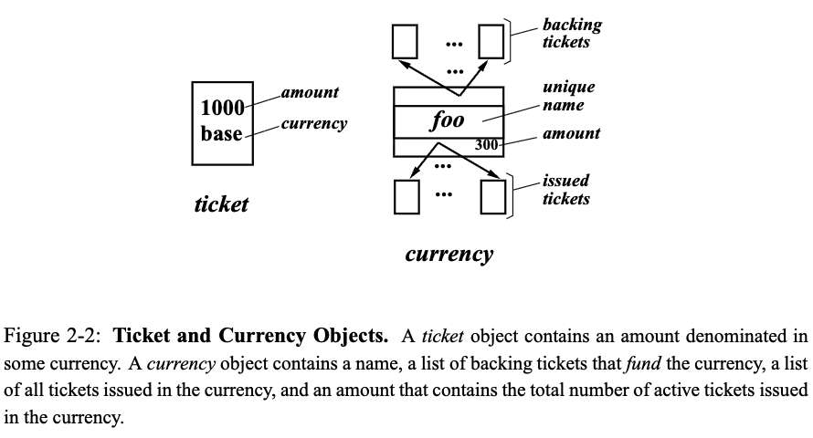

## Resource Management Framework

This chapter presents a general, flexible framework for specifying resource
management policies in concurrent systems. Resource rights are encapsulated by
abstract, first-class objects called tickets. Ticket-based policies are
expressed using two basic techniques: ticket transfers and ticket inflation.
Ticket transfers allow resource rights to be directly transferred and
redistributed among clients. Ticket inflation allows resource rights to be
changed by manipulating the overall supply of tickets. A powerful currency
abstraction provides flexible, modular control over ticket inflation. Currencies
also support the sharing, protecting, and naming of resource rights. Several
example resource management policies are presented to demonstrate the
versatility of this framework

> 本章提出了一个用于在并发系统中指定资源管理策略的通用且灵活的框架。资源权限通过
> 被称为“票据”（tickets）的抽象一等对象进行封装。基于票据的策略通过两种基本技术
> 来表达：票据转移和票据膨胀。票据转移允许资源权限在客户端之间直接转移和重新分配。
> 票据膨胀则通过操作票据的整体供应量来改变资源权限。一个强大的货币抽象为票据膨胀
> 提供了灵活、模块化的控制。货币还支持资源权限的共享、保护和命名。本章还通过几个
> 示例资源管理策略，展示了该框架的多样性和灵活性。
>
> > first-class:
> >
> > 一类对象：是指一个实体，拥有编程语言中和其他变量相同的权利和能力
> > 
> > 例如：函数, 可以像普通变量一样
> > 1. 赋值给变量
> > 2. 当作参数传递给其他函数
> > 3. 在函数中返回
> > 
> > (等等)
> > 这里的ticket 提到是first-class 表示为可以灵活的进行操作和传递，而不是
> > 受限的，只能在特定场景下使用(from GPT4.1)
> {: .prompt-info}
{: .prompt-trans}

### 2.1 Tickets

Resource rights are encapsulated by first-class objects called tickets. Tickets
can be issued in different amounts, so that a single physical ticket may
represent any number of logical tickets. In this respect, tickets are similar to
monetary notes which are also issued in different denominations. For example, a
single ticket object may represent one hundred tickets, just as a single $100
bill represents one hundred separate $1 bills. 

Tickets are owned by clients that consume resources. A client is considered to
be active while it is competing to acquire more resources. An active client is
entitled to consume resources at a rate proportional to the number of tickets
that it has been allocated. Thus, a client with twice as many tickets as another
is entitled to receive twice as much of a resource in a given time interval. The
number of tickets allocated to a client also determines its entitled response
time. Client response times are defined to be inversely proportional to ticket
allocations. Therefore, a client with twice as many tickets as another is
entitled to wait only half as long before acquiring a resource.

> 资源权限通过被称为“票据”（tickets）的一等对象进行封装。票据可以以不同的数量发
> 行，因此一张实际的票据可以代表任意数量的逻辑票据。在这方面，票据类似于以不同面
> 额发行的货币纸币。例如，一个票据对象可以代表一百张票，就像一张100美元的钞票代
> 表一百张1美元的钞票一样。
> 
> 票据由消耗资源的客户端拥有。只要客户端正在争取获取更多资源，就被视为活跃客户端。
> 活跃客户端有权按照其分配到的票据数量按比例消耗资源。因此，某个客户端的票据数量
> 是另一个客户端的两倍时，它在一定时间间隔内获得的资源也应是后者的两倍。分配给客
> 户端的票据数量还决定了它应有的响应时间。客户端的响应时间被定义为与其票据分配数
> 量成反比。因此，某个客户端的票据数量是另一个的两倍时，它在获取资源前的等待时间
> 也只有后者的一半。

Tickets encapsulate resource rights that are abstract, relative, and uniform.
Tickets are abstract because they quantify resource rights independently of
machine details. Tickets are relative since the fraction of a resource that they
represent varies dynamically in proportion to the contention for that resource.
Thus, a client will obtain more of a lightly contended resource than one that is
highly contended. In the worst case, a client will receive a share proportional
to its share of tickets in the system. This property facilitates adaptive
clients that can benefit from extra resources when other clients do not fully
utilize their allocations. Finally, tickets are uniform because rights for
heterogeneous resources can be homogeneously represented as tickets. This
property permits clients to use quantitative comparisons when making decisions
that involve tradeoffs between different resources.

> 票据（tickets）封装了抽象的、相对的和统一的资源权限。票据是抽象的，因为它们在
> 量化资源权限时不依赖于具体的机器细节。票据是相对的，因为它们所代表的资源份额会
> 根据对该资源的竞争情况动态变化。因此，当资源竞争较少时，客户端可以获得更多资源；
> 而当资源竞争激烈时，客户端获得的资源就会减少。在最坏的情况下，客户端获得的资源
> 份额会与其在系统中拥有的票据份额成正比。这个特性有利于自适应客户端——当其他客户
> 端没有充分利用分配给自己的资源时，它们可以获得额外的资源。最后，票据是统一的，
> 因为不同类型的资源权限都可以用票据这种统一的形式来表示。这个特性使客户端在需要
> 在不同资源之间进行权衡决策时，可以采用定量比较的方法。

In general, tickets have properties that are similar to those of money in
computational economies [WHH 92]. The only significant difference is that
tickets are not consumed when they are used to acquire resources. A client may
reuse a ticket any number of times, but a ticket may only be used to compete for
one resource at a time. In economic terms, a ticket behaves much like a constant
monetary income stream.

> 一般来说，票据具有与计算经济学中的货币类似的属性 [WHH 92]。唯一显著的区别在于，
> 票据在用于获取资源时并不会被消耗。一个客户端可以无限次地重复使用同一个票据，但一
> 个票据在同一时刻只能用于竞争一种资源。从经济学的角度来看，票据的行为很像一条恒定
> 的货币收入流。

### 2.2 Ticket Transfers

A ticket transfer is an explicit transfer of first-class ticket objects from one
client to another. Ticket transfers can be used to implement resource management
policies by directly redistributing resource rights. Transfers are useful in any
situation where one client blocks waiting for another. For example, Figure 2-1
illustrates the use of a ticket transfer during a synchronous remote procedure
call (RPC). A client performs a temporary ticket transfer to loan its resource
rights to the server computing on its behalf.

Ticket transfers also provide a convenient solution to the conventional priority
inversion problem in a manner that is similar to priority inheritance [SRL90].
For example, clients waiting to acquire a lock can temporarily transfer tickets
to the current lock owner. This provides the lock owner with additional resource
rights, helping it to obtain a larger share of processor time so that it can
more quickly release the lock. Unlike priority inheritance, transfers from
multiple clients are additive. A client also has the flexibility to split ticket
transfers across multiple clients on which it may be waiting. These features
would not make sense in a priority-based system, since resource rights do not
vary smoothly with priorities.

Ticket transfers are capable of specifying any ticket-based resource management
policy, since transfers can be used to implement any arbitrary distribution of
tickets to clients. However, ticket transfers are often too low-level to
conveniently express policies. The exclusive use of ticket transfers imposes a
conservation constraint: tickets may be redistributed, but they cannot be
created or destroyed. This constraint ensures that no client can deprive another
of resources without its permission. However, it also complicates the
specification of many natural policies.

For example, consider a set of processes, each a client of a time-shared
processor resource. Suppose that a parent process spawns child subprocesses and
wants to allocate resource rights equally to each child. To achieve this goal,
the parent must explicitly coordinate ticket transfers among its children
whenever a child process is created or destroyed. Although ticket transfers
alone are capable of supporting arbitrary resource management policies, their
specification is often unnecessarily complex

#### 2.3 Ticket Inflation and Deflation

Ticket inflation and deflation are alternatives to explicit ticket transfers.
Client resource rights can be escalated by creating more tickets, inflating the
total number of tickets in the system. Similarly, client resource rights can be
reduced by destroying tickets, deflating the overall number of tickets. Ticket
inflation and deflation are useful among mutually trusting clients, since they
permit resource rights to be reallocated without explicitly reshuffling tickets
among clients. This can greatly simplify the specification of many resource
management policies. For example, a parent process can allocate resource rights
equally to child subprocesses simply by creating and assigning a fixed number of
tickets to each child that is spawned, and destroying the tickets owned by each
child when it terminates.

However, uncontrolled ticket inflation is dangerous, since a client can
monopolize a resource by creating a large number of tickets. Viewed from an
economic perspective, inflation is a form of theft, since it devalues the
tickets owned by all clients. Because inflation can violate desirable modularity
and insulation properties, it must be either prohibited or strictly controlled

A key observation is that the desirability of inflation and deflation hinges on
trust. Trust implies permission to appropriate resources without explicit
authorization. When trust is present, explicit ticket transfers are often more
cumbersome and restrictive than simple, local ticket inflation. When trust is
absent, misbehaving clients can use inflation to plunder resources. Distilled
into a single principle, ticket inflation and deflation should be allowed only
within logical trust boundaries. The next section introduces a powerful
abstraction that can be used to define trust boundaries and safely exploit
ticket inflation. 

### Ticket Currencies

A ticket currency is a resource management abstraction that contains the effects
of ticket inflation in a modular way. The basic concept of a ticket is extended
to include a currency in which the ticket is denominated. Since each ticket is
denominated in a currency, resource rights can be expressed in units that are
local to each group of mutually trusting clients. A currency derives its value
from backing tickets that are denominated in more primitive currencies. The
ticketsthat back a currency are said to fund that currency. The value of a
currency can be used to fund other currencies or clients by issuing tickets
denominated in that currency. The effects of inflation are locally contained by
effectively maintaining an exchange rate between each local currency and a
common base currency that is conserved. The values of tickets denominated in
different currencies are compared by first converting them into units of the
base currency

Figure 2-2 depicts key aspects of ticket and currency objects. A ticket object
consists of an amount denominated in some currency; the notation amount.currency
will be used to refer to a ticket. A currency object consists of a unique name,
a list of backing tickets that fund the currency, a list of tickets issued in
the currency, and an amount that contains the total number of active tickets
issued in the currency. In addition, each currency should maintain permissions
that determine which clients have the right to create and destroy tickets
denominated in that currency. A variety of well-known schemes can be used to
implement permissions [Tan92]. For example, an access control list can be
associated with each currency to specify those clients that have permission to
inflate it by creating new tickets.

Currency relationships may form an arbitrary acyclic graph, enabling a wide
variety of different resource management policies. One useful currency
configuration is a hierarchy of currencies. Each currency divides its value into
subcurrencies that recursively subdivide and distribute that value by issuing
tickets. Figure 2-3 presents an example currency graph with a hierarchical tree
structure. In addition to the common base currency at the root of the tree,
distinct currencies are associated with each user and task. Two users, Alice and
Bob, are competing for computing resources. The alice currency is backed by 3000
tickets denominated in the base currency (3000.base), and the bob currency is
backed by 2000 tickets denominated in the base currency (2000.base). Thus, Alice
is entitled to 50% more resources than Bob, since their currencies are funded at
a 3 : 2 ratio.

Alice is executing two tasks, task1 and task2. She subdivides her allocation
between these tasks in a 2 : 1 ratio using tickets denominated in her own
currency – 200.alice and 100.alice. Since a total of 300 tickets are issued in
the alice currency, backed by a total of 3000 base tickets, the exchange rate
between the alice and base currencies is 1 : 10. Bob is executing a single task,
task3, and uses his entire allocation to fund it via a single 100.bob ticket.
Since a total of 100 tickets are issued in the bob currency, backed by a total
of 2000 base tickets, the bob : base exchange rate is 1 : 20. If Bob were to
create a second task with equal funding by issuing another 100.bob ticket, this
exchange rate would become 1 : 10.

The currency abstraction is useful for flexibly sharing, protecting, and naming
resource rights. Sharing is supported by allowing clients with proper
permissions to inflate or deflate a currency by creating or destroying tickets.
For example, a group of mutually trusting clients can form a currency that pools
its collective resource rights in order to simplify resource management.
Protection is guaranteed by maintaining exchange rates that automatically adjust
for intra-currency fluctuations that result from internal inflation or
deflation. Currencies also provide a convenient way to name resource rights at
various levels of abstraction. For example, currencies can be used to name the
resource rights allocated to arbitrary collections of threads, tasks,
applications, or users.

Since there is nothing comparable to a currency abstraction in conventional
operating systems, it is instructive to examine similar abstractions that are
provided in the domain of programming languages. Various aspects of currencies
can be related to features of objectoriented systems, including data abstraction,
class definitions, and multiple inheritance.

For example, currency abstractions for resource rights resemble data
abstractions for data objects. Data abstractions hide and protect
representations by restricting access to an abstract data type. By default,
access is provided only through abstract operations exported by the data type.
The code that implements those abstract operations, however, is free to directly
manipulate the underlying representation of the abstract data type. Thus, an
abstraction barrier is said to exist between the abstract data type and its
underlying representation [LG86].

A currency defines a resource management abstraction barrier that provides
similar properties for resource rights. By default, clients are not trusted, and
are restricted from interfering with resource management policies that
distribute resource rights within a currency. The clients that implement a
currency’s resource management policy, however, are free to directly manipulate
and redistribute the resource rights associated with that currency.

The use of currencies to structure resource-right relationships also resembles
the use of classes to structure object relationships in object-oriented systems
that support multiple inheritance. A classinheritsits behavior from a set
ofsuperclasses, which are combined and modified to specify new behaviors for
instances of that class. A currency inherits its funding from a set of backing
tickets, which are combined and then redistributed to specify allocations for
tickets denominated in that currency. However, one difference between currencies
and classes is the relationship among the objects that they instantiate. When a
currency issues a new ticket, it effectively dilutes the value of all existing
tickets denominated in that currency. In contrast, the objects instantiated by a
class need not affect one another.

### 2.5 Example Policies

A wide variety of resource management policies can be specified using the
general framework presented in this chapter. This section examines several
different resource management scenarios, and demonstrates how appropriate
policies can be specified.

#### 2.5.1 Basic Policies

Unlike priorities which specify absolute precedence constraints,tickets are
specifically designed to specify relative service rates. Thus, the most basic
examples of ticket-based resource management policies are simple service rate
specifications. If the total number of tickets in a system is fixed, then a
ticket allocation directly specifies an absolute share of a resource. For
example, a client with 125 tickets in a system with a total of 1000 tickets will
receive a 12.5% resource share. Ticket allocations can also be used to specify
relative importance. For example, a client that is twice as important as another
is simply given twice as many tickets.

Ticket inflation and deflation provide a convenient way for concurrent clients
to implement resource management policies. For example, cooperative
(AND-parallel) clients can independently adjust their ticket allocations based
upon application-specific estimates of remaining work. Similarly, competitive
(OR-parallel) clients can independently adjust their ticket allocations based on
application-specific metrics for progress. One concrete example is the
management of concurrent computations that perform heuristic searches. Such
computations typically assign numerical values to summarize the progress made
along each search path. These values can be used directly as ticket assignments,
focusing resources on those paths which are most promising, without starving the
exploration of alternative paths.

Tickets can also be used to fund speculative computations that have the
potential to accelerate a program’s execution, but are not required for
correctness. With relatively small ticket allocations, speculative computations
will be scheduled most frequently when there is little contention for resources.
During periods of high resource contention, they will be scheduled very
infrequently. Thus, very low service rate specifications can exploit unused
resources while limiting the impact of speculation on more important
computations.

If desired, tickets can also be used to approximate absolute priority levels.
For example, a series of currencies , , , can be defined such that currency has
100 times the funding of currency in currency at level . A client with emulated
priority level is allocated a single ticket denominated . Clients at priority
level will be serviced 100 times more frequently than clients , approximating a
strict priority ordering.

> 

#### 2.5.2 Administrative Policies

For long-running computationssuch as those found in engineering and scientific
environments, there is a need to regulate the consumption of computing resources
that are shared among users and applications of varying importance [Hel93].
Currencies can be used to isolate the policies of projects, users, and
applicationsfrom one another, and relative funding levels can be used to specify
importance.

For example, a system administrator can allocate ticket levels to different groups based
on criteria such as project importance, resource needs, or real monetary funding. Groups
can subdivide their allocations among users based upon need or status within the group; an
egalitarian approach would give each user an equal allocation. Users can directly allocate their
own resource rights to applications based upon factors such as relative importance or impending
deadlines. Since currency relationships need not follow a strict hierarchy, users may belong to
multiple groups. It is also possible for one group to subsidize another. For example, if group
is waiting for results from group , it can issue a ticket denominated in currency , and use
it to fund group .

> 

### 2.5.3 Interactive Application Policies

For interactive computations such as databases and media-based applications,
programmers and users need the ability to rapidly focus resources on those tasks
that are currently important. In fact, research in computer-human interaction
has demonstrated that responsiveness is often the most significant factor in
determining user productivity [DJ90].

Many interactive systems, such as databases and the World Wide Web, are
structured using a client-server framework. Servers process requests from a wide
variety of clients that may demand different levels of service. Some requests
may be inherently more important or time-critical than others. Users may also
vary in importance or willingness to pay a monetary premium for better service.
In such scenarios, ticket allocations can be used to specify importance, and
ticket transfers can be used to allow servers to compute using the resource
rights of requesting clients.

Another scenario that is becoming increasingly common is the need to control the
quality of service when two or more video viewers are displayed [CT94]. Adaptive
viewers are capable of dynamically altering image resolution and frame rates to
match current resource availability. Coupled with dynamic ticket inflation,
adaptive viewers permit users to selectively improve the quality of those video
streams to which they are currently paying the most attention. For example, a
graphical control associated with each viewer could be manipulated to smoothly
improve or degrade a viewer’s quality of service by inflating or deflating its
ticket allocation. Alternatively, a preset number of tickets could be associated
with the window that owns the current input focus. Dynamic ticket transfers make
it possible to shift resources as the focus changes, e.g., in response to mouse
movements. With an input device capable of tracking eye movements, a similar
technique could even be used to automatically adjust the performance of
applications based upon the user’s visual focal point.

In addition to user-directed control over resource management, programmatic
application- level control can also be used to improve responsiveness despite
resource limitations [DJ90, TL93]. For example, a graphics-intensive program
could devote a large share of its processing resources to a rendering operation
until it has displayed a crude but usable outline or wire- frame. The share of
resources devoted to rendering could then be reduced via ticket deflation,
allowing a more polished image to be computed while most resources are devoted
to improving the responsiveness of more critical operations. ## 参考链接

## Chapter 3 Proportional-Share Mechanisms

1. [Lottery and Stride Scheduling: Flexible Proportional-Share Resource Management(原文)](https://www.waldspurger.org/carl/papers/phd-mit-tr667.pdf)

