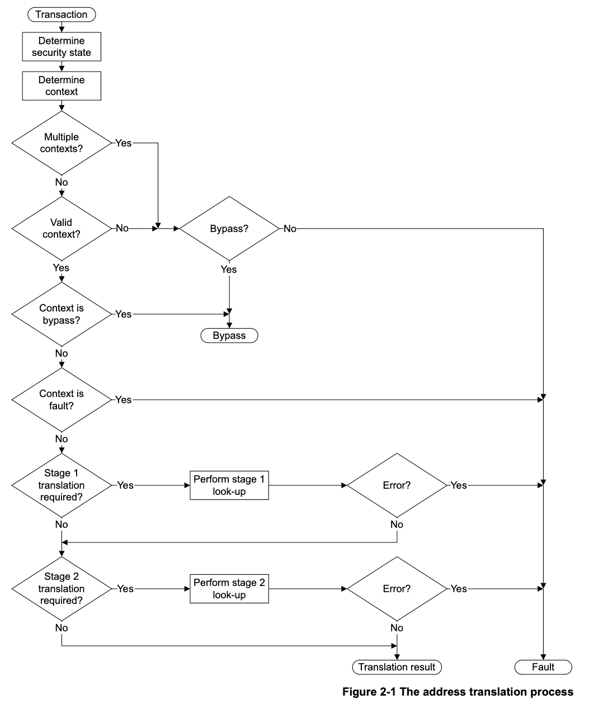

## 2.1 Overview of address translation

At the memory system level, a System MMU controls:

* security state determination
* address translation
* memory access permissions and determination of memory attributes
* memory attribute checks.

Figure 2-1 on page 2-21 shows an overview of the address translation process.

An access to a System MMU is referred to as a transaction:

+ a client transaction is an access by a client device, that the System MMU is
  to process
+ a configuration transaction is an access by a device that accesses a register
  or a command in the System MMU configuration address space.

> 在内存系统层面，SMMU（系统MMU）主要负责以下功能：
> * 安全状态判定（security state determination）
> * 地址转换（address translation）
> * 内存访问权限和内存属性的判定（memory access permissions and determination of
>   memory attributes）
> * 内存属性检查（memory attribute checks）
> 
> 第2-21页的图2-1展示了地址转换流程的概览。
>
> 对SMMU的访问被称为事务（transaction）：
> 
> * 客户端事务（client transaction）：指由客户端设备发起、需要SMMU处理的访问。
> * 配置事务（configuration transaction）：指访问SMMU配置地址空间中的寄存器或
>   命令的设备发起的访问。安全状态判定用于识别事务是否来自安全（Secure）设备或
>   非安全（Non-secure）设备。
{: .prompt-trans}

**Security state determination** identifies **whether a transaction is from a Secure
or Non-secure device**.

**Context determination** identifies **the stage 1 or stage 2 context resources the
System MMU uses to process a transaction**. In some cases, the System MMU can be
configured to permit a transaction to bypass the translation process, or to
fault a transaction, regardless of the requested translation.

Stage 1 and stage 2 translation tables provide translation and memory attribute
information. The transaction is then processed subject to required checks on the
memory access.

The acceleration of translation through the use of TLB functionality is
supported by the architecture. The System MMU architecture provides TLB
maintenance operations to manage TLBs. The exact behavior of any TLB
functionality is IMPLEMENTATION DEFINED.

> 安全状态判定用于 **_识别一个事务是来自安全设备还是非安全设备_** 。
>
> 上下文判定用于 **_确定 SMMU（系统内存管理单元）将使用一级（stage 1）还是二级
> （stage 2）上下文资源来处理该事务_** 。在某些情况下，SMMU 可以被配置为允许事务
> 绕过地址转换过程，或者无论请求的转换如何，都将事务处理为故障。
>
> 一级和二级转换表为事务提供地址转换和内存属性信息。随后，事务会根据对内存访问的
> 必要检查来处理。
>
> 架构支持通过 TLB（快表）功能来加速地址转换。SMMU 架构提供了 TLB 维护操作来管理
> TLB。任何 TLB 功能的具体行为属于实现相关（IMPLEMENTATION DEFINED）。
{: .prompt-trans}

> Note
>
> For a transaction that requires two stages of address translation, as
> described in About the ARM System MMU architecture on page 1-18, translation
> table addresses for the stage 1 translation are typically defined in the IPA
> address space. If so, for each stage 1 lookup the System MMU must perform a
> stage 2 translation of the translation table address, to map the IPA to the
> corresponding PA. This stage 2 translation might fail, generating an error.
> Figure 2-1 does not show this possible dependence of a stage 1 lookup on a
> stage 2 translation.
>
> > 对于需要两级地址转换的事务（如第1-18页《关于ARM System MMU架构》所述），**_一
> > 级转换_** （stage 1 translation）的页表地址 **_通常是在IPA（中间物理地址）地址
> > 空间中定义的_**  。如果是这样，那么每次进行一级查表时，SMMU都必须对该页表地址执
> > 行一次二级转换（stage 2 translation），以将IPA映射到对应的物理地址（PA）。这一
> > 步的二级转换可能会失败，从而产生错误。图2-1没有展示一级查表可能依赖于二级转换
> > 的这种情况。
> {: .prompt-trans}

## 2.2 Security state determination

The System MMU architecture supports shared use of a System MMU between Secure
and Non-secure execution domains. The Secure execution domain can make both
Secure and Non-secure MMU accesses. The Non-secure domain is limited to
Non-secure accesses. The first step of transaction processing identifies which
of these domains a transaction belongs to, and therefore the set of resources
that process the transaction.

A device can transition between Secure and Normal ownership dynamically under
the control of Secure software, and a Secure device can issue a transaction to
Secure or Non-secure address space. Therefore, the security level, Secure or
Non-secure, of a transaction arriving at the System MMU might be insufficient to
determine whether a memory access originated from a Secure or a Non-secure
device. In a system incorporating a System MMU, each transaction therefore has:

* a Secure or Non-secure memory access status
* a transaction security state attribute indicating whether the transaction
  originated from a Secure or Non-secure device.

> ARM System MMU 架构支持在安全（Secure）和非安全（Non-secure）执行域之间共享使
> 用 SMMU。安全执行域可以进行安全和非安全的 MMU 访问，而非安全域仅限于非安全访问。
> 事务处理的第一步是确定事务属于哪个执行域，从而确定处理该事务的资源集合。
>
> 设备可以在安全软件的控制下，在安全和普通所有权之间动态切换，并且安全设备可以向
> 安全或非安全地址空间发起事务。因此，到达 SMMU 的事务的安全级别（安全或非安全）
> 可能不足以判断该内存访问是来自安全设备还是非安全设备。在包含 SMMU 的系统中，每
> 个事务因此都具有：
>
> * 一个安全或非安全的内存访问状态
> * 一个事务安全状态属性，用于指示该事务是来自安全设备还是非安全设备
{: .prompt-trans}

> TODO
>
> 怎么判断一个设备是否是安全设备，还是非安全设备. 个人猜测是在SMMU中有标记
{: .prompt-info}

The mechanism by which a system determines the security state of a transaction
depends on whether the security state determination address space is present, as
defined by the SMMU_IDR1 SSDTP bit. When this address space is present,
SMMU_SSDR registers are provided in the System MMU address space.

* Security state determination address is present

  + There are a number of ways in which a system might determine the security
    state of a transaction. The System MMU architecture does not define how
    this state is determined, but reserves space in the System MMU address
    space to provide an address-mapped bit vector that permits the security
    state to be determined from an SSD_Index associated with the transaction.
    See System MMU security state determination address space on page 14-184
    for more information.

    Before transferring control to Non-secure software, Secure software must
    access the the appropriate SMMU_SSDRn register and:

    1. set to 0 all bits corresponding to devices that must be Secure
    2. set to 1 all other bits
    3. read all bits to verify correct operation.

> 系统判定事务安全状态的机制，取决于是否存在安全状态判定地址空间（ **_security
> state determination address space_** ），这一点由 SMMU_IDR1 寄存器的 SSDTP 位
> 定义。当该地址空间存在时，SMMU_SSDR 寄存器会被映射到 SMMU 的地址空间中。
>
> * 安全状态判定地址空间存在时：
> 
>   + 系统可以通过多种方式判定事务的安全状态。SMMU 架构本身不规定具体的判定方法，
>     但在 SMMU 地址空间中预留了一个地址映射的位向量（bit vector），允许通过与事
>     务相关联的 SSD_Index 来判定安全状态。更多信息可参考第14-184页“System MMU
>     security state determination address space”。
> 
>     在将控制权交给非安全软件之前，安全软件必须访问相应的 SMMU_SSDRn 寄存器，并
>     执行以下操作：
> 
>     1. 对所有必须为安全（Secure）的设备对应的位，设置为0；
>     2. 对其他所有位，设置为1；
>     3. 读取所有位以验证操作是否正确。
{: .prompt-trans}

* Security state determination address is not present

  A System MMU implementation and the system that incorporates it can adopt
  alternative IMPLEMENTATION DEFINED approaches to determine the security state
  of a transaction. For example:

  + the transaction source can determine a security state and propagate this with
    the transaction to the System MMU

  + the System MMU can use the Secure memory access status in systems where all
    sources of Secure transactions only issue transactions with a Secure
    transaction status

  + the System MMU can use other platform-specific knowledge to determine the
    security status of each transaction.

> * 安全状态判定地址空间不存在时：
>
>   SMMU 的具体实现以及集成该 SMMU 的系统可以采用其他实现自定义（IMPLEMENTATION
>   DEFINED）的方法来判定事务的安全状态。例如：
>
>   + 事务源设备可以自行判定安全状态，并在事务发起时将该状态一同传递给 SMMU；
>   + 在所有安全事务的来源设备仅发起带有安全事务状态的系统中，SMMU 可以直接使用
>     安全内存访问状态来判定；
>   + SMMU 也可以利用其他平台特定的信息来判定每个事务的安全状态。

In either case, to prevent any device incorrectly being configured as Secure,
Secure software must:

* be aware of the security state determination mechanism
* be aware of all devices that are permitted to be classed as Secure
* be able to identify the system to ensure the appropriate security state
  determination mechanism is used.

> 无论采用哪种方式，为了防止任何设备被错误地配置为安全（Secure），安全软件必须：
>
> * 了解安全状态判定的机制；
> * 明确所有被允许归类为安全（Secure）的设备；
> * 能够识别当前系统，以确保采用适当的安全状态判定机制。

### 2.2.1 Banked registers

Some System MMU registers are Banked for security. A Non-secure access to a
register address accesses the Non-secure copy of the register. A Secure access
accesses the Secure copy in the Secure address space, at the same address offset
as its Non-secure counterpart. For a configuration transaction, the security
level determines which register is accessed. For a client transaction, the
security state of the transaction determines which resource to use to process
the transaction.

Not all registers available in both the Secure and Non-secure security states
are Banked. The registers that are not Banked are:

* in translation contexts that are reserved by Secure or Non-secure software
* global address translation commands that are common to the Secure and
  Non-secure security states. 

For information about Banked registers and naming conventions, see _Register
names on page xiii_.

## 引用其他章节
### SMMU_IDR1
* SSDTP, bit[12] 

  _Security State Determination Table Present. The possible values of this bit are:_
  + 0 The Security state determination address space is UNK/WI. 
  + 1 The Security state determination address space is populated.

  > * UNK/WI: **_(Unknown/write ignore)_**
  > * populated: 有人居住的
  {: .prompt-trans}

  In an implementation that includes the Security Extensions, Non-secure access
  to this field is RAZ.

### 参考链接
1. 
