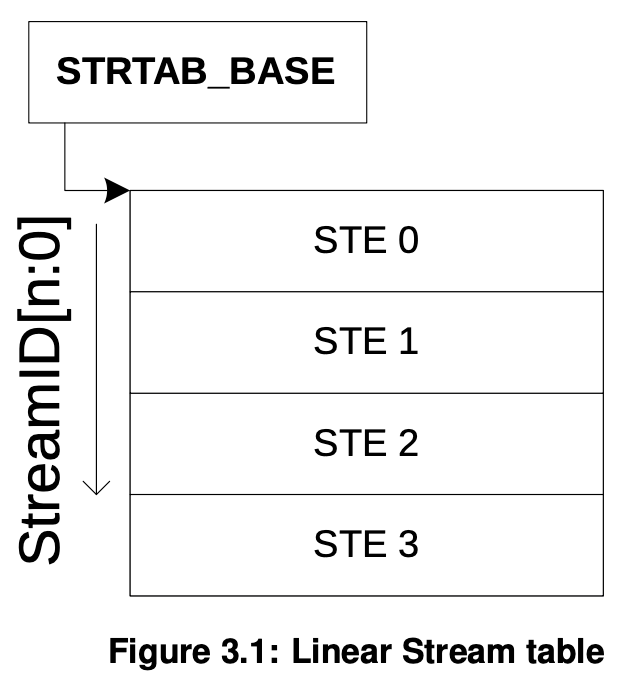
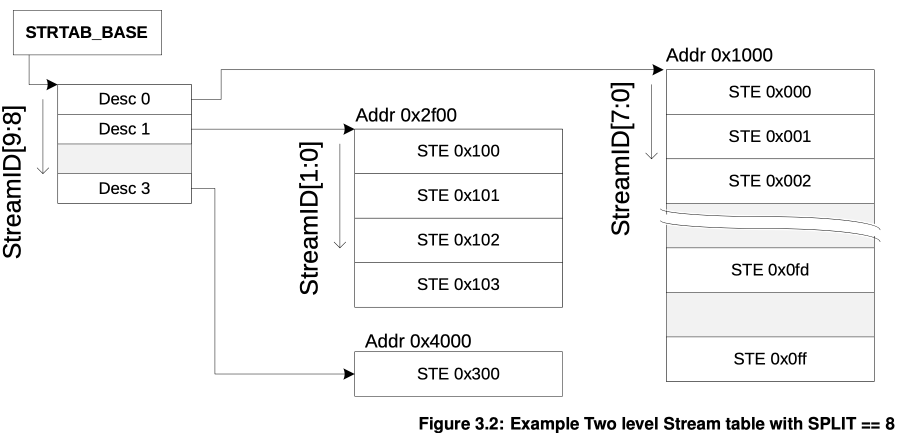
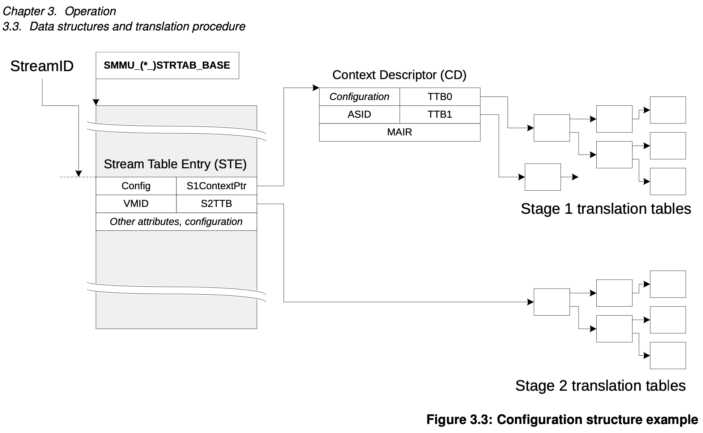
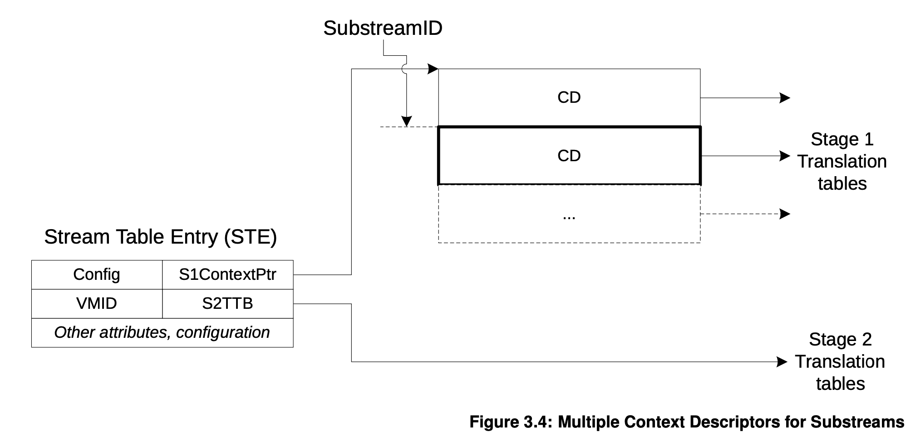
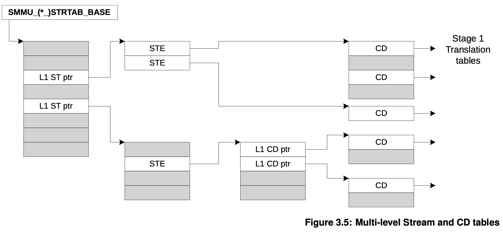
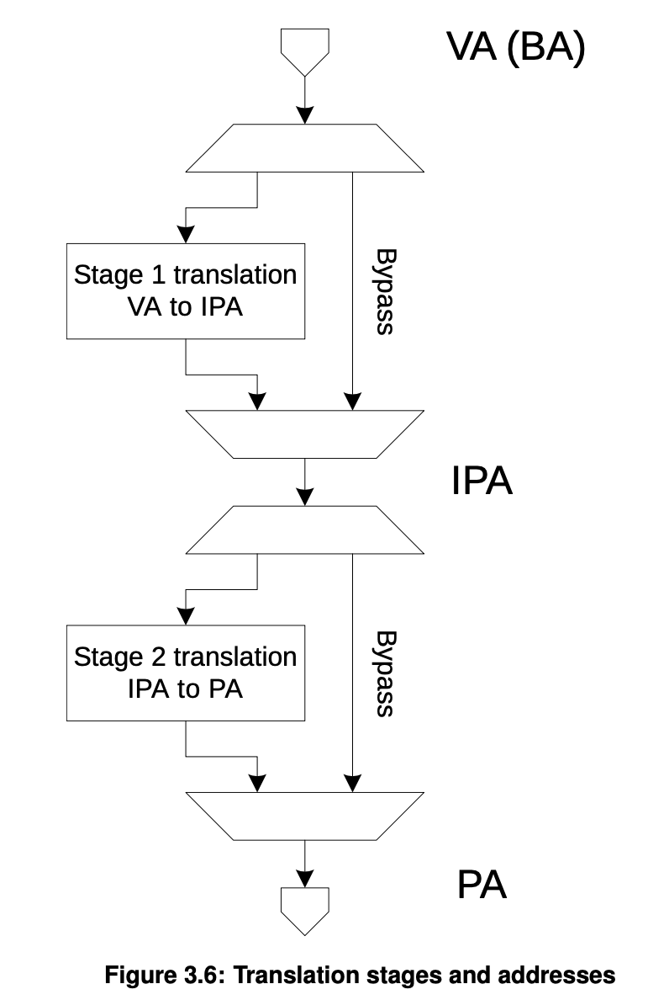
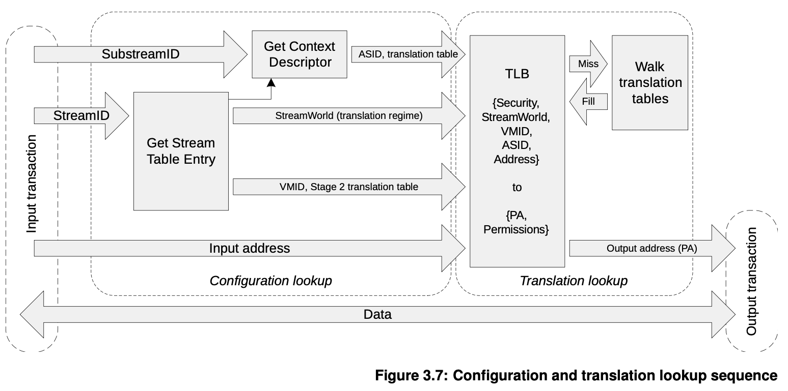
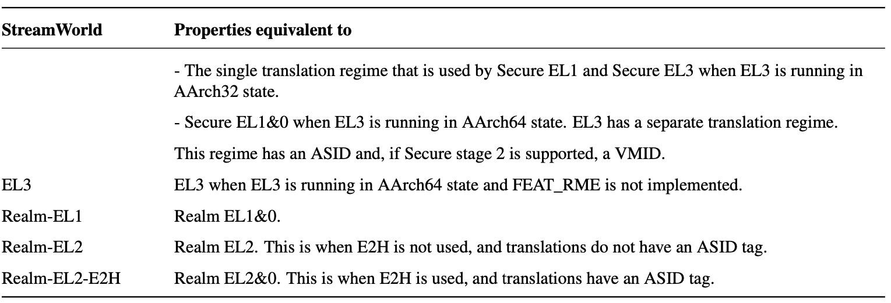

## 3.1 Software interface

The SMMU has three interfaces that software uses:

1. Memory-based data structures to map devices to translation tables which are
   used to translate client device addresses.

2. Memory-based circular buffer queues. These are a Command queue for commands
   to the SMMU, an Event queue for event/fault reports from the SMMU, and a PRI
   queue for receipt of PCIe page requests.

   Note: The PRI queue is only present on SMMUs supporting PRI services. This
   additional queue allows processing of PRI requests from devices separate from
   event or fault reports.

3. A set of registers, for each supported Security state, for discovery and
   SMMU-global configuration.

> SMMU（系统内存管理单元）为软件提供了三种接口：
>
> 1. 基于内存的数据结构，用于将设备映射到转换表，这些转换表用于转换客户端设备的
>    地址。
>
> 2. 基于内存的循环缓冲队列。这些队列包括用于向 SMMU 发送命令的命令队列、用于
>    SMMU 向软件报告事件或故障的事件队列，以及用于接收 PCIe 页请求的 PRI 队列。
>
>    注意：PRI 队列仅在支持 PRI 服务的 SMMU 上存在。这个额外的队列允许将设备发起
>    的 PRI 请求与事件或故障报告分开处理。
>
> 3. 一组寄存器，**_每个受支持的安全状态都有一套_** ，用于设备发现和 SMMU 全局配
>    置。
{: .prompt-trans}

The registers indicate the base addresses of the structures and queues, provide
**feature detection** and **identification registers** and a global control
register to enable **queue processing** and **translation of traffic**. When
**Secure state is supported**, an **additional register** set exists to allow
Secure software to maintain Secure device structures, issue commands on a second
Secure Command queue and read Secure events from a Secure Event queue**.

In virtualization scenarios allowing stage 1 translation, a guest OS is
presented with the same programming interface and therefore believes it is in
control of a real SMMU (albeit stage 1-only) with the same format of Command,
Event, and optionally PRI, queues, and in-memory data structures.

Certain fields in architected SMMU registers and structures are marked as
IMPLEMENTATION DEFINED. The content of these fields is specific to the SMMU
implementation, but implementers must not use these fields in such a way that a
generic SMMUv3 driver becomes unusable. Unless a driver has extended knowledge
of particular IMPLEMENTATION DEFINED fields or features, the driver must treat
all such fields as Reserved and set them to 0.

An implementation only uses IMPLEMENTATION DEFINED fields to enable extended
functionality or features, and remains compatible with generic driver software
by maintaining architected behavior when these fields are set to 0.

> 这些寄存器指示结构体和队列的基地址，提供功能检测和标识寄存器，以及用于使能队列
> 处理和流量地址转换的全局控制寄存器。如果支持安全状态，还会有额外的一组寄存器，
> 允许安全软件维护安全设备结构，通过第二个安全命令队列下发命令，并从安全事件队列
> 读取安全事件。
>
> 在允许一级转换（stage 1 translation）的虚拟化场景下，客户操作系统（guest OS）
> 会被呈现出同样的编程接口，因此它认为自己控制着一个真实的 SMMU（虽然只支持一级
> 转换），其命令队列、事件队列（以及可选的 PRI 队列）和内存数据结构的格式都一致。
>
> > NOTE
> >
> > stage 1是指 IOVA->PA, 这里相当于满足guest的IOVA->PA的功能，所以，需要让guest
> > 感知IOMMU的存在，这里不太清楚SMMU这边是如何做的虚拟化，hardware or software??
> > 另外除了stage 1，还需要stage 2(GPA->HPA).
> {: .prompt-tip}
>
> 在架构定义的 SMMU 寄存器和结构体中，某些字段被标记为“实现自定义”
> （IMPLEMENTATION DEFINED）。这些字段的内容由具体的 SMMU 实现决定，但实现者不得
> 以任何方式使用这些字段，导致通用的 SMMUv3 驱动无法正常工作。除非驱动对某些实现
> 自定义字段或特性有扩展了解，否则驱动必须将所有此类字段视为保留（Reserved）并设
> 为 0。
>
> 实现者仅在需要扩展功能或特性时才使用这些实现自定义字段，并且通过在这些字段设为
> 0 时保持架构定义的行为，从而确保与通用驱动软件的兼容性。
{: .prompt-trans}

## 3.2 Stream numbering

An incoming transaction has an address, size, and attributes such as read/write,
Secure/Non-secure, Shareability, Cacheability. If more than one client device
uses the SMMU traffic must also have a sideband StreamID so the sources can be
differentiated. How a StreamID is constructed and carried through the system is
IMPLEMENTATION DEFINED. Logically, a StreamID corresponds to a device that
initiated a transaction.

Note: The mapping of a physical device to StreamID must be described to system
software.

Arm recommends that StreamID be a dense namespace starting at 0. The StreamID
namespace is per-SMMU. Devices assigned the same StreamID but behind different
SMMUs are seen to be different sources. **A device might emit traffic with more
than one StreamID, representing data streams differentiated by device-specific
state.**

> 一次进入 SMMU 的事务包含地址、大小以及如读/写、安全/非安全、可共享性、可缓存性
> 等属性。如果有多个客户端设备使用 SMMU，事务还必须带有一个边带的 StreamID，以便
> 区分来源设备。StreamID 的构建方式和在系统中的传递方式是实现自定义的
> （IMPLEMENTATION DEFINED）。从逻辑上讲，StreamID 就对应于发起该事务的设备。
>
> 注意：物理设备和 StreamID 的映射必须告知系统软件。
>
> Arm 推荐 StreamID 命名空间应从 0 开始，且尽可能密集分配。StreamID 的命名空间是
> 每个 SMMU 独立的。即使不同 SMMU 下的设备分配了相同的 StreamID，也会被视为不同
> 的来源。一个设备可以发出带有多个不同 StreamID 的流量，用于表示设备特定状态下区
> 分的数据流。
{: .prompt-trans}

> NOTE
>
> 特定状态 是指/包括 secure state 么?
{: .prompt-tip}

StreamID is of IMPLEMENTATION DEFINED size, between 0 bits and 32 bits.

The StreamID is used to select a Stream Table Entry (STE) in a Stream table,
which contains per-device configuration. The maximum size of in-memory
configuration structures relates to the maximum StreamID span (see 3.3 Data
structures and translation procedure below), with a maximum of 2StreamIDSize
entries in the Stream table.

Another property, SubstreamID, might optionally be provided to an SMMU
implementing stage 1 translation. The SubstreamID is of IMPLEMENTATION DEFINED
size, between 0 bits and 20 bits, and differentiates streams of traffic
originating from the same logical block to associate different application
address translations to each.

Note: An example would be a compute accelerator with 8 contexts that might each
map to a different user process, but where the single device has common
configuration meaning it must be assigned to a VM whole.

Note: The SubstreamID is equivalent to a PCIe PASID. Because the concept can be
applied to non-PCIe systems, it has been given a more generic name in the SMMU.
The maximum size of SubstreamID, 20 bits, matches the maximum size of a PCIe
PASID.

> StreamID 的位宽是实现自定义的，可以在 0 到 32 位之间。
>
> StreamID 用于在流表（Stream Table）中选择对应的流表项（STE），每个 STE 包含针
> 对每个设备的配置信息。内存中配置结构的最大尺寸取决于 StreamID 的最大跨度（详见
> 下文 3.3 数据结构和转换流程），流表最大可有 2^StreamIDSize 个条目。
>
> 另一个属性 SubstreamID（子流ID）可选地提供给实现了一级转换（stage 1
> translation）的 SMMU。SubstreamID 的位宽也是实现自定义的，范围为 0 到 20 位，
> 用于区分同一逻辑块发出的不同数据流，从而为每个流关联不同的应用地址转换。
>
> 注意：例如，一个计算加速器有 8 个上下文，每个上下文可能映射到不同的用户进程，
> 但该设备的通用配置意味着它必须整体分配给一个虚拟机。
>
> 注意：SubstreamID 等同于 PCIe 的 PASID。由于该概念可应用于非 PCIe 系统，因此在
> SMMU 中采用了更通用的命名。SubstreamID 的最大位宽为 20 位，与 PCIe PASID 的最
> 大位宽一致。
{: .prompt-trans}

The incoming transaction flags whether a SubstreamID is supplied and this might
differ on a per-transaction basis. Both of these properties and sizes are
discoverable through the SMMU_IDR1 register. See section 16.4 System integration
for recommendations on StreamID and SubstreamID sizing.

The StreamID is the key that identifies all configuration for a transaction. A
StreamID is configured to bypass or be subject to translation and such
configuration determines which stage 1 or stage 2 translation to apply. The
SubstreamID provides a modifier that selects between a set of stage 1
translations indicated by the StreamID but has no effect on the stage 2
translation which is selected by the StreamID only.

A stage 2-only implementation does not take a SubstreamID input. An
implementation with stage 1 is not required to support substreams, therefore is
not required to take a SubstreamID input.

The SMMU optionally supports Secure state and, if supported, the StreamID input
to the SMMU is qualified by a SEC_SID flag that determines whether the input
StreamID value refers to the Secure or Non-secure StreamID namespace. A
Non-secure StreamID identifies an STE within the Non-secure Stream table and a
Secure StreamID identifies an STE within the Secure Stream table. In this
specification, the term StreamID implicitly refers to the StreamID disambiguated
by SEC_SID (if present) and does not refer solely to a literal StreamID input
value (which would be associated with two STEs when Secure state is supported)
unless explicitly stated otherwise. See section 3.10.2 Support for Secure state.

Arm expects that, for PCI, StreamID is generated from the PCI RequesterID so
that StreamID[15:0] == RequesterID[15:0]. When more than one PCIe hierarchy is
hosted by one SMMU, Arm recommends that the 16-bit RequesterID namespaces are
arranged into a larger StreamID namespace by using upper bits of StreamID to
differentiate the contiguous RequesterID namespaces, so that StreamID[N:16]
indicates which Root Complex (PCIe domain/segment) is the source of the stream
source. In PCIe systems, the SubstreamID is intended to be directly provided
from the PASID [1] in a one to one fashion.

Therefore, for SMMU implementations intended for use with PCI clients, supported
StreamID size must be at least 16 bits.

> 每个进入的事务都会标记是否带有 SubstreamID，这一情况可能针对每个事务有所不同。
> 这两个属性及其位宽都可以通过 SMMU_IDR1 寄存器进行查询。有关 StreamID 和
> SubstreamID 位宽的建议，见 16.4 节“系统集成”。
>
> StreamID 是标识所有事务配置信息的关键。StreamID 可以被配置为绕过或参与转换，这
> 决定了将应用哪一级（stage 1 或 stage 2）的地址转换。**SubstreamID** 作为修饰符，
> **用于在由 StreamID 指定的一组 stage 1 转换中进行选择** ，但对 stage 2 转换无
> 影响，stage 2 转换只由 StreamID 决定。
>
> 仅支持 stage 2 的实现不会接收 SubstreamID 输入。支持 stage 1 的实现不一定要支
> 持子流，因此也不一定要接收 SubstreamID 输入。
>
> SMMU 可选支持安全状态（Secure state），如果支持，则输入给 SMMU 的 StreamID 还
> 要加上 **SEC_SID** 标志，以确定输入的 StreamID 属于安全还是非安全命名空间。
> **非安全 StreamID 会在非安全流表中查找 STE，安全 StreamID 会在安全流表中查找
> STE** 。本规范中，术语 StreamID 默认指的是经过 SEC_SID 区分后的 StreamID（如
> 有），而不是单纯的 StreamID 输入值（在支持安全状态时，单一 StreamID 输入值会关
> 联两个 STE，除非特别说明）。详见 3.10.2 节“安全状态支持”。
>
> Arm 期望在 PCI 系统中，StreamID 由 PCI RequesterID 生成， **即 StreamID[15:0]
> == RequesterID[15:0]** 。当一个 SMMU 下有多个 PCIe 层级时，建议将 16 位
> RequesterID 命名空间通过 StreamID 的高位区分，形成更大的 StreamID 命名空间，即
> 用 StreamID[N:16] 区分不同的 Root Complex（PCIe 域/段）作为流的来源。在 PCIe
> 系统中，**SubstreamID 直接由 PASID 提供** ，一一对应。
>
> > NOTE
> >
> > 1. StreamID[15: 0] == RequesterID[15:0]
> > 2. StreamID[N: 16] 区分不同的 Root Complex (Pcie domain/segment)
> > 3. SubstreamID <--- PASID
> {: .prompt-tip}
>
> 因此，对于面向 PCI 客户端的 SMMU 实现，支持的 StreamID 位宽至少应为 16 位。
{: .prompt-trans}


## 3.3 Data structures and translation procedure

The SMMU uses a set of data structures in memory to locate translation data.
**Registers** hold the base addresses of the **initial root structure, the
Stream table**. An **STE** contains stage 2 translation table base pointers, and
also locates stage 1 configuration structures, which contain translation table
base pointers. A **Context Descriptor (CD) represents stage 1 translation** ,
and a **Stream Table Entry represents stage 2 translation** .

Therefore, there are two distinct groups of structures used by the SMMU:

+ Configuration structures, which map from the StreamID of a transaction (a
  device originator identifier) to the translation table base pointers,
  configuration, and context under which the translation tables are accessed.

+ Translation table structures that are used to perform the VA to IPA and IPA to
  PA translation of addresses for stage 1 and stage 2, respectively.

> SMMU 在内存中使用一组数据结构来定位转换数据。寄存器保存了初始根结构（即流表，
> Stream table）的基地址。一个流表项（STE）包含了二级转换表（stage 2 translation
> table）的基地址指针，同时还定位了一级配置结构（stage 1 configuration
> structures），这些结构包含了转换表的基地址指针。上下文描述符（Context
> Descriptor, CD）表示一级转换（stage 1 translation），而流表项（Stream Table
> Entry, STE）表示二级转换（stage 2 translation）。
>
> > ```
> > REGISTER
> > \-> Stream Stable
> >     \- STE
> >     \- STE
> >       \-> stage 2 translation table
> >       \-> CD
> >           \->
> > ```
> > 待补充!!
> {: .prompt-danger}
>
> 因此，SMMU 使用了两类不同的数据结构：
>
> + 配置结构：用于根据事务的 StreamID（设备发起者标识符）映射到转换表的基地址指
>   针、配置和上下文，从而访问转换表。
>
> + 转换表结构：用于执行地址的转换，即一级转换（VA 到 IPA）和二级转换（IPA 到
>   PA）。
{: .prompt-trans}

The procedure for translation of an incoming transaction is to first locate
configuration appropriate for that transaction, identified by its StreamID and,
optionally, SubstreamID, and then to use that configuration to locate
translations for the address used.

The first step in dealing with an incoming transaction is to locate the STE,
which tells the SMMU what other configuration it requires.

Conceptually, an STE describes configuration for a client device in terms of
whether it is subject to stage 1 or stage 2 translation or both. Multiple
devices can be associated with a single Virtual Machine, so multiple STEs can
share common stage 2 translation tables. Similarly, multiple devices (strictly,
streams) might share common stage 1 configuration, therefore multiple STEs could
share common CDs.

> 对一个传入事务进行地址转换的过程，**首先是根据该事务的 StreamID（以及可选的
> SubstreamID）定位到适合该事务的配置信息** , 然后使用这些配置信息去查找用于地址
> 转换的数据结构。
>
> 处理一个传入事务的第一步，是定位其对应的流表项（STE），STE 告诉 SMMU 还需要哪
> 些其他配置信息。
>
> 从概念上讲，STE 描述了某个客户端设备的配置，包括它是否需要进行一级（stage 1）
> 或二级（stage 2）地址转换，或者两者都需要。多个设备可以关联到同一个虚拟机，因
> 此多个 STE 可以共享同一套二级（stage 2）转换表。类似地，多个设备（严格来说是多
> 个流）也可能共享同一套一级（stage 1）配置，因此多个 STE 也可以共享同一个上下文
> 描述符（CD）。
{: .prompt-trans}

### 3.3.1 Stream table lookup

The StreamID of an incoming transaction locates an STE. Two formats of Stream
table are supported. The format is set by the Stream table base registers. The
incoming StreamID is range-checked against the programmed table size, and a
transaction is terminated if its StreamID would otherwise select an entry
outside the configured Stream table extent (or outside a level 2 span). See
SMMU_STRTAB_BASE_CFG and C_BAD_STREAMID.

The StreamID of an incoming transaction might be qualified by SEC_SID, and this
determines which Stream table, or cached copies of that Stream table, is used
for lookup. See section 3.10.1 StreamID Security state (SEC_SID).

> 传入事务的 StreamID 用于定位一个流表项（STE）。SMMU 支持两种流表（Stream table）
> 格式，具体格式由`Stream table base registers`设置。传入的 StreamID 会根据已配
> 置的表大小进行范围检查，如果 StreamID 会选中超出配置流表范围（或二级表范围）之
> 外的条目，该事务将被终止。详见 SMMU_STRTAB_BASE_CFG 和 C_BAD_STREAMID。
>
> 传入事务的 StreamID 可能还会被 SEC_SID 修饰，这决定了查找时使用哪一张流表，或
> 者其缓存副本。详见 3.10.1 节 StreamID 安全状态（SEC_SID）。
{: .prompt-trans}

#### 3.3.1.1 Linear Stream Table



A linear Stream table is a contiguous array of STEs, indexed from 0 by StreamID.
The size is configurable as a 2ⁿ multiple of STE size up to the maximum number
of StreamID bits supported in hardware by the SMMU. The linear Stream table
format is supported by all SMMU implementations.

> 线性流表（linear Stream table）是一个由 STE（流表项）组成的连续数组，通过
> StreamID 从 0 开始进行索引。其大小可以配置为 STE 大小的 2ⁿ 倍，最大可支持的大
> 小由 SMMU 硬件支持的 StreamID 位数决定。所有的 SMMU 实现都支持线性流表格式。
{: .prompt-trans}

#### 3.3.1.2 2-level Stream table



A 2-level Stream table is a structure consisting of one top-level table that
contains descriptors that point to multiple second-level tables that contain
linear arrays of STEs. The span of StreamIDs covered by the entire structure is
configurable up to the maximum number supported by the SMMU but the second-level
tables do not have to be fully populated and might vary in size. This saves
memory and avoids the requirement of large physically-contiguous allocations for
very large StreamID spaces.

The top-level table is indexed by StreamID[n:x], where n is the uppermost
StreamID bit covered, and x is a configurable Split point given by SMMU_(*_)
STRTAB_BASE_CFG.SPLIT. The second-level tables are indexed by up to StreamID[x -
1:0], depending on the span of each table.

Support for the 2-level Stream table format is discoverable using the
SMMU_IDR0.ST_LEVEL field. Where 2-level Stream tables are supported, split
points of 6 bits, 8 bits and 10 bits can be used. Implementations support either
a linear Stream table format, or both linear and 2-level formats.

> 二级流表（2-level Stream table）是一种结构，由一个顶层表组成，顶层表中包含指向
> 多个二级表的描述符，这些二级表又包含由 STE（流表项）组成的线性数组。整个结构所
> 覆盖的 StreamID 范围是可配置的，最大可支持的范围由 SMMU 支持的 StreamID 位数决
> 定，但二级表不需要全部填满，并且其大小可以不同。这样可以节省内存，并避免在非常
> 大的 StreamID 空间下需要分配大块连续物理内存的问题。
>
> 顶层表通过 StreamID[n:x] 进行索引，其中 n 是所覆盖的最高位 StreamID 位，x 是由
> SMMU_(*_) STRTAB_BASE_CFG.SPLIT 配置的可调分割点。二级表则通过 StreamID[x-1:0]
> 进行索引，具体取决于每个二级表所覆盖的范围。
>
> 是否支持二级流表格式可以通过 SMMU_IDR0.ST_LEVEL 字段进行探测。在支持二级流表的
> 情况下，可以使用 6 位、8 位或 10 位的分割点（split point）。具体实现要么支持线
> 性流表格式，要么同时支持线性和二级流表格式。
{: .prompt-trans}

SMMUs supporting more than 64 StreamIDs (6 bits of StreamID) must also support
two-level Stream tables.

Note: Implementations supporting fewer than 64 StreamIDs might support two-level
Stream tables, but doing so is not useful as all streams would fit within a
single second-level table.

Note: This rule means that an implementation supports two-level tables when the
maximum size of linear Stream table would be too big to fit in a 4KB page.

The top-level descriptors contain a pointer to the second-level table along with
the StreamID span that the table represents. Each descriptor can also be marked
as invalid.

This example top-level table is depicted in Figure 3.2, where the split point is
set to 8:

> 支持超过 64 个 StreamID（即 6 位 StreamID）的 SMMU，必须同时支持二级流表
> （two-level Stream tables）。
>
> 注意：支持少于 64 个 StreamID 的实现也可以支持二级流表，但这样做没有实际意义，
> 因为所有流都可以放在一个二级表中。
>
> 注意：这条规则意味着，如果线性流表的最大尺寸太大，无法放入一个 4KB 页面时，实
> 现就必须支持二级流表。
>
> > 从这里可以看到, arm64支持 2-level stream tables 和intel支持 `Scalable-mode Root
> > Entry`的目的是不同的, 虽然都是因为一个页面大小不够而扩展的.
> >
> > **ARM**: 为了扩展streamID
> >
> > **intel**: 是因为 root table entry 的 大小扩展了，导致之前一个页放不下256
> > entry了, 所以也搞了2级
> {: .prompt-tip}
>
> 顶层描述符包含指向二级表的指针，以及该表所表示的 StreamID 范围。每个描述符也可
> 以被标记为无效。
>
> 图 3.2 展示了这样一个顶层表的示例，其中分割点被设置为 8。
>
> > 上面提到分割点由 `SMMU_(*_) STRTAB_BASE_CFG.SPLIT` 决定
> > level1 stream table descriptor 所包含STE 的大小为 : 2<sup>L1STD.Span-1</sup>.
> > `L1STD.Span == 0`表示invailed.
> >
> > `L1STD.span`所代表的大小也不能超过分割点规定的最大大小，需要满足
> > ```
> > L1STD.span - 1  <= SMMU_(*_) STRTAB_BASE_CFG.SPLIT
> > ```
> {: .prompt-tip}
{: .prompt-trans}


In this example:

* StreamIDs 0-1023 (4 x 8-bit level 2 tables) are represented, though not all
  are valid.
* StreamIDs 0-255 are configured by the array of STEs at 0x1000 (each of which
  separately enables the relevant StreamID).
* StreamIDs 256-259 are configured by the array of STEs at 0x2F20.
* StreamIDs 512-767 are all invalid.
* The STE of StreamID 768 is at 0x4000.

> > represented: 展现体现表示
>
> * StreamID 0-1023（对应 4 个 8 位的二级表）被展现，但并非所有 StreamID 都是有效的。
> * StreamID 0-255 由位于 0x1000 的 STE 数组进行配置（每个 STE 分别使能相应的 StreamID）。
> * StreamID 256-259 由位于 0x2F20 的 STE 数组进行配置。
> * StreamID 512-767 全部无效。
> * StreamID 768 的 STE 位于 0x4000。
{: .prompt-trans}

A two-level table with a split point of 8 can reduce the memory usage compared
to a large and sparse linear table used with PCIe. If the full 256 PCIe bus
numbers are supported, the RequesterID or StreamID space is 16-bits. However,
because there is usually one PCIe bus for each physical link and potentially one
device for each bus, in the worst case a valid StreamID might only appear once
every 256 StreamIDs.

Alternatively, a split point of 6 provides 64 bottom-level STEs, enabling use of
a 4KB page for each bottom-level table.

Note: Depending on the size of the StreamID space, the L1 Stream table might
require allocation of a region of **physically-contiguous** memory greater than a
single granule. This table shows some example sizes for the amount of memory
occupied by L1 and L2 Stream tables:

> 对于 PCIe，如果使用分割点为 8 的二级表，可以比使用大型且稀疏的线性表更有效地减
> 少内存占用。如果支持全部 256 个 PCIe 总线号，则 RequesterID 或 StreamID 空间为
> 16 位。然而，由于通常每个物理链路只有一个 PCIe 总线，并且每个总线可能只有一个
> 设备，在最坏情况下，一个有效的 StreamID 可能只在每 256 个 StreamID 中出现一次。
>
> 另外，使用分割点为 6 时，会有 64 个底层 STE，从而可以为每个底层表使用一个 4KB
> 页面。
>
> 注意：根据 StreamID 空间的大小，L1 流表可能需要分配大于单个粒度（granule）的物
> 理连续内存区域。下表展示了 L1 和 L2 流表占用内存量的一些示例大小：
{: .prompt-trans}

|SIDSIZE|SPLIT|L1 table size|L2 table size|
|----|----|---|----|
|16|6|8KB|4KB|
|16|8|2KB|16KB|
|16|10|512B|64KB|
|24|6|2MB|4KB|
|24|8|512KB|16KB|
|24|10|128KB|64KB|

### 3.3.2 StreamIDs to Context Descriptors
The STE contains the configuration for each stream indicating:

* Whether traffic from the device is enabled.
* Whether it is subject to stage 1 translation.
* Whether it is subject to stage 2 translation, and the relevant translation
  tables.
* Which data structures locate translation tables for stage 1.

> STE（流表项）包含每个流的配置信息，指明:
>
> * 设备发出的流量是否被使能；
> * 是否需要进行一级（stage 1）地址转换；
> * 是否需要进行二级（stage 2）地址转换，以及相关的转换表；
> * 哪些数据结构用于定位一级转换表。
{: .prompt-trans}

If stage 1 is used, the STE indicates the address of one or more CDs in memory
using the STE.S1ContextPtr field.

The CD associates the StreamID with stage 1 translation table base pointers (to
translate VA into IPA), per-stream configuration, and ASID. If substreams are in
use, multiple CDs indicate multiple stage 1 translations, one for each
substream. Transactions provided with a SubstreamID are terminated when stage 1
translation is not enabled.

If stage 2 is used, the STE contains the stage 2 translation table base pointer
(to translate IPA to PA) and VMID. If multiple devices are associated with a
particular virtual machine, meaning they share stage 2 translation tables, then
multiple STEs might map to one stage 2 translation table.

Note: Arm expects that, where hypervisor software is present, the Stream table
and stage 2 translation table are managed by the hypervisor and the CDs and
stage 1 translation tables associated with devices under guest control are
managed by the guest OS. Additionally, the hypervisor can make use of separate
hypervisor stage 1 translations for its own internal purposes. Where a
hypervisor is not used, a bare-metal OS manages the Stream table and CDs. For
more information, see section 3.6 Structure and queue ownership.

> 如果使用了一级转换（stage 1），STE 会通过 STE.S1ContextPtr 字段指示一个或多个
> CD（上下文描述符）在内存中的地址。
>
> CD（上下文描述符）将 StreamID 与一级转换表的基地址（用于将 VA 转换为 IPA）、每
> 个流的配置信息以及 ASID 关联起来。如果使用了子流（substream），则会有多个 CD，
> 分别对应每个子流的一级转换。当未启用一级转换时，带有 SubstreamID 的事务会被终
> 止。
>
> 如果使用了二级转换（stage 2），STE 会包含二级转换表的基地址指针（用于将 IPA 转
> 换为 PA）和 VMID。如果有多个设备关联到同一个虚拟机（即它们共享同一个二级转换
> 表），那么多个 STE 可能会映射到同一个二级转换表。
>
> 注意：Arm 预期，在有虚拟机管理程序（hypervisor）存在的情况下，流表（Stream
> table）和二级转换表由虚拟机管理程序管理，而与设备相关的 CD 和一级转换表则由客
> 户操作系统（guest OS）管理。此外，虚拟机管理程序可以为自身内部用途使用独立的
> hypervisor 一级转换。如果没有虚拟机管理程序，则裸机操作系统负责管理流表和 CD。
> 更多信息见第 3.6 节“结构和队列的所有权”。
> > 这个有点优秀, 看似将队列可以直接透传给虚拟机. 还需要看下后面的章节去验证
> {: .prompt-tip}
{: .prompt-trans}

When a SubstreamID is supplied with a transaction and the configuration enables
substreams, the SubstreamID indexes the CDs to select a stage 1 translation
context. In this configuration, if a SubstreamID is not supplied, behavior
depends on the STE.S1DSS flag:

+ When STE.S1DSS == 0b00, all traffic is expected to have a SubstreamID and the
  lack of SubstreamID is an error. A transaction without a SubstreamID is
  aborted and an event recorded.
+ When STE.S1DSS == 0b01, a transaction without a SubstreamID is accepted but is
  treated exactly as if its configuration were stage 1-bypass. The stage 1
  translations are enabled only for transactions with SubstreamIDs.
+ When STE.S1DSS == 0b10, a transaction without a SubstreamID is accepted and
  uses the CD of Substream 0. Under this configuration, transactions that arrive
  with SubstreamID 0 are aborted and an event recorded.

> 当一个事务携带 SubstreamID，并且配置允许使用子流（substreams）时，SubstreamID
> 会用于索引 CD，从而选择一级（stage 1）转换上下文。在这种配置下，如果事务没有携
> 带 SubstreamID，其行为取决于 STE.S1DSS 标志：
>
> + 当 STE.S1DSS == 0b00 时，所有流量都必须带有 SubstreamID，缺少 SubstreamID 会
>   被视为错误。没有 SubstreamID 的事务会被终止，并记录一个事件。
> + 当 STE.S1DSS == 0b01 时，没有 SubstreamID 的事务会被接受，但会被视为一级旁路
>   （stage 1-bypass）配置。只有带有 SubstreamID 的事务才启用一级转换。
> + 当 STE.S1DSS == 0b10 时，没有 SubstreamID 的事务会被接受，并使用子流 0 的 CD。
>   在这种配置下，带有 SubstreamID 0 的事务会被终止，并记录一个事件。
{: .prompt-trans}

When stage 1 is used, the STE.S1ContextPtr field gives the address of one of the
following, configured by STE.S1Fmt and STE.S1CDMax:

* A single CD. The start address of a single-level table of CDs.
  + The table is a contiguous array of CDs indexed by the SubstreamID. 
* The start address of a first-level, L1, table of L1CDs.
  + Each L1CD.L2Ptr in the L1 table can be configured with the address of a
      linear level two, L2, table of CDs.
  + The L1 table is a contiguous array of L1CDs indexed by upper bits of
      SubstreamID. The L2 table is a contiguous array of CDs indexed by lower
      bits of SubstreamID. The ranges of SubstreamID bits that are used for the
      L1 and L2 indices are configured by STE.S1Fmt.

> 当使用一级转换（stage 1）时，STE.S1ContextPtr 字段给出了以下之一的地址，
> 这些内容由 STE.S1Fmt 和 STE.S1CDMax 进行配置：
> 
> * 一个单独的 CD（上下文描述符）；
> * 一个单级 CD 表的起始地址；
>   + 该表是一个由 CD 组成的连续数组，通过 SubstreamID 进行索引；
> * 一级（L1）CD 表（L1CDs）的起始地址；
>   + L1 表中的每个 L1CD.L2Ptr 可以配置为指向一个线性二级（L2）CD 表的地址；
>   + L1 表是一个由 L1CDs 组成的连续数组，通过 SubstreamID 的高位进行索引；L2 表
>     是一个由 CDs 组成的连续数组，通过 SubstreamID 的低位进行索引；用于 L1 和
>     L2 索引的 SubstreamID 位范围由 STE.S1Fmt 进行配置。
{: .prompt-trans}

The S1ContextPtr and L2Ptr addresses are IPAs when both stage 1 and stage 2 are
used and PAs when only stage 1 is used. S1ContextPtr is not used when stage 1 is
not used.

The ASID and VMID values provided by the CD and STE structures tag TLB entries
created from translation lookups performed through configuration from the CD and
STEs. These tags are used on lookup to differentiate translation address spaces
between different streams, or to match entries for invalidation on receipt of
broadcast TLB maintenance operations. Implementations might also use these tags
to efficiently allow sharing of identical translation tables between different
streams.

> 当同时使用一级和二级转换时，S1ContextPtr 和 L2Ptr 的地址为 IPA（中间物理地址）；
> 当只使用一级转换时，这些地址为 PA（物理地址）。如果未使用一级转换，则不会使用
> S1ContextPtr。
>
> CD 和 STE 结构中提供的 ASID 和 VMID 值会作为tag，标记由 CD 和 STE 配置进行地
> 址转换查找时创建的 TLB 项。这些tag在查找时用于区分不同流之间的转换地址空间，
> 或者在接收到广播 TLB 维护操作时用于匹配需要失效的条目。实现上也可能利用这些
> tag, 高效地在不同流之间共享相同的转换表。
{: .prompt-trans}



Figure 3.3 shows an example configuration in which a StreamID selects an STE
from a linear Stream table, the STE points to a translation table for stage 2
and points to **a single CD for stage 1 configuration**, and then the CD points to
translation tables for stage 1.

> 图 3.3 展示了一个示例配置，其中一个 StreamID 从一个线性流表中选择了一个 STE，
> STE 指向了一个用于二级转换的翻译表，并指向了一个单独的 CD，用于一级转换的配置，
> 然后 CD 指向了用于一级转换的翻译表。
{: .prompt-trans}



Figure 3.4 shows a configuration in which an STE points to **an array of several
CDs**. An incoming **SubstreamID** selects one of the CDs and therefore the
SubstreamID determines which stage 1 translations are used by a transaction.

> 图 3.4 展示了一种配置，其中一个 STE 指向一个包含多个 CD 的数组。传入的
> SubstreamID 会选择其中的一个 CD，因此 SubstreamID 决定了事务所使用的一级转换。
{: .prompt-trans} 



Figure 3.5 shows a more complex layout in which a multi-level Stream table is
used. Two of the STEs point to a single CD, or a flat array of CDs, whereas the
third STE points to a multi-level CD table. With multiple levels, many streams
and many substreams might be supported without large physically-contiguous
tables.

> 图 3.5 展示了一个更复杂的布局，其中使用了多级流表。两个 STE 指向同一个 CD 或一
> 个平铺的 CD 数组，而第三个 STE 指向一个多级 CD 表。通过多级结构，可以在不需要
> 大块物理连续内存表的情况下，支持大量的流和子流。
>
> > 和stream table一样，多级的好处就是省内存。
> {: .prompt-tip}
{: .prompt-trans}



An incoming transaction is dealt with in the following logical steps:

1. If the SMMU is globally disabled (for example when it has just come out of
   reset with SMMU_CR0.SMMUEN == 0), the transaction passes through the SMMU
   without any address modification. Global attributes, such as memory type or
   Shareability, might be applied from the SMMU_GBPA register of the SMMU. Or,
   the SMMU_GBPA register might be configured to abort all transactions.

2. If the global bypass described in (1) does not apply, the configuration is
   determined:

   1. An STE is located.
   2. If the STE enables stage 2 translation, the STE contains the stage 2
      translation table base.
   3. If the STE enables stage 1 translation, a CD is located. If stage 2
      translation is also enabled by the STE, the CD is fetched from IPA space
      which uses the stage 2 translations. Otherwise, the CD is fetched from PA
      space.
3. Translations are performed, if the configuration is valid.
   1. If stage 1 is configured to translate, the CD contains a translation table
      base which is walked. This might require stage 2 translations, if stage 2
      is enabled for the STE. Otherwise, stage 1 bypasses translation and the
      input address is provided directly to stage 2.
   2. If stage 2 is configured to translate, the STE contains a translation
      table base that performs a nested walk of a stage 1 translation table if
      enabled, or a normal walk of an incoming IPA. Otherwise, stage 2 bypasses
      translation and the stage 2 input address is provided as the output
      address.

4. A transaction with a valid configuration that does not experience a fault on
   translation has the output address (and memory attributes, as appropriate)
   applied and is forwarded.

> 对一个传入事务的处理逻辑步骤如下：
>
> 1. 如果 SMMU 处于全局禁用状态（例如刚刚复位，SMMU_CR0.SMMUEN == 0），事务会直
>    接通过 SMMU，地址不会被修改。此时可以通过 SMMU 的 SMMU_GBPA 寄存器应用一些
>    全局属性（如内存类型或可共享性），或者将 SMMU_GBPA 配置为中止所有事务。
> 2. 如果上述全局旁路（第1步）不适用，则确定配置流程：
>    1. 定位一个 STE（流表项）。
>    2. 如果 STE 使能了二级转换（stage 2），则 STE 包含二级转换表的基地址。
>    3. 如果 STE 使能了一级转换（stage 1），则需要定位一个 CD（上下文描述符）。
>       如果 STE 同时使能了二级转换，则 CD 从 IPA 空间（通过二级转换）获取；否则，
>       CD 从 PA 空间获取。
>
> 3. 如果配置有效，则执行地址转换操作。
>    1. 如果一级转换被配置为启用，CD 包含转换表的基地址，需要遍历该表。如果 STE
>       使能了二级转换，则遍历过程可能需要用到二级转换；否则，一级转换会旁路，输
>       入地址会直接传递给二级转换。
>    2. 如果二级转换被配置为启用，STE 包含转换表的基地址，会对一级转换表进行嵌套
>       遍历（如果一级转换被启用），或者对输入的 IPA 进行普通遍历。否则，二级转
>       换会旁路，输入地址会作为输出地址直接使用。
> 4. 如果事务的配置有效，并且在转换过程中没有发生异常，则会应用输出地址（以及适
>    当的内存属性），并将事务转发出去。
{: .prompt-trans}

Note: This sequence illustrates the path of a transaction on a Non-secure
stream. If Secure state is supported, the path of a transaction on a Secure
stream is similar, except SMMU_S_CR0.SMMUEN and SMMU_S_GBPA control bypass.

An implementation might cache data as required for any of these steps. Section
16.2 Caching describes caching of configuration and translation structures.

Furthermore, events might occur at several stages in the process that prevent
the transaction from progressing any further. If a transaction fails to locate
valid configuration or is of an unsupported type, it is terminated with an abort,
and an event might be recorded. If the transaction progresses as far as
translation, faults can arise at either stage of translation. The configuration
that is specific to the CD and STEs that are used determines whether the
transaction is terminated or whether it is stalled, pending software fault
resolution, see section 3.12 Fault models, recording and reporting.

The two translation stages are described using the VA to IPA and IPA to PA
stages of the Armv8-A Virtualization terminology.

Note: Some systems refer to the SMMU input as a Bus Address (BA). The term VA
emphasizes that the input address to the SMMU can potentially be from the same
virtual address space as a PE process (using VAs).

Unless otherwise specified, translation tables and their configuration fields
act exactly the same way as their equivalents specified in the Armv8-A
Translation System for PEs [2].

If an SMMU does not implement one of the two stages of translation, it behaves
as though that stage is configured to permanently bypass translation. Other
restrictions are also relevant, for example it is not valid to configure a
non-present stage to translate. An SMMU must support at least one stage of
translation.

### 3.3.3 Configuration and Translation lookup



Figure 3.7 illustrates the concepts that are used in this specification when
referring to a configuration lookup and translation lookup.

As described in 3.3.2 StreamIDs to Context Descriptors above, an incoming
transaction is first subject to a configuration lookup, and the SMMU determines
how to begin to translate the transaction. This involves locating the
appropriate STE then, if required, a CD.

The configuration lookup stage does not depend on the input address and is a
function of the:

* SMMU global register configuration.
* Incoming transaction StreamID.
* Incoming transaction SubstreamID (if supplied).

The result of the configuration lookup is the stream or substream-specific
configuration that locates the translation, including:

* Stage 1 translation table base pointers, ASID, and properties modifying the
  interpretation or walk of the translation tables (such as translation granule)

* Stage 2 translation table base pointer, VMID and properties modifying the
  interpretation or walk of the translation table.

* Stream-specific properties, such as the StreamWorld (the Exception Level, or
  translation regime, in PE terms) to which the stream is assigned.

The translation lookup stage logically works the same way as a PE memory address
translation system. The output is the final physical address provided to the
system, which is a function of the:

* Input address

* StreamWorld (Stream Security state and Exception level), ASID and VMID (which
  are provided from the previous step).

Figure 3.7 shows a PE-style TLB used in the translation lookup step. Arm expects
the SMMU to use a TLB to cache translations instead of performing translation
table walks for each transaction, but this is not mandatory.

Note: For clarity, Figure 3.7 does not show error reporting paths or CD fetch
through stage 2 translation (which would also access the TLB or translation
table walk facilities). An implementation might choose to flatten or combine
some of the steps shown, while maintaining the same behavior.

A cached translation is associated with a StreamWorld that denotes its
translation regime. StreamWorld is directly equivalent to an Exception level on
a PE.

The StreamWorld of a translation is determined by the configuration that inserts
that translation. The StreamWorld of a cached translation is determined from the
combination of the Security state of an STE, its STE.Config field, its STE.STRW
field, and the corresponding SMMU_(*_)CR2.E2H configuration. See the STE.STRW
field in section 5.2 Stream Table Entry.

In addition to insertion into a TLB, the StreamWorld affects TLB lookups, and
the scope of different types of TLB invalidations. An SMMU implementation is not
required to distinguish between cached translations inserted for EL2 versus
EL2-E2H.

For the behavior of TLB invalidations, see section 3.17 TLB tagging, VMIDs,
ASIDs and participation in broadcast TLB maintenance.

A translation is associated with one of the following StreamWorlds:




Note: StreamWorld can differentiate multiple translation regimes in the SMMU
that are associated with different bodies of software at different Exception
levels. For example, a Secure Monitor EL3 translation for address 0x1000 is
different to (and unaffected by) a Non-secure hypervisor EL2 translation for
address 0x1000, as are NS-EL1 translations for address 0x1000. Arm expects that
the StreamWorld configured for a stream in the SMMU will match the Exception
level of the software that controls the stream or device.

The term any-EL2 is used to describe behaviors common to NS-EL2, S-EL2, and
Realm-EL2.

The term any-EL2-E2H is used to describe behaviors common to NS-EL2-E2H,
S-EL2-E2H, and Realm-EL2-E2H StreamWorlds.

In the same way as in an Armv8-A MMU, a translation is architecturally unique if
it is identified by a unique set of {StreamWorld, VMID, ASID, Address} input
parameters.

For example, the following are unique and can all co-exist in a translation
cache:

* Entries with the same address, but different ASIDs.
* Entries with the same address and ASID, but different VMIDs.
* Entries with the same address and ASID but a different StreamWorld.

Architecturally, a translation is not uniquely identified by a StreamID and
SubstreamID. This results in two properties:

* A translation is not required to be unique for a set of transaction input
    parameters (StreamID, SubstreamID). 

  + Two streams can be configured to use the same translation configuration and
    the resulting ASID/VMID from their configuration lookup will identify a
    single set of shared translation cache entries.

* Multiple StreamID/SubstreamID configurations that result in identical
    ASID/VMID/StreamWorld configuration must maintain the same configuration
    where configuration can affect TLB lookup.

  + For example, two streams configured for a stage 1, NS-EL1 with ASID == 3
    must both use the same translation table base addresses and translation
    granule.

When translating an address, any-EL2 and EL3 regimes use only one translation
table. CD.TTB1 is unused in these configurations. All other StreamWorlds use
both translation tables, and therefore CD.TTB0 and CD.TTB1 are both required.

Only some stage 1 translation table formats are valid in each StreamWorld,
consistent with the PE. Valid combinations are described in the CD.AA64
description. Selecting an inconsistent combination of StreamWorld and CD.AA64
(for example, using VMSAv8-32 LPAE translation tables to represent a VMSAv8-64
EL3 translation regime) causes the CD to be ILLEGAL.

Secure stage 1 permits VMSAv8-32 LPAE, VMSAv8-64 and VMSAv9-128 translation
tables. Secure stage 2 is not supported for VMSAv8-32 LPAE translation tables.

In this specification, the term TLB is used to mean the concept of a translation
cache, indexed by StreamWorld/VMID/ASID and VA.

SMMU cache maintenance commands therefore fall into two groups:

+ Configuration cache maintenance, acting upon StreamIDs and SubstreamIDs.
+ Translation cache maintenance (or TLB maintenance), acting on addresses, ASIDs,
  VMIDs and StreamWorld.

The second set of commands directly matches broadcast TLB maintenance operations
that might be available from PEs in some systems. The StreamWorld tag determines
how TLB entries respond to incoming broadcast TLB invalidations and TLB
invalidation SMMU commands, see section 3.17 TLB tagging, VMIDs, ASIDs and
participation in broadcast TLB maintenance for details.


### 3.3.4 Transaction attributes: incoming, two-stage translation and overrides

### 3.3.5 Translation table descriptors

## 3.4 Address sizes

## 3.5 Command and Event queues

## 3.6 Structure and queue ownership

## 3.10 Security states support

The Arm architecture provides support for two Security states, each with an
associated physical address space (PA space):

|Security state|PA space|
|----|----|
|Secure state|Secure (NS == 0)|
|Non-secure state| Non-secure (NS == 1)|

The Realm Management Extension, FEAT_RME, introduces two new security states,
each with an associated physical address space:

|Security state|PA space|
|----|----|
|Secure state|Secure|
|Non-secure state|Non-secure|
|Realm state|Realm|
|Root state|Root|

> ARM 支持两个安全状态，每个对应于一个 `physical address space` PA space
>
> 而RME又新增了两个安全状态，每个对应于一个 PA space
>
> > 现在有四个安全状态，对应四个PA space
> {: .prompt-tip}
{: .prompt-trans}

### 3.10.1 StreamID Security state (SEC_SID)

StreamID Security state (SEC_SID) determines the Security state of the
programming interface that controls a given transaction.

The association between a device and the Security state of the programming
interface is a system-defined property.

If `SMMU_S_IDR1.SECURE_IMPL == 0`, then incoming transactions have a StreamID,
and either:

* A SEC_SID identifier with a value of 0.
* No SEC_SID identifer, and SEC_SID is implicitly treated as 0.

If `SMMU_S_IDR1.SECURE_IMPL == 1`, incoming transactions have a StreamID, and a
SEC_SID identifier.

> StreamID 的安全状态（SEC_SID）决定了控制某个事务的编程接口的安全状态。
>
> 设备与编程接口安全状态的关联是系统定义的属性。
>
> 如果 `SMMU_S_IDR1.SECURE_IMPL == 0`，则传入的事务带有 StreamID，并且：
>
> * 有一个值为0的 SEC_SID 标识符，或
> * 没有 SEC_SID 标识符，此时 SEC_SID 被隐式视为0。
>
> 如果 `SMMU_S_IDR1.SECURE_IMPL == 1`，则传入的事务带有 StreamID，并且带有
> SEC_SID 标识符。
{: .prompt-trans}

|SEC_SID| Meaning|
|---|---|
|0| The StreamID is a Non-secure stream, and indexes into the Non-secure Stream table.|
|1| The StreamID is a Secure stream, and indexes into the Secure Stream table.|

In this specification, the terms Secure StreamID and Secure stream refer to a
stream that is associated with the Secure programming interface, as determined
by SEC_SID.

The terms Non-secure StreamID and Non-secure stream refer to a stream that is
associated with the Non-secure programming interface, which might be determined
by SEC_SID or the absence of the SEC_SID identifier.

Note: Whether a stream is under Secure control or not is a different property to
the target PA space of a transaction. If a stream is Secure, it means that it is
controlled by Secure software through the Secure Stream table. Whether a
transaction on that stream results in a transaction targeting Secure PA space
depends on the translation table attributes of the configured translation, or,
for bypass, the incoming NS attribute.

For an SMMU with RME DA, the encoding of SEC_SID is extended to 2 bits, and has
the following encoding:

> 在本规范中，术语“安全 StreamID”和“安全流”指的是与安全编程接口相关联的流，这种
> 关联由 SEC_SID 决定。
>
>> absence: 缺乏，确实
>
> 术语“非安全 StreamID”和“非安全流”指的是与非安全编程接口相关联的流，这种关联可
> 以由 SEC_SID 决定，也可以由 缺失 SEC_SID 标识符来决定。
>
> 注意：一个流是否处于安全控制之下，与该事务的目标物理地址空间是两个不同的属性。
> 如果一个流是安全的，意味着它由安全软件通过安全流表进行控制。该流上的事务是否会
> 访问安全物理地址空间，则取决于配置的转换表属性，或者在旁路情况下，取决于传入的
> NS 属性。
>
> > 这段话描述的是，流是否处于安全控制，和该事物的target PA space 不是一一对应的。
> >
> > 而确定该事物是否安全，由 该事物对应的 Secure Stream Table决定。如果一个流
> > 是安全的，则其使用的是安全 Secure Stream Table, 而 Secure Stream Table 又可以通过
> > translation table attr 来指向不同的PA space。而non-secure stream 则使用
> > non-secure stream, 其只能指向 PA space (猜测).
> >
> > 那从这里看, SMMU 是不是CPU的逻辑很像么 ?
> >
> > CPU 通过 SCR_EL3.NS 来控制CPU el1, el2 的安全状态, 然后secure state和
> > non-secure state 使用不同的页表，其中 secure-state 使用的页表可以指定
> > NS attr 来决定本次访问的 PA space
> >
> > 现在的问题是, CPU侧可以通过 EL3的 secure monitor 来切换CPU的secure state,
> > 而SMMU主要是处理设备的IO请求，那怎么决定该设备是安全设备还是非安全设备呢?
> >
> > 另外, SMMU 实际上也是通过CPU来配置的，怎么能让CPU secure software来配置
> > SMMU 的secure extention相关配置，而拒绝 non-secure software 的配置呢?
> >
> > > 上面最后一段, 是接下来要详细了解的内容
> > {: .prompt-info}
> {: .prompt-tip}
>
> 对于带有 RME DA 的 SMMU，SEC_SID 的编码扩展为 2 位，编码如下：
{: .prompt-trans}

|SEC_SID |Meaning|
|----|----|
|0b00    |Non-secure|
|0b01    |Secure|
|0b10    |Realm|
|0b11    |Reserved|

Transactions with a SEC_SID value of Realm are associated with the Realm
programming interface.

> 具有 Realm 值的 SEC_SID 的事务与 Realm 编程接口相关联。
{: .prompt-trans}

### 3.10.2 Support for Secure state

SMMU_S_IDR1.SECURE_IMPL indicates whether an SMMU implementation supports the
Secure state. When SMMU_S_IDR1.SECURE_IMPL == 0:

* The SMMU does not support the Secure state.
* SMMU_S_* registers are RAZ/WI to all accesses.
* Support for stage 1 translation is OPTIONAL.

When SMMU_S_IDR1.SECURE_IMPL == 1:

* The SMMU supports the Secure state.

* SMMU_S_* registers configure Secure state, including a Secure Command queue,
  Secure Event queue and a Secure Stream table.

* The SMMU supports stage 1 translation and might support stage 2 translation.

* The SMMU can generate transactions to the memory system, to Secure PA space
  (NS == 0) and Non-secure PA space (NS == 1) where permitted by SMMU
  configuration.

> SMMU_S_IDR1.SECURE_IMPL 指示 SMMU 实现是否支持安全状态（Secure state）。
>
> 当 SMMU_S_IDR1.SECURE_IMPL == 0 时：
>
> * SMMU 不支持安全状态。
> * 所有对 SMMU_S_* 寄存器的访问都是 RAZ/WI（Read-As-Zero/Write-Ignored，读为零/
>   写入忽略）。
> * 对 stage 1 地址转换的支持是可选的。
>
> 当 SMMU_S_IDR1.SECURE_IMPL == 1 时：
>
> * SMMU 支持安全状态。
> * SMMU_S_* 寄存器用于配置安全状态，包括安全命令队列、安全事件队列和安全流表。
> * SMMU 支持 stage 1 转换，并且可能支持 stage 2 转换。
>   > 这里smmu 在支持 secure state 情况下, 非得支持 stage1
>   {: .prompt-info}
> * SMMU 可以根据配置，向内存系统发起事务，访问安全物理地址空间（NS == 0）和非安全
>   物理地址空间（NS == 1）。
{: .prompt-trans}

The Non-secure StreamID namespace and the Secure StreamID namespace are separate
namespaces. The assignment of a client device to either a Secure StreamID or a
Non-secure StreamID, and reassignment between StreamID namespaces, is
system-defined.

With the exception of SMMU_S_INIT, SMMU_S_* registers are Secure access only,
and RAZ/WI to Non-secure accesses.

Note: Arm does not expect a single software driver to be responsible for
programming both the Secure and Non-secure interface. However, the two
programming interfaces are intentionally similar.

> 非安全 StreamID 命名空间与安全 StreamID 命名空间是两个独立的命名空间。将客户端
> 设备分配到安全 StreamID 或非安全 StreamID，以及在这两个 StreamID 命名空间之间
> 重新分配，都是由系统定义的。
>
> 除了 SMMU_S_INIT 之外，所有 SMMU_S_* 寄存器仅允许安全访问，对于非安全访问则是
> 读为零/写入忽略（RAZ/WI）。
>
> > 这两段话太关键了，回答了上面提出的疑问, 我们在回忆下上面提到的疑问:
> >
> > **Q1: SMMU 如何分清楚哪些设备是安全设备，哪些设备是非安全设备**
> >
> > A: 通过SteamID, ssmu将 secure streamID和non-secure streamID 划分到两个独立的
> >    命名空间中
> >
> > **Q2: 如何让 secure software 配置smmu的 secure 相关配置**
> >
> > A: SMMU_S_* 寄存器仅允许 secure access.
> >
> > ***
> >
> > 所以综上来说, SMMU 为支持 secure state, 做了两个非常重要的扩展:
> > * StreamID namespace : 通过namespace 将不同的StreamID 划分到不同的secure
> >   segment中, 扩展性很好，例如支持Realm后，可以再增加一个namespace.
> > * 根据不同的 secure access来访问不同的 SMMU_S_* 寄存器. 从而保证了配置的
> >   安全性
> >
> {: .prompt-tip}
>
> 注意：Arm 并不期望由同一个软件驱动负责同时编程安全和非安全接口。不过，这两个编
> 程接口在设计上是故意保持相似的。
{: .prompt-trans}

When a stream is identified as being under Secure control according to SEC_SID,
see 3.10.1 StreamID Security state (SEC_SID), its configuration is taken from
the Secure Stream table or from the global bypass attributes that are determined
by SMMU_S_GBPA.

Otherwise, its configuration is taken from the Non-secure Stream table or from
the global bypass attributes that are determined by SMMU_GBPA.

The Secure programming interface and Non-secure programming interface have
separate global SMMUEN translation-enable controls that determine whether bypass
occurs.

A transaction that belongs to a Stream that is under Secure control can generate
transactions to the memory system that target Secure (NS == 0) and Non-secure
(NS == 1) PA spaces. A transaction that belongs to a Stream that is under
Non-secure control can only generate transactions to the memory system that
target Non-secure (NS == 1) PA space.

> 当某个流根据 SEC_SID 被标识为处于安全控制之下（参见 3.10.1 StreamID 安全状态
> SEC_SID），其配置信息将来自于安全流表（Secure Stream table），或由 SMMU_S_GBPA
> 决定的全局旁路属性。
>
> 否则，其配置信息将来自于非安全流表（Non-secure Stream table），或由 SMMU_GBPA
> 决定的全局旁路属性。
>
> 安全编程接口和非安全编程接口分别拥有独立的全局 SMMUEN 转换使能控制，用于决定是
> 否启用旁路。
>
> **_属于安全控制流的事务，可以向内存系统发起目标为安全（NS == 0）和非安全（NS == 1）
> 物理地址空间的事务。而属于非安全控制流的事务，只能向内存系统发起目标为非安全
> （NS == 1）物理地址空间的事务_** 。
{: .prompt-trans}

|Security state| Permitted target PA spaces|
|---|---|
|Secure |Secure, Non-secure|
|Non-secure|Non-secure|

#### 3.10.2.1 Secure commands, events and configuration

In this specification, the term Event queue and the term Command queue refer to
the queue that is appropriate to the Security state of the relevant stream.
Similarly, the term Stream table and Stream Table Entry (STE) refer to the table
or table entry that is appropriate to the Security state of the stream as
indicated by SEC_SID.

For instance:

* An event that originates from a Secure StreamID is written to the Secure Event
  queue.

* An event that originates from a Non-secure StreamID is written to the
  Non-secure Event queue.

* Commands that are issued on the Non-secure Command queue only affect streams
  that are configured as Non-secure.

* Some commands that are issued on the Secure Command queue can affect any
  stream or data in the system.

* The stream configuration for a Non-secure StreamID X is taken from the Xth
  entry in the Non-secure Stream table.

* Stream configuration for a Secure StreamID Y is taken from the Yth entry in
  the Secure Stream table.

The Non-secure programming interface of an SMMU with SMMU_S_IDR1.SECURE_IMPL ==
1 is identical to the interface of an SMMU with SMMU_S_IDR1.SECURE_IMPL == 0.

Note: To simplify descriptions of commands and programming, this specification
refers to the Non-secure programming interface registers, Stream table, Command
queue and Event queue even when SMMU_S_IDR1.SECURE_IMPL == 0.

The register names associated with the Non-secure programming interface are of
the form SMMU_x. The register names associated with the Secure programming
interface are of the form SMMU_S_x. In this specification, where reference is
made to a register but the description applies equally to the Secure or
Non-secure version, the register name is given as SMMU_(S_)x. Where an
association exists between multiple Non-secure, or multiple Secure registers and
reference is made using the SMMU_(S_)x syntax, the registers all relate to the
same Security state unless otherwise specified.

The two programming interfaces operate independently as though two logical and
separate SMMUs are present, with the exception that some commands issued on the
Secure Command queue and some Secure registers might affect Non-secure state, as
indicated in this specification. This independence means that:
