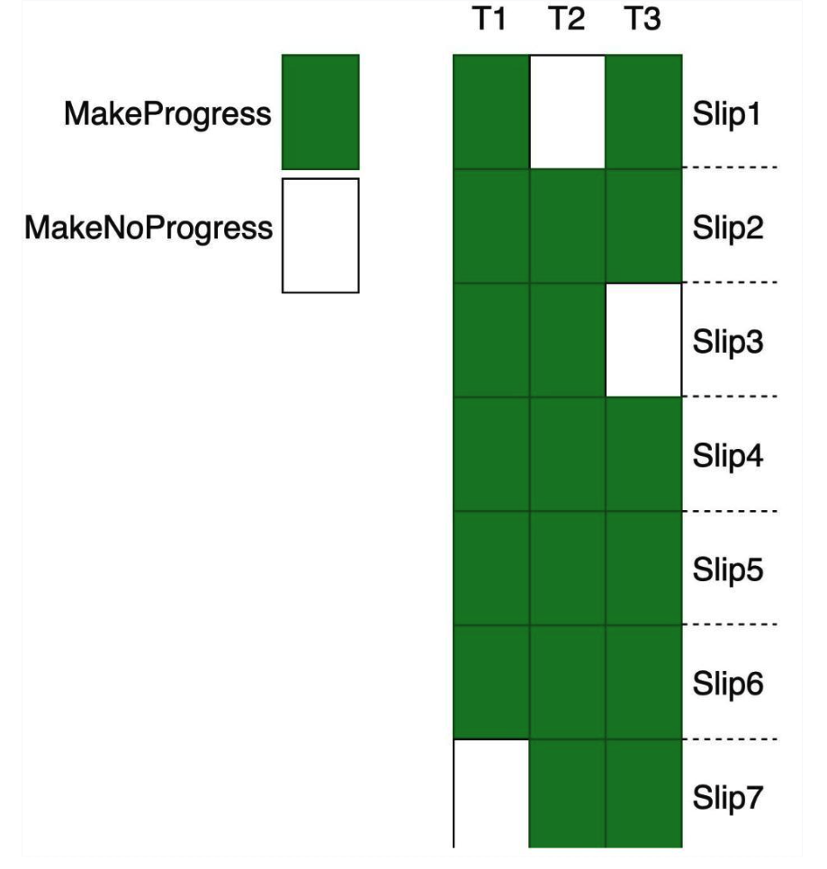

在计算机科学中，如果任何线程的故障或挂起不会导致其他线程的故障或挂起，则称该算法
为非阻塞算法<sup>1</sup>。根据非阻塞算法的达到效果，可以分为两类:

* **_wait-free_**: if there is also guaranteed per-thread progress
* **_lock-free_**: if there is guaranteed system-wide progress
* **_Obstruction-free_**: 只要某个线程能独占执行（其他线程不干扰），该线程的操作必在有限步骤内完成。

> **pre-thread progress vs system-wide progress**
>
> progress的意思是进展。system-wide表示整个程序或者整个系统，而pre-thread要求每
> 个thread.
>
> 拿CAS来说, 可能某个thread在非常多次交换中都失败，但是从整个程序在说，在每一
> 次交换，都有thread 交换成功。所以其在`system-wide`取得进展，而不是`pre-thread`
{: .prompt-tip}

## Motivation

在并行编程中，保护共享数据是一个很重要的议题。通常的方法有两种:

* blocking synchronization
* non-blocking synchronization

阻塞同步实现起来简单: 我们将访问共享资源的代码区成为临界区。步骤如下:

* 当程序进入临界区之前，首先检测该临界区是否上锁，如果上锁则等待其解锁。
* 如果发现并未上锁，或者已经解锁，则对该临界区加锁，离开临界区后，解锁。

总之, 阻塞同步的方法就是让某个程序在临界区中独享该资源。阻塞其他程序进在该时刻进
入临界区。通常的方法有: mutex, sem 等。

但是，阻塞式同步有很多缺点<sup>1</sup>, 导致其可能不适合很多场景。一个比较明显的
原因是: 线程在被阻塞时, 无法做任何操作: 当被阻塞的线程正在执行高优先级任务，或者
实时任务时，这是非常不明智的。

还有一些其他的原因，例如deadlock, livelock, priority inversion.(这个是wiki<sup>1</sup>
中写的，难道上面的例子不是`priority inversion`  么)

而非阻塞式算法没有这些问题。因为非阻塞式算法最低的要求(`obstruction-free`), 如果某个
线程因某种原因不再执行, 而另一个线程可以在有限步骤之内完成. 并不会无限期阻塞。 这也就
意味着，其他线程可以安全的抢占该当前访问共享资源的线程。另外使用无锁结构可以提高并行性
能, 因为对共享数据结构的访问不需要串行化以保持一致性。

## wait-free vs lock-free vs obstruction-free

### blocking
我们先来看下, blocking synchronization的一个例子:
```cpp
mov eax, 1
spin:
xchg eax, [lock]
test eax, eax
jnz spin

//临界区 
 do something
mov 0, [lock]
```
这是一个简单的自旋锁, 当一个线程持有自旋锁被中断时，其他线程也无法继续执行

如下图所示:

### obstruction-free

我们来设想一个场景。某个程序是以事务机制写入数据(例如xfs文件系统), 大概流程如下:

* BEG
* record do what
* do this
* completed

而另外一个程序用来检测是否有病毒入侵，如果有，立即中断程序。并杀死病毒（有内鬼，
终止交易).如果在事务未完成时终止程序, 下次程序再次启动时，会认为该事务未完成，
回滚掉这个事务。

可以看出，整个的事务写入是不需要加任何锁的，如果没有病毒侵入，该事务写入是可以在
一定的步骤内完成. 但是在疯狂的病毒入侵下, 该程序会不断的写入事务，回滚事务. 可能
在很长一段时间内, no system-wide progress.(这个例子并不太好，但是想不出其他恰当
的例子)

***
{: width="350" w-70 .normal}
在该图中, `Slip3`时刻，`T1, T2, T3`均未取得进展。

> NOTE
>
> 图片来自于<sup>4</sup>
***

### lock-free

举例: 班级有一个班费账户，班级的人向这个账户存钱。由于大家在不同的银行柜台同时存
钱，这里会涉及并行. 设计程序如下:

```sh
spin:
mov [total_¥], eax
mov eax, ebx
mov eax, ecx
## 存钱 + 1
inc ebx
CMPXCHG [total_¥], ebx
test ecx, eax
## 发现有别人在存钱
jnz spin
```
运行该程序的线程时，可能会在某个时间段都不会有进展，但是在system-wide,
总有人可以存钱进去，所以属于lock-free.

{: width="300" .w-10 .normal}
虽然在`Slip3`, `T3`并未取得进展，但是此时`T1, T2`取得进展.

### wait-free
wait-free 则是在per-thread层次的，要求在一段时间内，某个thread一定会有进展。
我们如下设计上面程序，在上面spin循环中，增加如果尝试次数超过100次，则启动一个
额外的线程, 继续尝试，不再阻塞当前线程。

这也类似于rcu callbak的作用，rcu callbak不会因读者临界区，而阻塞写者更新流程。
而写者关于old data的delete流程放到其他流程异步执行。所以对于写者update而言，其
是wait-free的。(单写者, 多读者)

{: width="350" .w-50 .normal}
`T1, T2, T3`在所有时刻均取得进展。

## 参考链接
1. [Non-blocking algorithm](https://en.wikipedia.org/wiki/Non-blocking_algorithm)
2. [并行程式设计: Lock-Free Programming](https://hackmd.io/@sysprog/concurrency-lockfree#Hungry-Birds)
3. [深入理解RCU\|核心原理](https://zhuanlan.zhihu.com/p/386422612)
4. [对wait-free和lock-free的理解](https://zhuanlan.zhihu.com/p/342921323)
5. [RCU初学参考资料](https://blog.csdn.net/weixin_45485072/article/details/134170460)
