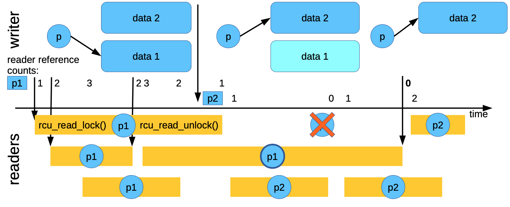

## background

> 本章节主要参考<sup>9</sup>
{: .prompt-info}

在介绍RCU之前，我们先来思考下，如何提升程序的性能? 一个最直接的方法是, 提升
并发量, 但是并发程序往往会造成多个线程(cpu) 访问同一个资源, 我们暂时先不考虑,
假设一个程序只有读者，每个读者都会去访问一个read-only list, 那么thread 数量和
吞吐关系图如下:


程序的性能会随着线程数量线性增长，这可真是简单粗暴的性能提升方法，但是生活并
不总是真么美好, read-only 场景很少，通常出现在科学计算中，更多的场景是 _almost
read-only_。

于是我们希望, 在写入很少的场景下, 读者性能不受影响。

首先我们来看几种方案:

**_lock-free_**


`lock-free`(list with atomic shared pointers) 虽然是一种比较通用的方案,   其允许
多个写者, 但在read-only 的场景下也会有不小的开销，那在 write-rare的场景下就不太
适用，似乎读写锁更适用一些:


可以发现读写锁虽然比`lock-free` 性能要好，但在延展性上的表现还是比较差。

造成延展性问题的原因在哪呢？在于这些 同步机制的atomic 操作.


> 可以发现即便是在thread 为1时，使用图中的同步机制也会出现性能下降，个人猜测可能和
> 调度负载均衡相关，导致 ATOMIC 变量在各个cpu cacheline中均有副本。
{: .prompt-tip}

> 这里 不清楚作者是不是想表达这个意思, 需要看视频确认 **TODO**
{: .prompt-warning}

那我们能不能避免这些atomic操作呢? 于是出现了rcu。

## RCU 基本概念

RCU (Read-Copy update) 是一种同步机制, 基本原理是, 将写动作分为下面几个步骤(正如
其完整的英文名所示):

* copy
* write
* update

即在写入时首先copy一个副本, 然后在该副本上完成write，在替换原来的就数据(update)。
该机制优秀的点在于其对读者访问特别友好, 因为在写者更新的过程中更新的是副本
(`new_node`), 读者读取的object(`node`) 不会被写者更改，所以在读者看来，自己读取
的时候，数据都是read-only的。


**在读者端访问不需要加锁，不需要原子操作, 甚至不需要内存屏障(Alpha 除外)**

但是对于写者就没有那么友好, 首先 copy 动作需要写者来做，另外，update后替换旧副本释放
旧副本资源，也增加了写者复杂度。如果是同步操作的话，甚至需要写者阻塞等待读临界区
完成.

我们接下来看下rcu具体的机制:

## 机制

RCU 的机制主要有以下三个部分<sup>1</sup>:

* Publish-Subscribe Mechanism (for insertion)
* Wait For Pre-Existing RCU Readers to Complete(for deletion)
* Maintain Multiple Versions of Recently Updated Objects (for readers)

### Publish-Subscribe Mechanism

在看rcu 的 insert 流程之前，我们先简单了解发布订阅机制（模式）概念:

发布订阅模式是一种消息传递模式, 用于将消息生成组件与消息消费组件解耦。其核心思想
是，发送者不与接受者直接通信，而是通过一个中间媒介（事件总线 / 主题中心）传递消息，
双方无需知道对方的存在，从而降低耦合度<sup>6, 7</sup>。

而对应于rcu而言，其中间媒介就是`critical resource`(可以理解为一个地址), 发布者和订阅
者通过相应的API去操作"中间媒介".


> NOTE
>
> 上图来自<sup>2</sup>
{: .prompt-ref}

***

而对于rcu而言对于 updater 和reader 之间也提出了一些要求:

_读者可以看不到最新的更新，但是不能看到不完整的更新_。

> 因为读者只想看到`read-only`的数据, 这个数据一旦发布后，就不能在更改。
{: .prompt-tip}

例如下面的写者程序<sup>1</sup>
```cpp
  1 struct foo {
  2   int a;
  3   int b;
  4   int c;
  5 };
  6 struct foo *gp = NULL;
  7
  8 /* . . . */
  9
 10 p = kmalloc(sizeof(*p), GFP_KERNEL);
 11 p->a = 1;
 12 p->b = 2;
 13 p->c = 3;
 14 gp = p;
```
写者需要负责让读者看到的new publish foo 为 `(a: 1, b: 2, c: 3)` 的组合，不能是一个
中间状态。聪明的小伙伴可以想到，这是一个典型的内存模型（memory order)的问题。也就是
让`gp = p`的这个动作一定发生在p数据结构初始化之后。所以`gp = p`这个动作需要内存屏障进行
封装, 内核中用`rcu_assign_pointer(gp, p);` 实现.

(关于`rcu_assign_pointer(, )`的实现(内存屏障相关)，在 **TODO TODO TODO TODO** 中详细描述。

对于读者来说，也需要保证一定的内存顺序<sup>1</sup>, 例如下面的顺序:
```cpp
  1 p = gp;
  2 if (p != NULL) {
  3   do_something_with(p->a, p->b, p->c);
  4 }
```
这个程序看起来有内存顺序的问题么? 我们期望的是`p->a`, `p->b`, `p->c`的组合是一致
性的，但是这三个值看起来是在获取到p的值之后才能获取, 而写者保证了p赋值时，
`p->x`已经更新, 所以直观上来说，这个程序不会有问题。不需要任何内存屏障。

但是, 实际上并不是这样。文章<sup>1</sup>中提到了两个场景:
* alpha 架构推测执行优化
* value-speculation compiler optimizations

总之，在这些场景下，会在获取p 值之前，先获取到`p->a`, `p->b`, `p->c` 的值.
`value-speculation compiler optimizations` 优化比较直观，其会先推测p的值, 然后
获取`p->a, p->b, p->c`的值，然后在获取实际的 p的值，对比自己的猜测是否正确。

> 不过，这种优化我是不太理解.
>
> value-speculation compiler optimizations 类似于cpu的预测执行，但是预测执行会根据
> p的值选择保留还是放弃预测执行的结果。不影响最终的结果。
>
> 我这里能想到的编译器优化是:
> ```
> reader first read gp = 0xfffa [1, 2, 3]
>
> //write relase org gp, and update gp = 0xfffb [2,3,4]
>
> reader read gp again
> But reader don't read gp from memory instead of reg, so gp = 0xfffa, read old
> data.
> ```
> 按照上面的场景，需要让读操作为标注为voliate 即可.
{: .prompt-info}

我们上面定义的读操作定义为`Publish`, 写操作为`Subscribe`.

rcu可以应用于各个场景， 其一个典型场景是链表。Linux 为链表定义了一套 RCU的版本，
并将这些`publish`, `Subscribe` 嵌入到这些代码中。见附录1。

正如<sup>9</sup> 的标题 -- `read, copy, update... Then what?` 。是的, 更新完之后
还需要做什么么。但其实接下来的工作才是重点: 当我们将新数据替换掉老数据, 老数据该
怎么处理? 释放! 但是什么时候释放呢?

> 虽然rcu 的全称为`read copy update`, 但这只是整个rcu机制实现的很小的一部分. In
> its most basic form, RCU is a way of waiting for things to finish.<sup>1</sup>
{: .prompt-warning}

### Wait For Pre-Existing RCU Readers to Complete

rcu 的机制特色在于等待事件完成的方法, 等待事件完成的方法有很多，例如引用计数, 读
写锁，事件等等。但是RCU 最大的优点在于, 它可以等待很多事件, 无需显式关注每一事件。
也无需担心显式跟踪方案中固有的性能下降、可扩展性限制、复杂的死锁场景以及内存泄漏
风险<sup>1</sup>。

> 例如引用计数, 每个object 有一个引用计数, 如果要释放object,  需要关注到每个object
> 的引用计数是否为0。这可能会带来很多问题，例如如果有多个CPU都用atomic更改refcount,
> object 一多，可能会引起大量的cacheline抖动。而rcu 从另一个更高的角度 -- 关注全局
> 性质的读临届区，而读临界区中可能包含多个object的访问，这些object 可能有多个 
> delete的事件。
>
> 所以rcu 并不是直接等待事件完成，而是简接通过判断读临界区完成，而间接的判断事件完成
> 的方法。
{: .prompt-tip}


如上图所示, writer动作分为了三个步骤:
* removal: 对应于我们前面提到的`publish`流程
* Grace Period: 宽限期, 宽限期开始会记录正在运行的reader，一直等待这些reader中的最后
                一个离开临界区
* reclaimation: 释放 object

需要注意的是，宽限期只会等待在宽限期执行之前已经存在的readers，而不会等待在宽限
期开始之后的readers。 

使用下图举例:
 


_prepare new data_:

初始状态为`p`指针指向`data 1`, 此时write copy 了一个副本 (`data 2`)，在副本中准备新数据 

_publish new data_:

发布新数据，将p指针指向data2

**_wait for readers to leave_**:

在发布新数据后，准备将老数据删除。这时，还有一些reader 正在读取老数据(`p1`)(当然
不一定正在读取`p1`, 而是在读临界区中, 执行了`rcu_read_lock()`, 但是还未执行
`rcu_read_unlock()`), 需要等这些readers退出临界区。

_safe to delete data1_:

等待最后一个reader退出临界区后, 释放`data 1`

从上图中可以看出，我们需要关注reader 进入读临界区的 时间是否在 publish new data
之后(图中的 readers p1 表示在publish之间，而 p2 表示在 publish之后), 如果是在
publish 之后，对于data1 的释放就可以不用等待这些readers。

### Maintain Multiple Versions of Recently Updated Objects (for readers)

在RCU场景下, 

## 附录

### 1. Linux rcu list

#### add

```cpp
static inline void list_add_rcu(struct list_head *new, struct list_head *head)
{
       __list_add_rcu(new, head, head->next);
}
static inline void __list_add_rcu(struct list_head *new,
              struct list_head *prev, struct list_head *next)
{
        if (!__list_add_valid(new, prev, next))
                return;
        new->next = next;
        new->prev = prev;
        rcu_assign_pointer(list_next_rcu(prev), new);
        next->prev = new;
}
```
new是要添加的成员, 所以在publish之前，需要将其成员初始化完整.

那么问题来了, publish动作是对应是 对一个指针更新？那选择那个指针更新呢?
```
prev->next
```

Linux链表遍历是正向遍历，也就意味着，读者在遍历过程中只读取`entry->next`,
所以其保证，该object 初始化完成后(包括其object.list), 对 `prev->next` 执行
合理的publish动作即可.

> `list_next_rcu` 也有RCU的版本:
> ```cpp
> #define list_next_rcu(list)     (*((struct list_head __rcu **)(&(list)->next)))
> # define __rcu          __attribute__((noderef, address_space(__rcu)))
> ```
> 这里更像是做了一些编译器check **TODO**

loop

`list_for_each_rcu()`的代码:

```cpp
#define list_for_each_rcu(pos, head)              \
        for (pos = rcu_dereference((head)->next); \
             !list_is_head(pos, (head)); \
             pos = rcu_dereference(pos->next))
```

代码非常直接在获取`entry->next`时, 使用`rcu_dereference()`接口

#### del

关于del大家可以简单思考下, 其需要内存屏障来保序么? add 操作需要内存屏障是因为防
止object 更新在发布之后执行。而del操作不会在更改这个object。只是等着释放了。

```cpp
static inline void __list_del(struct list_head * prev, struct list_head * next)
{
    next->prev = prev;
    WRITE_ONCE(prev->next, next);
}
```

这里的`WRITE_ONCE`只是voliate 原语, 防止编译器优化, 例如读写撕裂(`Read/write
"tearing"`) <sup>8</sup>。


#### update

update  怎么做呢? 也比较简单, 需要将上面几个步骤结合下:

* copy 旧数据到副本中
* 在副本中 write
* delete 旧数据
* update 新数据

## 参考链接
1. [What is RCU, Fundamentally?](https://lwn.net/Articles/262464/)
2. [Linux 核心設計: RCU 同步機制](https://hackmd.io/@sysprog/linux-rcu#%E5%B0%8D%E6%AF%94%E5%85%B6%E4%BB%96-lock-free-%E5%90%8C%E6%AD%A5%E6%A9%9F%E5%88%B6)
3. [QEMU RCU implementation ](https://terenceli.github.io/%E6%8A%80%E6%9C%AF/2021/03/14/qemu-rcu)
4. [Using RCU (Read-Copy-Update) for synchronization](https://www.qemu.org/docs/master/devel/rcu.html)
5. [Hierarchical RCU](https://lwn.net/Articles/305782/#Review%20of%20RCU%20Fundamentals)
6. [发布订阅模式详解](https://mayouchen.blog.csdn.net/article/details/155784820)
7. [Publish–subscribe pattern](https://en.wikipedia.org/wiki/Publish%E2%80%93subscribe_pattern)
8. [WRITE_ONCE in linux kernel lists](https://stackoverflow.com/questions/34988277/write-once-in-linux-kernel-lists)
9. [Read, Copy, Update... Then what?](https://github.com/CppCon/CppCon2017/blob/master/Presentations/Read%2C%20Copy%2C%20Update...%20Then%20What/Read%2C%20Copy%2C%20Update...%20Then%20What%20-%20Fedor%20Pikus%20-%20CppCon%202017.pdf)
