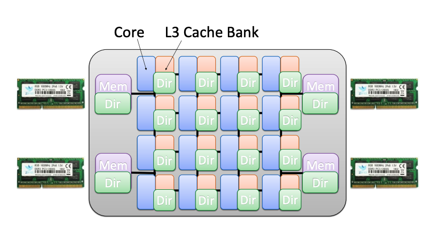
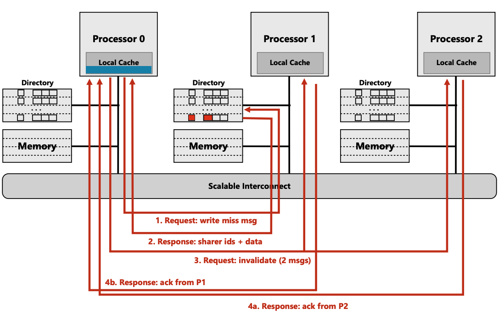

自旋锁是一种会让尝试获取它的线程陷入循环 （“自旋”）并不断检查锁是否可用的锁 <sup>
1</sup>。

和mutex 不同，mutex 可以睡眠，将cpu让渡给其他的程序，而自旋锁则是占据着cpu资源忙
等。忙等最主要的有点时，避免了调度所带来的上下文开销, 可以提升等锁进程获得锁的延
迟。另外，如果加锁的临界区很小，自旋锁忙等所带来的开销，可能会小于上下文切换的开
销，自旋锁的收益就会非常大。所以，自旋锁适用于临界区小的场景。

## overflow

本文主要是来讲述, spinlock 的可伸缩性(scalable). 可扩展性是指系统处理不断增长的
工作量的能力。软件系统的可扩展性定义之一是，可以通过向系统添加资源来实现<sup>
2</sup>. 而对于spinlock而言, 如何增加其工作量呢？ **增加并行调用spinlock的cpu**

在介绍之前我们先思考下，自旋锁和 "smp", "up" 关系<sup>3</sup>。首先按照自旋锁
的逻辑，自旋锁的临界区是不能睡眠的，这个动作是非常危险的，容易造成死锁。所以
UP下(单CPU) 自旋锁是没有意义的。

所以自旋锁是服务于smp的。而随着cpu的发展，cpu的核心越来越多, 并行调用spinlock的
数量也大大增加。而传统的spinlock则在 smp 场景中体现出了 non-scalable。

接下来的章节，我们首先介绍一些硬件背景，包括 
* cache snoop method
* cost of cache coherence

而之后，便介绍因cache coherence 给spinlock带来的性能影响。最后，介绍scalable spinlock
是如何规避这一问题的。

> 文本主要参考老黄和狗哥的文章<sup>4,5</sup> 以及`Non-scalable locks are dangerous`
> 论文<sup>6</sup>.
{: .prompt-tip}

## cache coherence

> 关于cache coherence 很值得单独写一篇文章去总结( **TODO** ). 这里我们简单看下 `snoop-based
> coherence` non-scalable 问题。以及其改进版本 `directory-based coherence` 给spinlock
> 所带来的`non-scalable`问题。
>
> 本节内容(包括大量的图片) 均参考 `CMU 15-418/618 lecture`<sup>7, 8</sup>
{: .prompt-warning}

为了降低cpu访问内存的延迟, 在cpu 和 内存之间加了一层cache。但是在smp架构下，每个
cpu都有自己的cache，所以相当于`main memory` 所存储的数据在各个cpu上都有了副本。
这回带来一致性问题。而cpu硬件实现了一套无需软件参与的缓存一致性协议，用来维护各
个 cpu cache之间以及和主存之间的一致性。

在早期的实现中，cpu数量不多。cache一致性使用`snoop-based`的方式，该方式的特点是
广播，而随着cpu数量越来越多，尤其是NUMA架构的兴起，广播的代价越来越大，
`snoop-based`方式则变得`non-scalable`. 于是大佬们搞出了非广播的点对点的
`directory-based coherence`一致性协议。

### snoop based


`snoop-based coherence` 是在缓存状态改变时，通过广播MESI 消息来维护各个cpu. 

图中状态左侧部分表示，当前cpu 发起访存动作是要做的一些动作(包括发一些广播信号, 以
及置当前cacheline的状态)。而图中右侧则表示 cpu 被动的收到广播信号时, 所需要执行
的动作（包括置cacheline状态以及一些额外的动作, E.g. flush).

我们举一个例子，不展开各个状态。

如果当前cpu要write一个内存，该内存所对应的cache是 invalid(对应右侧`I->M`)

该cpu需要
* 发起`BusRdx` 消息广播. (`BuxRdx` 表示一次写广播请求, 表示当前有人要写该
    cacheline, 这里有一些`serialization`的问题这里不展开)
* 将该内存地址对应的cacheline的状态由 `I -> M`
* 执行`PrWr`(`PrWr`表示cpu发起写操作，可以理解为改cacheline的内容了)

而其他cpu收到`BusRdx`后需要

* 将cacheline状态修改`X->I`(`X`为`M, E, S` 任意状态)
* 如果是M状态, 可能还要执行`flush`动作.(这里有一些序列化的问题, 例如这个flush
  的动作要不要发生发起写操作的cpu的PrWr 之前)

***

`snoop-based` non-scalable 原因主要来自广播。每次cache miss(invalid)发生时，需要通知
其他所有的cache。而在numa架构下这个问题更为突出。


在numa架构下，软件尽可能的设计成numa亲和性方案，即让当前numa上cpu运行的程序，访
问该numa的内存，但是由于 `snoop-based conherence` 的存在, 当我们访问`near memory`时
还是需要向所有的cpu进行广播, 这导致软件层面的优化几乎不起作用。

于是大佬们在思考能不能不再广播，而是通过点对点的方式，向特定的cpu发送cache y
conherence 消息。而这就需要一个数据库，记录cache在各个cpu中的状态，从而辅助
发起消息的cpu选择向哪些cpu发送。

### directory-based

既然需要一个数据库，我们则维护一个名为directory  的database:

{: .w-75 .left}
每个内存 在directory中维护了一个条目，每一个条目包括:
* **_Dirty bit_**: 表示在某个cpu-cache中。其缓存是dirty的。
* $p$ **_presence bit_**: 这是一个数组，每个字节表示该内存在其代表的cpu cache中
  是否存在

<br/>
<br/>
<br/>

{: .w-50 .right}
directory存在于L3 缓存组中(可能哈, 个人认为将l3当成了一个directory，该缓存条目中
除了包括常规的缓存信息外，还包括了和 directory 相关的信息。个人瞎猜.

我们来看下两个场景, read miss to dirty line 和write miss(这对应于竞争较激烈的
spinlock场景)

#### read miss to dirty line


**初始状态**
* cpu 0 要访问 near cpu 1 memory
* cpu 0 中没有cache, directory entry dirtybit 为1
* cpu2 中有该地址的cache, 并且没有writeback, directory entry $p$  中有 cpu 2

执行步骤:
1. (步骤1)cpu 0 发起一个`read miss msg`的request.
2. (步骤2)对应的memory 的 directory 查询其该条目中的 $p$ array, 查到cpu 2。并返
   回消息给 cpu0

***


1. (步骤3) cpu0 向cpu2 请求缓存内容
2. (步骤4) cpu2 返回给cpu0

***


* (步骤5) cpu2 返回给cpu1, dir的变更信息包括:cpu 0 请求了该cacheline，所以 $p$中
  要置位 cpu0 bit

  另外, 将dirty data 也传递到cpu1, cpu1 收到后，将dirty data flush 到memory, 并
  clear dirty bit

> non-scalable spinlock 的问题主要就在这一过程中，我们在之后的后面的章节中展开
{: .prompt-info}

我们接下来看下write miss

#### write-miss


**初始状态**
* cpu0 要写 near cpu 1 memory
* cpu0 没有cache，directory entry dirtybit为0
* cpu0 没有cache, cpu1, cpu2 上有clean cache, $p$ 中有 cpu1, cpu2

执行步骤:

* (步骤1) cpu0 向directory 发 write miss msg

***


* (步骤2) 由于cache 是clear的, directory 直接将clear data  + ids 返回给cpu0
* directory 修改 $p$ `clean {0, 1, 1}` --> `dirty {1, 0, 0}`

***


* (步骤3) cpu0 向cpu1, 2发送 invalid msg 消息

*** 



* (步骤4) cpu1, cpu2 发送ack 给cpu0

***

> 其实这个过程性能并不低，因为这是一个一对多，并且允许每个点对点的`{request, response}`
> 可以异步执行。但是这是一个触发器，其在spinlock过程中会将其他cpu的cache clean line掉。
> 其他cpu 会再执行`read miss`流程...
{: .prompt-info}

> 文章<sup>4, 5</sup>介绍缓存一致性时，从`write-update`, `write-invalid`角度展开
> 两个缓存一致性协议，个人查找资料发现`write-update`似乎不主流的缓存一致性实现中
> <sup>9</sup>
>
> 大家可以设想下，`write-update`一个好处是，在write操作发起时，会将cache 更新到
> 其他的缓存中，而不是让其失效。这样其他cpu 后续访问该缓存时，可以直接从当前
> cpu local cache 中获取到干净的（而不是从主存)。
>
> 但是只update 不invalid 会有明显的问题，因为被update 的cpu可能很长一段时间不会访问
> 该cache，而这段时间内如果有cpu write 这个地址，都会update 该cpu的cache。这会
> 造成很大的浪费。而基于 invalid 协议，会在写操作时invalid，在read时 触发cache-miss,
> **同时，也会从其他cpu的缓存中获取数据而不是直接从缓存获取**, 总之，这种在
> read-miss时按需获取再搭配 directory-based conherence 协议看起来比简单的 write-update
> 协议优秀很多。(当然可能cpu有一些更高级的预测功能，可以知道其他cpu可能在短时间
> 内需要访问这个cache(例如预取等等),  此时带宽又很空闲，会去做write-update? 但这远远
> 超出了我的知识范畴，也远远超出了本文要讲述的知识的范畴)
>
> 总之综上所述，本文接下来关于所有的cache conherence, 都不考虑write update, 均以write invalid
> 为例.
{: .prompt-tip}

ok, 关于cache conherence 这个基础而又宏大的话题就再此戛然而止吧。我们来简单总结
下:

### 总结

`snoop-based conherence`在核非常多(尤其在numa架构下)面临着`non-scalable`的问题，
其主要的问题在于 `MESI`的各个消息都需要采用广播的机制。为了解决这一问题,
大佬们搞出了`directory-based conherence`，其通过点对点的方式，按需和某些cpu 消息
通信。

但是, 在某些场景下，这仍然造成了`non-scalable`的问题。


## non-scalable spinlock

**How to cause non-scalable**

来设想下: `non-scalable` 一般是怎么出现的。往往是在资源扩张后(例如cpu数量), 执行
一些操作时，这些操作的复杂度往往会随着资源扩张线性增长。

而 _spinlock_ 尤为突出，因为spinlock这种阻塞忙等性质的同步机制不会会影响发起慢操
作的cpu运行，而且由于其阻塞性质，会影响全局的进度。

在介绍具体的触发机制之前，我们先来看下 non-scalable spinlock的实现方式 

### non-scalable spinlock implementation

#### wild spinlock

**wild** 的意思是`粗暴, 未经训化的意思`, 俗称原始人。我们也用比较原始的汇编
指令展现其简介性:

**lock 代码**

```sh
lock:
    .long 0              # 锁变量，初始为0
spin_lock:
    movl $1, %eax        # eax = 1，表示“想要锁”
spin_loop:
    xchgl %eax, [lock]     # 原子交换 eax 和 lock
    testl %eax, %eax     # 判断之前的 lock 是否为0
    jne spin_loop        # 如果不为0，继续自旋
    # 获取锁成功，继续执行临界区代码
```

**unlock代码**:

```sh
spin_unlock:
    movl $0, lock            # 直接写0，释放锁
```

但是 wild spinlock有个很大的问题。就是公平性。不同的cpu"看到"的`[lock]`
变为0的时间不同, 所以哪个核获取到锁充满了随机性。这种不公平性体现在
获取自旋锁的延迟极不稳定，而软件又往往期待平稳的延迟。

> 这个地方其实涉及同时发起atomic操作的串性执行的仲裁问题。这个仲裁是
> 有谁来做的，是如何排序pending的atomic操作。这些知识在本人的知识储备
> 外，代后续补充.
{: .prompt-tip}

于是 **ticket spinlock** 闪亮登场。

#### ticket spinlock

**ticket spinlock** 会让每个自旋锁的申请者记录自己的"号牌", 然后等待叫号. 这个很
像显示中的 排号系统。大家从排号机顺序取号，叫号时也会按顺序。

简单的小程序如下<sup>5</sup>:

数据结构
```cpp
struct spinlock_t {
    // 上锁者自己的排队号
    int my_ticket;
    // 当前叫号
    int curr_ticket;
}
```
加锁:
```cpp
void spin_lock(spinlock_t *lock)
{
    int my_ticket;
    // 顺位拿到自己的ticket号码；
    my_ticket = atomic_inc(lock->my_ticket) - 1;
    while (my_ticket != lock->curr_ticket)
        ; // 自旋等待！
}
```
解锁:
```cpp
void spin_unlock(spinlock_t *lock)
{
    // 呼叫下一位！
    lock->curr_ticket++;
}
```

### non-scalable ticket spinlock

我们以`ticket spinlock`为例来看下其在`directory-based conherence` 中
的non-scala.

按照ticket spinlock的设计, 当持有锁的cpu释放锁后，将会有一个确定的锁的等待着
获取锁。但是按照前文提到的 `directory-based conherence`协议并不能第一时间让
这个确定的cpu看到，这就是矛盾所在。

我们来画图说明:


***

{: .w-75 .right}

{: .w-75 .right}

{: .w-75 .right}
{: .w-75 .right}

***

{: .w-75 .right}
{: .w-75 .right}
{: .w-75 .right}


## 参考链接
1. [Wikipedia: Spinlock](https://en.wikipedia.org/wiki/Spinlock)
2. [Scalability](https://en.wikipedia.org/wiki/Scalability)
3. [深入理解Linux内核之自旋锁](https://zhuanlan.zhihu.com/p/584016727)
4. [sysprog: 从CPU cache一致性的角度看Linux spinlock的不可伸缩性(non-scalable)](https://hackmd.io/@sysprog/linux-spinlock-scalability#Aliworkqueue)
5. [dog250: 从CPU cache一致性的角度看Linux spinlock的不可伸缩性(non-scalable)](https://blog.csdn.net/dog250/article/details/80589442)
6. [Non-scalable locks are dangerous](https://people.csail.mit.edu/nickolai/papers/boyd-wickizer-locks.pdf)
7. [Snooping-Based Cache Coherence](https://www.cs.cmu.edu/afs/cs/academic/class/15418-s21/www/lectures/11_cachecoherence1.pdf)
8. [Directory-Based Cache Coherence](https://www.cs.cmu.edu/afs/cs/academic/class/15418-s19/www/lectures/13_directory.pdf)
9. [Cache Coherence - when do modern CPUs update invalidated cache lines](https://www.reddit.com/r/computerarchitecture/comments/1dovrky/cache_coherence_when_do_modern_cpus_update/)
