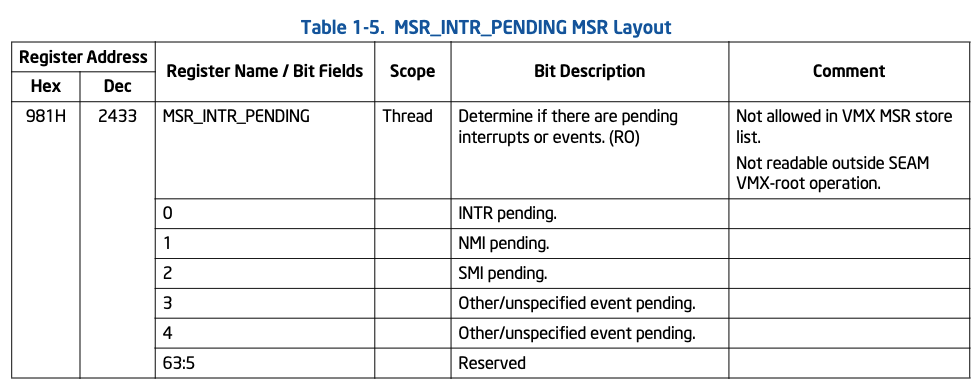
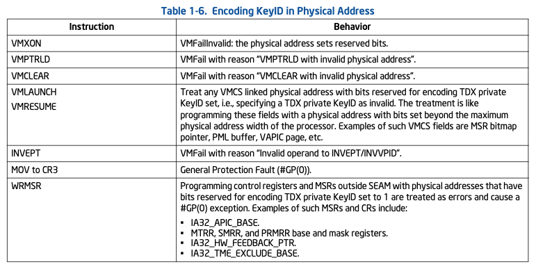

## overflow

**_add new operation mode_**

**Secure Arbitration Mode (SEAM)** 是对于VMX 架构的扩展。在 vmx root/non-root
operation(我们只有称为 legacy vmx XXX operation)下新增了两组模式:
* SEAM VMX root operation
* SEAM VMX non-root operation

`SEAM VMX root operation` 中托管了成为 `Intel Trust Domain Extensions(Intel TDX)`
模块, 用于管理 **TD虚拟机(可以理解为机密虚拟机)**. Intel TDX 模块实现了对TD虚拟机的:
* operation
  + build
  + tear down
  + start execution

而VMM 提供TD 所需的内存资源，并通过intel TDX 模块提供的API 来调用TD。


和`legacy VMX operation` 类似, 在 `SEAM VMX root operation` 中通过
`launched/resumed` 操作， 切换到 `SEAM VMX non-root operation`. 而运行在`SEAM
mode`下的虚拟机, 则受 SEAM 扩展保护，防止host VMM和`non-SEAM` 下的软件访问或修改
(`confidentiality and integrity`) TD memory/CPU state.

另外 `SEAM VMX root operation` 除了运行 `Intel TDX module`之外，也会运行`Intel
Persistent SEAMLDR(Intel P-SEAMLDR)` 来load & update `Intel TDX module`

**_seam vmx root operation run in SPEICAL memory range_**

上面提到的运行在`SEAM VMX root operation` 的两个module, 均运行在 由 `SEAM
range register (SEAMRR)` 所定义的地址范围中。这段预留的内存需要platform owner
通过BIOS 设置。

`SEAMRR range`被划分为两个 `sub-ranges`:
* MODULE_RANGE
* P_SEAMLDR_RANGE


`MODULE_RANGE` 用于`P-SEAMLDR`安装(其实不仅是安装，还包括安装前的measure, verify)
`Intel TDX module`, 该过程发生在系统启动，或者RUNTIME。 而`P_SEAMLDR_RANGE`用于
`NP-SEAMLDR`安装 `P-SEAMLDR`.

**_how to switch between SEAM mode & LEGACY mode_**

当 VMM 想要切到 `SEAM mode`时，需要执行`SEAMCALL`指令。而`SEAM mode`要切到`VMM`
需要执行`SEAMRET`指令。

另外, 上面提到`SEAM vmx-root operation`运行两个module, `VMM`如何选择将进入
哪个module呢? 通过调用`SEAMCALL`时，指定`EAX`:
* **_bit63(0)_**: `MODULE_RANGE`
* **_bit63(1)_**: `P_SEAMLDR_RANGE`

对于VMM管理TD而言, 其控制权的转移增加了额外的转换:
* `VMM->TD`
  + `legacy VMX root -- SEAMCALL => SEAM VMX root -- vmlanched/vmresume => SEAM VMX non-root`
* `TD->VMM`
  + `SEAM VMX non-root -- vm exit => SEAM VMX root -- SEAMRET => legacy VMX root`

如下图所示:


## INTEL TDX module and intel P-SEAMLDR module

`Intel TDX module`和`Intel P-SEAMLDR` 均运行在`SEAMRR`接口定义的内存范围。并且
对该范围内的访问仅限于`SEAM VMX root operation`。另外，在`SEAM VMX root
operation`下只能运行`SEAMRR`范围内的代码，如果运行其他地址的代码，会导致
不可中断关机...


`IA32_MTRRCAP`中的`SEAMRR`bit 15位表示是否支持`SEAMRR`接口, 用于划出一个受限制
的内存区域，这个内存区域被 `SEAM vmx-root operation`下的`TDX module`使用.


base 地址以32 位对齐。另外，`MASK`寄存器有`lock bit(10)` 该bit有BIOS配置完
寄存器的其他字段再设置。设置`lock bit`后，再对相关寄存器进行写操作则会触发
`#GP`。

**_重头戏来了_**, 在`base`地址偏移 4K处，存放一个VMCS的数组，用作`legacy vmx
root operation` 到 `SEAM vmx root operation` 切换，用于save/restore 各自模
式的上下文. 既然`VMCS`位于`SEAMRR`，那么`SEAM vmx root`就类似于`VMM`,
而`legacy vmx root` 类似于vm.

* SEAM -> Legacy: 相当于触发了 vmentry.
* Legacy-> SEAM:  相当于触发了 vm-exit.

每个cpu对应的 tranfer vmcs地址为:
```
IA32_SEAMRR_PHYS_BASE + 4096 + CPUID.B.0.EDX [31:0] * 4096
```

> NOTE
>
> 但是我们需要思考下, `VMCS` 除了有 `state area`用于保存恢复上下文的区域 ,
> 还有`VM-exit control, VM-entry control`等等和虚拟机强项关的区域。
> 这些区域会在这个过程中起作用么。
>
> 个人认为不会。这里只是借用了VMCS 的格式。有待进一步考究。
> 不过，从VMCS的归属来看, `SEAM VMX root operation` 对`legacy VMX root 
> operation`有着绝对的控制权，前者不高兴了，可以随意破坏后者的上下文。
> 而后者没有这个权利。
{: .prompt-tip}

`SEAMRR`是划分`MODULE_RANGE`区间，用于`Intel TDX module`, 还有一个
module -- `P-SEAMLDR`, 其使用 `P_SEAMLDR_RANGE`, 切换到该模式（前面讲过
如何切换) 应该如何保存上下文呢?

答案也是通过VMCS，但和`Intel TDX module`不同，`P-SEAMLDR` 只能有一个cpu运行。
那VMCS结构需要一个就够了.

`P-SEAMLDR` 模块用于在 `SEAMRR` 的`MODULE_RANGE`中加载 `TDX module`, 并初始化
和`TDX module`相关的 tranfer VMCS。

而`NP-SEAMLDR` 则会帮助初始化`SEAM range`,并初始化 `P-SEAMLDR transfer VMCS`,
load `P-SEAMLDR` 到`P_SEAMLDR_RANGE`中

> The OS can launch the NP-SEAMLDR ACM using the GETSEC[ENTERACCS] instruction
> if the SEAMRR range enable bit (bit 11) of IA32_SEAMRR_PHYS_MASK MSR is 1.
> > EMMM... 为什么os会调用这个... 难道是更新 `P-SEAMLDR`?

## SEAM VMX ROOT OPERATION

TDX module 帮助给TD VM 进行资源分配, 并且会切换到 `SEAM VMX non-root operation`
来运行`TD VM`。TDX module使用 `MK-TME` 技术，用于保护TD VM 私有数据的机密性和完
整性。

### TDX private KeyID
TDX 为每个TD VM 分配不同的MK-TME keyID 用来加密内存，另外, **KeyID 分配给 TD 的情
况下，不可信软件不应被允许读取或写入内存!** 完整性是怎么保证的呢?

Intel Trust Domain Extensions 允许预留一定数量的KeyID 给 TD VM 用。在支持 SEAM
的soc上, MK-TME也会保证该内存的完整性。

> Intel TDX 在这里搞得相当复杂下面是自己的理解 (参考<sup>2</sup> 第16章)
>
> 以`Non-ACT Platforms: Cryptographic Integrity (Ci)`为例,
>
> 每个cacheline 对应`message authentication code (MAC)`(用于校验该cacheline完整性)
> 的元数据, 当在 `SEAM non-root operation`  下使用 `MK-TME` `private key`修改写内
> 存时，cacheline中的数据其实是解密的，但是 `MK-TME` 会去`private key`计算
> cacheline data的MAC 并保存到元数据, 并标记该cacheline的 `TD-owner`元数据为1. 
> **这些元数据也会随着cacheline flush，最终会保存在内存元数据中，受ecc保护...**
> 
> 此时假设 `legacy VMX-root operation` 去修改这块内存, 此时其不会检查`TD-owner`,
> 直接修改内存, 此时会使用`shared key`重新计算MAC, 并保存到cache元数据中，接下来,
> `SEAM non-root operation`  下如果在访问这段内存， `MK-TME`会重新计算`MAC` 并和元
> 数据中的`MAC`做比对。如果不相同，则触发`Integrity Check failed`, 标记cacheline被
> 标记为`poisoned`, 并返回值为0. 防止`SEAM non-root operation`继续使用该cache.
{: .prompt-tip}

MKTME 支持最多KeyIDs 数量由`IA32_TME_CAPABILITY` MSR 枚举, 但是激活的数量以及分赔给
TDX预留keyid 的数量则有下面寄存器配置:

+ **IA32_TME_ACTIVATE**
  + MK_TME_KEYID_BITS(35:32): 分配给MKTME用于KeyID的物理地址位数
  + TDX_RESERVED_KEYID_BITS(39:36): 这些位被保留用于 Intel TDX , 用来编码TDX 私有KeyID

而配置工作由BIOS去做，BIOS分配之后的各个密钥的数量（shared，tdx own) 则可以通过
读下面MSR获取:

+ **IA32_MKTME_KEYID_PARTITIONING**
  + **NUM_MKTME_KIDS(31:0)** :  激活 `MKTME` 密钥ID总数
  + **NUM_TDX_PRIV_KIDS(63:32)**: 激活TDX私有密钥数量

MKTME KeyID 的密钥使用 PCONFIG 指令进行编程。PCONFIG 指令设计为仅允许在 SEAM 中
对 TDX 私有 KeyID 进行密钥编程。

地址划分如下:


`MAXPHYADDR` 表示当前枚举的物理地址最高位:

`[MAXPHYADDR - 1, MAXPHYADDR - n]`: 用于 MKTME keyid. 而在这个地址空间中对shared
keyid和分配给TDX 的private KEYID做了切分
+ `[MAXPHYADDR-1, MAXPHYADDR-L]`
  + all zero: shared
  + if not: TDX private KEYID

MKTME 用于 TD 内存保护时，某些维护操作可能需要 Intel TDX 模块回写缓存并使缓存失
效。对于某些维护操作，Intel TDX 模块可能需要回写缓存，但不需要使缓存内容失效。
Intel TDX 模块可以使用 WBINVD/WBNOINVD 指令来辅助执行这些操作。

> emmm, 这个没有想出来有什么场景
{: .prompt-tip}

具体方法是, 软件通过`EDX: EAX` 指定一块内存区域, 如果 `WRMSR`

* **MSR_WBINVDP** : 回写并invalid
* **MSR_WBNOINVDP** : 只回写

> 这两个寄存器只能在SEAM mode下操作

软件可以使用 RDMSR 调用 `MSR_WBINVDP` 或 `MSR_WBNOINVDP` 读取最大缓存子块数
(`NUM_CACHE_SUB_BLOCKS`)。

指令解码如下:
```
IF RDMSR
    IF inSEAM==0 THEN #GP(0);
    IF invoked from VMX load/store list THEN #GP(0);
    EDX:EAX = MAX_CACHE_SUB_BLOCKS;
ENDIF

IF WRMSR
    IF inSEAM==0 THEN #GP(0);
    IF invoked from VMX load/store list THEN #GP(0);
    IF EDX:EAX >= MAX_CACHE_SUB_BLOCKS THEN #GP(0);
    Flush cache sub-block indexed by EDX:EAX
    IF ECX == MSR_WBINVDP THEN Invalidate cache sub-block indexed by EDX:EAX;
ENDIF
```

### MEMORY TYPE

seam vmx root operation:

* **CR0.CD == 1** : effective memory type 为 _UC_
* **CR0.CD == 0** : 则有效内存类型取决于所访问的物理地址和用于访问的 KeyID
  + 如果要访问 SEAMRR，则 MTRR 不会对内存类型产生影响，访问的有效内存类型仅由
    PAT 决定。
  + 如果访问的是 SEAMRR 之外的物理内存，并且该访问使用了 TDX 私钥 ID，
    则 MTRR 不会影响内存类型。内存类型仅由 PAT 决定。
  + 如果要访问 SEAMRR 之外的物理内存，并且访问未使用 TDX 私钥 ID，则根据与物理
    地址和 PAT 匹配的 MTRR 来确定访问的内存类型。

> `CR0.CD` cache disable

明确强制指定内存类型的特殊操作（例如，快速字符串、MOVDIR64 等）将继续按照这些指
令定义的特殊内存类型运行。

### Caching Translation Information(TLB)

在原有框架上增加了 SEAM 状态, 在 SEAM VMX-root operation, in-SEAM 为1. 

在 SEAM VMX root operation 期间，逻辑处理器可能会缓存并使用针对线性地址的缓存映
射，这些线性地址由当前 CR3 寄存器的值（直接或间接引用的分页结构）派生，并将这些
映射关联到:

* Current VPID
* Current PCID (non-global translations) or any PCID (global translations)

> NOTE
>
> 这里想表达的意思是, SEAM VMX root operation, 有自己独立的tlb entry (这些entry
> 中in-SEAM =1)
>
> 为什么要这么做..
{: .prompt-warning}

### EVENT HANDLING

SEAM VMX root operation 时, 处理器可以 inhibit NMI/SMI. 在 inhibit 状态下，他们
将被设置为挂起状态，并在inhibit状态解除后处理。在`SEAM VMX root operation`中 可以
解除对`NMI`, `external interrupts` inhibit.

在 `SEAM VMX root operation` 中，可以读取`MSR_INTR_PENDING` 来确认是否有挂起的事
件. 另外，和 `legacy VMX root operation`类似, 在`SEAM VMX non-root operation`中，
可以通过配置 `TD VMCS` 来改变对 `NMI`, `SMI`的 inhibit状态。

在 SEAM VMX non-root operation 期间发生的 SMI，或者在切换到 SEAM VMX non-root
operation 之前已经处于挂起状态的 SMI，可能会导致VM-exit 并进入 SEAM VMX root
operation，此时退出原因会被设置为“IO SMI” 或 “Other SMI”。如果该 SMI 是由machine
check 触发的 SMI（MSMI），则退出限定的第 0 位应该被设置为 1。

在VM-exit 后，该 SMI 仍将保持挂起状态。

`SEAMRET` 切换到 `legacy VMX root operation`时, NMI SMI 的`inhibit`状态可以恢复到
`SEAMCALL` 时的`inhibit`状态, 如果未`inhibit`的话，任何待处理的NMI/SMI 都将被
deliver.

`MSR_INTR_PENDING`:



The reporting of these pending events in MSR_INTR_PENDING is designed not to be
affected by:

> 大概的意思时，`MSR_INTR_PENDING`报告事件和事件inhibit是独立的, 虽然这些事件会被inhibit,
> 但是不会影响 `MSR_INTR_PENDING` 报告 inhibit 事件。
{: .prompt-ref}

* EFLAGS.IF.
* NMI blocking.
* SEAM blocking of SMI, or NMI.
* SMI inhibited by SENTER.
* MOV-SS/POP-SS blocking.
* STI blocking

## SEAM VMX NON-ROOT OPERATION

TD VM 运行在 `SEAM VMX non-root operation`, 本节主要讨论`leagcy VMX non-root
opearation` 和 `SEAM VMX non-root operation`有何不同

### SEAM VMX Non-Root Execution Controls

前面提到过, 每一个TD 都有一个相关联的 `VMCS`, 同`legacy VMX non-root operation`
功能相同。但是字段上有一些扩展:

1. `Share EPT Pointer`: 用于指定共享EPT页表的指针。在SEAM VMX non-root operation中,
   有两套EPT:
   + VMCS EPTP 指向的private EPT
   + VMCS `shared-EPTP` 指向的 shared EPT

   该字段:
   + `11:0` bit 被预留
   + `(MAXPHYADDR - 1):12` bit 包含`(MAXPHYADDR - 1): 12` 位 4k-byte对齐的 EPT
     `PML4/PML5` table
   + `(64, MAXPHYADDR)` bit 被预留
2. `TD-KeyID` 32bit字段用于指定分配给TD的MKTME的密钥ID. 处理器使用这个`KeyID`来
   访问有 EPTP 指向的EPT 系列页表.

   > 也就是说, EPTP 以及 EPTP指向的一系列EPT页表中的物理地址字段都带有该`KeyID`
   {: .prompt-tip}
3. `Guest Physical Address Width(GPAW)` : `GPAW`和`EPT walk levels (4 or 5 level)`
   共同确定`GPA`宽度, 从而确定`GPA`中的 **SHARED bit** 位置.

   TD的GPA划分为两部分:
   + shared GPA range
     + SHARED bit 为1
     + 使用 shared-EPTP 指向的Shared EPT translate GPA
     + 处理器使用`shared-EPT`的 KeyID 来获取 shared GPA的访问权限
   + private GPA range.
     + SHARED bit 为0
     + 使用 EPTP 指向的 EPT translate GPA
     + CR3, PDPTRs, and HLAT root pointe中的GPA 也使用 EPTP进行translate
     + 处理器使用`TD-KeyID` 获取 private GPA的 访问权限.

   (因为由一个bit确定，所以各占一半)

**怎么确定SHARED BIT位置:**
+ 使用4-level EPT, SHARED bit 永远是 bit 47
+ 使用5-level EPT
  + GPAW == 1 : bit 51
  + GPAW == 0 : bit 47

based execution control bit 17 设置为1 可以active, tertiary, processor-based
execution control primary, processor based execution control.

而 `IA32_VMX_PROCBASED_CTLS3` bit 5 则报告 `GPAW execution control` 是否能在
`tertiary`中使能。如果 `GPAW execution control` 可以被设置为1, 处理器才允许编程
VMCS中的`Shared-EPTP`和`TD-KeyID`字段。

### Guest Physical Address Translation

有一些额外的条件会触发`EPT misconfiguration` 或者 `EPT violation` 或者`page
fault`:
+ 当GPA 使用 shared EPT, 并且entry is present 并且 页表中的 phyiscal 
  address 的`(MAXPHYADDR - 1, MAXPHYADDR - TDX_RESERVED_KEYID_BITS)`被设置.
  则触发`EPT misconfiguration`

+ CPU's maximum physical-address width (MAXPA) is 52, 而guest physical address
  width 为 48, 那么 GPA bit 51:48 中不全为 0 的访问可能会导致 `EPT-violation`，
  并且即使“EPT-violation #VE”  execution control 为 1，也不会被变异为#VE。
+ 如果 CPU 的物理地址宽度（MAXPA）小于 48，并且SHARED bit 为第 47 位，GPA 位 47 
  将被保留，GPA 位 46:MAXPA 将被保留。在这样的 CPU 上，任何页面结构中的位 51:48 
  或位 46:MAXPA 设置会导致保留位页面错误。

### Linear Address Translation
在 `SEAM VMX non-root operation` 中, 所有用于线性地址转换为GPA的 paging structures
都必须位于private GPA space. 如何CR3中的地址 或者引用另一个paging structure 的地
址的SHARED bit为1， 都会造成 page fault .

### MEMORY TYPEING
对于translated或者guest物理访问（未开分页）通常应该根据CR0.CD, PAT和 EPT memory
type来决定。

某些操作强制使用某种memory type , (e.g., fast string, MOVDIR64,等), 旨在继续使用
其特定的memory type(强制使用的))

使用`TDX private KeyID`访问VMCS相关的数据结构(MSR bitmap, VAPIC page等)
+ CR0.CD == 1: UC
+ otherwize: WB

### Caching Translations Information
(略) 有点看不懂

### OPERATION OUTSIDE SEAM
当不在 SEAM operation 中时, 物理地址中用于编码 TDX private KeyID 的位被保留为保留
位。

当在 SEAM operation 之外tranlate地址时，任何 paging structure 条目中的物理地址字段
使用了上述位时，处理器都会报一个`reserved bit page fault exception`

而 legacy EPT中如果使用上述位时，则产生`EPT-violation`

还有一些指令会直接使用物理地址，如果使用了上述位时，行为如下:



## 参考链接
1. [Intel® Trust Domain CPU Architectural Extensions 343754-002US MAY 2021](https://cdrdv2-public.intel.com/733582/intel-tdx-cpu-architectural-specification.pdf)
2. [Intel® Trust Domain Extensions (Intel® TDX) Module Base Architecture Specification](https://cdrdv2-public.intel.com/853286/intel-tdx-module-base-spec-348549006.pdf)
3. [Scalable Memory Protection in the Penglai Enclave](https://www.usenix.org/system/files/osdi21-feng.pdf)
