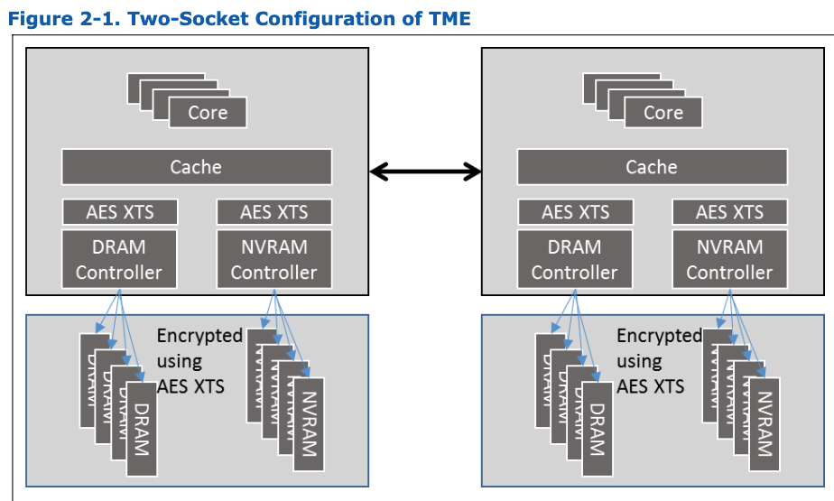
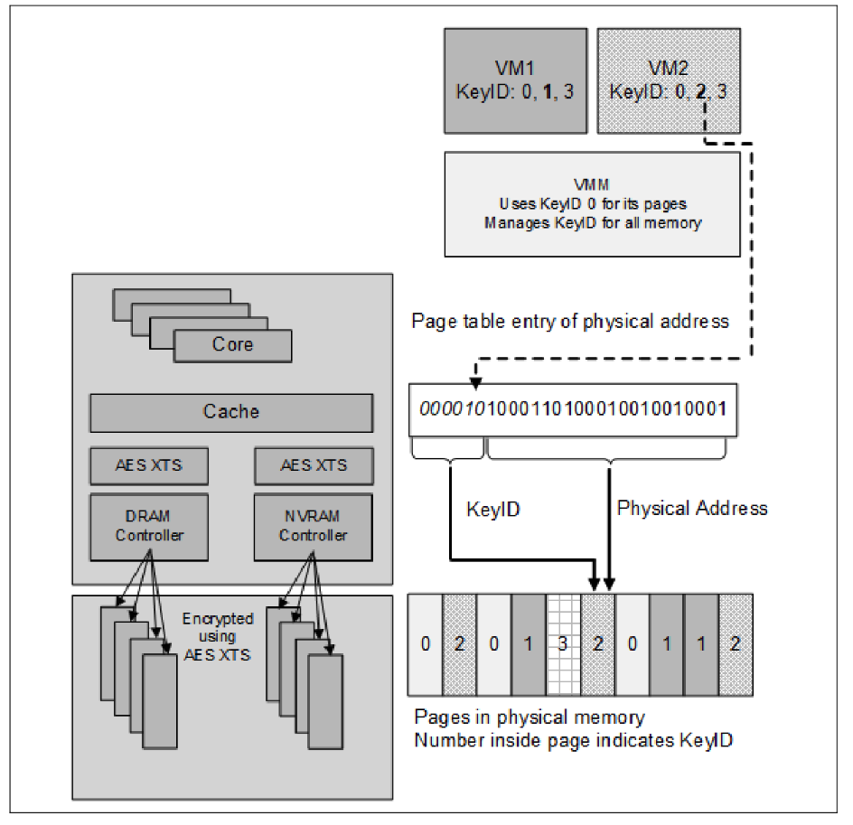
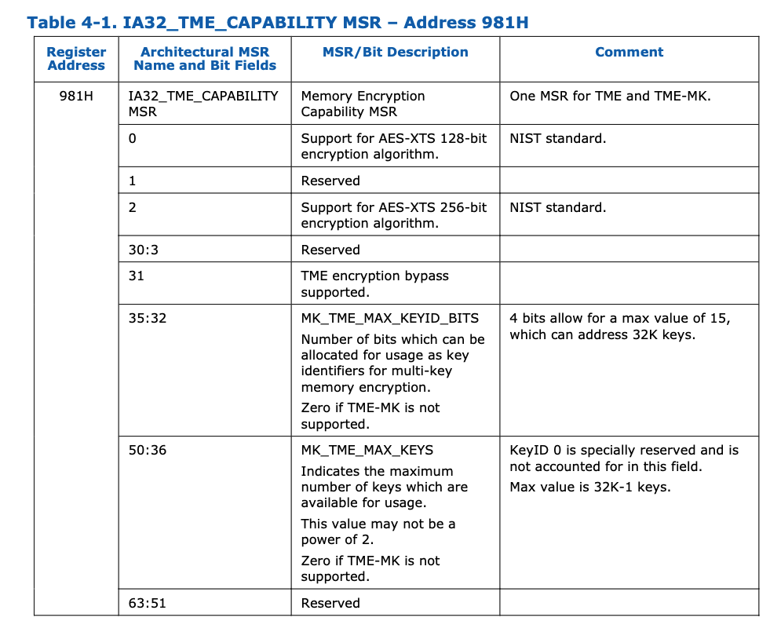
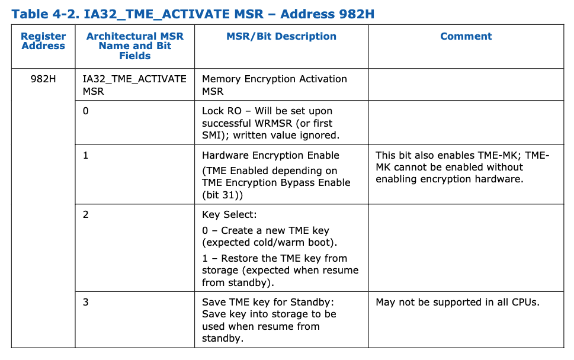
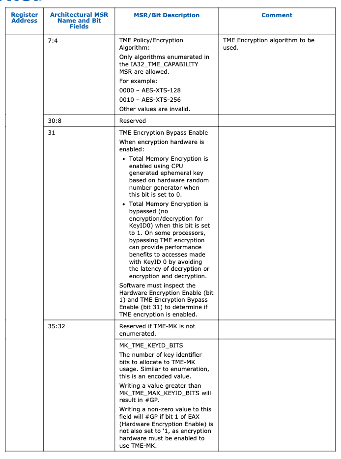
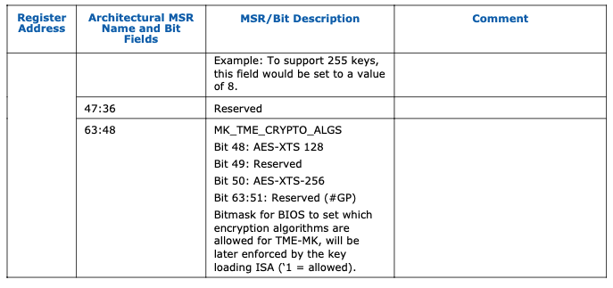
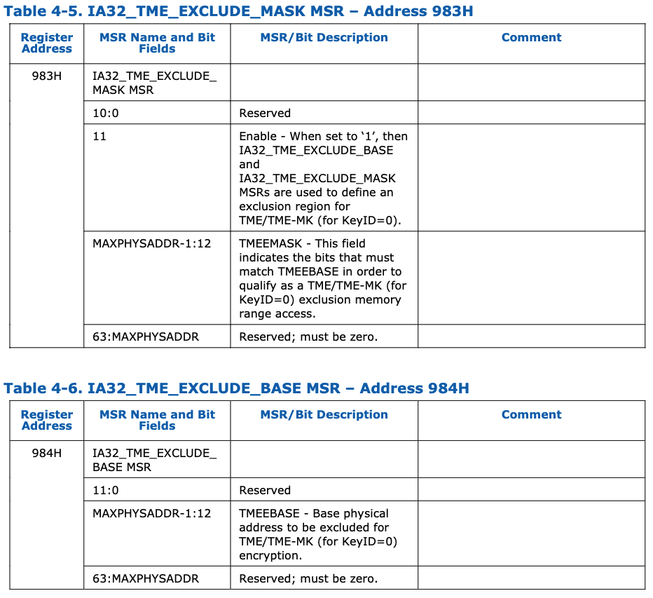

## introduction

### TME

Total Memory Encryption (TME) – the capability to encrypt the entirety of
physical memory of a system. This capability is typically enabled in the very
early stages of the boot process with a small change to BIOS and once configured
and locked, will encrypt all the data on external memory buses of an SoC using
the NIST standard AES-XTS algorithm with 128-bit keys or 256-bit keys depending
on the algorithm availability and selection. The encryption key used for TME
uses a hardware random number generator implemented in the Intel SoC, and the
keys are not accessible by software or using external interfaces to the Intel
SoC. TME capability is intended to provide protections of AES-XTS to external
memory buses and DIMMs. The architecture is flexible and will support additional
memory protection schemes in the future. This capability, when enabled, is
intended to support (unmodified) existing system and application software.
Overall performance impact of this capability is likely to be relatively small
and is highly dependent on workload

> intel TME 引入自 `3rd generation Intel ® Xeon ® Scalable Processor Family` 用来
> 提供内存加密支持。全内存加密 (TME) 功能可对系统的全部物理内存进行加密。此功能通
> 常在启动过程的早期阶段通过对 BIOS 进行少量更改即可启用。配置并锁定后，TME 将使用
> NIST 标准的 AES-XTS 算法，根据算法的可用性和选择情况，使用 128 位或 256 位密钥，
> 对 SoC 外部内存总线上的所有数据进行加密。 TME 使用的加密密钥由 Intel SoC 中实现
> 的硬件随机数生成器生成，软件或通过 Intel SoC 的外部接口均无法访问这些密钥。TME
> 功能旨在为外部内存总线和 DIMM 提供 AES-XTS 加密保护。该架构具有灵活性，未来将支
> 持其他内存保护方案。启用此功能后，旨在支持（未经修改的）现有系统和应用程序软件。
> 此功能对整体性能的影响可能相对较小，并且高度依赖于工作负载。
{: .prompt-trans}

### MKTME

Total Memory Encryption-Multi-Key (TME-MK) builds on TME and adds support for
multiple encryption keys. The SoC implementation supports a fixed number of
encryption keys, and software can configure the SoC to use a subset of available keys.
Software manages the use of keys and can use each of the available keys for encrypting
any page of the memory. Thus, TME-MK allows page granular encryption of memory. By
default, TME-MK uses the TME encryption key unless explicitly specified by software. In
addition to supporting a CPU generated ephemeral key (not accessible by software or
using external interfaces to the SoC), TME-MK also supports software provided keys.
Software provided keys are particularly useful when used with non-volatile memory or
when combined with attestation mechanisms and/or used with key provisioning services.
In a virtualization scenario, we anticipate the VMM or hypervisor managing the use of
keys to transparently support legacy operating systems without any changes (thus,
TME-MK can also be viewed as TME virtualization in such a deployment scenario). An OS
may be enabled to take additional advantage of the TME-MK capability both in native
and in a virtualized environment. When properly enabled, TME-MK is available to each
guest OS in a virtualized environment, and the guest OS can take advantage of TME-MK
in the same way as a native OS.

> TME-MK 则在TME基础上实现, 增加了对多个密钥的支持。SoC 实现支持固定数量的加密密钥，
> 软件可以配置 SoC 使用可用密钥的子集。软件管理密钥的使用，并可以使用每个可用密钥
> 加密内存的任何页面。因此，TME-MK 允许对内存进行页级加密。默认情况下，TME-MK 使用
> TME 加密密钥，除非软件明确指定。除了支持 CPU 生成的临时密钥（软件无法访问，也无
> 法通过 SoC 的外部接口访问）之外，TME-MK 还支持软件提供的密钥。软件提供的密钥在与
> 非易失性内存一起使用，或与认证机制结合使用和/或与密钥配置服务一起使用时特别有用。
> 在虚拟化场景中，我们预期 VMM 或虚拟机管理程序将管理密钥的使用，从而透明地支持旧
> 版操作系统而无需任何更改（因此，在这种部署场景下，TME-MK 也可被视为 TME 虚拟化。
> 操作系统可以启用 TME-MK 功能，以便在原生环境和虚拟化环境中都能充分利用其优势。正
> 确启用后，虚拟化环境中的每个客户操作系统都可以使用 TME-MK，并且客户操作系统可以
> 像原生操作系统一样利用 TME-MK。
{: .prompt-trans}

### 总结

`TME` 是intel 内存加密的早期版本，其支持一个key。可以允许对所有物理内存进行
`AES-XTS` 加密。该功能算是一个基础功能，为之后其他功能的引入奠定了基础。

而 `TME-MK` 对比 `TME` 的最大的改进是，引入了多个key的管理。而其一个很重要的应用
场景是虚拟化，可以为不同的虚拟机分配不同的密钥，进一步增加安全性。

## TME 简介

加密引擎位于`direct data path to external memory buses`(总之卡在接口处, upstream
是解密downstream 是加密), 上半部分 主要是cache等都是解密的。而下面部分，主要是
DRAM 为加密。

另外系统如果使用了`NVRAM`, 可以让`NVRAM`视为 `DRAM`, 也可以使用密钥进行加披靡

## MKTME简介

硬件架构基本与TME相同。不同点在于 `MKTME` 是使用多个key进行加密。如上图所示:

上图是一个虚拟化环境有两个VM, VM1 VM2，另外有`0,1,2,3` 四个keyid。其中 key1,
key2 分别是 VM1, VM2的私有key，用来加密内部不共享的内存。而key0为 TME 的key，可
以对任何页面使用(个人认为一般用户和host  访问的share page), key3用于加密 vm1,
vm2共享的内存。

另外，这种机制不仅用于普通页表，也用于 IA 页表 IOMMU 页表。(IA页表个人认为普通页表)

## Memory Encryption Emulation and Control Registers

### emulation

TME 和 TME-MK 通过一些MSR将功能暴露给软件。BIOS通过MSR激活该功能，必须在启动初期选择
用于 TME-MK  的密钥数量。激活后，链接到CPU的所有内存都会使用`AES-XTS`加密。另外,
TME 可以支持`encryption bypass`, 使用该功能的话，所有使用`KeyID0` 的访问均绕过加
解密。

#### TME

`CPUID.TME (CPUID.(EAX=07H, ECX=0H): ECX[13])` 枚举下面MSR:

* IA32_TME_CAPABILITY – Address 981H
* IA32_TME_ACTIVATE – Address 982H
* IA32_TME_EXCLUDE_MASK – Address 983H
* IA32_TME_EXCLUDE_BASE – Address 984H

#### TME-MK

`IA32_TME_CAPABILITY` 将进一步枚举`TME, TME-MK` 的功能, `TME-MK` 由 BIOS 使用
`IA32_TME_ACTIVATE` MSR 启用/配置。TME-MK 需要 TME，因此必须启用 TME 才能启用
TME-MK。

#### IA32_TME_CAPABILITY

* **_31_**: 用于枚举前面提到的TME旁路（不过这里是枚举，是否启用得看activate
        配置, 下面的字段同理)
* **_35:32_** : `MK_TME_MAX_KEYID_BITS` 可分配用作多密钥内存加密密钥标识符的位数
          （如果不支持`TME-MK`, 该字段设置为0)
* **_50:36_** : `MK_TME_MAX_KEYS` : 表示可供使用的最大按键数量

### Memory Encryption Configuration and Status Registers

#### IA32_TME_ACTIVATE

* **_0_** : 锁定位，写过一次该msr就会置1
* **_1_**: 是否启用TME
* **_31_** : Bypass enable bivt
* **_35:32_**: 用于 `TME-MK` 的key 的数量。注意，不能大于`IA32_TME_CAPABILITY`

#### MK_TME_CORE_ACTIVATE

(略, 没看懂干啥的)

### Exclusion Range MSRs

TME 和 TME-MK（ **仅限 KeyID=0** ）支持一个用于特殊情况的排除范围。此 MSR 中指定
的物理地址范围不应用本文档中描述的内存加密。

该功能主要用于系统访问bios 初始化的一些内存（bios在早起初始化时，还没有加密，所以当时
init的内存，是未加密的内存). 

**MASK(MAXPHYSADDR-1:12)** 和 **BASE(MAXPHYSADDR-1:12)** 两者构造了一段地址空间，用于
`keyID0`不加密区间

## Runtime Behavior of TME-MK

### Changes to Specification of Physical Address

同前面所述, `KeyID` 存放在[Max_pa bit , 0] 的高位部分:

### IA Paging

不使用 EPT的情况下，IA 分页entry 中的字段从 MAX_PA 开始的高位将被重新用作 keyID
位。类似地，CR3 中物理地址的高位也将以相同的方式处理。

当 EPT 处于活动状态时，IA 分页不用 HPA ，而是用 GPA。GPA 不会被 TME-MK 修改，并
将继续像启用 TME-MK 之前一样索引到 EPT 页表遍历中。

### EPT Paging

启用 EPT 时，EPT entry 也是这样使用 KeyID 。和 CR3 类似，EPTP 中pa 也是相同方式处理。
请注意，guest 也可以在 IA 中使用 KeyID，并且 EPT 会使用完整的 guest PA（包括 KeyID）。

### 其他地址

例如 VMCS, physically addressed bitmaps也是采用类似的方式寻址。

## TME-MK Key Programming

(略)

## Software Life Cycle: Managing Pages with KeyID

(略)

## 参考资料
* `<<Intel ® Architecture Memory Encryption Technologies Specification>>`
